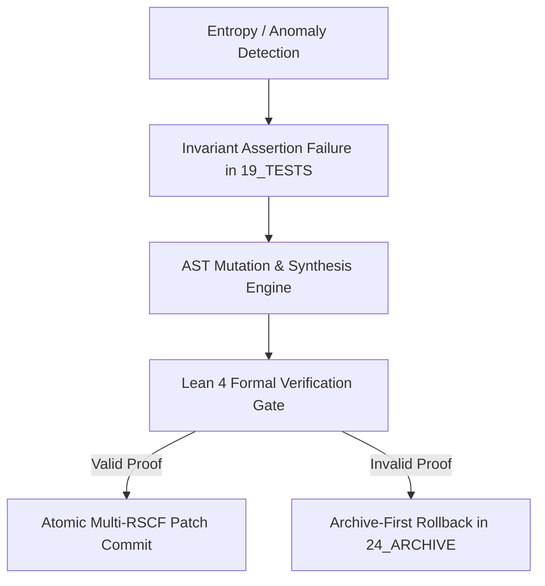

# Metamorphic Self-Repair and AST Mutation Runtime Engine

## 1. Engine Specification
Executes automated, invariant-preserving self-healing across vault notes, execution runtimes, and agent contracts upon detecting AST regressions or invariant violations.

## 2. SOTA Methods

### Metamorphic testing
- **Metamorphic relations**: define properties that should hold across multiple executions (e.g., "scaling input by k should scale output by k"); detects oracle problems where expected output is unknown
- **Metamorphic testing for AI/ML**: testing ML models via metamorphic relations (e.g., model prediction should be invariant to semantically-equivalent input perturbations); SMT+Metamorphic for neural network verification
- **Automated relation discovery**: LLM-assisted metamorphic relation generation; mining relations from code patterns and documentation

### AST mutation and synthesis
- **AST-level mutations**: syntactic transformations preserving semantic equivalence (e.g., loop unrolling, dead code elimination, expression simplification)
- **Equivalence checking**: SMT solver-based semantic equivalence (Z3/CVC5); differential testing for non-equivalence detection
- **Program synthesis**: sketch-based synthesis (Solar-Lezama); type-driven synthesis; LLM-assisted code synthesis with formal verification gates
- **AST diff**: GumTree, Difftastic for structural code differencing; semantic diff via symbolic execution

### Self-healing systems
- **Autonomic computing**: MAPE-K loop (Monitor → Analyze → Plan → Execute over Knowledge); IBM autonomic computing framework
- **Self-repair patterns**: checkpoint-rollback, hot-swap, shadow deployment, canary verification; genetic algorithms for adaptive repair
- **AI-assisted repair**: automated program repair (APR) via LLMs (Codex/GPT-4/Claude); pattern-based repair; mutation-based repair
- **Verification-gated repair**: every repair must pass formal verification before deployment; Lean 4 / Coq / Dafny proof obligations

### Invariant preservation
- **Runtime invariant checking**: contract-based programming (DbC); runtime assertion checking; continuous invariant monitoring
- **Formal invariant verification**: Lean 4 kernel proofs for critical invariants; SMT-based discharge for simpler properties
- **Invariant recovery**: when invariant violation detected → halt → diagnose → repair → verify → resume; never continue with violated invariants

## 3. AMOS Integration

- **L10 failure recovery**: [[01_CANON/01_CORE_LAWS/L10_FAILURE_RECOVERY|L10 failure recovery]] — rollback window and recovery protocols
- **L22 replayability**: [[01_CANON/01_CORE_LAWS/L22_REPLAYABILITY|L22 deterministic replayability]] — every repair must be replayable
- **L27 gap law**: [[01_CANON/01_CORE_LAWS/L27_GAP_LAW|L27 gap law]] — gaps must be exposed, not filled
- **Audit & repair master**: [[07_SKILLS/amos-audit-repair-master/SKILL|audit-repair master]] — repair allocation and prioritization
- **Lean 4 kernel**: [[02_KERNEL/LEAN4_FORMAL_KERNEL|Lean4 formal kernel]] — formal verification gate
- **Cognitive organism**: [[05_COGNITIVE_ORGANISM/05_COGNITIVE_ORGANISM_MOC|05_COGNITIVE_ORGANISM MOC]] — homeostasis and repair
- **Runtime pipeline**: [[04_RUNTIME/04_RUNTIME_MOC|04_RUNTIME MOC]] — execution and repair stages

## 4. Invariants

1. `REPAIR_PROPOSED != REPAIR_VERIFIED` — proposed repairs must pass formal verification before deployment
2. Every repair must preserve existing invariants — no repair may introduce new invariant violations
3. Every repair must be reversible within the rollback window (L10)
4. Every repair must be deterministic and replayable (L22)
5. Gaps must be exposed, not filled with unverified content (L27)
6. Archive-first: preserve original state before repair; rollback path must exist
7. `CAPABILITY != AUTHORITY` — the ability to repair does not grant authority to deploy

## 5. Integration Links
- **Organism Homeostasis**: [[05_COGNITIVE_ORGANISM/16_REPAIR/BIOLOGICAL_ENTROPY_CORRECTION]]
- **Formal Gate**: [[02_KERNEL/LEAN4_INVARIANT_PROVER_ENGINE]]
- **Operations Ledger**: [[20_OPERATIONS/20_OPERATIONS_MOC]]
