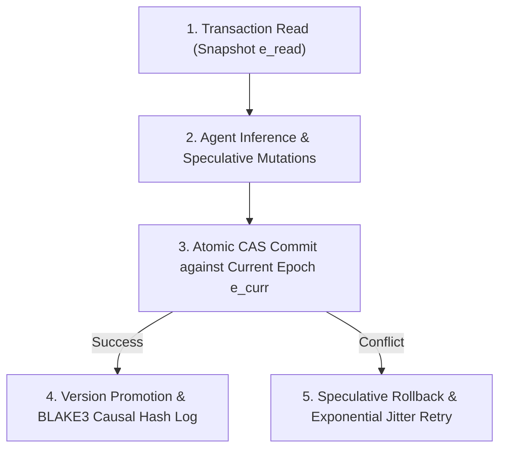

# MVCC Causal Concurrency & Epoch Finalization Specification

**Origin Architect / Steward:** Trang Phan
**AMOS_CORE Target:** `v4.4`
**Epistemic Class:** `AMOS_MODEL`

---

## 1. Concurrency Architecture & Snapshot Isolation

The AMOS Multi-Version Concurrency Control (MVCC) engine coordinates concurrent read and write operations across distributed cognitive agents without global blocking synchronization.

### Mathematical Model (Causal Partial Ordering & Visibility)
Let $\mathcal{T} = \{T_1, T_2, \dots\}$ be the set of transactions and $\to_{\text{causal}}$ the strict partial order of Lamport causal precedence. For state node $X$ with versions $X_{v_1}, X_{v_2}, \dots$ stamped with causal epochs $e(v)$:
1. **Read Visibility Rule**: Transaction $T_k$ with read epoch $e_{\text{read}}(T_k)$ reads version $X_{v_i}$ satisfying:
   $$v_i = \arg\max_{v} \{ e(v) \mid e(v) \le e_{\text{read}}(T_k) \land \text{Committed}(X_v) \}$$
2. **First-Committer-Wins Invariant**: For concurrent transactions $T_a, T_b$ with overlapping write-sets $W(T_a) \cap W(T_b) \ne \emptyset$:
   $$\text{Commit}(T_a) \implies \text{Abort}(T_b) \quad \text{if } e_{\text{read}}(T_b) < e_{\text{commit}}(T_a)$$
3. **Causal Monotonicity**: If $T_a \to_{\text{causal}} T_b$, then $e_{\text{commit}}(T_a) < e_{\text{commit}}(T_b)$.

---

## 2. Epoch Finalization & Multi-Version Garbage Collection

1. **Monotonic Epoch Progression**: Global epoch $e \in \mathbb{N}$ increments strictly monotonically upon successful multi-RSCF batch commits.
2. **Safe Version Garbage Collection (Epoch Vacuuming)**: A version $X_v$ is eligible for vacuum reclamation if and only if:
   $$e(v) < \min_{T \in \text{ActiveTransactions}} \{ e_{\text{read}}(T) \}$$
   guaranteeing zero phantom reads and zero dangling pointers for active speculative threads.

---

## 3. Shard-Local Finalization & Causal Epoch Finality

AMOS Runtime partitions the cognitive state space into shards, each with independent local finalization authority within its key range. Cross-shard coordination is mediated by the causal epoch finality protocol.

### Shard-Local Finalization Contract

Each shard $S_i$ maintains a local commit log $\mathcal{L}_i$ with monotonically increasing local sequence numbers $seq_i$. A transaction $T$ touching shards $\{S_1, \dots, S_k\}$ follows the two-phase finalization:

1. **Phase 1 — Local Prepare**: Each shard $S_i$ validates $T$ against its local state at epoch $e_{\text{read}}(T)$ and writes a prepared record to $\mathcal{L}_i$ with local seq $seq_i(T)$.
2. **Phase 2 — Causal Epoch Commit**: A global coordinator (or the originating agent) computes the commit epoch:
   $$e_{\text{commit}}(T) = \max_{i \in \text{shards}(T)} \{ seq_i(T) \} + \Delta_{\text{causal-order}}$$
   where $\Delta_{\text{causal-order}} \ge 1$ ensures strict causal ordering. All shards atomically promote $T$ from prepared to committed at $e_{\text{commit}}(T)$.

### Causal Consistency Across Shards

For any two committed transactions $T_a, T_b$ where $T_a \to_{\text{causal}} T_b$:
- If $T_a$ and $T_b$ touch overlapping shards, then $e_{\text{commit}}(T_a) < e_{\text{commit}}(T_b)$ on every overlapping shard.
- If $T_a$ and $T_b$ touch disjoint shard sets, causal consistency is preserved by the transitive visibility rule: any $T_c$ that reads-from $T_a$ must observe $T_a$'s commit before $T_c$'s own commit.

---

## 4. Proof-Based Coordination Avoidance

AMOS Runtime employs proof-based coordination avoidance (CALM theorem) to skip distributed consensus for transactions that are provably commutative.

### Commutativity Proof Obligation

For a transaction $T$ to bypass global coordination, it must present a commutativity proof $\pi_T$ demonstrating:
$$\forall T' \in \text{Concurrent}(T): \text{Apply}(T, T') = \text{Apply}(T', T)$$

where $\text{Apply}$ denotes the state transition function. The proof $\pi_T$ is checked locally by each shard before accepting the uncoordinated commit.

### CALM Theorem Application

By the CALM (Consistency As Logical Monotonicity) theorem, a transaction is coordination-free if and only if its effect is monotone — i.e., adding new concurrent transactions cannot invalidate its output. AMOS Runtime classifies transactions into:

| Class | Coordination Required | Example |
| :--- | :--- | :--- |
| **Monotone** (CRDT-class) | No | Append-only memory writes, counter increments |
| **Non-monotone** (conflict-class) | Yes (first-committer-wins) | RSCF node mutation, authority transfer |
| **Proof-certified** | No (with proof $\pi_T$) | Proven-commutative state transitions |

---

## 5. Replay, Rollback & Recovery

### Deterministic Replay

Every committed transaction carries a BLAKE3 causal hash $h(T) = \text{BLAKE3}(\text{payload}(T) \| e_{\text{commit}}(T) \| h_{\text{prev}})$, forming a tamper-evident chain. Replay reconstructs state from genesis by re-applying transactions in causal order:
$$\text{State}(e_n) = \text{Fold}(\text{Sort}_{\text{causal}}(\{T \mid e_{\text{commit}}(T) \le e_n\}), \text{Apply})$$

### Rollback Basin $M_0$

The rollback basin $M_0$ is the last verified-consistent epoch. Rollback to $M_0$ is always safe and preserves:
- All committed transactions with $e_{\text{commit}} \le e(M_0)$.
- The causal hash chain up to $h(M_0)$.
- The RSCF provenance graph up to $e(M_0)$.

### Crash Recovery Protocol

On shard crash, the recovery sequence is:
1. **WAL Replay**: Re-apply prepared but uncommitted transactions from $\mathcal{L}_i$.
2. **Epoch Reconciliation**: Compare local epoch with peer shards; adopt the maximum epoch as the recovery point.
3. **Hash Verification**: Recompute the causal hash chain from $M_0$ to the recovery epoch; if mismatch, halt and escalate to steward.
4. **State Promotion**: Atomically promote the verified state as the new live state.

---

## 6. AMOS Full Brain OS MECE Mapping

| AMOS Field | This Specification's Role |
| :--- | :--- |
| **04_RUNTIME** | Primary plane — defines the concurrency, epoch, and finalization model |
| **03_CONTROL_PLANE** | Authority gate for epoch promotion and shard assignment |
| **12_STATE** | Provides the distributed snapshot (Chandy-Lamport) and CAS epoch engine |
| **02_KERNEL** | Deterministic execution core that enforces causal ordering invariants |
| **10_MEMORY** | Episodic memory substrate that persists the transaction log |
| **17_OBSERVABILITY** | Distributed epistemic tracing captures causal DAG spans for audit |
| **19_TESTS** | Metamorphic and invariant testing validate concurrency invariants |

---

## 7. Invariants & Firewalls

1. **Causal Monotonicity Firewall**: No transaction may commit at an epoch lower than any transaction it causally depends on. Violation → `CRITICAL_GAP`, halt.
2. **First-Committer-Wins Firewall**: No two concurrent transactions with overlapping write-sets may both commit. Violation → `INTEGRITY_GAP`, rollback to $M_0$.
3. **Hash Chain Integrity Firewall**: The BLAKE3 causal hash chain must be continuous from genesis to the current epoch. Break → `PROVENANCE_GAP`, halt and escalate.
4. **Shard Autonomy Boundary**: A shard may only finalize transactions within its key range. Cross-shard effects require the two-phase protocol. Violation → `SCOPE_VIOLATION`.
5. **No-Phantom-Read Guarantee**: Garbage collection may only reclaim versions older than the minimum active read epoch. Violation → `PHANTOM_READ`, rollback.

---

## 8. Gaps & Falsifiers

| ID | Gap / Falsifier | Status |
| :--- | :--- | :--- |
| G1 | End-to-end governed OS implementation with this concurrency model is `NOT_ESTABLISHED` — the specification exists but executable closure is not proven. | `UNKNOWN/GAP` |
| G2 | Proof-based coordination avoidance depends on the ability to generate commutativity proofs $\pi_T$; the proof generator is `NOT_IMPLEMENTED`. | `UNKNOWN/GAP` |
| G3 | Crash recovery assumes WAL durability on FUSE/Google Drive filesystem; write durability on network-mounted filesystems is `CONDITIONAL`. | `CONDITIONAL` |
| F1 | If two concurrent transactions with overlapping write-sets both commit, the causal consistency invariant is falsified. | `FALSIFIER` |
| F2 | If the causal hash chain has a gap, the tamper-evidence property is falsified. | `FALSIFIER` |

---

**Related:** [[04_RUNTIME/RUNTIME_RUNTIME_CONTRACT|RUNTIME_RUNTIME_CONTRACT]] · [[12_STATE/DISTRIBUTED_SNAPSHOT_AND_CAS_EPOCH_ENGINE|DISTRIBUTED_SNAPSHOT_AND_CAS_EPOCH_ENGINE]] · [[03_CONTROL_PLANE/09_COMMIT/CAUSAL_EPOCH_FINALITY|CAUSAL_EPOCH_FINALITY]] · [[03_CONTROL_PLANE/09_COMMIT/SHARD_LOCAL_FINALIZATION|SHARD_LOCAL_FINALIZATION]] · [[03_CONTROL_PLANE/09_COMMIT/PROOF_BASED_COORDINATION_AVOIDANCE|PROOF_BASED_COORDINATION_AVOIDANCE]]

**MOC:** [[04_RUNTIME/04_RUNTIME_MOC|04_RUNTIME_MOC]] · [[00_ROOT/00_HOME|00_HOME]]

**Trang Framework:** [[11_KNOWLEDGE/TRANG_FRAMEWORK_RECURSIVE_ONTOLOGY_DYNAMICS|TRANG_FRAMEWORK_RECURSIVE_ONTOLOGY_DYNAMICS]]
