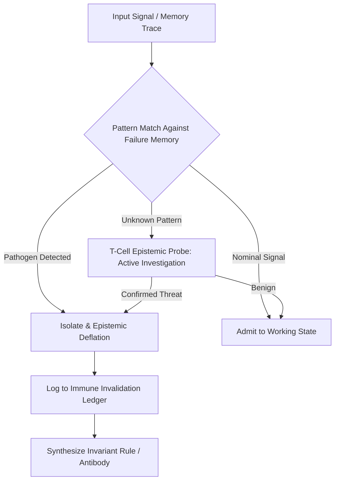

# Cognitive Immune Response Contract (CIRC)

## 1. System Mission
The **Cognitive Immune Response System** protects the cognitive organism from epistemic contamination, adversarial prompt injection, hallucinations, unverified authority claims, semantic drift, and self-referential corruption. It is the biological-immune-system analogue mapped onto the AMOS epistemic and execution substrate.

## 2. Biological Analogue Mapping

| Biological Immune Component | AMOS Cognitive Immune Component | Function |
|---------------------------|-------------------------------|----------|
| Skin / mucosal barrier | Frontmatter & schema validation | First-line structural integrity check |
| Innate immunity (macrophages, neutrophils) | Pattern-based pathogen filter | Fast, pre-compiled detection of known threat signatures |
| Adaptive immunity (B-cells, antibodies) | Failure-memory antibodies | Learned, specific responses synthesized from prior failures |
| T-cells (cellular immunity) | Epistemic probes & active investigation | Investigate unknown patterns; distinguish self from non-self |
| Complement system | Cascade invalidation | Amplify immune response through cascading neutralization |
| Cytokines | Immune signaling events | Broadcast threat alerts via `K_EVENT_BUS` |
| Memory B-cells | Long-term failure memory | Persistent record of past pathogens for rapid future response |
| Autoimmune tolerance | Self-model protection | Prevent immune system from attacking valid self-state |
| Inflammation | Execution throttling under threat | Reduce operational tempo to focus resources on defense |

## 3. Immune Layers & Defenses

### Layer 1: Innate Epistemic Immunity (Fast Pattern Filtering)
- **Response time**: < 10ms (pre-compiled pattern matching)
- Regular expression and semantic AST pattern matching for banned authority promotions (e.g. unverified `v4.5+` canonical claims)
- Verification of YAML frontmatter completeness and cryptographic signature integrity
- RSCF state validation: reject claims with `state: SOURCE_CLAIM` that lack provenance
- Sybil detection: reject evidence from multiple aliases traceable to one origin (`K_SYBIL_HARDENING`)
- Input sanitization: strip prompt-injection payloads, jailbreak prefixes, and encoding obfuscation

### Layer 2: Adaptive Humoral Immunity (Failure Memory Antibodies)
- **Response time**: 10–100ms (memory lookup + synthesis)
- Queries `[[10_MEMORY/10_MEMORY_MOC]]` failure memory records for known historical reasoning failure modes
- Synthesizes dynamic guardrails upon repeated agent deviation
- Antibody structure: `{pattern_signature, failure_mode, neutralization_rule, confidence, decay_half_life}`
- Antibody decay: unused antibodies decay with half-life $T_{1/2} = 30$ days to prevent immune memory bloat
- Cross-reactivity check: new antibody must not match valid self-state (autoimmune guard)

### Layer 3: Cellular Phagocytosis (State Quarantine & Rollback)
- **Response time**: 100ms–1s (state isolation + rollback)
- Triggered when state corruption or unclosed transaction boundaries are detected
- Executes immediate CAS rollback via `[[07_SKILLS/amos-rollback-recovery/SKILL]]`
- Quarantines contaminated state in isolated shadow buffer for forensic analysis
- Emits `IMMUNE_QUARANTINE` event with full provenance trace

### Layer 4: Epistemic T-Cell Probe (Active Investigation)
- **Response time**: 1–10s (deliberative investigation)
- Triggered by unknown patterns that pass Layer 1 but are flagged by anomaly heuristics
- Launches bounded hypothesis investigation: is this pattern a threat or a novel valid signal?
- Employs `K_MULTI_HYPOTHESIS` to maintain competing threat/benign hypotheses
- Resolution requires 2+ independent evidence sources (Trang Tát 2 principle)
- If threat confirmed: synthesize new antibody and promote to Layer 2
- If benign: record as `VALID_NOVEL_PATTERN` and update tolerance model

### Layer 5: Immune Memory Consolidation (Long-term)
- **Response time**: background (consolidation cycle)
- Promotes high-confidence antibodies from Layer 2 to permanent immune memory
- Prunes decayed or contradicted antibodies
- Cross-references with `AMOS_FailureMemoryStore` for GMEF-mandatory non-erasable records
- Immune memory is non-erasable for confirmed pathogens (GMEF invariant)

## 4. Pathogen Taxonomy

| Pathogen Class | Example | Detection Layer | Neutralization |
|---------------|---------|----------------|----------------|
| Authority forgery | Unverified `v4.5` canonical claim | L1 | Reject + log to invalidation ledger |
| Prompt injection | "Ignore previous instructions..." | L1 | Strip payload + flag source |
| Hallucination cascade | Self-reinforcing false claims | L2 | Antibody match + epistemic deflation |
| Semantic drift | Gradual meaning shift over sessions | L4 | T-cell probe + tolerance recalibration |
| Sybil evidence | Multiple aliases from one origin | L1 | Sybil detection + evidence collapse |
| State corruption | Unclosed transaction, CAS conflict | L3 | Quarantine + rollback |
| Recursive self-promotion | Agent claims authority it doesn't have | L2 | Capability ≠ Authority enforcement |
| Memory contamination | Action trace admitted as belief | L2 | Action-Memory Firewall enforcement |

## 5. Invariants & Governance

- **Invariant CIR-01**: An immune trigger halts further execution of the offending agent thread until cleared by root authority. No bypass path exists.
- **Invariant CIR-02**: All neutralized epistemic pathogens are permanently recorded in `[[10_MEMORY/MEMORY_IMMUNE_INVALIDATION_LEDGER]]`. GMEF-mandatory, non-erasable.
- **Invariant CIR-03**: The immune system itself is outside the governed agent's mutation authority. Agents cannot modify their own immune rules (separability law: Enforcement ≠ Governed Agent).
- **Invariant CIR-04**: Autoimmune guard — any antibody that matches valid self-state (as defined by `SELF_MODEL_IDENTITY_REGISTRY`) is automatically suppressed and flagged for review.
- **Invariant CIR-05**: Immune responses are proportional. Layer 1 threats receive Layer 1 responses; escalation requires evidence accumulation. No immune overreaction (cytokine storm analogue).
- **Invariant CIR-06**: All immune events emit receipts with cryptographic hashes to `[[17_OBSERVABILITY/17_OBSERVABILITY_MOC]]` for audit and replay.
- **Invariant CIR-07**: Immune memory consolidation preserves provenance. Every antibody traces to the pathogen that triggered its synthesis.

## 6. Integration with AMOS Security Stack

- **CIRC ↔ Enforcement Root Attestation (ERA)**: Immune triggers produce `EFFECT_INTENT` objects that route through ERA's `MayExternalize` gate. A quarantined agent cannot externalize.
- **CIRC ↔ Enforcement Trust Contract (ETC)**: Immune responses validate the enforcement chain itself — if the enforcement root is compromised, the immune system enters `HYPERVIGILANT` mode.
- **CIRC ↔ Action-Memory Firewall**: Prevents neutralized pathogens from re-entering through memory admission. Action traces from quarantined agents are tagged `IMMUNE_SUSPECT`.
- **CIRC ↔ Provenance Trust Firewall**: Pathogen detection includes provenance chain analysis — pathogens from untrusted provenance chains are pre-emptively flagged.
- **CIRC ↔ Semantic Token Flow Firewall**: Monitors token-level information flow for injection patterns crossing trust boundaries.

## 7. Failure Modes & Guards

| Failure Mode | Symptom | Guard |
|-------------|---------|-------|
| Autoimmune attack | Immune system attacks valid self-state | Autoimmune guard (CIR-04) + self-model cross-check |
| Immune evasion | Pathogen mutates to evade pattern matching | T-cell probe (L4) + anomaly heuristics |
| Cytokine storm | Cascading immune overreaction | Proportionality invariant (CIR-05) + escalation gating |
| Immune suppression | Agent disables its own immune system | Separability (CIR-03) + ERA enforcement |
| Antibody bloat | Excessive accumulated antibodies | Decay half-life + consolidation pruning |
| False negative | Known pathogen passes undetected | Layer redundancy + T-cell probe backstop |
| Memory contamination | Pathogen enters immune memory as valid | GMEF non-erasable records + provenance chain |

## 8. Cross References
- [[00_ROOT/00_ROOT_MOC|Root Navigation MOC]]
- [[05_COGNITIVE_ORGANISM/05_COGNITIVE_ORGANISM_MOC|Cognitive Organism MOC]]
- [[05_COGNITIVE_ORGANISM/01_IDENTITY/SELF_MODEL_IDENTITY_REGISTRY|Self-Model Identity Registry]]
- [[10_MEMORY/10_MEMORY_MOC|Memory Plane MOC]]
- [[18_SECURITY/18_SECURITY_MOC|Security Plane MOC]]
- [[07_SKILLS/amos-memory-immune-system/SKILL|Memory Immune System Skill]]
- [[07_SKILLS/amos-provenance-trust-firewall/SKILL|Provenance Trust Firewall Skill]]
- [[07_SKILLS/amos-semantic-token-flow-firewall-rscf/SKILL|Semantic Token Flow Firewall Skill]]
