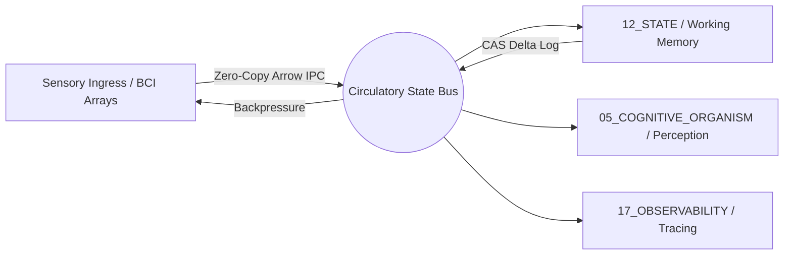

# Dynamic Information Flow Specification (DIFS)

## 1. Subsystem Mission
The **Circulatory Information Flow Subsystem** serves as the vascular network of the cognitive organism, routing high-throughput sensory streams, telemetry envelopes, memory access requests, and cross-engine notifications through zero-copy Arrow IPC shared memory buses and ZeroMQ message fabrics. It is the biological circulatory system analogue: every cognitive organ depends on it for nutrient (information) delivery and waste (stale state) removal.



## 2. Biological Analogue Mapping

| Biological Circulatory Component | AMOS Information Flow Component | Function |
|--------------------------------|-------------------------------|----------|
| Heart (pump) | Event bus dispatcher | Drives periodic information pulses through the system |
| Arteries (oxygenated outflow) | High-priority event channels | Route actionable signals to cognitive organs |
| Veins (deoxygenated return) | Telemetry & state feedback channels | Return observation/results to central state |
| Capillaries (diffusion) | Zero-copy shared memory | Fine-grained inter-process data exchange |
| Blood plasma | Information payload envelope | Carries typed data with provenance metadata |
| Red blood cells (oxygen) | Fresh observations/evidence | Deliver new epistemic content to organs |
| White blood cells | Immune-tagged signals | Circulate immune alerts (see CIRC) |
| Blood-brain barrier | Trust boundary filter | Filters information crossing trust domains |
| Blood pressure | Backpressure signal | Regulates flow when capacity is exceeded |
| Clotting | Transaction commit boundary | Seals completed state transitions |
| Hemostasis | Quiescent state | Stops information flow during crash/recovery |

## 3. Flow Topologies & Protocol Buffers

### 3.1 IPC Bus Throughput Requirements
- **Bandwidth**: Sustained throughput $> 10\text{ GB/s}$ for multi-channel intracortical neural data
- **Latency**: Sub-millisecond ($< 500\mu\text{s}$) inter-process synchronization using memory-mapped ring buffers
- **Buffer depth**: Configurable per-channel, default 4096 envelopes; overflow triggers backpressure
- **Serialization**: Apache Arrow columnar format for batch telemetry; Protocol Buffers for control messages

### 3.2 Channel Topology

| Channel | Direction | Priority | Payload Type | QoS |
|---------|-----------|----------|-------------|-----|
| `sensory.ingress` | Sensory → Bus | REALTIME | Multi-modal observation tensors | Guaranteed delivery, < 1ms |
| `perception.feed` | Bus → Perception | REALTIME | Raw observation batches | Best-effort, drop-ok |
| `state.delta` | State → Bus | HIGH | CAS delta logs | Guaranteed, ordered |
| `memory.access` | Organs → Memory | HIGH | Read/write requests | Guaranteed, transactional |
| `telemetry.trace` | All → Observability | MEDIUM | Span/event records | Best-effort, sampled |
| `immune.alert` | Immune → All | CRITICAL | Pathogen alert | Guaranteed, broadcast |
| `control.command` | Control Plane → Organs | HIGH | Mode transition / throttle | Guaranteed, ordered |
| `evidence.commit` | Reasoning → Memory | MEDIUM | Evidence atoms | Guaranteed, idempotent |

### 3.3 Routing Invariants
- **FIFO Determinism**: Messages within a causal epoch preserve strict total ordering. Cross-epoch ordering is not guaranteed.
- **No Dropped Telemetry**: If buffer capacity exceeds 85%, backpressure is applied upstream to prevent silent event dropping. At 95%, the system enters `DEGRADED_FLOW` mode.
- **Causal Epoch Integrity**: All messages carry an epoch ID; messages from superseded epochs are routed to archive, not to active organs.
- **Trust Boundary Filtering**: Information crossing trust domains (e.g. external → internal, agent → kernel) passes through the blood-brain barrier filter which validates provenance and strips untrusted metadata.

## 4. Backpressure & Flow Control

### 4.1 Multi-Level Backpressure
```
NORMAL (0-70% buffer)     → Full throughput, no throttling
ELEVATED (70-85%)          → Upstream producers notified to reduce rate
HIGH (85-95%)              → Non-critical channels throttled 50%; critical channels unaffected
DEGRADED (95-99%)          → All channels throttled; only CRITICAL priority passes
CRITICAL (>99%)            → Flow freeze; only immune.alert and control.command pass
```

### 4.2 Adaptive Flow Regulation
The circulatory governor adjusts channel bandwidth allocation based on organ demand and metabolic budget:

$$B_c(t) = B_{\text{total}}(t) \cdot \frac{D_c(t) \cdot W_c}{\sum_{c'} D_{c'}(t) \cdot W_{c'}}$$

where $B_c$ is allocated bandwidth for channel $c$, $D_c$ is demand, and $W_c$ is priority weight. CRITICAL channels have $W = \infty$ (preemptive).

## 5. Information Envelope Structure

Every circulating information packet carries:

```yaml
envelope:
  envelope_id: <uuid>
  epoch_id: <causal_epoch>
  channel: <channel_name>
  priority: REALTIME|HIGH|MEDIUM|LOW|CRITICAL
  source:
    organ: <originating_organ>
    agent_id: <agent_or_null>
    provenance_chain: <hash_chain>
  payload:
    type: <payload_type>
    data: <arrow_batch_or_protobuf>
    epistemic_class: OBSERVATION|EVIDENCE|MODEL|DECISION|DERIVED
    rscf_state: SOURCE_CLAIM|DERIVED|MODEL|...
  integrity:
    hash: <sha256>
    signature: <ed25519>
  timing:
    created_ts: <monotonic_ns>
    deadline: <monotonic_ns_or_null>
```

## 6. Zero-Copy Memory Architecture

### 6.1 Arrow IPC Shared Memory
- Each channel maps to a named shared memory segment (`/amos_channel_<name>`)
- Producers write Arrow record batches directly into ring buffer slots
- Consumers read via memory-mapped pointers — no serialization/deserialization
- Slot lifecycle: `EMPTY → WRITING → READY → READING → EMPTY`
- CAS-based slot transition prevents concurrent access corruption

### 6.2 ZeroMQ Control Fabric
- Control messages (mode transitions, throttle commands) use ZeroMQ PUB/SUB
- Subscriber-side filtering by channel and priority
- Guaranteed delivery for CRITICAL priority via dealer-router pattern with acknowledgment

## 7. Failure Modes & Guards

| Failure Mode | Symptom | Guard |
|-------------|---------|-------|
| Buffer overflow | Silent message drops | Backpressure (§4) + 85% threshold |
| Epoch bleed | Messages from old epoch processed | Epoch ID validation at every consumer |
| Trust boundary breach | Untrusted data enters internal organs | Blood-brain barrier filter + provenance validation |
| Channel starvation | Low-priority channel never gets bandwidth | Minimum bandwidth guarantee per channel |
| Deadlock | Circular backpressure dependency | Topological sort of channel dependencies + cycle detection |
| Memory corruption | Concurrent slot access | CAS-based slot transition (L23 MVCC/CAS law) |
| Envelope forgery | Fake envelope with bad signature | Ed25519 signature verification at trust boundary |

## 8. Cross References
- [[00_ROOT/00_ROOT_MOC|Root Navigation MOC]]
- [[05_COGNITIVE_ORGANISM/05_COGNITIVE_ORGANISM_MOC|Cognitive Organism MOC]]
- [[05_COGNITIVE_ORGANISM/01_IMMUNE_SYSTEM/COGNITIVE_IMMUNE_RESPONSE_CONTRACT|Cognitive Immune Response]]
- [[12_STATE/12_STATE_MOC|State Plane MOC]]
- [[15_INTERFACES/15_INTERFACES_MOC|Interfaces Plane MOC]]
- [[17_OBSERVABILITY/17_OBSERVABILITY_MOC|Observability Plane MOC]]
- [[07_SKILLS/amos-k-event-bus/SKILL|K Event Bus Skill]]
- [[07_SKILLS/amos-adaptive-stability-balancer/SKILL|Adaptive Stability Balancer Skill]]
