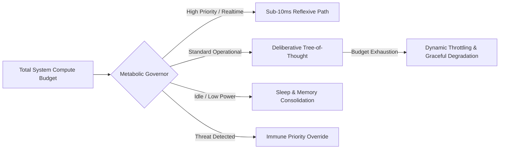

# Compute & Energy Regulation Contract (CERC)

## 1. System Overview
The **Metabolic Compute & Energy Regulation Subsystem** manages token consumption, GPU compute allocations, memory footprint, and CPU cycles across all autonomous processes in AMOS. It is the biological metabolism analogue: it converts available compute resources into cognitive work while maintaining energy homeostasis and preventing resource exhaustion collapse.

## 2. Biological Analogue Mapping

| Biological Metabolic Component | AMOS Compute/Energy Component | Function |
|-------------------------------|------------------------------|----------|
| ATP (energy currency) | Compute tokens / GPU cycles | Universal unit of cognitive work |
| Glycolysis (fast, inefficient) | Fast model routing | Quick, low-quality responses for reflexive tasks |
| Oxidative phosphorylation (slow, efficient) | Deep reasoning model routing | High-quality, expensive reasoning for complex tasks |
| Metabolic rate | Compute throughput | Rate of cognitive work per unit time |
| Basal metabolic rate | Idle/sleep compute | Minimum compute to maintain organism (memory consolidation, monitoring) |
| Caloric intake | Compute budget allocation | External resource provisioning |
| Fat reserves | Compute budget reserves | Buffered capacity for burst workloads |
| Lactic acid buildup | Token budget exhaustion | Byproduct of sustained high-intensity work |
| Oxygen debt | Deferred compute backlog | Work owed after burst period ends |
| Mitochondria | GPU/accelerator cores | Primary energy-conversion organelles |
| Enzyme regulation | Dynamic model routing | Selective activation of processing pathways |
| Fever | Immune priority override | Redirect resources to defense under threat |

## 3. Metabolic Control Invariants

### 3.1 Token Consumption Limits
- Every agent invocation is bounded by max input token window $\mathcal{T}_{\text{in}}$ and generation ceiling $\mathcal{T}_{\text{out}}$
- Recursive multi-agent task chains are hard-throttled at $K_{\text{max}} = 10$ iterations without explicit external authority top-up
- Per-session token budget: $\mathcal{T}_{\text{session}} = \mathcal{T}_{\text{base}} + \mathcal{T}_{\text{topup}} - \sum_{i} \mathcal{T}_{\text{used},i}$
- Budget exhaustion triggers `METABOLIC_THROTTLE` event, not silent failure

### 3.2 Energy Efficiency & Temperature Scaling
Dynamic model routing switches between low-parameter fast models (for sensory classification) and high-parameter reasoning models (for causal proof synthesis), optimizing compute efficiency:

$$\eta = \frac{\Delta \text{Information Gain}}{\text{Tokens Consumed} \times \text{Latency (ms)}}$$

The metabolic governor maintains a rolling window efficiency score per agent and per task class. Agents with $\eta < \eta_{\min}$ for $> 5$ consecutive invocations are flagged for optimization or retirement.

### 3.3 Metabolic State Machine

| State | Trigger | Behavior | Compute Allocation |
|-------|---------|----------|-------------------|
| `ACTIVE` | Normal operation | Full cognitive capacity | 100% budget |
| `ELEVATED` | Budget > 70% consumed | Priority routing only | 80% budget, background tasks paused |
| `THROTTLED` | Budget > 85% consumed | Reflexive + critical only | 50% budget, deliberation queued |
| `DEGRADED` | Budget > 95% consumed | Critical only | 20% budget, all else deferred |
| `FASTING` | Low workload detected | Memory consolidation mode | 10% budget, consolidation active |
| `SLEEP` | Idle > 5 min | Minimal maintenance | 5% budget, immune monitoring only |
| `FRENZY` | Immune CRITICAL alert | All resources to defense | 90% to immune, 10% to vital functions |

### 3.4 Metabolic Budget Formula

The total metabolic budget $B_{\text{total}}$ is partitioned across organs by demand and priority:

$$B_{\text{total}}(t) = B_{\text{basal}} + B_{\text{active}}(t) + B_{\text{reserve}}(t)$$

$$B_{\text{organ},i}(t) = B_{\text{active}}(t) \cdot \frac{D_i(t) \cdot P_i(t)}{\sum_j D_j(t) \cdot P_j(t)}$$

where $D_i$ is organ $i$'s demand, $P_i$ is its priority weight, $B_{\text{basal}}$ is the non-negotiable maintenance budget, and $B_{\text{reserve}}$ is the emergency buffer (minimum 10% of total).

## 4. Model Routing & Energy Tiers

| Tier | Model Class | Latency Target | Token Cost | Use Case |
|------|-----------|---------------|-----------|----------|
| T0 — Reflex | Tiny/fast model | < 50ms | 100–500 tokens | Sensory classification, pattern match |
| T1 — Reactive | Small model | < 500ms | 500–2K tokens | Quick response, routing decision |
| T2 — Standard | Medium model | < 5s | 2K–8K tokens | Normal reasoning, tool use |
| T3 — Deliberative | Large model | < 60s | 8K–32K tokens | Complex reasoning, multi-step proof |
| T4 — Deep | Frontier model + extended thinking | < 600s | 32K–200K tokens | Causal synthesis, architecture design |
| T5 — Ultra-deep | Frontier model + multi-agent ensemble | < 3600s | 200K+ tokens | System-level redesign, canon revision |

Routing rules:
- Default tier is T2 unless task classification demands otherwise
- Tier escalation requires evidence of insufficient lower-tier capability (not just preference)
- Tier de-escalation triggers when efficiency $\eta$ drops below threshold
- T4/T5 require explicit authority approval (M2+ mutation class)

## 5. GPU/Accelerator Allocation

### 5.1 Hardware-Aware Scheduling
- GPU memory partitioning: each cognitive organ receives a guaranteed minimum allocation
- Batch scheduling: co-locate compatible workloads (e.g. perception + prediction on same GPU)
- Preemption: CRITICAL priority (immune, safety) can preempt any non-critical workload
- Accelerator affinity: neuromorphic/photonic accelerators (Loihi, Akida, photonic tensor cores) get spiking/SNN workloads; GPUs get dense transformer workloads

### 5.2 Energy-Proportional Computing
$$E_{\text{total}} = E_{\text{compute}} + E_{\text{memory}} + E_{\text{network}} + E_{\text{idle}}$$

The governor minimizes $E_{\text{idle}}$ by consolidating workloads and powering down unused accelerators. Sleep mode reduces $E_{\text{total}}$ by ~90% vs. active.

## 6. Failure Modes & Guards

| Failure Mode | Symptom | Guard |
|-------------|---------|-------|
| Budget exhaustion | Agent runs out of tokens mid-task | Pre-flight budget check + graceful degradation to lower tier |
| Thermal runaway | Sustained 100% utilization | Mandatory cool-down period + T4/T5 suspension |
| Starvation | Low-priority organ never gets compute | Minimum allocation guarantee per organ |
| Hoarding | Agent reserves budget it doesn't use | Budget decay: unused allocation expires after 60s |
| Frenzy lock | Immune override never releases | Auto-release after 300s + authority review |
| Reserve depletion | Emergency buffer consumed | Hard stop on all non-critical work + alert |

## 7. Integration with AMOS Stack

- **CERC ↔ Token Budget Governance Skill**: CERC enforces the budgets declared by `amos-token-budget-governance`
- **CERC ↔ Adaptive Stability Balancer**: CERC's metabolic state machine feeds into stability regime selection
- **CERC ↔ UBI Framework**: Biological distress signals (tau < 0.2) trigger metabolic downshift
- **CERC ↔ GMEF**: Evolution proposals include metabolic cost estimates; high-cost proposals require authority
- **CERC ↔ Observability**: All budget allocations, throttling events, and tier transitions are traced

## 8. Cross References
- [[00_ROOT/00_ROOT_MOC|Root Navigation MOC]]
- [[05_COGNITIVE_ORGANISM/05_COGNITIVE_ORGANISM_MOC|Cognitive Organism MOC]]
- [[05_COGNITIVE_ORGANISM/15_HOMEOSTASIS/UBI_HOMEOSTASIS|UBI Homeostasis]]
- [[07_SKILLS/amos-token-budget-governance/SKILL|Token Budget Governance Skill]]
- [[07_SKILLS/amos-adaptive-stability-balancer/SKILL|Adaptive Stability Balancer Skill]]
- [[07_SKILLS/amos-evolution-budget-layer/SKILL|Evolution Budget Layer Skill]]
- [[17_OBSERVABILITY/17_OBSERVABILITY_MOC|Observability Plane MOC]]
