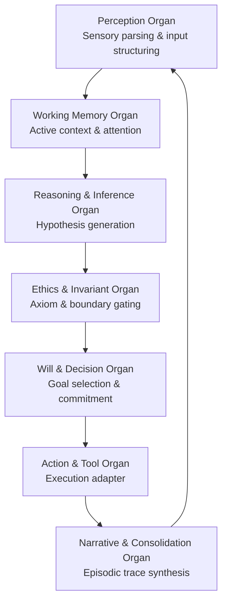

# 05_COGNITIVE_ORGANISM — Organ Coordination Architecture

## 1. Plane Purpose

The `05_COGNITIVE_ORGANISM` plane (**Partition C: Cognitive Capability & Orchestration**) models the Full Brain OS cognitive loop, organ coordination dynamics, and linguistic transformation engines.

This plane implements the biological metaphor of cognitive organs as modular, coordinated processing units. Each organ handles a distinct cognitive function, and the organism plane orchestrates their interaction through a structured perception-to-action loop with invariant gating at each stage.

```text
ORGANISM != CONSCIOUSNESS
MODEL != EMBODIED_BEING
COGNITIVE_LOOP != UNCHECKED_AGENCY
DOCUMENTED != IMPLEMENTED
```

---

## 2. Architecture Overview

The cognitive organism operates as a seven-organ pipeline with feedback loops. Each organ receives structured input from its predecessor, applies domain-specific processing, and passes output to the next organ. The Ethics Organ serves as a hard gate: no cognitive output may bypass ethical invariant checking.

---

## 3. Key Components

### 3.1 Seven Core Cognitive Organs



1. **Perception Organ**: Multi-modal token parsing, semantic normalization, and ambiguity identification. Transforms raw input into structured cognitive tensors.
2. **Memory Organ**: Retrieval and consolidation across the 4 memory tiers (working, episodic, semantic, procedural). Manages attention allocation and context window selection.
3. **Reasoning Organ**: Deductive, inductive, and abductive inference generation. Hosts the MURK 19-primitive Absolute Logic kernel and the 19x19 interaction matrix.
4. **Ethics Organ**: Hard boundary enforcement against harmful or unauthorized actions. Implements the non-compensatory refusal gates and capability-bound governance checks.
5. **Will Organ**: Goal prioritization, budget allocation, and intentional focus. Selects among competing action proposals based on multi-objective optimization.
6. **Action Organ**: Bounded tool execution via `14_TOOLS`. Routes actions through sandboxed adapters with capability-scoped permissions.
7. **Narrative Organ**: Synthesis of coherent self-audit logs and user-facing explanations. Consolidates episodic traces into the memory organ for future retrieval.

### 3.2 Cognitive Loop Invariants

- The Ethics Organ is non-bypassable: no output from the Reasoning Organ may reach the Will Organ without passing through ethical invariant gates.
- The Narrative Organ feeds back to the Perception Organ, creating a self-reflective loop that enables learning from prior episodes.
- Each organ transition produces a cryptographic receipt binding input, output, and processing context.

---

## 4. Navigation

- **Cognitive Organism MOC:** [[05_COGNITIVE_ORGANISM/05_COGNITIVE_ORGANISM_MOC|05_COGNITIVE_ORGANISM_MOC]]
- **BCI Wavefront Engine:** [[05_COGNITIVE_ORGANISM/AUTONOMOUS_BCI_WAVEFRONT_PHASE_SHAPING_AND_SLM_ENGINE|AUTONOMOUS_BCI_WAVEFRONT_PHASE_SHAPING_AND_SLM_ENGINE]]
- **BCI Execution Ledger:** [[05_COGNITIVE_ORGANISM/BCI_WAVEFRONT_SLM_EXECUTION_LEDGER|BCI_WAVEFRONT_SLM_EXECUTION_LEDGER]]
- **Cognitive Matrix:** [[25_COGNITIVE_MATRIX/25_COGNITIVE_MATRIX_MOC|25_COGNITIVE_MATRIX_MOC]]
- **Canon (Cognition):** [[01_CANON/03_COGNITION_CANON/FULL_BRAIN_OS_CANON|FULL_BRAIN_OS_CANON]]
- **Tools Plane:** [[14_TOOLS/14_TOOLS_MOC|14_TOOLS_MOC]]
- **Root Architecture:** [[00_ROOT/FULL_BRAIN_OS_MECE_ARCHITECTURE|FULL_BRAIN_OS_MECE_ARCHITECTURE]]

---

## 5. Status & Gaps

- **Status:** `ACTIVE_SPECIFICATION` — all seven organs are documented with defined interfaces and invariant gates.
- **Organ Implementation:** The organ architecture is a cognitive model specification. Mapping to concrete LLM-based or neurosymbolic implementations is `DOCUMENTED != IMPLEMENTED` for most organs.
- **BCI Integration:** The BCI Wavefront SLM engine is the most mature component, with execution ledger results verified. Other organs lack equivalent execution evidence.
- **MURK Integration:** The MURK 19-primitive reasoning kernel is integrated into the Reasoning Organ at the brain model level (`cosmo-brain/AMOS_MURK_BRAIN_INTEGRATION.py`), but vault-level specification of this integration is incomplete.
- **Memory Tier Implementation:** The four-tier memory system is specified. Procedural memory consolidation and episodic trace decay models are `UNKNOWN/GAP`.
