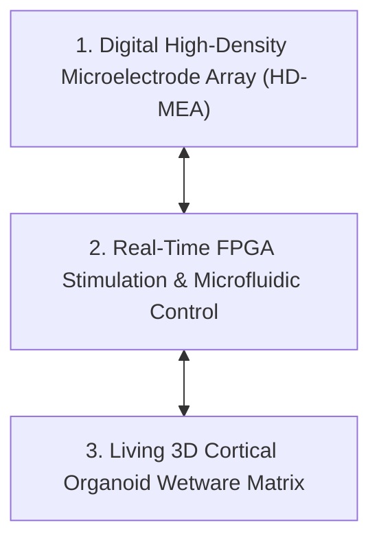
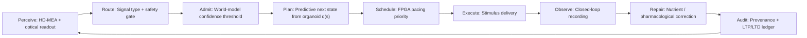

# Neural Organoid World Models & Collective Bioelectricity Architecture

**Origin Architect / Steward:** Trang Phan
**AMOS_CORE Target:** `v4.4`
**Epistemic Class:** `AMOS_MODEL`

---

## 1. Executive Summary & Biological Computing Substrate

This architecture defines the integration of **3D Neural Organoid-on-a-Chip Substrates** and **Collective Ion-Pump Bioelectricity** into the AMOS Cognitive Organism. Biological neural organoids act as wetware predictive world models, self-organizing continuous electrical representations through thermodynamic free energy minimization and closed-loop sensory feedback.

### Core Mathematical Model (Active Inference & Free Energy in Neural Organoids)
Organoid synaptic networks minimize variational free energy $\mathcal{F}$ over sensory observations $\mathbf{y}$ and latent environmental states $\mathbf{s}$:

$$\mathcal{F}(\mathbf{y}, q) = \mathbb{E}_{q(\mathbf{s})}[\ln q(\mathbf{s}) - \ln p(\mathbf{y}, \mathbf{s})] = D_{KL}(q(\mathbf{s}) \parallel p(\mathbf{s} \mid \mathbf{y})) - \ln p(\mathbf{y})$$

where $q(\mathbf{s})$ is the organoid's internal belief distribution.

### Collective Ion-Pump Bioelectricity Alignment
Cellular membrane voltage patterns $V(x, t)$ self-organize via collective pump-channel synchronization:

$$\frac{\partial V}{\partial t} = D_V \nabla^2 V + \frac{1}{C_m} \left( J_{\text{pump}}(V) - G_{\text{leak}}(V - V_0) \right) + \xi(x, t)$$

forming morphogenetic spatio-temporal bioelectric attractors that encode memory and developmental shape coordinates.

---

## 2. 3-Tier Bio-Digital Interface Architecture (MECE)

1. **High-Density Microelectrode Array (`HD-MEA-01`)**:
   - 26,400 planar electrodes recording at $20\text{ kHz}$ with spatial resolution of $17.5\mu\text{m}$.
2. **Closed-Loop Electrophysiological Pacing (`STIM-02`)**:
   - Adaptive biphasic current injection enforcing predictive world model training via embodied game environments.
3. **Microfluidic Nutrient & Neurochemical Homeostasis (`CHEM-03`)**:
   - Real-time regulation of glucose, lactate, oxygen, and neuromodulators (acetylcholine, glutamate).

---

## 3. Closed-Loop Training Curriculum

Drawing on the organoid-world-model framework, the AMOS organoid substrate is trained through three progressively complex embodied tasks:

| Task | Cognitive Demand | Feedback Regime |
|------|------------------|-----------------|
| Conditional Avoidance | Static state-action contingencies | Predictable = reward, unpredictable = punishment |
| Predator-Prey | Goal-directed interaction | Sensory encoding of target position; motor decoding from electrode groups A/B |
| Pong (continuous) | Dynamic continuous-time prediction | Reward for predicted ball trajectories; punishment for surprise events |

- **Sensory Input Channels:** Electrode groups C and D deliver patterned stimuli encoding game state.
- **Motor Output Channels:** Electrode groups A and B record spontaneous and evoked activity.
- **Learning Mechanism:** Predictable stimuli act as intrinsic reward, strengthening the organoid's internal model; unpredictable high-entropy stimuli act as punishment, driving model refinement via synaptic plasticity (LTP/LTD).

A meta-learning controller can use a large language model to automate curriculum and protocol design, scaling the space of training environments while remaining subordinate to the biological safety envelope.

---

## 4. Multi-Modal Evaluation Strategy

World-model quality is assessed at three complementary levels:

1. **Behavioral:** Task proficiency in the embodied game environments.
2. **Electrophysiological:** Spike-pattern stability, burst synchronization, and network-wide information entropy.
3. **Cellular/Molecular:** Direct proxies for LTP and LTD, including dendritic spine turnover and synaptic protein expression.

All evaluation traces are admitted to [[17_OBSERVABILITY/17_OBSERVABILITY_MOC|17_OBSERVABILITY]] with RSCF epistemic tags; none are treated as proof of consciousness or autonomous agency.

---

## 5. AMOS Full Brain OS Mapping

The organoid is a **derived predictive substrate**, not an autonomous agent. Authority, final decision, and commit gates remain in the AMOS control plane.

---

## 6. Safety Invariants & Firewalls

- `INV-ORG-001` (**Viability Floor**): Tissue temperature, pH, and dissolved oxygen must remain within physiologically viable bands; deviation triggers fail-closed perfusion pause.
- `INV-ORG-002` (**Stimulation Ceiling**): Total electrical energy per electrode per second is capped to prevent excitotoxicity.
- `INV-ORG-003` (**Sentience Firewall**): The architecture explicitly does not attribute consciousness, pain, or autonomous moral status to the organoid; welfare monitoring is governed by biological integrity metrics, not anthropomorphic inference.
- `INV-ORG-004` (**Authority Separation**): The organoid's output is an AMOS_MODEL prediction signal; it cannot directly externalize effects without a human-in-the-loop or certified control-plane commit.

---

## 7. Known Gaps & Falsifiers

- `GAP-ORG-001`: No real-time causal proof that organoid task improvement is mediated by LTP/LTD rather than network-level adaptation or electrode conditioning.
- `GAP-ORG-002`: Long-term (>90 day) stability and drift of 3D organoid interfaces under continuous closed-loop operation are unvalidated.
- `GAP-ORG-003`: The meta-learning controller must not generate training curricula that exceed the declared stimulation ceiling or viability floor; automated curriculum generation remains `CONDITIONAL` pending bounded safety proofs.
- `GAP-ORG-004`: Translation from in vitro organoid plasticity to deployable AMOS cognition is `AMOS_MODEL` only; empirical validation would require independent replicated trials.

---

## 8. Provenance & Stewardship

- **Lineage:** AMOS v4.4 Biocybernetic Systems.
- **Origin Architect & Steward:** Trang Phan.
- **Epistemic Class:** `AMOS_MODEL` / `DERIVED`.
- **SOTA Anchors:**
  - Hill (2025) *The Physical Basis of Prediction: World Model Formation in Neural Organoids via an LLM-Generated Curriculum*, arXiv:2509.04633v3.
  - Nishide & Kaneko (2026) *Self-Organized Bioelectricity via Collective Pump Alignment*, arXiv:2602.16171v2.
  - Monsó, Gumuscu & Luttge (2026) *Engineering a human stem cell-derived neural network platform for biocomputing*, Sci Rep — Bio-adaptive Processing Unit (BPU) with two-reservoir microtunnel Brain-on-Chip; directed axonal propagation A→B (85-90%); 0.75 m/s median velocity; MEA-interfaced platform for topologically constrained human neuronal networks.
  - Cortical Labs (2026) CL-1 device — "Neurons as a Service"; 1M neurons × 6 months survival; trained on Pong and Doom; self-repair, adaptability, energy efficiency as biological substrate advantages over silicon.
  - Organoid cartpole balancing (2026) — Brain organoids rewired networks to balance a digital pole via electrical reinforcement; predictable learning in 3D organoid structures validates reinforcement learning in biological neural networks.
  - OI-enhanced microcircuit integration (2026) — Hybrid computational paradigm integrating living cerebral organoids into adaptive microcircuits; SORN-1 dataset; OI-augmented DRL agent shows revolutionary leap in learning rate and novel stimulus adaptation.
  - NIH $87M organoid standardization centre (2025-2026) — NIH ended animal-only testing grants; major investment in standardized organoid modeling; artificial blood vessel research for >5mm organoid vascularization.
