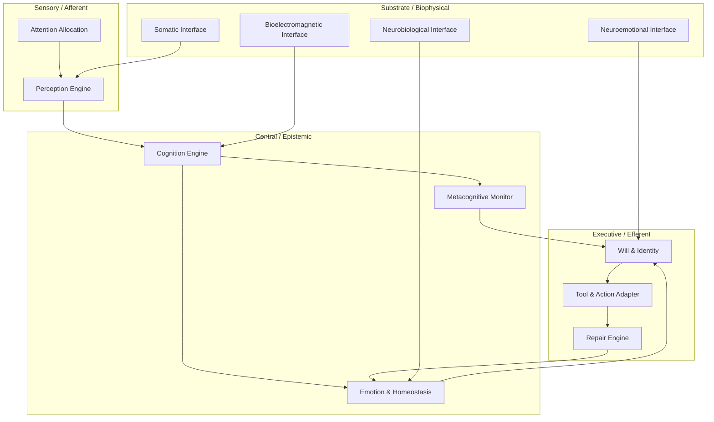

# Organism OS Architecture — Unified Biological & Synthetic Synthesis

**Origin Architect / Steward:** Trang Phan
**AMOS_CORE Target:** `v4.4`
**Epistemic Class:** `AMOS_MODEL`
**Conclusion Class:** `DERIVED`

---

## 1. Architectural Envelope

The Organism OS operationalizes Bio-Logical Computing by synchronizing biological regulatory principles with distributed software runtimes. It treats the organism as a multi-layer, self-organizing system in which biological signals, cognitive control, and synthetic execution are governed by a common canonical contract.

---

## 2. Substrate Bindings

The Organism OS interfaces with four non-compensatory biological signal classes, collectively constituting **Unified Biological Intelligence (UBI)**:

- **BEI (Bioelectromagnetic Interface):** Models electromagnetic field dynamics and frequency resonances. In AMOS, BEI is treated as an information-bearing signal class; causal claims about field effects require independent empirical validation.
- **NBI (Neurobiological Interface):** Models neurotransmitter analogs (e.g., dopamine/focus, serotonin/stability, acetylcholine/salience). NBI states modulate attention allocation and cognitive pacing.
- **NEI (Neuroemotional Interface):** Modulates decision thresholds based on affective stress vectors. NEI may bias prioritization and tone, but **never** facts, logic, or authority.
- **SI (Somatic Interface):** Manages physical and hardware boundary constraints (temperature, fatigue, injury, compute load). SI provides a substrate-distress veto when biological or hardware integrity is at risk.

---

## 3. Self-Organization & Generative Encoding Layer

### 3.1 Neural Cellular Automata Substrate
Neural Cellular Automata (NCA) provide a bio-inspired dynamical substrate in which identical cells iteratively apply a learned local update rule to self-organize into complex patterns. Key properties relevant to Organism OS:

- **Locality:** Information propagates one neighborhood hop per update; global coordination emerges without centralized control.
- **Robustness & Regeneration:** Learned iterative self-organization confers tolerance to perturbation and the ability to regrow structure from partial states.
- **Resolution Decoupling:** A coarse NCA lattice paired with a lightweight coordinate-based decoder (e.g., LPPN) can render high-resolution outputs in real time while preserving the self-organizing dynamics.

In the Organism OS, NCA dynamics serve as a substrate metaphor for distributed repair, immune response, and developmental adaptation, not as a replacement for canonical AMOS control-plane authority.

### 3.2 Genomic-Code Generative Model
The genome can be modeled as a compressed generative model of the organism: DNA encodes a connectionist gene-regulatory network whose latent variables shape an energy landscape, constraining developmental self-organization to produce a viable individual.

Implications for Organism OS:

- **Distributed Encoding:** Traits are not represented by single loci but by distributed, non-linear interactions. This aligns with UBI's multi-signal, non-compensatory design.
- **Robustness & Evolvability:** Compressed latent representations enable both developmental stability and adaptive variation under selection pressure.
- **AMOS_MODEL Boundary:** The genome-as-generative-model analogy is a formalization scaffold; it does not imply that AMOS can directly read or write biological genomes.

---

## 4. AMOS Runtime Mapping

| Organism OS Layer | AMOS Stage | Canonical Binding |
|-------------------|------------|-------------------|
| Sensory / Afferent | Perceive → Route | `03_CONTROL_PLANE/ROUTING_POLICY` |
| Central / Epistemic | Admit → Plan | `04_RUNTIME/EXECUTIVE_FUNCTION` |
| Executive / Efferent | Schedule → Execute | `04_RUNTIME/ACTION_COMMIT` |
| Repair Engine | Observe → Repair → Audit | `20_OPERATIONS/AUDIT_PROTOCOL` |
| Substrate | Finalize + Feedback | `19_TESTS/VALIDATION_CONTRACT` |

The Organism OS does not introduce a separate authority plane; it consumes and produces typed signals bound by the same RSCF, H/M/L, and canon invariants as synthetic AMOS components.

---

## 5. Safety Invariants & Firewalls

- `INV-ORGOS-001` (**Non-Compensatory Substrate Binding**): BEI, NBI, NEI, and SI signals cannot be averaged or substituted for one another; each carries its own validity envelope.
- `INV-ORGOS-002` (**Affect ≠ Fact Firewall**): Neuroemotional state may influence prioritization and pacing, but cannot override verified facts, formal proofs, or canonical authority.
- `INV-ORGOS-003` (**Somatic Distress Veto**): If SI signals indicate substrate integrity risk, the Organism OS must degrade gracefully to a safe maintenance mode rather than continue high-load execution.
- `INV-ORGOS-004` (**Bio-Digital Isolation**): No biological effect may be externalized by the synthetic control plane without independent safety validation and human-in-the-loop commit for M0-M2 mutations.

---

## 6. Known Gaps & Falsifiers

- `GAP-ORGOS-001`: Real-time causal mapping between UBI signals and high-level cognitive states remains `AMOS_MODEL`; empirical validation requires domain-specific physiological studies.
- `GAP-ORGOS-002`: NCA-based repair and regeneration in the Organism OS is metaphorical/specification-grade; deployable algorithms must be validated independently.
- `GAP-ORGOS-003`: The genomic-code generative model is a formal analogy, not an operational genetic-editing capability.
- `GAP-ORGOS-004`: Integration of biological substrates with AMOS control planes has not been demonstrated at scale; claims about end-to-end organism OS runtime are `CONDITIONAL`.

---

## 7. Provenance & Stewardship

- **Lineage:** AMOS v4.4 Bio-Logical Computing.
- **Origin Architect & Steward:** Trang Phan.
- **Epistemic Class:** `AMOS_MODEL` / `DERIVED`.
- **SOTA Anchors:**
  - Pajouheshgar et al. (2026) *Neural Cellular Automata: From Cells to Pixels*, arXiv:2506.22899v3.
  - Mitchell & Cheney (2024) *The Genomic Code: The Genome Instantiates a Generative Model of the Organism*, arXiv:2407.15908v2.

**MOC:** [[05_COGNITIVE_ORGANISM/05_COGNITIVE_ORGANISM_MOC|05_COGNITIVE_ORGANISM_MOC]] · [[00_ROOT/00_ROOT_MOC|00_ROOT_MOC]]
