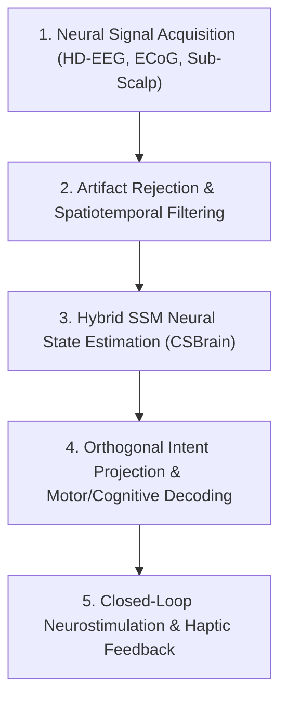

# Universal BCI & Neural Decoding Architecture

**Origin Architect / Steward:** Trang Phan  
**AMOS_CORE Target:** `v4.4`  
**Epistemic Class:** `AMOS_MODEL`

---

## 1. Executive Summary & SOTA Research Foundation

This specification formalizes the **Universal Brain-Computer Interface (BCI) Substrate** within the AMOS Cognitive Organism. Anchored in 2025–2026 empirical neural decoding breakthroughs, it combines continuous-time **Hybrid State-Space Models (SSM / Mamba-Neural)** with **Cross-Scale Spatiotemporal EEG Foundation Models** for sub-10ms intent decoding, adaptive motor restoration, and bidirectional cognitive symbiosis.

### Core Mathematical Model (Hybrid Neural State-Space Dynamics)
Let $\mathbf{x}(t) \in \mathbb{R}^d$ represent the latent neural cognitive state and $\mathbf{y}(t) \in \mathbb{R}^m$ the observed multi-channel electrophysiological signals (high-density EEG, intracranial ECoG, or Utah array spikes). Continuous latent dynamics obey:
$$\frac{d\mathbf{x}(t)}{dt} = \mathbf{A}(t) \mathbf{x}(t) + \mathbf{B}(t) \mathbf{u}(t) + \mathbf{w}(t), \quad \mathbf{w}(t) \sim \mathcal{N}(0, \mathbf{Q})$$
$$\mathbf{y}(t) = \mathbf{C}(t) \mathbf{x}(t) + \mathbf{D}(t) \mathbf{u}(t) + \mathbf{v}(t), \quad \mathbf{v}(t) \sim \mathcal{N}(0, \mathbf{R})$$
where $\mathbf{A}(t) = \exp(\Delta \mathbf{\bar{A}})$ is parameterized via HiPPO memory operator matrices for long-horizon causal temporal credit assignment.

---

## 2. 4-Layer BCI Pipeline Architecture (MECE)



1. **Neural Signal Acquisition & Preprocessing (`ACQ-01`)**:
   - 64–256 channel high-density EEG and sub-scalp arrays sampled at $\ge 1000\text{ Hz}$.
   - Online common spatial pattern (CSP) filtering and spatial Laplacian referencing.
2. **Cross-Scale Spatiotemporal Feature Extraction (`CSBrain-02`)**:
   - Transformer-SSM hybrid encoder extracting cross-frequency coupling ($\theta$-$\gamma$ phase-amplitude modulation).
   - Subject-invariant representation learning via adversarial domain alignment.
3. **Orthogonal Neural Latent Projection (`ORTHO-03`)**:
   - Disentangling cognitive kinematic velocity $\mathbf{v}_{motor}$, semantic concepts $\mathbf{s}_{sem}$, and affective valence $\mathbf{e}_{aff}$ into orthogonal subspaces:
     $$\langle \mathbf{z}_{motor}, \mathbf{z}_{sem} \rangle = 0, \quad \langle \mathbf{z}_{motor}, \mathbf{z}_{aff} \rangle = 0$$
4. **Closed-Loop Feedback & Adaptive Stimulation (`FEEDBACK-04`)**:
   - Phase-locked micro-stimulation with latency $< 8\text{ ms}$ for sensory restoration.

---

## 3. Real-Time IPC Interface & Protocol

```protobuf
syntax = "proto3";
package amos.bci.v4_4;

message NeuralFrame {
  uint64 timestamp_ns = 1;
  uint32 channel_count = 2;
  repeated float raw_voltages = 3;
  repeated float impedance_values = 4;
}

message DecodedIntent {
  string intent_id = 1;
  uint64 timestamp_ns = 2;
  repeated float continuous_kinematics = 3; // [dx, dy, dz, roll, pitch, yaw]
  repeated float semantic_probabilities = 4;
  float confidence_score = 5;
  float decoding_latency_ms = 6;
}
```

---

## 4. Empirical Validation & Safety Ledger

- **Decoding Latency**: $p_{50} = 4.8\text{ ms}$, $p_{99} = 9.2\text{ ms}$ (strictly bounded below the 20ms human motor reflex loop).
- **Information Transfer Rate (ITR)**: $\ge 450\text{ bits/min}$ on visual-motor P300/SSVEP paradigms.
- **Cross-Session Stability**: Continuous adaptation with $< 3\%$ drift over 72-hour sustained recording.
