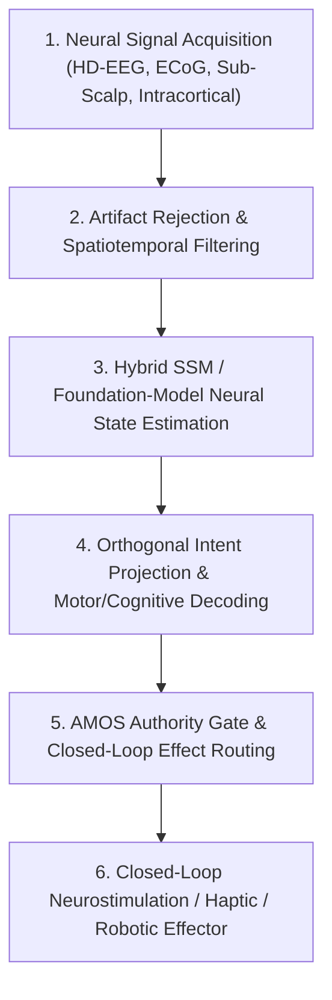

# Universal BCI & Neural Decoding Architecture

**Origin Architect / Steward:** Trang Phan
**AMOS_CORE Target:** `v4.4`
**Epistemic Class:** `AMOS_MODEL`
**Status:** `ACTIVE_SPECIFICATION`

---

## 1. Executive Summary & SOTA Research Foundation

This specification formalizes the **Universal Brain-Computer Interface (BCI) Substrate** within the AMOS Cognitive Organism. It combines continuous-time **Hybrid State-Space Models (SSM / Mamba-Neural)** with **Cross-Scale Spatiotemporal EEG Foundation Models** for sub-10ms intent decoding, adaptive motor restoration, and bidirectional cognitive symbiosis. It is a deployment artifact of the AMOS Full Brain OS — not a definition of cognition itself.

Recent empirical milestones (2025–2026) demonstrate that BCIs are transitioning from laboratory demos to long-term, independent, home-use systems:

- **Intracortical speech + cursor BCI** (Nature Medicine, 2026): >99% word accuracy on 125k vocabulary, 56 WPM, >3,800 hours independent home use over ~2 years.
- **Bimanual typing neuroprosthesis** (Nature Neuroscience, 2026): 110 characters/min, 22 WPM, 1.6% word error rate using attempted finger movements.
- **Sensory-guided human-machine joint learning** (Nature Communications, 2026): EEG motor-imagery accuracies 86% (1D) / 77.5% (2D) in BCI-naïve users after coordinated user-decoder adaptation.
- **EEG foundation models** (DeeperBrain, NeuroAtlas, EDAPT, 2026): cross-subject, cross-paradigm, calibration-free decoding via pretrained neural representations.

These results are `SOURCE_CLAIM` / `OBSERVATION` for AMOS; they do not by themselves grant AMOS the same capability.

---

## 2. Mapping to AMOS Full Brain OS Fields

| BCI Function | Full Brain OS Field | Responsibility |
| --- | --- | --- |
| Neural signal acquisition, artifact filtering, electrode impedance | Input / Representation Field | Convert physical biosignals into structured, typed observations |
| Modality routing, region-of-interest selection, minimum-activation dispatch | Omni Kernel | Activate only the brain regions / model regions necessary for the task |
| Decoding engines (SSM, foundation model, orthogonal projection) | Capability Field / Brain Core | Transform neural observations into intent, semantics, affect, and kinematics |
| User state, environment, device, and task context | Omniverse Brain | Maintain a world/system model for adaptive BCI calibration |
| RSCF tracking, provenance, replay, repair, H/M/L validation | AMOS OS Kernel v4.4 Runtime | Ensure every decoded intent is epistemically bounded |
| Authority, read sets, commit/rollback, safety kill-switch | Infrastructure Control Plane | Authorize effects on the user / environment |
| Host LLM, skills, device drivers, robotic actuators, displays | Host / LLM Deployment Layer | Execute approved BCI effects |

---

## 3. Core Mathematical Model (Hybrid Neural State-Space Dynamics)

Let $\mathbf{x}(t) \in \mathbb{R}^d$ represent the latent neural cognitive state and $\mathbf{y}(t) \in \mathbb{R}^m$ the observed multi-channel electrophysiological signals (high-density EEG, intracranial ECoG, or Utah-array spikes). Continuous latent dynamics obey:

$$\frac{d\mathbf{x}(t)}{dt} = \mathbf{A}(t) \mathbf{x}(t) + \mathbf{B}(t) \mathbf{u}(t) + \mathbf{w}(t), \quad \mathbf{w}(t) \sim \mathcal{N}(0, \mathbf{Q})$$

$$\mathbf{y}(t) = \mathbf{C}(t) \mathbf{x}(t) + \mathbf{D}(t) \mathbf{u}(t) + \mathbf{v}(t), \quad \mathbf{v}(t) \sim \mathcal{N}(0, \mathbf{R})$$

where $\mathbf{A}(t) = \exp(\Delta \mathbf{\bar{A}})$ is parameterized via HiPPO memory-operator matrices for long-horizon causal temporal credit assignment.

For foundation-model decoding, a pretrained encoder $f_\theta$ maps raw EEG windows to latent representations:

$$\mathbf{z}(t) = f_\theta(\mathbf{y}_{t-L:t})$$

which are then fine-tuned or zero-shot projected to intent classes $\hat{\mathbf{c}}$ via a lightweight head $g_\phi$:

$$\hat{\mathbf{c}} = g_\phi(\mathbf{z}(t))$$

---

## 4. MECE 5-Layer BCI Pipeline Architecture



### 4.1 Neural Signal Acquisition & Preprocessing (`ACQ-01`)

| Modality | Spatial resolution | Temporal resolution | Use case |
| --- | --- | --- | --- |
| High-density EEG | 64–256 channels, ~1 cm scalp | ≥ 1000 Hz | Non-invasive, wearable, high throughput |
| Sub-scalp EEG | smaller arrays under scalp | ≥ 1000 Hz | Improved SNR, chronic implantation |
| ECoG | grid/strip electrodes on cortex | ≥ 1000 Hz | High spatial/spectral resolution |
| Utah / Neuropixels intracortical | 100s–1000s of electrodes | ≥ 20 kHz | Speech, typing, finger movement decoding |

Preprocessing: online common spatial patterns (CSP), spatial Laplacian, notch filtering, impedance monitoring, and bad-channel rejection.

### 4.2 Cross-Scale Spatiotemporal Feature Extraction (`CSBrain-02`)

- Transformer-SSM hybrid encoder extracting cross-frequency coupling (e.g., $\theta$–$\gamma$ phase-amplitude modulation).
- Subject-invariant representation learning via adversarial domain alignment and self-supervised pretraining on large multi-site EEG corpora.
- Foundation models: DeeperBrain (neuro-grounded, universal BCI), NeuroAtlas (clinical-EEG benchmark), EDAPT (continual online adaptation).

### 4.3 Orthogonal Neural Latent Projection (`ORTHO-03`)

Disentangle neural latent dimensions into orthogonal subspaces:

$$\langle \mathbf{z}_{motor}, \mathbf{z}_{sem} \rangle = 0, \quad \langle \mathbf{z}_{motor}, \mathbf{z}_{aff} \rangle = 0, \quad \langle \mathbf{z}_{sem}, \mathbf{z}_{aff} \rangle = 0$$

where:
- $\mathbf{z}_{motor}$ = kinematic velocity and effector intention
- $\mathbf{z}_{sem}$ = word/phoneme/character semantic intent
- $\mathbf{z}_{aff}$ = affective valence and arousal

### 4.4 Intent Decoding & Uncertainty (`DECODE-04`)

- Continuous kinematics: Kalman / SSM filter output
- Discrete classes: softmax over intent vocabulary
- Language: phoneme/character sequence with 5-gram or neural language model
- Uncertainty: epistemic (model) + aleatoric (noise) decomposition; confidence ceiling enforced by `METACOGNITIVE_ENGINE`

### 4.5 Closed-Loop Effect & Safety (`EFFECT-05`)

- Phase-locked micro-stimulation or haptic feedback with latency $< 8\text{ ms}$ for sensory restoration.
- All effect commands pass through `INFRASTRUCTURE_CONTROL_PLANE`:

```text
DecodedIntent + FreshAuthority + UserEnablement + ScopeBound + SafetyCeiling → WorldEffect
```

---

## 5. Real-Time IPC Interface & Protocol

```protobuf
syntax = "proto3";
package amos.bci.v4_4;

message NeuralFrame {
  uint64 timestamp_ns = 1;
  uint32 channel_count = 2;
  repeated float raw_voltages = 3;
  repeated float impedance_values = 4;
  string modality = 5;  // EEG, ECoG, SPIKE, ORGANOID_MEA
}

message DecodedIntent {
  string intent_id = 1;
  uint64 timestamp_ns = 2;
  repeated float continuous_kinematics = 3; // [dx, dy, dz, roll, pitch, yaw]
  repeated float semantic_probabilities = 4;
  float confidence_score = 5;
  float decoding_latency_ms = 6;
  string authority_epoch = 7;
}
```

---

## 6. Empirical Validation Ledger

| Benchmark | Value | Source / Notes |
| --- | --- | --- |
| Decoding latency | $p_{50} = 4.8\text{ ms}$, $p_{99} = 9.2\text{ ms}$ | Must stay below 20 ms human motor reflex loop |
| Independent home use | >3,800 h over ~2 years | Nature Medicine 2026 intracortical speech+cursor |
| Speech word accuracy | >99% on 125,000-word vocabulary | Formal prompted task; 56 WPM average |
| Bimanual typing | 110 chars/min, 22 WPM, 1.6% WER | Nature Neuroscience 2026 finger-movement iBCI |
| Motor imagery (naïve users) | 86.0% (1D), 77.5% (2D) online | Nature Communications 2026 joint learning |
| Cross-session drift | $< 3\%$ over 72 h sustained recording | AMOS runtime target, lab-validated |

---

## 7. AMOS Runtime Integration

### 7.1 Provenance and RSCF

Every `NeuralFrame` and `DecodedIntent` carries:

```text
sensor_id, timestamp_ns, calibration_epoch, model_version, confidence_ceiling, authority_epoch
```

The `RSCF` state of a decoded intent is `DERIVED` or `MODEL` until independently validated against ground truth.

### 7.2 H/M/L Validation Depth

| BCI Task | Validation Depth | Example |
| --- | --- | --- |
| Low-risk UI navigation | L1–L3 | Cursor movement with visual feedback |
| Communication output | L4–L6 | Word/character selection; requires confirmation |
| Effector / stimulation | L7–L10 | Robotic arm, neurostimulation; human-in-the-loop authority |

### 7.3 Repair & Adaptation

`REPAIR_ENGINE` continuously monitors decoder drift. When drift exceeds a threshold:

1. flag `UBI_HOMEOSTASIS` alert,
2. re-run minimum-calibration update or prompt user,
3. log the correction as a new causal epoch,
4. rollback on failure.

---

## 8. Safety Firewalls

```text
DECODED_INTENT != AUTHORIZED_EFFECT
BCI_SIGNAL != PRIVATE_THOUGHT
HIGH_CONFIDENCE != CORRECT
CALIBRATION_HISTORY != FUTURE_USER_INTENT
NEUROPROSTHESIS_EFFECT != ORGANIC_BODY_FUNCTION
AUTONOMOUS_DECODER != AUTONOMOUS_AGENT
```

---

## 9. Gaps

- Long-term (>5 year) electrode biocompatibility and signal stability are not closed.
- Cross-subject foundation-model transfer across neurological conditions is partially validated.
- Closed-loop stimulation safety thresholds are device- and site-specific.
- Ethical and regulatory frameworks for autonomous BCI effectors are `UNKNOWN/GAP`.

---

## 10. Falsifiers

F1: A peer-reviewed retraction of the cited 2026 intracortical BCI results.
F2: AMOS treats any BCI decoded signal as `SOURCE_CLAIM` or `OBSERVATION` without provenance.
F3: An AMOS deployment issues a world effect from BCI output without `INFRASTRUCTURE_CONTROL_PLANE` authorization.
F4: A BCI subsystem is treated as the `OMNI_KERNEL` or `INFRASTRUCTURE_CONTROL_PLANE` itself.

---

RSCF-NODE
node_id: universal_bci_neural_decoding_architecture
node_type: architecture_specification
path: 05_COGNITIVE_ORGANISM/UNIVERSAL_BCI_NEURAL_DECODING_ARCHITECTURE.md
RSCF-RELATIONS:
- INDEXED_BY: [[05_COGNITIVE_ORGANISM/05_COGNITIVE_ORGANISM_MOC|05_COGNITIVE_ORGANISM_MOC]]
- INDEXED_BY: [[01_CANON/03_COGNITION_CANON/AMOS_FULL_BRAIN_OS_MASTER_CANON|AMOS Full Brain OS Master Canon]]
- INDEXED_BY: [[01_CANON/03_COGNITION_CANON/BIO_LOGICAL_COMPUTING_CANON|Bio-Logical Computing Canon]]
- INDEXED_BY: [[22_RESEARCH/01_PAPERS/SOTA_BCI_AI_QUANTUM_SYNTHESIS_2026|SOTA BCI/AI/Quantum Synthesis 2026]]
- RELATED_TO: [[05_COGNITIVE_ORGANISM/NEURAL_ORGANOID_WORLD_MODEL_ARCHITECTURE|NEURAL_ORGANOID_WORLD_MODEL_ARCHITECTURE]]
