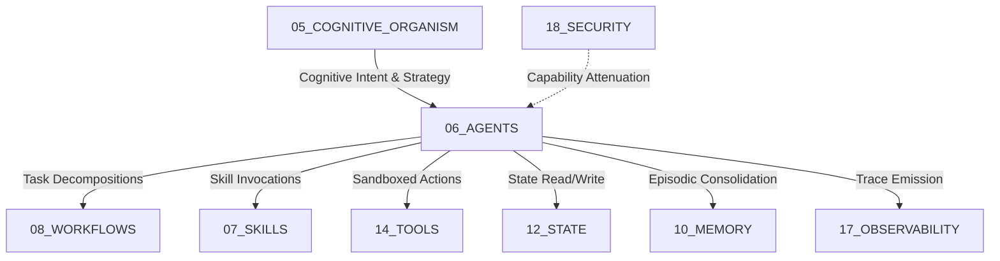
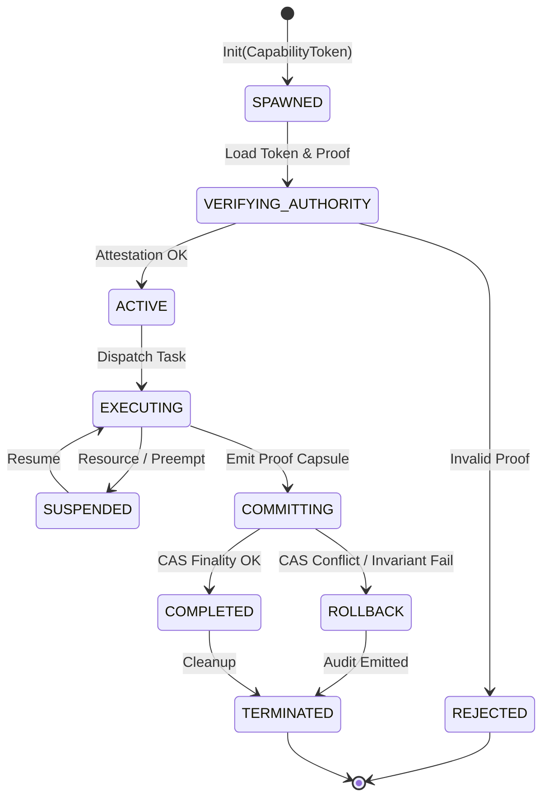

# Agents Agent Contract — Plane Governance Specification

> **Origin Architect / Steward:** Trang Phan
> **AMOS_CORE Target:** `v4.4`
> **Domain Alignment:** Domain C (Cognitive Capability / Orchestration)
> **Conclusion Class:** `DERIVED` (RSCF Validated)
> **Status:** `ACTIVE_SPECIFICATION`

---

## 1. Architectural Scope & Mission

`06_AGENTS` governs the lifecycle, topology, communication protocols, capability bounds, and delegation lattices of all autonomous and semi-autonomous software agents operating within the AMOS Full OS MECE architecture.

```text
CAPABILITY != AUTHORITY
DELEGATION != ABDICATION
AUTONOMY != UNCONSTRAINED_EXECUTION
COLLABORATION != BYZANTINE_COLLUSION
```

Under Domain C, `06_AGENTS` bridges high-level cognitive intent from `05_COGNITIVE_ORGANISM` with executable task specifications in `08_WORKFLOWS`, discrete tool executions in `14_TOOLS`, memory substrates in `10_MEMORY`, and security boundaries in `18_SECURITY`.



---

## 2. Agent Taxonomies & Behavioral Classifications

Agents within AMOS OS are strictly categorized across four orthogonal functional tiers:

| Agent Tier | Primary Archetype | Consequential Blast Radius | Authority Level | Verification Gate |
| :--- | :--- | :--- | :--- | :--- |
| **Tier 0: Epistemic Observers** | Passive loggers, scrapers, sensor feeds, telemetry probes | Read-only ($\text{Scope} = \emptyset$) | $A_0 = \text{OBSERVER}$ | Auto-admitted |
| **Tier 1: Analytical Synthesizers** | Knowledge harvesters, tensor compressors, proof checkers | Workspace memory modification | $A_1 = \text{ANALYST}$ | RSCF schema check |
| **Tier 2: Tactical Orchestrators** | Workflow routers, swarm coordinators, task dispatchers | Ephemeral process execution | $A_2 = \text{COORDINATOR}$ | CAS epoch validation |
| **Tier 3: Executive Actuators** | State committing agents, storage engines, external API callers | Durable state & external mutations | $A_3 = \text{EXECUTIVE}$ | Lean 4 + 2-of-3 quorum |

---

## 3. Agent Lifecycle State Machine

Every agent instance progresses through a deterministic finite automaton (DFA) state lifecycle:



### State Definitions & Invariants
1. **`SPAWNED`**: Agent process instantiated within Firecracker microVM or WebAssembly sandbox. Memory and CPU quotas allocated.
2. **`VERIFYING_AUTHORITY`**: Cryptographic validation of delegation token $\tau_{\text{agent}}$ signed by parent coordinator using ML-DSA-65.
3. **`ACTIVE`**: Ready queue insertion. Listening on ZeroMQ / Arrow IPC control plane.
4. **`EXECUTING`**: Task execution. Tool calls intercepted by Seccomp-BPF filters.
5. **`COMMITTING`**: Submitting proposed state transition $(\Delta S, \Pi_{\text{proof}})$ to `12_STATE`.
6. **`ROLLBACK`**: Causal epoch conflict or invariant failure. Undoes uncommitted local mutations.
7. **`TERMINATED`**: Process killed, memory zeroized, audit log finalized to `17_OBSERVABILITY`.

---

## 4. Mathematical Invariants & Formal Guarantees

$$\forall a \in \mathcal{A},\quad \text{Caps}(a) \subseteq \text{Caps}(\text{Parent}(a)) \cap \text{AttenuationMask}(a)$$

### Invariant 1: Monotonic Capability Attenuation
An agent cannot acquire, grant, or synthesize capabilities strictly greater than its progenitor:
$$\text{Authority}(a_{\text{child}}) \le \text{Authority}(a_{\text{parent}})$$

### Invariant 2: Deadlock-Free Actor Routing
Let $\mathcal{G}_{\text{wait}} = (\mathcal{A}, \mathcal{E})$ be the agent wait-for dependency graph. Deadlocks are avoided by enforcing strict topological ordering over agent priorities $\rho(a)$:
$$(a_i \to a_j) \in \mathcal{E} \implies \rho(a_i) < \rho(a_j)$$

### Invariant 3: Bounded Execution Horizon
Every task execution is bounded by an epistemic timeout $T_{\max}$ and token budget $B_{\max}$:
$$\int_0^{T_{\text{exec}}} \text{ComputeCost}(t)\, dt \le B_{\max} < \infty$$

---

## 5. Agent Communication Protocols & Actor Bus

Agents communicate exclusively via typed message channels defined in `16_SCHEMAS`:

```protobuf
syntax = "proto3";
package amos.agents.v1;

message AgentMessage {
  string message_id = 1;
  string sender_agent_id = 2;
  string recipient_agent_id = 3;
  uint64 causal_epoch = 4;
  bytes capability_token = 5;

  oneof payload {
    TaskDispatchPayload task_dispatch = 6;
    EpistemicClaimPayload claim_emission = 7;
    StateCommitPayload state_commit = 8;
    HeartbeatPayload heartbeat = 9;
  }

  bytes blake3_signature = 10;
}
```

---

## 6. Adversarial Red-Teaming & Byzantine Fault Tolerance

To ensure multi-agent swarm integrity under adversarial conditions or Byzantine hallucinations:
1. **Red-Team Inoculation:** All Tier 2 and Tier 3 proposals undergo automated adversarial evaluation by `amos-adversarial-red-team` before commit gates.
2. **Quorum Consensus:** Multi-agent state mutations requiring $>1$ domain plane mutation must reach $k$-of-$n$ threshold consensus ($k \ge \lfloor 2n/3 \rfloor + 1$).
3. **Sybil Resistance:** Proof-of-provenance weights prevent synthetic consensus amplification.

---

## 7. Operational Runbooks & Failure Modes

### Runbook 1: Agent Divergence / Hallucination Spike
1. Isolate agent ID via `03_CONTROL_PLANE/COGNITIVE_VAULT_RESOLVER`.
2. Revoke active capability token $\tau_{\text{agent}}$.
3. Replay agent trace from `17_OBSERVABILITY` against metamorphic fuzzer in `19_TESTS`.
4. Isolate root-cause prompt drift or tool distortion.

### Runbook 2: Epoch Finality Conflict During Multi-Agent Handoff
1. Identify conflicting shard-local state keys.
2. Trigger deterministic three-way merge via CRDT join-semilattice in `09_PROTOCOLS`.
3. If non-mergeable, escalate to origin architect Trang Phan.

---

## 8. Epistemic Ledger & Audit Trail

All agent lifecycle events emit BLAKE3-hashed telemetry records formatted as:
```text
[TIMESTAMP] [AGENT_ID] [STATE_TRANSITION] [EPOCH] [BLAKE3_HASH] [OUTCOME]
```
Receipts are permanently archived in `17_OBSERVABILITY/receipts/` and indexed in `20_OPERATIONS`.

---

## 9. Lineage & Cross-Plane References

- **Upstream Governance:** [[AGENTS|AGENTS]] · [[00_ROOT/00_ROOT_MOC|00_ROOT_MOC]]
- **Task Orchestration:** [[08_WORKFLOWS/08_WORKFLOWS_MOC|08_WORKFLOWS_MOC]] · [[07_SKILLS/07_SKILLS_MOC|07_SKILLS_MOC]]
- **Runtime Execution:** [[04_RUNTIME/RUNTIME_RUNTIME_CONTRACT|04_RUNTIME]] · [[14_TOOLS/SANDBOX_TOOL_EXECUTION_PROTOCOL|14_TOOLS]]
- **State & Memory:** [[12_STATE/STATE_STATE_CONTRACT|12_STATE]] · [[10_MEMORY/EPISODIC_MEMORY_SUBSTRATE|10_MEMORY]]
- **Security & Attestation:** [[18_SECURITY/SECURITY_SECURITY_CONTRACT|18_SECURITY]]
