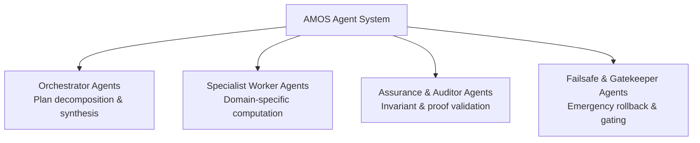

# 06_AGENTS — Agent Classification & Lifecycle Architecture

## 1. Domain Boundary

In the MECE Full Brain OS architecture (**Partition C: Cognitive Capability & Orchestration**), agents are bounded, versioned, typed cognitive actors executing delegated subtasks.

An agent is **not** an autonomous persona with sovereign rights. It is a strictly governed process bounded by:

```text
IDENTITY + OBJECTIVE + INVARIANTS + CAPABILITIES + AUTHORITY_BOUNDARY + RSCF_BINDING
```

## 2. Agent Classification Hierarchy



### 2.1 Orchestrator Agents
Responsible for decomposing complex user goals into task Directed Acyclic Graphs (DAGs), selecting appropriate specialist agents, and synthesizing final results under strict confidence boundaries.

### 2.2 Specialist Worker Agents
Highly tuned agents possessing narrow domain expertise (e.g. QFM mathematical derivation, legal kernel verification, code fence healing). They operate strictly within assigned RSCF scopes.

### 2.3 Assurance & Auditor Agents
Independent actors that review proposed state mutations before commit. They evaluate evidence chains and flag epistemic drift or confidence inflation.

### 2.4 Failsafe & Gatekeeper Agents
System-level monitors with authorization to abort compromised transactions and trigger rollback basin procedures.

## 3. Formal Agent Lifecycle

```text
PROPOSED ──[Schema Validated]──> ADMITTED ──[Capability Granted]──> ACTIVE
                                                                      │
                                                              [Violation Detected]
                                                                      ▼
RETIRED <──[Epoch Finalized]── QUARANTINED <──[Token Revoked]─────────┘
```
