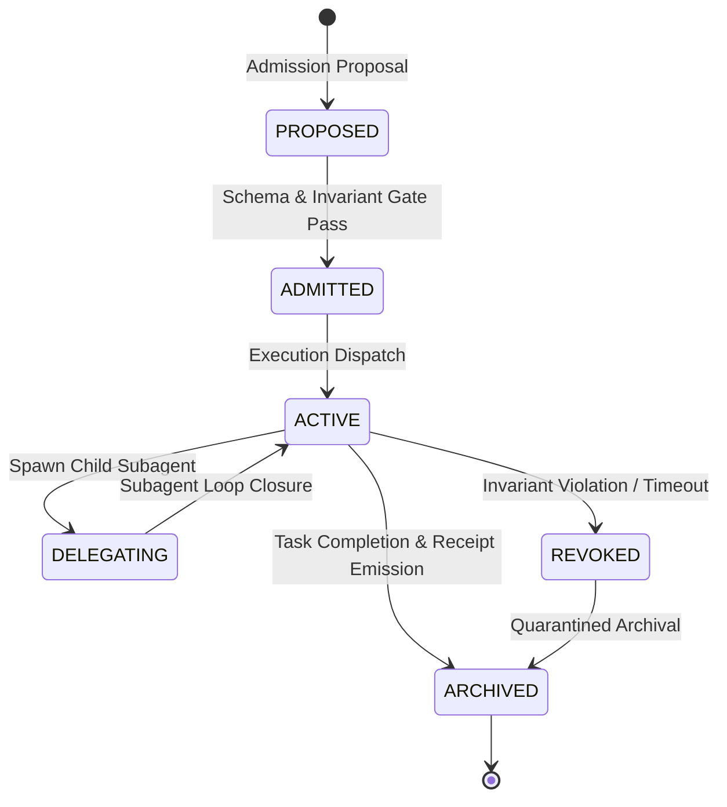

# Agent Delegation Lifecycle Specification

## 1. Lifecycle State Machine

Every agent instance within AMOS OS strictly transitions through a finite, deterministic 6-state lifecycle:

$$\mathcal{S}_{\text{lifecycle}} \in \{\text{PROPOSED}, \text{ADMITTED}, \text{ACTIVE}, \text{DELEGATING}, \text{REVOKED}, \text{ARCHIVED}\}$$

## 2. Invariant: Strict Monotonic Capability Attenuation

When an agent $\mathcal{A}_{\text{parent}}$ delegates a subtask to $\mathcal{A}_{\text{child}}$, the child's capability envelope $\mathcal{C}(\mathcal{A}_{\text{child}})$ and authority token $\Phi(\mathcal{A}_{\text{child}})$ must be a strictly bounded sub-algebra of the parent:

$$\mathcal{C}(\mathcal{A}_{\text{child}}, t) \subseteq \mathcal{C}(\mathcal{A}_{\text{parent}}, t) \quad \text{and} \quad \tau_{\text{expiry}}(\mathcal{A}_{\text{child}}) \le \tau_{\text{expiry}}(\mathcal{A}_{\text{parent}})$$

$$\text{CAPABILITY} \neq \text{AUTHORITY} \neq \text{AGENCY} \neq \text{CONSEQUENCE}$$

No child agent can inherit or generate permissions exceeding its immediate progenitor.
