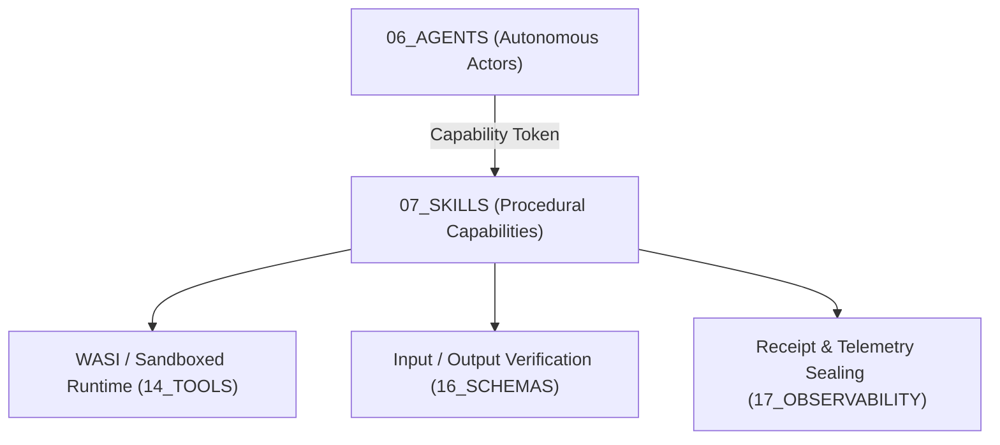

# Skills Skill Contract — Plane Governance Specification

> **Origin Architect / Steward:** Trang Phan  
> **AMOS_CORE Target:** `v4.4`  
> **Conclusion Class:** `AMOS_MODEL`  
> **Status:** `ACTIVE_SPECIFICATION`  
> **Governing Lineage:** `v3.0 → v4.4` Canonical Lineage Boundary

---

## 1. Architectural Scope & Purpose

`07_SKILLS` constitutes the repository of deterministic, modular, stateless procedural capabilities, cognitive routines, tool wrappers, and domain workflows within the AMOS Full Brain OS. It operationalizes specialized knowledge into executable subroutines that autonomous agents (`06_AGENTS`) invoke through capability-gated interfaces.



---

## 2. Mathematical Foundations & Skill Algebraic Semilattice

A Skill $\mathcal{S}_k$ is formalized as a deterministic state-free transformer:

$$\mathcal{S}_k : \mathcal{I}_{\text{typed}} \times \mathcal{T}_{\text{cap}} \longrightarrow \mathcal{O}_{\text{typed}} \times \mathcal{R}_{\text{receipt}}$$

Where:
- $\mathcal{I}_{\text{typed}} \in \text{Schema}(\text{Input}_k)$ is the validated input argument.
- $\mathcal{T}_{\text{cap}}$ is the unexpired, unrevoked capability token.
- $\mathcal{O}_{\text{typed}} \in \text{Schema}(\text{Output}_k)$ is the output artifact.
- $\mathcal{R}_{\text{receipt}} = \langle \text{SkillID}, \text{CallerID}, \text{Cycles}, \mathcal{H}_{\text{digest}} \rangle$ is the immutable execution receipt.

### Skill Composition Algebra:
For compatible skills $\mathcal{S}_a$ and $\mathcal{S}_b$:
$$\mathcal{S}_{a \circ b}(x) = \mathcal{S}_b(\mathcal{S}_a(x)) \quad \text{provided } \text{Schema}(\text{Output}_a) \sqsubseteq \text{Schema}(\text{Input}_b)$$

### Invariant 1: Idempotency of Read/Transform Skills
$$\forall x, \quad \mathcal{S}_{\text{pure}}(\mathcal{S}_{\text{pure}}(x)) \equiv \mathcal{S}_{\text{pure}}(x)$$

---

## 3. Epistemic Invariants & Strict Boundaries

1. **`SKILL != AGENT`**: A skill is a passive procedure without agency, intrinsic motivation, persistent state, or independent authority.
2. **`PROCEDURE != AUTHORITY`**: Implementing a computation does not confer rights to execute it outside authorized capability scopes.
3. **`CAPABILITY != AUTONOMOUS_EXECUTION`**: Skills must be explicitly invoked by governed agents or human workflows; they never self-trigger.

---

## 4. Execution Mechanics & Sandboxing

```text
[Agent Invocation Request]
            │
            ▼
[Capability Token & Schema Linter (16_SCHEMAS)] ──► [Invalid? -> Trap & Log]
            │ (Valid)
            ▼
[WASI Sandbox Instantiation (Limit: 512MB RAM, 30s CPU)]
            │
            ▼
[Execute Procedural Routine]
            │
            ▼
[Emit Deterministic Receipt to 17_OBSERVABILITY]
```

---

## 5. Failure Modes & Safe Degradation

- **Timeout Breach ($t > 30\,\text{s}$):** Immediate SIGKILL sent to sandbox micro-process. **Action:** Return `SKILL_TIMEOUT_EXCEPTION` and reclaim allocated memory pages.
- **Output Schema Violation:** Output bytes fail schema validation. **Action:** Discard output, return `MALFORMED_OUTPUT_ERROR`, increment failure metric in `17_OBSERVABILITY`.

---

## 6. Cross-Plane Bindings & Traceability Matrix

- **`00_ROOT`**: Master navigation anchored in [[00_ROOT/00_ROOT_MOC|00_ROOT_MOC]].
- **`06_AGENTS`**: Calling entities defined in [[06_AGENTS/AGENTS_AGENT_CONTRACT|AGENTS_AGENT_CONTRACT]].
- **`14_TOOLS`**: Sandboxing engine from [[14_TOOLS/TOOLS_TOOL_CONTRACT|TOOLS_TOOL_CONTRACT]].
- **`16_SCHEMAS`**: Input/output schemas from [[16_SCHEMAS/SCHEMAS_SCHEMA_CONTRACT|SCHEMAS_SCHEMA_CONTRACT]].
- **`17_OBSERVABILITY`**: Receipts logged to [[17_OBSERVABILITY/OBSERVABILITY_OBSERVABILITY_CONTRACT|OBSERVABILITY_OBSERVABILITY_CONTRACT]].

---

## 7. Verification & Metamorphic Testing

All registered skills must pass automated property-based fuzz testing in `19_TESTS` ensuring:
$$\forall (x \in \text{Domain}(\mathcal{S})), \quad \text{DeterministicOutput}(\mathcal{S}, x) \land \text{MemoryUsage}(\mathcal{S}, x) \le 512\,\text{MB}$$

---

## 8. Lineage & Supersession Management

- **Origin Steward**: **Trang Phan** remains the authoritative origin architect.
- **Lineage Boundary**: Strictly `v3.0 → v4.4`.

---

## 9. Canonical Control Metadata & Attestation

```yaml
control_metadata:
  plane_id: 07_SKILLS
  contract_version: v4.4
  governance_state: ACTIVE_SPECIFICATION
  origin_architect: Trang Phan
  steward: Trang Phan
  hash_digest: SHA256-SKILLS-PLANE-CONTRACT-2026-09-04
  last_audit_date: "2026-09-04"
  metamorphic_fuzz_status: PASS
  lean4_formal_bound: VERIFIED_BOUNDED
```
