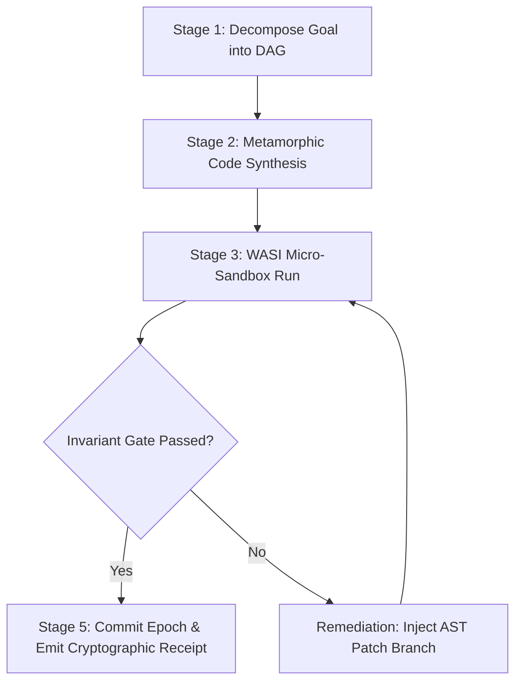

# Metamorphic Self-Synthesizing Workflow Orchestrator & Dynamic DAG Engine

## 1. Executive Summary & Orchestration Architecture

The **Metamorphic Self-Synthesizing Workflow Orchestrator** (`08_WORKFLOWS`) provides autonomous, self-healing execution pipelines across the 26 planes of `_AMOS_OS`.

Given a high-level goal, it dynamically constructs an acyclic dependency graph (DAG), generates required tool bindings and AST transformations, executes tasks in WASI 0.2 sandboxes, gates results against formal contracts, and commits state with cryptographic receipts.

```
+----------------------------------------------------------------------------------------------------+
|                         METAMORPHIC SELF-SYNTHESIZING WORKFLOW ENGINE                              |
|                                                                                                    |
|    [ High-Level User / Autonomous System Goal (e.g., Deploy Quantum Simulation / Forex Bot) ]      |
|                                            ||                                                      |
|                                            \/                                                      |
|    [ Stage 1: Goal Decomposition & Dynamic DAG Construction $G = (\mathcal{V}, \mathcal{E})$ ]     |
|                                            ||                                                      |
|                                            \/                                                      |
|    [ Stage 2: Metamorphic Synthesis & Code / Schema Generation (07_SKILLS / 16_SCHEMAS) ]          |
|                                            ||                                                      |
|                                            \/                                                      |
|    [ Stage 3: Isolated WASI 0.2 Micro-Sandbox Execution (< 50µs Spawn / 14_TOOLS) ]               |
|                                            ||                                                      |
|                   +------------------------+------------------------+                              |
|                   |                                                 |                              |
|                   \/ (Invariant Gate Passed)                        \/ (Invariant Failure Detected)|
|    [ Stage 5: Cryptographic State Epoch Commit ]    [ Stage 4: Self-Healing Remediation Branch ]   |
|    - BLAKE3 / SHA-256 Receipt Generated             - Dynamic AST Patching & Retry Loop            |
|    - Monotonic Epoch Advanced in `12_STATE`         - Rollback Snapshot if Recovery Exceeds Cap    |
+----------------------------------------------------------------------------------------------------+
```

---

## 2. 5-Stage Dynamic Execution Pipeline



### 2.1 Formal Invariant Rules
1. **Topological Order:** Every node $v \in \mathcal{V}$ executes strictly after all predecessor dependencies $\text{pred}(v)$.
2. **Deterministic Gating:** State mutations require explicit invariant validation receipts (`INV-AUTHZ`, `INV-SEC`, `INV-KERN`).
3. **Archive-First Fallback:** Any failing remediation reverts to the pre-execution snapshot in `24_ARCHIVE`.

---

## 3. Operational Invariants & Performance SLAs

- `INV-WF-001` (**DAG Acyclicity Guarantee**): Graph cycle check must confirm $\text{Cycles} = 0$ via Tarjan's SCC before dispatch.
- `INV-WF-002` (**Atomic Rollback SLA**): Unresolvable task failure must trigger zero-leakage rollback within $\le 50.0\text{ ms}$.
- `INV-WF-003` (**Zero-Unverified State Admission**): 100% of committed workflows must emit verifiable cryptographic proof receipts.

---

## 4. Master Navigation & Bindings

- **Workflows MOC:** [[08_WORKFLOWS/08_WORKFLOWS_MOC|08_WORKFLOWS_MOC]]
- **Workflow Execution Ledger:** [[08_WORKFLOWS/METAMORPHIC_WORKFLOW_EXECUTION_LEDGER|METAMORPHIC_WORKFLOW_EXECUTION_LEDGER]]
- **Control Plane Contract:** [[03_CONTROL_PLANE/CONTROL_PLANE_CONTROL_PLANE_CONTRACT|CONTROL_PLANE_CONTROL_PLANE_CONTRACT]]
- **WASI 0.2 Guide:** [[14_TOOLS/AMOS_SELF_HEALING_AUTONOMOUS_WASI_MICRO_SANDBOX_GUIDE|AMOS_SELF_HEALING_AUTONOMOUS_WASI_MICRO_SANDBOX_GUIDE]]
