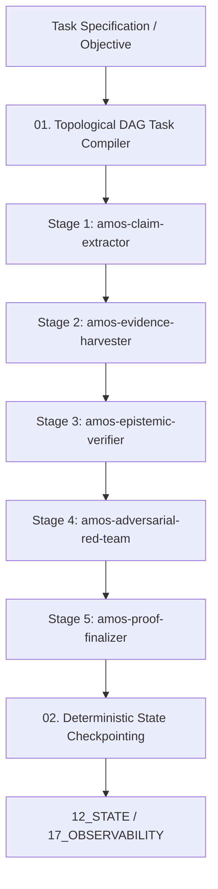

# Workflows Workflow Contract — Master DAG Orchestration, Multi-Agent Pipeline & Epistemic Verification Specification

> **Origin Architect / Steward:** Trang Phan  
> **AMOS_CORE Target:** `v4.4`  
> **Domain Alignment:** Domain C (Cognitive Capability / Orchestration)  
> **Conclusion Class:** `DERIVED` (RSCF Validated)  
> **Status:** `ACTIVE_SPECIFICATION`

---

## 1. Architectural Scope & Subsystem Role

`08_WORKFLOWS` governs the compilation, execution, checkpointing, and formal verification of all Directed Acyclic Graph (DAG) task pipelines, multi-agent epistemic verification chains, and autonomous reasoning workflows in AMOS OS.

```text
WORKFLOW_EXECUTION != BLIND_PIPELINE_RUN
STAGE_COMPLETION != EPISTEMIC_VALIDATION
CHECKPOINTING != UNBOUNDED_STORAGE
INTERMEDIATE_ERROR == INSTANT_CONTAINMENT
```



---

## 2. Master 5-Stage Multi-Agent Verification Architecture

| Pipeline Stage | Assigned Agent Archetype | Primary Mandate | Failure Mode Action |
| :--- | :--- | :--- | :--- |
| **1. Claim Extraction** | `amos-claim-extractor` | Deconstruct unstructured text into typed atomic claims | Re-parse with constrained CFG |
| **2. Evidence Harvesting**| `amos-evidence-harvester` | Retrieve primary literature, telemetry, and vault axioms | Flag missing citations as GAP |
| **3. Epistemic Verification**| `amos-epistemic-verifier` | Evaluate cross-modal consistency, calculate confidence $\mathcal{C}$| Reject ungrounded claims |
| **4. Adversarial Red-Team**| `amos-adversarial-red-team`| Synthesize counterexamples, probe edge cases ($\mathcal{H} \le 0.15\text{ b}$)| Veto promotion if vulnerable |
| **5. Proof Finalization** | `amos-proof-finalizer` | Compile Lean 4 proof capsule and seal BLAKE3 receipt | Abort commit and trigger rollback |

---

## 3. Mathematical DAG Scheduling Invariants

Let $\mathcal{G} = (\mathcal{V}, \mathcal{E})$ be the workflow DAG with node priorities $\pi(v)$ and resource costs $c(v)$:

### 3.1 Topological Ordering Invariant
$$(u \to v) \in \mathcal{E} \implies \text{StartTime}(v) \ge \text{FinishTime}(u)$$

### 3.2 Bounded Resource & Token Horizon
$$\sum_{v \in \mathcal{V}} \text{ComputeCost}(v) \le B_{\text{workflow}}^{\max} < \infty$$

---

## 4. Checkpoint & Rollback Policies

1. **Deterministic Intermediate Checkpoints:** Every completed DAG stage writes an immutable snapshot to `/scratch/checkpoints/` with a BLAKE3 trace hash.
2. **One-Click Replayability:** Any pipeline failure can be perfectly replayed from the nearest preceding verified checkpoint without re-running upstream compute.

---

## 5. Lineage & Cross-Plane References

- **Parent MOC:** [[08_WORKFLOWS/08_WORKFLOWS_MOC|08_WORKFLOWS_MOC]]
- **Verification Chain:** [[08_WORKFLOWS/AUTONOMOUS_MULTI_AGENT_EPISTEMIC_VERIFICATION_CHAIN|AUTONOMOUS_MULTI_AGENT_EPISTEMIC_VERIFICATION_CHAIN]]
- **Agent Governance:** [[06_AGENTS/AGENTS_AGENT_CONTRACT|06_AGENTS]]
- **Skills Registry:** [[07_SKILLS/07_SKILLS_MOC|07_SKILLS_MOC]]
- **State Storage:** [[12_STATE/STATE_STATE_CONTRACT|12_STATE]]

