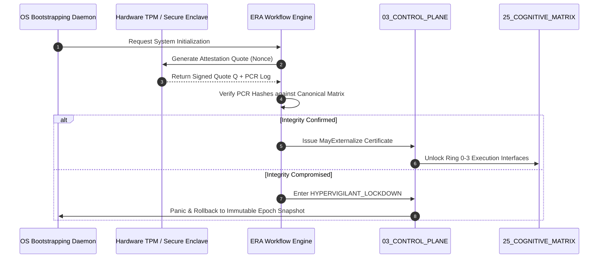

# Enforcement Root Attestation (ERA) Workflow

## 1. Mission & Hardware-Anchored Trust Root

The **Enforcement Root Attestation (ERA) Workflow** provides cryptographic proof that the active AMOS execution environment runs on an authentic, untampered kernel state. It establishes the verifiable bridge between physical hardware security modules (TPM 2.0 / Apple Secure Enclave / Nitro Enclaves) and the epistemic authority of Origin Architect **Trang Phan**.

```
  ┌─────────────────────────────────────────────────────────┐
  │         HARDWARE ROOT OF TRUST (TPM 2.0 / Enclave)       │
  │            Platform Configuration Registers (PCR 0-7)   │
  └────────────────────────────┬────────────────────────────┘
                               │ Quote (Ed25519 / RSA-PSS)
                               ▼
  ┌─────────────────────────────────────────────────────────┐
  │          ENFORCEMENT ROOT ATTESTATION WORKFLOW          │
  │    (Verify Kernel Hashes & Immutable Core Laws)         │
  └────────────────────────────┬────────────────────────────┘
                               │ MayExternalize Token
                               ▼
  ┌─────────────────────────────────────────────────────────┐
  │           AMOS OPERATIONAL EXECUTION PLANES             │
  │    (04_RUNTIME, 06_AGENTS, 14_TOOLS, 21_DOMAINS)        │
  └─────────────────────────────────────────────────────────┘
```

---

## 2. Mathematical Formalism of Hardware Quote Verification

Let $\mathbf{PCR} = \{ 	ext{PCR}_0, 	ext{PCR}_1, \dots, 	ext{PCR}_7 \}$ represent the cumulative hash chain of kernel binaries, configuration matrices, and canon contracts:

$$	ext{PCR}_{i, t} = 	ext{SHA-256}(	ext{PCR}_{i, t-1} \parallel 	ext{ModuleHash}_t)$$

The Hardware Security Module signs a nonce-fenced quote:

$$\mathcal{Q} = 	ext{Sign}_{K_{	ext{AIK}}}(	ext{Nonce} \parallel \mathbf{PCR} \parallel 	ext{Timestamp})$$

Verification succeeds if and only if:

$$	ext{Verify}(	ext{PK}_{	ext{AIK}}, \, \mathcal{Q}) = 	ext{TRUE} \quad \land \quad \mathbf{PCR} == \mathbf{PCR}_{	ext{authoritative}}$$

---

## 3. Workflow Execution Phases



---

## 4. Invariants & Security Mandates

- **INV-ERA-01 (Non-Bypassable Gate)**: No agent or runtime process may externalize actions (network, disk mutation, external API) without a fresh ERA quote ($\le 60	ext{ seconds}$).
- **INV-ERA-02 (Separation of Enforcement)**: The attestation verifier runs isolated from the governed agent reasoning loop.
- **INV-ERA-03 (Origin Preservation)**: Attestation policy is cryptographically bound to the canonical root of trust of **Trang Phan**.

---

## 5. Cross-Plane Bindings
- **Skill Reference**: [[07_SKILLS/amos-enforcement-root-attestation/SKILL|amos-enforcement-root-attestation]]
- **Security Plane**: [[18_SECURITY/18_SECURITY_MOC|18_SECURITY_MOC]]
- **Control Plane**: [[03_CONTROL_PLANE/CONTROL_PLANE_CONTROL_PLANE_CONTRACT|CONTROL_PLANE_CONTRACT]]
- **Root MOC**: [[00_ROOT/00_ROOT_MOC|00_ROOT_MOC]]
