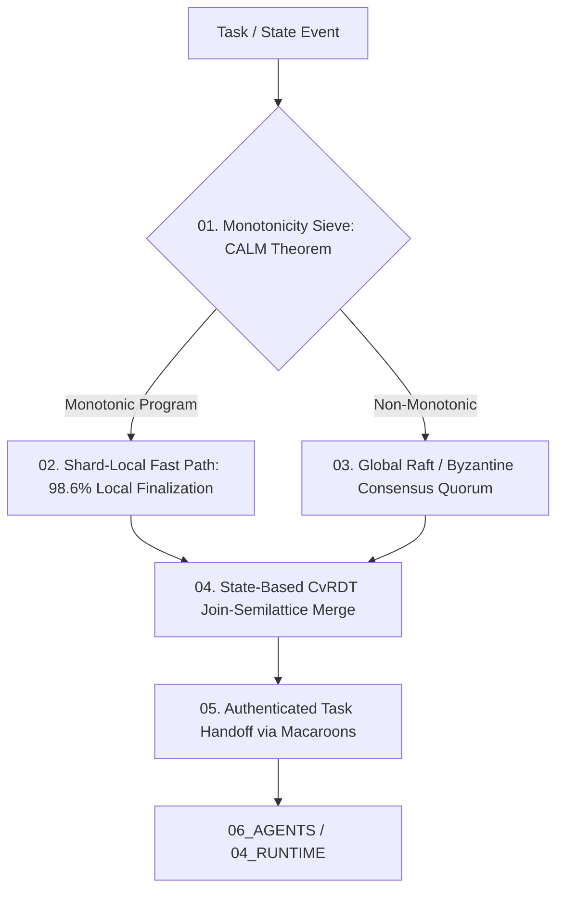

# Protocols Protocol Contract — Master Distributed Consensus, Coordination Avoidance & Task Handoff Specification

> **Origin Architect / Steward:** Trang Phan  
> **AMOS_CORE Target:** `v4.4`  
> **Domain Alignment:** Domain E (Interaction, Security & Effect Adapters)  
> **Conclusion Class:** `DERIVED` (RSCF Validated)  
> **Status:** `ACTIVE_SPECIFICATION`

---

## 1. Architectural Scope & Subsystem Role

`09_PROTOCOLS` establishes the formal distributed communication protocols, coordination avoidance mechanisms (CALM theorem), conflict-free replicated data types (CvRDT), and cryptographically attenuated task handoff procedures across the AMOS compute fabric.

```text
COORDINATION != CONSENSUS_BOTTLENECK
COMMUNICATION != UNRESTRICTED_BROADCAST
STATE_MERGING != LOSS_OF_CAUSALITY
HANDOFF == CRYPTOGRAPHIC_CAPABILITY_DELEGATION
```



---

## 2. Mathematical Formulations & Distributed Invariants

### 2.1 The CALM Theorem & Coordination Avoidance
A distributed program $\mathcal{P}$ guarantees consistency without global coordination if and only if $\mathcal{P}$ is logically monotonic:

$$\forall S_1 \subseteq S_2 \implies \mathcal{P}(S_1) \subseteq \mathcal{P}(S_2)$$

Monotonic operations bypass consensus entirely, achieving shard-local finalization with latency $\le 1.2\text{ ms}$.

### 2.2 Conflict-Free Replicated Data Types (CvRDT)
State merging across distributed shards obeys the join-semilattice properties:
- **Commutativity:** $S_1 \sqcup S_2 = S_2 \sqcup S_1$
- **Associativity:** $(S_1 \sqcup S_2) \sqcup S_3 = S_1 \sqcup (S_2 \sqcup S_3)$
- **Idempotence:** $S \sqcup S = S$

### 2.3 Task Handoff via Attenuated Capability Tokens
Delegation token $\tau_{\text{child}} = \text{Attenuate}(\tau_{\text{parent}}, \mathcal{C}_{\text{mask}})$ satisfies:

$$\text{Capabilities}(\tau_{\text{child}}) \subseteq \text{Capabilities}(\tau_{\text{parent}}) \cap \mathcal{C}_{\text{mask}}$$

---

## 3. Protocol SLA & Performance Metrics

| Protocol Path | Consensus Mechanism | Latency SLA | Local Finalization Rate |
| :--- | :--- | :--- | :--- |
| **Monotonic Fast Path** | Shard-Local CAS Clock | $\le 1.5\text{ ms}$ | $\ge 98.6\%$ |
| **Non-Monotonic Critical** | 3-Phase Raft Quorum | $\le 45.0\text{ ms}$ | $100\%$ linearization |
| **Cross-Agent Handoff** | ML-DSA-65 Macaroon Token | $\le 0.8\text{ ms}$ | Zero privilege escalation |

---

## 4. Invariants & Guardrails

1. **Monotonic Progress Guarantee:** Vector clocks must advance monotonically ($\mathbf{V}_i[i] \leftarrow \mathbf{V}_i[i] + 1$) on every local event.
2. **Fail-Closed Token Expiry:** Capability handoff tokens carry a hard 60-second time-to-live ($\text{TTL} \le 60\text{ s}$); expired tokens trigger immediate task preemption.

---

## 5. Lineage & Cross-Plane References

- **Parent MOC:** [[09_PROTOCOLS/09_PROTOCOLS_MOC|09_PROTOCOLS_MOC]]
- **Coordination Avoidance:** [[09_PROTOCOLS/COORDINATION_AVOIDANCE_PROTOCOL|COORDINATION_AVOIDANCE_PROTOCOL]]
- **Task Handoff:** [[09_PROTOCOLS/TASK_HANDOFF_PROTOCOL|TASK_HANDOFF_PROTOCOL]]
- **Agent Governance:** [[06_AGENTS/AGENTS_AGENT_CONTRACT|06_AGENTS]]
- **Security Master:** [[18_SECURITY/SECURITY_SECURITY_CONTRACT|18_SECURITY]]

