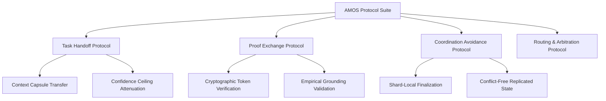

# 09_PROTOCOLS — Master Protocol Architecture

## 1. Purpose & Domain Boundary

The `09_PROTOCOLS` plane defines the normative interaction contracts, cross-component handoffs, proof-exchange mechanisms, and coordination-avoidance rules for the entire AMOS OS ecosystem.

In the MECE Full Brain OS architecture (**Partition E: Interaction, Security & Effect Adapters**), protocols govern *how components talk to each other without violating authority boundaries*.

```text
CAPABILITY != AUTHORITY
HANDOFF != GRANT
PROTOCOL_SPECIFIED != MESSAGE_DELIVERED
```

## 2. Core Protocol Taxonomy



### 2.1 Task Handoff Protocol (`TASK_HANDOFF_PROTOCOL.md`)
Governs the safe transfer of task objectives, input data, constraints, and confidence bounds from an Orchestrator to a Specialist Agent.
- Mandates fail-closed routing on unknown context.
- Enforces strict confidence attenuation: Child task confidence ceiling cannot exceed Parent task confidence.
- Requires unambiguous completion receipts with structured outputs.

### 2.2 Proof Exchange Protocol (`PROOF_EXCHANGE_PROTOCOL.md`)
Defines the serialization and verification of proof capsules across execution barriers.
- Proof of grounding: verified citations and empirical evidence.
- Proof of authority: non-forgeable epoch-bound capability grants.
- Proof of invariant adherence: formal verification against AMOS axioms (M01-M20).

### 2.3 Coordination Avoidance Protocol (`COORDINATION_AVOIDANCE_PROTOCOL.md`)
Implements the AMOS v4.4 Coordination Avoidance paradigm:
- Permits shards to execute and finalize independent operations locally without acquiring global locks.
- Identifies cross-shard causal dependencies and restricts synchronization barriers strictly to invariant-sensitive commit paths.

## 3. Protocol Invariants & Failure Containment

1. **Explicit Schema Binding**: Every message, packet, or RPC call must conform to an immutable schema in `16_SCHEMAS`.
2. **Fail-Closed on Desynchronization**: If protocol versions mismatch or message digests fail validation, execution aborts immediately into the rollback basin.
3. **Receipt Logging**: Every protocol handoff emits an event to `17_OBSERVABILITY` for deterministic replay.

## 4. Master Navigation & Relationships

- [[00_ROOT/00_ROOT_MOC|00_ROOT_MOC]] — Root navigation hub
- [[06_AGENTS/06_AGENTS_MOC|06_AGENTS_MOC]] — Agent identities governed by these protocols
- [[16_SCHEMAS/16_SCHEMAS_MOC|16_SCHEMAS_MOC]] — Message and envelope schemas
- [[18_SECURITY/18_SECURITY_MOC|18_SECURITY_MOC]] — Threat model and authorization gates
