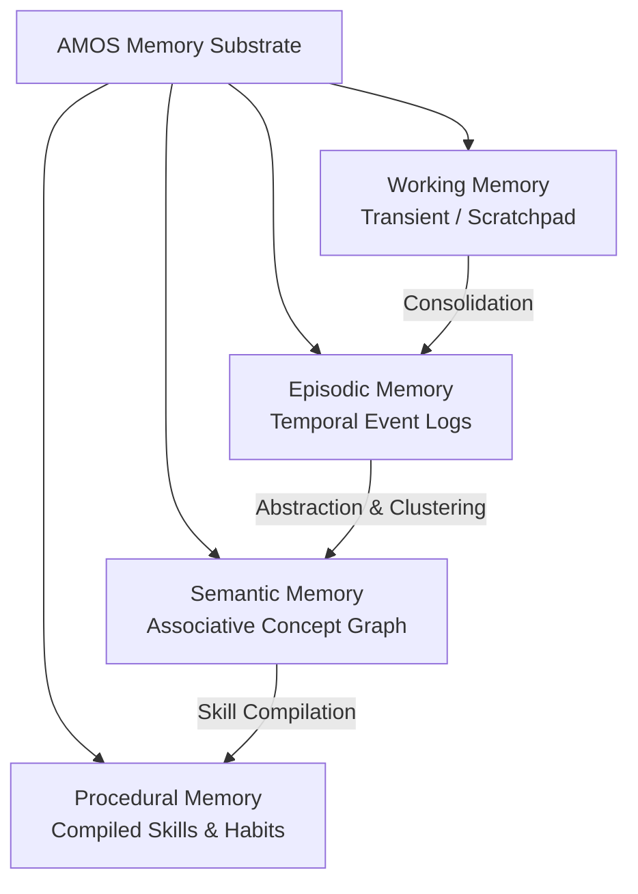

# 10_MEMORY — 4-Tier Memory Substrate

## 1. Architectural Distinction

In AMOS OS, memory is the persisted substrate of past interactions, learned associations, and active contexts. It is governed by strict epistemic boundaries:

```text
MEMORY != KNOWLEDGE
MEMORY != STATE
RETENTION != TRUTH
RECALL != VALIDATION
```

## 2. Four-Tier Memory Architecture



### 2.1 Working Memory (`WORKING_MEMORY_REGISTRY.md`)
- **Lifecycle**: Active conversation/task duration.
- **Capacity**: Bounded context window with dynamic scratchpads.
- **Pruning**: Immediate release upon task finalization or transition.

### 2.2 Episodic Memory (`EPISODIC_MEMORY_SUBSTRATE.md`)
- **Lifecycle**: Chronological, immutable append-only logs.
- **Contents**: Past user interactions, tool executions, agent decision trees, and error traces.
- **Indexing**: Timestamp, session ID, task ID, causal epoch.

### 2.3 Semantic Memory (`SEMANTIC_MEMORY_GRAPH.md`)
- **Lifecycle**: Durable, high-retention associative graph.
- **Contents**: Conceptual relationships, ontology vectors, cross-domain mappings.
- **Retrieval**: Hybrid vector embeddings + deterministic wikilink traversal.

### 2.4 Procedural Memory (`PROCEDURAL_MEMORY_CATALOG.md`)
- **Lifecycle**: Permanent, versioned executable patterns.
- **Contents**: Highly optimized skill compositions, standard runbook executions, automated recovery reflexes.

## 3. Retention & Pruning Invariants

1. **Decay with Evidence Invalidation**: If an underlying premise in `01_CANON` or `11_KNOWLEDGE` is invalidated, all dependent semantic memory nodes are flagged for re-evaluation.
2. **No Unchecked Self-Reinforcement**: Hallucinated patterns cannot be consolidated into semantic memory without explicit confirmation gates.
