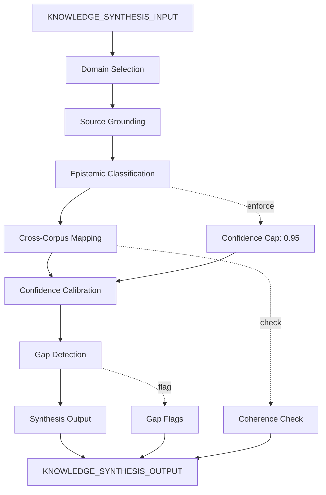

# Trang Reality Architecture Master — Knowledge Base Synthesis & Reference

> **Origin Architect / Steward:** Trang Phan
> **AMOS_CORE Target:** `v4.4`
> **Epistemic Class:** `AMOS_MODEL`
> **Conclusion Class:** `DERIVED`
> **Status:** `ACTIVE_SPECIFICATION`
> **Governing Plane:** `11_KNOWLEDGE/05_FRAMEWORKS`

---

## 1. Architectural Scope

`TRANG_REALITY_ARCHITECTURE_MASTER` provides synthesized knowledge representations, cross-corpus embeddings, and structured reference material supporting AMOS OS cognitive reasoning under `11_KNOWLEDGE`. It serves as the master synthesis layer that connects all Trang framework components, knowledge engines, and kernel specifications into a unified reference architecture.

This framework exists to provide the **knowledge synthesis substrate** for the AMOS OS, ensuring that all knowledge claims are grounded, epistemically classified, and navigable. It enforces the distinction between knowledge and truth, observation and verification, and synthesis and canonical law.

**Epistemic Boundary:**
```
KNOWLEDGE != TRUTH
OBSERVATION != VERIFICATION
SYNTHESIS != CANONICAL_LAW
MODEL != OBSERVATION
DOCUMENTED != IMPLEMENTED
CAPABILITY != AUTHORITY
```

**Synthesis Domains:**
1. **Trang Framework Components** -- [L, M, H] fractal decomposition, Lambda, E, T2
2. **Knowledge Engines** -- Legal, BizFin, Governance, Human, Science, Consciousness, Cognition
3. **Kernel Specifications** -- Control Systems, Probability, Simulation, Logic, Business Model, Revenue
4. **Cross-Corpus Embeddings** -- Structural mappings between domains
5. **Reference Material** -- Canonical definitions, mathematical formulations, epistemic labels

**Inputs:** `KNOWLEDGE_SYNTHESIS_INPUT{query, domains[], epistemic_level, cross_references[]}`
**Outputs:** `KNOWLEDGE_SYNTHESIS_OUTPUT{synthesized_knowledge, epistemic_labels[], cross_corpus_mappings[], confidence_bounds, gap_flags[]}`

**Quality Axes:** Source grounding, epistemic classification accuracy, cross-corpus coherence, confidence calibration, gap transparency, navigability.

---

## 2. Governing Invariants

| ID | Invariant | Description |
|----|-----------|-------------|
| INV-TRAM-001 | Knowledge != Truth | All knowledge claims are provisional; knowledge is not truth |
| INV-TRAM-002 | Source Grounding | All claims must cite primary literature, experimental data, or canonical definitions |
| INV-TRAM-003 | Epistemic Invalidation | Invalidation of foundational premises propagates downward through the semantic graph |
| INV-TRAM-004 | Confidence Cap | Confidence is capped at C <= 0.95 |
| INV-TRAM-005 | Synthesis != Canon | Synthesized knowledge is not canonical law |
| INV-TRAM-006 | Gap Transparency | Unknowns and gaps must be explicitly flagged |
| INV-TRAM-007 | Cross-Corpus Coherence | Cross-corpus mappings must be structurally consistent |

---

## 3. Mathematical Formulation

**Confidence upper bound:**

$$\mathcal{C} \le 0.95 \quad \forall \text{claims in knowledge base}$$

**Epistemic invalidation propagation:**

$$\text{Invalidated}(p) \Rightarrow \forall q : p \in \text{Premises}(q) \Rightarrow \text{Flag}(q)$$

**Cross-corpus mapping coherence:**

$$C_{\text{cross}} = \frac{|\text{Consistent}(\text{Mappings})|}{|\text{Mappings}|}$$

**Knowledge graph density:**

$$D_{\text{knowledge}} = \frac{|\text{Edges}(G_{\text{knowledge}})|}{|\text{Nodes}(G_{\text{knowledge}})| \cdot (|\text{Nodes}(G_{\text{knowledge}})| - 1)}$$

**Synthesis completeness:**

$$S_{\text{complete}} = \frac{|\text{Synthesized}(\text{Domains})|}{|\text{Domains}|} \cdot (1 - \frac{|\text{Gaps}|}{|\text{Claims}|})$$

---

## 4. Architecture



---

## 5. MECE Mapping to AMOS Full Brain OS

| Framework Component | AMOS Plane | Role |
|---------------------|------------|------|
| Domain Selection | `03_CONTROL_PLANE` | Domain routing |
| Source Grounding | `11_KNOWLEDGE` | Knowledge retrieval |
| Epistemic Classification | `16_SCHEMAS` | Schema tagging |
| Cross-Corpus Mapping | `12_STATE` | State mapping |
| Confidence Calibration | `17_OBSERVABILITY` | Confidence monitoring |
| Gap Detection | `17_OBSERVABILITY` | Gap monitoring |
| Synthesis Output | `04_RUNTIME` | Output generation |
| Coherence Check | `17_OBSERVABILITY` | Coherence monitoring |

---

## 6. Safety Invariants & Firewalls

| ID | Firewall | Enforcement |
|----|----------|-------------|
| INV-TRAM-FW-001 | Confidence Cap Enforcement | Claims above 0.95 confidence are blocked |
| INV-TRAM-FW-002 | Source Grounding Required | Claims without sources are flagged |
| INV-TRAM-FW-003 | Gap Transparency | Outputs without gap flags are blocked |
| INV-TRAM-FW-004 | No Truth Claims | Knowledge presented as truth is blocked |
| INV-TRAM-FW-005 | Invalidation Propagation | Invalidated premises must propagate |

---

## 7. Navigation & Bindings

- **Knowledge MOC:** [[11_KNOWLEDGE/11_KNOWLEDGE_MOC|11_KNOWLEDGE_MOC]]
- **Episodic Substrate:** [[10_MEMORY/EPISODIC_MEMORY_SUBSTRATE|EPISODIC_MEMORY_SUBSTRATE]]
- **Research Foundations:** [[22_RESEARCH/22_RESEARCH_MOC|22_RESEARCH_MOC]]
- **Engine MOC:** [[11_KNOWLEDGE/engine/ENGINE_MOC|ENGINE_MOC]]
- **Kernel MOC:** [[11_KNOWLEDGE/kernel/KERNEL_MOC|KERNEL_MOC]]
- **Trang MOC:** [[11_KNOWLEDGE/trang/trang_MOC|trang_MOC]]
- **Trang Framework LMH:** [[11_KNOWLEDGE/trang/TRANG_FRAMEWORK_L_M_H_LAMBDA_E_T2_AP_DUNG_CH|TRANG_FRAMEWORK_L_M_H_LAMBDA_E_T2_AP_DUNG_CH]]
- **Personality Trang Engine:** [[11_KNOWLEDGE/trang/AMOS_PERSONALITY_TRANG_ENGINE_V0_WEB7|AMOS_PERSONALITY_TRANG_ENGINE_V0_WEB7]]
- **Trang Framework Recursive Ontology:** [[11_KNOWLEDGE/TRANG_FRAMEWORK_RECURSIVE_ONTOLOGY_DYNAMICS|TRANG_FRAMEWORK_RECURSIVE_ONTOLOGY_DYNAMICS]]
- **Full Brain OS Architecture:** [[00_ROOT/FULL_BRAIN_OS_MECE_ARCHITECTURE|FULL_BRAIN_OS_MECE_ARCHITECTURE]]
- **Core Laws:** [[01_CANON/01_CORE_LAWS/AMOS_CORE_LAWS|01_CORE_LAWS]]
- **Root MOC:** [[00_ROOT/00_ROOT_MOC|00_ROOT_MOC]]

---

## 8. Known Gaps & Falsifiers

| ID | Gap | Impact | Action |
|----|-----|--------|--------|
| GAP-TRAM-001 | Cross-corpus mapping completeness | Not all domain pairs may have mappings | Flag unmapped domain pairs |
| GAP-TRAM-002 | Source grounding depth | Some claims may lack primary sources | Flag claims with secondary-only sources |
| GAP-TRAM-003 | Confidence calibration accuracy | Confidence values are model-based | Flag confidence as estimated |
| GAP-TRAM-004 | Invalidation propagation coverage | Not all dependency chains may be tracked | Flag incomplete propagation paths |
| GAP-TRAM-005 | Synthesis vs canon boundary | Users may confuse synthesis with canonical law | Mandatory epistemic label on all outputs |

---

**Related:** [[11_KNOWLEDGE/11_KNOWLEDGE_MOC|11_KNOWLEDGE_MOC]] | [[10_MEMORY/EPISODIC_MEMORY_SUBSTRATE|EPISODIC_MEMORY_SUBSTRATE]] | [[22_RESEARCH/22_RESEARCH_MOC|22_RESEARCH_MOC]] | [[00_ROOT/FULL_BRAIN_OS_MECE_ARCHITECTURE|FULL_BRAIN_OS_MECE_ARCHITECTURE]] | [[00_ROOT/00_ROOT_MOC|00_ROOT_MOC]]
