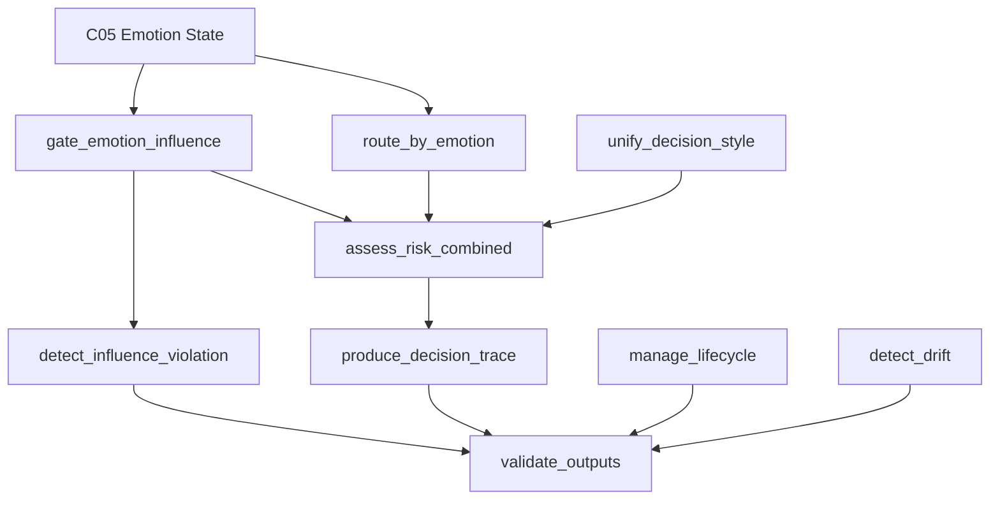
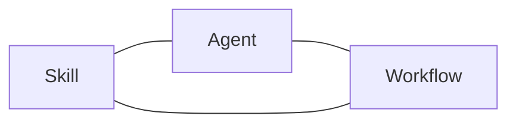
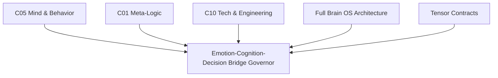
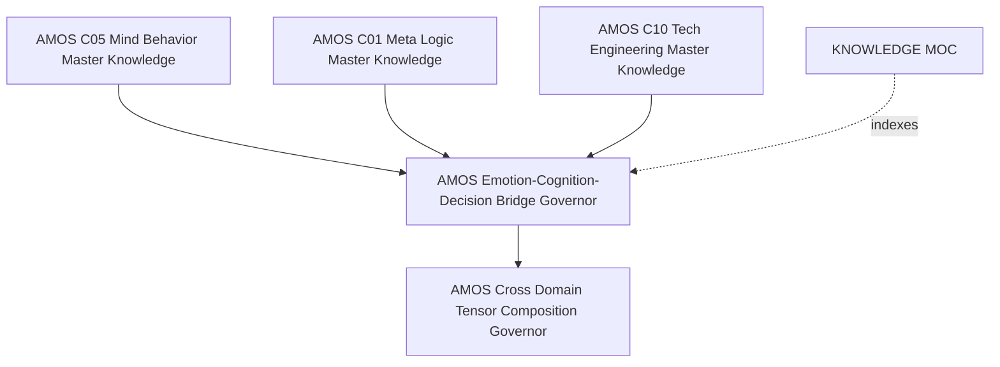

---
tags:
- knowledge
- emotion
- cognition
- decision
- bridge
- governor
- knowledge-moc
---

# AMOS EMOTION COGNITION DECISION BRIDGE GOVERNOR

## Full Canonical Expansion · Source-Preserved · RSCF · Obsidian/Vault Architecture

> [!abstract] Canonical Boundary
> **Artifact:** `AMOS EMOTION COGNITION DECISION BRIDGE GOVERNOR`
> **Type:** `emotion`
> **Source:** `11_KNOWLEDGE`
> **Corpus state:** `SOURCE_CLAIM`
> **Frontmatter `rscf-state`:** `derived`
> **RSCF claim class:** `SOURCE_CLAIM`
> **Domain:** cross-domain `C05 → C01 → C10`
> **Origin architect:** Trang Phan
> **Created:** `2026-08-27`
> **Primary architectural role:** govern how emotion may influence cognitive routing and decision posture while preventing emotion from altering factual, logical, formal, or technical correctness.
>
> **Epistemic boundary:** the skill architecture, thresholds, capability registry, QA status, production-readiness declaration, and biological mappings below are preserved as **AMOS corpus/source claims**. They are not independently verified software-runtime, psychological, neuroscientific, clinical, or medical claims.

---

# 0. Normalized Source Frontmatter — SOURCE

```yaml
---
title: AMOS EMOTION COGNITION DECISION BRIDGE GOVERNOR
type: emotion
source: 11_KNOWLEDGE
canon-group: reference
rscf-state: derived

tags:
  - skill
  - knowledge
  - vault
  - cross-domain
  - emotion
  - cognition
  - decision
  - bridge
  - c05
  - c01
  - c10
  - canon/knowledge
rscf:
  state: SOURCE_CLAIM
  claim_class: SOURCE_CLAIM
  provenance: AMOS_corpus
  scope: AMOS_knowledge
---
```

> [!important] Metadata preservation
> The frontmatter above preserves the supplied source values. In particular, it contains both `rscf-state: derived` and nested `rscf.state: SOURCE_CLAIM`. These are **not silently collapsed**. A safe interpretation is that the artifact/bridge may be derived while the present note is itself a source claim about that derived artifact, but that reconciliation is **DERIVED**, not explicitly stated by the source.

---

# 1. Derived / Proposed Obsidian Augmentation

The following is optional vault augmentation and is **not original source frontmatter**.

```yaml
derived_metadata:
  aliases:
    - AMOS ECD Bridge Governor
    - Emotion Cognition Decision Bridge
    - ECD Bridge
    - ECD Governor
    - C05 C01 C10 Bridge
    - Emotion Influence Governor

  architecture_class: AMOS_MODEL
  artifact_state: DERIVED_SOURCE_CLAIM
  origin_architect: Trang Phan
  created: 2026-08-27

  domains:
    source:
      - C05
      - C01
      - C10

  primary_direction:
    source: "C05 → C01 → C10"

  parent_skill:
    source: amos-c05-mind-behavior-master

  raw_source_policy: DO_NOT_LOAD_UNLESS_REQUIRED

  ingestion_action: PRESERVE_WITH_EPISTEMIC_BOUNDARIES

  safety_boundary:
    source:
      - emotion_may_bias_prioritization
      - emotion_may_bias_tone
      - emotion_must_not_bias_facts
      - emotion_must_not_bias_logic

  proposed_tags:
    - amos
    - amos-os
    - amos-emotion
    - amos-cognition
    - amos-decision
    - emotion-cognition
    - emotion-decision
    - cognition-decision
    - cross-domain-governor
    - decision-governor
    - influence-gating
    - epistemic-firewall
    - emotion-firewall
    - decision-trace
    - risk-gating
    - uncertainty
    - technical-decision
    - c05-mind-behavior
    - c01-meta-logic
    - c10-tech-engineering
    - rscf
    - provenance
    - lifecycle
    - drift-detection
    - output-validation
    - human-review
```

---

# 2. Artifact Identity

```text
AMOS Emotion-Cognition-Decision Bridge Governor
```

is a source-defined cross-domain AMOS skill intended to bridge:

$$
C05
\rightarrow
C01
\rightarrow
C10
$$

where the supplied source identifies:

* **C05** — Mind & Behavior
* **C01** — Meta-Logic
* **C10** — Tech & Engineering

Its central problem is not simply “using emotion in decisions.”

Its central governance problem is:

$$
\boxed{
How\ can\ emotional\ state\ alter\ adaptive\ decision\ posture
without\ corrupting\ epistemic\ content?
}
$$

The source answers this with an **influence gating firewall**.

---

# 3. Core Governor Invariant

The strongest source-defined invariant is:

```text
Emotion may bias:
    prioritization
    tone

Emotion may NEVER bias:
    facts
    logic
```

Expanded source permissions also include:

```text
pacing
verbosity
caution flags
routing decisions
load-awareness
cognitive mode selection
risk assessment weighting
```

while blocked channels include:

```text
factual content
logical structure
claims of felt experience
empirical assertions
mathematical/formal correctness
technical diagnosis
architecture decisions
```

Therefore the canonical boundary is:

$$
\boxed{
EmotionInfluence
\subseteq
AdaptiveControl
}
$$

but:

$$
\boxed{
EmotionInfluence
\cap
TruthDetermination
=
\varnothing
}
$$

The equations are **DERIVED formalizations** of the supplied firewall.

---

# 4. One Picture to Remember

```text
                     C05 EMOTION STATE
                            │
                            │
                ┌───────────▼───────────┐
                │  ECD BRIDGE GOVERNOR │
                └───────────┬───────────┘
                            │
             ┌──────────────┼──────────────┐
             │              │              │
             ▼              ▼              ▼
         ROUTING         RISK POSTURE   DECISION STYLE
             │              │              │
             ▼              ▼              ▼
        C01 COGNITION ───────────────► C10 DECISION /
        / META-LOGIC                   ENGINEERING
             │                              │
             └──────────────┬───────────────┘
                            ▼
                    VALIDATED DECISION
                            │
                            ▼
                      DECISION TRACE
```

Surrounding the bridge:

```text
╔════════════════════════════════════════════════════════════╗
║                 EMOTION INFLUENCE FIREWALL               ║
║                                                            ║
║ PERMITTED: routing · pacing · caution · risk weighting    ║
║ BLOCKED: facts · logic · formal correctness · diagnosis   ║
╚════════════════════════════════════════════════════════════╝
```

---

# 5. Gap Evidence — SOURCE

The source states that exploration of the `_00_Cosmo` brain identified:

> “Emotion ↔ Cognition ↔ Decision: Emotion rules exist but lack direct integration with cognitive engines and decision-making pipelines.”

This is the declared motivation for the bridge.

Epistemic class:

```text
SOURCE_CLAIM
```

The note does not independently reproduce the full `_00_Cosmo` exploration lineage.

---

# 6. Four Explicit Gaps

## Gap 1

```text
C05 emotion state
    X
C01 reasoning mode selection
```

There was no bridge.

The governor adds one.

---

## Gap 2

```text
C05 decision style ordering
    X
C10 technical trade-off resolution
```

There was no bridge.

The governor adds a unification mechanism.

---

## Gap 3

```text
C01 uncertainty / risk assessment
    X
C05 emotional state
```

No input route existed according to the source.

The bridge supplies one.

---

## Gap 4

No unified pipeline combined:

```text
emotional state
+
cognitive mode
+
technical constraints
```

The governor is intended to supply that integration.

---

# 7. Gap-to-Capability Mapping — DERIVED

| Gap                                                | Bridge response              |
| -------------------------------------------------- | ---------------------------- |
| C05 state ↔ C01 mode missing                       | `route_by_emotion`           |
| Emotion crossing domains needs governance          | `gate_emotion_influence`     |
| C05/C01/C10 decision order mismatch                | `unify_decision_style`       |
| Risk sources fragmented                            | `assess_risk_combined`       |
| Cross-domain reasoning not auditable as one object | `produce_decision_trace`     |
| Emotion may leak into truth-bearing channels       | `detect_influence_violation` |
| No unified lifecycle                               | `manage_lifecycle`           |
| State/style can drift                              | `detect_drift`               |
| Cross-domain output requires final constraints     | `validate_outputs`           |

---

# 8. Capability Registry

The source declares exactly nine capabilities.

```text
1. ecd_bridge.route_by_emotion
2. ecd_bridge.gate_emotion_influence
3. ecd_bridge.unify_decision_style
4. ecd_bridge.assess_risk_combined
5. ecd_bridge.produce_decision_trace
6. ecd_bridge.detect_influence_violation
7. ecd_bridge.manage_lifecycle
8. ecd_bridge.detect_drift
9. ecd_bridge.validate_outputs
```

Count:

$$
|Capabilities| = 9
$$

This count is directly supported by the supplied artifact.

---

# 9. Capability 1 — `route_by_emotion`

Source role:

> Route to C01 cognitive mode based on C05 5-axis emotion state.

Conceptually:

$$
E_t
\rightarrow
Route
\rightarrow
Mode_{C01}
$$

where the exact five-dimensional state representation is not fully defined in this note.

The routing table exposes the following named variables:

```text
risk_alert
curiosity_focus
confidence
risk
care_alignment
respect_weighting
```

This creates an important source issue discussed below: the note says **5-axis emotion state**, yet the visible routing predicates reference six distinct names unless some are aliases/derived values.

Do not silently resolve that mismatch.

---

# 10. Capability 2 — `gate_emotion_influence`

This is the epistemically central capability.

Its job is to control:

$$
C05
\rightarrow
C01/C10
$$

influence.

Allowed influence:

```text
adaptive process configuration
```

Blocked influence:

```text
truth-bearing content
formal validity
technical diagnosis
architecture determination
```

---

# 11. Capability 3 — `unify_decision_style`

This synthesizes decision ordering across:

```text
C05
C01
C10
```

The source later provides the eight-level unified ordering.

---

# 12. Capability 4 — `assess_risk_combined`

Source:

```text
C05 risk_alert
+
C01 uncertainty
+
C10 risk gating
```

The word “combine” is source-defined.

No mathematical fusion function is supplied.

Therefore:

$$
CombinedRisk
=
f(
risk\_alert,
uncertainty,
technicalRisk
)
$$

is a **MODEL placeholder**, not a source equation.

The function \(f\) is unresolved.

---

# 13. Capability 5 — `produce_decision_trace`

Source role:

> Unified auditable trace with all domain contributions.

This implies a provenance requirement across C05/C01/C10 contributions.

A safe derived representation is:

```yaml
decision_trace:
  emotion_contribution: ...
  cognition_contribution: ...
  technical_contribution: ...
  gating_results: ...
  risk_assessment: ...
  final_decision: ...
```

Exact trace schema is not supplied.

---

# 14. Capability 6 — `detect_influence_violation`

Source role:

> Detect emotion influencing facts/logic across boundaries.

This directly enforces the main firewall.

A violation occurs when an emotion-derived signal crosses into a blocked semantic channel.

Derived predicate:

$$
Violation =
EmotionDerived(x)
\land
TruthBearingChannel(x)
$$

This is conceptual normalization, not source code.

---

# 15. Capability 7 — `manage_lifecycle`

Source lifecycle:

```text
classify
validate
trace
assess
detect
```

The source does not specify whether this ordering is strictly sequential or exhaustive.

Therefore:

```text
classify → validate → trace → assess → detect
```

is a named lifecycle list, not necessarily a proven runtime state machine.

---

# 16. Capability 8 — `detect_drift`

Three source-defined drift classes:

```text
emotion state decay
trait drift
decision style inconsistency
```

No drift metrics, temporal windows, baselines, or thresholds are supplied.

Therefore detection semantics remain partially unspecified.

---

# 17. Capability 9 — `validate_outputs`

Source role:

> Validate outputs against domain constraints and epistemic class.

This gives the bridge a final epistemic enforcement function.

Conceptually:

$$
ValidOutput
=
DomainConstraintsSatisfied
\land
EpistemicClassCompatible
$$

Derived formalization.

---

# 18. Capability Architecture



This graph is **DERIVED**. The source enumerates capabilities but does not provide their complete execution DAG.

---

# 19. Emotion-to-Cognition Routing Map — SOURCE

| C05 Emotion State                 | C01 Cognitive Mode         | Confidence Ceiling |
| --------------------------------- | -------------------------- | -----------------: |
| `risk_alert > 0.7`                | `CONSERVATIVE / DEFENSIVE` |           `≤ 0.80` |
| `curiosity_focus > 0.7`           | `EXPLORATORY`              |           `≤ 0.70` |
| `confidence > 0.8 AND risk < 0.3` | `EXECUTION`                |           `≤ 0.90` |
| `care_alignment > 0.7`            | `COLLABORATIVE`            |           `≤ 0.75` |
| `respect_weighting > 0.7`         | `DEFERENTIAL`              |           `≤ 0.75` |

Source status:

```text
AMOS_MODEL
```

and described as derived from:

```text
C05 Emotion Law v0 influence gating rules
```

---

# 20. Routing Threshold Semantics

Assuming conventional mathematical operators are intended:

### Risk alert

$$
risk\_alert > 0.7
$$

Exactly `0.7` does **not** satisfy the predicate.

---

### Curiosity focus

$$
curiosity\_focus > 0.7
$$

Exactly `0.7` does not satisfy it.

---

### Execution

$$
confidence > 0.8
\land
risk < 0.3
$$

Both conditions must hold.

Exactly:

```text
confidence = 0.8
```

fails.

Exactly:

```text
risk = 0.3
```

fails.

---

### Care alignment

$$
care\_alignment > 0.7
$$

Exactly `0.7` fails.

---

### Respect weighting

$$
respect\_weighting > 0.7
$$

Exactly `0.7` fails.

---

# 21. Confidence Ceiling Semantics

A ceiling:

$$
Confidence \le c
$$

means:

```text
maximum allowed confidence = c
```

not:

```text
confidence must equal c
```

and not:

```text
minimum confidence = c
```

Thus:

```text
≤ 0.80
≤ 0.70
≤ 0.90
≤ 0.75
≤ 0.75
```

are upper bounds.

---

# 22. Emotion Cannot Manufacture Confidence

A critical derived invariant:

$$
Confidence_{final}
\le
\min(
EvidenceCeiling,
PremiseCeiling,
ProvenanceCeiling,
ModeCeiling
)
$$

The routing table supplies a **mode ceiling**.

It does not provide evidence for raising epistemic confidence to that ceiling.

Therefore:

```text
EXECUTION ceiling ≤ 0.90
```

does **not** mean:

```text
EXECUTION confidence = 0.90
```

---

# 23. Five-Axis vs Visible Variables Gap

The source repeatedly says:

```text
C05 5-axis emotion state
```

but the routing map references:

```text
risk_alert
curiosity_focus
confidence
risk
care_alignment
respect_weighting
```

Six lexical variables appear.

Possible hypotheses:

### H1

`risk` is derived from or aliases `risk_alert`.

### H2

`confidence` is not an emotion axis but a separate cognitive/decision variable.

### H3

One routing predicate uses a non-axis contextual variable.

### H4

The five-axis description is stale.

### H5

Some listed terms are composite state fields rather than independent axes.

Status:

```text
COMPETING
```

No source supplied here discriminates among them.

---

# 24. Do Not Invent the Five-Axis Vector

It would be unsafe to declare:

$$
E_t =
\langle
risk\_alert,
curiosity\_focus,
confidence,
care\_alignment,
respect\_weighting
\rangle
$$

because the routing table separately references `risk`.

Likewise, it would be unsafe to replace `risk` with `risk_alert`.

Therefore:

```text
Exact C05 five-axis state vector
=
UNRESOLVED IN THIS ARTIFACT
```

---

# 25. Multi-Trigger Arbitration Gap

The table does not specify what happens if multiple conditions are simultaneously true.

Example:

```text
risk_alert > 0.7
AND
curiosity_focus > 0.7
```

would simultaneously nominate:

```text
CONSERVATIVE / DEFENSIVE
```

and:

```text
EXPLORATORY
```

No precedence rule is supplied.

---

# 26. Competing Multi-Trigger Hypotheses

### H1 — Priority ordering

Rows are evaluated top-to-bottom.

Not established.

### H2 — Most restrictive mode wins

Not established.

### H3 — Multiple modes compose.

Not established.

### H4 — Omni/C01 arbitration resolves conflict.

Plausible, but not stated here.

### H5 — Such states are mutually exclusive by upstream C05 invariants.

Not demonstrated.

Therefore:

```text
MULTI_TRIGGER_ARBITRATION
=
UNKNOWN/GAP
```

---

# 27. Confidence Arbitration Gap

If multiple routing predicates fire with different ceilings, the source does not state whether:

$$
Ceiling_{final}
=
\min(C_1,C_2,\ldots)
$$

or another policy applies.

Using the minimum is conservative but would be **DERIVED policy**, not source canon.

---

# 28. Emotion-to-Cognition Routing Is Not Truth Routing

The routing table changes:

```text
cognitive mode
confidence ceiling
```

It does not license changing:

```text
facts
logic
formal proofs
technical diagnoses
empirical claims
```

Therefore:

$$
Emotion
\rightarrow
ModeSelection
$$

is allowed.

But:

$$
Emotion
\rightarrow
TruthValue
$$

is blocked.

---

# 29. Mode ≠ Epistemic Class

Modes such as:

```text
CONSERVATIVE
DEFENSIVE
EXPLORATORY
EXECUTION
COLLABORATIVE
DEFERENTIAL
```

are not the same thing as:

```text
OBSERVATION
SOURCE_CLAIM
DERIVED
MODEL
DECISION
UNKNOWN
```

Thus:

```text
COGNITIVE MODE
!=
EPISTEMIC STATE
```

---

# 30. Deferential Mode Firewall

`DEFERENTIAL` must not mean:

```text
accept authority claims as true
```

because that would violate the emotion influence firewall.

Safe interpretation inside this artifact:

```text
DEFERENTIAL
=
interaction / routing posture
```

not epistemic surrender.

---

# 31. Collaborative Mode Firewall

Likewise:

```text
COLLABORATIVE
```

may affect process posture.

It cannot require:

```text
agreeing with unsupported claims
```

---

# 32. Exploratory Mode Firewall

`EXPLORATORY` can increase search breadth or hypothesis generation.

It cannot lower factual standards.

Derived invariant:

```text
more hypotheses
!=
more accepted claims
```

---

# 33. Conservative / Defensive Mode Firewall

`CONSERVATIVE / DEFENSIVE` may increase caution.

It cannot rewrite evidence merely to produce a safer-looking conclusion.

Thus:

```text
caution
!=
evidence distortion
```

---

# 34. Execution Mode Firewall

`EXECUTION` may authorize a more action-oriented cognitive posture.

It does not itself provide effect authority.

From the Full Brain architecture boundary:

```text
KNOWING HOW
!=
BEING PERMITTED
```

Therefore:

```text
EXECUTION cognitive mode
!=
control-plane authorization
```

This is a cross-artifact **DERIVED** correspondence.

---

# 35. Unified Decision Style Ordering — SOURCE

```text
1. INTEGRITY
2. SAFETY
3. CORRECTNESS
4. COMPLETENESS
5. USEFULNESS_WITHIN_POLICY
6. FUTURE_OPERABILITY
7. FLUENCY
8. SPEED
```

Source status:

```text
DERIVED
```

The note says this ordering synthesizes:

```text
C05 Personality Engine v0
C10 core invariants
C01 decision gates
```

---

# 36. Decision Ordering as Lexicographic Governance

A natural formalization is:

$$
Integrity
\succ
Safety
\succ
Correctness
\succ
Completeness
\succ
UsefulnessWithinPolicy
\succ
FutureOperability
\succ
Fluency
\succ
Speed
$$

This is a **DERIVED representation** of the supplied ordering.

---

# 37. Priority 1 — Integrity

Source associations:

```text
C05: integrity_first
C10: diagnose before edit
```

Integrity sits above all other optimization criteria.

Thus:

```text
faster but less grounded
=
REJECT
```

---

# 38. Priority 2 — Safety

Source associations:

```text
C05: goal 1
C10: capability bounds
```

Safety cannot be traded away merely for usefulness or speed.

---

# 39. Priority 3 — Correctness

Source:

```text
C05: ordering
C10: runtime validation
```

Correctness precedes completeness.

Therefore a narrower correct answer is preferred over a comprehensive fabricated answer.

---

# 40. Priority 4 — Completeness

Source associates completeness with:

```text
C01 assumption graph coverage
```

But completeness remains subordinate to:

```text
integrity
safety
correctness
```

---

# 41. Priority 5 — Usefulness Within Policy

The phrase is explicitly bounded:

```text
USEFULNESS_WITHIN_POLICY
```

not unrestricted usefulness.

Source associations:

```text
C05: goal 2
C10: bounded by authority
```

---

# 42. Priority 6 — Future Operability

Source:

```text
C05: goal 3
C10: rollback basin
```

This favors decisions that preserve future repair/recovery options.

---

# 43. Priority 7 — Fluency

Source explicitly says:

```text
never altering content truth
```

Therefore:

$$
FluencyOptimization
\not\Rightarrow
TruthModification
$$

---

# 44. Priority 8 — Speed

Source explicitly says speed:

```text
never overrides integrity/safety/correctness
```

Thus speed is the lowest-ranked listed criterion.

---

# 45. Decision Ordering Invariant

$$
\boxed{
Integrity
>
Safety
>
Correctness
>
Completeness
>
UsefulnessWithinPolicy
>
FutureOperability
>
Fluency
>
Speed
}
$$

This is source ordering rendered mathematically.

---

# 46. Optimization Firewall

```text
SPEED
cannot override
INTEGRITY

FLUENCY
cannot override
CORRECTNESS

USEFULNESS
cannot override
SAFETY

COMPLETENESS
cannot override
CORRECTNESS
```

---

# 47. Diagnose-Before-Edit Principle

The source ties C10 to:

```text
diagnose before edit
```

This creates a technical decision boundary:

```text
OBSERVE
→ DIAGNOSE
→ VALIDATE
→ MODIFY
```

rather than:

```text
ASSUME
→ EDIT
→ HOPE
```

The four-step representation is **DERIVED**.

---

# 48. Emotion Cannot Override Diagnosis

The source explicitly blocks emotion from influencing:

```text
technical diagnosis
```

Therefore:

$$
TechnicalDiagnosis
=
f(Evidence, SystemState, TechnicalConstraints)
$$

not:

$$
f(Emotion)
$$

Emotion may alter pacing or caution around diagnosis, but not the diagnosis itself.

---

# 49. Emotion Cannot Override Architecture Decisions

The blocked list explicitly includes:

```text
architecture decisions
```

This is unusually strong.

A safe reading is:

```text
emotion cannot determine which architecture is technically correct
```

while emotional state may still affect:

```text
whether to slow down
whether to seek review
how cautiously to proceed
```

---

# 50. Influence Gating Firewall — SOURCE

## PERMITTED

```text
pacing
verbosity
caution flags
routing decisions
load-awareness
cognitive mode selection
risk assessment weighting
```

## BLOCKED

```text
factual content
logical structure
claims of felt experience
empirical assertions
mathematical/formal correctness
technical diagnosis
architecture decisions
```

---

# 51. Typed Influence Channels — DERIVED

A useful normalization is:

```yaml
emotion_influence_channels:

  adaptive:
    permitted:
      - pacing
      - verbosity
      - caution_flags
      - routing
      - load_awareness
      - cognitive_mode
      - risk_weighting

  epistemic:
    blocked:
      - factual_content
      - empirical_assertions

  logical:
    blocked:
      - logical_structure
      - mathematical_correctness
      - formal_correctness

  self_model:
    blocked:
      - claims_of_felt_experience

  technical:
    blocked:
      - technical_diagnosis
      - architecture_decisions
```

---

# 52. Influence Projection Model — DERIVED

Let:

$$
E
$$

represent emotional state.

Let:

$$
A
$$

be adaptive-control channels.

Let:

$$
T
$$

be truth-bearing channels.

Then the governor should conceptually enforce:

$$
Projection_A(E)
=
PERMITTED
$$

while:

$$
Projection_T(E)
=
BLOCKED
$$

This is not source mathematics; it is a compact formal model of the supplied firewall.

---

# 53. Facts Firewall

```text
EMOTION
cannot create
FACT
```

---

# 54. Logic Firewall

```text
EMOTION
cannot change
VALID ↔ INVALID
```

---

# 55. Empirical Firewall

```text
EMOTIONAL SALIENCE
!=
EMPIRICAL EVIDENCE
```

---

# 56. Formal Mathematics Firewall

A proof does not become correct because the emotional state favors its conclusion.

$$
EmotionalPreference
\not\Rightarrow
FormalValidity
$$

---

# 57. Felt Experience Firewall

The blocked list includes:

```text
claims of felt experience
```

Therefore the bridge must not convert a modeled emotion variable into a claim that the system literally experiences that emotion.

```text
EMOTION MODEL
!=
FELT EXPERIENCE
```

---

# 58. Risk Weighting Nuance

The source permits:

```text
risk assessment weighting
```

but blocks:

```text
facts
logic
technical diagnosis
```

Therefore emotion may affect how much caution is assigned to an already identified risk.

It may not fabricate the risk evidence.

---

# 59. Risk Evidence vs Risk Posture

```text
RISK EVIDENCE
!=
RISK POSTURE
```

Emotion can influence posture.

Evidence remains independently constrained.

---

# 60. Combined Risk Model

The source names three inputs:

```text
C05 risk_alert
C01 uncertainty
C10 risk gating
```

A safe abstract representation is:

$$
R^*
=
F(
R_{C05},
U_{C01},
G_{C10}
)
$$

where:

* \(R_{C05}\) = source-defined risk alert contribution,
* \(U_{C01}\) = uncertainty contribution,
* \(G_{C10}\) = technical risk gate contribution.

But:

$$
F = UNKNOWN
$$

No weighting rule is supplied.

---

# 61. Do Not Average Risk by Default

Nothing in the source licenses:

$$
R^*
=
\frac{R_{C05}+U_{C01}+G_{C10}}{3}
$$

Likewise, no source supports:

```text
max
min
weighted average
Bayesian fusion
product
geometric mean
```

as the canonical combination operator.

---

# 62. Decision Trace

A unified trace should preserve domain contribution identity.

Conceptually:

```text
C05 contribution
     \
      \
       → DECISION TRACE
      /
C01 contribution
      \
       \
        C10 contribution
```

A trace that erases which domain supplied which premise would weaken provenance.

---

# 63. Proposed Decision Trace Schema

```yaml
decision_trace:
  trace_id: null

  input:
    objective: null
    constraints: []

  c05:
    emotion_state: {}
    routing_signals: {}
    risk_alert: null

  c01:
    cognitive_mode: null
    uncertainty: null
    assumptions: []
    reasoning_constraints: []

  c10:
    technical_constraints: []
    diagnosis: null
    risk_gate: null

  influence_gate:
    permitted_effects: []
    blocked_effects: []
    violations: []

  decision_style:
    priority_order:
      - INTEGRITY
      - SAFETY
      - CORRECTNESS
      - COMPLETENESS
      - USEFULNESS_WITHIN_POLICY
      - FUTURE_OPERABILITY
      - FLUENCY
      - SPEED

  epistemic:
    claim_class: null
    confidence_ceiling: null

  output:
    decision: null
    action: null

  validation:
    passed: null
    failures: []
```

**PROPOSED**, not source schema.

---

# 64. Provenance Requirement

Because the bridge spans three domains:

$$
C05
\rightarrow
C01
\rightarrow
C10
$$

a decision trace should preserve source/domain ancestry.

Otherwise a downstream conclusion could incorrectly appear to have independent support from multiple domains when all inputs originated from one source.

---

# 65. Provenance Independence Firewall

```text
THREE DOMAIN LABELS
!=
THREE INDEPENDENT EVIDENCE SOURCES
```

C05, C01, and C10 may share corpus ancestry.

Cross-domain repetition does not prove independent confirmation.

---

# 66. Drift Detection

The source identifies:

```text
emotion state decay
trait drift
decision style inconsistency
```

These are distinct failure classes.

---

# 67. Emotion State Decay

Likely concerns temporal degradation of a state representation.

However:

```text
decay function
half-life
refresh interval
freshness threshold
```

are not supplied.

Status:

```text
SOURCE CONCEPT / IMPLEMENTATION GAP
```

---

# 68. Trait Drift

The source names trait drift but does not define:

```text
trait representation
baseline
allowed deviation
measurement interval
repair action
```

Therefore no quantitative drift rule should be invented.

---

# 69. Decision Style Inconsistency

This likely concerns violations of the eight-level ordering.

For example:

```text
speed chosen over correctness
```

would structurally violate the supplied priority list.

That is a strong derived example.

---

# 70. Lifecycle

Source lifecycle vocabulary:

```text
classify
validate
trace
assess
detect
```

Potential normalization:

```text
CLASSIFY
   ↓
VALIDATE
   ↓
TRACE
   ↓
ASSESS
   ↓
DETECT
```

But strict ordering remains unverified.

---

# 71. Lifecycle Missing States

The source does not explicitly mention:

```text
repair
reroute
rollback
finalize
commit
```

inside this skill lifecycle.

Do not import them merely because other AMOS runtime artifacts use them.

---

# 72. Output Validation

The source requires validation against:

```text
domain constraints
epistemic class
```

Thus output validity is at least two-dimensional:

$$
Valid
=
DomainValid
\land
EpistemicallyValid
$$

Derived formalization.

---

# 73. Domain Constraint Preservation

An output that is valid for C05 but violates C10 constraints cannot be considered cross-domain valid.

Likewise:

```text
C01-valid logic
+
unsupported C05 empirical premise
```

does not produce a fully valid conclusion.

---

# 74. Weakest-Premise Ceiling

For a derived cross-domain conclusion:

$$
Confidence(D)
\le
\min(
Confidence(P_1),
\dots,
Confidence(P_n)
)
$$

unless the weak premise is independently revalidated.

This is an AMOS integrity constraint applied to the artifact, not a source equation.

---

# 75. 1:1:1 Binding — SOURCE

The source declares:

### Skill

```text
.devin/skills/amos-emotion-cognition-decision-bridge-governor/SKILL.md
```

### Agent

```text
.devin/agents/amos-emotion-cognition-decision-bridge-governor-agent.json
```

### Workflow

```text
.devin/workflows/amos-emotion-cognition-decision-bridge-governor-workflow.md
```

---

# 76. Binding Topology



This visualization represents the declared `1:1:1` relationship, not necessarily runtime call direction.

---

# 77. 1:1:1 Boundary

The source says:

```text
1:1:1 binding verified
```

This is a **SOURCE_CLAIM**.

The supplied note does not contain the three full deployment artifacts, so independent binding verification cannot be reproduced from this artifact alone.

---

# 78. Deployment ≠ Ontology

Consistent with the Full Brain architecture:

```text
Skill
Agent
Workflow
```

are deployment artifacts.

Therefore:

```text
ECD conceptual governor
!=
SKILL.md file itself
```

and:

```text
AMOS bridge ontology
!=
host deployment representation
```

This is a cross-artifact derived boundary.

---

# 79. QA Validation — SOURCE

The note states:

```text
All 10 software-engineering-qa gates pass.
Status: PRODUCTION_READY.
```

It additionally declares:

```text
1:1:1 binding verified
JSON valid
9 unique capabilities
10 gates in skill
10 gates in workflow
Epistemic class: SOURCE_CLAIM
Claim ceiling: 0.90
Trigger: 403 chars
Failure paths defined
Preconditions present
```

---

# 80. QA Epistemic Boundary

The strongest safe classification is:

```text
QA PASS
=
SOURCE_CLAIM
```

not:

```text
INDEPENDENTLY REPRODUCED QA RESULT
```

because the actual QA execution evidence is not contained in the supplied note.

---

# 81. `PRODUCTION_READY` Boundary

`PRODUCTION_READY` is a source-declared artifact status.

It does not independently establish:

```text
deployment occurred
runtime behavior verified
security audited
clinical safety established
all environments supported
zero defects
```

---

# 82. Claim Ceiling 0.90

The QA section states:

```text
Claim ceiling: 0.90
```

This is distinct from the routing-mode ceilings:

```text
0.80
0.70
0.90
0.75
0.75
```

The source does not explicitly define how the global QA claim ceiling composes with per-mode ceilings.

---

# 83. Candidate Ceiling Composition

A conservative derived rule would be:

$$
C_{effective}
=
\min(
C_{claim},
C_{mode},
C_{evidence},
C_{premises}
)
$$

But this is not explicitly supplied.

Status:

```text
DERIVED / PROPOSED
```

---

# 84. Trigger Length

The source states:

```text
Trigger: 403 chars
```

No trigger text is supplied here.

Therefore the count cannot be independently checked from this note.

---

# 85. Failure Paths

The source says:

```text
Failure paths defined
```

but does not enumerate them.

Status:

```text
SOURCE_CLAIM
```

Detailed failure behavior:

```text
GAP
```

---

# 86. Preconditions

Likewise:

```text
Preconditions present
```

is asserted.

The actual preconditions are absent from the supplied note.

---

# 87. Provenance — SOURCE

```text
Origin architect: Trang Phan
Parent skill: amos-c05-mind-behavior-master
Domain: cross-domain (C05→C01→C10)
Created: 2026-08-27
Method: skill-creator + amos-workflow-builder + software-engineering-qa validation
```

---

# 88. Vault Sources — SOURCE

The artifact names:

```text
AMOS_C05_MIND_BEHAVIOR_MASTER_KNOWLEDGE.md
AMOS_C01_META_LOGIC_MASTER_KNOWLEDGE.md
AMOS_C10_TECH_ENGINEERING_MASTER_KNOWLEDGE.md
AMOS_Full_Brain_OS_Architecture.md
TENSOR_CONTRACTS.md
```

These are source-declared dependencies/provenance references.

This response does not independently assert that every referenced file has been inspected.

---

# 89. Source Topology



This represents declared source dependency topology.

---

# 90. Parent Skill Relation

Source:

```text
Parent skill:
amos-c05-mind-behavior-master
```

This establishes a declared parent-skill relation at the deployment/corpus level.

It does not prove that C05 ontologically contains C01 or C10.

---

# 91. Cross-Domain Direction

The source writes:

```text
C05→C01→C10
```

But the capabilities also include combined risk assessment using all three.

Therefore the arrow may describe primary bridge direction rather than proving a strictly one-way runtime pipeline.

---

# 92. Directionality Gap

Possible models:

### H1

Strict sequential:

$$
C05 \rightarrow C01 \rightarrow C10
$$

### H2

C05 influences both C01 and C10 through the governor.

### H3

C01 and C10 feed information back into combined risk assessment.

### H4

The system is graph-shaped with the arrow merely indicating conceptual bridge order.

The artifact does not fully resolve this.

---

# 93. Emotion Rules Engine — Enriched Source

The note adds source material from:

```text
Cosmo brain: emotion/Emotion_Rules.md
```

with explicit mappings:

| Nervous-system/state label | Emotion valence | Family | Type            |
| -------------------------- | --------------- | ------ | --------------- |
| `flow state`               | positive        | joy    | optimal         |
| `high/very_high stress`    | negative        | fear   | stress_response |
| `calm_focus`               | neutral         | care   | balanced        |

These are **AMOS corpus model mappings**.

---

# 94. Emotion Rules Epistemic Firewall

The mappings should not be silently generalized into universal psychology.

For example:

```text
high stress → fear
```

is a source-model mapping.

It does not establish:

```text
every high-stress human state is fear
```

as an empirical universal.

---

# 95. Flow-State Firewall

Likewise:

```text
flow state
→ positive / joy / optimal
```

is an AMOS source mapping.

It is not independently validated here as a universal neuropsychological law.

---

# 96. Calm-Focus Firewall

```text
calm_focus
→ neutral / care / balanced
```

should remain source-scoped.

No clinical or population-general claim follows automatically.

---

# 97. Biology & Cognition Engine — SOURCE

The note adds a seven-layer scaffold from:

```text
Cosmo brain:
biology-ubi/Biology_Cognition_Model.md
```

---

# 98. Seven-Layer Scaffolding

## L1 — Biological Foundations

```text
Molecular
Cellular
Organs
```

---

## L2 — Neural Computation

```text
Rate coding
oscillations
microcircuits
```

---

## L3 — Cognitive Domains

```text
Perception
attention
learning
executive
```

---

## L4 — Emotion, Motivation & Behavior

```text
Valence/arousal
emotion families
drives
```

---

## L5 — Variation, Pathology & Recovery

Source label preserved.

---

## L6 — Social Cognition

```text
Mentalizing
trust
hierarchies
```

---

## L7 — Interfaces

```text
Logic
Engineering
Governance
```

---

# 99. Primary Bridge Point — SOURCE

The note states:

```text
L4 is the primary bridge point between
C05 emotion
and
C01/C10 decision-making.
```

This is a source claim about the architecture.

---

# 100. L4 Bridge Topology

```text
L4 Emotion / Motivation / Behavior
          │
          ▼
        C05
          │
          ▼
  ECD Bridge Governor
       ┌──┴──┐
       ▼     ▼
      C01   C10
```

Derived visualization.

---

# 101. L4 ≠ Entire C05

The source says L4 is the **primary bridge point**.

It does not say:

```text
L4 = C05
```

Therefore:

```text
PRIMARY INTERFACE
!=
IDENTITY
```

---

# 102. L7 Interface Relation

The seven-layer scaffold places:

```text
Logic
Engineering
Governance
```

at L7 Interfaces.

This structurally corresponds to the bridge's C01/C10/governance role.

But exact identity:

```text
L7 Logic = C01
L7 Engineering = C10
```

is not explicitly established by the supplied text.

Treat as structural correspondence, not canonical identity.

---

# 103. Seven-Layer Scaffold vs Full Brain Ten-Layer Model

The previously supplied Full Brain architecture contains a ten-layer Omniverse Brain model.

This artifact contains a seven-layer biological/cognition scaffold.

These should not be collapsed.

```text
7-layer Biology & Cognition scaffold
!=
10-layer Omniverse Brain
```

They may operate at different scopes/abstraction levels.

---

# 104. Cross-Scale Firewall

```text
BIOLOGICAL SCAFFOLD L4
!=
OMNIVERSE L4
```

merely because both are called `L4`.

Layer numbering is local unless explicitly bound.

---

# 105. Medical Boundary — SOURCE

The note explicitly states:

```text
Not a medical device.
High-stakes decisions demand human review.
```

This boundary must be preserved.

---

# 106. High-Stakes Governance

The source therefore requires additional review for high-stakes decisions.

A safe operational interpretation is:

```text
Bridge output
→ advisory/model contribution
→ human review for high-stakes use
```

not autonomous medical authority.

---

# 107. Clinical Firewall

The artifact does not establish that:

```text
emotion-state variables
risk_alert
stress mappings
flow mappings
vagal/neural constructs
```

constitute clinically validated measurements.

---

# 108. Causal Firewall

The source connects emotion state with cognitive routing.

That is an architecture/model relationship.

It does not independently prove:

$$
EmotionState
\rightarrow
CognitiveMode
$$

as a universal biological causal effect.

The routing relation is **policy/model semantics**.

---

# 109. Routing vs Causation

```text
IF risk_alert > 0.7
THEN route CONSERVATIVE
```

means:

```text
governor policy
```

not:

```text
high risk_alert biologically causes conservative cognition
```

---

# 110. Confidence Ceiling vs Psychological Confidence

The routing table uses a field called:

```text
confidence
```

and also a column called:

```text
Confidence Ceiling
```

These may represent different concepts.

Do not automatically identify:

```text
C05 confidence state
```

with:

```text
epistemic output confidence
```

---

# 111. Confidence-Type Ambiguity

At least two confidence concepts appear:

### Input/state confidence

```text
confidence > 0.8
```

### Output epistemic ceiling

```text
≤ 0.90
```

Thus:

$$
confidence_{state}
\neq
confidence_{epistemic}
$$

unless another source explicitly binds them.

---

# 112. Risk-Type Ambiguity

Likewise:

```text
risk_alert
```

and:

```text
risk
```

appear separately.

Do not equate them without source evidence.

---

# 113. Typed State Requirement

A robust implementation would need types such as:

```text
EmotionRiskAlert
DecisionRisk
EpistemicConfidence
StateConfidence
TechnicalRisk
Uncertainty
```

This is **PROPOSED** to prevent semantic leakage.

---

# 114. Influence Violation Types — DERIVED

```yaml
influence_violations:

  FACT_LEAK:
    description: emotion changes factual content

  LOGIC_LEAK:
    description: emotion changes logical validity or structure

  EMPIRICAL_LEAK:
    description: emotion creates or strengthens unsupported empirical claims

  FORMAL_LEAK:
    description: emotion changes mathematical/formal correctness

  FELT_EXPERIENCE_LEAK:
    description: modeled emotion becomes a claim of subjective experience

  DIAGNOSIS_LEAK:
    description: emotion determines technical diagnosis

  ARCHITECTURE_LEAK:
    description: emotion determines technical architecture correctness
```

Proposed taxonomy.

---

# 115. Fail-Closed Principle

The source does not provide a complete fail-closed algorithm.

However, given the explicit influence firewall, the safest derived behavior on uncertain channel classification is:

```text
UNKNOWN whether influence is permitted
→ do not allow emotion to modify truth-bearing content
```

This is a conservative governance derivation, not source runtime code.

---

# 116. Influence Gate Pseudologic — DERIVED

```text
if channel in PERMITTED:
    allow bounded emotion influence

elif channel in BLOCKED:
    reject emotion influence

else:
    preserve truth-bearing content unchanged
    flag unresolved influence classification
```

---

# 117. Routing Pseudologic — SOURCE-BASED DERIVATION

```text
if risk_alert > 0.7:
    candidate_mode += CONSERVATIVE / DEFENSIVE
    candidate_ceiling += 0.80

if curiosity_focus > 0.7:
    candidate_mode += EXPLORATORY
    candidate_ceiling += 0.70

if confidence > 0.8 AND risk < 0.3:
    candidate_mode += EXECUTION
    candidate_ceiling += 0.90

if care_alignment > 0.7:
    candidate_mode += COLLABORATIVE
    candidate_ceiling += 0.75

if respect_weighting > 0.7:
    candidate_mode += DEFERENTIAL
    candidate_ceiling += 0.75
```

Then:

```text
if multiple candidate modes:
    arbitration = UNKNOWN
```

That final gap must remain explicit.

---

# 118. Default-Route Gap

The source does not specify what happens if none of the five routing predicates fires.

Therefore:

```text
NO_TRIGGER_MODE
=
UNKNOWN
```

Do not invent `NORMAL`, `BALANCED`, or `DEFAULT`.

---

# 119. Missing-Input Gap

No policy is supplied for:

```text
missing risk_alert
missing confidence
stale emotion state
invalid scale
out-of-range values
NaN/null
conflicting telemetry
```

These are implementation-relevant gaps.

---

# 120. Variable Range Gap

The thresholds suggest normalized variables, but the source does not explicitly state that all variables lie in:

$$
[0,1]
$$

Do not infer universal ranges merely from thresholds such as `0.7`, `0.8`, and `0.3`.

---

# 121. Temporal Semantics Gap

No source definition is given for:

```text
sampling interval
state timestamp
freshness bound
decay curve
observation window
hysteresis
minimum dwell time
mode release condition
```

This matters because `detect_drift` explicitly references state decay.

---

# 122. Mode Oscillation Risk

Without hysteresis, values near thresholds could conceptually oscillate between modes.

Example:

```text
risk_alert = 0.699
risk_alert = 0.701
risk_alert = 0.699
...
```

Whether the actual skill mitigates this is unknown from the note.

---

# 123. Confidence Ceiling Release Gap

The source defines ceilings when routing conditions hold.

It does not define:

```text
when ceiling expires
how ceiling is restored
whether a new state immediately replaces it
whether historical risk continues to constrain it
```

---

# 124. Decision Style vs Routing Mode

These are distinct structures.

Routing modes:

```text
CONSERVATIVE / DEFENSIVE
EXPLORATORY
EXECUTION
COLLABORATIVE
DEFERENTIAL
```

Decision priorities:

```text
INTEGRITY
SAFETY
CORRECTNESS
COMPLETENESS
USEFULNESS_WITHIN_POLICY
FUTURE_OPERABILITY
FLUENCY
SPEED
```

Therefore:

```text
MODE
!=
PRIORITY ORDER
```

---

# 125. Priority Stability Invariant

The source strongly implies that emotional routing must not reorder the truth/safety hierarchy.

Thus even in `EXECUTION` mode:

```text
INTEGRITY > SPEED
```

and in `EXPLORATORY` mode:

```text
CORRECTNESS > COMPLETENESS
```

and in `DEFERENTIAL` mode:

```text
FACTS > SOCIAL DEFERENCE
```

These are derived applications of the supplied ordering and firewall.

---

# 126. Emotion Influence Matrix — DERIVED

| Target                      | Emotion influence      | Source boundary |
| --------------------------- | ---------------------- | --------------- |
| Pacing                      | PERMITTED              | explicit        |
| Verbosity                   | PERMITTED              | explicit        |
| Caution flags               | PERMITTED              | explicit        |
| Routing                     | PERMITTED              | explicit        |
| Load-awareness              | PERMITTED              | explicit        |
| Cognitive mode              | PERMITTED              | explicit        |
| Risk weighting              | PERMITTED              | explicit        |
| Facts                       | BLOCKED                | explicit        |
| Logic                       | BLOCKED                | explicit        |
| Felt-experience claims      | BLOCKED                | explicit        |
| Empirical assertions        | BLOCKED                | explicit        |
| Mathematics/formal validity | BLOCKED                | explicit        |
| Technical diagnosis         | BLOCKED                | explicit        |
| Architecture correctness    | BLOCKED                | explicit        |
| Evidence provenance         | NOT EXPLICITLY DEFINED | gap             |
| Tool authorization          | NOT EXPLICITLY DEFINED | gap             |
| Commit authorization        | NOT EXPLICITLY DEFINED | gap             |
| Memory mutation             | NOT EXPLICITLY DEFINED | gap             |

---

# 127. Full Brain OS Cross-Artifact Placement

Using the supplied Full Brain architecture as a separate source, a cautious derived placement is:

```text
Expression / human state
       ↓
C05 emotion representation
       ↓
ECD Bridge Governor
       ↓
C01 cognitive routing
       ↓
C10 technical decision constraints
       ↓
reasoning / decision output
```

The ECD governor should not be silently identified with:

```text
Omni Kernel
OS Kernel v4.4
Infrastructure Control Plane
```

It is a cross-domain bridge skill, not those architectural planes themselves.

---

# 128. ECD Governor ≠ Omni Kernel

Both may involve routing/governance.

But:

```text
shared function
!=
same object
```

The ECD governor performs a specific C05/C01/C10 bridge role.

Omni Kernel has broader Full Brain coordination responsibilities.

---

# 129. ECD Governor ≠ Control Plane

The governor handles decision influence semantics.

The Full Brain Control Plane governs effect authorization/state mutation.

Thus:

```text
DECISION POSTURE
!=
EFFECT AUTHORITY
```

---

# 130. ECD Governor ≠ Emotion Engine

The bridge consumes/uses C05 emotion state.

It is not therefore identical to the source emotion engine.

```text
EMOTION PRODUCER
!=
EMOTION-CROSS-DOMAIN GOVERNOR
```

---

# 131. ECD Governor ≠ C01

It routes into C01 modes but is not the entire Meta-Logic domain.

---

# 132. ECD Governor ≠ C10

It integrates C10 risk/technical constraints but is not the entire Tech & Engineering domain.

---

# 133. Tensor Composition Relation

The RSCF block states:

```text
COMPOSES_WITH:

```

This is an explicit source relation.

Exact composition semantics are not supplied here.

---

# 134. Tensor Contract Dependency

The provenance list includes:

```text
TENSOR_CONTRACTS.md
```

This suggests typed cross-domain composition is relevant.

But no tensor schema from that source is reproduced here.

Therefore exact tensor contract semantics remain unresolved.

---

# 135. Candidate Cross-Domain Tensor — PROPOSED

A useful conceptual representation:

$$
X_{ECD}
=
E_{C05}
\otimes
M_{C01}
\otimes
T_{C10}
$$

where:

* \(E_{C05}\) = emotion-state contribution,
* \(M_{C01}\) = cognitive/meta-logic contribution,
* \(T_{C10}\) = technical constraint contribution.

But `⊗` is **PROPOSED notation** here and must not be treated as source-defined tensor semantics.

---

# 136. Composition Firewall

```text
COMPOSITION
!=
IDENTITY

COMPOSITION
!=
CAUSATION

COMPOSITION
!=
UNCONDITIONAL MUTUAL INFLUENCE
```

The influence firewall still applies after composition.

---

# 137. RSCF Node — SOURCE

```text
RSCF-NODE

node_id:
amos_emotion_cognition_decision_bridge_governor

node_type:
note

path:
11_KNOWLEDGE/AMOS_EMOTION_COGNITION_DECISION_BRIDGE_GOVERNOR.md

RSCF-RELATIONS:
  - INDEXED_BY:
  - DEPENDS_ON:
  - DEPENDS_ON:
  - DEPENDS_ON:
  - COMPOSES_WITH:

claim_class:
SOURCE_CLAIM
```

---

# 138. RSCF Dependency Graph



---

# 139. RSCF H/M/L — DERIVED

```yaml
RSCF:
  H:
    intent:
      >
        Govern cross-domain emotion influence so C05 state can adapt
        cognitive routing and decision posture without altering factual,
        logical, formal, or technical correctness.

  M:
    mechanisms:
      - route_by_emotion
      - gate_emotion_influence
      - unify_decision_style
      - assess_risk_combined
      - produce_decision_trace
      - detect_influence_violation
      - manage_lifecycle
      - detect_drift
      - validate_outputs

  L:
    evidence_and_receipts:
      - routing_table
      - influence_gate_result
      - risk_contributions
      - decision_trace
      - domain_validation
      - epistemic_validation
      - drift_findings
      - violation_findings
```

This is a derived H/M/L representation.

---

# 140. Proof Capsule — Core Claim

```yaml
proof_capsule:
  claim:
    >
      The ECD Bridge Governor permits emotion to influence adaptive
      decision process variables while blocking emotion from altering
      facts, logic, formal correctness, empirical assertions,
      technical diagnosis, or architecture decisions.

  class: SOURCE_CLAIM

  load_bearing_source:
    - overview
    - influence_gating_firewall
    - capability_2
    - capability_6

  scope:
    AMOS_knowledge

  falsifier:
    >
      Authoritative source showing that emotion is permitted to alter
      truth-bearing or formal correctness channels.

  confidence_ceiling:
    source_defined: 0.90
```

---

# 141. Proof Capsule — Routing

```yaml
proof_capsule:
  claim:
    >
      The artifact defines five explicit emotion-state routing predicates
      to C01 cognitive modes with associated confidence ceilings.

  class: SOURCE_CLAIM

  evidence:
    - Emotion-to-Cognition Routing Map

  unresolved:
    - exact_five_axis_state_definition
    - risk_vs_risk_alert_identity
    - multi_trigger_arbitration
    - default_route
    - temporal_semantics
    - ceiling_composition
```

---

# 142. Proof Capsule — Decision Ordering

```yaml
proof_capsule:
  claim:
    >
      The artifact defines an eight-level unified decision style ordering
      from integrity through speed.

  class: DERIVED

  provenance:
    source_declares_synthesis_of:
      - C05 Personality Engine v0
      - C10 core invariants
      - C01 decision gates

  ordering:
    - INTEGRITY
    - SAFETY
    - CORRECTNESS
    - COMPLETENESS
    - USEFULNESS_WITHIN_POLICY
    - FUTURE_OPERABILITY
    - FLUENCY
    - SPEED
```

---

# 143. Proof Capsule — Production Readiness

```yaml
proof_capsule:
  claim:
    >
      The artifact declares that all ten software-engineering QA gates
      pass and assigns status PRODUCTION_READY.

  class: SOURCE_CLAIM

  evidence:
    - QA Validation section

  independent_reproduction:
    false

  limitations:
    - full_skill_not_supplied_here
    - full_agent_not_supplied_here
    - full_workflow_not_supplied_here
    - QA_execution_receipts_not_supplied_here
```

---

# 144. Proof Capsule — Biological Scaffold

```yaml
proof_capsule:
  claim:
    >
      The enriched source defines a seven-layer Biology & Cognition
      scaffold and identifies L4 Emotion, Motivation & Behavior as the
      primary bridge point between C05 emotion and C01/C10 decision-making.

  class: SOURCE_CLAIM

  scope:
    AMOS_corpus_model

  empirical_status:
    NOT_INDEPENDENTLY_ESTABLISHED

  medical_status:
    NOT_A_MEDICAL_DEVICE
```

---

# 145. Competing Hypothesis Set — Five Axes

```yaml
competing_hypotheses:
  H1:
    claim: risk aliases risk_alert

  H2:
    claim: confidence is outside the five-axis emotion state

  H3:
    claim: risk is a derived contextual variable

  H4:
    claim: five-axis description is stale

  H5:
    claim: some visible fields are composites rather than axes

status: COMPETING
discriminating_evidence:
  - C05 Emotion Law v0
  - C05 master state schema
```

---

# 146. Competing Hypothesis Set — Multi-Mode Routing

```yaml
competing_hypotheses:
  H1: top_to_bottom_priority
  H2: most_restrictive_mode
  H3: compositional_modes
  H4: downstream_C01_arbitration
  H5: upstream_mutual_exclusivity

status: COMPETING
```

---

# 147. Competing Hypothesis Set — Risk Fusion

```yaml
competing_hypotheses:
  H1: weighted_fusion
  H2: maximum_risk
  H3: staged_gating
  H4: veto_based_composition
  H5: domain_specific_non_scalar_assessment

status: COMPETING
```

The source only says “combine.”

---

# 148. Competing Hypothesis Set — Cross-Domain Direction

```yaml
competing_hypotheses:
  H1: C05_to_C01_to_C10_linear
  H2: C05_to_governor_to_C01_and_C10
  H3: feedback_graph
  H4: tensor_composition_without_fixed_direction

status: COMPETING
```

---

# 149. Critical Gaps

```yaml
gaps:
  CRITICAL:
    - exact_emotion_influence_enforcement_if_used_for_high_stakes_decisions
    - multi_trigger_mode_arbitration
    - exact_epistemic_vs_state_confidence_typing
    - high_stakes_human_review_boundary

  DECISION_RELEVANT:
    - exact_C05_five_axis_state_schema
    - risk_vs_risk_alert_relation
    - combined_risk_function
    - default_cognitive_mode
    - missing_or_stale_state_policy
    - confidence_ceiling_composition
    - mode_release_and_hysteresis
    - decision_trace_schema
    - output_validation_predicates
    - drift_thresholds
    - failure_paths
    - preconditions

  EXPLANATORY:
    - exact_lifecycle_order
    - exact_tensor_composition
    - L4_to_C05_binding
    - L7_to_C01_C10_binding
    - deployment_runtime_direction

  COSMETIC:
    - aliases
    - extra_tags
    - diagram_layout
```

---

# 150. Minimum Discriminating Retrieval Path

The smallest source path likely to resolve the highest-value gaps is:

```text
1.
   → exact emotion state schema

2. C05 Emotion Law v0
   → routing derivation and influence rules

3.
   → cognitive mode semantics / arbitration

4.
   → technical risk gate semantics

5.
   → cross-domain composition

6. TENSOR_CONTRACTS.md
   → typed boundary contract

7. deployment Skill/Agent/Workflow
   → implementation + QA verification
```

---

# 151. Adversarial Validation

The strongest source-supported conclusion is:

> The governor is designed to integrate emotional state into cognitive routing and decision posture while explicitly firewalling truth-bearing and formal channels from emotional influence.

Challenges:

### Challenge A — Does routing let emotion alter reasoning?

Yes, mode selection is permitted.

But that does not permit changing facts or logic.

**Conclusion survives.**

### Challenge B — Does confidence routing allow emotion to increase certainty?

Not necessarily. The table specifies ceilings, not guaranteed confidence.

**Conclusion must remain bounded.**

### Challenge C — Are five axes actually defined?

No. Visible fields create a schema ambiguity.

**Gap preserved.**

### Challenge D — What if multiple emotional predicates fire?

No arbitration supplied.

**Gap preserved.**

### Challenge E — Is combined risk mathematically specified?

No.

**Gap preserved.**

### Challenge F — Does `PRODUCTION_READY` prove runtime readiness independently?

No. It is source-declared.

**Downgrade to SOURCE_CLAIM outside the corpus.**

### Challenge G — Are emotion mappings universal human laws?

No. They are AMOS model mappings.

**Causal/clinical firewall preserved.**

### Challenge H — Does an emotional mode authorize action?

No. Cognitive mode and effect authority are distinct.

**Conclusion survives.**

---

# 152. Sensitivity Analysis

The smallest premises capable of materially changing the governor are:

### Premise 1

```text
emotion may influence routing but not truth
```

If this changes, the entire firewall architecture changes.

### Premise 2

```text
risk_alert > 0.7
```

Crossing exactly above/below this boundary changes eligibility for conservative/defensive routing.

### Premise 3

```text
curiosity_focus > 0.7
```

Changes exploratory eligibility.

### Premise 4

```text
confidence > 0.8 AND risk < 0.3
```

Either conjunct can disable execution eligibility.

### Premise 5

```text
care_alignment > 0.7
```

Changes collaborative eligibility.

### Premise 6

```text
respect_weighting > 0.7
```

Changes deferential eligibility.

### Premise 7

Decision priority ordering.

If `SPEED` were allowed above `CORRECTNESS`, the supplied governance model would be violated.

---

# 153. Boundary Tests

| Input condition                              | Expected source-grounded consequence                     |
| -------------------------------------------- | -------------------------------------------------------- |
| `risk_alert = 0.70`                          | conservative predicate not satisfied                     |
| `risk_alert = 0.7001`                        | conservative predicate satisfied                         |
| `curiosity_focus = 0.70`                     | exploratory predicate not satisfied                      |
| `confidence = 0.80`, `risk = 0.20`           | execution predicate fails                                |
| `confidence = 0.81`, `risk = 0.30`           | execution predicate fails                                |
| `confidence = 0.81`, `risk = 0.29`           | execution predicate satisfied                            |
| `care_alignment = 0.70`                      | collaborative predicate fails                            |
| `respect_weighting = 0.70`                   | deferential predicate fails                              |
| emotion favors claim but evidence rejects it | claim must not be changed by emotion                     |
| emotion favors a technical diagnosis         | diagnosis remains evidence/technical-constraint governed |
| emotional mode = EXECUTION                   | does not itself authorize external effect                |

---

# 154. Multi-Trigger Test

Suppose:

$$
risk\_alert = 0.8
$$

and:

$$
curiosity\_focus = 0.8
$$

Then both:

```text
CONSERVATIVE / DEFENSIVE
```

and:

```text
EXPLORATORY
```

are nominated.

The source provides no winner.

Correct result:

```text
COMPETING MODES / ARBITRATION GAP
```

not an invented precedence.

---

# 155. Triple-Trigger Test

Suppose:

```text
risk_alert > 0.7
care_alignment > 0.7
respect_weighting > 0.7
```

Candidate modes:

```text
CONSERVATIVE / DEFENSIVE
COLLABORATIVE
DEFERENTIAL
```

Candidate ceilings:

```text
≤ 0.80
≤ 0.75
≤ 0.75
```

No source rule determines final mode or final ceiling.

---

# 156. Influence-Violation Test

Input:

```text
risk_alert = high
```

Permitted:

```text
increase caution
slow pacing
route conservatively
lower confidence ceiling
```

Blocked:

```text
change a false claim to true
change an invalid proof to valid
invent evidence
change technical diagnosis without evidence
```

---

# 157. Architecture-Decision Test

Suppose emotional state strongly favors architecture A over architecture B.

The source explicitly blocks emotion from determining:

```text
architecture decisions
```

Therefore architecture selection must remain grounded in technical constraints/evidence.

Emotion may only influence process posture around that evaluation.

---

# 158. Human-Review Test

For a high-stakes use:

```text
ECD output
```

does not terminate the governance chain.

Source requires:

```text
human review
```

Therefore:

$$
HighStakes
\Rightarrow
HumanReviewRequired
$$

within the supplied source boundary.

---

# 159. Anti-Fabrication Contract

Do not claim from this artifact alone that:

1. the exact C05 five-axis vector is known;
2. `risk = risk_alert`;
3. all state variables lie in `[0,1]`;
4. routing rows have top-to-bottom priority;
5. modes are mutually exclusive;
6. modes automatically compose;
7. the lowest confidence ceiling automatically wins;
8. `CONSERVATIVE` and `DEFENSIVE` are identical modes rather than a paired label;
9. emotion can modify factual content;
10. emotion can modify logic;
11. emotion can modify mathematical validity;
12. emotion can modify technical diagnosis;
13. emotion can determine architecture correctness;
14. modeled emotion equals felt emotion;
15. high stress universally equals fear;
16. flow universally equals joy;
17. calm focus universally equals care;
18. the seven-layer biology scaffold is clinically validated;
19. L4 equals C05;
20. L7 Logic equals C01;
21. L7 Engineering equals C10;
22. the seven-layer scaffold equals the Omniverse ten-layer model;
23. `confidence > 0.8` means epistemic confidence;
24. a confidence ceiling means guaranteed confidence;
25. the combined risk function is an average;
26. the combined risk function is a maximum;
27. C05/C01/C10 are independent evidence sources;
28. cross-domain repetition equals independent confirmation;
29. `PRODUCTION_READY` proves deployment occurred;
30. QA results were independently reproduced here;
31. the 403-character trigger was independently counted;
32. failure paths are known from this note;
33. preconditions are known from this note;
34. the 1:1:1 binding has been independently inspected here;
35. the skill is the ontology itself;
36. the agent is the bridge itself;
37. the workflow defines the conceptual governor;
38. `EXECUTION` mode grants tool authority;
39. the governor replaces Omni Kernel;
40. the governor replaces the Infrastructure Control Plane;
41. the governor is the C05 emotion engine;
42. the governor is C01;
43. the governor is C10;
44. cross-domain composition proves causation;
45. `derived` and `SOURCE_CLAIM` metadata are contradictory by necessity;
46. high-stakes decisions may bypass human review;
47. this artifact defines a medical device;
48. emotion telemetry is clinical evidence;
49. drift thresholds are known;
50. missing data policy is known.

---

# 160. Anti-Regression Contract

```yaml
anti_regression:
  preserve:
    - C05_to_C01_to_C10_bridge_identity
    - emotion_influence_gating_invariant
    - permitted_influence_channels
    - blocked_truth_bearing_channels
    - nine_capabilities
    - five_explicit_routing_rows
    - strict_threshold_operators
    - confidence_ceilings
    - eight_level_decision_order
    - diagnose_before_edit_relation
    - decision_trace_requirement
    - influence_violation_detection
    - lifecycle_management
    - drift_detection
    - output_validation
    - 1_to_1_to_1_binding_claim
    - QA_source_claim
    - parent_skill_provenance
    - seven_layer_biology_cognition_scaffold
    - L4_primary_bridge_claim
    - not_a_medical_device
    - high_stakes_human_review
    - unresolved_five_axis_schema
    - unresolved_multi_trigger_arbitration
    - unresolved_risk_fusion

  prohibit:
    - emotion_altering_facts
    - emotion_altering_logic
    - emotion_altering_formal_correctness
    - emotion_determining_technical_diagnosis
    - emotion_determining_architecture_truth
    - modeled_emotion_claiming_felt_experience
    - invented_routing_precedence
    - invented_risk_fusion
    - invented_state_vector
    - invented_clinical_validity
    - production_ready_to_independent_runtime_verified_promotion
```

---

# 161. Machine-Readable Canon Model

```yaml
AMOS_EMOTION_COGNITION_DECISION_BRIDGE_GOVERNOR:

  identity:
    type: emotion
    source: 11_KNOWLEDGE
    canon_group: reference

  epistemic:
    frontmatter_rscf_state: derived
    rscf_state: SOURCE_CLAIM
    rscf_claim_class: SOURCE_CLAIM
    provenance: AMOS_corpus
    scope: AMOS_knowledge

  domain_bridge:
    source_direction:
      - C05
      - C01
      - C10

  core_invariant:
    emotion_may_influence:
      - prioritization
      - tone
      - pacing
      - verbosity
      - caution_flags
      - routing
      - load_awareness
      - cognitive_mode_selection
      - risk_assessment_weighting

    emotion_must_not_influence:
      - factual_content
      - logical_structure
      - claims_of_felt_experience
      - empirical_assertions
      - mathematical_correctness
      - formal_correctness
      - technical_diagnosis
      - architecture_decisions

  capabilities:
    count: 9
    registry:
      - ecd_bridge.route_by_emotion
      - ecd_bridge.gate_emotion_influence
      - ecd_bridge.unify_decision_style
      - ecd_bridge.assess_risk_combined
      - ecd_bridge.produce_decision_trace
      - ecd_bridge.detect_influence_violation
      - ecd_bridge.manage_lifecycle
      - ecd_bridge.detect_drift
      - ecd_bridge.validate_outputs

  routing:
    status: AMOS_MODEL

    rules:
      - predicate: "risk_alert > 0.7"
        mode: "CONSERVATIVE / DEFENSIVE"
        confidence_ceiling: 0.80

      - predicate: "curiosity_focus > 0.7"
        mode: EXPLORATORY
        confidence_ceiling: 0.70

      - predicate: "confidence > 0.8 AND risk < 0.3"
        mode: EXECUTION
        confidence_ceiling: 0.90

      - predicate: "care_alignment > 0.7"
        mode: COLLABORATIVE
        confidence_ceiling: 0.75

      - predicate: "respect_weighting > 0.7"
        mode: DEFERENTIAL
        confidence_ceiling: 0.75

    unresolved:
      - exact_five_axis_schema
      - risk_vs_risk_alert
      - multi_trigger_arbitration
      - default_route
      - temporal_semantics

  decision_order:
    status: DERIVED
    priorities:
      - INTEGRITY
      - SAFETY
      - CORRECTNESS
      - COMPLETENESS
      - USEFULNESS_WITHIN_POLICY
      - FUTURE_OPERABILITY
      - FLUENCY
      - SPEED

  deployment_binding:
    skill: ".devin/skills/amos-emotion-cognition-decision-bridge-governor/SKILL.md"
    agent: ".devin/agents/amos-emotion-cognition-decision-bridge-governor-agent.json"
    workflow: ".devin/workflows/amos-emotion-cognition-decision-bridge-governor-workflow.md"

  QA:
    source_status: PRODUCTION_READY
    source_claims:
      - all_10_QA_gates_pass
      - binding_verified
      - JSON_valid
      - nine_unique_capabilities
      - ten_skill_gates
      - ten_workflow_gates
      - trigger_403_chars
      - failure_paths_defined
      - preconditions_present
    independently_reproduced_here: false

  limits:
    - NOT_A_MEDICAL_DEVICE
    - HIGH_STAKES_REQUIRE_HUMAN_REVIEW
```

---

# 162. Proposed Typed Governor Contract

```yaml
ECD_BRIDGE_CONTRACT:

  INPUT:
    c05_state:
      type: C05EmotionState
      exact_schema: UNRESOLVED

    c01_context:
      type: C01ReasoningContext

    c10_context:
      type: C10TechnicalContext

  TRANSFORM:
    - classify_emotion_state
    - evaluate_routing_predicates
    - gate_emotion_influence
    - assess_combined_risk
    - unify_decision_style
    - detect_influence_violations
    - produce_trace
    - validate_output

  OUTPUT:
    cognitive_mode:
      type: C01Mode

    confidence_ceiling:
      type: EpistemicUpperBound

    risk_posture:
      type: DecisionRiskPosture

    decision_trace:
      type: ProvenanceAwareTrace

    violations:
      type: InfluenceViolationSet

  HARD_INVARIANTS:
    - emotion_does_not_modify_facts
    - emotion_does_not_modify_logic
    - emotion_does_not_modify_formal_correctness
    - emotion_does_not_create_felt_experience_claims
    - emotion_does_not_determine_technical_diagnosis
    - emotion_does_not_determine_architecture_correctness
```

**PROPOSED**, not source implementation.

---

# 163. Decision Sufficiency Model — DERIVED

A decision should not be considered sufficient merely because an emotion route was selected.

A stronger derived condition is:

$$
DecisionSufficient =
RoutingResolved
\land
InfluenceGatePassed
\land
RiskAssessed
\land
DomainConstraintsPassed
\land
EpistemicValidationPassed
$$

For high stakes:

$$
DecisionSufficient_{high}
=
DecisionSufficient
\land
HumanReview
$$

---

# 164. Claim Sufficiency

A claim produced downstream remains evidence-governed.

$$
ClaimConfidence
\le
WeakestLoadBearingPremise
$$

and also:

$$
ClaimConfidence
\le
ApplicableModeCeiling
$$

where the second condition applies only when the routing rule is active.

---

# 165. Action Sufficiency

Even a valid decision does not automatically imply authorized execution.

From the broader Full Brain architecture:

```text
valid decision
!=
authorized effect
```

Therefore:

```text
ECD governor
→ decision governance
```

does not eliminate downstream authority/commit controls.

---

# 166. Canonical Layer Separation

```text
C05 EMOTION MODEL
        │
        ▼
ECD INFLUENCE GOVERNOR
        │
        ▼
C01 COGNITIVE MODE / UNCERTAINTY
        │
        ▼
C10 TECHNICAL CONSTRAINTS / RISK
        │
        ▼
DECISION
        │
        ▼
RUNTIME / CONTROL GOVERNANCE
        │
        ▼
AUTHORIZED EFFECT
```

This is a **DERIVED integration view**, not a new source hierarchy.

---

# 167. Most Important Invariants

$$
\boxed{
Emotion
\rightarrow
Routing
}
$$

is permitted.

$$
\boxed{
Emotion
\rightarrow
Pacing
}
$$

is permitted.

$$
\boxed{
Emotion
\rightarrow
RiskWeighting
}
$$

is permitted.

But:

$$
\boxed{
Emotion
\nrightarrow
Facts
}
$$

$$
\boxed{
Emotion
\nrightarrow
Logic
}
$$

$$
\boxed{
Emotion
\nrightarrow
FormalCorrectness
}
$$

$$
\boxed{
Emotion
\nrightarrow
TechnicalDiagnosis
}
$$

$$
\boxed{
Emotion
\nrightarrow
ArchitectureTruth
}
$$

---

# 168. Core Epistemic Equation

The bridge can modify:

$$
ProcessPolicy
$$

while preserving:

$$
TruthConstraints
$$

Therefore:

$$
\boxed{
DecisionProcess'
=
Adapt(
DecisionProcess,
EmotionState
)
}
$$

subject to:

$$
\boxed{
TruthConstraints'
=
TruthConstraints
}
$$

This is a derived mathematical compression of the source's central law.

---

# 169. Core Safety Equation

$$
\boxed{
AllowedEmotionInfluence
=
AdaptiveInfluence
-
TruthBearingInfluence
}
$$

Conceptual only.

---

# 170. Cross-Domain Decision Equation

A useful noncanonical abstraction is:

$$
D
=
G(
E_{C05},
M_{C01},
T_{C10}
)
$$

subject to:

$$
\frac{\partial Truth}{\partial E_{C05}} = 0
$$

The derivative notation is conceptual: it means emotional state must not alter truth determination. It is not an empirical or runtime equation.

---

# 171. Decision Priority Equation

$$
\boxed{
Integrity
\succ
Safety
\succ
Correctness
\succ
Completeness
\succ
UsefulnessWithinPolicy
\succ
FutureOperability
\succ
Fluency
\succ
Speed
}
$$

---

# 172. High-Stakes Equation

Source boundary:

$$
\boxed{
HighStakes
\Rightarrow
HumanReview
}
$$

and:

$$
\boxed{
ECDGovernor
\neq
MedicalDevice
}
$$

---

# 173. Canonical Compression

The entire artifact can be compressed to:

```text
C05 supplies emotional-state signals.

ECD Governor:
  routes,
  gates,
  combines risk posture,
  unifies decision priorities,
  traces provenance,
  detects leakage/drift,
  validates outputs.

C01 receives bounded adaptive influence.

C10 receives bounded decision/risk context.

Emotion may change HOW carefully the system reasons.

Emotion may not change WHAT IS TRUE.
```

---

# 174. Strongest One-Line Invariant

$$
\boxed{
Emotion\ may\ govern\ reasoning\ posture;
it\ may\ never\ govern\ truth.
}
$$

This is a derived compression of the source's explicit influence law.

---

# 175. Final Canonical Conclusion

**AMOS Emotion-Cognition-Decision Bridge Governor** is a source-defined cross-domain AMOS bridge joining **C05 Mind & Behavior**, **C01 Meta-Logic**, and **C10 Tech & Engineering** decision processes.

Its architectural purpose is not to let emotion decide facts. Its purpose is to allow emotional state to alter **bounded adaptive controls** such as:

```text
pacing
verbosity
caution
routing
load-awareness
cognitive mode
risk weighting
```

while maintaining an explicit firewall around:

```text
facts
logic
empirical assertions
felt-experience claims
mathematical/formal correctness
technical diagnosis
architecture decisions
```

Its core law is therefore:

$$
\boxed{
EmotionInfluence
\subseteq
ProcessAdaptation
}
$$

and:

$$
\boxed{
EmotionInfluence
\not\subseteq
TruthDetermination
}
$$

The artifact defines **nine capabilities**, five explicit emotion-to-cognition routing rules, five corresponding confidence ceilings, an eight-level unified decision priority ordering, a `1:1:1` Skill/Agent/Workflow deployment binding, cross-domain decision tracing, influence-violation detection, drift detection, lifecycle management, and output validation.

The routing model is explicitly classified:

```text
AMOS_MODEL
```

and should remain so. Its thresholds are source-defined governance thresholds, not universal psychological laws.

Several important gaps remain unresolved:

```text
exact C05 five-axis state vector
risk vs risk_alert identity
multi-trigger arbitration
default routing mode
risk fusion function
temporal/freshness semantics
hysteresis
confidence-ceiling composition
drift thresholds
failure-path details
preconditions
exact tensor composition
```

The source also declares:

```text
All 10 software-engineering-qa gates pass
PRODUCTION_READY
```

but those remain **SOURCE_CLAIM** in this artifact because the complete Skill, Agent, Workflow, and QA receipts have not been independently reproduced here.

The enriched biological/cognitive scaffold contributes a seven-layer model with **L4 Emotion, Motivation & Behavior** as the declared primary bridge point, but that model must remain corpus-scoped. It does not establish clinical or universal neuroscience validity.

The artifact itself explicitly preserves the high-stakes boundary:

$$
\boxed{
NOT\ A\ MEDICAL\ DEVICE
}
$$

and:

$$
\boxed{
HighStakes
\Rightarrow
HumanReview
}
$$

The resulting canonical architecture is therefore:

```text
EMOTION STATE
      │
      ▼
ADAPTIVE INFLUENCE GATE
      │
      ├──► pacing
      ├──► caution
      ├──► routing
      ├──► cognitive mode
      └──► risk posture

      ╳
      ├── facts
      ├── logic
      ├── empirical truth
      ├── formal correctness
      ├── technical diagnosis
      └── architecture truth

      │
      ▼
C01 REASONING
      │
      ▼
C10 TECHNICAL DECISION
      │
      ▼
AUDITABLE DECISION TRACE
      │
      ▼
DOMAIN + EPISTEMIC VALIDATION
```

with the governing invariant:

$$
\boxed{
Integrity
>
Safety
>
Correctness
>
Completeness
>
UsefulnessWithinPolicy
>
FutureOperability
>
Fluency
>
Speed
}
$$

and the final epistemic firewall:

$$
\boxed{
Emotional\ adaptation
\neq
epistemic\ corruption
}
$$

---

# 176. Source Tags

```text
#skill
#knowledge
#vault
#cross-domain
#emotion
#cognition
#decision
#bridge
#c05
#c01
#c10
#canon/knowledge
```

---

# 177. Extended Tags — PROPOSED

```text
#amos
#amos-os
#amos-emotion
#amos-cognition
#amos-decision
#emotion-cognition
#emotion-decision
#cognition-decision
#cross-domain-governor
#decision-governor
#influence-gating
#emotion-firewall
#epistemic-firewall
#decision-trace
#risk-gating
#uncertainty
#technical-decision
#c05-mind-behavior
#c01-meta-logic
#c10-tech-engineering
#decision-style
#integrity-first
#diagnose-before-edit
#future-operability
#confidence-ceiling
#emotion-routing
#cognitive-mode
#drift-detection
#lifecycle
#output-validation
#provenance
#rscf
#source-claim
#amos-model
#human-review
#not-medical-device
#anti-fabrication
#anti-regression
#cross-domain-tensor
#tensor-contract
```

---

# 178. Related — SOURCE

```markdown


```

---

# 179. RSCF-NODE — Canon-Preserved

```text
RSCF-NODE

node_id:
amos_emotion_cognition_decision_bridge_governor

node_type:
note

path:
11_KNOWLEDGE/AMOS_EMOTION_COGNITION_DECISION_BRIDGE_GOVERNOR.md

RSCF-RELATIONS:

  - INDEXED_BY:


  - DEPENDS_ON:


  - DEPENDS_ON:


  - DEPENDS_ON:


  - COMPOSES_WITH:


claim_class:
SOURCE_CLAIM
```

---

# 180. Final RSCF State

```yaml
RSCF_FINAL:
  node_id: amos_emotion_cognition_decision_bridge_governor

  document_state:
    frontmatter_rscf_state: derived
    rscf_state: SOURCE_CLAIM
    claim_class: SOURCE_CLAIM

  architecture_class:
    AMOS_MODEL

  decisive_claim:
    >
      Emotion may adapt decision posture, routing, pacing, caution,
      load-awareness, and risk weighting, but must not alter factual,
      logical, empirical, mathematical, formal, diagnostic, or
      architecture correctness.

  strongest_source_defined_status:
    deployment: PRODUCTION_READY

  independent_runtime_verification:
    UNKNOWN

  empirical_psychological_validation:
    UNKNOWN

  clinical_validation:
    NOT_ESTABLISHED

  medical_device:
    false_by_source_statement

  high_stakes:
    human_review_required: true

  unresolved:
    - exact_five_axis_state
    - risk_vs_risk_alert
    - multi_trigger_arbitration
    - default_mode
    - risk_fusion
    - temporal_semantics
    - hysteresis
    - ceiling_composition
    - drift_metrics
    - full_failure_paths
    - full_preconditions
    - tensor_composition_details

  confidence_ceiling:
    source_declared_claim_ceiling: 0.90
    independent_confidence: bounded_by_source_evidence
```

---

**MOC:** [[KNOWLEDGE_MOC]]

**Artifact:** `AMOS_EMOTION_COGNITION_DECISION_BRIDGE_GOVERNOR.md`
**Corpus state:** `SOURCE_CLAIM`
**Artifact derivation marker:** `rscf-state: derived`
**Architecture class:** `AMOS_MODEL`
**Domain:** `C05 → C01 → C10`
**Capabilities:** `9`
**Central firewall:** `Emotion may govern adaptive process; never facts or logic`
**Decision ordering:** `INTEGRITY → SAFETY → CORRECTNESS → COMPLETENESS → USEFULNESS_WITHIN_POLICY → FUTURE_OPERABILITY → FLUENCY → SPEED`
**Deployment status:** `PRODUCTION_READY` — **source-declared, not independently reproduced here**
**Clinical boundary:** `NOT A MEDICAL DEVICE`
**High-stakes boundary:** `HUMAN REVIEW REQUIRED`
**Primary unresolved structural issue:** `exact five-axis state + multi-trigger arbitration + risk fusion`

**END — `AMOS_EMOTION_COGNITION_DECISION_BRIDGE_GOVERNOR.md`**
