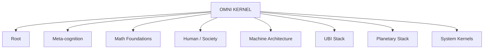
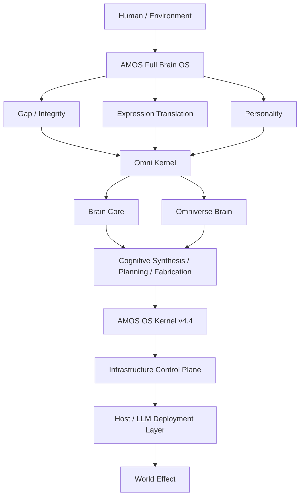
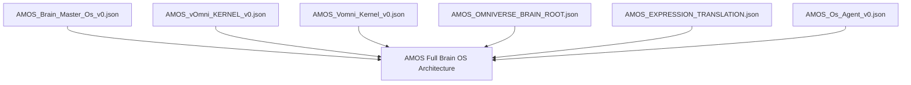

---
tags:
- knowledge
- full
- brain
- architecture
- 00-home
- amos-rscf-nodes
- knowledge-moc
---

# AMOS FULL BRAIN OS [[ARCHITECTURE]]

## Full Canonical Content + Extended Tags + RSCF + Obsidian Integration

> [!abstract] Canonical Boundary
> **Artifact:** `AMOS FULL BRAIN OS ARCHITECTURE`
> **Type:** `document`
> **Source plane:** `11_KNOWLEDGE/root`
> **RSCF state:** `SOURCE_CLAIM`
> **RSCF claim class:** `SOURCE_CLAIM`
> **Architecture conclusion:** `CONDITIONAL / AMOS_MODEL`
> **Origin architect / steward:** Trang Phan
> **Primary correction:** the universal linear chain `Kernel → Engine → Agent → Control Plane` is explicitly rejected by the supplied source.
> **Source boundary:** structures described below are preserved as AMOS corpus architecture. Runtime implementation, cross-artifact containment, exact version precedence, and some bindings remain unresolved unless separately validated.

---

# 0. Normalized Source Frontmatter — SOURCE

```yaml
---
title: AMOS FULL BRAIN OS ARCHITECTURE
type: document
source: 11_KNOWLEDGE/root

tags:
  - canon-group/tech-ai
  - canon/os-module
  - rscf/claim
  - rscf/provenance
  - rscf/state/source-claim
  - topic/00-amos-full-brain-os-architecture
rscf:
  state: SOURCE_CLAIM
  claim_class: SOURCE_CLAIM
  provenance: AMOS_corpus
  scope: AMOS_knowledge
---
```

> [!important] Source preservation
> The source frontmatter above is preserved. Additional tags, aliases, machine-readable architecture fields, equations, proof capsules, Dataview blocks, diagrams, and normalized relation models below are **DERIVED / PROPOSED** unless explicitly present in the supplied corpus.

---

# 1. Extended Obsidian Frontmatter — DERIVED / PROPOSED

```yaml
aliases:
  - AMOS Full Brain OS
  - Full Brain OS
  - AMOS Full Brain Architecture
  - AMOS Brain Runtime Control Architecture
  - FullBrainOS
  - AMOS Cognitive Operating Architecture

derived_tags:
  # AMOS
  - amos
  - amos-os
  - amos-brain
  - amos-full-brain
  - amos-full-brain-os
  - amos-architecture
  - amos-corpus

  # canon / knowledge
  - knowledge
  - vault
  - canon/knowledge
  - canon/architecture
  - canon/tech-ai
  - canon/os-module
  - canon-group/tech-ai

  # core systems
  - brain-core
  - omni-kernel
  - omniverse-brain
  - personality
  - expression-translation
  - gap-management
  - super-mind-os
  - omega-infinity-stack
  - os-kernel-v4-4
  - infrastructure-control-plane

  # runtime
  - runtime
  - reasoning-runtime
  - typed-state
  - rscf
  - hml
  - provenance
  - memory
  - competing-hypotheses
  - repair
  - replay
  - audit
  - finalization
  - semantic-transactions
  - commit
  - rollback

  # cognition
  - cognitive-architecture
  - cognitive-routing
  - cognitive-synthesis
  - planning
  - fabrication
  - meta-cognition
  - reasoning
  - world-model
  - multimodal-representation

  # governance
  - governance
  - authority
  - authorization
  - capability
  - control-plane
  - read-sets
  - effect-authorization
  - fail-closed
  - auditability

  # expression
  - expression-gateway
  - expression-translation
  - intent-extraction
  - meaning-core
  - structural-logic-map
  - emotion-to-signal
  - symbolism-to-structure

  # engines
  - engine-ecosystem
  - ubi
  - c01-c12
  - fabrication-engines
  - tech-engines
  - domain-engines

  # omniverse
  - world-model
  - system-model
  - observer-model
  - scenario-model
  - planetary-model
  - social-institutional
  - biological-consciousness
  - physical-quantum
  - information-complexity

  # deployment
  - host-llm
  - skills
  - workflows
  - agents
  - tools
  - code
  - deployment-layer

  # epistemics
  - source-claim
  - conditional
  - epistemic-firewall
  - scope-firewall
  - provenance-firewall
  - anti-fabrication
  - anti-regression
  - unresolved-boundaries

  # RSCF
  - rscf/node
  - rscf/claim
  - rscf/provenance
  - rscf/state/source-claim
  - rscf/state/conditional

  # topic
  - topic/amos-full-brain-os
  - topic/cognitive-os
  - topic/omni-kernel
  - topic/brain-core
  - topic/omniverse-brain
  - topic/runtime-control
  - topic/deployment-boundary

proposed_metadata:
  architecture_class: CONDITIONAL
  correction_state: ACTIVE
  supersedes_linear_hierarchy: true
  raw_source_policy: DO_NOT_LOAD_UNLESS_REQUIRED
  ingestion_action: NATIVE_CANON_REFERENCE
```

---

# 2. Artifact Identity

# AMOS Full Brain OS — Rebuilt Architecture

> [!info] RSCF-NODE
> **Node ID:** `amos_full_brain_os_architecture`
> **Node type:** `note`
> **Path:** `11_KNOWLEDGE/AMOS_Full_Brain_OS_Architecture.md`
> **Corpus class:** `SOURCE_CLAIM`
> **Architecture class:** `AMOS_MODEL / CONDITIONAL`
> **Primary architectural state:** multi-dimensional cognitive operating architecture
> **Superseded model:** universal linear `Kernel → Engine → Agent → Control Plane`

---

# 3. Canon Class

The source explicitly classifies the architecture as:

```text
CONDITIONAL
```

with the qualification:

> source-grounded for major structures; gaps around cross-artifact containment/version precedence.

Therefore the strongest safe conclusion is:

```text
MAJOR STRUCTURE
=
SOURCE-GROUNDED

CROSS-ARTIFACT CONTAINMENT
=
PARTIALLY UNRESOLVED

VERSION PRECEDENCE
=
PARTIALLY UNRESOLVED

UNIVERSAL LINEAR HIERARCHY
=
REJECTED
```

---

# 4. Primary Correction

The earlier architecture:

```text
Kernel
  ↓
Engine
  ↓
Agent
  ↓
Control Plane
```

is explicitly rejected as inaccurate.

The supplied source replaces it with a multidimensional architecture in which:

* kernels and engines occupy different structural fields;
* agents are instantiated only where goal ownership, authority, planning, or independence require them;
* the control plane is an infrastructure/effect-governance layer rather than the universal final step of every conceptual hierarchy;
* deployment artifacts are downstream representations, not ontology definitions.

Canonical correction:

```text
Kernel → Engine → Agent → Control Plane
!=
Universal AMOS hierarchy
```

---

# 5. The One Picture to Remember — SOURCE

```text
HUMAN / ENVIRONMENT

        │

        ▼

AMOS FULL BRAIN OS
(cognitive / semantic system)

        │

   ┌────┴────┐

   ▼         ▼         ▼

GAP/INTEGRITY  EXPRESSION GATEWAY  PERSONALITY

   │              (front door)        │

   └───────────────┬──────────────────┘

                   ▼

              OMNI KERNEL
     (routing / coordination / governance)

                   │

          ┌────────┴────────┐

          ▼                 ▼

     BRAIN CORE      OMNIVERSE BRAIN

   (engines/UBI)   (world/system model, 10 layers)

          └────────┬────────┘

                   ▼

        COGNITIVE SYNTHESIS
      / PLANNING / FABRICATION

                   ▼

        AMOS OS KERNEL v4.4
 typed state / RSCF / provenance / repair / audit

                   ▼

        INFRASTRUCTURE CONTROL PLANE
 authority / read sets / semantic tx / commit / rollback

                   ▼

        HOST / LLM DEPLOYMENT LAYER
 skills · workflows · agents · tools · code · memory

                   ▼

              WORLD EFFECT
```

---

# 6. Architecture as Fields, Not a Single Chain

The system is better represented as interacting architectural fields:

```text
INPUT / REPRESENTATION FIELD
    ├── expression translation
    ├── personality
    └── gap/integrity constraints

COGNITIVE COORDINATION FIELD
    └── omni kernel

CAPABILITY FIELD
    └── brain core

WORLD / SYSTEM REPRESENTATION FIELD
    └── omniverse brain

RUNTIME FIELD
    └── AMOS OS Kernel v4.4

EFFECT GOVERNANCE FIELD
    └── infrastructure control plane

DEPLOYMENT FIELD
    └── host / LLM layer
```

This normalization is **DERIVED** from the supplied architecture.

---

# 7. Three Large Systems

The source groups the architecture into three large systems.

## 7.1 AMOS BRAIN

```text
Expression Translation
Personality
Omni Kernel
Brain Core
Omniverse Brain
Super Mind
```

Primary role:

```text
cognition
emotion
consciousness
representation
routing
capability
```

---

## 7.2 AMOS RUNTIME

```text
OS Kernel
RSCF
H/M/L
provenance
memory
competing hypotheses
firewalls
repair
replay
audit
```

Primary role:

```text
typed reasoning state
epistemic continuity
execution control
repairability
auditability
```

---

## 7.3 AMOS CONTROL / BODY

```text
capability manifests
read sets
authorization
semantic transactions
tools
state stores
commit
rollback
```

Primary role:

```text
effect authorization
state mutation governance
transaction control
world-facing execution
```

---

# 8. Three-System Separation Invariant

```text
BRAIN
!=
RUNTIME

RUNTIME
!=
CONTROL/BODY

COGNITIVE GOVERNANCE
!=
EFFECT AUTHORIZATION

CAPABILITY
!=
AUTHORITY
```

These distinctions are load-bearing.

---

# 9. Full Brain OS Component Set

The source states:

```text
FullBrainOS =
{
  B_core,
  K_omni,
  B_omniverse,
  P_personality,
  T_expression,
  G_gap
}
```

Despite the phrase “five primary components,” the explicit mathematical set contains six named elements.

This is an internal source inconsistency that should remain visible.

---

# 10. Component-Count Gap

Source heading:

```text
Five primary Full Brain OS components
```

Source set:

```text
B_core
K_omni
B_omniverse
P_personality
T_expression
G_gap
```

Count:

$$
6
$$

Therefore:

```text
DECLARED COUNT
=
5

EXPLICIT SET COUNT
=
6
```

Status:

```text
SOURCE INCONSISTENCY / DECISION-RELEVANT GAP
```

Do not silently reduce the set to five.

---

# 11. Competing Interpretations — Component Count

### H1 — `gap_management` is a boundary condition, not counted as a primary component.

### H2 — the heading is stale and should say six.

### H3 — personality/expression were formerly grouped.

### H4 — one member is structurally auxiliary.

Current status:

```text
COMPETING
```

No supplied evidence resolves it.

---

# 12. Brain Core

Source definition:

```text
brain_core
=
capability / intelligence
```

It is explicitly:

```text
ENGINE ECOSYSTEM
```

not:

```text
ONE ENGINE
```

---

# 13. Brain Core Registry

The source says Brain Core contains:

```text
AMOS_UBI_FULL_SUPER_STACK
```

and describes 26 engines spanning:

### Biological / human

```text
BEI
NBI
NEI
SI
UBI_Super
```

### Fabrication / technology

```text
AUTOMATION_ENGINE_v2
SUPER_CODE
SUPER_FACTORY
SUPER_Design
Tech_Engine_vInfinity_MAX
```

### Domain engines

```text
C01_meta_logic
...
C12_earth_ecology
```

### Canon / high-depth variants

```text
C_CANON_SUPER_CLEAN_x100k
etc.
```

The source explicitly instructs:

```text
preserve variants as distinct
```

---

# 14. Engine Registry Count Boundary

The source calls this a:

```text
26-engine registry
```

but the supplied excerpt does not enumerate all 26 individually.

Therefore:

```text
26 ENGINE COUNT
=
SOURCE_CLAIM

COMPLETE ENUMERATION
=
NOT PRESENT IN THIS NOTE
```

---

# 15. Brain Core Firewall

```text
BRAIN CORE
!=
OMNI KERNEL

ENGINE
!=
KERNEL

DOMAIN ENGINE
!=
PERSONALITY

ENGINE VARIANT
!=
SAME OBJECT BY DEFAULT
```

---

# 16. Omni Kernel

The source emphasizes:

```text
Omni Kernel
=
kernel architecture / coordination field
```

not merely:

```text
"a kernel"
```

Its clusters include:

```text
Root
Meta-cognition
Math foundations
Human/society
Machine architecture
UBI stack
Planetary stack
System kernels
```

plus:

```text
governance
routing
safety
blueprints
integration_matrix
evaluation
```

---

# 17. Omni Kernel Runtime Principle

Source:

> Dynamic routing → activate MINIMUM relevant region, then integrate.

Therefore:

```text
RUN WHOLE BRAIN
!=
DEFAULT
```

Instead:

$$
ActiveRegion
=
MinimumSufficientRelevantRegion
$$

followed by integration.

This aligns with adaptive complexity and smallest sufficient proof scope.

---

# 18. Omni Kernel Topology

The source says its integration graph is:

```text
graph-shaped
=
hierarchy + network + routing
```

Therefore:

```text
OMNI KERNEL
!=
PURE TREE

OMNI KERNEL
!=
PURE LINEAR PIPELINE
```

---

# 19. Omni Kernel — Derived Representation



This is a visualization, not a claim that the actual internal graph is a simple star topology.

---

# 20. Omniverse Brain

The source defines:

```text
Omniverse Brain
=
world/system model
```

with ten layers.

Importantly:

```text
Agent layer
=
downstream inside Omniverse Brain
```

Thus:

```text
AGENT
!=
universal structural parent
```

---

# 21. Omniverse Brain — Ten Layers

## Layer 1 — Foundational Law

Includes:

```text
ULK_CORE
QCLS_CORE
METRIC_OF_INTEGRITY
```

---

## Layer 2 — Physical & Quantum

Represents physical and quantum substrate/state structures.

---

## Layer 3 — Information & Complexity

Represents information, complexity, structural organization.

---

## Layer 4 — Biological & Consciousness

Includes:

```text
UBI_CORE
HUMAN_STATE
EMOTION
C04
```

---

## Layer 5 — Social & Institutional

Includes:

```text
MULTI_AGENT
CRISIS
GOVERNANCE_AND_POLICY
```

---

## Layer 6 — Planetary & Ecological

Includes:

```text
PSI_CORE
TSS_TPE
RESOURCE / INFRA
```

---

## Layer 7 — Temporal & Scenario

Represents time, trajectory, scenarios, futures.

---

## Layer 8 — Multiverse & Modality

Represents alternative possibility spaces / modalities.

---

## Layer 9 — Observer & Perspective

Represents observer-dependent framing/perspective.

---

## Layer 10 — Agent & Fabrication

Represents goal-owning agents and fabrication/action structures.

---

# 22. Multi-Relation Identity

Source states:

> TSS/TPE/PSI appear as capability + placement + semantic function simultaneously → one object, many relations.

This is a crucial graph principle:

```text
ONE OBJECT
CAN PARTICIPATE IN
MULTIPLE RELATION TYPES
```

without duplicating ontology.

---

# 23. Relation Multiplicity Invariant

```text
CAPABILITY RELATION
!=
CONTAINMENT RELATION

PLACEMENT RELATION
!=
SEMANTIC FUNCTION RELATION

ONE OBJECT
!=
ONE EDGE
```

---

# 24. Personality

Source:

```text
personality
=
expression / interaction characteristics
```

and explicitly:

```text
not domain cognition
```

Therefore:

```text
PERSONALITY
!=
BRAIN CORE DOMAIN ENGINE
```

---

# 25. Expression Translation

The source calls Expression Translation:

```text
front door
```

and explicitly:

```text
NOT a domain engine
```

Pipeline:

```text
RAW EXPRESSION
    ↓
Expression_Classify
    ↓
Intent_Extraction
    ↓
Meaning_Core
    ↓
Structural_Logic_Map
    ↓
Emotion_to_Signal
    ↓
Symbolism_to_Structure
    ↓
Expression_Normalise
    ↓
LOGIC-READY AMOS INPUT
```

---

# 26. Structural Logic Map Fields

The source explicitly names:

```text
actors
systems
variables
constraints
time
direction
```

Thus the expression pipeline maps human-facing expression into a logic-ready internal structure.

---

# 27. Representation Boundary

Source:

```text
Human representation
!=
Internal reasoning representation
```

This is one of the architecture's strongest interface invariants.

---

# 28. Expression Firewall

```text
RAW LANGUAGE
!=
INTERNAL LOGIC STATE

EMOTION
!=
COMMAND

SYMBOLISM
!=
LITERAL FACT

USER EXPRESSION
!=
AUTHORIZED STATE MUTATION
```

The final rule is consistent with downstream governance separation.

---

# 29. Gap Management

Source:

```text
gap_management
=
constrains system by known limitations
```

Thus gaps are not merely annotations.

They are an architectural boundary condition.

---

# 30. Gap Management Invariant

```text
KNOWN GAP
!=
PERMISSION TO INVENT

UNKNOWN
!=
PASS

MISSING EDGE
!=
IMPLICIT RELATION
```

---

# 31. Super Mind OS

The source explicitly says:

```text
Super Mind OS
=
separate compatible plane
```

and:

```text
DO NOT silently nest under Full Brain OS
```

Its triad is:

```text
Cognition
Emotion
Consciousness
```

---

# 32. Super Mind Components

### Cognition

```text
COGNITION_INFINITY_KERNEL
```

### Emotion

```text
MEGA_HUMAN_ENGINE
```

### Consciousness

```text
SUPER_CONSCIOUSNESS_Engine_vInfinity
```

---

# 33. Cognition Layers

The source describes cognition layers:

```text
Meta Logic
Structural Reasoning
Cognitive Infrastructure
Multi-possibility
Biological Logic
Integration
```

---

# 34. Full Brain ↔ Super Mind Relation

Source classification:

```text
compatible / integrable
```

not:

```text
parent-child
```

Therefore:

```text
Full Brain OS
↔
Super Mind OS
=
COMPATIBLE / INTEGRABLE

CONTAINMENT
=
UNKNOWN
```

---

# 35. Omega Infinity Stack

The source defines a separate meta-orchestration plane with five layers:

```text
System Kernel
Domain Engine
Expression / Interface
Execution / Fabrication
Audit / Expansion
```

This confirms that:

```text
kernel
engine
expression
execution
audit
```

are distinct architectural dimensions.

---

# 36. Omega Firewall

```text
SYSTEM KERNEL
!=
DOMAIN ENGINE

DOMAIN ENGINE
!=
EXPRESSION

EXPRESSION
!=
EXECUTION

EXECUTION
!=
AUDIT
```

---

# 37. AMOS OS Kernel v4.4

The source explicitly defines v4.4 as:

```text
reasoning runtime
```

and warns:

```text
does NOT overwrite Full Brain OS
```

This distinction is critical.

---

# 38. Runtime Loop — SOURCE

```text
Perceive
  ↓
Route
  ↓
Admit
  ↓
Plan
  ↓
Schedule
  ↓
Execute
  ↓
Observe
  ↓
Repair
  ↓
Audit
  ↓
Finalize
```

---

# 39. Kernel v4.4 Ownership

The source says v4.4 owns:

```text
typed state
RSCF
proof graphs
memory
provenance
authority
transactions
replay
finalization
```

---

# 40. Runtime / Architecture Firewall

```text
Full Brain OS
!=
AMOS OS Kernel v4.4

ARCHITECTURAL COGNITIVE SYSTEM
!=
REASONING RUNTIME

RUNTIME IMPLEMENTATION
!=
ONTOLOGY REPLACEMENT
```

---

# 41. RSCF

Source:

```text
RSCF
=
epistemic substrate
```

and explicitly:

```text
not prose
```

---

# 42. RSCF Object Fields

The source lists:

```text
claim
class
premises
evidence
provenance
scope
regime
freshness
dependencies
competing hypotheses
falsifiers
confidence ceiling
```

---

# 43. RSCF State Kinds

Source states:

```text
OBSERVATION
SOURCE_CLAIM
DERIVED
MODEL
DECISION
UNKNOWN
```

These are epistemic object classes/states in the supplied architecture.

---

# 44. RSCF Invariant

```text
TEXT DOCUMENT
!=
RSCF OBJECT

CLAIM
!=
EVIDENCE

MODEL
!=
OBSERVATION

SOURCE_CLAIM
!=
VERIFIED

UNKNOWN
!=
PASS
```

---

# 45. Infrastructure Control Plane

The source places it:

```text
below cognition
above effects
```

and warns:

```text
do NOT replace Omni Kernel governance
```

---

# 46. Control Plane Responsibilities

Source lists:

```text
mutable state
authority
provenance
freshness
effect authorization
semantic transactions
commit
rollback
```

---

# 47. Omni Governance vs Control Plane

Source distinction:

### Omni Kernel Governance

```text
cognitive routing
kernel selection
priorities
integration
```

### Infrastructure Control Plane

```text
mutable state
authority
effect authorization
semantic transactions
commit
rollback
```

Thus:

```text
COGNITIVE GOVERNANCE
!=
EFFECT GOVERNANCE
```

---

# 48. Authority Gate — SOURCE

The source defines:

```text
FreshAuthority
AND
CausallyPrior
AND
EffectBound
AND
EligibleAtCommit
```

A normalized predicate:

$$
Authorize(effect)
=
FreshAuthority
\land
CausallyPrior
\land
EffectBound
\land
EligibleAtCommit
$$

---

# 49. Authority Principle

Source:

```text
KNOWING HOW
!=
BEING PERMITTED
```

Equivalent architectural firewall:

```text
CAPABILITY
!=
AUTHORITY
```

---

# 50. Authority Timing

The gate includes:

```text
EligibleAtCommit
```

which means authorization cannot safely be inferred only at proposal time.

Eligibility is commit-time relevant.

---

# 51. Skills Are Deployment Artifacts

The source explicitly states:

```text
Skills are deployment artifacts,
not the AMOS ontology
```

---

# 52. Deployment Mapping Boundaries

```text
AMOS Engine
!=
host Skill

AMOS Kernel
!=
host Tool

AMOS Agent
≈
host Agent only partially
```

This is one of the strongest anti-category-error rules in the architecture.

---

# 53. Deployment Relation

```text
AMOS OBJECT
    ↓ binding
HOST ARTIFACT
```

should be modeled as:

```text
DEPLOYMENT
```

not:

```text
DEFINITION
```

---

# 54. Eight Independent Axes

The source gives eight axes.

## Axis 1 — Cognitive Organization

Examples:

```text
Full Brain
Omni Kernel
Brain Core
Omniverse Brain
```

---

## Axis 2 — Capability Granularity

Examples:

```text
primitive
kernel
engine
composite capability
agent
```

---

## Axis 3 — Cognitive Mode

Source modes:

```text
EXPLORE
DIAGNOSE
DESIGN
AUDIT
MEASURE
```

---

## Axis 4 — Scale

```text
H
M
L
```

---

## Axis 5 — Epistemic State

Examples:

```text
OBSERVATION
SOURCE_CLAIM
DERIVED
MODEL
DECISION
UNKNOWN
```

---

## Axis 6 — Execution

Concerns execution/runtime location.

---

## Axis 7 — Governance

Concerns authority, eligibility, commit, control.

---

## Axis 8 — Deployment

Concerns skills, workflows, agents, tools, code, host bindings.

---

# 55. Axis Independence Principle

```text
COGNITIVE ORGANIZATION
!=
DEPLOYMENT

CAPABILITY GRANULARITY
!=
EPISTEMIC STATE

H/M/L SCALE
!=
EXECUTION PHASE

GOVERNANCE
!=
COGNITIVE MODE
```

An object may occupy positions on all axes simultaneously.

---

# 56. Kernel / Engine / Agent Placement

Source model:

```text
Full Brain OS
   ↓
{
  Omni Kernel   = kernel field
  Brain Core    = engine field
}
   ↓
capability space
   ↓
Agents
when goal-ownership / authority / planning / independence required
```

---

# 57. Primitive → Composite → Agent

The source permits a local progression:

```text
primitive kernel
→ composite engine
→ bounded agent
```

but explicitly says:

```text
NOT a universal linear hierarchy
```

Thus this progression is contextual, not global ontology.

---

# 58. Agent Activation Condition

Source names conditions:

```text
goal ownership
authority
planning
independence
```

Therefore agents are not necessary for every reasoning operation.

---

# 59. Agent Firewall

```text
CAPABILITY
!=
AGENT

ENGINE
!=
AGENT

AGENT
!=
UNBOUNDED AUTHORITY

AGENT PRESENCE
!=
REQUIRED FOR ALL TASKS
```

---

# 60. Canon Classification Table — SOURCE

| Component                                                     | Status                                 |
| ------------------------------------------------------------- | -------------------------------------- |
| Full Brain OS five-component structure                        | Source-defined (CANONICAL)             |
| Brain Core 26-engine registry                                 | Source-defined                         |
| Omni Kernel cluster architecture                              | Source-defined                         |
| Omniverse ten-layer architecture                              | Source-defined                         |
| Super Mind triad                                              | Source-defined (separate artifact)     |
| Omega five-layer meta-stack                                   | Source-defined (separate artifact)     |
| AMOS OS Kernel v4.4 runtime                                   | Later AMOS runtime architecture        |
| Infrastructure Control Plane                                  | Later AMOS infrastructure architecture |
| LLM deployment adapter                                        | Compatible operational extension       |
| `Kernel → Engine → Agent → Control Plane` universal hierarchy | **REJECTED as inaccurate**             |

---

# 61. Canonical Status Nuance

The table calls the Full Brain OS:

```text
five-component structure
```

while its explicit formula contains six elements.

This inconsistency means the exact component-count wording should not be silently promoted beyond the source.

Safe representation:

```text
Full Brain OS explicit component set
=
SOURCE-DEFINED

component count label
=
CONFLICTING SOURCE TEXT
```

---

# 62. Unresolved Boundaries — SOURCE

The note explicitly leaves unresolved:

```text
Full Brain OS ↔ Super Mind OS containment
Full Brain OS ↔ Omega inheritance
Personality ↔ Super Consciousness
Brain Core ↔ v4.4 OS Kernel binding
Omni Kernel governance ↔ Control Plane precedence
variant engine identities
canonical supersession across vInfinity and v4.4
```

---

# 63. Boundary Rule

```text
UNRESOLVED EDGE
!=
MISSING PERMISSION TO INVENT
```

Therefore those relations should remain:

```text
UNKNOWN / COMPETING / CONDITIONAL
```

until discriminating source evidence exists.

---

# 64. Full Brain ↔ Super Mind

Known:

```text
compatible / integrable
```

Unknown:

```text
containment
parent-child direction
runtime ownership
```

---

# 65. Full Brain ↔ Omega

Known:

```text
architecturally compatible conceptual layers exist
```

Unknown:

```text
inheritance direction
containment
supersession
```

---

# 66. Personality ↔ Super Consciousness

No canonical edge should be invented.

Possible relation classes remain unresolved.

---

# 67. Brain Core ↔ v4.4 Kernel

Known:

```text
Brain Core = capability/engine field
v4.4 = runtime
```

Unknown:

```text
exact binding contract
routing contract
state interface
ownership precedence
```

---

# 68. Omni Kernel ↔ Control Plane

Known separation:

```text
Omni = cognitive governance
Control Plane = effect/state governance
```

Unresolved:

```text
precedence during conflicting decisions
```

---

# 69. Variant Engine Identity

Source explicitly says variants must remain distinct.

Therefore:

```text
same base name
!=
same canonical identity
```

until lineage/supersession data establishes equivalence.

---

# 70. vInfinity ↔ v4.4

The source warns of unresolved:

```text
canonical supersession
```

Thus:

```text
LATER VERSION
!=
AUTOMATIC FULL REPLACEMENT
```

without explicit lineage rules.

---

# 71. Source Files — SOURCE

The note names:

```text
Core/AMOS_Brain_Master_Os_v0.json
Kernels/Tech/AMOS_vOmni_KERNEL_v0.json
Domains/AMOS_Vomni_Kernel_v0.json
_Archive/Kernel/AMOS_OMNIVERSE_BRAIN_ROOT.json
_Archive/Kernel/AMOS_EXPRESSION_TRANSLATION.json
Core/AMOS_Os_Agent_v0.json
```

These are asserted as:

```text
real, in vault
```

within the source.

This note itself does not independently verify their current existence or hashes.

---

# 72. Source File Boundary

```text
PATH LISTED
=
SOURCE_CLAIM

PATH CURRENTLY EXISTS
=
NOT INDEPENDENTLY CHECKED HERE

PATH CONTENT MATCHES SUMMARY
=
NOT INDEPENDENTLY CHECKED HERE
```

---

# 73. Supersession Statement — SOURCE

The note states:

> Stored 2026-08-22 per user correction. Supersedes any linear Kernel→Engine→Agent framing in prior notes/skills.

Therefore this artifact carries a source-defined correction/supersession edge over prior linear framings.

---

# 74. Supersession Scope

The source specifically supersedes:

```text
linear Kernel → Engine → Agent framing
```

It does not necessarily supersede every historical artifact containing the words kernel, engine, agent, or control plane.

Thus supersession scope is targeted.

---

# 75. Proposed Canonical Supersession Record

```yaml
supersession:
  supersedes_model:
    name: universal_kernel_engine_agent_control_plane_linear_chain
    status: REJECTED

  replacement_model:
    name: multidimensional_full_brain_os_architecture
    status: CONDITIONAL_SOURCE_GROUNDED

  effective_date:
    source_recorded: 2026-08-22

  scope:
    - prior_linear_kernel_engine_agent_framings
```

**DERIVED normalization.**

---

# 76. Architecture Topology — Derived Graph



This reproduces the source's memorable architecture, not every internal relation.

---

# 77. Structural Tensor — DERIVED

The architecture can be represented as:

$$
A =
T[
organization,
capability,
mode,
scale,
epistemic,
execution,
governance,
deployment
]
$$

reflecting the source's eight independent axes.

This is a derived tensor representation.

---

# 78. Component Tuple

A useful normalized tuple:

$$
FullBrainOS
=
\langle
B_{core},
K_{omni},
B_{omniverse},
P_{personality},
T_{expression},
G_{gap}
\rangle
$$

Source support: explicit set equation.

---

# 79. Runtime Tuple

Derived from source responsibilities:

$$
Runtime_{v4.4}
=
\langle
State,
RSCF,
ProofGraph,
Memory,
Provenance,
Authority,
Transactions,
Repair,
Replay,
Audit,
Finalization
\rangle
$$

---

# 80. Control Tuple

Derived:

$$
ControlPlane
=
\langle
Authority,
ReadSets,
Freshness,
EffectAuthorization,
SemanticTx,
Commit,
Rollback
\rangle
$$

---

# 81. Full System Separation

A compact source-grounded architecture:

$$
AMOS
=
Brain
\oplus
Runtime
\oplus
Control
\oplus
Deployment
$$

where `⊕` here is a **DERIVED notation** for distinct but integrated architectural planes, not a formal source operator.

---

# 82. Dynamic Routing Invariant

Source:

```text
activate MINIMUM relevant region
then integrate
```

Derived formulation:

$$
Route(q)
=
\operatorname*{arg\,min}_{R}
Complexity(R)
$$

subject to:

$$
R
\supseteq
DecisionChangingDependencies(q)
$$

This formula is **DERIVED**, not source mathematics.

---

# 83. Minimum Region ≠ Minimal Correctness

The routing objective is not “activate as little as possible regardless of risk.”

The source architecture implies:

```text
minimum RELEVANT region
```

not:

```text
minimum arbitrary region
```

Therefore:

```text
EFFICIENCY
must not weaken
INTEGRITY
```

---

# 84. Expression-to-Runtime Path

```text
Human expression
    ↓
Expression Translation
    ↓
Logic-ready input
    ↓
Omni Kernel routing
    ↓
Brain Core + Omniverse Brain
    ↓
Cognitive synthesis
    ↓
v4.4 runtime
    ↓
Control Plane
    ↓
Deployment binding
    ↓
Effect
```

---

# 85. Cognitive vs Deployment Boundary

The source draws a hard distinction:

```text
AMOS ontology
    ↓
deployment binding
Host/LLM artifacts
```

Thus a skill should be treated as a deployment representation of an AMOS object, not the object itself.

---

# 86. Deployment Examples

Source lists:

```text
skills
workflows
agents
tools
code
memory
```

These belong to the host/deployment layer.

---

# 87. Memory Placement Nuance

The source mentions memory in both:

```text
AMOS RUNTIME
```

and:

```text
HOST / LLM DEPLOYMENT LAYER
```

This need not be a contradiction because these can represent different memory abstractions:

```text
runtime memory semantics
vs
deployment memory substrate
```

But exact correspondence is not specified.

---

# 88. Memory Boundary — COMPETING

### H1

Runtime memory is logical/epistemic memory; host memory is implementation substrate.

### H2

The same memory object is represented at two layers.

### H3

Different source generations use different placement schemes.

Current status:

```text
COMPETING / EXPLANATORY GAP
```

---

# 89. Provenance Placement

Provenance appears in:

```text
AMOS Runtime
Infrastructure Control Plane
RSCF
```

This indicates multi-layer provenance responsibilities rather than necessarily duplication.

Possible roles:

```text
RSCF
→ epistemic lineage

Runtime
→ operational lineage

Control Plane
→ mutation/effect lineage
```

This separation is **DERIVED**, not explicitly mapped by the source.

---

# 90. Authority Placement Nuance

Authority appears both under:

```text
AMOS OS Kernel v4.4 ownership
```

and:

```text
Infrastructure Control Plane
```

while the source also distinguishes Omni Kernel governance.

Therefore authority is clearly multi-layered.

Exact precedence remains an unresolved boundary.

---

# 91. Three Governance Domains — DERIVED

```text
COGNITIVE GOVERNANCE
→ Omni Kernel

RUNTIME ADMISSION / AUTHORITY STATE
→ OS Kernel v4.4

EFFECT / MUTATION AUTHORIZATION
→ Infrastructure Control Plane
```

This is a derived clarification consistent with source descriptions.

---

# 92. Governance Conflict

If:

```text
Omni Kernel
selects action A
```

but:

```text
Control Plane
denies commit
```

the source strongly supports:

```text
NO EFFECT
```

because:

```text
KNOWING HOW ≠ BEING PERMITTED
```

The exact conflict-resolution protocol is still not supplied.

---

# 93. Proposal vs Commit

Derived from control-plane semantics:

```text
COGNITIVE PROPOSAL
!=
COMMITTED EFFECT
```

---

# 94. Semantic Transaction Boundary

The source names:

```text
semantic transactions
```

but does not define the exact transaction schema here.

Known functions include:

```text
authority
read sets
commit
rollback
```

Exact implementation is unresolved.

---

# 95. Read Sets

The control/body layer includes:

```text
read sets
```

This implies explicit dependency/state observation tracking in effectful operations.

Exact semantics are not supplied.

---

# 96. Commit Eligibility

The source gate requires:

```text
EligibleAtCommit
```

Therefore state/authority can change between planning and commit.

A derived implication:

```text
VALID AT PLAN TIME
!=
VALID AT COMMIT TIME
```

---

# 97. Fresh Authority

`FreshAuthority` implies authority has temporal validity.

Thus:

```text
AUTHORIZATION ONCE
!=
AUTHORIZATION FOREVER
```

---

# 98. Causally Prior Authority

`CausallyPrior` prevents an effect from retroactively authorizing itself.

Derived firewall:

```text
EFFECT
cannot create
its own prior authority
```

---

# 99. EffectBound

Authority must be scoped to the effect.

Thus:

```text
AUTHORITY FOR X
!=
AUTHORITY FOR Y
```

unless the authority envelope explicitly covers both.

---

# 100. Full Authority Invariant

$$
CommitAllowed
\iff
FreshAuthority
\land
CausallyPrior
\land
EffectBound
\land
EligibleAtCommit
$$

Source-defined expression normalized mathematically.

---

# 101. RSCF Proof Capsule — Architecture

```yaml
proof_capsule:
  claim:
    >
      AMOS Full Brain OS is a multidimensional cognitive operating
      architecture rather than a universal Kernel→Engine→Agent→Control
      Plane chain.

  class: SOURCE_CLAIM

  evidence:
    - explicit correction statement
    - three-system architecture
    - eight independent axes
    - kernel/engine/agent placement section

  scope:
    AMOS_knowledge

  competing:
    - historical linear framings

  resolution:
    historical_linear_framing: REJECTED_BY_SOURCE

  confidence_ceiling:
    architecture: CONDITIONAL
```

---

# 102. Proof Capsule — Full Brain Component Set

```yaml
proof_capsule:
  claim:
    >
      Full Brain OS is defined by the explicit set containing
      brain core, omni kernel, omniverse brain, personality,
      expression translation, and gap management.

  class: SOURCE_CLAIM

  evidence:
    - explicit FullBrainOS set equation

  contradiction:
    declared_component_count: 5
    explicit_set_count: 6

  state:
    COMPETING_SOURCE_TEXT
```

---

# 103. Proof Capsule — Omni Kernel

```yaml
proof_capsule:
  claim:
    >
      Omni Kernel is a graph-shaped coordination/routing/governance
      architecture that dynamically activates the minimum relevant region.

  class: SOURCE_CLAIM

  evidence:
    - Omni Kernel section

  exclusions:
    - "not merely one kernel"
    - "not run whole brain by default"
```

---

# 104. Proof Capsule — Brain Core

```yaml
proof_capsule:
  claim:
    >
      Brain Core is an engine ecosystem rather than one engine.

  class: SOURCE_CLAIM

  evidence:
    - Brain Core section

  declared_engine_count:
    26

  complete_registry_in_note:
    false
```

---

# 105. Proof Capsule — Omniverse Brain

```yaml
proof_capsule:
  claim:
    >
      Omniverse Brain is the source-defined world/system model with
      ten layers, with the Agent/Fabrication layer downstream inside it.

  class: SOURCE_CLAIM

  evidence:
    - Omniverse Brain section
```

---

# 106. Proof Capsule — Super Mind

```yaml
proof_capsule:
  claim:
    >
      Super Mind OS is separate but compatible/integrable with Full Brain OS.

  class: SOURCE_CLAIM

  evidence:
    - Super Mind section

  containment:
    UNKNOWN
```

---

# 107. Proof Capsule — v4.4 Runtime

```yaml
proof_capsule:
  claim:
    >
      AMOS OS Kernel v4.4 is a reasoning runtime and does not replace the
      Full Brain OS architecture.

  class: SOURCE_CLAIM

  evidence:
    - AMOS OS Kernel v4.4 section

  role:
    reasoning_runtime
```

---

# 108. Proof Capsule — Control Plane

```yaml
proof_capsule:
  claim:
    >
      Infrastructure Control Plane is below cognition and above effects,
      governing mutable state and authorization rather than replacing
      Omni Kernel cognitive governance.

  class: SOURCE_CLAIM

  evidence:
    - Infrastructure Control Plane section
```

---

# 109. Proof Capsule — Deployment

```yaml
proof_capsule:
  claim:
    >
      Skills, tools, workflows and host agents are deployment artifacts,
      not direct definitions of AMOS ontology objects.

  class: SOURCE_CLAIM

  evidence:
    - Skills are deployment artifacts section
```

---

# 110. Adversarial Validation

Strongest supported conclusion:

> The source defines a coherent multi-axis architecture in which cognition, runtime, effect governance, and deployment are separate but connected.

Challenges:

### Challenge 1 — Component count

Heading says five; formula contains six.

**Result:** preserve gap.

### Challenge 2 — Full Brain / Super Mind containment

Compatibility is known; containment is not.

**Result:** do not nest.

### Challenge 3 — Full Brain / Omega inheritance

Not resolved.

### Challenge 4 — vInfinity / v4.4 supersession

Not resolved globally.

### Challenge 5 — Engine registry

26-engine count is declared, but full list is absent.

### Challenge 6 — Source-file existence

Paths are asserted but not independently inspected here.

### Challenge 7 — Governance precedence

Omni Kernel vs Control Plane precedence remains unresolved.

Therefore architecture classification remains:

```text
CONDITIONAL
```

rather than globally `VERIFIED`.

---

# 111. Causal Firewall

The architecture describes functional relationships.

It does not empirically prove:

```text
specific neuroscience
human consciousness mechanics
physical causation
AI consciousness
biological equivalence
```

Therefore:

```text
ARCHITECTURAL RELATION
!=
EMPIRICAL CAUSAL LAW
```

---

# 112. Biological Firewall

Terms such as:

```text
UBI
NBI
NEI
SI
BEI
consciousness
emotion
human state
```

occur as AMOS architecture/model constructs.

Their presence does not establish clinical or biological truth.

---

# 113. “Omniverse” Firewall

`Omniverse Brain` is the corpus name of a world/system model.

It should not automatically be read as an empirical claim that AMOS models literally all possible universes.

---

# 114. “Full Brain” Firewall

`Full Brain OS` is an architectural identifier.

It does not imply:

```text
biological human brain equivalence
complete cognition
complete consciousness
perfect intelligence
```

---

# 115. “Consciousness” Firewall

The presence of:

```text
SUPER_CONSCIOUSNESS_Engine_vInfinity
```

is a source-defined module name.

It does not independently establish machine consciousness.

---

# 116. Anti-Fabrication Contract

Do not claim from this artifact alone that:

1. Full Brain OS has exactly five components without addressing the six-element set.
2. Full Brain OS has exactly six canonical components without resolving the five-component label.
3. all 26 Brain Core engines are fully enumerated here.
4. all 26 engines currently exist in runtime.
5. every listed source file currently exists.
6. every listed file has been inspected.
7. Omni Kernel literally runs as a single executable kernel.
8. the whole brain is always activated.
9. Super Mind is contained by Full Brain.
10. Full Brain is contained by Super Mind.
11. Omega inherits from Full Brain.
12. Full Brain inherits from Omega.
13. Personality is the same as Super Consciousness.
14. Brain Core is identical to v4.4 OS Kernel.
15. Omni governance overrides Control Plane.
16. Control Plane always overrides Omni governance in every semantic domain.
17. v4.4 supersedes all vInfinity artifacts.
18. vInfinity supersedes v4.4.
19. all similarly named engine variants are equivalent.
20. all agents sit above all engines.
21. every engine must become an agent.
22. every kernel must become an engine.
23. every action necessarily traverses one fixed linear pipeline.
24. a host skill is an AMOS engine.
25. a host tool is an AMOS kernel.
26. a host agent is exactly an AMOS agent.
27. deployment bindings define AMOS ontology.
28. graph placement proves containment.
29. semantic function proves ownership.
30. source-defined architecture equals runtime implementation.
31. `CANONICAL` means empirically true.
32. `SOURCE_CLAIM` means independently verified.
33. architecture names imply scientific validation.
34. UBI terms establish clinical truth.
35. Omniverse implies literal universal completeness.
36. Super Consciousness proves consciousness.
37. memory appearing in multiple layers proves duplication.
38. authority appearing in runtime and control proves contradiction.
39. gap management authorizes gap filling.
40. rejected linear hierarchy may continue to be used as canonical simplification.

---

# 117. Anti-Regression Contract

```yaml
anti_regression:
  preserve:
    - multidimensional_architecture
    - rejection_of_universal_linear_hierarchy
    - explicit_full_brain_component_set
    - component_count_inconsistency
    - Brain_Core_as_engine_ecosystem
    - Omni_Kernel_as_coordination_field
    - Omniverse_Brain_ten_layers
    - Expression_Translation_as_front_door
    - Personality_not_domain_cognition
    - Gap_Management_as_constraint
    - Super_Mind_separate_compatible_plane
    - Omega_as_meta_orchestration_plane
    - v4_4_as_reasoning_runtime
    - RSCF_as_epistemic_substrate
    - Control_Plane_below_cognition_above_effects
    - capability_not_authority
    - deployment_not_definition
    - eight_independent_axes
    - unresolved_cross_artifact_boundaries
    - listed_source_paths
    - correction_date_2026_08_22

  prohibit:
    - reintroducing_kernel_engine_agent_linear_hierarchy
    - silently_nesting_super_mind
    - silently_resolving_omega_inheritance
    - silently_merging_engine_variants
    - silently_promoting_source_claims_to_runtime_fact
    - silently_collapsing_cognitive_governance_into_effect_governance
    - silently_treating_host_artifacts_as_ontology
```

---

# 118. Critical Gaps

```yaml
gaps:

  CRITICAL:
    - exact_component_count_authority_if_schema_requires_fixed_arity
    - governance_precedence_if_effectful_commit_depends_on_omni_vs_control_conflict
    - version_precedence_if_supersession_affects_runtime_binding

  DECISION_RELEVANT:
    - Full_Brain_to_Super_Mind_containment
    - Full_Brain_to_Omega_inheritance
    - Personality_to_Super_Consciousness_relation
    - Brain_Core_to_v4_4_binding
    - engine_variant_identity
    - complete_26_engine_registry
    - source_file_current_existence
    - source_file_version_hashes

  EXPLANATORY:
    - exact internal Omni Kernel graph
    - exact Omniverse layer schemas
    - memory mapping across runtime/deployment
    - authority mapping across runtime/control
    - semantic transaction schema

  COSMETIC:
    - tag normalization
    - aliases
    - diagram styling
```

---

# 119. Cheapest High-Information Validation Path

To resolve the most consequential gaps:

```text
1. Inspect the explicit Full Brain master source.
2. Resolve component-count provenance.
3. Inspect Omni Kernel master source.
4. Inspect Omniverse Brain root source.
5. Inspect Expression Translation source.
6. Inspect v4.4 runtime lineage.
7. Inspect Control Plane precedence rules.
8. Resolve vInfinity ↔ v4.4 supersession.
```

Raw source should only be loaded where the unresolved edge can materially change architecture.

---

# 120. Sensitivity Analysis

The architecture changes materially if any of these claims fail:

```text
Omni Kernel is coordination rather than a single linear stage.
Brain Core is an engine ecosystem.
Omniverse Brain is a world/system model.
v4.4 is runtime rather than replacement architecture.
Control Plane governs effects rather than cognition.
deployment bindings are not ontology definitions.
```

These are load-bearing.

---

# 121. Most Important Corrective Invariant

$$
\boxed{
AMOS
\neq
Kernel \rightarrow Engine \rightarrow Agent \rightarrow ControlPlane
}
$$

The source instead supports:

$$
\boxed{
AMOS
=
MultiAxis(
Cognition,
Capability,
Representation,
Runtime,
Governance,
Deployment
)
}
$$

The second expression is **DERIVED** but accurately captures the supplied correction.

---

# 122. Source-to-Runtime Stack

```text
HUMAN / ENVIRONMENT
      ↓
EXPRESSION TRANSLATION
      ↓
OMNI KERNEL
      ↓
BRAIN CORE + OMNIVERSE BRAIN
      ↓
COGNITIVE SYNTHESIS
      ↓
AMOS OS KERNEL v4.4
      ↓
INFRASTRUCTURE CONTROL PLANE
      ↓
HOST / LLM DEPLOYMENT
      ↓
WORLD EFFECT
```

This is a routing picture, not a universal object hierarchy.

---

# 123. Hierarchy vs Flow

A key distinction:

```text
PROCESS FLOW
!=
ONTOLOGY HIERARCHY
```

The memorable diagram shows a processing/effect path.

It should not be interpreted as proving every upstream object ontologically contains every downstream object.

---

# 124. Graph Relation Types — PROPOSED

For Obsidian/RSCF modeling:

```text
CONTAINS
ROUTES_TO
DEPLOYS_AS
GOVERNS
COORDINATES
REPRESENTS
INTEGRATES_WITH
EXECUTES_IN
AUTHORIZED_BY
OBSERVED_BY
SUPERSEDES
COMPETING_WITH
UNKNOWN_RELATION
```

These relation types are proposed normalization aids.

---

# 125. Example Typed Relations — DERIVED

```yaml
relations:
  expression_translation:
    ROUTES_TO:
      - omni_kernel

  omni_kernel:
    COORDINATES:
      - brain_core
      - omniverse_brain

  brain_core:
    INTEGRATES_WITH:
      - omniverse_brain

  cognitive_synthesis:
    EXECUTES_IN:
      - amos_os_kernel_v4_4

  infrastructure_control_plane:
    GOVERNS_EFFECTS_OF:
      - runtime_proposals

  host_llm_deployment:
    DEPLOYS:
      - skills
      - workflows
      - agents
      - tools
      - code
      - memory
```

Not source-native relation syntax.

---

# 126. Obsidian Dataview — Full Brain Notes

```dataview
TABLE
  type,
  source,
  rscf.state AS RSCF_State,
  rscf.claim_class AS Claim_Class
FROM #topic/amos-full-brain-os
SORT file.name ASC
```

---

# 127. Dataview — OS Modules

```dataview
TABLE
  file.mtime AS Updated,
  type,
  source,
  tags
FROM #canon/os-module
SORT file.name ASC
```

---

# 128. Dataview — RSCF Source Claims

```dataview
TABLE
  file.mtime AS Updated,
  source,
  rscf.provenance AS Provenance,
  rscf.scope AS Scope
FROM #rscf/state/source-claim
SORT file.name ASC
```

---

# 129. Dataview — Tech-AI Canon

```dataview
TABLE
  type,
  source,
  file.mtime AS Updated
FROM #canon-group/tech-ai
SORT file.name ASC
```

---

# 130. Suggested Obsidian Callout — Architecture

```markdown
> [!important] Architecture Correction
> The universal `Kernel → Engine → Agent → Control Plane` chain is rejected.
> AMOS is a multi-dimensional architecture with independent cognitive,
> runtime, governance, and deployment axes.
```

---

# 131. Suggested Callout — Deployment

```markdown
> [!warning] Deployment Firewall
> AMOS Engine ≠ host Skill.
> AMOS Kernel ≠ host Tool.
> AMOS Agent only partially maps to a host Agent.
> Deployment bindings are implementations, not ontology definitions.
```

---

# 132. Suggested Callout — Authority

```markdown
> [!danger] Authority Gate
> KNOWING HOW ≠ BEING PERMITTED.
> Effect authorization requires:
> FreshAuthority ∧ CausallyPrior ∧ EffectBound ∧ EligibleAtCommit.
```

---

# 133. Suggested Callout — Gaps

```markdown
> [!caution] Unresolved Architecture Boundaries
> Do not invent containment, inheritance, precedence, identity, or
> supersession edges where the source explicitly leaves them unresolved.
```

---

# 134. Machine-Readable Architecture

```yaml
AMOS_FULL_BRAIN_OS_ARCHITECTURE:

  class:
    source: SOURCE_CLAIM
    architecture: CONDITIONAL
    model: AMOS_MODEL

  correction:
    rejected:
      - universal_kernel_engine_agent_control_plane_linear_hierarchy

  full_brain_os:
    explicit_components:
      - brain_core
      - omni_kernel
      - omniverse_brain
      - personality
      - expression_translation
      - gap_management

    declared_component_count:
      source_text: 5
      explicit_set_count: 6
      state: SOURCE_CONFLICT

  large_systems:
    AMOS_BRAIN:
      - expression_translation
      - personality
      - omni_kernel
      - brain_core
      - omniverse_brain
      - super_mind

    AMOS_RUNTIME:
      - os_kernel
      - rscf
      - HML
      - provenance
      - memory
      - competing_hypotheses
      - firewalls
      - repair
      - replay
      - audit

    AMOS_CONTROL_BODY:
      - capability_manifests
      - read_sets
      - authorization
      - semantic_transactions
      - tools
      - state_stores
      - commit
      - rollback

  runtime:
    version: v4.4
    loop:
      - perceive
      - route
      - admit
      - plan
      - schedule
      - execute
      - observe
      - repair
      - audit
      - finalize

  axes:
    - cognitive_organization
    - capability_granularity
    - cognitive_mode
    - HML_scale
    - epistemic_state
    - execution
    - governance
    - deployment
```

---

# 135. Machine-Readable Unresolved Edges

```yaml
UNRESOLVED_RELATIONS:

  FullBrainOS__SuperMindOS:
    known: COMPATIBLE_INTEGRABLE
    containment: UNKNOWN

  FullBrainOS__Omega:
    inheritance: UNKNOWN

  Personality__SuperConsciousness:
    relation: UNKNOWN

  BrainCore__Kernel_v4_4:
    binding: UNKNOWN

  OmniKernelGovernance__ControlPlane:
    precedence: UNKNOWN

  EngineVariants:
    equivalence: NOT_ASSUMED

  vInfinity__v4_4:
    canonical_supersession: UNKNOWN
```

---

# 136. RSCF Contract — DERIVED NORMALIZATION

```yaml
RSCF:

  node_id: amos_full_brain_os_architecture
  node_type: note

  claim_class: AMOS_MODEL
  source_state: SOURCE_CLAIM

  H:
    identity: "AMOS Full Brain OS Architecture"

    role:
      >
        Source-grounded multidimensional cognitive operating architecture
        integrating expression, routing, engine ecosystems, world/system
        representation, reasoning runtime, effect governance, and deployment.

  M:
    primary_components:
      - brain_core
      - omni_kernel
      - omniverse_brain
      - personality
      - expression_translation
      - gap_management

    major_systems:
      - AMOS_BRAIN
      - AMOS_RUNTIME
      - AMOS_CONTROL_BODY

    separate_compatible_planes:
      - Super_Mind_OS
      - Omega_Infinity_Stack

    runtime:
      - AMOS_OS_Kernel_v4_4

    deployment_boundary:
      - skills
      - workflows
      - agents
      - tools
      - code
      - memory

  L:
    load_on_demand:
      - exact_engine_registry
      - Omni_Kernel_internal_graph
      - Omniverse_layer_schemas
      - version_lineage
      - source_file_hashes
      - control_plane_precedence
      - runtime_binding_contracts

  confidence_ceiling:
    major_structure: SOURCE_BOUND
    cross_artifact_containment: CONDITIONAL
    version_precedence: UNKNOWN
    runtime_implementation: NOT_ESTABLISHED_BY_THIS_NOTE
```

---

# 137. RSCF Relations — SOURCE

```text
INDEXED_BY:
INDEXED_BY:
```

Source terminal block:

```text
claim_class: AMOS_MODEL
```

This differs from frontmatter:

```text
rscf.claim_class: SOURCE_CLAIM
```

These can be preserved as layered semantics:

```text
DOCUMENT SOURCE STATE
=
SOURCE_CLAIM

ARCHITECTURE CONTENT CLASS
=
AMOS_MODEL
```

This is a derived reconciliation, not a silent overwrite.

---

# 138. Epistemic Dual-Layer Normalization

```yaml
epistemic_layers:

  document_source:
    state: SOURCE_CLAIM
    claim_class: SOURCE_CLAIM
    provenance: AMOS_corpus

  architecture_model:
    claim_class: AMOS_MODEL
    canon_class: CONDITIONAL
```

---

# 139. Source Provenance Graph



This represents declared source lineage, not independent verification.

---

# 140. Canon Navigation

Source:

```text
00_ROOT_MOC|AMOS MOC
```

Related:

```markdown


```

MOC:

```markdown

```

---

# 141. Proposed Related Links

For Obsidian integration, likely high-value links include:

```markdown


```

These are **PROPOSED** unless the exact vault note identities are confirmed.

---

# 142. Canonical Compression

The architecture can be compressed as:

$$
\boxed{
Input
\rightarrow
CognitiveInterpretation
\rightarrow
Coordination
\rightarrow
Capability + WorldModel
\rightarrow
Synthesis
\rightarrow
Runtime
\rightarrow
EffectGovernance
\rightarrow
Deployment
\rightarrow
World
}
$$

while preserving:

$$
\boxed{
Flow
\neq
UniversalHierarchy
}
$$

---

# 143. Full Brain Structural Equation

Using source symbols:

$$
\boxed{
FullBrainOS =
\{
B_{core},
K_{omni},
B_{omniverse},
P_{personality},
T_{expression},
G_{gap}
\}
}
$$

with the explicit caveat:

```text
source heading says "five"
explicit set contains six
```

---

# 144. Runtime Equation

Derived from source runtime semantics:

$$
S_{t+1}
=
Finalize(
Audit(
Repair(
Observe(
Execute(
Schedule(
Plan(
Admit(
Route(
Perceive(S_t)
)))))))))
$$

This is a **DERIVED composition**, not a supplied runtime equation.

---

# 145. Commit Equation

Source-grounded authorization predicate:

$$
\boxed{
Commit
\iff
FreshAuthority
\land
CausallyPrior
\land
EffectBound
\land
EligibleAtCommit
}
$$

---

# 146. Deployment Equation

Derived:

$$
AMOSObject
\xrightarrow{DeploymentBinding}
HostArtifact
$$

where:

$$
HostArtifact
\not\equiv
AMOSObject
$$

---

# 147. Final Architecture Invariants

```text
FULL BRAIN OS
!=
RUNTIME

OMNI KERNEL
!=
CONTROL PLANE

BRAIN CORE
!=
SINGLE ENGINE

OMNIVERSE BRAIN
!=
AGENT LAYER

PERSONALITY
!=
DOMAIN COGNITION

EXPRESSION TRANSLATION
!=
DOMAIN ENGINE

SUPER MIND
!=
SILENT CHILD OF FULL BRAIN

SKILL
!=
ENGINE

TOOL
!=
KERNEL

HOST AGENT
!=
AMOS AGENT EXACTLY

CAPABILITY
!=
AUTHORITY

PROPOSAL
!=
COMMIT

FLOW
!=
ONTOLOGY HIERARCHY

SOURCE-DEFINED
!=
EMPIRICALLY VERIFIED

UNKNOWN EDGE
!=
PERMISSION TO INVENT
```

---

# 148. Final Canonical Conclusion

**AMOS Full Brain OS Architecture** is a source-grounded, **CONDITIONAL** AMOS architecture describing a multi-dimensional cognitive operating system rather than a universal linear `Kernel → Engine → Agent → Control Plane` hierarchy.

Its explicit structural center is:

```text
FullBrainOS =
{
  brain_core,
  omni_kernel,
  omniverse_brain,
  personality,
  expression_translation,
  gap_management
}
```

with the important source inconsistency that the surrounding heading calls this the **five-component structure** while the explicit set contains **six elements**. That mismatch must remain visible until an authoritative source resolves it.

The system separates three major architectural domains:

```text
AMOS BRAIN
AMOS RUNTIME
AMOS CONTROL / BODY
```

and preserves distinct roles for:

```text
Expression Translation
→ human-to-logic front door

Omni Kernel
→ cognitive routing / coordination / governance

Brain Core
→ engine/capability ecosystem

Omniverse Brain
→ world/system model

AMOS OS Kernel v4.4
→ typed reasoning runtime

Infrastructure Control Plane
→ authority / state mutation / commit / rollback

Host / LLM layer
→ deployment artifacts
```

The critical governance separation is:

$$
\boxed{
Cognitive\ capability
\neq
Effect\ authority
}
$$

and the source expresses this directly as:

```text
KNOWING HOW
!=
BEING PERMITTED
```

Effect authorization is therefore commit-time governed by:

$$
\boxed{
FreshAuthority
\land
CausallyPrior
\land
EffectBound
\land
EligibleAtCommit
}
$$

The architecture also explicitly separates AMOS ontology from deployment:

```text
AMOS Engine ≠ host Skill
AMOS Kernel ≠ host Tool
AMOS Agent ≈ host Agent only partially
```

so host artifacts should be treated as **DEPLOYMENT bindings**, not definitions of the underlying AMOS architecture.

The strongest unresolved boundaries remain:

```text
Full Brain OS ↔ Super Mind OS containment
Full Brain OS ↔ Omega inheritance
Personality ↔ Super Consciousness
Brain Core ↔ v4.4 runtime binding
Omni governance ↔ Control Plane precedence
engine-variant identity
vInfinity ↔ v4.4 supersession
```

Those edges must remain `UNKNOWN / COMPETING / CONDITIONAL` rather than being filled by architectural intuition.

The canonical correction can therefore be summarized as:

$$
\boxed{
AMOS
=
MultiDimensionalCognitiveArchitecture
}
$$

not:

$$
\boxed{
AMOS
=
Kernel
\rightarrow
Engine
\rightarrow
Agent
\rightarrow
ControlPlane
}
$$

and the core integrity law for this artifact is:

$$
\boxed{
Preserve\ distinct\ architectural\ dimensions;
never\ collapse\ flow,\ containment,\ capability,\ governance,\ and\ deployment
into\ one\ hierarchy.
}
$$

---

# 149. Source Tags

```text
#canon-group/tech-ai
#canon/os-module
#rscf/claim
#rscf/provenance
#rscf/state/source-claim
#topic/00-amos-full-brain-os-architecture
```

# 150. Extended Tags — PROPOSED

```text
#amos
#amos-os
#amos-brain
#amos-full-brain
#amos-full-brain-os
#amos-architecture
#amos-corpus
#knowledge
#vault
#canon/knowledge
#canon/architecture
#canon/tech-ai
#brain-core
#omni-kernel
#omniverse-brain
#personality
#expression-translation
#gap-management
#super-mind-os
#omega-infinity-stack
#os-kernel-v4-4
#infrastructure-control-plane
#runtime
#reasoning-runtime
#typed-state
#rscf
#hml
#provenance
#memory
#competing-hypotheses
#repair
#replay
#audit
#finalization
#semantic-transactions
#commit
#rollback
#cognitive-architecture
#cognitive-routing
#cognitive-synthesis
#planning
#fabrication
#meta-cognition
#world-model
#system-model
#observer-model
#scenario-model
#governance
#authority
#authorization
#capability
#control-plane
#read-sets
#effect-authorization
#fail-closed
#expression-gateway
#intent-extraction
#meaning-core
#structural-logic-map
#engine-ecosystem
#ubi
#c01-c12
#domain-engines
#host-llm
#skills
#workflows
#agents
#tools
#deployment-layer
#source-claim
#conditional
#epistemic-firewall
#scope-firewall
#provenance-firewall
#anti-fabrication
#anti-regression
#unresolved-boundaries
#rscf/node
#rscf/state/conditional
#topic/amos-full-brain-os
#topic/cognitive-os
#topic/runtime-control
#topic/deployment-boundary
```

---

# 151. RSCF-NODE

```text
RSCF-NODE

node_id: amos_full_brain_os_architecture

node_type: note

path: 11_KNOWLEDGE/AMOS_Full_Brain_OS_Architecture.md

claim_class: AMOS_MODEL

source_state: SOURCE_CLAIM

canonical_class: CONDITIONAL

RSCF-RELATIONS:

  - INDEXED_BY:

  - INDEXED_BY:

  - INDEXED_BY:

  - SUPERSEDES_MODEL: Kernel→Engine→Agent→Control Plane universal hierarchy

  - COMPATIBLE_WITH: Super Mind OS

  - RUNTIME_BOUNDARY: AMOS OS Kernel v4.4

  - EFFECT_BOUNDARY: Infrastructure Control Plane

  - DEPLOYMENT_BOUNDARY: Host / LLM Deployment Layer
```

The last five relations are normalized/derived except where directly stated by the source.

---

**Related:** [[00_HOME]] · [[AMOS_RSCF_NODES]] · [[KNOWLEDGE_MOC]]

---

**MOC:** [[KNOWLEDGE_MOC]]

**Artifact state:** `SOURCE_CLAIM`
**Architecture class:** `CONDITIONAL / AMOS_MODEL`
**Primary correction:** `LINEAR KERNEL→ENGINE→AGENT→CONTROL PLANE MODEL REJECTED`
**Highest-value unresolved issue:** `cross-artifact containment and version precedence`
**Component-count inconsistency:** `5 declared vs 6 explicit`
**Runtime:** `AMOS OS Kernel v4.4`
**Effect governance:** `Infrastructure Control Plane`
**Deployment:** `skills · workflows · agents · tools · code · memory`

**END — `AMOS_Full_Brain_OS_Architecture.md`**
