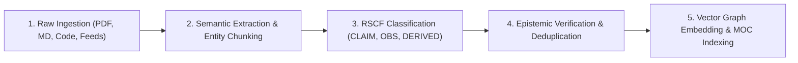

# AMOS Knowledge Harvest Runtime v2.5 — Repair-Substrate Capture Resistance Runtime

**Origin Architect / Steward:** Trang Phan
**AMOS_CORE Target:** `v4.4`
**Epistemic Class:** `AMOS_MODEL`

---

## 1. Executive Summary & Epistemic Objectives

The Knowledge Harvest Runtime v2.5 provides an automated, adversarial-resistant ingestion pipeline that converts unstructured multi-source documentation, research papers, repository code, and telemetry feeds into governed **Reasoning & State Control Framework (RSCF)** knowledge artifacts.

### Core Mathematical Invariant (Capture Resistance & Epistemic Entropy)
Let $\mathcal{D}$ represent incoming raw documents and $\mathcal{K}$ the grounded knowledge base. The epistemic entropy delta $\Delta H$ and truth-grounding score $\Phi_G$ satisfy:
$$\Phi_G(\mathcal{K}) = \sum_{k \in \mathcal{K}} w_k \cdot \mathbb{I}(	ext{Provenance}(k) \in \mathcal{A}_{auth}) - \lambda \cdot H_{epistemic}(\mathcal{K})$$
where $\mathcal{A}_{auth}$ is the set of authoritative sources (canonical v4.4 lineage) and $\lambda > 0$ penalizes hallucination or ungrounded synthesis.

---

## 2. 5-Stage Ingestion Pipeline Architecture (MECE)



1. **Multi-Source Ingestion (`INGEST-01`)**:
   - Stream processing with BLAKE3 cryptographic content hashing to ensure idempotent ingestion.
   - Text extraction with OCR fallback for academic PDFs, patents, and system logs.
2. **Semantic Extraction & Invariant Labeling (`EXTRACT-02`)**:
   - Recursive abstract syntax tree chunking ($L pprox 512	ext{--}1024$ tokens with $15\%$ overlap).
   - Extraction of formal theorems, mathematical formulas, and interface signatures.
3. **RSCF Epistemic Tagging (`RSCF-03`)**:
   - Mandatory assignment of epistemic state: `SOURCE_CLAIM`, `OBSERVATION`, `DERIVED`, `MODEL`, `DECISION`.
   - Strict adherence to the epistemic axiom: `DOCUMENTED != IMPLEMENTED`.
4. **Epistemic Invariant Verification (`VERIF-04`)**:
   - Conflict detection against canonical ground truth (`01_CANON`).
   - Flagging of unverified post-v4.4 claims without explicit provenance as `UNKNOWN/GAP`.
5. **Vector Indexing & Graph Synthesis (`INDEX-05`)**:
   - Dense 1536-dimensional embedding generation.
   - Integration into HNSW / DiskANN graph indices with hierarchical MOC cross-linking.

---

## 3. Storage Schema & Serialization

```json
{
  "$schema": "https://amos-os.org/schemas/v4.4/harvest_record.json",
  "harvest_id": "HRV-2026-0904-001",
  "source_uri": "gdrive://master_encyclopedia_recreated_2026-08-15.gdoc",
  "blake3_digest": "8f3b...e4a1",
  "rscf_classification": "DERIVED",
  "authority_tier": "TIER_1_CANONICAL",
  "epistemic_entropy_delta": -0.38,
  "anchors": [
    "00_ROOT/FULL_BRAIN_OS_MECE_ARCHITECTURE",
    "01_CANON/01_CANON_MOC"
  ]
}
```
