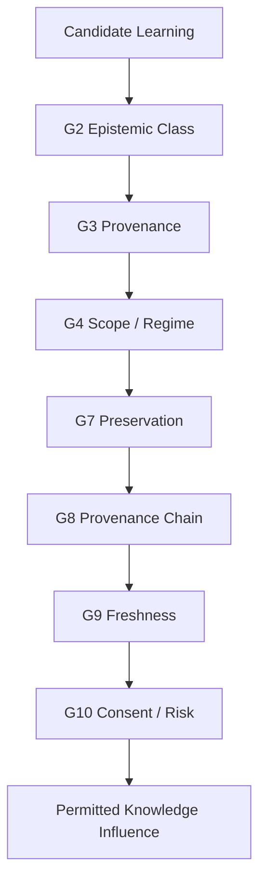
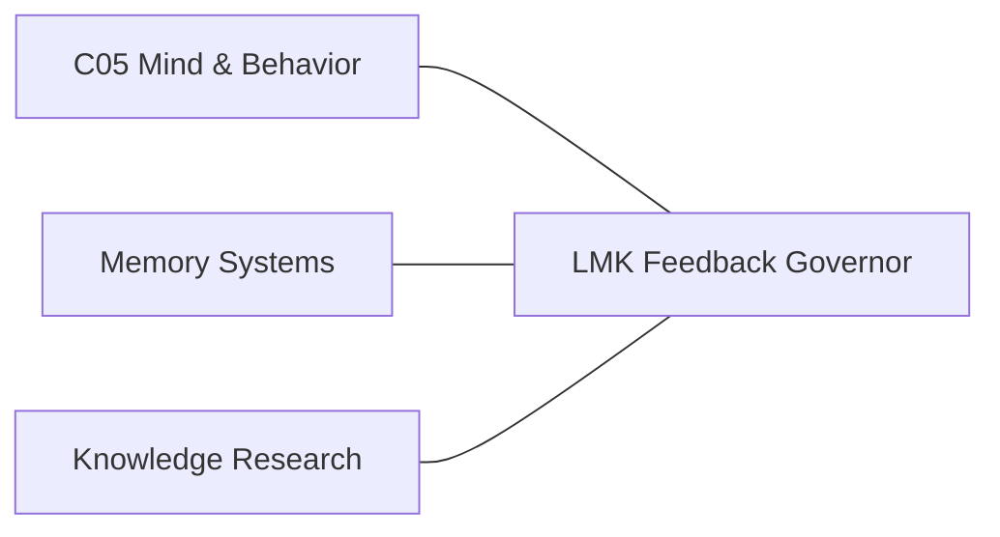
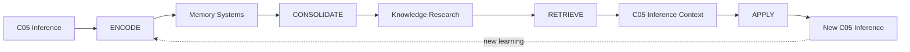
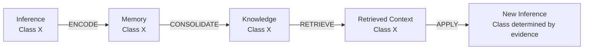
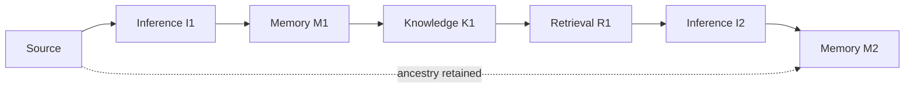
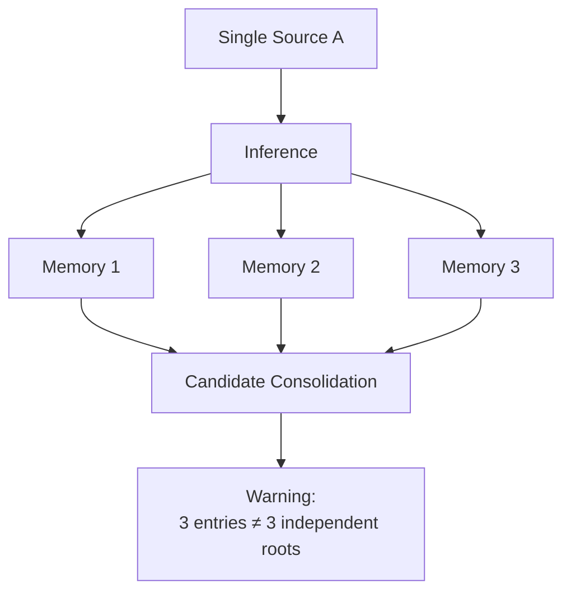
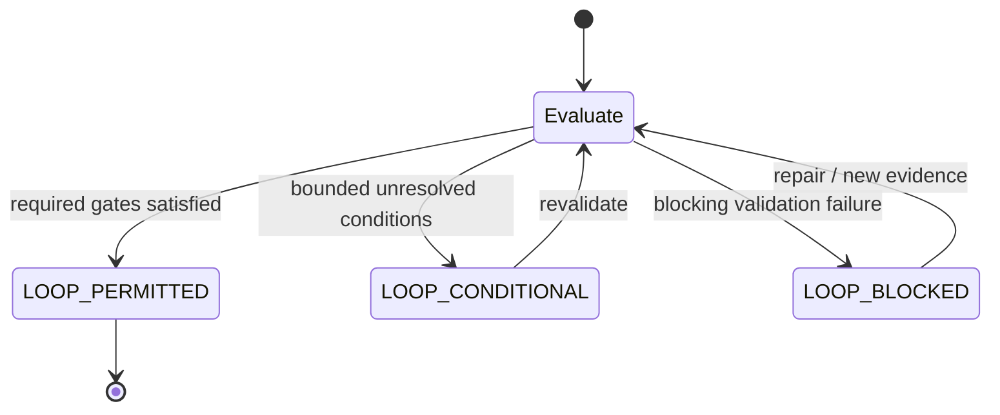
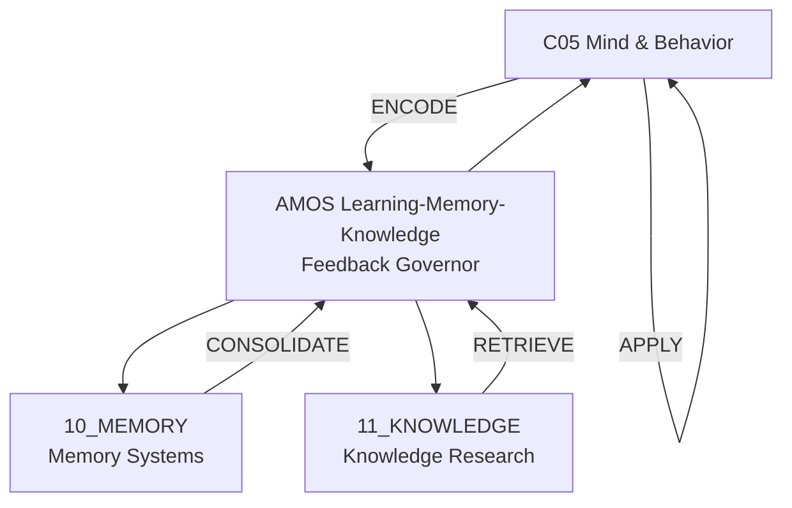

---
tags:
- knowledge
- learning
- memory
- feedback
- governor
- amos-cross-domain-tensor-composition-governor
- amos-emotion-cognition-decision-bridge-governor
---

# AMOS LEARNING MEMORY KNOWLEDGE FEEDBACK GOVERNOR

## Full Canonical Content + Tags + RSCF + Obsidian Integration

> [!abstract] Canonical Boundary
> **Artifact:** `AMOS LEARNING MEMORY KNOWLEDGE FEEDBACK GOVERNOR`
> **Type:** `memory`
> **RSCF node type:** `skill`
> **Source plane:** `11_KNOWLEDGE`
> **Domain:** `cross-domain`
> **Epistemic class:** `SOURCE_CLAIM`
> **Claim ceiling:** `0.90`
> **Origin architect:** Trang Phan
> **Status declared by source:** `production_ready`
> **Important boundary:** “PRODUCTION_READY,” “all 10 QA gates pass,” the 10 capabilities, and the artifact bindings are source/corpus claims in this note. They are not independently verified runtime facts by this artifact alone.

---

# 0. Normalized Source Frontmatter — SOURCE

```yaml
---
title: AMOS LEARNING MEMORY KNOWLEDGE FEEDBACK GOVERNOR
type: memory
source: 11_KNOWLEDGE
claim_ceiling: 0.9
created: 2026-08-27
domain: cross-domain
epistemic_class: SOURCE_CLAIM
origin_architect: Trang Phan
parent_skill: amos-knowledge-research-master
rscf_node_type: skill
status: production_ready

tags:
  - rscf/node
  - knowledge
  - vault
  - canon-group/cross-domain
  - topic/learning-memory-knowledge
  - topic/feedback-loop
  - topic/epistemic-preservation
  - canon/knowledge
rscf:
  state: SOURCE_CLAIM
  claim_class: SOURCE_CLAIM
  provenance: AMOS_corpus
  scope: AMOS_knowledge
---
```

> [!important] Metadata preservation
> The block above preserves the supplied source fields. Additional aliases, tags, lifecycle fields, proof-capsule fields, relation normalization, Dataview properties, or implementation metadata below are explicitly **DERIVED / PROPOSED** and are not silently inserted into the source frontmatter.

---

# 1. Derived / Proposed Obsidian Augmentation

```yaml
# DERIVED / PROPOSED — NOT ORIGINAL SOURCE FRONTMATTER

aliases:
  - AMOS Learning Memory Knowledge Feedback Governor
  - AMOS LMK Feedback Governor
  - LMK Feedback Governor
  - Learning-Memory-Knowledge Governor
  - C05 Memory Knowledge Feedback Governor
  - AMOS Epistemic Preservation Feedback Governor

proposed_tags:
  # AMOS
  - amos
  - amos-os
  - amos-corpus
  - amos-knowledge
  - amos-memory
  - amos-governor
  - amos-skill

  # planes/domains
  - 10-memory
  - 11-knowledge
  - c05-mind-behavior
  - cross-domain
  - cross-plane
  - memory-systems
  - knowledge-research

  # LMK
  - learning
  - memory
  - knowledge
  - learning-memory-knowledge
  - learning-loop
  - memory-loop
  - knowledge-loop
  - feedback-governor
  - feedback-architecture
  - closed-loop-knowledge

  # transitions
  - encode
  - consolidate
  - retrieve
  - apply
  - memory-encoding
  - memory-consolidation
  - knowledge-retrieval
  - knowledge-application

  # epistemics
  - epistemic-preservation
  - epistemic-class
  - claim-ceiling
  - confidence-ceiling
  - provenance
  - provenance-chain
  - freshness
  - scope
  - regime
  - corroboration
  - anti-overreach
  - anti-promotion
  - evidence-chain

  # governance
  - loop-governance
  - knowledge-governance
  - memory-governance
  - lifecycle-governance
  - consent-governance
  - risk-governance
  - drift-detection
  - validation-gates
  - fail-closed
  - anti-fabrication
  - anti-regression

  # RSCF
  - rscf
  - rscf/node
  - rscf/claim
  - rscf/provenance
  - rscf/state/source-claim
  - rscf/feedback-loop
  - rscf/epistemic-preservation

  # canon
  - canon/knowledge
  - canon/memory
  - canon/cross-domain
  - canon/tooling
  - canon/governance

  # topics
  - topic/learning-memory-knowledge
  - topic/feedback-loop
  - topic/epistemic-preservation
  - topic/provenance
  - topic/knowledge-freshness
  - topic/memory-consolidation
  - topic/knowledge-drift

proposed_runtime_class: GOVERNOR
proposed_short_name: LMK_GOVERNOR

proposed_rscf:
  node_id: amos_learning_memory_knowledge_feedback_governor
  node_type: skill
  state: SOURCE_CLAIM
  claim_class: SOURCE_CLAIM
  provenance: AMOS_corpus
  scope: AMOS_knowledge
  claim_ceiling: 0.90

raw_source_policy: DO_NOT_LOAD_UNLESS_REQUIRED
ingestion_action: INDEX_AS_SOURCE_CLAIM
```

---

# 2. Artifact Identity

# AMOS Learning-Memory-Knowledge Feedback Governor

> **RSCF-NODE** · `skill` · cross-domain (`C05 → Memory → Knowledge → C05`)

The artifact defines a cross-domain governance model intended to connect three previously separated functional domains:

1. **C05 Mind and Behavior / inference**
2. **Memory Systems**
3. **Knowledge Research**

The source presents the governor as the bridge completing a feedback cycle between inference-generated learning, memory encoding/consolidation, indexed knowledge, retrieval, and subsequent inference.

The minimal structural model is:

```text
C05 INFERENCE
     │
     │ ENCODE
     ▼
MEMORY SYSTEMS
     │
     │ CONSOLIDATE
     ▼
KNOWLEDGE RESEARCH
     │
     │ RETRIEVE
     ▼
C05 INFERENCE
     │
     │ APPLY
     └──────────────────→ NEW INFERENCE
```

The existence and intended semantics of the four named transitions are source-defined. The diagram is a normalized representation.

---

# 3. Identity — SOURCE

* **Origin architect and steward:** Trang Phan
* **Parent skill:** `amos-knowledge-research-master`
* **Domain:** cross-domain (`C05 Mind and Behavior → Memory Systems → Knowledge Research`)
* **Epistemic class:** `SOURCE_CLAIM`
* **Claim ceiling:** `0.90`
* **Status:** `PRODUCTION_READY`
* **Source status qualification:** “all 10 QA gates pass”

The final two items are source declarations, not an independent execution audit.

---

# 4. Core Problem

The source identifies a fragmentation problem:

> Learning platforms, memory architecture, and knowledge indexes are separate domains without unified learning-memory-knowledge feedback loops.

It then decomposes the gap into four missing bridges:

1. C05 inference generates learning but lacks a bridge into memory encoding.
2. Memory Systems supports encoding/consolidation/retrieval but lacks a bridge into knowledge indexing.
3. Knowledge Research supports ingestion/indexing/curation but lacks a bridge back into C05 inference.
4. No unified feedback loop connects all three.

The artifact therefore addresses **integration**, not merely storage.

---

# 5. Problem Topology

Before the governor:

```text
┌──────────────────────┐
│ C05 INFERENCE        │
│ produces learning    │
└──────────────────────┘

        GAP

┌──────────────────────┐
│ MEMORY SYSTEMS       │
│ encode/consolidate/  │
│ retrieve             │
└──────────────────────┘

        GAP

┌──────────────────────┐
│ KNOWLEDGE RESEARCH   │
│ ingest/index/curate  │
└──────────────────────┘

        GAP BACK TO C05
```

After the proposed source architecture:

```text
C05
 ↓ ENCODE
MEMORY
 ↓ CONSOLIDATE
KNOWLEDGE
 ↓ RETRIEVE
C05
 ↓ APPLY
NEW INFERENCE
```

---

# 6. Governing Objective

The artifact's central objective can be normalized as:

$$
Learning
\rightarrow
Memory
\rightarrow
Knowledge
\rightarrow
Inference
\rightarrow
Learning'
$$

subject to epistemic preservation.

The feedback loop is therefore not intended to be unconstrained recursive reinforcement.

Its source-defined validation gates require:

* contradiction control;
* epistemic-class preservation;
* provenance preservation;
* scope/regime discipline;
* failure handling;
* freshness;
* consent/risk control.

---

# 7. Canonical Feedback Loop — SOURCE

```text
C05 Inference
    ↓
encode learning
    ↓
Memory Systems
    ↓
consolidate
    ↓
Knowledge Research
    ↓
index
    ↓
retrieve for inference
    ↓
C05 Inference
```

The loop has four explicitly named transition types:

```text
ENCODE
CONSOLIDATE
RETRIEVE
APPLY
```

---

# 8. Transition T1 — ENCODE

Source definition:

> C05 inference results to typed memory entries.

Structural form:

$$
C05Inference
\xrightarrow{ENCODE}
MemoryEntry
$$

Source epistemic rule:

```text
Inference class preserved
```

Source confidence rule:

$$
C_{memory} \leq C_{inference}
$$

This is a confidence ceiling, not a claim that confidence must decrease.

---

# 9. ENCODE Preservation Invariant

A safe formalization of the supplied rule is:

$$
Confidence(Encode(x))
\leq
Confidence(x)
$$

and:

```text
EpistemicClass(Encode(x))
=
EpistemicClass(x)
```

unless a separately evidenced transformation explicitly authorizes a class change.

The first relationship is directly supported by the transition table. The exact function notation is **DERIVED**.

---

# 10. Encoding Does Not Validate

A critical epistemic firewall follows:

```text
INFERENCE
→ MEMORY
```

does not imply:

```text
INFERENCE
→ VERIFIED FACT
```

Persistence is not validation.

Therefore:

$$
Stored(x) \not\Rightarrow Verified(x)
$$

---

# 11. Memory Persistence Firewall

Similarly:

```text
remembered
!=
true

stored
!=
validated

frequently retrieved
!=
high confidence

long-lived
!=
current
```

This is essential because otherwise the feedback loop could amplify stale or unsupported beliefs merely through repetition.

---

# 12. Transition T2 — CONSOLIDATE

Source definition:

> Memory entries to indexed knowledge (requires 2+ corroborating).

Structural form:

$$
Memory
\xrightarrow{CONSOLIDATE}
Knowledge
$$

with source condition:

$$
N_{corroborating} \geq 2
$$

and confidence rule:

$$
C_{knowledge}
\leq
\min(C_{corroborating})
$$

---

# 13. Corroboration Rule

The source explicitly requires:

```text
2+ corroborating
```

for consolidation.

This is stronger than single-memory promotion.

However, an important gap remains:

```text
corroborating
```

is not fully defined.

The artifact does not specify whether corroborating entries must be:

* independently sourced;
* merely mutually consistent;
* independently observed;
* temporally separated;
* from different provenance roots;
* different modalities;
* different domains;
* or some combination.

---

# 14. Corroboration ≠ Independence

Therefore:

$$
N_{corroborating}\ge2
$$

does **not automatically imply**:

$$
N_{independent\ roots}\ge2
$$

Example:

```text
Original Source A
    ├── Memory Entry 1
    └── Memory Entry 2
```

There are two entries, but only one ancestry root.

Under provenance-aware reasoning, this may constitute repetition rather than independent confirmation.

---

# 15. Consolidation Confidence Ceiling

Source:

```text
confidence <= min(corroborating)
```

Therefore for corroborating memories:

$$
M=\{m_1,m_2,\ldots,m_n\}
$$

a normalized rule is:

$$
C_K
\le
\min_i C(m_i)
$$

This prevents consolidation from manufacturing confidence above the weakest load-bearing corroborating premise.

---

# 16. Corroboration Count Firewall

The rule should not be silently strengthened into:

```text
more memories
=
higher confidence
```

The source does not state this.

Therefore:

$$
N \uparrow
\not\Rightarrow
Confidence \uparrow
$$

without additional rules.

---

# 17. Transition T3 — RETRIEVE

Source definition:

> Knowledge entries to C05 inference context.

Structural form:

$$
Knowledge
\xrightarrow{RETRIEVE}
InferenceContext
$$

Source epistemic rule:

```text
Source class tagged
```

Source confidence rule:

```text
confidence <= freshness factor
```

---

# 18. Retrieval Does Not Reclassify

Retrieval should preserve source epistemic identity.

A retrieved:

```text
SOURCE_CLAIM
```

does not become:

```text
VERIFIED
```

merely because it was selected from the knowledge system.

Similarly:

```text
MODEL
```

does not become:

```text
OBSERVATION
```

through retrieval.

---

# 19. Freshness Rule

The source explicitly requires freshness validation before application.

A normalized constraint is:

$$
C_{retrieved}
\le
F_{freshness}
$$

where the source does **not** define the exact range or function of \(F_{freshness}\).

Therefore:

```text
freshness factor
=
SOURCE-DEFINED CONCEPT
```

but:

```text
exact freshness function
=
UNKNOWN/GAP
```

---

# 20. Freshness Is Typed

Different knowledge may age differently.

This is a derived governance observation.

Examples:

```text
mathematical definition
→ potentially slow-changing

software API behavior
→ potentially fast-changing

market price
→ highly freshness-sensitive

policy
→ regime-sensitive

historical record
→ potentially stable but provenance-sensitive
```

The source does not define a universal freshness decay function.

---

# 21. Transition T4 — APPLY

Source definition:

> Retrieved knowledge informs new inference.

Structural form:

$$
RetrievedKnowledge
\xrightarrow{APPLY}
NewInference
$$

Source epistemic rule:

```text
Cannot exceed scope/regime
```

Source confidence rule:

```text
confidence <= min(applied, new)
```

---

# 22. Scope Firewall

A knowledge item valid in scope \(S_1\) cannot silently be generalized into \(S_2\).

Therefore:

$$
Valid(K,S_1)
\not\Rightarrow
Valid(K,S_2)
$$

unless:

$$
S_2 \subseteq S_1
$$

or separate evidence establishes transferability.

---

# 23. Regime Firewall

Likewise:

$$
Valid(K,R_t)
\not\Rightarrow
Valid(K,R_{t+1})
$$

when the regime has materially changed.

This is directly aligned with source gate G4 and freshness gate G9.

---

# 24. Full Transition Matrix — SOURCE

| Transition               | From → To          | Epistemic Rule              | Confidence Rule                      |
| ------------------------ | ------------------ | --------------------------- | ------------------------------------ |
| Encode Learning          | C05 → Memory       | Inference class preserved   | `confidence <= inference confidence` |
| Consolidate to Knowledge | Memory → Knowledge | Requires `2+` corroborating | `confidence <= min(corroborating)`   |
| Retrieve for Inference   | Knowledge → C05    | Source class tagged         | `confidence <= freshness factor`     |
| Apply to New Inference   | C05 → C05          | Cannot exceed scope/regime  | `confidence <= min(applied, new)`    |

---

# 25. Unified Confidence Envelope

The transition rules jointly suggest the derived envelope:

$$
C_{out}
\le
\min(
C_{source},
C_{corroboration},
C_{freshness},
C_{scope/regime},
C_{new-context}
)
$$

subject also to the artifact-level:

$$
C_{claim} \le 0.90
$$

where applicable.

This unified formula is **DERIVED**, not explicitly supplied as one source equation.

---

# 26. Artifact Claim Ceiling

The frontmatter states:

```yaml
claim_ceiling: 0.9
```

Therefore the artifact imposes or declares a ceiling of:

$$
C \le 0.90
$$

within its own model.

The exact operational scope of this ceiling is not stated.

Competing interpretations remain:

* **H1:** all outputs of the governor are capped at `0.90`;
* **H2:** claims made by this artifact are capped at `0.90`;
* **H3:** only derived LMK claims are capped;
* **H4:** the field is metadata rather than an executable rule.

Status:

```text
COMPETING
```

until the parent skill or implementation defines its semantics.

---

# 27. Ten Capabilities — SOURCE

The artifact declares ten capabilities:

```text
1. lmk_feedback.encode_learning
2. lmk_feedback.consolidate_to_knowledge
3. lmk_feedback.retrieve_for_inference
4. lmk_feedback.govern_loop
5. lmk_feedback.detect_knowledge_drift
6. lmk_feedback.validate_epistemic_preservation
7. lmk_feedback.trace_loop_provenance
8. lmk_feedback.manage_lifecycle
9. lmk_feedback.detect_drift
10. lmk_feedback.validate_outputs
```

---

# 28. Capability 1 — `encode_learning`

```text
lmk_feedback.encode_learning
```

Source purpose:

> Encode C05 inference outcome into Memory Systems.

Input/output schema is not supplied.

Unknown details include:

* inference object schema;
* memory entry schema;
* memory store selection;
* encoding timestamp;
* retention policy;
* deduplication;
* evidence attachment;
* source hash;
* confidence serialization;
* class serialization.

---

# 29. Capability 2 — `consolidate_to_knowledge`

```text
lmk_feedback.consolidate_to_knowledge
```

Source purpose:

> Consolidate memory entries into indexed knowledge.

Mandatory source constraint:

```text
2+ corroborating
```

Unknown:

```text
corroboration predicate
independence predicate
knowledge schema
indexing mechanism
conflict handling
duplicate handling
```

---

# 30. Capability 3 — `retrieve_for_inference`

```text
lmk_feedback.retrieve_for_inference
```

Purpose:

> Retrieve knowledge to inform new C05 inference.

The source requires:

* source class tagging;
* freshness validation before application.

It does not define:

* retrieval ranking;
* similarity function;
* query language;
* context budget;
* retrieval depth;
* relevance threshold;
* provenance weighting.

---

# 31. Capability 4 — `govern_loop`

```text
lmk_feedback.govern_loop
```

Source-defined output states:

```text
LOOP_PERMITTED
LOOP_BLOCKED
LOOP_CONDITIONAL
```

This is a three-state governance decision model.

---

# 32. Three-State Governance

Normalized:

```text
             ┌──────────────────┐
             │ LOOP EVALUATION  │
             └────────┬─────────┘
                      │
        ┌─────────────┼─────────────┐
        ▼             ▼             ▼
LOOP_PERMITTED  LOOP_CONDITIONAL  LOOP_BLOCKED
```

The exact decision predicate is not supplied.

---

# 33. `LOOP_PERMITTED`

Safe semantic interpretation:

```text
required validation conditions satisfied sufficiently
for the loop operation under the current scope
```

This is **DERIVED**.

It must not be interpreted as:

```text
all knowledge is true
all future applications are valid
```

---

# 34. `LOOP_BLOCKED`

Likely corresponds to a material validation failure.

Source G6 states:

> On validation failure, downgrade, flag, escalate.

However, the exact mapping:

```text
validation failure
→ LOOP_BLOCKED
```

is not explicitly supplied for every gate.

Preserve that distinction.

---

# 35. `LOOP_CONDITIONAL`

This state naturally accommodates unresolved but bounded uncertainty.

A derived interpretation:

```text
loop may continue only under explicit constraints
```

such as:

* reduced confidence;
* restricted scope;
* revalidation;
* provenance repair;
* freshness refresh;
* human/authority escalation.

The source does not enumerate these exact conditions.

---

# 36. Capability 5 — `detect_knowledge_drift`

```text
lmk_feedback.detect_knowledge_drift
```

Source examples:

```text
stale
broken provenance
class erosion
```

These define at least three drift families.

---

# 37. Drift D1 — Staleness

```text
knowledge was valid or usable
but freshness requirements are no longer satisfied
```

This is temporal drift.

---

# 38. Drift D2 — Broken Provenance

A provenance edge or source path becomes:

```text
missing
invalid
unresolvable
superseded
or otherwise unusable
```

The exact source implementation is unspecified.

---

# 39. Drift D3 — Class Erosion

This is particularly important.

Example:

```text
SOURCE_CLAIM
     ↓ repeated retrieval
SOURCE_CLAIM
     ↓ repeated summary
SOURCE_CLAIM
     ↓ forgotten provenance
"FACT"
```

The final promotion is invalid unless new evidence licenses it.

Thus class erosion means the epistemic identity becomes weaker, lost, or silently promoted during repeated transformations.

---

# 40. Epistemic Class Preservation

Source G2:

> All claims labeled; no class promotion across transitions without evidence.

Source G7:

> Epistemic class preserved across all three domain transitions.

Therefore:

$$
Class(T(x)) = Class(x)
$$

by default.

A class change requires evidence.

---

# 41. Promotion Firewall

```text
SOURCE_CLAIM
→ SOURCE_CLAIM

MODEL
→ MODEL

DERIVED
→ DERIVED
```

unless independently justified.

Forbidden implicit path:

```text
SOURCE_CLAIM
→ Memory
→ Knowledge
→ Repeated Use
→ VERIFIED
```

---

# 42. Capability 6 — `validate_epistemic_preservation`

```text
lmk_feedback.validate_epistemic_preservation
```

Source purpose:

> Validate epistemic class preserved across transitions.

A derived invariant is:

$$
Class_{after}
=
Class_{before}
$$

unless a provenance-bearing validation event explicitly licenses transition.

---

# 43. Capability 7 — `trace_loop_provenance`

```text
lmk_feedback.trace_loop_provenance
```

Source purpose:

> Trace full provenance chain across the loop.

Minimum conceptual lineage:

```text
SOURCE
  ↓
C05 INFERENCE
  ↓
MEMORY ENTRY
  ↓
KNOWLEDGE ENTRY
  ↓
RETRIEVAL
  ↓
NEW INFERENCE
```

---

# 44. Provenance Must Survive Transformation

A useful derived invariant:

$$
Provenance(T(x))
\supseteq
Provenance(x)
$$

in the sense that transformations should preserve recoverability of the load-bearing ancestry.

This does not mean every representation must duplicate the entire raw source.

---

# 45. Provenance Compression

The system can preserve lineage using identifiers/hashes/references rather than duplicating all evidence.

Conceptually:

```text
Knowledge Node
   │
   ├── source_ref
   ├── memory_ref
   ├── inference_ref
   └── transformation_receipt
```

This is **DERIVED / PROPOSED**.

---

# 46. Provenance Topology Firewall

Multiple downstream artifacts from one source are not independent.

```text
SOURCE A
 ├── Memory 1
 │    └── Knowledge 1
 └── Memory 2
      └── Knowledge 2
```

Still:

```text
independent root count = 1
```

unless another independent ancestry exists.

This matters directly to the source's `2+ corroborating` rule.

---

# 47. Capability 8 — `manage_lifecycle`

```text
lmk_feedback.manage_lifecycle
```

Source lifecycle verbs:

```text
classify
validate
trace
assess
detect
```

No exact state machine is supplied.

---

# 48. Derived Lifecycle Model

A safe proposed lifecycle is:

```text
CAPTURE
  ↓
CLASSIFY
  ↓
VALIDATE
  ↓
ENCODE
  ↓
TRACE
  ↓
CONSOLIDATE
  ↓
INDEX
  ↓
ASSESS
  ↓
RETRIEVE
  ↓
APPLY
  ↓
MONITOR / DETECT DRIFT
```

This is **DERIVED / PROPOSED**, not an exact runtime sequence.

---

# 49. Capability 9 — `detect_drift`

```text
lmk_feedback.detect_drift
```

Source purpose:

> Detect drift in evidence chains and provenance freshness.

This overlaps with capability 5:

```text
detect_knowledge_drift
```

The source does not define their exact separation.

---

# 50. Competing Interpretation — Drift Capabilities

### H1 — Scope Separation

`detect_knowledge_drift` handles knowledge objects.

`detect_drift` handles evidence/provenance chains.

### H2 — General vs Specialized

`detect_drift` is general and `detect_knowledge_drift` is a specialized subroutine.

### H3 — Redundant Aliases

They overlap due to implementation evolution.

### H4 — Lifecycle Separation

One runs during knowledge lifecycle management and one during active loop governance.

Current status:

```text
COMPETING
```

No source evidence resolves exact implementation semantics.

---

# 51. Capability 10 — `validate_outputs`

```text
lmk_feedback.validate_outputs
```

Source purpose:

> Validate outputs against domain constraints and epistemic class.

This implies output validation occurs at a boundary where at least:

```text
domain constraints
+
epistemic class
```

must remain compatible.

Exact output schema is not supplied.

---

# 52. Validation Gates — Overview

The artifact declares ten gates:

```text
G1  Law of Law
G2  Epistemic class
G3  Provenance
G4  Anti-overreach
G5  Equation firewall
G6  Failure mode
G7  Epistemic preservation
G8  Provenance chain
G9  Knowledge freshness
G10 Consent and risk
```

---

# 53. G1 — Law of Law

Source:

> No unresolved contradictions across the three bridged domains.

The three bridged domains are:

```text
C05 Mind and Behavior
Memory Systems
Knowledge Research
```

A key ambiguity exists.

Does “no unresolved contradictions” mean:

1. contradictions must literally be eliminated; or
2. contradictions may be preserved as explicitly unresolved competing claims but may not be silently ignored?

AMOS integrity principles favor preserving genuine contradictions rather than forcing false convergence.

Therefore the safer derived interpretation is:

```text
no untracked / unresolved contradiction may be silently admitted
```

rather than:

```text
all disagreement must disappear
```

---

# 54. Contradiction Preservation

Suppose:

```text
Knowledge A: X
Knowledge B: not-X
```

with comparable evidence.

The safe state is:

```text
COMPETING
```

not arbitrary consolidation into one claim.

Thus:

$$
Contradiction
\not\Rightarrow
ForcedResolution
$$

---

# 55. G2 — Epistemic Class

Source:

> All claims labeled; no class promotion across transitions without evidence.

This is a central invariant.

```text
UNLABELED CLAIM
→ gate failure

UNSUPPORTED CLASS PROMOTION
→ gate failure
```

---

# 56. G3 — Provenance

Source:

> Source path recorded for every derived claim including domain of origin.

Minimum provenance model therefore includes:

```text
claim
source path
origin domain
```

Additional ancestry fields are proposed, not source-required.

---

# 57. G4 — Anti-Overreach

Source:

> No knowledge applied beyond its scope/regime in a new inference.

Formally:

$$
ApplicationScope
\subseteq
ValidatedScope
$$

or an explicit transfer/revalidation step is needed.

---

# 58. G5 — Equation Firewall

Source:

> Feedback loop architecture is `AMOS_MODEL`; transition rules are `DERIVED`.

This is one of the artifact's clearest epistemic boundaries.

Therefore:

```text
Feedback loop architecture
=
AMOS_MODEL
```

and:

```text
Transition rules
=
DERIVED
```

They must not be presented as universal cognitive-science laws or empirical biological mechanisms merely because the architecture uses terms such as learning and memory.

---

# 59. Model Firewall

```text
AMOS_MODEL
!=
EMPIRICAL LAW

DERIVED TRANSITION RULE
!=
NEUROSCIENTIFIC FACT

MEMORY SYSTEM
!=
BIOLOGICAL HUMAN MEMORY BY DEFAULT

C05 INFERENCE
!=
HUMAN COGNITION BY DEFAULT
```

The artifact operates within AMOS architecture.

---

# 60. G6 — Failure Mode

Source:

> On validation failure, downgrade, flag, escalate.

This defines a three-action failure response:

```text
DOWNGRADE
FLAG
ESCALATE
```

The source does not specify whether all three always occur or are conditional alternatives.

---

# 61. Failure Response

A safe normalization is:

```text
VALIDATION FAILURE
       ↓
prevent unsupported promotion
       ↓
downgrade where required
       ↓
flag unresolved issue
       ↓
escalate when necessary
```

The exact sequence is **DERIVED**.

---

# 62. Local Failure Recovery

A failed premise should ideally invalidate dependent outputs, not unrelated knowledge.

Derived:

```text
failed provenance edge
     ↓
invalidate dependent consolidation
```

not:

```text
failed provenance edge
     ↓
delete entire knowledge system
```

This follows AMOS failure-localization principles but is not explicitly specified by this source artifact.

---

# 63. G7 — Epistemic Preservation

Source:

> Epistemic class preserved across all three domain transitions.

The phrase “all three domain transitions” most naturally refers to:

```text
C05 → Memory
Memory → Knowledge
Knowledge → C05
```

while `APPLY` is the subsequent C05→C05 inference operation.

This interpretation is **DERIVED** but strongly supported by the three-domain architecture.

---

# 64. G8 — Provenance Chain

Source:

> Full provenance chain unbroken across the loop.

Therefore:

```text
SOURCE
→ inference
→ memory
→ knowledge
→ retrieval
→ inference
```

must remain traceable at the model level.

---

# 65. Provenance Break

Examples of a conceptual provenance break:

```text
knowledge item with no source reference
memory item whose inference origin is lost
derived claim whose supporting memories are missing
retrieved claim stripped of epistemic class
```

These examples are **DERIVED**.

---

# 66. G9 — Knowledge Freshness

Source:

> Retrieved knowledge validated for freshness before application.

This gives the order:

```text
RETRIEVE
  ↓
FRESHNESS VALIDATION
  ↓
APPLY
```

not:

```text
RETRIEVE
  ↓
APPLY
  ↓
CHECK LATER
```

---

# 67. Freshness Gate

A derived fail-closed representation:

```text
if freshness valid:
    candidate may proceed
else:
    do not apply as current knowledge
```

Possible alternative handling could include downgrade/revalidation, but the exact policy is not supplied.

---

# 68. G10 — Consent and Risk

Source:

> Learned knowledge passes consent and risk gates before influencing reasoning.

This introduces a governance boundary beyond pure epistemics.

Conceptually:

```text
VALID KNOWLEDGE
       ↓
CONSENT CHECK
       ↓
RISK CHECK
       ↓
REASONING INFLUENCE
```

A claim can therefore be epistemically usable but still governance-blocked.

---

# 69. Truth/Use Separation

Derived:

```text
epistemically supported
!=
authorized for use
```

Likewise:

```text
retrievable
!=
permitted to influence reasoning
```

This is an important governance distinction.

---

# 70. Full Gate Matrix

| Gate | Source Requirement                             | Primary Failure Risk           |
| ---- | ---------------------------------------------- | ------------------------------ |
| G1   | no unresolved cross-domain contradictions      | contradiction leakage          |
| G2   | claims labeled; no unsupported class promotion | epistemic inflation            |
| G3   | source path + origin domain                    | provenance loss                |
| G4   | scope/regime respected                         | overgeneralization             |
| G5   | architecture MODEL; rules DERIVED              | model→fact collapse            |
| G6   | downgrade / flag / escalate                    | unsafe continuation            |
| G7   | class preserved across transitions             | class erosion                  |
| G8   | provenance chain unbroken                      | lineage loss                   |
| G9   | freshness checked before application           | stale knowledge                |
| G10  | consent/risk before influence                  | unauthorized/risky application |

---

# 71. Gate Dependency Topology — DERIVED



The source supplies gates, not this exact serial execution order.

---

# 72. Gate Order Is Not Proven

The numbered list:

```text
G1 ... G10
```

does not itself prove a sequential runtime pipeline.

Some gates may be:

* parallel;
* repeated;
* transition-specific;
* global;
* local;
* preconditions;
* postconditions.

Exact orchestration remains an implementation gap.

---

# 73. Full LMK State Model — DERIVED

```text
S0 — INFERENCE_RESULT
S1 — ENCODE_CANDIDATE
S2 — MEMORY_ENTRY
S3 — CONSOLIDATION_CANDIDATE
S4 — KNOWLEDGE_ENTRY
S5 — RETRIEVAL_CANDIDATE
S6 — RETRIEVED_CONTEXT
S7 — APPLICATION_CANDIDATE
S8 — NEW_INFERENCE
```

Transitions:

```text
S0 --ENCODE--> S2
S2 --CONSOLIDATE--> S4
S4 --RETRIEVE--> S6
S6 --APPLY--> S8
```

This state machine is **PROPOSED / DERIVED**, not supplied runtime code.

---

# 74. Fail-Closed State

A generic derived guard:

$$
Transition(x)
\text{ permitted only if required gates pass}
$$

Otherwise:

```text
DOWNGRADE
FLAG
ESCALATE
```

according to source G6.

---

# 75. No Infinite Self-Validation

The loop is recursive:

```text
knowledge
→ inference
→ memory
→ knowledge
```

This creates a major epistemic risk:

```text
Claim A
→ stored
→ retrieved
→ reused
→ re-encoded
→ counted as corroboration for Claim A
```

This would be circular reinforcement.

The source does not explicitly define this failure mode, but provenance gates G3/G8 make it materially relevant.

---

# 76. Circular Corroboration Firewall

Derived invariant:

$$
Descendant(A)
\not\equiv
IndependentCorroborator(A)
$$

Therefore:

```text
Source A
→ inference A1
→ memory A2
→ knowledge A3
→ inference A4
```

must not create four independent confirmations.

All remain ancestry-linked.

---

# 77. Sybil-Like Memory Amplification

A single source could generate multiple memories:

```text
SOURCE A
 ├── Memory A1
 ├── Memory A2
 ├── Memory A3
 └── Memory A4
```

Counting these as four corroborating sources would inflate confidence.

Thus provenance topology is load-bearing for consolidation.

---

# 78. Stronger Consolidation Rule — PROPOSED

The source only says:

```text
requires 2+ corroborating
```

A stronger provenance-safe candidate is:

```text
requires 2+ corroborating entries
AND sufficient provenance independence
```

This is **PROPOSED**, not a source replacement.

---

# 79. Corroboration States — PROPOSED

```yaml
corroboration:
  NONE: 0
  SINGLE: 1
  MULTIPLE_CORRELATED: 2_or_more_same_ancestry
  MULTIPLE_PARTIALLY_INDEPENDENT: mixed
  MULTIPLE_INDEPENDENT: 2_or_more_independent_roots
```

This would prevent quantity from silently substituting for independence.

---

# 80. Knowledge Drift Taxonomy — DERIVED

```text
D1 Temporal Drift
D2 Provenance Drift
D3 Epistemic-Class Drift
D4 Scope Drift
D5 Regime Drift
D6 Semantic Drift
D7 Dependency Drift
D8 Corroboration Drift
D9 Consent/Risk Drift
D10 Retrieval Drift
```

Only stale, broken provenance, class erosion, evidence-chain drift, and provenance freshness are explicitly named by the source. The broader taxonomy is derived.

---

# 81. Temporal Drift

Knowledge becomes too old for its intended use.

```text
fresh at t0
stale at t1
```

The exact expiration function is unknown.

---

# 82. Provenance Drift

A once-valid provenance chain becomes incomplete or nonrecoverable.

---

# 83. Epistemic-Class Drift

A claim is silently upgraded or stripped of its class metadata.

---

# 84. Scope Drift

Knowledge validated in one scope is applied in a broader scope.

---

# 85. Regime Drift

Environmental or institutional conditions change sufficiently to invalidate prior applicability.

---

# 86. Semantic Drift

The meaning of a concept, field, identifier, or relation changes over time.

Not explicitly named in source; **DERIVED**.

---

# 87. Dependency Drift

A knowledge claim depends on another claim that becomes invalidated or superseded.

**DERIVED**.

---

# 88. Corroboration Drift

Evidence previously treated as independent is later discovered to share ancestry.

**DERIVED**, but highly relevant to source corroboration requirements.

---

# 89. Consent/Risk Drift

Authorization or risk conditions change after knowledge was originally learned.

This is a derived consequence of G10.

---

# 90. Retrieval Drift

Retrieval mechanisms preferentially surface repeated/popular material, potentially causing repeated reuse independent of epistemic quality.

**DERIVED**.

---

# 91. Knowledge Feedback Hazard

The architecture can become self-reinforcing if retrieval frequency influences future encoding.

Conceptually:

$$
Retrieve(K)
\rightarrow
Apply(K)
\rightarrow
NewInference(K)
\rightarrow
Encode(K)
\rightarrow
Consolidate(K)
$$

Without provenance controls, this can produce apparent corroboration from a single lineage.

---

# 92. Provenance-Closed Loop

A safer architecture maintains lineage through every cycle:

```text
Root Source A
     ↓
Inference I1
     ↓
Memory M1
     ↓
Knowledge K1
     ↓
Retrieval R1
     ↓
Inference I2
     ↓
Memory M2
```

`M2` must still retain ancestry to `A/K1`.

It must not appear as a fresh independent root merely because it was generated in a later loop epoch.

---

# 93. Loop Epoch — PROPOSED

A useful derived field:

```yaml
loop_epoch: integer
```

Example:

```text
epoch 0: external/source evidence
epoch 1: first inference-memory cycle
epoch 2: retrieval/reapplication cycle
epoch 3: later learning cycle
```

This would help distinguish repeated descendants from new evidence.

It is not source-defined.

---

# 94. Confidence Cannot Self-Amplify

A core derived invariant:

$$
C_{t+1}
\not>
C_t
$$

merely because the same lineage completed another feedback cycle.

Independent evidence may alter confidence, but recursion alone does not.

---

# 95. Knowledge Promotion Firewall

```text
MEMORY
→ KNOWLEDGE
```

is an architectural transition.

It is not automatically:

```text
UNCERTAIN
→ TRUE
```

The epistemic class must remain preserved under G2/G7.

---

# 96. Memory-to-Knowledge Meaning

Within this source, “Knowledge” should therefore be understood as an indexed/curated knowledge-plane representation, not necessarily as philosophical certainty.

That distinction prevents:

```text
stored in Knowledge Research
=
verified reality
```

which the source does not license.

---

# 97. Retrieval Firewall

Retrieved knowledge is context.

It is not command authority.

```text
RETRIEVED
→ AVAILABLE TO INFERENCE
```

not necessarily:

```text
RETRIEVED
→ MUST BE OBEYED
```

G4, G9, and G10 all impose conditions before application.

---

# 98. Application Firewall

Before retrieved knowledge influences new reasoning:

```text
source class
scope
regime
freshness
consent
risk
```

are materially relevant.

A normalized decision:

$$
Apply(K)
\iff
Eligible(K,current\ context)
$$

The exact `Eligible` function is not supplied.

---

# 99. Full Governance Vector — DERIVED

A knowledge candidate can be represented conceptually as:

$$
K =
\langle
claim,
class,
confidence,
provenance,
scope,
regime,
freshness,
consent,
risk
\rangle
$$

This vector is **DERIVED**, but every component is motivated by source gates/rules.

---

# 100. Transition Preservation Vector

For transition \(T\):

$$
T(K_t)\rightarrow K_{t+1}
$$

the governor should conceptually verify:

```text
class preserved
confidence bounded
provenance traceable
scope compatible
regime compatible
freshness sufficient
consent/risk acceptable
```

Again, this is a derived synthesis of the supplied gates.

---

# 101. Ten Capabilities × Ten Gates

A useful conceptual distinction:

```text
CAPABILITIES
=
what the governor is declared to do

GATES
=
conditions governing whether outputs/transitions are acceptable
```

Do not assume a one-to-one capability-to-gate mapping.

The source does not provide such a mapping.

---

# 102. Capability/Gate Matrix — DERIVED

| Capability                        | Most Directly Relevant Gates |
| --------------------------------- | ---------------------------- |
| `encode_learning`                 | G2, G3, G7                   |
| `consolidate_to_knowledge`        | G1, G2, G3, G7, G8           |
| `retrieve_for_inference`          | G3, G4, G8, G9               |
| `govern_loop`                     | G1–G10                       |
| `detect_knowledge_drift`          | G2, G3, G7, G8, G9           |
| `validate_epistemic_preservation` | G2, G7                       |
| `trace_loop_provenance`           | G3, G8                       |
| `manage_lifecycle`                | G1–G10 depending stage       |
| `detect_drift`                    | G3, G8, G9                   |
| `validate_outputs`                | G2, G4, G5, G10              |

This mapping is **DERIVED**, not source-specified.

---

# 103. Artifact Bindings — SOURCE

The artifact declares a 1:1:1 binding:

### Skill

```text
.devin/skills/amos-learning-memory-knowledge-feedback-governor/SKILL.md
```

### Agent

```text
.devin/agents/amos-learning-memory-knowledge-feedback-governor-agent.json
```

### Workflow

```text
.devin/workflows/amos-learning-memory-knowledge-feedback-governor-workflow.md
```

### Vault reference

```text
.devin/skills/amos-learning-memory-knowledge-feedback-governor/references/vault_domain_knowledge.md
```

---

# 104. Binding Claim Boundary

The note calls these artifacts a:

```text
1:1:1 binding
```

This is a source declaration.

This note alone does not independently establish:

```text
files currently exist
files are synchronized
files contain matching versions
agent executes successfully
workflow executes successfully
skill is loaded
bindings are enforced at runtime
```

Therefore:

```text
binding declaration
=
SOURCE_CLAIM
```

unless artifacts are independently inspected.

---

# 105. Production-Ready Boundary

The source states:

```text
PRODUCTION_READY (all 10 QA gates pass)
```

Safe classification:

```yaml
production_ready:
  source_declared: true
  declared_QA_gates_passed: 10
  independent_runtime_verification: NOT_ESTABLISHED_HERE
```

This preserves the claim without over-promoting it.

---

# 106. Provenance Sources — SOURCE

The artifact names five vault sources.

### C05

```text
11_KNOWLEDGE/AMOS_C05_MIND_BEHAVIOR_MASTER_KNOWLEDGE.md
```

Declared role:

```text
Cognitive inference loop
```

### Memory

```text
10_MEMORY/MEMORY_README.md
```

Declared role:

```text
Memory plane: working/episodic/semantic stores
```

### Knowledge MOC

```text
11_KNOWLEDGE/11_KNOWLEDGE_MOC.md
```

Declared role:

```text
Knowledge MOC: 40 top-level knowledge notes
```

### Full Brain

```text
11_KNOWLEDGE/AMOS_Full_Brain_OS_Architecture.md
```

Declared role:

```text
Full Brain OS architecture
```

### Tensor Contracts

```text
11_KNOWLEDGE/TENSOR_CONTRACTS.md
```

Declared role:

```text
Tensor compatibility invariant
```

---

# 107. Source Count Boundary

The statement:

```text
Knowledge MOC: 40 top-level knowledge notes
```

is a source claim inside this artifact.

It is not independently counted here.

Therefore:

```text
40 top-level knowledge notes
=
SOURCE_CLAIM
```

not independently verified corpus state.

---

# 108. Gap Evidence — SOURCE

The artifact identifies:

```text
_00_Cosmo brain exploration gap #6
```

as the gap evidence.

This means the skill is presented as a response to a previously identified architectural gap.

The underlying exploration artifact is not included here, so its complete evidence chain is not independently reconstructed.

---

# 109. Build Method — SOURCE

The artifact states:

```text
skill-creator
+
amos-workflow-builder
+
software-engineering-qa
```

as its build method.

This is provenance/build metadata.

It does not independently prove runtime quality.

---

# 110. RSCF Relations — SOURCE

The artifact declares:

```text
PARENT_OF: amos-knowledge-research-master
COMPOSES_WITH: amos-cross-domain-tensor-composition-governor
BRIDGES: C05 Mind and Behavior, Memory Systems, Knowledge Research
INDEXED_BY: 11_KNOWLEDGE_MOC
```

---

# 111. Parent Relation Ambiguity

There is a notable metadata tension.

Frontmatter says:

```yaml
parent_skill: amos-knowledge-research-master
```

while RSCF relations say:

```text
PARENT_OF: amos-knowledge-research-master
```

These imply opposite graph directions under ordinary relation semantics.

If this artifact has:

```text
parent_skill = amos-knowledge-research-master
```

the expected semantic relation would normally be:

```text
CHILD_OF: amos-knowledge-research-master
```

or:

```text
amos-knowledge-research-master
PARENT_OF
this skill
```

But the supplied RSCF block literally states the reverse.

This must be preserved as an unresolved source inconsistency.

---

# 112. Parent Relation — COMPETING

### H1 — Frontmatter is authoritative

```text
amos-knowledge-research-master
    PARENT_OF
LMK Governor
```

### H2 — RSCF relation is authoritative

```text
LMK Governor
    PARENT_OF
amos-knowledge-research-master
```

### H3 — `PARENT_OF` is being used with a nonstandard direction.

### H4 — One field contains a source error.

Current conclusion:

```text
COMPETING / DECISION-RELEVANT GAP
```

Do not silently “fix” the source relation.

---

# 113. COMPOSES_WITH Relation

Source:

```text
COMPOSES_WITH:
amos-cross-domain-tensor-composition-governor
```

This establishes an explicit source relationship.

The exact composition contract is not supplied.

Do not infer:

* execution order;
* data schema;
* tensor structure;
* shared runtime;
* atomicity;
* dependency direction.

---

# 114. BRIDGES Relation

Source:

```text
BRIDGES:
C05 Mind and Behavior
Memory Systems
Knowledge Research
```

This is the core cross-domain topology.



---

# 115. INDEXED_BY Relation

Source:

```text
INDEXED_BY:
11_KNOWLEDGE_MOC
```

Related links also include:

```text

```

The artifact does not explicitly establish whether:

```text
11_KNOWLEDGE_MOC
```

and:

```text

```

are exact aliases for the same note.

Likely correspondence should remain **DERIVED** unless vault alias metadata confirms it.

---

# 116. Related — SOURCE

```markdown


```

MOC:

```markdown

```

---

# 117. Cross-Governor Neighborhood

The supplied related links place this artifact near at least:

```text
AMOS_CROSS_DOMAIN_TENSOR_COMPOSITION_GOVERNOR
AMOS_EMOTION_COGNITION_DECISION_BRIDGE_GOVERNOR
```

This supports a broader governor ecosystem structurally.

It does not establish the execution semantics among governors.

---

# 118. RSCF H-Level — Intent

```yaml
H:
  intent:
    >
      Close the architectural feedback gap between C05 inference,
      Memory Systems, and Knowledge Research while preserving
      epistemic class, provenance, scope/regime validity,
      freshness, consent, and risk boundaries.
```

**DERIVED synthesis** from the source.

---

# 119. RSCF M-Level — Mechanism

```yaml
M:
  transitions:
    ENCODE:
      from: C05
      to: Memory
      class_rule: preserve
      confidence_rule: "<= inference confidence"

    CONSOLIDATE:
      from: Memory
      to: Knowledge
      corroboration: "2+"
      confidence_rule: "<= min(corroborating)"

    RETRIEVE:
      from: Knowledge
      to: C05
      class_rule: source_class_tagged
      confidence_rule: "<= freshness factor"

    APPLY:
      from: C05_context
      to: new_C05_inference
      scope_rule: cannot_exceed_scope_or_regime
      confidence_rule: "<= min(applied, new)"
```

This is a normalized representation of source transition rules.

---

# 120. RSCF L-Level — Required Detail

```yaml
L:
  unresolved:
    - exact_inference_schema
    - exact_memory_schema
    - exact_knowledge_schema
    - corroboration_predicate
    - provenance_independence_predicate
    - freshness_function
    - scope_compatibility_function
    - regime_compatibility_function
    - consent_gate
    - risk_gate
    - drift_thresholds
    - lifecycle_state_machine
    - gate_execution_order
    - failure_escalation_target
    - confidence_calculation
    - claim_ceiling_operational_scope
```

---

# 121. Raw Evidence Retrieval Order

Smallest useful retrieval path:

```text
THIS ARTIFACT
    ↓
parent skill / exact skill implementation
    ↓
Memory README
    ↓
C05 master knowledge
    ↓
Knowledge MOC
    ↓
Tensor Contracts
    ↓
Full Brain architecture
```

But only dependencies capable of changing the answer should be loaded.

---

# 122. Critical Dependencies

The most decision-changing missing evidence is likely:

1. actual `SKILL.md`;
2. parent skill relation semantics;
3. corroboration/independence definition;
4. freshness function;
5. exact schemas across C05/Memory/Knowledge;
6. gate orchestration;
7. implementation of `LOOP_PERMITTED/BLOCKED/CONDITIONAL`.

---

# 123. Proof Capsule — Core Gap

```yaml
proof_capsule:
  claim:
    >
      The artifact is designed to bridge a source-identified
      absence of a unified feedback loop between C05 inference,
      Memory Systems, and Knowledge Research.

  class: SOURCE_CLAIM

  premises:
    - source identifies four integration gaps
    - source defines four feedback transitions

  provenance:
    - current artifact
    - declared _00_Cosmo brain gap #6

  scope:
    AMOS_knowledge

  confidence_ceiling: 0.90
```

---

# 124. Proof Capsule — ENCODE

```yaml
proof_capsule:
  claim:
    >
      ENCODE moves a C05 inference result into a typed
      memory representation while preserving epistemic class
      and preventing confidence increase.

  class: DERIVED

  source_support:
    - ENCODE definition
    - transition table

  confidence_rule:
    "memory confidence <= inference confidence"

  invalidation:
    - implementation defines different transition semantics
```

---

# 125. Proof Capsule — CONSOLIDATE

```yaml
proof_capsule:
  claim:
    >
      Consolidation from Memory to Knowledge requires at least
      two corroborating entries and cannot exceed the weakest
      corroborating confidence.

  class: DERIVED

  source_support:
    - CONSOLIDATE definition
    - transition table

  unresolved:
    - corroboration definition
    - independence requirement
```

---

# 126. Proof Capsule — RETRIEVE

```yaml
proof_capsule:
  claim:
    >
      Retrieved knowledge must retain source-class information
      and is freshness-bounded before application.

  class: DERIVED

  source_support:
    - RETRIEVE transition
    - G9

  unresolved:
    - freshness function
```

---

# 127. Proof Capsule — APPLY

```yaml
proof_capsule:
  claim:
    >
      Retrieved knowledge cannot be safely applied beyond its
      validated scope/regime.

  class: DERIVED

  source_support:
    - APPLY transition
    - G4

  invalidation:
    - explicit revalidation expands scope/regime
```

---

# 128. Proof Capsule — Epistemic Preservation

```yaml
proof_capsule:
  claim:
    >
      The governor is designed to prevent unsupported epistemic
      class promotion while information moves through C05,
      Memory, and Knowledge.

  class: SOURCE_CLAIM

  source_support:
    - G2
    - G7
    - capability 6

  confidence_ceiling: 0.90
```

---

# 129. Proof Capsule — Provenance

```yaml
proof_capsule:
  claim:
    >
      The source requires a traceable provenance chain across
      the full feedback loop.

  class: SOURCE_CLAIM

  source_support:
    - G3
    - G8
    - capability 7
```

---

# 130. Proof Capsule — Production Readiness

```yaml
proof_capsule:
  claim:
    "The artifact declares the skill PRODUCTION_READY and says all 10 QA gates pass."

  class: SOURCE_CLAIM

  evidence:
    - Identity section

  independent_execution_evidence:
    NOT_PRESENT_IN_THIS_ARTIFACT

  verified_runtime_status:
    UNKNOWN
```

---

# 131. Adversarial Validation

The strongest supported conclusion is:

> The source defines a coherent cross-domain governance architecture linking inference, memory, and knowledge through ENCODE, CONSOLIDATE, RETRIEVE, and APPLY while explicitly protecting epistemic class, provenance, freshness, scope/regime, consent, and risk.

Challenges:

### Challenge 1 — Circular corroboration

Can retrieved knowledge generate new inference and memory that later counts as independent corroboration of itself?

**Source resolution:** not explicit.

**Result:** decision-relevant gap.

### Challenge 2 — Corroboration independence

Does `2+ corroborating` mean independent provenance?

**Source resolution:** not explicit.

**Result:** gap.

### Challenge 3 — Freshness

How is freshness calculated?

**Source resolution:** not supplied.

### Challenge 4 — Parent relation

`parent_skill` conflicts directionally with `PARENT_OF`.

**Result:** unresolved source inconsistency.

### Challenge 5 — Production readiness

Is the skill actually executable and tested?

**Source resolution:** source declares yes; independent evidence absent here.

### Challenge 6 — Gate ordering

Are all ten gates serially executed?

**Source resolution:** unknown.

### Challenge 7 — Claim ceiling

Does `0.90` cap every runtime output?

**Source resolution:** ambiguous.

Therefore the architecture remains strongly source-grounded as an **AMOS_MODEL/SOURCE_CLAIM**, while runtime and several detailed semantics remain unresolved.

---

# 132. Causal Firewall

The feedback loop is an AMOS architecture.

It does not establish empirical causal claims such as:

```text
human learning causes memory consolidation exactly this way
human biological memory follows these transitions
knowledge indexing causes cognitive inference
retrieval scientifically guarantees improved reasoning
```

The artifact uses architectural concepts.

Therefore:

$$
ArchitecturalTransition
\not\Rightarrow
EmpiricalCausalEffect
$$

---

# 133. Scope Firewall

Validated scope:

```text
AMOS_knowledge
cross-domain
C05 ↔ Memory ↔ Knowledge
```

Do not silently extend it to:

```text
all human cognition
clinical memory
neuroscience
education science
all machine-learning systems
all knowledge-management systems
```

without additional evidence.

---

# 134. Regime Firewall

A knowledge item can only be reused while its relevant regime remains compatible.

Examples of regime dimensions may include:

```text
software version
policy regime
environment
domain assumptions
measurement method
system architecture
```

These examples are derived.

---

# 135. Confidence Firewall

Source transition rules repeatedly use:

```text
<=
```

not:

```text
=
```

Thus confidence ceilings do not define exact confidence values.

Example:

$$
C_{memory} \le C_{inference}
$$

does not imply:

$$
C_{memory}=C_{inference}
$$

---

# 136. Weakest-Premise Principle

The consolidation rule explicitly uses:

$$
\min(corroborating)
$$

This aligns with the broader AMOS principle that derived confidence cannot exceed the weakest load-bearing premise unless independently revalidated.

A derived generalized form:

$$
C_{derived}
\le
\min(C_{load-bearing\ premises})
$$

---

# 137. Confidence Cannot Be Created by Storage

```text
encode
consolidate
index
retrieve
```

are transformations.

None inherently supplies new independent evidence.

Therefore:

$$
Transformation
\not\Rightarrow
ConfidenceGain
$$

unless the transformation includes an independently evidentiary event.

---

# 138. Knowledge Indexing Is Not Evidence

```text
indexed 100 times
```

does not mean:

```text
100 independent confirmations
```

Likewise:

```text
retrieved frequently
```

does not justify confidence inflation.

---

# 139. Feedback ≠ Confirmation

A feedback loop can improve system behavior, but repeated self-reference can also amplify errors.

Therefore:

$$
Feedback
\not\Rightarrow
Validation
$$

The governor's epistemic/provenance gates are precisely what prevent the loop from being treated as self-validating.

---

# 140. Anti-Fabrication Contract

Do not infer from this artifact alone that:

1. the skill file currently exists;
2. the agent file currently exists;
3. the workflow currently exists;
4. the vault reference currently exists;
5. the 1:1:1 binding is runtime-enforced;
6. all ten capabilities are implemented;
7. all ten capabilities execute successfully;
8. all ten QA gates were independently tested;
9. `production_ready` has been externally verified;
10. corroboration means independent provenance;
11. two memories always suffice for knowledge promotion;
12. multiple descendants count as independent corroboration;
13. the freshness factor has a known formula;
14. the claim ceiling applies identically to every output;
15. the ten gates execute serially;
16. `LOOP_PERMITTED` means every underlying claim is true;
17. `LOOP_BLOCKED` always means permanent rejection;
18. `LOOP_CONDITIONAL` has a specific unstated implementation;
19. memory storage validates inference;
20. consolidation converts uncertainty into fact;
21. retrieval upgrades epistemic class;
22. repeated application increases confidence;
23. Knowledge Research is an empirical truth oracle;
24. C05 is equivalent to human cognition;
25. Memory Systems is equivalent to biological human memory;
26. the loop is an empirical neuroscience model;
27. Full Brain OS implements this exact loop;
28. Tensor Contracts define this exact transition schema;
29. the parent skill relation direction is resolved;
30. `11_KNOWLEDGE_MOC` and `` are definitely identical;
31. drift capabilities 5 and 9 are semantically identical;
32. the loop cannot self-reinforce;
33. provenance automatically guarantees independence;
34. source count guarantees evidentiary diversity;
35. consent is permanently valid;
36. risk status is permanently valid;
37. freshness is universal across domains;
38. scope transfer is automatic;
39. absence of contradiction proves truth;
40. source-declared QA success constitutes independent proof.

---

# 141. Anti-Regression Contract

```yaml
anti_regression:

  preserve:
    - SOURCE_CLAIM epistemic class
    - claim ceiling 0.90
    - four transition names
    - transition directions
    - transition epistemic rules
    - transition confidence rules
    - ten capability names
    - ten validation gates
    - declared artifact paths
    - declared provenance sources
    - gap evidence
    - build method
    - source RSCF relations
    - source parent_skill field
    - production_ready declaration
    - source-related links

  prohibit:
    - unsupported epistemic promotion
    - confidence inflation through repetition
    - silent corroboration-independence assumption
    - provenance ancestry duplication as confirmation
    - stale knowledge application
    - scope leakage
    - regime leakage
    - source relation correction without evidence
    - production_ready_to_verified_runtime promotion
    - AMOS_MODEL_to_empirical_law promotion
```

---

# 142. Critical Gaps

```yaml
gaps:

  CRITICAL:
    - exact corroboration independence semantics
    - prevention of circular self-corroboration
    - exact runtime gate orchestration
    - implementation evidence if production deployment depends on it

  DECISION_RELEVANT:
    - freshness factor definition
    - claim_ceiling operational scope
    - parent relation direction
    - exact C05 inference schema
    - exact memory entry schema
    - exact knowledge entry schema
    - consent gate semantics
    - risk gate semantics
    - LOOP_CONDITIONAL semantics
    - drift capability separation
    - failure escalation target

  EXPLANATORY:
    - indexing mechanism
    - retrieval ranking
    - lifecycle state machine
    - consolidation storage format
    - exact provenance receipt format

  COSMETIC:
    - aliases
    - additional tags
    - display-name normalization
```

---

# 143. Cheapest High-Information Tests

To resolve the largest uncertainties with minimum retrieval:

```text
1. Inspect actual governor SKILL.md
2. Inspect parent skill metadata
3. Locate corroboration/independence predicate
4. Locate freshness calculation
5. Locate gate orchestration
6. Locate LOOP_PERMITTED/BLOCKED/CONDITIONAL decision contract
7. Inspect provenance schema
```

Only then expand into broader C05/Memory/Knowledge sources if still required.

---

# 144. Sensitivity Boundaries

The conclusion changes materially if any of these are false:

```text
epistemic class is preserved
provenance survives every transition
2+ corroboration is properly governed
freshness is checked before application
scope/regime is enforced
consent/risk gate exists before influence
```

These are load-bearing premises of the source architecture.

---

# 145. Highest-Risk Sensitivity Point

The most structurally fragile rule is:

```text
CONSOLIDATE requires 2+ corroborating
```

because the meaning of “corroborating” determines whether the loop resists or amplifies self-generated evidence.

If descendants of the same source count independently, the architecture could produce confidence inflation.

If provenance independence is required, that risk is materially reduced.

Current source:

```text
independence requirement = UNKNOWN
```

---

# 146. Proposed Provenance-Safe Consolidation Predicate

**PROPOSED only:**

$$
Consolidate(M)
\iff
|M|\ge2
\land
Corroborating(M)
\land
IndependentEnough(M)
\land
ProvenanceValid(M)
$$

with:

$$
C_K
\le
\min_i C(M_i)
$$

This is not a replacement for source canon until explicitly adopted.

---

# 147. Proposed Loop Governance Predicate

**DERIVED / PROPOSED:**

```text
LOOP_PERMITTED
if:
    required epistemic labels valid
    provenance intact
    scope/regime compatible
    freshness valid
    consent/risk gates pass
    no blocking contradiction

LOOP_CONDITIONAL
if:
    uncertainty remains
    but bounded/reversible continuation is allowed

LOOP_BLOCKED
if:
    a load-bearing validation condition fails
```

The source only explicitly supplies the three governance outputs and ten gates, not this exact predicate.

---

# 148. Proposed Knowledge Record

```yaml
knowledge_record:
  id: null
  claim: null

  epistemic:
    class: null
    confidence: null
    claim_ceiling: 0.90

  provenance:
    roots: []
    inference_origin: null
    memory_entries: []
    transformation_receipts: []

  applicability:
    scope: null
    regime: null

  temporal:
    created: null
    validated: null
    freshness_state: null

  governance:
    consent_state: null
    risk_state: null

  lifecycle:
    status: candidate

  competing_claims: []
  falsifiers: []
```

**PROPOSED.**

---

# 149. Proposed Memory Record

```yaml
memory_entry:
  id: null
  encoded_from_inference: null

  epistemic_class: null
  confidence: null

  provenance:
    source_roots: []
    inference_ref: null

  scope: null
  regime: null

  created: null
  freshness: null

  consolidation:
    eligible: false
    corroborators: []
```

**PROPOSED.**

---

# 150. Proposed Transition Receipt

```yaml
transition_receipt:
  transition:
    - ENCODE
    - CONSOLIDATE
    - RETRIEVE
    - APPLY

  input_ref: null
  output_ref: null

  before:
    epistemic_class: null
    confidence: null
    provenance_roots: []
    scope: null
    regime: null

  after:
    epistemic_class: null
    confidence: null
    provenance_roots: []
    scope: null
    regime: null

  gates_checked: []
  decision: null
  timestamp: null
```

**PROPOSED.**

---

# 151. Proposed Drift Receipt

```yaml
drift_receipt:
  target: null

  drift_types:
    stale: false
    provenance_broken: false
    class_erosion: false
    scope_drift: false
    regime_drift: false
    dependency_drift: false
    corroboration_drift: false

  impact:
    - NONE
    - DOWNGRADE
    - FLAG
    - ESCALATE
    - BLOCK

  evidence: []
```

**PROPOSED.**

---

# 152. Mermaid — Full Feedback Loop



---

# 153. Mermaid — Epistemic Preservation



No unsupported promotion is implied.

---

# 154. Mermaid — Provenance Chain



---

# 155. Mermaid — Correlated Evidence Hazard



---

# 156. Mermaid — Governance States



State semantics beyond the names are **DERIVED / PROPOSED**.

---

# 157. Mermaid — Cross-Domain Architecture



---

# 158. Obsidian Dataview — LMK Nodes

```dataview
TABLE
  type,
  domain,
  epistemic_class,
  claim_ceiling,
  status
FROM #topic/learning-memory-knowledge
SORT file.name ASC
```

---

# 159. Dataview — Feedback Loop Notes

```dataview
TABLE
  source,
  domain,
  epistemic_class,
  status
FROM #topic/feedback-loop
SORT file.name ASC
```

---

# 160. Dataview — Epistemic Preservation

```dataview
TABLE
  epistemic_class,
  claim_ceiling,
  source,
  status
FROM #topic/epistemic-preservation
SORT file.name ASC
```

---

# 161. Dataview — Cross-Domain Governors

```dataview
TABLE
  domain,
  rscf_node_type,
  status,
  epistemic_class
FROM #canon-group/cross-domain
SORT file.name ASC
```

---

# 162. Dataview — Knowledge Canon

```dataview
TABLE
  type,
  source,
  status,
  epistemic_class
FROM #canon/knowledge
SORT file.name ASC
```

---

# 163. Suggested Obsidian Callout — Governance

```markdown
> [!warning] LMK Epistemic Firewall
> Encoding does not validate.
> Consolidation does not automatically promote epistemic class.
> Retrieval does not make knowledge current.
> Repetition does not create independent corroboration.
> Application must remain inside validated scope/regime.
```

---

# 164. Suggested Obsidian Callout — Provenance

```markdown
> [!important] Provenance Invariant
> Every derived claim must preserve a recoverable source path and
> origin domain through C05 → Memory → Knowledge → C05.
```

---

# 165. Suggested Obsidian Callout — Freshness

```markdown
> [!check] Freshness Gate
> Retrieved knowledge must be revalidated for freshness before it
> is permitted to influence a new inference.
```

---

# 166. Suggested Obsidian Callout — Corroboration

```markdown
> [!caution] Corroboration Gap
> The source requires 2+ corroborating memory entries for
> consolidation, but does not explicitly define provenance
> independence. Multiple descendants of one root must not be
> silently treated as independent evidence.
```

---

# 167. Machine-Readable Source Model

```yaml
AMOS_LMK_FEEDBACK_GOVERNOR:

  identity:
    title: AMOS LEARNING MEMORY KNOWLEDGE FEEDBACK GOVERNOR
    type: memory
    rscf_node_type: skill
    source: 11_KNOWLEDGE
    domain: cross-domain
    origin_architect: Trang Phan
    parent_skill: amos-knowledge-research-master
    status: production_ready

  epistemic:
    class: SOURCE_CLAIM
    claim_ceiling: 0.90
    provenance: AMOS_corpus
    scope: AMOS_knowledge

  domains:
    - C05_Mind_and_Behavior
    - Memory_Systems
    - Knowledge_Research

  transitions:
    ENCODE:
      route: C05_to_Memory
      rule: inference_class_preserved
      confidence: "<= inference confidence"

    CONSOLIDATE:
      route: Memory_to_Knowledge
      requirement: "2+ corroborating"
      confidence: "<= min(corroborating)"

    RETRIEVE:
      route: Knowledge_to_C05
      rule: source_class_tagged
      confidence: "<= freshness factor"

    APPLY:
      route: C05_to_C05
      rule: cannot_exceed_scope_regime
      confidence: "<= min(applied, new)"

  governance_outputs:
    - LOOP_PERMITTED
    - LOOP_BLOCKED
    - LOOP_CONDITIONAL

  capability_count: 10
  validation_gate_count: 10
```

This representation reorganizes but does not add runtime semantics to the supplied model.

---

# 168. RSCF Node — Normalized

```yaml
RSCF-NODE:
  node_id: amos_learning_memory_knowledge_feedback_governor
  node_type: skill

  identity:
    title: AMOS LEARNING MEMORY KNOWLEDGE FEEDBACK GOVERNOR
    origin_architect: Trang Phan
    source: 11_KNOWLEDGE
    domain: cross-domain
    status: production_ready

  epistemic:
    state: SOURCE_CLAIM
    claim_class: SOURCE_CLAIM
    claim_ceiling: 0.90
    provenance: AMOS_corpus
    scope: AMOS_knowledge

  intent:
    >
      Govern the learning-memory-knowledge feedback loop linking
      C05 inference, Memory Systems, and Knowledge Research while
      preserving epistemic class, provenance, scope/regime,
      freshness, consent, and risk constraints.

  source_parent_field:
    parent_skill: amos-knowledge-research-master

  source_relations:
    PARENT_OF:
      - amos-knowledge-research-master

    COMPOSES_WITH:
      - amos-cross-domain-tensor-composition-governor

    BRIDGES:
      - C05 Mind and Behavior
      - Memory Systems
      - Knowledge Research

    INDEXED_BY:
      - 11_KNOWLEDGE_MOC

  relation_gap:
    >
      parent_skill and PARENT_OF imply potentially opposite
      relation directions; preserve unresolved until authoritative
      relation semantics are retrieved.
```

---

# 169. Full RSCF Proof Capsule

```yaml
RSCF_PROOF_CAPSULE:

  H:
    intent:
      >
        Close the source-identified architectural gap between
        learning, memory, and knowledge by creating a governed
        feedback loop across C05, Memory Systems, and Knowledge
        Research.

  M:
    transitions:
      - ENCODE
      - CONSOLIDATE
      - RETRIEVE
      - APPLY

    controls:
      - epistemic_class_preservation
      - provenance_tracking
      - anti_overreach
      - equation_firewall
      - failure_handling
      - freshness_validation
      - consent_and_risk

    governance_states:
      - LOOP_PERMITTED
      - LOOP_BLOCKED
      - LOOP_CONDITIONAL

  L:
    source_capabilities:
      - lmk_feedback.encode_learning
      - lmk_feedback.consolidate_to_knowledge
      - lmk_feedback.retrieve_for_inference
      - lmk_feedback.govern_loop
      - lmk_feedback.detect_knowledge_drift
      - lmk_feedback.validate_epistemic_preservation
      - lmk_feedback.trace_loop_provenance
      - lmk_feedback.manage_lifecycle
      - lmk_feedback.detect_drift
      - lmk_feedback.validate_outputs

    unresolved:
      - corroboration_independence
      - freshness_function
      - claim_ceiling_scope
      - parent_relation_direction
      - gate_execution_semantics
      - loop_state_decision_predicate
      - runtime_verification
```

---

# 170. Final Canonical Compression

The source architecture can be reduced to:

$$
\boxed{
C05
\xrightarrow{ENCODE}
Memory
\xrightarrow{CONSOLIDATE}
Knowledge
\xrightarrow{RETRIEVE}
C05
\xrightarrow{APPLY}
C05'
}
$$

with:

$$
C_{encode}
\le
C_{inference}
$$

$$
C_{knowledge}
\le
\min(C_{corroborating})
$$

$$
C_{retrieve}
\le
FreshnessFactor
$$

$$
C_{apply}
\le
\min(C_{applied},C_{new})
$$

and:

$$
Scope_{application}
\subseteq
ValidatedScope
$$

while:

$$
EpistemicClass_{transition}
=
EpistemicClass_{source}
$$

unless new evidence licenses promotion.

The source also declares an artifact-level:

$$
ClaimCeiling = 0.90
$$

whose exact runtime scope remains unresolved.

---

# 171. Core LMK Invariants

```text
LEARNING
!=
VALIDATED KNOWLEDGE

ENCODING
!=
VERIFICATION

MEMORY
!=
TRUTH

CONSOLIDATION
!=
EPISTEMIC PROMOTION

INDEXING
!=
CONFIRMATION

RETRIEVAL
!=
CURRENT VALIDITY

APPLICATION
!=
SCOPE TRANSFER

REPETITION
!=
CORROBORATION

MULTIPLE DESCENDANTS
!=
MULTIPLE INDEPENDENT SOURCES

PROVENANCE
!=
INDEPENDENCE

FEEDBACK
!=
VALIDATION

SOURCE_CLAIM
!=
VERIFIED

PRODUCTION_READY
!=
INDEPENDENTLY VERIFIED RUNTIME
```

---

# 172. Principal AMOS Law of This Artifact

The deepest integrity rule represented by the source is:

$$
\boxed{
Knowledge\ may\ circulate,
but\ epistemic\ integrity\ must\ not\ inflate\ during\ circulation.
}
$$

Operationally:

```text
INFERENCE
→ MEMORY
→ KNOWLEDGE
→ RETRIEVAL
→ INFERENCE
```

must preserve:

```text
epistemic identity
provenance
confidence ceilings
scope/regime
freshness
consent/risk
```

rather than allowing repeated circulation to manufacture certainty.

---

# 173. Final Conclusion

**AMOS Learning-Memory-Knowledge Feedback Governor** is a source-defined cross-domain AMOS governor intended to close the architectural gap between **C05 inference**, **Memory Systems**, and **Knowledge Research**.

Its central loop is:

```text
C05 Inference
    ↓ ENCODE
Memory Systems
    ↓ CONSOLIDATE
Knowledge Research
    ↓ RETRIEVE
C05 Context
    ↓ APPLY
New C05 Inference
```

The architecture's most important property is not the loop itself, but the **governance of information while it moves through the loop**. The source explicitly prevents unsupported epistemic promotion, requires provenance preservation, constrains confidence, prohibits scope/regime overreach, requires freshness validation before application, and introduces consent/risk gates before learned knowledge can influence reasoning.

The strongest source-defined confidence constraint occurs during consolidation:

$$
C_{knowledge}
\le
\min(C_{corroborating})
$$

with at least `2+ corroborating` memory entries required. However, the source does **not** define whether those corroborators must have independent provenance. This is the highest-value unresolved integrity question because a recursive feedback architecture can otherwise mistake descendants of its own prior knowledge for new confirmation.

The second major unresolved issue is structural metadata: the frontmatter says:

```text
parent_skill:
amos-knowledge-research-master
```

while the RSCF relation says:

```text
PARENT_OF:
amos-knowledge-research-master
```

These imply potentially opposite directions. Both should remain preserved until authoritative relation semantics resolve the discrepancy.

The source also declares the skill:

```text
PRODUCTION_READY
```

and states that:

```text
all 10 QA gates pass
```

but those remain **SOURCE_CLAIM** within this artifact. Independent inspection of the declared Skill/Agent/Workflow artifacts would be required to elevate runtime implementation claims.

The canonical integrity boundary is therefore:

$$
\boxed{
Feedback\ Loop
+
Epistemic\ Preservation
+
Provenance\ Continuity
+
Confidence\ Ceiling
+
Scope/Regime\ Control
+
Freshness
+
Consent/Risk
}
$$

and the anti-self-amplification law is:

$$
\boxed{
Recursive\ reuse\ of\ a\ claim
\not\Rightarrow
independent\ corroboration
}
$$

This makes the governor, at the source-model level, not simply a memory bridge but an **epistemically governed knowledge circulation architecture**.

---

# 174. Source Tags

```text
#rscf/node
#knowledge
#vault
#canon-group/cross-domain
#topic/learning-memory-knowledge
#topic/feedback-loop
#topic/epistemic-preservation
#canon/knowledge
```

# 175. Extended Tags — PROPOSED

```text
#amos
#amos-os
#amos-corpus
#amos-knowledge
#amos-memory
#amos-governor
#amos-skill
#10-memory
#11-knowledge
#c05-mind-behavior
#cross-domain
#cross-plane
#memory-systems
#knowledge-research
#learning
#memory
#learning-memory-knowledge
#learning-loop
#memory-loop
#knowledge-loop
#feedback-governor
#feedback-architecture
#closed-loop-knowledge
#encode
#consolidate
#retrieve
#apply
#memory-encoding
#memory-consolidation
#knowledge-retrieval
#knowledge-application
#epistemic-preservation
#epistemic-class
#claim-ceiling
#confidence-ceiling
#provenance
#provenance-chain
#freshness
#scope
#regime
#corroboration
#anti-overreach
#anti-promotion
#evidence-chain
#loop-governance
#knowledge-governance
#memory-governance
#lifecycle-governance
#consent-governance
#risk-governance
#drift-detection
#validation-gates
#fail-closed
#anti-fabrication
#anti-regression
#rscf
#rscf/claim
#rscf/provenance
#rscf/state/source-claim
#rscf/feedback-loop
#rscf/epistemic-preservation
#canon/memory
#canon/cross-domain
#canon/governance
#topic/provenance
#topic/knowledge-freshness
#topic/memory-consolidation
#topic/knowledge-drift
```

---

# 176. Navigation

**Related — SOURCE**

* [[00_HOME]]
* [[KNOWLEDGE_MOC]]
* [[AMOS_CROSS_DOMAIN_TENSOR_COMPOSITION_GOVERNOR]]
* [[AMOS_EMOTION_COGNITION_DECISION_BRIDGE_GOVERNOR]]

**Declared provenance neighborhood**

* `11_KNOWLEDGE/AMOS_C05_MIND_BEHAVIOR_MASTER_KNOWLEDGE.md`
* `10_MEMORY/MEMORY_README.md`
* `11_KNOWLEDGE/11_KNOWLEDGE_MOC.md`
* `11_KNOWLEDGE/AMOS_Full_Brain_OS_Architecture.md`
* `11_KNOWLEDGE/TENSOR_CONTRACTS.md`
* `_00_Cosmo brain exploration gap #6`

**Declared implementation artifacts**

* `.devin/skills/amos-learning-memory-knowledge-feedback-governor/SKILL.md`
* `.devin/agents/amos-learning-memory-knowledge-feedback-governor-agent.json`
* `.devin/workflows/amos-learning-memory-knowledge-feedback-governor-workflow.md`
* `.devin/skills/amos-learning-memory-knowledge-feedback-governor/references/vault_domain_knowledge.md`

---

**MOC:** [[KNOWLEDGE_MOC]]

**Artifact:** `AMOS LEARNING MEMORY KNOWLEDGE FEEDBACK GOVERNOR`
**Node:** `skill`
**Source:** `11_KNOWLEDGE`
**Epistemic class:** `SOURCE_CLAIM`
**Claim ceiling:** `0.90`
**Source-declared status:** `PRODUCTION_READY`
**Independent runtime verification:** `NOT ESTABLISHED BY THIS ARTIFACT`
**Highest-value unresolved gap:** `CORROBORATION ≠ PROVENANCE INDEPENDENCE UNLESS EXPLICITLY DEFINED`

**END — `AMOS LEARNING MEMORY KNOWLEDGE FEEDBACK GOVERNOR`**
