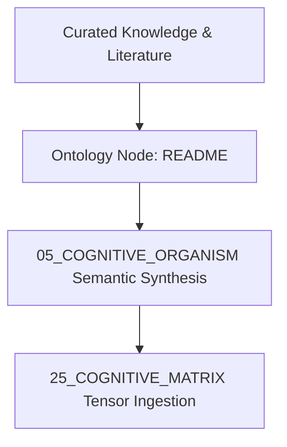

# README — Curated Domain Knowledge Architecture

## 1. Domain Knowledge Overview
Authoritative knowledge synthesis and mathematical representation for **README** in the AMOS Knowledge Base (11_KNOWLEDGE).

- **Knowledge Domain**: High-density theoretical foundations, algorithmic models, and state integration.
- **Epistemic Class**: `DERIVED / KNOWLEDGE_SYNTHESIS`
- **Origin Architect**: Trang Phan
- **Target Version**: AMOS `v4.4`



---

## 2. Theoretical Formulation & Knowledge Dynamics

The knowledge density metric $\mathcal{K}(e)$ over domain entity $e$ is parameterized by:

$$\mathcal{K}(e) = \sum_{j \in \text{relations}} w_j \cdot \log_2 \left( 1 + \frac{\text{Evidence}(e, r_j)}{\sigma_j^2} \right)$$

---

## 3. Cross-Plane Architectural Bindings

- **Master Knowledge MOC**: [[11_KNOWLEDGE/11_KNOWLEDGE_MOC]].
- **Cognitive Matrix Mapping**: [[25_COGNITIVE_MATRIX/00_INDEX/COGNITIVE_MATRIX_MOC]].
- **Research Plane Correlation**: [[22_RESEARCH/22_RESEARCH_MOC]].


# AMOS-L Compiler

## Overview

AMOS-L is the canonical specification language for AMOS OS. It provides a typed, formal language for defining AMOS components, contracts, invariants, and governance rules.

## Language Features

- **Typed**: static typing with type inference; dependent types (experimental); linear types for resource management
- **Formal**: based on formal logic; proof-carrying code; contract verification; invariant checking
- **Declarative**: declarative specifications; imperative implementation; hybrid paradigm
- **Governed**: all AMOS-L specifications are governed by the capability-bound governance kernel

## Compilation Pipeline

```
AMOS-L source → Parser → Type Checker → Contract Verifier → Invariant Checker → Code Generation → Runtime
```

## AMOS Integration

- **Lean4 formal kernel**: [[02_KERNEL/LEAN4_FORMAL_KERNEL|Lean4 Formal Kernel]] — formal verification backend
- **Kernel contract**: [[02_KERNEL/02_KERNEL_CONTRACT|02_KERNEL_CONTRACT]]
- **Canon contract**: [[01_CANON/01_CANON_CONTRACT|01_CANON_CONTRACT]]
- **Knowledge MOC**: [[11_KNOWLEDGE/11_KNOWLEDGE_MOC|11_KNOWLEDGE_MOC]]

## Invariants

1. `SPECIFIED != COMPILED` — specification does not guarantee successful compilation
2. `COMPILED != VERIFIED` — compilation does not guarantee formal verification
3. `VERIFIED != DEPLOYED` — verification does not guarantee deployment
4. All AMOS-L claims must cite provenance (version, compiler, verification status, test results)

