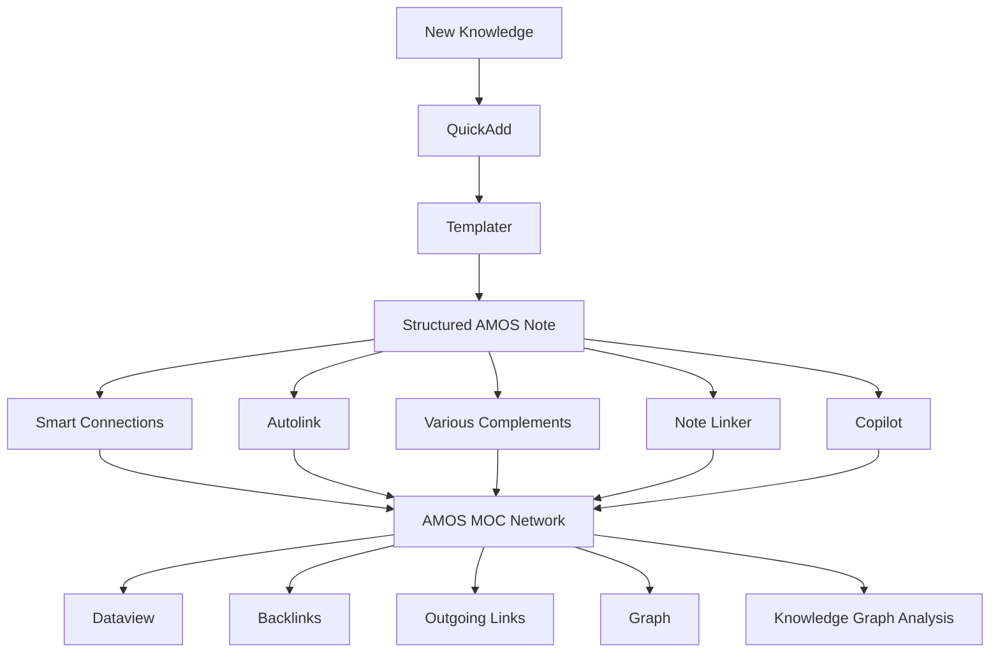
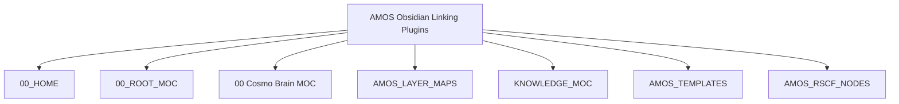

---
tags:
- knowledge
- obsidian
- linking
- plugins.md
- plugins
- canonical-node-a
- canonical-node-b
- integration
- note-b
- reality
- canon
- 00-cosmo-brain-moc
- amos-home
- 00-home
- 00-root-moc
- amos-layer-maps
- knowledge-moc
- amos-templates
- amos-rscf-nodes
- validation
---

# Domain MOC

## Canonical / Curated

- [[Canonical Node A]]
- [[Canonical Node B]]

## Dynamic Discovery

```dataview
LIST
FROM #domain/example
SORT file.name ASC
---

> [!note] Source preface
>
> # AMOS OBSIDIAN — LINKING PLUGIN STACK
> 
> ## Full Canonical Content + Extended Tags + Obsidian/RSCF Integration
> 
> > **Conclusion class:** `DECISION / AMOS_MODEL`
> > **Artifact epistemic state:** `SOURCE_CLAIM`
> > **Confidence label:** `DERIVED`
> > **Origin architect / steward:** Trang Phan
> > **Scope:** AMOS persistent-knowledge tooling and Obsidian linking architecture
> > **Source boundary:** Plugin names, rankings, configuration statements, and recommendations below are preserved as corpus claims unless independently verified against the current Obsidian/community-plugin registry.
> 
> ---
> 
> # 0. Normalized Source Frontmatter — SOURCE
> 
> ```yaml
> ---
> artifact_id: AMOS-OBSIDIAN-LINKING-PLUGINS
> conclusion_class: DECISION / AMOS_MODEL
> confidence: DERIVED
> document_version: 1.0.0
> name: AMOS_Obsidian_Linking_Plugins
> origin_architect: Trang Phan
> provenance: USER_REQUEST / COMMUNITY_PLUGIN_REGISTRY
> status: active
> steward: Trang Phan
> 
> tags:
>   - obsidian
>   - knowledge
>   - vault
>   - linking
>   - plugins
>   - moc
>   - templater
>   - smart-connections
>   - dataview
>   - canon-group/tech-ai
>   - canon/tooling
>   - rscf/claim
>   - rscf/provenance
>   - rscf/state/derived
>   - topic/obsidian-linking
> 
> title: AMOS Obsidian — Linking Plugin Stack
> type: reference
> source: 11_KNOWLEDGE
> 
> rscf:
>   state: SOURCE_CLAIM
>   claim_class: SOURCE_CLAIM
>   provenance: AMOS_corpus
>   scope: AMOS_knowledge
> ---
> ```
> 
> > [!important] Source metadata boundary
> > The frontmatter above preserves the supplied fields and values. The expanded tags, aliases, RSCF topology, plugin classes, governance fields, Dataview properties, and ingestion controls below are **DERIVED / PROPOSED** unless explicitly present in the source.
> 
> ---
> 
> # 1. Extended Obsidian Frontmatter — DERIVED / PROPOSED
> 
> ```yaml
> aliases:
>   - AMOS Obsidian Linking Plugins
>   - AMOS Obsidian Linking Plugin Stack
>   - Obsidian Linking Stack
>   - AMOS Linking Stack
>   - AMOS Vault Linking Stack
>   - AMOS Obsidian Knowledge Graph Tooling
> 
> derived_tags:
>   # AMOS
>   - amos
>   - amos-os
>   - amos-corpus
>   - amos-knowledge
>   - amos-tooling
>   - amos-vault
>   - amos-obsidian
> 
>   # layer
>   - 11-knowledge
>   - knowledge-layer
>   - persistent-knowledge
>   - persistent-brain
>   - knowledge-infrastructure
> 
>   # Obsidian
>   - obsidian
>   - obsidian-vault
>   - obsidian-plugin
>   - obsidian-community-plugin
>   - obsidian-core-plugin
>   - obsidian-linking
>   - obsidian-automation
>   - obsidian-graph
>   - obsidian-moc
> 
>   # linking
>   - linking
>   - wikilinks
>   - backlinks
>   - outgoing-links
>   - semantic-linking
>   - automatic-linking
>   - manual-linking
>   - link-discovery
>   - link-suggestion
>   - related-notes
>   - orphan-detection
>   - broken-links
> 
>   # plugins
>   - smart-connections
>   - autolink
>   - templater-obsidian
>   - quickadd
>   - various-complements
>   - note-linker
>   - dataview
>   - copilot
>   - knowledge-graph-analysis
> 
>   # Obsidian core
>   - backlink
>   - outgoing-link
>   - graph
>   - page-preview
> 
>   # automation
>   - templater
>   - quickadd
>   - templates
>   - note-generation
>   - automated-note-creation
>   - structured-capture
>   - frontmatter-automation
> 
>   # graph / MOC
>   - moc
>   - map-of-content
>   - auto-moc
>   - knowledge-graph
>   - graph-analysis
>   - graph-topology
>   - graph-hygiene
>   - orphan-notes
> 
>   # AMOS epistemics
>   - rscf
>   - rscf-node
>   - rscf-claim
>   - rscf-provenance
>   - rscf-state-derived
>   - provenance
>   - epistemic-class
>   - claim-class
>   - confidence
>   - source-claim
>   - amos-model
> 
>   # governance
>   - tooling-governance
>   - plugin-governance
>   - automation-governance
>   - provenance-governance
>   - link-governance
>   - knowledge-governance
>   - anti-fabrication
>   - anti-regression
>   - scope-firewall
>   - provenance-firewall
> 
>   # canon
>   - canon-tech-ai
>   - canon-tooling
>   - canon-knowledge
>   - canon-obsidian
> 
>   # topic
>   - topic-obsidian-linking
>   - topic-vault-automation
>   - topic-knowledge-graph
>   - topic-moc
>   - topic-templating
>   - topic-plugin-stack
> 
> proposed_rscf:
>   node_id: amos_obsidian_linking_plugins
>   node_type: note
>   path: 11_KNOWLEDGE/AMOS_Obsidian_Linking_Plugins.md
>   state: SOURCE_CLAIM
>   artifact_claim_class: SOURCE_CLAIM
>   conclusion_class: DECISION / AMOS_MODEL
>   provenance:
>     - USER_REQUEST
>     - COMMUNITY_PLUGIN_REGISTRY
>     - AMOS_corpus
>   scope: AMOS_knowledge
>   confidence_label: DERIVED
> 
> raw_source_policy: DO_NOT_LOAD_UNLESS_REQUIRED
> ingestion_action: INDEX_AS_REFERENCE
> ```
> 
> ---
> 
> # 2. Artifact Identity
> 
> # AMOS Obsidian — Linking Plugin Stack
> 
> > [!abstract] RSCF-NODE
> > **Node:** `amos_obsidian_linking_plugins`
> > **Node type:** `note`
> > **Artifact type:** `reference`
> > **Layer:** `11_KNOWLEDGE`
> > **Domain:** Obsidian / persistent knowledge / vault linking / tooling
> > **Origin architect:** Trang Phan
> > **Steward:** Trang Phan
> > **Document version:** `1.0.0`
> > **Status:** `active`
> > **Source epistemic state:** `SOURCE_CLAIM`
> > **Conclusion class:** `DECISION / AMOS_MODEL`
> > **Confidence label:** `DERIVED`
> 
> ---
> 
> # 3. Purpose
> 
> The source defines the purpose as:
> 
> > Use Obsidian as the persistent brain surface for AMOS.
> 
> The artifact configures a linking-oriented plugin stack and supplies a starter Templater pattern so newly created notes can enter the vault with pre-existing relationships to the AMOS MOC network.
> 
> At the model level:
> 
> ```text
> NEW INFORMATION
>       ↓
> OBSIDIAN NOTE
>       ↓
> STANDARD METADATA
>       ↓
> ROOT / DOMAIN MOC LINKS
>       ↓
> SEMANTIC + EXPLICIT LINKS
>       ↓
> BACKLINK / GRAPH DISCOVERY
>       ↓
> PERSISTENT AMOS KNOWLEDGE GRAPH
> ```
> 
> The first sentence is source-defined purpose. The pipeline representation is **DERIVED**.
> 
> ---
> 
> # 4. Primary Design Objective
> 
> The artifact is not merely a list of plugins.
> 
> Its deeper source-defined objective is to prevent newly created AMOS knowledge from beginning as disconnected notes.
> 
> The intended transition is:
> 
> ```text
> UNCONNECTED NOTE
>        ↓
> STANDARDIZED CREATION
>        ↓
> MOC CONNECTION
>        ↓
> RELATED-NOTE DISCOVERY
>        ↓
> GRAPH [[INTEGRATION]]
> ```
> 
> This is a structural interpretation of the supplied template and plugin recommendations.
> 
> ---
> 
> # 5. Epistemic Boundary
> 
> Several kinds of claims coexist in this note.
> 
> They must remain separated.
> 
> | Content                             | Safe Class                              |
> | ----------------------------------- | --------------------------------------- |
> | User-supplied artifact content      | `SOURCE_CLAIM`                          |
> | Plugin-stack recommendation         | `DECISION / AMOS_MODEL`                 |
> | Plugin capability descriptions      | `SOURCE_CLAIM` unless registry-verified |
> | Proposed AMOS architecture          | `DERIVED / AMOS_MODEL`                  |
> | Templater script                    | source-supplied configuration           |
> | Dataview example                    | source-supplied configuration           |
> | Runtime behavior in user's vault    | `UNKNOWN` unless tested                 |
> | Current plugin availability/version | `UNKNOWN` unless registry-verified      |
> 
> Therefore:
> 
> ```text
> PLUGIN LISTED
> !=
> PLUGIN CURRENTLY AVAILABLE
> 
> PLUGIN ENABLED IN DOCUMENT
> !=
> PLUGIN VERIFIED ENABLED IN VAULT
> 
> PLUGIN DESCRIPTION
> !=
> INDEPENDENTLY VERIFIED CURRENT CAPABILITY
> 
> RECOMMENDED STACK
> !=
> MANDATORY [[CANON]]
> 
> AI LINK SUGGESTION
> !=
> CANONICAL RELATION
> 
> SEMANTIC SIMILARITY
> !=
> CAUSATION
> 
> SEMANTIC SIMILARITY
> !=
> IDENTITY
> ```
> 
> ---
> 
> # 6. Source-Defined Community Plugin Stack
> 
> The supplied artifact ranks nine community plugins.
> 
> | Rank | Plugin ID                  | Display Name             | Source-Defined Purpose                  | Best For                     |
> | ---: | -------------------------- | ------------------------ | --------------------------------------- | ---------------------------- |
> |    1 | `smart-connections`        | Smart Connections        | Semantic / AI related-note discovery    | Intelligent suggestions      |
> |    2 | `autolink`                 | Autolink                 | Auto-convert matching text to links     | Bulk cleanup                 |
> |    3 | `templater-obsidian`       | Templater                | JS-driven note creation with links      | Full automation              |
> |    4 | `quickadd`                 | QuickAdd                 | One-shortcut capture + templater        | Fast structured creation     |
> |    5 | `various-complements`      | Various Complements      | Faster autocomplete                     | Manual linking speed         |
> |    6 | `obisidian-note-linker`    | Note Linker              | Suggest missed note-to-note links       | Missed connections           |
> |    7 | `dataview`                 | Dataview                 | Dynamic link lists / auto-MOCs          | Auto-updating indexes        |
> |    8 | `copilot`                  | Copilot                  | AI writing assistant + link suggestions | Link insertion while writing |
> |    9 | `knowledge-graph-analysis` | Knowledge Graph Analysis | Graph metrics and link insights         | Link topology                |
> 
> ---
> 
> # 7. Source Spelling Preservation
> 
> One plugin ID is supplied as:
> 
> ```text
> obisidian-note-linker
> ```
> 
> The apparent `obisidian` spelling may be intentional, registry-specific, or a typo.
> 
> Without registry verification, preserve:
> 
> ```yaml
> source_plugin_id: obisidian-note-linker
> canonical_registry_id: UNKNOWN
> ```
> 
> Do **not** silently change it to `obsidian-note-linker`.
> 
> ---
> 
> # 8. Recommended Combination — SOURCE
> 
> The source explicitly recommends:
> 
> ```yaml
> recommended_combination:
>   smartest_linking: smart-connections
>   bulk_fix: autolink
>   max_automation:
>     - templater-obsidian
>     - quickadd
>   fast_manual_linking: various-complements
> ```
> 
> This is a source-defined decision architecture.
> 
> It should not be promoted into a universal statement that these are objectively the best plugins for all Obsidian users.
> 
> ---
> 
> # 9. Functional Decomposition
> 
> The nine-plugin stack can be divided into functional roles.
> 
> This decomposition is **DERIVED**.
> 
> ```text
> DISCOVERY
> ├── Smart Connections
> ├── Note Linker
> └── Copilot
> 
> LINK CREATION / REPAIR
> ├── Autolink
> └── Various Complements
> 
> NOTE GENERATION
> ├── Templater
> └── QuickAdd
> 
> INDEXING / QUERY
> └── Dataview
> 
> GRAPH ANALYSIS
> └── Knowledge Graph Analysis
> ```
> 
> ---
> 
> # 10. Layer A — Semantic Discovery
> 
> Primary source plugin:
> 
> ```text
> smart-connections
> ```
> 
> Source purpose:
> 
> ```text
> Semantic / AI related-note discovery
> ```
> 
> Conceptually:
> 
> ```text
> CURRENT NOTE
>      ↓
> SEMANTIC COMPARISON
>      ↓
> CANDIDATE RELATED NOTES
>      ↓
> HUMAN / GOVERNED REVIEW
>      ↓
> OPTIONAL LINK
> ```
> 
> The final review step is a derived governance recommendation.
> 
> ---
> 
> # 11. Semantic-Link Firewall
> 
> A semantic system may identify two notes as similar.
> 
> That does not establish:
> 
> ```text
> A CAUSES B
> A IS B
> A SUPPORTS B
> A CONTRADICTS B
> A IS PARENT OF B
> ```
> 
> Therefore:
> 
> $$
> SemanticSimilarity(A,B)
> \not\Rightarrow
> CanonicalRelation(A,B)
> $$
> 
> A proposed link remains a candidate until its relation semantics are known.
> 
> ---
> 
> # 12. Link Existence ≠ Relation Meaning
> 
> A raw Obsidian wikilink:
> 
> ```markdown
> [[NOTE_B]]
> ```
> 
> establishes navigational connectivity.
> 
> It does not encode whether B is:
> 
> ```text
> evidence
> parent
> child
> dependency
> counterexample
> contradiction
> analogy
> implementation
> index
> MOC
> related concept
> ```
> 
> AMOS RSCF relations can carry the missing semantic type where needed.
> 
> ---
> 
> # 13. Layer B — Bulk Linking
> 
> Source:
> 
> ```text
> autolink
> ```
> 
> Purpose:
> 
> > Auto-convert matching text to links.
> 
> This is useful for existing corpus cleanup but introduces a high-value governance boundary:
> 
> ```text
> TEXT MATCH
> !=
> ENTITY IDENTITY
> ```
> 
> A matching phrase can refer to different concepts.
> 
> ---
> 
> # 14. Autolink Risk
> 
> Suppose the vault contains:
> 
> ```text
> Reality
> ```
> 
> and a note:
> 
> ```markdown
> [[Reality]]
> ```
> 
> An automatic conversion of every occurrence of the word `Reality` into that note may be incorrect if some occurrences use a different meaning.
> 
> Therefore bulk linking should be treated as:
> 
> ```text
> candidate transformation
> → sample validation
> → controlled expansion
> ```
> 
> rather than:
> 
> ```text
> global rewrite
> → assume correctness
> ```
> 
> This aligns with the source checklist's recommendation to test a sample folder before bulk linking.
> 
> ---
> 
> # 15. Source-Supplied Safety Pattern
> 
> The first-run checklist explicitly recommends:
> 
> > Run Autolink (or Note Linker) across a sample folder first to audit behavior before bulk-linking.
> 
> This is a strong source-defined reversible-action pattern:
> 
> ```text
> SAMPLE
>   ↓
> AUDIT
>   ↓
> EXPAND
> ```
> 
> rather than immediate irreversible vault-wide mutation.
> 
> ---
> 
> # 16. Layer C — Templater
> 
> Source plugin:
> 
> ```text
> templater-obsidian
> ```
> 
> Source role:
> 
> ```text
> JS-driven note creation with links
> ```
> 
> The supplied artifact uses Templater to standardize:
> 
> * creation date;
> * origin architect;
> * note type;
> * status;
> * tags;
> * provenance;
> * confidence;
> * related notes;
> * note title.
> 
> ---
> 
> # 17. Layer D — QuickAdd
> 
> Source:
> 
> ```text
> quickadd
> ```
> 
> Purpose:
> 
> > One-shortcut capture + templater.
> 
> The intended composition is:
> 
> ```text
> QUICKADD
>    ↓
> TEMPLATER
>    ↓
> STANDARDIZED NOTE
> ```
> 
> This composition is explicitly recommended in the source checklist.
> 
> ---
> 
> # 18. Layer E — Various Complements
> 
> Source:
> 
> ```text
> various-complements
> ```
> 
> Purpose:
> 
> > Faster autocomplete.
> 
> Its role differs from Smart Connections.
> 
> Conceptually:
> 
> ```text
> Smart Connections
> → semantic candidate discovery
> 
> Various Complements
> → faster manual completion
> ```
> 
> Do not collapse semantic recommendation and autocomplete into one mechanism.
> 
> ---
> 
> # 19. Layer F — Note Linker
> 
> Source plugin ID:
> 
> ```text
> obisidian-note-linker
> ```
> 
> Display name:
> 
> ```text
> Note Linker
> ```
> 
> Source role:
> 
> > Suggest missed note-to-note links.
> 
> This is structurally complementary to Autolink:
> 
> ```text
> AUTOLINK
> → convert detected textual matches
> 
> NOTE LINKER
> → suggest missing note relationships
> ```
> 
> Exact current implementation semantics require plugin-specific evidence.
> 
> ---
> 
> # 20. Layer G — Dataview
> 
> Source:
> 
> ```text
> dataview
> ```
> 
> Purpose:
> 
> > Dynamic link lists / auto-MOCs.
> 
> Dataview introduces a different type of connectivity:
> 
> ```text
> EXPLICIT LINK
> vs
> QUERY-DERIVED MEMBERSHIP
> ```
> 
> A note can appear in an MOC query without containing a direct wikilink to that MOC.
> 
> ---
> 
> # 21. Dataview as Dynamic Index
> 
> The source example is:
> 
> ```dataview
> TABLE file.mtime AS Updated, tags
> FROM #moc OR #canon-group/tech-ai
> SORT file.name ASC
> ```
> 
> This creates a dynamic view over notes satisfying tag conditions.
> 
> It should be understood as:
> 
> ```text
> QUERY RESULT
> ```
> 
> not necessarily:
> 
> ```text
> STATIC CANONICAL MEMBERSHIP
> ```
> 
> unless the tags themselves are governed canonically.
> 
> ---
> 
> # 22. Layer H — Copilot
> 
> Source:
> 
> ```text
> copilot
> ```
> 
> Purpose:
> 
> > AI writing assistant + link suggestions.
> 
> Its output should remain suggestion-level unless reviewed.
> 
> ```text
> AI SUGGESTION
> !=
> CANONICAL LINK
> ```
> 
> and:
> 
> ```text
> FLUENT EXPLANATION
> !=
> SOURCE EVIDENCE
> ```
> 
> ---
> 
> # 23. Layer I — Knowledge Graph Analysis
> 
> Source:
> 
> ```text
> knowledge-graph-analysis
> ```
> 
> Purpose:
> 
> > Graph metrics and link insights.
> 
> This supports topology analysis.
> 
> Possible derived graph concerns include:
> 
> * orphan nodes;
> * high-degree hubs;
> * disconnected clusters;
> * weakly connected domains;
> * over-centralization;
> * bridge nodes.
> 
> These specific metrics are not enumerated in the source.
> 
> ---
> 
> # 24. Graph Metric Firewall
> 
> Graph topology must not be overinterpreted.
> 
> ```text
> HIGH DEGREE
> !=
> HIGH TRUTH
> 
> CENTRAL NODE
> !=
> AUTHORITATIVE NODE
> 
> MANY BACKLINKS
> !=
> INDEPENDENT CONFIRMATION
> 
> ISOLATED NOTE
> !=
> FALSE NOTE
> 
> DENSE CLUSTER
> !=
> VALID THEORY
> ```
> 
> Graph metrics describe topology, not epistemic validity.
> 
> ---
> 
> # 25. Core Obsidian Linking Plugins — SOURCE
> 
> The source identifies four core Obsidian capabilities:
> 
> | Core Plugin   | Source Setting        | Purpose                            |
> | ------------- | --------------------- | ---------------------------------- |
> | Backlink      | `backlink: true`      | Shows who links to current note    |
> | Outgoing link | `outgoing-link: true` | Surfaces unlinked mentions / notes |
> | Graph         | `graph: true`         | Global/local link topology         |
> | Page preview  | `page-preview: true`  | Hover previews                     |
> 
> ---
> 
> # 26. Backlinks
> 
> Backlinks provide reverse traversal:
> 
> ```text
> A → B
> ```
> 
> while viewing B:
> 
> ```text
> B ← A
> ```
> 
> This supports provenance discovery and contextual navigation.
> 
> However:
> 
> ```text
> BACKLINK
> !=
> ENDORSEMENT
> ```
> 
> ---
> 
> # 27. Outgoing Links
> 
> Outgoing-link functionality supports detection of:
> 
> ```text
> mentions
> existing links
> potential unlinked references
> ```
> 
> depending on Obsidian behavior/configuration.
> 
> The source specifically frames it as a mechanism for surfacing unlinked mentions and notes to connect.
> 
> ---
> 
> # 28. Graph
> 
> Graph views provide a topology surface.
> 
> Conceptually:
> 
> $$
> G=(V,E)
> $$
> 
> where:
> 
> * \(V\) = notes;
> * \(E\) = links.
> 
> This graph abstraction is derived.
> 
> ---
> 
> # 29. Page Preview
> 
> Page Preview reduces navigation cost by exposing linked-note content without requiring full navigation.
> 
> Its role is primarily interaction/navigation, not canonical relation generation.
> 
> ---
> 
> # 30. Combined Linking Architecture
> 
> The full source stack can be normalized as:
> 
> ```text
>                     ┌─────────────────┐
>                     │ NEW KNOWLEDGE   │
>                     └────────┬────────┘
>                              ↓
>                     ┌─────────────────┐
>                     │ QUICKADD        │
>                     └────────┬────────┘
>                              ↓
>                     ┌─────────────────┐
>                     │ TEMPLATER       │
>                     └────────┬────────┘
>                              ↓
>                     ┌─────────────────┐
>                     │ STRUCTURED NOTE │
>                     └────────┬────────┘
>                              ↓
>               ┌──────────────┼──────────────┐
>               ↓              ↓              ↓
>        Smart Connections   Autolink    Various Complements
>               │              │              │
>               └──────────────┼──────────────┘
>                              ↓
>                     ┌─────────────────┐
>                     │ LINKED NOTE     │
>                     └────────┬────────┘
>                              ↓
>                ┌─────────────┼─────────────┐
>                ↓             ↓             ↓
>             Dataview       Graph       Backlinks
>                │             │             │
>                └─────────────┼─────────────┘
>                              ↓
>                     ┌─────────────────┐
>                     │ AMOS KNOWLEDGE  │
>                     │ GRAPH           │
>                     └─────────────────┘
> ```
> 
> This is a **DERIVED architecture** from the source-defined plugin roles.
> 
> ---
> 
> # 31. Templater Starter Script — SOURCE
> 
> The supplied template is:
> 
> ```markdown
> ---
> created: "<% tp.date.now("YYYY-MM-DD") %>"
> origin_architect: Trang Phan
> type: note
> status: draft
> tags: [note, linkme]
> provenance: MODEL
> confidence: DERIVED
> related:
>   - "00 Cosmo Brain MOC"
>   - "AMOS Home"
> ---
> 
> # <% tp.file.title %>
> 
> > Epistemic class: MODEL
> 
> > Confidence: DERIVED
> 
> ## Purpose
> 
> ## Links
> 
> - 00 Cosmo Brain MOC
> - AMOS Home
> 
> ## Notes
> ```
> 
> ---
> 
> # 32. Template Purpose
> 
> The source states three effects:
> 
> 1. standard AMOS provenance frontmatter;
> 2. pre-linking to root MOC and Cosmo Brain MOC;
> 3. title normalization from new-note name.
> 
> A source-level ambiguity exists, however.
> 
> The supplied `related:` values are:
> 
> ```yaml
> related:
>   - "00 Cosmo Brain MOC"
>   - "AMOS Home"
> ```
> 
> and the Links section uses:
> 
> ```markdown
> - 00 Cosmo Brain MOC
> - AMOS Home
> ```
> 
> These are plain strings/text, not explicit Obsidian wikilinks.
> 
> Therefore the claim that the template **pre-links** those notes is not fully established by the literal snippet.
> 
> ---
> 
> # 33. Template Linking Gap
> 
> Literal source:
> 
> ```markdown
> - 00 Cosmo Brain MOC
> - AMOS Home
> ```
> 
> Explicit Obsidian links would normally have the structural form:
> 
> ```markdown
> - [[00 Cosmo Brain MOC]]
> - [[AMOS Home]]
> ```
> 
> But the latter is a **PROPOSED correction**, not a silent normalization of the supplied template.
> 
> Therefore:
> 
> ```yaml
> template_linking:
>   intended_behavior:
>     source_claim: pre_links_root_and_cosmo_MOCs
> 
>   literal_template:
>     explicit_wikilinks_present: false
> 
>   status: DECISION_RELEVANT_GAP
> ```
> 
> This is one of the most important internal consistency findings in the artifact.
> 
> ---
> 
> # 34. Proposed AMOS-Safe Linked Template
> 
> The following is an augmentation, not replacement source:
> 
> ```markdown
> ---
> created: "<% tp.date.now("YYYY-MM-DD") %>"
> origin_architect: Trang Phan
> type: note
> status: draft
> 
> tags:
>   - note
>   - linkme
>   - rscf/state/model
> 
> provenance: MODEL
> confidence: DERIVED
> 
> related:
>   - "[[00 Cosmo Brain MOC]]"
>   - "[[00_HOME]]"
> ---
> 
> # <% tp.file.title %>
> 
> > [!info] Epistemic State
> > **Class:** MODEL
> > **Confidence:** DERIVED
> 
> ## Purpose
> 
> ## Links
> 
> - [[00 Cosmo Brain MOC]]
> - [[00_HOME]]
> 
> ## Notes
> ```
> 
> Again, this is **PROPOSED**.
> 
> ---
> 
> # 35. Source File Location
> 
> The source recommends:
> 
> ```text
> Templates/linked-note.md
> ```
> 
> and states:
> 
> > save this as a Templater template and bind it to QuickAdd or a hotkey.
> 
> ---
> 
> # 36. Preconfiguration Claim
> 
> The artifact states:
> 
> > Templater is already set to use the `Templates` folder (`.obsidian/plugins/templater-obsidian/data.json`).
> 
> Classification:
> 
> ```yaml
> templater_configuration:
>   claim: "Templates folder already configured"
>   class: SOURCE_CLAIM
>   supplied_path: ".obsidian/plugins/templater-obsidian/data.json"
>   independently_verified: false
> ```
> 
> Do not promote this to current vault fact without inspecting the actual configuration.
> 
> ---
> 
> # 37. First-Run Checklist — SOURCE
> 
> The source recommends:
> 
> 1. Install and enable the listed community plugins.
> 2. Run Smart Connections and allow its local embedding index to build.
> 3. Run Autolink or Note Linker on a sample folder before bulk use.
> 4. Configure QuickAdd to invoke the linked-note Templater template.
> 5. Add a Dataview auto-MOC.
> 6. Periodically find orphaned files and broken links.
> 
> ---
> 
> # 38. First-Run Pipeline
> 
> Derived normalization:
> 
> ```text
> INSTALL
>   ↓
> ENABLE
>   ↓
> INDEX
>   ↓
> TEST ON SAMPLE
>   ↓
> AUDIT
>   ↓
> CONFIGURE AUTOMATION
>   ↓
> ENABLE DYNAMIC MOC
>   ↓
> MAINTAIN GRAPH
> ```
> 
> This ordering is strongly supported by the source checklist.
> 
> ---
> 
> # 39. Reversibility Principle
> 
> The sample-folder recommendation embodies a robust governance principle:
> 
> $$
> SmallTest
> \rightarrow
> Audit
> \rightarrow
> Scale
> $$
> 
> rather than:
> 
> $$
> UntestedAutomation
> \rightarrow
> WholeVaultMutation
> $$
> 
> This is a **DERIVED governance principle** grounded in the source recommendation.
> 
> ---
> 
> # 40. MOC Architecture
> 
> The artifact connects to:
> 
> ```text
> 00 Cosmo Brain MOC
> [[00_ROOT_MOC]]
> [[00_HOME]]
> [[AMOS_LAYER_MAPS]]
> [[KNOWLEDGE_MOC]]
> [[AMOS_TEMPLATES]]
> ```
> 
> This establishes a source-defined navigation neighborhood.
> 
> ---
> 
> # 41. Knowledge MOC Role
> 
> Source:
> 
> ```markdown
> [[KNOWLEDGE_MOC|11_KNOWLEDGE MOC — the knowledge layer index]]
> ```
> 
> This explicitly identifies `KNOWLEDGE_MOC` as the knowledge-layer index.
> 
> Therefore the artifact is naturally indexed inside the `11_KNOWLEDGE` navigation plane.
> 
> ---
> 
> # 42. AMOS Layer Maps
> 
> Source:
> 
> ```markdown
> [[AMOS_LAYER_MAPS]]
> ```
> 
> with description:
> 
> > top-level AMOS layer map index.
> 
> This establishes a higher-level navigational relationship.
> 
> ---
> 
> # 43. AMOS Templates
> 
> Source:
> 
> ```markdown
> [[AMOS_TEMPLATES]]
> ```
> 
> with description:
> 
> > AMOS template index.
> 
> This is directly relevant to the `linked-note` template.
> 
> ---
> 
> # 44. Root MOC
> 
> Source explicitly references:
> 
> ```markdown
> [[00_ROOT_MOC]]
> ```
> 
> This is distinct from the plain-text:
> 
> ```text
> 00 Cosmo Brain MOC
> ```
> 
> and:
> 
> ```markdown
> [[00_HOME]]
> ```
> 
> Do not silently assume all three refer to the same note.
> 
> ---
> 
> # 45. MOC ≠ Canonical Parent
> 
> A note being indexed by an MOC does not necessarily mean:
> 
> ```text
> MOC PARENT_OF NOTE
> ```
> 
> in a semantic or ontological sense.
> 
> Indexing and hierarchy should remain distinct.
> 
> ```text
> INDEXED_BY
> !=
> CHILD_OF
> ```
> 
> unless canon explicitly equates them.
> 
> ---
> 
> # 46. RSCF Node — SOURCE
> 
> The supplied artifact declares:
> 
> ```text
> RSCF-NODE
> 
> node_id: amos_obsidian_linking_plugins
> node_type: note
> path: 11_KNOWLEDGE/AMOS_Obsidian_Linking_Plugins.md
> ```
> 
> and:
> 
> ```text
> RSCF-RELATIONS:
>   - INDEXED_BY: [[00_HOME]]
>   - INDEXED_BY: [[AMOS_RSCF_NODES]]
> 
> claim_class: AMOS_MODEL
> ```
> 
> ---
> 
> # 47. RSCF Epistemic Duality
> 
> Frontmatter says:
> 
> ```yaml
> rscf:
>   state: SOURCE_CLAIM
>   claim_class: SOURCE_CLAIM
> ```
> 
> Later RSCF block says:
> 
> ```text
> claim_class: AMOS_MODEL
> ```
> 
> These need not be treated as a contradiction if they refer to different levels:
> 
> ```text
> ARTIFACT PROVENANCE CLAIM
> =
> SOURCE_CLAIM
> 
> ARCHITECTURAL / DECISION CONTENT
> =
> AMOS_MODEL
> ```
> 
> This interpretation is **DERIVED**.
> 
> The source itself does not explicitly explain the distinction.
> 
> ---
> 
> # 48. Epistemic Normalization
> 
> A safe normalized representation is:
> 
> ```yaml
> epistemic:
>   artifact_state:
>     class: SOURCE_CLAIM
>     source: frontmatter
> 
>   artifact_rscf_claim:
>     class: SOURCE_CLAIM
>     source: frontmatter.rscf
> 
>   architecture_claim:
>     class: AMOS_MODEL
>     source: terminal_RSCF_block
> 
>   conclusion:
>     class: DECISION / AMOS_MODEL
>     source: frontmatter
> 
>   confidence:
>     label: DERIVED
> ```
> 
> This preserves all supplied values without forcing them into one field.
> 
> ---
> 
> # 49. Provenance Duality
> 
> Frontmatter top-level:
> 
> ```yaml
> provenance: USER_REQUEST / COMMUNITY_PLUGIN_REGISTRY
> ```
> 
> Nested RSCF:
> 
> ```yaml
> provenance: AMOS_corpus
> ```
> 
> Again, these can represent different provenance layers:
> 
> ```text
> artifact construction provenance
> vs
> RSCF corpus provenance
> ```
> 
> But this distinction is **DERIVED**.
> 
> Do not erase either source value.
> 
> ---
> 
> # 50. Provenance Topology
> 
> ```mermaid
> flowchart TD
>     U["USER_REQUEST"]
>     CPR["COMMUNITY_PLUGIN_REGISTRY"]
>     AC["AMOS_corpus"]
> 
>     A["AMOS Obsidian Linking Plugin Stack"]
> 
>     U --> A
>     CPR --> A
>     AC --> A
> ```
> 
> This graph represents declared provenance labels, not proof that the current community registry has been independently queried.
> 
> ---
> 
> # 51. Plugin Registry Freshness
> 
> Community plugins are mutable dependencies.
> 
> Their:
> 
> ```text
> availability
> ID
> maintainer
> version
> features
> compatibility
> security posture
> ```
> 
> can change.
> 
> Therefore plugin claims are freshness-bounded.
> 
> A source created on:
> 
> ```text
> 2026-08-27
> ```
> 
> does not guarantee perpetual plugin-state validity.
> 
> ---
> 
> # 52. Freshness Contract
> 
> Derived:
> 
> ```yaml
> plugin_dependency:
>   identity: plugin_id
>   version: UNKNOWN_UNLESS_RETRIEVED
>   current_availability: UNKNOWN_UNLESS_RETRIEVED
>   compatibility: UNKNOWN_UNLESS_TESTED
>   security_status: UNKNOWN_UNLESS_AUDITED
>   freshness_required: true
> ```
> 
> ---
> 
> # 53. Community Plugin Security Boundary
> 
> Community plugins introduce executable code into the vault environment.
> 
> Therefore:
> 
> ```text
> USEFUL PLUGIN
> !=
> TRUSTED PLUGIN
> 
> POPULAR PLUGIN
> !=
> SECURE PLUGIN
> 
> OPEN SOURCE
> !=
> VULNERABILITY FREE
> 
> AI FEATURE
> !=
> PRIVATE BY DEFAULT
> ```
> 
> Exact security/privacy properties require plugin-specific evidence.
> 
> ---
> 
> # 54. Privacy Boundary
> 
> The artifact describes AI-related tooling:
> 
> ```text
> Smart Connections
> Copilot
> ```
> 
> but does not specify:
> 
> ```text
> model provider
> network access
> data transmission
> embedding provider
> storage location
> retention
> privacy policy
> API configuration
> ```
> 
> Therefore those remain **UNKNOWN/GAP**.
> 
> ---
> 
> # 55. “Local Embedding Index” Claim
> 
> The checklist says Smart Connections should:
> 
> > build the local embedding index.
> 
> This is a source claim.
> 
> Do not infer from that phrase alone that:
> 
> ```text
> all inference is local
> no data leaves device
> no remote API exists
> embeddings are encrypted
> ```
> 
> Those are separate questions.
> 
> ---
> 
> # 56. Link Governance Layers
> 
> A useful derived AMOS classification is:
> 
> ```text
> L0 — RAW MENTION
> L1 — CANDIDATE LINK
> L2 — EXPLICIT WIKILINK
> L3 — TYPED RELATION
> L4 — PROVENANCE-BACKED RELATION
> L5 — CANONICAL RELATION
> ```
> 
> This is **PROPOSED**, not source canon.
> 
> ---
> 
> # 57. L0 — Raw Mention
> 
> Example:
> 
> ```text
> AMOS Home
> ```
> 
> No explicit link.
> 
> ---
> 
> # 58. L1 — Candidate Link
> 
> Suggested by:
> 
> ```text
> Smart Connections
> Note Linker
> Copilot
> Autolink
> ```
> 
> depending on plugin behavior.
> 
> Still not canonical.
> 
> ---
> 
> # 59. L2 — Explicit Wikilink
> 
> Example:
> 
> ```markdown
> [[00_HOME]]
> ```
> 
> Navigational relationship exists.
> 
> Semantic relation may still be unknown.
> 
> ---
> 
> # 60. L3 — Typed Relation
> 
> Example:
> 
> ```yaml
> relation:
>   type: INDEXED_BY
>   target: "[[00_HOME]]"
> ```
> 
> Now link semantics are explicit.
> 
> ---
> 
> # 61. L4 — Provenance-Backed Relation
> 
> Example:
> 
> ```yaml
> relation:
>   type: INDEXED_BY
>   target: "[[00_HOME]]"
>   provenance: supplied_artifact
>   class: SOURCE_CLAIM
> ```
> 
> ---
> 
> # 62. L5 — Canonical Relation
> 
> Requires appropriate canonical validation/governance.
> 
> A plugin-generated suggestion alone should not automatically reach this state.
> 
> ---
> 
> # 63. Link Promotion Invariant
> 
> Derived:
> 
> $$
> CandidateLink
> \not\Rightarrow
> CanonicalLink
> $$
> 
> Instead:
> 
> $$
> Candidate
> \rightarrow
> Review
> \rightarrow
> Type
> \rightarrow
> Validate
> \rightarrow
> Promote
> $$
> 
> when the relation is important enough to require governance.
> 
> ---
> 
> # 64. Automatic-Link Risk Classes
> 
> Derived risk classes:
> 
> ```text
> R0 — formatting-only
> R1 — obvious unique title match
> R2 — ambiguous lexical match
> R3 — semantic inferred relationship
> R4 — provenance-bearing relationship
> R5 — causal/canonical relationship
> ```
> 
> Automation tolerance should decrease as semantic stakes increase.
> 
> ---
> 
> # 65. Canonical-Link Firewall
> 
> For high-value canon:
> 
> ```text
> AUTOLINK
> should not independently decide
> PARENT_OF
> 
> CAUSES
> 
> PROVES
> 
> IMPLEMENTS
> 
> SUPERSEDES
> 
> INVALIDATES
> ```
> 
> without explicit evidence.
> 
> ---
> 
> # 66. Smart Connections Role
> 
> A safe role is:
> 
> ```text
> DISCOVERY
> ```
> 
> not:
> 
> ```text
> [[CANON]] GOVERNANCE AUTHORITY
> ```
> 
> ---
> 
> # 67. Dataview Role
> 
> A safe role is:
> 
> ```text
> DYNAMIC RETRIEVAL / INDEXING
> ```
> 
> not:
> 
> ```text
> TRUTH ENGINE
> ```
> 
> ---
> 
> # 68. Graph Analysis Role
> 
> A safe role is:
> 
> ```text
> TOPOLOGY ANALYSIS
> ```
> 
> not:
> 
> ```text
> EPISTEMIC [[VALIDATION]]
> ```
> 
> ---
> 
> # 69. Templater Role
> 
> A safe role is:
> 
> ```text
> STRUCTURE GENERATION
> ```
> 
> not:
> 
> ```text
> CONTENT VERIFICATION
> ```
> 
> ---
> 
> # 70. QuickAdd Role
> 
> A safe role is:
> 
> ```text
> CAPTURE ORCHESTRATION
> ```
> 
> not:
> 
> ```text
> CANONICAL APPROVAL
> ```
> 
> ---
> 
> # 71. Copilot Role
> 
> A safe role is:
> 
> ```text
> WRITING / LINK ASSISTANCE
> ```
> 
> not:
> 
> ```text
> PROVENANCE AUTHORITY
> ```
> 
> ---
> 
> # 72. Three Distinct Knowledge Operations
> 
> The stack supports three fundamentally different operations:
> 
> ```text
> CREATE
> CONNECT
> QUERY
> ```
> 
> ### Create
> 
> ```text
> QuickAdd + Templater
> ```
> 
> ### Connect
> 
> ```text
> Smart Connections
> Autolink
> Various Complements
> Note Linker
> Copilot
> ```
> 
> ### Query
> 
> ```text
> Dataview
> Graph
> Knowledge Graph Analysis
> Backlinks
> Outgoing Links
> ```
> 
> This decomposition is derived.
> 
> ---
> 
> # 73. Fourth Operation — Govern
> 
> AMOS adds a fourth operation:
> 
> ```text
> GOVERN
> ```
> 
> which concerns:
> 
> ```text
> provenance
> epistemic class
> scope
> relation type
> confidence
> freshness
> canonical state
> ```
> 
> No plugin in the source should automatically be assumed to implement the entire governance layer.
> 
> ---
> 
> # 74. Full AMOS Vault Loop
> 
> ```text
> CAPTURE
>    ↓
> STRUCTURE
>    ↓
> CLASSIFY
>    ↓
> CONNECT
>    ↓
> TYPE RELATIONS
>    ↓
> INDEX
>    ↓
> QUERY
>    ↓
> REVIEW
>    ↓
> REVALIDATE
>    ↓
> MAINTAIN
> ```
> 
> This is a **DERIVED AMOS_MODEL**.
> 
> ---
> 
> # 75. Persistent Brain Interpretation
> 
> The source calls Obsidian the:
> 
> ```text
> persistent brain surface for AMOS
> ```
> 
> This should be interpreted as architectural terminology.
> 
> It does not imply:
> 
> ```text
> Obsidian is literally conscious
> Obsidian is the whole AMOS runtime
> the vault contains every AMOS state
> links reproduce cognition
> graph topology proves reasoning
> ```
> 
> ---
> 
> # 76. Persistent Knowledge vs Runtime Reasoning
> 
> ```text
> OBSIDIAN
> =
> persistent knowledge surface
> 
> not necessarily
> 
> RUNTIME REASONING ENGINE
> ```
> 
> The artifact concerns tooling and persistence, not proof of full runtime implementation.
> 
> ---
> 
> # 77. Vault as Persistent Evidence Layer
> 
> A derived AMOS interpretation:
> 
> ```text
> Ephemeral work
>      ↓
> Persistent note
>      ↓
> Provenance
>      ↓
> Validated relation
>      ↓
> Reusable knowledge
> ```
> 
> This aligns with AMOS knowledge-harvest governance.
> 
> ---
> 
> # 78. Ephemeral Code → Persistent Evidence → Validated Knowledge
> 
> For plugin-assisted capture:
> 
> ```text
> PLUGIN OUTPUT
>      ↓
> PERSISTENT NOTE
>      ↓
> PROVENANCE CHECK
>      ↓
> RELATION [[VALIDATION]]
>      ↓
> CANONICAL / NONCANONICAL CLASSIFICATION
> ```
> 
> The plugin output itself is not automatically validated knowledge.
> 
> ---
> 
> # 79. Orphan Detection
> 
> The checklist recommends periodically finding orphaned files.
> 
> An orphan note is structurally disconnected or insufficiently connected depending on the vault's definition.
> 
> But:
> 
> ```text
> ORPHAN
> !=
> INVALID
> ```
> 
> An orphan may contain important evidence awaiting classification.
> 
> ---
> 
> # 80. Broken Link Detection
> 
> Broken links indicate a graph integrity issue.
> 
> Possible causes include:
> 
> ```text
> renamed note
> deleted note
> incorrect title
> missing import
> stale reference
> intentional unresolved dependency
> ```
> 
> Do not automatically assume deletion/error without context.
> 
> ---
> 
> # 81. Broken Link State
> 
> Derived:
> 
> ```yaml
> link_state:
>   target_resolves: false
>   class: GAP
>   action:
>     - locate_candidate
>     - verify_identity
>     - repair_if_supported
> ```
> 
> Avoid blindly redirecting a broken link to a similarly named note.
> 
> ---
> 
> # 82. Orphan Repair
> 
> Safe sequence:
> 
> ```text
> ORPHAN DETECTED
>       ↓
> IDENTIFY SUBJECT
>       ↓
> SEARCH MOC / RELATED NODES
>       ↓
> PROPOSE CONNECTIONS
>       ↓
> VALIDATE SEMANTICS
>       ↓
> LINK
> ```
> 
> Not:
> 
> ```text
> ORPHAN
> → link to nearest semantic neighbor
> → declare solved
> ```
> 
> ---
> 
> # 83. MOC Generation
> 
> Dataview can produce dynamic MOCs.
> 
> Conceptually:
> 
> ```text
> TAGGED NOTES
>      ↓
> DATAVIEW QUERY
>      ↓
> DYNAMIC INDEX
> ```
> 
> This allows MOCs to remain current as matching notes are added.
> 
> ---
> 
> # 84. Dynamic MOC Boundary
> 
> Dynamic query membership can change when:
> 
> ```text
> tags change
> paths change
> query changes
> plugin behavior changes
> note metadata changes
> ```
> 
> Therefore a Dataview MOC is a computed view, not an immutable artifact.
> 
> ---
> 
> # 85. Static vs Dynamic MOC
> 
> ```text
> STATIC MOC
> =
> explicit curated links
> 
> DYNAMIC MOC
> =
> query-generated membership
> ```
> 
> AMOS can use both.
> 
> They should not be silently conflated.
> 
> ---
> 
> # 86. Hybrid MOC — PROPOSED


````

This separates curated canon from computed discovery.

---

# 87. Graph Hygiene

Source maintenance operations include:

```text
find orphaned files
find broken links
````

Derived extensions may include:

```text
duplicate aliases
stale tags
unresolved MOC membership
ambiguous relations
overlinked generic terms
untyped high-stakes relations
```

These are proposed hygiene checks.

---

# 88. Overlinking Failure Mode

Too many automatic links can reduce signal quality.

Conceptually:

$$
UsefulGraph
\neq
MaximumEdgeCount
$$

An overly dense graph can make every concept appear related to everything else.

---

# 89. Link Precision vs Recall

Derived trade-off:

```text
HIGH RECALL
→ find many possible connections
→ more false positives

HIGH PRECISION
→ fewer links
→ potentially missed connections
```

Different plugins may occupy different positions on this spectrum.

No numeric precision/recall values are supplied.

---

# 90. Plugin Composition

The source recommends combinations rather than a single plugin.

This implies a multi-tool architecture:

```text
semantic discovery
+
bulk repair
+
templating
+
fast capture
+
manual completion
+
dynamic indexing
+
graph analysis
```

No one plugin is source-defined as performing all functions.

---

# 91. Redundancy vs Complementarity

Some capabilities overlap:

```text
Smart Connections
Note Linker
Copilot
```

all potentially participate in link discovery/suggestion.

This does not mean their outputs are independent confirmations.

```text
THREE PLUGINS SUGGEST SAME LINK
!=
THREE INDEPENDENT EVIDENCE SOURCES
```

They may rely on the same underlying note corpus and similar signals.

---

# 92. Provenance Correlation

If multiple plugins derive suggestions from the same vault:

```text
Vault corpus
  ├── Plugin A
  ├── Plugin B
  └── Plugin C
```

then all outputs share ancestry.

Their agreement may increase practical salience, but not necessarily epistemic independence.

---

# 93. Plugin Output Types

Derived:

```yaml
plugin_output_classes:

  smart_connections:
    output: candidate_semantic_relation

  autolink:
    output: candidate_or_applied_text_link

  templater:
    output: generated_note_structure

  quickadd:
    output: capture_orchestration

  various_complements:
    output: completion_candidate

  note_linker:
    output: candidate_link

  dataview:
    output: computed_query_view

  copilot:
    output: generated_or_suggested_content

  knowledge_graph_analysis:
    output: topology_analysis
```

---

# 94. RSCF H-Level

```yaml
H:
  intent:
    >
      Maintain Obsidian as a persistent AMOS knowledge surface
      where newly created notes enter the vault with structured
      metadata and useful MOC connectivity.
```

This is a derived RSCF normalization of the source purpose.

---

# 95. RSCF M-Level

```yaml
M:
  subsystems:
    capture:
      - quickadd
      - templater-obsidian

    semantic_discovery:
      - smart-connections
      - obisidian-note-linker
      - copilot

    link_transformation:
      - autolink

    manual_completion:
      - various-complements

    dynamic_indexing:
      - dataview

    topology_analysis:
      - knowledge-graph-analysis
      - graph
      - backlink
      - outgoing-link

    navigation:
      - page-preview
```

Derived classification.

---

# 96. RSCF L-Level

Only load when required:

```yaml
L:
  - exact_plugin_manifest
  - plugin_version
  - plugin_registry_entry
  - plugin_source_repository
  - plugin_settings
  - plugin_security_permissions
  - templater_data_json
  - quickadd_configuration
  - dataview_queries
  - actual_vault_graph
  - broken_link_report
  - orphan_report
```

---

# 97. Raw Evidence Policy

```yaml
raw_evidence:
  default: DO_NOT_LOAD_UNLESS_REQUIRED

  load_when:
    - plugin_identity_ambiguous
    - plugin_behavior_material_to_decision
    - security_or_privacy_stakes
    - configuration_claim_needs_verification
    - plugin_version_conflict
    - automation_will_mutate_many_notes
```

---

# 98. Proof Capsule — Artifact Purpose

```yaml
proof_capsule:
  claim:
    >
      The artifact defines an Obsidian linking plugin stack
      intended to support Obsidian as the persistent brain
      surface for AMOS.

  class: SOURCE_CLAIM

  evidence:
    - supplied Purpose section

  scope:
    AMOS_knowledge

  invalidation:
    - superseding artifact
    - architecture revision
```

---

# 99. Proof Capsule — Plugin Stack

```yaml
proof_capsule:
  claim:
    "The source ranks nine community plugins for AMOS linking."

  class: SOURCE_CLAIM

  evidence:
    - Enabled community plugins table

  freshness:
    current_registry_status: NOT_VERIFIED

  confidence_ceiling:
    bounded_by_plugin_registry_freshness: true
```

---

# 100. Proof Capsule — Template

```yaml
proof_capsule:
  claim:
    >
      The source provides a Templater starter template named
      linked-note intended to standardize AMOS note creation.

  class: SOURCE_CLAIM

  evidence:
    - supplied Templater starter script

  caveat:
    >
      The literal template contains plain-text related entries
      rather than explicit wikilink syntax.
```

---

# 101. Proof Capsule — Dataview

```yaml
proof_capsule:
  claim:
    >
      The source recommends Dataview for dynamic link lists
      and auto-updating MOCs.

  class: SOURCE_CLAIM

  evidence:
    - plugin table
    - first-run checklist
    - supplied Dataview query
```

---

# 102. Proof Capsule — Preconfigured Templates Folder

```yaml
proof_capsule:
  claim:
    >
      The artifact states that Templater is already configured
      to use the Templates folder.

  class: SOURCE_CLAIM

  evidence:
    - supplied Pre-configured statement

  independent_configuration_check:
    NOT_PERFORMED

  runtime_state:
    UNKNOWN
```

---

# 103. Proof Capsule — MOC Relations

```yaml
proof_capsule:
  claim:
    >
      The supplied RSCF block indexes the artifact by
       and .

  class: SOURCE_CLAIM

  evidence:
    - supplied RSCF-RELATIONS block
```

---

# 104. Adversarial Validation — Plugin Recommendation

Initial conclusion:

```text
The listed stack is suitable for AMOS linking.
```

Challenge:

```text
Are plugin IDs current?

Are plugins still maintained?

Do current versions support stated capabilities?

Are there compatibility conflicts?

Do AI plugins transmit vault content externally?

Does bulk linking create false-positive links?

Does Templater configuration actually exist?

Does QuickAdd invoke the intended template?

Does the source's Note Linker plugin ID contain a typo?
```

Because these are unresolved:

```text
recommendation remains
DECISION / AMOS_MODEL
```

rather than `VERIFIED`.

---

# 105. Competing Hypothesis — Note Linker ID

Raw:

```text
obisidian-note-linker
```

### H1

This is the correct registry plugin ID.

### H2

It is a typo for a similarly named Obsidian plugin.

### H3

It refers to a historical or renamed plugin.

### H4

It is an AMOS-local alias rather than registry ID.

Current state:

```text
COMPETING / UNKNOWN
```

until registry evidence discriminates.

---

# 106. Competing Hypothesis — “Pre-links”

Source says the template pre-links MOCs.

Literal template uses plain strings.

### H1

A later process/plugin transforms the strings into links.

### H2

The intended template omitted wikilink syntax accidentally.

### H3

The word “pre-links” is being used loosely for pre-populated related-note names.

### H4

The displayed source lost brackets during rendering.

No evidence here resolves these hypotheses.

---

# 107. Competing Hypothesis — Provenance

Top-level:

```text
USER_REQUEST / COMMUNITY_PLUGIN_REGISTRY
```

Nested:

```text
AMOS_corpus
```

Possible interpretation:

### H1

Top-level describes artifact-generation provenance; nested describes knowledge-corpus provenance.

### H2

Metadata was merged from two source layers.

### H3

One provenance field supersedes another.

Current safe state:

```text
PRESERVE BOTH
```

---

# 108. Scope Firewall

This artifact applies to:

```text
AMOS Obsidian knowledge tooling
11_KNOWLEDGE
vault linking
plugin-assisted knowledge management
```

It does not automatically govern:

```text
all AMOS runtime systems
all security architecture
all databases
all external knowledge graphs
all note-taking systems
all AI memory
```

---

# 109. Plugin Security Gap

The artifact does not provide:

```text
plugin hashes
signed releases
code audit
permission manifests
network behavior
dependency tree
vulnerability scan
SBOM
maintainer verification
```

Therefore plugin security remains outside the verified scope.

---

# 110. Automation Safety Gap

The artifact recommends automation but does not define:

```text
backup requirement
transaction boundary
rollback mechanism
dry-run mode
change log
bulk-edit diff
conflict resolution
```

The sample-folder recommendation partially mitigates this but does not define full transactional safety.

---

# 111. Proposed Bulk-Link Safety Contract

```yaml
bulk_link_governance:
  before:
    - backup_or_version_snapshot
    - select_sample_scope
    - inspect_candidate_rules

  execute:
    - run_on_sample
    - inspect_diff
    - classify_false_positives

  expand_only_if:
    - behavior_acceptable
    - ambiguous_matches_bounded

  after:
    - scan_broken_links
    - scan_orphans
    - review_graph_delta
```

**PROPOSED**, not source-defined.

---

# 112. Link Provenance Model — DERIVED

```yaml
link:
  source_note: REQUIRED
  target_note: REQUIRED

  relation_type:
    value: RELATED_TO
    confidence: DERIVED

  generated_by:
    - human
    - smart_connections
    - autolink
    - note_linker
    - copilot
    - template
    - other

  provenance:
    evidence: OPTIONAL_UNLESS_HIGH_STAKES

  canonical_state:
    - candidate
    - reviewed
    - accepted
    - canonical
    - rejected
```

---

# 113. Typed Relations — PROPOSED

For AMOS, high-value links may use types such as:

```text
INDEXED_BY
RELATED_TO
DEPENDS_ON
IMPLEMENTS
DERIVED_FROM
EVIDENCE_FOR
CONTRADICTS
COMPETING_WITH
SUPERSEDES
INVALIDATES
COMPOSES_WITH
BRIDGES
```

These are proposed for this artifact's linking-governance context; do not assume all are supplied by the note.

---

# 114. Relation Type Firewall

```text
RELATED_TO
!=
DERIVED_FROM

DERIVED_FROM
!=
EVIDENCE_FOR

EVIDENCE_FOR
!=
PROVES

COMPETING_WITH
!=
CONTRADICTS

INDEXED_BY
!=
PARENT_OF
```

---

# 115. Suggested Note Creation Pipeline

```text
QuickAdd
   ↓
linked-note template
   ↓
standard frontmatter
   ↓
explicit root/MOC links
   ↓
write note
   ↓
semantic candidate discovery
   ↓
manual relation review
   ↓
Dataview indexing
   ↓
graph hygiene
```

**DERIVED / PROPOSED.**

---

# 116. Proposed Canonical Templater Template

For stronger RSCF compatibility:

```markdown
---
created: "<% tp.date.now("YYYY-MM-DD") %>"
updated: "<% tp.date.now("YYYY-MM-DD") %>"

title: <% tp.file.title %>
type: note
status: draft

origin_architect: Trang Phan
steward: Trang Phan

source: 11_KNOWLEDGE
epistemic_class: MODEL
confidence: DERIVED
provenance: MODEL

tags:
  - note
  - linkme
  - knowledge
  - vault
  - rscf/node
  - rscf/state/model

related:
  - ""
  - ""
  - ""
rscf:
  state: MODEL
  claim_class: MODEL
  provenance: MODEL
  scope: AMOS_knowledge
---

# <% tp.file.title %>

> [!abstract] Epistemic Receipt
> **Class:** MODEL
> **Confidence:** DERIVED
> **Status:** draft

## Purpose

## Claim

## Evidence

## Links

- 
- 
- 

## Competing Explanations

## Gaps

## Notes

## RSCF-RELATIONS

- INDEXED_BY: 

---

**MOC:** 
```

This is a **PROPOSED AMOS augmentation**, not the supplied source template.

---

# 117. Dataview — AMOS Linking Notes

```dataview
TABLE
  file.mtime AS Updated,
  type,
  status,
  epistemic_class,
  confidence,
  tags
FROM #topic/obsidian-linking
SORT file.name ASC
```

---

# 118. Dataview — MOC / Tech-AI

Source query:

```dataview
TABLE file.mtime AS Updated, tags
FROM #moc OR #canon-group/tech-ai
SORT file.name ASC
```

Preserved exactly in meaning from the source.

---

# 119. Dataview — Orphan Candidates

A **PROPOSED** vault-maintenance query:

```dataview
TABLE
  file.mtime AS Updated,
  length(file.inlinks) AS Inlinks,
  length(file.outlinks) AS Outlinks
FROM ""
WHERE length(file.inlinks) = 0
SORT file.mtime DESC
```

This identifies zero-inlink notes, which are only **orphan candidates**, not necessarily errors.

---

# 120. Dataview — RSCF Nodes

```dataview
TABLE
  type,
  status,
  epistemic_class,
  confidence
FROM #rscf/node
SORT file.name ASC
```

---

# 121. Dataview — Derived Claims

```dataview
TABLE
  conclusion_class,
  confidence,
  provenance,
  status
FROM #rscf/state/derived
SORT file.name ASC
```

---

# 122. Dataview — Plugin Notes

```dataview
TABLE
  status,
  document_version,
  provenance
FROM #plugins
WHERE contains(tags, "obsidian")
SORT file.name ASC
```

---

# 123. Mermaid — Full AMOS Obsidian Stack



---

# 124. Mermaid — Epistemic Link Promotion


This is **DERIVED / PROPOSED**.

---

# 125. Mermaid — Source Navigation



---

# 126. Failure Modes

### FM-01 — False Semantic Link

Two notes are semantically similar but conceptually distinct.

```text
Similarity
→ false relation
```

### FM-02 — Ambiguous Autolink

A common term is linked to the wrong note.

### FM-03 — Overlinking

Graph density increases while semantic precision decreases.

### FM-04 — Stale Plugin

Recommended plugin behavior changes after artifact creation.

### FM-05 — Broken Template

Templater syntax/configuration no longer matches installed version.

### FM-06 — Plain-Text “Link”

Template contains a note name but no actual wikilink.

This is directly relevant to the supplied starter template.

### FM-07 — AI Hallucinated Relation

AI assistant suggests a relation unsupported by evidence.

### FM-08 — Query/Canon Confusion

Dataview result is interpreted as canonical membership.

### FM-09 — Graph Centrality Inflation

Highly linked note is interpreted as more truthful.

### FM-10 — Correlated Plugin Agreement

Several plugins recommend the same link from the same underlying corpus and are counted as independent confirmation.

### FM-11 — Plugin Privacy Assumption

“Local embedding index” is treated as proof of entirely local/private processing.

### FM-12 — Broken Link Misrepair

An unresolved link is redirected to a similar but incorrect note.

---

# 127. Validation Gates — PROPOSED

```yaml
validation_gates:

  G1:
    name: Plugin Identity
    requirement: plugin identity must be unambiguous before automated installation/configuration

  G2:
    name: Link Semantic Integrity
    requirement: semantic similarity must not be promoted to typed canon without validation

  G3:
    name: Provenance
    requirement: important generated relations preserve origin

  G4:
    name: Scope
    requirement: plugin suggestions remain bounded to supported scope

  G5:
    name: Freshness
    requirement: mutable plugin claims require revalidation

  G6:
    name: Reversibility
    requirement: bulk transformations should be staged or recoverable

  G7:
    name: Template Integrity
    requirement: intended links must be syntactically represented as links

  G8:
    name: Query Boundary
    requirement: dynamic Dataview membership must not silently become canon

  G9:
    name: Graph Epistemics
    requirement: topology metrics must not substitute for evidence quality

  G10:
    name: RSCF Integrity
    requirement: high-value relations preserve claim class and provenance
```

---

# 128. Boundary Tests

```yaml
boundary_tests:

  - input: "Smart Connections says A relates to B"
    allowed: "A and B are candidate semantic neighbors"
    forbidden: "A proves B"

  - input: "Three plugins suggest the same link"
    allowed: "The link has repeated tool support"
    forbidden: "Three independent sources confirm the relation"

  - input: "Dataview returns note X in a MOC"
    allowed: "X matches the query"
    forbidden: "X is canonical merely because it appears"

  - input: "Graph shows X is central"
    allowed: "X has high graph connectivity"
    forbidden: "X is more true"

  - input: "Template lists AMOS Home"
    allowed: "AMOS Home is pre-populated as related text"
    forbidden: "The literal source definitely creates a wikilink"

  - input: "Plugin builds a local embedding index"
    allowed: "Source says a local embedding index is built"
    forbidden: "No data can ever leave the machine"
```

---

# 129. Anti-Fabrication Contract

Do not claim from this artifact alone that:

1. every listed plugin currently exists;
2. every plugin ID is correct;
3. every plugin is currently maintained;
4. every plugin is secure;
5. every plugin is compatible with the current Obsidian release;
6. Smart Connections is objectively the smartest plugin;
7. Smart Connections is fully local;
8. Smart Connections never sends data externally;
9. Autolink always links correctly;
10. Note Linker's supplied plugin ID is verified;
11. Copilot's current behavior exactly matches the description;
12. Dataview membership is canonical truth;
13. graph centrality measures truth;
14. backlinks prove support;
15. multiple links prove independent confirmation;
16. semantic similarity proves identity;
17. semantic similarity proves causation;
18. AI-generated links are canon;
19. Templater validates note content;
20. QuickAdd validates provenance;
21. a generated note is canonical merely because it uses the template;
22. all MOC relationships are hierarchical;
23. `INDEXED_BY` means `CHILD_OF`;
24. plain text is automatically an Obsidian wikilink;
25. the supplied template literally creates all claimed links;
26. `.obsidian/plugins/templater-obsidian/data.json` currently contains the stated setting;
27. `USER_REQUEST / COMMUNITY_PLUGIN_REGISTRY` means current registry verification occurred;
28. `AMOS_corpus` and `COMMUNITY_PLUGIN_REGISTRY` are independent sources;
29. all plugin outputs are independent evidence;
30. the plugin ranking is an empirical benchmark;
31. rank 1 universally outperforms rank 2;
32. all notes should have maximum link density;
33. orphan notes are invalid;
34. broken links can be safely auto-repaired without identity checking;
35. automatic bulk linking is risk-free;
36. plugin-generated metadata is automatically correct;
37. the vault graph itself constitutes reasoning proof;
38. Obsidian is literally the complete AMOS runtime;
39. the vault is a complete representation of AMOS knowledge;
40. missing plugin evidence may be filled with assumptions.

---

# 130. Anti-Regression Contract

```yaml
anti_regression:

  preserve:
    - source_frontmatter
    - source_tags
    - nine_plugin_ranking
    - source_plugin_ids
    - source_plugin_display_names
    - source_plugin_purposes
    - recommended_plugin_combinations
    - four_core_linking_plugins
    - source_templater_template
    - source_first_run_checklist
    - source_dataview_query
    - source_preconfiguration_claim
    - source_related_links
    - source_RSCF_node
    - source_RSCF_relations
    - artifact_SOURCE_CLAIM_state
    - AMOS_MODEL_conclusion_class
    - DERIVED_confidence

  prohibit:
    - silent_plugin_id_correction
    - silent_plugin_version_invention
    - silent_registry_verification_claim
    - silent_wikilink_insertion_into_source
    - semantic_similarity_to_causation
    - graph_centrality_to_truth
    - query_membership_to_canon
    - plugin_agreement_to_independent_confirmation
    - source_claim_to_runtime_fact
```

---

# 131. Critical Gaps

```yaml
gaps:

  CRITICAL:
    - exact_identity_of_obisidian-note-linker_if_installation_is_attempted
    - current_plugin_security_if_vault_data_exposure_is_material

  DECISION_RELEVANT:
    - current_plugin_versions
    - current_registry_availability
    - plugin_compatibility
    - AI_plugin_network_behavior
    - AI_plugin_data_handling
    - exact_Templater_runtime_configuration
    - QuickAdd_binding_configuration
    - literal_template_prelink_behavior
    - bulk_link_rollback_strategy

  EXPLANATORY:
    - graph_metric_definitions
    - semantic_similarity_algorithm
    - embedding_model
    - Note_Linker_matching_algorithm
    - Autolink_disambiguation_behavior

  COSMETIC:
    - aliases
    - extended_tags
    - display_name_normalization
```

---

# 132. Sensitivity

The smallest facts capable of materially changing the recommendation are:

```text
plugin no longer available
plugin ID incorrect
plugin requires unsafe permissions
plugin transmits sensitive vault content
plugin incompatible with current Obsidian
bulk linker produces unacceptable false positives
template does not create actual wikilinks
```

These should be checked before irreversible vault-wide deployment.

---

# 133. Governance Decision Classes

For each plugin:

```yaml
plugin_decision:
  - ENABLE
  - ENABLE_CONDITIONALLY
  - TEST_IN_SAMPLE
  - DISABLE
  - UNKNOWN_PENDING_VERIFICATION
```

These are **PROPOSED** decision states.

---

# 134. Recommended Deployment Philosophy

The source itself already supports a staged approach for bulk linking.

A generalized derived deployment pattern is:

```text
INSTALL
  ↓
CONFIGURE
  ↓
TEST SMALL
  ↓
INSPECT
  ↓
CORRECT
  ↓
SCALE
  ↓
MONITOR
```

This minimizes irreversible graph corruption.

---

# 135. Suggested Plugin Role Matrix — DERIVED

| Plugin                   | Primary Role          | Mutation Risk | Epistemic Role       |
| ------------------------ | --------------------- | ------------: | -------------------- |
| Smart Connections        | semantic discovery    |    Low/Medium | candidate generator  |
| Autolink                 | bulk link mutation    |          High | transformation tool  |
| Templater                | note generation       |        Medium | structural generator |
| QuickAdd                 | capture automation    |        Medium | orchestrator         |
| Various Complements      | manual autocomplete   |           Low | interaction aid      |
| Note Linker              | missed-link discovery |    Low/Medium | candidate generator  |
| Dataview                 | dynamic indexing      |           Low | query engine         |
| Copilot                  | AI assistance         |        Medium | suggestion generator |
| Knowledge Graph Analysis | topology analysis     |           Low | graph-model analyzer |

Risk classifications are **DERIVED**, not supplied ratings.

---

# 136. Core Plugin Role Matrix

| Core Feature   | Function                   | Epistemic Limitation |
| -------------- | -------------------------- | -------------------- |
| Backlinks      | reverse-link visibility    | backlink ≠ support   |
| Outgoing Links | forward/unlinked discovery | mention ≠ identity   |
| Graph          | topology                   | centrality ≠ truth   |
| Page Preview   | navigation                 | preview ≠ validation |

---

# 137. Source vs Derived Tag Registry

## Source Tags

```yaml
tags:
  - obsidian
  - knowledge
  - vault
  - linking
  - plugins
  - moc
  - templater
  - smart-connections
  - dataview
  - canon-group/tech-ai
  - canon/tooling
  - rscf/claim
  - rscf/provenance
  - rscf/state/derived
  - topic/obsidian-linking
```

## Proposed High-Value Additional Tags

```yaml
proposed_tags:
  - amos
  - amos-os
  - amos-knowledge
  - amos-vault
  - obsidian-automation
  - obsidian-community-plugin
  - obsidian-core-plugin
  - semantic-linking
  - automatic-linking
  - link-discovery
  - link-governance
  - graph-analysis
  - graph-hygiene
  - map-of-content
  - auto-moc
  - quickadd
  - various-complements
  - note-linker
  - copilot
  - knowledge-graph-analysis
  - backlink
  - outgoing-link
  - page-preview
  - provenance-governance
  - tooling-governance
  - automation-governance
  - anti-fabrication
  - anti-regression
  - scope-firewall
  - rscf/node
  - rscf/relations
  - canon/knowledge
  - canon/obsidian
```

---

# 138. Canonical RSCF Node — DERIVED NORMALIZATION

```yaml
RSCF-NODE:

  node_id: amos_obsidian_linking_plugins

  node_type: note

  artifact_id: AMOS-OBSIDIAN-LINKING-PLUGINS

  path:
    11_KNOWLEDGE/AMOS_Obsidian_Linking_Plugins.md

  identity:
    title: AMOS Obsidian — Linking Plugin Stack
    origin_architect: Trang Phan
    steward: Trang Phan
    version: 1.0.0
    status: active

  epistemic:
    source_state: SOURCE_CLAIM
    source_claim_class: SOURCE_CLAIM
    architecture_class: AMOS_MODEL
    conclusion_class: DECISION / AMOS_MODEL
    confidence: DERIVED

  purpose:
    >
      Configure an Obsidian linking and automation stack
      supporting Obsidian as a persistent knowledge surface
      for AMOS.

  plugin_stack:
    - smart-connections
    - autolink
    - templater-obsidian
    - quickadd
    - various-complements
    - obisidian-note-linker
    - dataview
    - copilot
    - knowledge-graph-analysis

  core_linking:
    - backlink
    - outgoing-link
    - graph
    - page-preview

  source_relations:
    indexed_by:
      - ""
      - ""

  source_navigation:
    - "00 Cosmo Brain MOC"
    - ""
    - ""
    - ""
    - ""
    - ""
```

---

# 139. Machine-Readable Stack — DERIVED

```yaml
AMOS_OBSIDIAN_LINKING_STACK:

  capture:
    primary:
      - quickadd
      - templater-obsidian

  semantic_discovery:
    primary:
      - smart-connections
    supplementary:
      - obisidian-note-linker
      - copilot

  automatic_linking:
    - autolink

  manual_linking:
    - various-complements

  dynamic_indexing:
    - dataview

  graph_analysis:
    - knowledge-graph-analysis

  core_navigation:
    - backlink
    - outgoing-link
    - graph
    - page-preview

  recommended_modes:
    smartest_linking:
      - smart-connections

    bulk_fix:
      - autolink

    max_automation:
      - templater-obsidian
      - quickadd

    fast_manual_linking:
      - various-complements
```

---

# 140. Full RSCF Relations — Source + Derived Boundary

```yaml
RSCF_RELATIONS:

  SOURCE:
    INDEXED_BY:
      - ""
      - ""

  SOURCE_RELATED:
    - "00 Cosmo Brain MOC"
    - ""
    - ""
    - ""
    - ""
    - ""

  DERIVED_PROPOSED:
    INDEXED_BY:
      - ""

    RELATED_TO:
      - ""
      - ""

    TOOLING_FOR:
      - AMOS_PERSISTENT_KNOWLEDGE_SURFACE
      - AMOS_MOC_NETWORK
```

---

# 141. Canonical Compression

The source-defined plugin architecture can be compressed into:

$$
AMOS_{Obsidian}
=
Capture
+
Structure
+
Link
+
Discover
+
Index
+
Analyze
$$

where this equation is **DERIVED**, with approximate source mappings:

$$
Capture
\leftarrow
QuickAdd
$$

$$
Structure
\leftarrow
Templater
$$

$$
Link
\leftarrow
Autolink + VariousComplements
$$

$$
Discover
\leftarrow
SmartConnections + NoteLinker + Copilot
$$

$$
Index
\leftarrow
Dataview
$$

$$
Analyze
\leftarrow
Graph + KnowledgeGraphAnalysis
$$

---

# 142. AMOS Linking Invariant

The most important governance rule is:

$$
\boxed{
SuggestedRelation
\neq
ValidatedRelation
}
$$

and therefore:

$$
\boxed{
SemanticDiscovery
\rightarrow
CandidateLink
\rightarrow
Review
\rightarrow
TypedRelation
\rightarrow
PersistentKnowledge
}
$$

for relations whose semantic importance justifies validation.

---

# 143. Automation Invariant

For high-mutation operations:

$$
\boxed{
Sample
\rightarrow
Audit
\rightarrow
Scale
}
$$

This is directly aligned with the source recommendation to test Autolink or Note Linker on a sample folder before bulk linking.

---

# 144. Graph Invariant

$$
\boxed{
Connectivity
\neq
Truth
}
$$

Likewise:

$$
\boxed{
LinkFrequency
\neq
IndependentEvidence
}
$$

and:

$$
\boxed{
GraphCentrality
\neq
EpistemicAuthority
}
$$

---

# 145. Persistence Invariant

Obsidian provides the source-defined **persistent brain surface**.

The safe AMOS interpretation is:

```text
EPHEMERAL INFORMATION
        ↓
STRUCTURED NOTE
        ↓
PROVENANCE
        ↓
LINKED CONTEXT
        ↓
MOC / INDEX
        ↓
RETRIEVABLE PERSISTENT KNOWLEDGE
```

not:

```text
NOTE EXISTS
→ NOTE IS TRUE
```

---

# 146. Final Proof Receipt

```yaml
FINAL_PROOF_RECEIPT:

  artifact:
    id: AMOS-OBSIDIAN-LINKING-PLUGINS
    title: AMOS Obsidian — Linking Plugin Stack
    version: 1.0.0

  origin:
    architect: Trang Phan
    steward: Trang Phan

  source:
    layer: 11_KNOWLEDGE

  epistemic:
    artifact_state: SOURCE_CLAIM
    artifact_claim_class: SOURCE_CLAIM
    architecture_claim_class: AMOS_MODEL
    conclusion_class: DECISION / AMOS_MODEL
    confidence: DERIVED

  source_defined:
    plugin_count: 9
    core_linking_features: 4
    templater_starter_template: true
    first_run_checklist: true
    dataview_example: true
    RSCF_node: true

  decisive_gaps:
    - current_plugin_registry_state
    - plugin_version_state
    - exact_note_linker_plugin_id
    - current_AI_plugin_data_behavior
    - actual_Templater_configuration
    - literal_prelink_behavior

  principal_firewalls:
    - SEMANTIC_SIMILARITY_NE_CANONICAL_RELATION
    - LINK_NE_EVIDENCE
    - GRAPH_CENTRALITY_NE_TRUTH
    - QUERY_MEMBERSHIP_NE_CANON
    - PLUGIN_SUGGESTION_NE_VALIDATED_KNOWLEDGE
    - SOURCE_CLAIM_NE_RUNTIME_VERIFICATION
```

---

# 147. Final Canonical Conclusion

**AMOS Obsidian — Linking Plugin Stack** defines a source-supplied tooling architecture for using Obsidian as the persistent AMOS knowledge surface.

Its source-defined stack combines:

```text
Smart Connections
Autolink
Templater
QuickAdd
Various Complements
Note Linker
Dataview
Copilot
Knowledge Graph Analysis
```

with the core Obsidian linking capabilities:

```text
Backlinks
Outgoing Links
Graph
Page Preview
```

The intended functional architecture is:

```text
CAPTURE
   ↓
STRUCTURE
   ↓
CONNECT
   ↓
DISCOVER
   ↓
INDEX
   ↓
ANALYZE
   ↓
MAINTAIN
```

with `QuickAdd + Templater` providing the principal automated note-creation path, Smart Connections providing the source's preferred semantic discovery path, Autolink supporting bulk cleanup, Various Complements supporting manual linking, Dataview supporting dynamic MOCs, and graph tooling exposing network topology.

The artifact's most important implementation gap is that its starter template claims to **pre-link** the new note to the MOC network, while the literal supplied template contains plain-text names:

```text
00 Cosmo Brain MOC
AMOS Home
```

rather than explicit:

```markdown


```

Accordingly, the intended pre-linking behavior is **SOURCE_CLAIM**, while literal wikilink creation remains **DECISION-RELEVANT / UNRESOLVED** without additional behavior or configuration.

The source also preserves two epistemic layers:

```text
artifact / corpus state
=
SOURCE_CLAIM
```

while:

```text
architecture / decision
=
AMOS_MODEL
```

with:

```text
confidence
=
DERIVED
```

The canonical operational boundary is therefore:

```text
PLUGIN
→ TOOL

PLUGIN OUTPUT
→ CANDIDATE

CANDIDATE LINK
→ NOT YET CANON

WIKILINK
→ CONNECTIVITY

TYPED + PROVENANCE-BACKED LINK
→ SEMANTIC RELATION

VALIDATED RELATION
→ REUSABLE KNOWLEDGE
```

The core AMOS invariant for this stack is:

$$
\boxed{
Automation
\;must\;increase\;connectivity
\;without\;silently\;degrading\;semantic\;integrity
}
$$

and the operational deployment invariant is:

$$
\boxed{
TestSmall
\rightarrow
Audit
\rightarrow
Scale
\rightarrow
Monitor
}
$$

rather than allowing bulk automation, AI suggestions, semantic similarity, or graph topology to silently redefine AMOS canon.

---

## Source Tags

`#obsidian` · `#knowledge` · `#vault` · `#linking` · `#plugins` · `#moc` · `#templater` · `#smart-connections` · `#dataview` · `#canon-group/tech-ai` · `#canon/tooling` · `#rscf/claim` · `#rscf/provenance` · `#rscf/state/derived` · `#topic/obsidian-linking`

## Extended Tags — PROPOSED

`#amos` · `#amos-os` · `#amos-knowledge` · `#amos-vault` · `#11-knowledge` · `#persistent-knowledge` · `#obsidian-automation` · `#obsidian-community-plugin` · `#obsidian-core-plugin` · `#semantic-linking` · `#automatic-linking` · `#wikilinks` · `#backlinks` · `#outgoing-links` · `#link-discovery` · `#link-governance` · `#quickadd` · `#various-complements` · `#note-linker` · `#copilot` · `#knowledge-graph-analysis` · `#graph-analysis` · `#graph-hygiene` · `#map-of-content` · `#auto-moc` · `#provenance-governance` · `#tooling-governance` · `#automation-governance` · `#anti-fabrication` · `#anti-regression` · `#scope-firewall` · `#rscf/node` · `#rscf/relations` · `#canon/knowledge` · `#canon/obsidian`

---

## Related

**Source-defined:**
00 Cosmo Brain MOC · [[00_ROOT_MOC]] · [[00_HOME]] · [[AMOS_LAYER_MAPS]] · [[KNOWLEDGE_MOC|11_KNOWLEDGE MOC — the knowledge layer index]] · [[AMOS_TEMPLATES]]

**RSCF indexes:**
[[00_HOME]] · [[AMOS_RSCF_NODES]]

---

**MOC:** [[KNOWLEDGE_MOC]]

**Artifact:** `AMOS-OBSIDIAN-LINKING-PLUGINS`
**Version:** `1.0.0`
**State:** `SOURCE_CLAIM`
**Architecture:** `DECISION / AMOS_MODEL`
**Confidence:** `DERIVED`
**Current plugin registry verification:** `NOT ESTABLISHED BY THIS ARTIFACT`
**Canonical principle:** `CONNECTIVITY ≠ EPISTEMIC VALIDITY`

**END — `AMOS_Obsidian_Linking_Plugins.md`**
