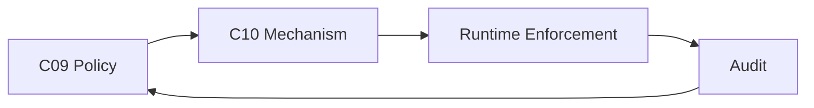
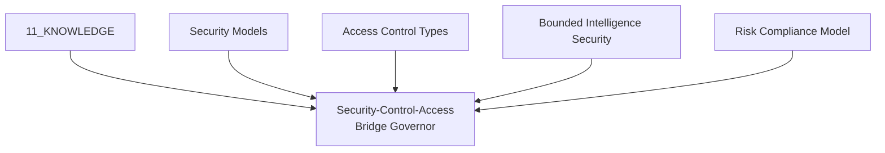
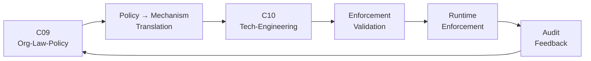
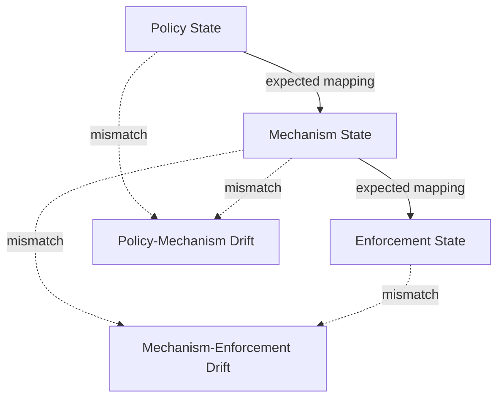
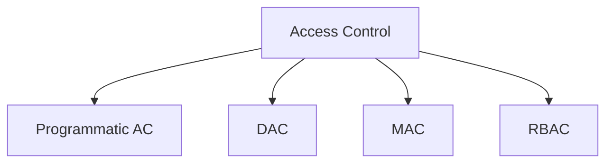
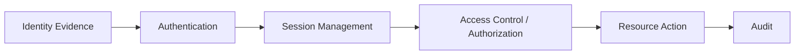

# AMOS SECURITY CONTROL ACCESS BRIDGE GOVERNOR


Below is the **full source-grounded expansion**. I preserve the supplied source metadata and terminology, while keeping derived architecture, equations, state machines, Obsidian augmentation, and governance rules explicitly separated from source canon.

One source-level structural conflict must remain unresolved: `parent_skill: amos-security-safety-master` naturally encodes this governor as subordinate to that master, while `RSCF-RELATIONS` says `PARENT_OF: amos-security-safety-master`. Those directions are not equivalent, so the relation remains **COMPETING / UNKNOWN-GAP** pending authoritative lineage evidence.

---

## 0. Normalized Source Frontmatter — SOURCE


---

# 1. Proposed Obsidian Augmentation — DERIVED / PROPOSED

> [!warning] Metadata Boundary
> Everything in this block is **DERIVED / PROPOSED vault augmentation**. It is not represented as part of the supplied source frontmatter.

```yaml
aliases:
  - AMOS Security-Control-Access Bridge Governor
  - Security Control Access Bridge Governor
  - SCA Bridge Governor
  - AMOS SCA Governor

derived_tags:
  - amos
  - amos_os
  - amos_corpus
  - amos_knowledge
  - 11_knowledge
  - cross_domain
  - security
  - security_governance
  - security_bridge
  - access_control
  - access_governance
  - policy_governance
  - enforcement_governance
  - runtime_enforcement
  - policy_to_enforcement
  - policy_to_mechanism
  - mechanism_to_enforcement
  - pipeline_governance
  - compliance
  - compliance_governance
  - risk
  - risk_compliance
  - audit
  - audit_trail
  - provenance
  - provenance_trace
  - pipeline_provenance
  - evidence_chain
  - drift_detection
  - layer_drift
  - evidence_drift
  - provenance_freshness
  - scope_firewall
  - policy_firewall
  - enforcement_validation
  - mechanism_validation
  - fail_closed
  - anti_fabrication
  - anti_regression
  - proof_capsule
  - competing_hypotheses
  - gap_visible
  - rscf
  - rscf_skill
  - rscf_relations
  - tensor_composition
  - cross_domain_tensor
  - c09
  - c10
  - runtime
  - org_law_policy
  - tech_engineering
  - programmatic_access_control
  - dac
  - mac
  - rbac
  - vertical_access_control
  - horizontal_access_control
  - context_dependent_access_control
  - cors
  - dom_security
  - authentication
  - session_management
  - bounded_intelligence_security
  - bis
  - canon/security
  - canon/access-control
  - canon/pipeline-governance
  - canon/provenance
  - canon/cross-domain

proposed_framework_links:
  - "AMOS_SECURITY_SAFETY_MASTER"
  - ""
  - ""
  - ""

epistemic_boundary:
  source_status: SOURCE_CLAIM
  source_claim_ceiling: 0.90
  production_ready_independently_verified: false

raw_source_policy: DO_NOT_LOAD_UNLESS_REQUIRED
```

---

# 2. Canonical Artifact

# AMOS Security-Control-Access Bridge Governor

> [!abstract] RSCF-NODE
> **RSCF-NODE** · `skill` · `cross-domain` · C09 → C10 → Runtime
>
> **Origin architect and steward:** Trang Phan
> **Parent skill:** `amos-security-safety-master`
> **Domain:** C09 Org-Law-Policy → C10 Tech-Engineering → Runtime Enforcement
> **Epistemic class:** `SOURCE_CLAIM`
> **Claim ceiling:** `0.90`
> **Declared status:** `PRODUCTION_READY` — source states all 10 QA gates pass.

---

# 3. Canonical Status Receipt

The source defines the **AMOS Security-Control-Access Bridge Governor** as a cross-domain governance skill connecting three otherwise separated security layers:

```text
C09 Policy
    ↓
Policy → Mechanism Translation
    ↓
C10 Mechanism
    ↓
Mechanism → Enforcement Validation
    ↓
Runtime Enforcement
    ↓
Audit Feedback
    ↓
C09 Policy
```

The central architectural objective is therefore not merely access control.

It is **policy-to-enforcement continuity**.

Source-defined pipeline:

```text
C09 Policy
→ translate to mechanism
→ C10 Mechanism
→ validate enforcement
→ Runtime Enforcement
→ audit feedback
→ C09 Policy
```

The source further establishes ten capabilities and ten validation gates governing this pipeline.

---

# 4. Epistemic Boundary

The strongest safe interpretation is:

```text
SOURCE DEFINES
    ↓
policy/mechanism/runtime bridge architecture
    ↓
capabilities
    ↓
validation gates
    ↓
named access-control knowledge
    ↓
risk/compliance knowledge
```

But the supplied artifact does **not independently demonstrate**:

```text
actual runtime deployment
actual enforcement correctness
actual compliance
formal security proof
absence of vulnerabilities
absence of privilege escalation
completeness of audit logs
correctness of every policy translation
production infrastructure status
```

Therefore:

```yaml
epistemic_receipt:
  artifact_definition: SOURCE_GROUNDED
  architecture: SOURCE_CLAIM
  production_ready: SOURCE_CLAIM
  qa_pass: SOURCE_CLAIM
  runtime_security: NOT_INDEPENDENTLY_VERIFIED
  formal_security_proof: NOT_SUPPLIED
```

---

# 5. Core Security Boundary

```text
POLICY
!=
MECHANISM

MECHANISM
!=
ENFORCEMENT

ENFORCEMENT
!=
AUDIT

AUDIT
!=
PROOF OF SECURITY

POLICY EXISTENCE
!=
POLICY COMPLIANCE

CONTROL DEFINITION
!=
CONTROL IMPLEMENTATION

CONTROL IMPLEMENTATION
!=
CORRECT ENFORCEMENT

ACCESS DENIAL
!=
SYSTEM SECURITY

AUTHENTICATION
!=
AUTHORIZATION

AUTHORIZATION
!=
SESSION INTEGRITY

LOG PRESENCE
!=
LOG COMPLETENESS

AUDIT TRAIL
!=
INDEPENDENT VERIFICATION

COMPLIANCE
!=
SECURITY

SECURITY
!=
ZERO RISK

PRODUCTION_READY
!=
INDEPENDENT RUNTIME VERIFICATION
```

---

# 6. Problem Definition

The `_00_Cosmo brain` exploration identified:

> “Security and Control and Access: Security policies, access control mechanisms, and runtime enforcement are separate layers without unified policy-to-enforcement pipelines.”

The artifact therefore addresses a **cross-layer continuity problem**.

Conceptually:

```text
POLICY LAYER
      │
      │ translation gap
      ▼
MECHANISM LAYER
      │
      │ enforcement gap
      ▼
RUNTIME
      │
      │ observability / audit gap
      ▼
POLICY FEEDBACK
```

The governor is designed to close those gaps without collapsing the distinctions between the layers.

---

# 7. Three-Layer Architecture

The source identifies three principal planes.

## Layer A — C09 Org-Law-Policy

Represents:

```text
policy
organizational rules
legal/regulatory constraints
governance requirements
```

## Layer B — C10 Tech-Engineering

Represents:

```text
technical mechanism
access-control implementation
engineering control
```

## Layer C — Runtime Enforcement

Represents:

```text
actual enforcement state
runtime behavior
audit-producing execution
```

These descriptions are normalized from the supplied architecture; exact C09/C10 schemas are not supplied here.

---

# 8. Pipeline Model

Source:

```text
C09 Policy
    ↓
translate to mechanism
    ↓
C10 Mechanism
    ↓
validate enforcement
    ↓
Runtime Enforcement
    ↓
audit feedback
    ↓
C09 Policy
```

Derived structural notation:

$$
P \rightarrow M \rightarrow E \rightarrow A \rightarrow P'
$$

where:

- \(P\) = C09 policy state
- \(M\) = C10 mechanism state
- \(E\) = runtime enforcement state
- \(A\) = audit feedback
- \(P'\) = policy after feedback/review

This equation is **DERIVED**, not a source-defined formal equation.

---

# 9. Security Continuity Principle

The pipeline implies a source-grounded structural requirement:

```text
POLICY
must remain traceable into
MECHANISM

MECHANISM
must remain traceable into
ENFORCEMENT

ENFORCEMENT
must remain traceable into
AUDIT
```

The inverse audit route should preserve sufficient lineage to determine what policy authorized an enforcement action.

---

# 10. Capability Registry

The source explicitly defines ten capabilities.

|  # | Capability                                  | Source Role                            |
| -: | ------------------------------------------- | -------------------------------------- |
|  1 | `sca_bridge.translate_policy_to_mechanism`  | C09 policy → C10 mechanism             |
|  2 | `sca_bridge.validate_mechanism_enforcement` | mechanism → runtime validation         |
|  3 | `sca_bridge.govern_pipeline`                | full pipeline governance               |
|  4 | `sca_bridge.detect_layer_drift`             | policy/mechanism/enforcement drift     |
|  5 | `sca_bridge.audit_pipeline`                 | full compliance audit                  |
|  6 | `sca_bridge.trace_pipeline_provenance`      | C09 → C10 → runtime → audit provenance |
|  7 | `sca_bridge.assess_risk_compliance`         | pipeline risk/compliance assessment    |
|  8 | `sca_bridge.manage_lifecycle`               | classify/validate/trace/assess/detect  |
|  9 | `sca_bridge.detect_drift`                   | evidence/provenance freshness drift    |
| 10 | `sca_bridge.validate_outputs`               | domain + epistemic output validation   |

---

# 11. Capability 1 — Policy → Mechanism Translation

```text
sca_bridge.translate_policy_to_mechanism
```

Source purpose:

> Translate C09 policy into C10 access control mechanisms.

This capability bridges normative intent into technical implementation.

Conceptually:

```text
POLICY REQUIREMENT
      ↓
interpret
      ↓
technical constraint
      ↓
access-control mechanism
```

A policy such as:

```text
Only authorized role R may access resource X
```

could structurally require a technical control implementing that restriction.

However, this artifact does not provide an exact translation language or compiler.

---

# 12. Policy Translation Contract — DERIVED

```yaml
policy_translation:
  source_policy:
    identity: REQUIRED
    provenance: REQUIRED
    scope: REQUIRED
    authority: REQUIRED_WHERE_MATERIAL
    version: REQUIRED_WHERE_AVAILABLE

  mechanism:
    target_system: REQUIRED
    control_type: REQUIRED
    implementation_binding: REQUIRED

  validation:
    semantic_match: REQUIRED
    scope_match: REQUIRED
    no_policy_strengthening: REQUIRED
    no_policy_weakening: REQUIRED
```

This schema is derived implementation scaffolding.

---

# 13. Translation Is Not Mechanical Equivalence

A policy statement and an engineering mechanism exist at different semantic levels.

Therefore:

```text
POLICY TEXT
!=
ACCESS CONTROL RULE
```

and:

```text
LEGAL REQUIREMENT
!=
DATABASE ACL
```

A translation must establish correspondence.

It cannot simply assume it.

---

# 14. Capability 2 — Validate Mechanism Enforcement

```text
sca_bridge.validate_mechanism_enforcement
```

Source purpose:

> Validate C10 mechanism is correctly enforced at runtime.

This creates the second major bridge:

```text
DECLARED MECHANISM
      ↓
runtime validation
      ↓
OBSERVED ENFORCEMENT
```

The distinction is critical because configured controls may fail, be bypassed, be stale, or differ from runtime state.

---

# 15. Enforcement Validation Boundary

```text
MECHANISM CONFIGURED
!=
MECHANISM ENFORCED
```

Likewise:

```text
MECHANISM ENFORCED ONCE
!=
MECHANISM ALWAYS ENFORCED
```

and:

```text
EXPECTED DENIAL
!=
PROVEN SYSTEM-WIDE DENIAL
```

Validation inherits environment, version, scope, and temporal boundaries.

---

# 16. Capability 3 — Govern Pipeline

```text
sca_bridge.govern_pipeline
```

Source-defined states:

```text
PIPELINE_PERMITTED
PIPELINE_BLOCKED
PIPELINE_CONDITIONAL
```

These are the primary governance outputs.

---

# 17. Pipeline State Machine — DERIVED

```text
                 ┌────────────────────┐
                 │ PIPELINE REQUEST   │
                 └─────────┬──────────┘
                           │
                           ▼
                 ┌────────────────────┐
                 │ POLICY VALIDATION  │
                 └─────────┬──────────┘
                           │
                           ▼
                 ┌────────────────────┐
                 │ POLICY → MECHANISM │
                 │ MATCH              │
                 └─────────┬──────────┘
                           │
                           ▼
                 ┌────────────────────┐
                 │ MECHANISM →        │
                 │ ENFORCEMENT MATCH  │
                 └─────────┬──────────┘
                           │
                           ▼
                 ┌────────────────────┐
                 │ PROVENANCE / AUDIT │
                 └─────────┬──────────┘
                           │
               ┌───────────┼───────────┐
               ▼           ▼           ▼
           PERMITTED   CONDITIONAL   BLOCKED
```

The output states are source-defined.

The exact decision sequence is derived.

---

# 18. Capability 4 — Detect Layer Drift

```text
sca_bridge.detect_layer_drift
```

Source:

> Detect drift between policy, mechanism, and enforcement layers.

This identifies three primary drift edges:

```text
Policy ↔ Mechanism
Mechanism ↔ Runtime
Policy ↔ Runtime
```

---

# 19. Policy Drift

Policy drift occurs when the governing policy changes but technical controls do not remain aligned.

Conceptually:

```text
Policy_v2
    │
    └── Mechanism_v1
```

Potential state:

```text
LAYER_DRIFT
```

The exact detection algorithm is not supplied.

---

# 20. Mechanism Drift

Mechanism drift may occur when implementation changes while policy remains static.

```text
Policy_v1
    │
Mechanism_v2
```

The mechanism may become:

- broader;
- narrower;
- differently scoped;
- semantically incompatible.

No such specific drift classes are source-defined; they are derived examples.

---

# 21. Enforcement Drift

Runtime behavior may diverge from the intended mechanism.

```text
Mechanism M
      ↓
expected E1

Runtime
      ↓
observed E2
```

If:

$$
E_1 \neq E_2
$$

then an enforcement mismatch exists.

This is a derived formalization.

---

# 22. Capability 5 — Audit Pipeline

```text
sca_bridge.audit_pipeline
```

Source:

> Audit full pipeline for compliance.

Audit scope therefore spans:

```text
C09
 ↓
C10
 ↓
Runtime
 ↓
Audit trail
```

rather than checking only one technical control.

---

# 23. Audit Boundary

An audit can support claims about tested evidence.

It does not automatically prove:

```text
no unknown vulnerabilities
no future failures
complete security
universal compliance
absence of hidden bypasses
```

Therefore:

```text
AUDIT PASS
!=
SECURITY PROOF
```

---

# 24. Capability 6 — Trace Pipeline Provenance

```text
sca_bridge.trace_pipeline_provenance
```

Source topology:

```text
C09 Policy
    ↓
C10 Mechanism
    ↓
Runtime
    ↓
Audit
```

This is a first-class provenance chain.

---

# 25. Provenance Graph



---

# 26. Provenance Receipt — DERIVED

```yaml
pipeline_provenance:
  policy:
    id: REQUIRED
    version: REQUIRED_WHERE_AVAILABLE
    provenance: REQUIRED

  mechanism:
    id: REQUIRED
    version: REQUIRED_WHERE_AVAILABLE
    policy_parent: REQUIRED

  runtime:
    environment: REQUIRED
    mechanism_parent: REQUIRED
    observation_time: REQUIRED

  audit:
    evidence: REQUIRED
    runtime_parent: REQUIRED
```

---

# 27. Provenance Independence Firewall

A single policy may generate multiple controls.

Those controls are not independent evidence that the policy is correct.

Similarly:

```text
ONE RUNTIME EVENT
    ↓
many logs
```

does not create many independent observations.

Therefore:

```text
LOG COUNT
!=
INDEPENDENT EVIDENCE COUNT
```

---

# 28. Capability 7 — Risk and Compliance

```text
sca_bridge.assess_risk_compliance
```

Source:

> Assess risk and compliance across the pipeline.

The supplied risk-compliance knowledge includes:

- sector profiles;
- regulation/compliance;
- market structure;
- risk/crisis;
- technology/data;
- workforce/skills;
- ESG;
- operations.

---

# 29. Risk ≠ Compliance

The artifact connects them but does not collapse them.

```text
COMPLIANT
!=
LOW RISK

NONCOMPLIANT
!=
EXPLOITED

SECURE
!=
COMPLIANT

COMPLIANCE
!=
SECURITY
```

A control can satisfy a regulatory requirement yet remain vulnerable to threats outside that requirement.

---

# 30. Capability 8 — Lifecycle

```text
sca_bridge.manage_lifecycle
```

Source lifecycle verbs:

```text
classify
validate
trace
assess
detect
```

A derived lifecycle is:

```text
INGEST
  ↓
CLASSIFY
  ↓
TRACE
  ↓
VALIDATE
  ↓
ASSESS
  ↓
DETECT DRIFT
  ↓
GOVERN
  ↓
AUDIT
  ↓
REVALIDATE
```

The exact ordering is not source-defined.

---

# 31. Capability 9 — Evidence Drift

```text
sca_bridge.detect_drift
```

Source:

> Detect drift in evidence chains and provenance freshness.

This must remain distinct from:

```text
sca_bridge.detect_layer_drift
```

Therefore:

```text
LAYER DRIFT
!=
EVIDENCE DRIFT
```

---

# 32. Two Drift Systems

## Layer Drift

```text
Policy ↔ Mechanism ↔ Enforcement
```

## Evidence Drift

```text
Evidence_v1
    ↓ time
Evidence becomes stale / superseded / invalid
```

Both can occur independently.

---

# 33. Capability 10 — Validate Outputs

```text
sca_bridge.validate_outputs
```

Source:

> Validate outputs against domain constraints and epistemic class.

This creates a final epistemic firewall.

A technically plausible output must still satisfy:

```text
domain
scope
provenance
epistemic class
```

---

# 34. Ten Validation Gates

| Gate | Source Requirement                           |
| ---- | -------------------------------------------- |
| G1   | No contradictions across C09/C10/Runtime     |
| G2   | All claims labeled with epistemic class      |
| G3   | Provenance recorded for every element        |
| G4   | No claim beyond scope                        |
| G5   | Pipeline architecture tagged as `AMOS_MODEL` |
| G6   | Failure mode handled                         |
| G7   | Policy-mechanism match                       |
| G8   | Mechanism-enforcement match                  |
| G9   | No layer drift                               |
| G10  | Audit trail complete                         |

---

# 35. G1 — Cross-Layer Contradictions

```text
No contradictions across C09/C10/Runtime
```

This does not require contradictory evidence to be deleted.

Correct handling can instead be:

```text
CONTRADICTION DETECTED
       ↓
COMPETING
       ↓
BLOCK / CONDITION
       ↓
DISCRIMINATING TEST
```

---

# 36. G2 — Epistemic Class

Every claim must retain its epistemic type.

For example:

```text
policy statement
mechanism declaration
runtime observation
audit conclusion
risk model
```

must not automatically inherit the same epistemic class.

---

# 37. G3 — Provenance Everywhere

Source:

```text
Provenance recorded for every element.
```

The phrase `every element` is strong.

At minimum, the pipeline requires lineage across:

```text
POLICY
MECHANISM
ENFORCEMENT
AUDIT
```

The exact provenance schema is not supplied.

---

# 38. G4 — Scope Firewall

```text
No claim beyond scope.
```

Examples of forbidden scope leakage:

```text
tested one role
→ claim all roles secure

tested staging
→ claim production secure

tested one endpoint
→ claim whole service secure

tested one time
→ claim permanent enforcement
```

These are derived examples.

---

# 39. G5 — Pipeline Is AMOS_MODEL

The source explicitly requires:

```text
Pipeline architecture tagged as AMOS_MODEL.
```

Therefore:

```text
PIPELINE ARCHITECTURE
!=
EMPIRICALLY PROVEN UNIVERSAL SECURITY ARCHITECTURE
```

The pipeline is a corpus-defined model.

---

# 40. G6 — Failure Mode

Source:

```text
Failure mode handled.
```

However, exact failure behavior is absent.

Unknowns include:

```text
fail open?
fail closed?
rollback?
quarantine?
deny?
alert?
degrade?
require human approval?
```

Do not invent a single canonical mechanism.

---

# 41. G7 — Policy-Mechanism Match

Source:

> every mechanism has policy.

This creates a traceability invariant:

$$
\forall M,\ \exists P:\ AuthorizedBy(M,P)
$$

This is a faithful formalization of G7.

---

# 42. Orphan Mechanism

A mechanism with no policy parent is structurally invalid under G7.

```text
MECHANISM
    │
    └── no policy provenance

=> G7 FAIL
```

This can be called an **orphan mechanism** as a derived label.

---

# 43. G8 — Mechanism-Enforcement Match

Source:

> every enforcement matches mechanism.

Formalized:

$$
\forall E,\ \exists M:\ ConformsTo(E,M)
$$

Again, this is a structural formalization, not source syntax.

---

# 44. Orphan Enforcement

Runtime enforcement without a traceable mechanism violates G8.

```text
RUNTIME ACTION
     │
     └── no mechanism

=> G8 FAIL
```

---

# 45. Full Traceability Invariant

Combining G7 and G8 gives:

$$
E \rightarrow M \rightarrow P
$$

for each governed enforcement action, assuming the source means each runtime enforcement element must map through the full chain.

This combined formulation is **DERIVED**.

---

# 46. G9 — No Layer Drift

The expected correspondence is:

```text
Policy intent
≈
Mechanism semantics
≈
Runtime enforcement
```

where `≈` means governance-compatible correspondence, not mathematical identity.

---

# 47. G10 — Complete Audit Trail

Source:

```text
Audit trail complete.
```

The source does not define completeness criteria.

Potential dimensions requiring later canonical definition include:

- actor;
- action;
- resource;
- policy;
- mechanism;
- decision;
- time;
- environment;
- result;
- provenance.

These are proposed dimensions, not supplied source fields.

---

# 48. Access-Control Models

The enriched source records four formal access-control models.

## Programmatic Access Control

Source:

> Matrix of user privileges in DB, granular.

Normalized:

```text
subjects × privileges/resources
```

The exact matrix schema is not supplied.

---

# 49. DAC

**Discretionary Access Control**

Source description:

> Owner-delegated permissions, complex to manage.

Key source property:

```text
owner delegation
```

No specific DAC standard or implementation is named.

---

# 50. MAC

**Mandatory Access Control**

Source:

> Centrally controlled, military clearance-based.

The source invokes a clearance-oriented model.

Do not infer that all MAC implementations are military systems.

---

# 51. RBAC

**Role-Based Access Control**

Source:

> Role-based, enhanced management, easy revoke.

Conceptual structure:

```text
USER
  ↓
ROLE
  ↓
PERMISSION
  ↓
RESOURCE
```

This diagram is a standard structural normalization of the supplied role-based concept.

---

# 52. Access-Control Model Comparison

| Model           | Source Control Basis | Source Characteristic           |
| --------------- | -------------------- | ------------------------------- |
| Programmatic AC | privilege matrix     | granular                        |
| DAC             | owner                | delegated permissions           |
| MAC             | central authority    | clearance-based                 |
| RBAC            | role                 | enhanced management/easy revoke |

No source claim says one model is universally superior.

---

# 53. Model Selection Firewall

```text
RBAC
!=
always best

MAC
!=
always strongest

DAC
!=
always insecure

PROGRAMMATIC AC
!=
automatically correct
```

Suitability depends on scope, system, threat model, governance requirements, and implementation.

---

# 54. Access-Control Types

The source additionally lists:

```text
Vertical
Horizontal
Context-dependent
CORS
DOM-based
```

These are not all the same type of abstraction.

That distinction should be preserved.

---

# 55. Vertical Access Control

Source:

> privilege levels.

Conceptually:

```text
LOW PRIVILEGE
      ↓ forbidden escalation
HIGH PRIVILEGE
```

A vertical access-control failure may permit privilege escalation.

---

# 56. Horizontal Access Control

Source:

> same level, different resources.

Conceptually:

```text
User A → Resource A
User B → Resource B
```

A horizontal failure could permit:

```text
User A → Resource B
```

without elevation to a higher privilege class.

---

# 57. Context-Dependent Access

Source explicitly includes:

```text
Context-dependent
```

This indicates access decisions can depend on contextual conditions.

The source does not enumerate the context vector.

Do not invent mandatory fields such as location, device, time, or risk score as canon.

---

# 58. CORS

CORS is listed among access-control types in the source corpus.

Preserve that corpus classification, but note the abstraction distinction:

```text
CORS
```

is not automatically semantically identical to user/role authorization.

Its exact relationship to the bridge requires the underlying source.

---

# 59. DOM-Based

`DOM-based` is also source-listed.

Again:

```text
DOM-based control
!=
RBAC
```

and:

```text
browser/client control
!=
server-side authorization
```

unless explicitly bound by the implementation.

---

# 60. Bounded Intelligence Security — BIS™

Source:

> Security models must be formally defined independent of implementation.

This is a major architectural principle.

Normalized:

```text
SECURITY MODEL
      ↓
formal definition
      ↓
IMPLEMENTATION
```

rather than:

```text
IMPLEMENTATION
      ↓
retroactively defines policy
```

---

# 61. Model / Implementation Separation

Derived invariant:

$$
SecurityModel \neq Implementation
$$

Implementation should instantiate the model.

It should not silently redefine it.

---

# 62. Authentication Dependency

Source:

> Access control depends on authentication and session management.

Therefore access-control reasoning cannot safely treat authorization in isolation.

Conceptual dependency:

```text
AUTHENTICATION
      ↓
SESSION
      ↓
ACCESS CONTROL
      ↓
RESOURCE ACTION
```

---

# 63. Authentication ≠ Authorization

```text
WHO ARE YOU?
!=
WHAT MAY YOU DO?
```

Authentication concerns identity establishment.

Authorization concerns permitted action.

The source's dependency statement does not collapse these concepts.

---

# 64. Session Management

A valid authentication event does not establish permanent authorization integrity.

Conceptually:

```text
AUTH EVENT
    ↓
SESSION
    ↓
SUBSEQUENT REQUESTS
```

Session state therefore becomes a load-bearing dependency in runtime enforcement.

The detailed session model is not supplied.

---

# 65. Risk Compliance Model

Source dimensions:

```text
Sector profiles
Regulation / compliance
Market structure
Risk / crisis
Technology / data
Workforce / skills
ESG
Operations
```

These form a broad risk/compliance context model.

---

# 66. Risk Context Vector — DERIVED

A derived representation is:

$$
R =
\langle
S,
C,
M,
K,
T,
W,
E,
O
\rangle
$$

where:

- \(S\) = sector profile
- \(C\) = regulation/compliance
- \(M\) = market structure
- \(K\) = risk/crisis
- \(T\) = technology/data
- \(W\) = workforce/skills
- \(E\) = ESG
- \(O\) = operations

This vector is **DERIVED** from the source list.

---

# 67. Risk Model Boundary

The source does not provide:

```text
risk weights
risk aggregation formula
probability model
loss function
thresholds
risk appetite
sector calibration
```

Therefore no numerical risk score should be invented.

---

# 68. Policy Object — PROPOSED

```yaml
policy:
  policy_id: REQUIRED
  source: REQUIRED
  version: REQUIRED_WHERE_AVAILABLE
  scope: REQUIRED
  authority: REQUIRED
  requirements: REQUIRED
  provenance: REQUIRED
```

Not source schema.

---

# 69. Mechanism Object — PROPOSED

```yaml
mechanism:
  mechanism_id: REQUIRED
  policy_parent: REQUIRED
  mechanism_type: REQUIRED
  target_system: REQUIRED
  version: REQUIRED_WHERE_AVAILABLE
  implementation_state: REQUIRED
```

---

# 70. Runtime Enforcement Object — PROPOSED

```yaml
enforcement:
  event_id: REQUIRED
  mechanism_parent: REQUIRED
  runtime_environment: REQUIRED
  subject: REQUIRED_WHERE_APPLICABLE
  action: REQUIRED
  resource: REQUIRED_WHERE_APPLICABLE
  result: REQUIRED
  timestamp: REQUIRED
```

---

# 71. Audit Object — PROPOSED

```yaml
audit:
  audit_id: REQUIRED
  enforcement_parent: REQUIRED
  mechanism_parent: REQUIRED
  policy_parent: REQUIRED
  evidence: REQUIRED
  findings: REQUIRED
  timestamp: REQUIRED
```

---

# 72. Pipeline Object — DERIVED

```yaml
security_pipeline:
  policy: P
  mechanism: M
  enforcement: E
  audit: A

  lineage:
    - P_to_M
    - M_to_E
    - E_to_A
    - A_to_P_feedback
```

---

# 73. Pipeline Proof Obligation

A consequential claim that:

```text
Policy P is enforced
```

requires more than the existence of P.

At minimum, it requires evidence supporting:

```text
P exists
P maps to M
M is deployed
runtime behavior corresponds to M
audit evidence is valid
scope is appropriate
```

This is derived from the pipeline model.

---

# 74. Weakest-Premise Ceiling

Derived AMOS rule:

$$
Confidence(PipelineClaim)
\leq
\min(
C_P,
C_{P\rightarrow M},
C_M,
C_{M\rightarrow E},
C_E,
C_A,
0.90
)
$$

where the `0.90` cap comes from the supplied source claim ceiling.

The equation itself is derived.

---

# 75. Policy-to-Mechanism Drift

```text
P₀ → M₀
```

then policy changes:

```text
P₁
```

while mechanism remains:

```text
M₀
```

Candidate state:

```text
POLICY_MECHANISM_DRIFT
```

This label is derived.

---

# 76. Mechanism-to-Enforcement Drift

Mechanism says:

```text
DENY X
```

runtime permits:

```text
ALLOW X
```

Then:

```text
MECHANISM_ENFORCEMENT_MISMATCH
```

The source establishes the concept of layer drift; exact labels are proposed.

---

# 77. Audit Feedback Drift

Because the source closes the pipeline with:

```text
audit feedback → C09 Policy
```

feedback itself can become stale or disconnected.

Potential topology:

```text
Runtime_v2
   ↓
Audit_v1
   ↓
Policy decision
```

This is a derived failure class.

---

# 78. Temporal Integrity

Security conclusions are freshness-bounded.

A valid result at \(t_0\) need not remain valid at \(t_1\).

$$
Valid(P,M,E,t_0)
\not\Rightarrow
Valid(P,M,E,t_1)
$$

when dependencies have changed.

---

# 79. Environment Integrity

Similarly:

$$
Valid_{staging}(M)
\not\Rightarrow
Valid_{production}(M)
$$

unless environment equivalence is independently established.

---

# 80. Scope Integrity

```text
ONE APPLICATION
!=
ALL APPLICATIONS

ONE ROLE
!=
ALL ROLES

ONE RESOURCE
!=
ALL RESOURCES

ONE POLICY
!=
ENTIRE SECURITY PROGRAM
```

This follows G4.

---

# 81. Security Claim Classes

Useful classes inside the pipeline include:

```text
SOURCE_CLAIM
OBSERVATION
DERIVED
MODEL
DECISION
UNKNOWN/GAP
```

The source explicitly requires epistemic labeling but does not enumerate this entire list in the supplied artifact.

Therefore this list is an AMOS governance augmentation.

---

# 82. Example Epistemic Separation

```yaml
policy:
  statement: "Role R may access X"
  class: SOURCE_CLAIM

mechanism:
  statement: "ACL implements Role R restriction"
  class: SOURCE_CLAIM_OR_OBSERVATION_DEPENDING_ON_EVIDENCE

runtime:
  statement: "Request from R was permitted"
  class: OBSERVATION_IF_DIRECTLY_OBSERVED

conclusion:
  statement: "Policy is correctly enforced"
  class: DERIVED
```

---

# 83. Causal Firewall

Suppose an incident occurs after a policy change.

Sequence alone does not prove:

```text
policy change caused incident
```

Likewise:

```text
control deployed
then attacks decrease
```

does not by itself establish causal effectiveness.

Need appropriate causal evidence.

---

# 84. Security Causality Types

Distinguish:

```text
association
correlation
mechanism
enabling condition
necessary condition
sufficient condition
confounding
mediation
feedback
causal effect
```

A security bridge must not silently promote one into another.

---

# 85. Pipeline Governance Receipt — DERIVED

```yaml
PIPELINE_GOVERNANCE_RECEIPT:

  pipeline_id: REQUIRED

  policy:
    id: REQUIRED
    scope: REQUIRED
    provenance: REQUIRED

  mechanism:
    id: REQUIRED
    policy_match: REQUIRED

  enforcement:
    environment: REQUIRED
    mechanism_match: REQUIRED

  audit:
    trail_complete: REQUIRED
    evidence: REQUIRED

  checks:
    contradiction: REQUIRED
    epistemic_class: REQUIRED
    provenance: REQUIRED
    scope: REQUIRED
    model_typing: REQUIRED
    failure_mode: REQUIRED
    policy_mechanism_match: REQUIRED
    mechanism_enforcement_match: REQUIRED
    layer_drift: REQUIRED
    audit_completeness: REQUIRED

  decision:
    - PIPELINE_PERMITTED
    - PIPELINE_CONDITIONAL
    - PIPELINE_BLOCKED
```

---

# 86. Failure Modes

## FM-01 — Orphan Mechanism

```text
Mechanism exists
but
no policy parent
```

Violates G7.

---

## FM-02 — Orphan Enforcement

```text
Runtime enforcement
but
no matching mechanism
```

Violates G8.

---

## FM-03 — Policy Drift

Policy updated; mechanism stale.

Violates G9 if mismatch results.

---

## FM-04 — Runtime Drift

Mechanism valid on paper; runtime differs.

Violates G8/G9.

---

## FM-05 — Provenance Gap

An element cannot be traced to its parent.

Violates G3.

---

## FM-06 — Scope Leakage

Evidence from one environment is generalized beyond its tested scope.

Violates G4.

---

## FM-07 — Epistemic Inflation

A model or source claim becomes presented as verified runtime fact.

Violates G2.

---

## FM-08 — Incomplete Audit

Runtime actions exist without sufficient audit lineage.

Violates G10.

---

## FM-09 — Policy Contradiction

C09 policies conflict and mechanism silently chooses one.

Potential G1 failure.

---

## FM-10 — Mechanism Contradiction

Two controls implement incompatible interpretations of the same policy.

Potential G1/G7 failure.

---

## FM-11 — Authentication Failure

Authorization is evaluated using an invalid identity state.

Relevant because access control depends on authentication.

---

## FM-12 — Session Integrity Failure

Initial authentication is valid, but session state no longer safely represents the authenticated subject.

Relevant because access control depends on session management.

---

# 87. Negative Tests

```yaml
negative_tests:

  - case: mechanism_without_policy
    expected: PIPELINE_BLOCKED

  - case: enforcement_without_mechanism
    expected: PIPELINE_BLOCKED

  - case: policy_scope_unknown
    expected: PIPELINE_CONDITIONAL_OR_BLOCKED

  - case: mechanism_matches_old_policy_only
    expected: LAYER_DRIFT

  - case: runtime_does_not_match_mechanism
    expected: PIPELINE_BLOCKED

  - case: provenance_missing
    expected: G3_FAIL

  - case: claim_without_epistemic_class
    expected: G2_FAIL

  - case: pipeline_architecture_presented_as_universal_empirical_law
    expected: G5_FAIL

  - case: audit_incomplete
    expected: G10_FAIL

  - case: staging_test_generalized_to_production
    expected: G4_FAIL

  - case: multiple_logs_from_same_event_counted_as_independent_confirmation
    expected: PROVENANCE_INDEPENDENCE_FAIL
```

These test cases are derived from source gates.

---

# 88. Positive Tests

```yaml
positive_tests:

  - case:
      policy: current
      mechanism: traceably_derived
      runtime: observed_matching
      audit: complete
      provenance: intact
      scope: compatible
    expected: PIPELINE_PERMITTED

  - case:
      policy: current
      mechanism: valid
      runtime: partially_observed
      missing_evidence: noncritical_but_material
    expected: PIPELINE_CONDITIONAL
```

Derived.

---

# 89. Fail-Closed Principle

The source requires:

```text
Failure mode handled
```

but does not explicitly say every failure must fail closed.

Therefore the stronger rule:

```text
ANY FAILURE → DENY
```

cannot be declared source canon from this artifact alone.

A safer derived governance principle is:

```text
When uncertainty could authorize access beyond established policy,
prefer a reversible restrictive state
unless canonical failure policy says otherwise.
```

---

# 90. Pipeline Decision Matrix — DERIVED

| Policy Match | Mechanism Match | Runtime Match | Audit      | Candidate State                |
| ------------ | --------------- | ------------- | ---------- | ------------------------------ |
| Yes          | Yes             | Yes           | Complete   | `PIPELINE_PERMITTED`           |
| Yes          | Yes             | Partial       | Complete   | `PIPELINE_CONDITIONAL`         |
| Yes          | No              | —             | —          | `PIPELINE_BLOCKED`             |
| No           | —               | —             | —          | `PIPELINE_BLOCKED`             |
| Unknown      | Unknown         | Unknown       | Incomplete | `PIPELINE_CONDITIONAL/BLOCKED` |

The exact decision policy is not supplied, so this remains proposed.

---

# 91. Access-Control Selection Matrix — DERIVED

| Need                                | Candidate Model |
| ----------------------------------- | --------------- |
| granular explicit privilege mapping | Programmatic AC |
| owner-managed delegation            | DAC             |
| centrally mandated clearance        | MAC             |
| role-centered management            | RBAC            |

This is a normalization of source descriptions, not a universal selection algorithm.

---

# 92. Security Pipeline Tensor — DERIVED

A compact cross-domain representation:

$$
T_{SCA}
=
T[
P,
M,
E,
A,
R,
S,
V,
D,
C
]
$$

where:

- \(P\) = policy
- \(M\) = mechanism
- \(E\) = enforcement
- \(A\) = audit
- \(R\) = risk/compliance context
- \(S\) = scope
- \(V\) = provenance
- \(D\) = drift
- \(C\) = epistemic class

This tensor is derived and should not be represented as a supplied formula.

---

# 93. Cross-Domain Tensor Firewall

Because the governor composes with:

```text
amos-cross-domain-tensor-composition-governor
```

cross-domain compatibility must not be assumed.

```text
same field name
!=
same semantics

same policy identifier
!=
same policy version

same user
!=
same authenticated session

same role name
!=
same permission set
```

---

# 94. RSCF H-Level

```yaml
H:
  node:
    AMOS_SECURITY_CONTROL_ACCESS_BRIDGE_GOVERNOR

  purpose:
    >
      Govern continuity from C09 policy through C10 technical
      access-control mechanism to runtime enforcement and
      audit feedback.
```

Derived RSCF representation.

---

# 95. RSCF M-Level

```yaml
M:
  capabilities:
    - translate_policy_to_mechanism
    - validate_mechanism_enforcement
    - govern_pipeline
    - detect_layer_drift
    - audit_pipeline
    - trace_pipeline_provenance
    - assess_risk_compliance
    - manage_lifecycle
    - detect_drift
    - validate_outputs

  validation:
    - G1
    - G2
    - G3
    - G4
    - G5
    - G6
    - G7
    - G8
    - G9
    - G10
```

---

# 96. RSCF L-Level

Load only when decision-relevant:

```yaml
L:
  - exact_policy_text
  - policy_version
  - legal_authority
  - access_control_configuration
  - authentication_state
  - session_state
  - runtime_event
  - runtime_environment
  - audit_record
  - mechanism_version
  - provenance_graph
  - compliance_requirement
  - risk_context
```

---

# 97. Minimal Retrieval Path

```text
BOOTSTRAP
   ↓
H: SCA bridge identity
   ↓
M: relevant capability
   ↓
L: exact policy/mechanism/runtime evidence
   ↓
raw evidence only if outcome-changing
```

This is AMOS retrieval governance, not a claim about literal software internals.

---

# 98. Proof Capsule — Artifact Identity

```yaml
proof_capsule:
  claim:
    >
      The supplied artifact defines an AMOS Security-Control-Access
      Bridge Governor connecting C09 policy, C10 mechanisms,
      runtime enforcement, and audit feedback.

  class: SOURCE_CLAIM

  evidence:
    - supplied Identity section
    - supplied Problem section
    - supplied Pipeline section

  scope:
    AMOS_knowledge

  ceiling:
    0.90
```

---

# 99. Proof Capsule — Ten Capabilities

```yaml
proof_capsule:
  claim:
    "The source defines ten sca_bridge capabilities."

  class: SOURCE_CLAIM

  evidence:
    - explicit Capabilities (10) section

  invalidation:
    - superseding canonical skill version

  ceiling:
    0.90
```

---

# 100. Proof Capsule — Validation Gates

```yaml
proof_capsule:
  claim:
    "The source defines ten validation gates."

  class: SOURCE_CLAIM

  evidence:
    - explicit Validation Gates (10) section

  ceiling:
    0.90
```

---

# 101. Proof Capsule — Production Readiness

```yaml
proof_capsule:
  claim:
    "The source declares the governor PRODUCTION_READY and says all 10 QA gates pass."

  class: SOURCE_CLAIM

  evidence:
    - supplied Identity section

  missing:
    - executed_gate_receipts
    - runtime_test_results
    - deployment_receipt
    - artifact_hashes

  independent_verification:
    NOT_ESTABLISHED
```

---

# 102. Proof Capsule — Access Control Dependency

```yaml
proof_capsule:
  claim:
    "The supplied BIS source states that access control depends on authentication and session management."

  class: SOURCE_CLAIM

  evidence:
    - Bounded Intelligence Security section

  scope:
    supplied_AMOS_security_knowledge

  empirical_universality:
    NOT_CLAIMED_HERE
```

---

# 103. Parent Relation Conflict

Source frontmatter:

```yaml
parent_skill: amos-security-safety-master
```

This normally implies:

```text
SCA Governor
    CHILD_OF
Security Safety Master
```

But source RSCF relations say:

```text
PARENT_OF:
amos-security-safety-master
```

which implies the reverse.

Therefore:

```yaml
relation_conflict:
  target: amos-security-safety-master

  evidence_A:
    field: parent_skill
    implied_relation: CHILD_OF

  evidence_B:
    field: RSCF_RELATIONS
    explicit_relation: PARENT_OF

  status: COMPETING
  resolution: UNKNOWN/GAP
```

No silent normalization is justified.

---

# 104. Competing Hierarchy Hypotheses

### H1 — Frontmatter authoritative

```text
Security Safety Master
        ↓
SCA Bridge Governor
```

### H2 — RSCF relation authoritative

```text
SCA Bridge Governor
        ↓
Security Safety Master
```

### H3 — `PARENT_OF` has a nonstandard semantic meaning

Possible, but not established.

### H4 — Metadata defect/version drift

Also possible.

Current state:

```text
COMPETING
```

---

# 105. Artifact Binding

Source specifies a 1:1:1 binding.

## Skill

```text
.devin/skills/amos-security-control-access-bridge-governor/SKILL.md
```

## Agent

```text
.devin/agents/amos-security-control-access-bridge-governor-agent.json
```

## Workflow

```text
.devin/workflows/amos-security-control-access-bridge-governor-workflow.md
```

## Vault Reference

```text
.devin/skills/.../references/vault_domain_knowledge.md
```

---

# 106. Artifact Binding Boundary

The artifact tells us these paths are part of the declared architecture.

It does not independently establish:

```text
files exist now
versions match
hashes match
agent implements every capability
workflow invokes every gate
runtime deployment uses this exact version
```

Those require artifact inspection.

---

# 107. RSCF Relations — SOURCE

```yaml
RSCF_RELATIONS:

  PARENT_OF:
    - amos-security-safety-master

  COMPOSES_WITH:
    - amos-cross-domain-tensor-composition-governor

  BRIDGES:
    - C09 Org-Law-Policy
    - C10 Tech-Engineering
    - Runtime Enforcement

  INDEXED_BY:
    - 11_KNOWLEDGE_MOC
```

---

# 108. RSCF Relations — NORMALIZED WITH CONFLICT

```yaml
relations:

  parent_skill:
    target: amos-security-safety-master
    source: frontmatter
    implied_relation: CHILD_OF

  parent_of:
    target: amos-security-safety-master
    source: RSCF_RELATIONS
    relation: PARENT_OF
    conflict: true

  composes_with:
    target: amos-cross-domain-tensor-composition-governor

  bridges:
    - C09_Org_Law_Policy
    - C10_Tech_Engineering
    - Runtime_Enforcement

  indexed_by:
    - 11_KNOWLEDGE_MOC
```

---

# 109. Security Knowledge Topology



---

# 110. Full Pipeline Topology



---

# 111. Layer Drift Topology



---

# 112. Access-Control Topology



---

# 113. Authentication Dependency Graph



This graph is derived from the source dependency statement.

---

# 114. Policy/Mechanism/Runtime Sensitivity

The smallest premise capable of flipping a pipeline decision can include:

```text
policy version
policy scope
mechanism configuration
mechanism version
runtime environment
authentication state
session state
audit completeness
provenance freshness
```

These should be checked before broad background evidence when decision-relevant.

---

# 115. Adversarial Validation

For consequential security conclusions, challenge the initial conclusion through a genuinely different path.

Example challenge questions:

```text
Does the mechanism really correspond to the policy?

Is there an alternate policy interpretation?

Was the tested mechanism actually deployed?

Did runtime use the same configuration?

Was the identity state valid?

Was the session stale or compromised?

Does the audit record come from the same event?

Are logs independent evidence or duplicate descendants?

Has policy changed since the mechanism was validated?

Is the conclusion being generalized beyond the tested environment?
```

---

# 116. Competing Pipeline Hypotheses

When policy and runtime diverge, do not immediately assume the mechanism is defective.

Possible hypotheses:

```text
H1 Policy translation is wrong.
H2 Mechanism implementation is wrong.
H3 Runtime deployment is stale.
H4 Runtime observation is incomplete.
H5 Audit evidence is stale.
H6 Policy version is stale.
H7 Authentication/session state invalidated expected behavior.
H8 Multiple controls interact.
```

Preserve competing hypotheses until discriminating evidence exists.

---

# 117. Cheapest Discriminating Tests

Prefer tests that isolate the failing edge.

For:

```text
P → M → E
```

check:

1. exact current policy version;
2. exact deployed mechanism version;
3. exact runtime configuration;
4. targeted enforcement observation;
5. audit lineage.

Do not recompute the entire security architecture if one local edge is defective.

---

# 118. Local Failure Recovery

If:

```text
M → E
```

fails while:

```text
P → M
```

remains valid, invalidate only:

```text
M → E
and conclusions depending on it
```

Do not invalidate P merely because runtime enforcement failed.

This follows dependency-local failure recovery.

---

# 119. Example Dependency Graph

```text
P
│
└── M
    │
    └── E
        │
        └── A
```

If `E` fails:

```text
P = potentially still valid
M = potentially still valid as design
M→E = invalid
E = invalid/mismatched
A-dependent enforcement conclusions = invalidated
```

---

# 120. Audit Completeness Unknowns

G10 requires complete audit trail, but the artifact does not define:

```text
event schema
log retention
clock synchronization
tamper resistance
log signing
hashing
storage topology
cross-system correlation
identity linkage
session linkage
policy version linkage
mechanism version linkage
```

These remain gaps.

---

# 121. Formal Security Unknowns

The source does not provide formal proofs for:

```text
noninterference
least privilege
information flow
privilege escalation impossibility
confidentiality
integrity
availability
session safety
policy consistency
mechanism completeness
runtime completeness
```

Do not infer them from `PRODUCTION_READY`.

---

# 122. Compliance Unknowns

No particular regulatory framework is named in the supplied artifact.

Therefore do not silently map this governor to:

```text
ISO 27001
SOC 2
NIST
GDPR
HIPAA
PCI DSS
Vietnam cybersecurity law
```

without explicit evidence.

The source only establishes a generic regulation/compliance dimension.

---

# 123. Security vs Legal Governance

Because C09 includes Org-Law-Policy:

```text
SECURITY POLICY
!=
LAW

INTERNAL POLICY
!=
REGULATION

REGULATION
!=
TECHNICAL CONTROL

TECHNICAL CONTROL
!=
LEGAL COMPLIANCE
```

Each mapping requires evidence.

---

# 124. Pipeline Model Class

G5 explicitly says:

```text
Pipeline architecture tagged as AMOS_MODEL.
```

Therefore the correct epistemic class for the architecture itself is:

```yaml
pipeline_architecture:
  class: AMOS_MODEL
```

even though the surrounding artifact's own epistemic class is:

```yaml
epistemic_class: SOURCE_CLAIM
```

These are compatible:

```text
SOURCE_CLAIM:
"The corpus defines this architecture"

AMOS_MODEL:
"The architecture being defined is a model"
```

---

# 125. Claim Ceiling

Source:

```yaml
claim_ceiling: 0.9
```

Safe interpretation:

```text
maximum source-declared confidence ceiling
```

Unsafe interpretation:

```text
90% empirical probability that system is secure
```

Therefore:

$$
C_{source}\leq0.90
$$

but empirical calibration remains:

```text
UNKNOWN
```

---

# 126. Production Readiness Receipt

```yaml
production_readiness:
  source_declared: true
  declared_value: PRODUCTION_READY

  source_claim:
    all_10_QA_gates_pass: true

  independently_verified_here:
    runtime: false
    deployment: false
    security: false
    QA_receipts: false
```

---

# 127. Critical Gaps

```yaml
gaps:

  CRITICAL:
    - parent_skill_vs_PARENT_OF_direction
    - executed_QA_gate_receipts
    - exact_runtime_enforcement_binding
    - exact_failure_mode_behavior

  DECISION_RELEVANT:
    - policy_to_mechanism_translation_schema
    - mechanism_to_runtime_validation_method
    - layer_drift_detection_algorithm
    - audit_completeness_definition
    - provenance_schema
    - policy_version_binding
    - mechanism_version_binding
    - runtime_environment_binding
    - authentication_binding
    - session_management_binding
    - risk_scoring_method

  EXPLANATORY:
    - exact_C09_schema
    - exact_C10_schema
    - BIS_formal_model
    - cross_domain_tensor_schema

  COSMETIC:
    - naming_normalization
    - alias_registry
```

---

# 128. Minimum Evidence Required to Close Critical Gaps

The smallest useful evidence set is:

```text
1. canonical amos-security-safety-master lineage definition
2. actual SCA SKILL.md
3. actual SCA agent JSON
4. actual SCA workflow
5. QA gate receipts
6. runtime enforcement binding specification
```

This would discriminate hierarchy, implementation, and QA claims without unnecessary corpus loading.

---

# 129. Anti-Fabrication Contract

This artifact must not be used alone to claim:

1. The system is secure in production.
2. Every policy is correctly implemented.
3. Every mechanism is correctly enforced.
4. Every runtime event is audited.
5. Audit logs are complete.
6. Audit logs are tamper-proof.
7. Audit logs are independent evidence.
8. All policies are legally valid.
9. All mechanisms are compliant.
10. Compliance proves security.
11. Security proves compliance.
12. RBAC is always the best access-control model.
13. MAC is always more secure than RBAC.
14. DAC is inherently insecure.
15. Programmatic access control is formally verified.
16. CORS is equivalent to authorization.
17. DOM controls provide server-side security.
18. Authentication guarantees authorization correctness.
19. Valid authentication guarantees session integrity.
20. Session integrity is implemented.
21. Privilege escalation is impossible.
22. Horizontal access-control vulnerabilities are absent.
23. Vertical access-control vulnerabilities are absent.
24. Context-dependent controls are correctly implemented.
25. The pipeline is a universal security architecture.
26. `AMOS_MODEL` means empirical proof.
27. `PRODUCTION_READY` means independently audited production deployment.
28. `all 10 QA gates pass` means test receipts are embedded.
29. `claim_ceiling: 0.9` means 90% calibrated probability.
30. Risk-compliance dimensions define a complete risk model.
31. The pipeline satisfies a named regulatory framework.
32. C09 policies are equivalent to law.
33. C10 mechanisms guarantee runtime behavior.
34. Runtime observation proves permanent enforcement.
35. One successful test generalizes across environments.
36. Multiple logs prove independent confirmation.
37. A policy-mechanism mapping proves causal security effectiveness.
38. No contradiction means security has been proven.
39. Missing evidence may be treated as a pass.
40. The hierarchy conflict can be silently repaired.

---

# 130. Anti-Regression Contract

```yaml
anti_regression:

  preserve:
    - C09_TO_C10_TO_RUNTIME_PIPELINE
    - AUDIT_FEEDBACK_LOOP
    - TEN_CAPABILITIES
    - TEN_VALIDATION_GATES
    - POLICY_MECHANISM_MATCH
    - MECHANISM_ENFORCEMENT_MATCH
    - LAYER_DRIFT_DETECTION
    - EVIDENCE_DRIFT_DETECTION
    - PIPELINE_PROVENANCE
    - EPISTEMIC_CLASSIFICATION
    - SCOPE_FIREWALL
    - AMOS_MODEL_PIPELINE_CLASS
    - AUDIT_TRAIL_REQUIREMENT
    - CLAIM_CEILING_0_90
    - AUTHENTICATION_DEPENDENCY
    - SESSION_MANAGEMENT_DEPENDENCY

  prohibit:
    - SILENT_SCOPE_EXPANSION
    - SILENT_EPISTEMIC_PROMOTION
    - SILENT_POLICY_TRANSLATION
    - SILENT_MECHANISM_SUBSTITUTION
    - SILENT_RUNTIME_GENERALIZATION
    - SILENT_PROVENANCE_LOSS
    - SILENT_DRIFT_SUPPRESSION
    - SILENT_PARENT_RELATION_REPAIR
```

---

# 131. Invalidation Conditions

Revalidate conclusions if:

```yaml
invalidation_conditions:
  - C09_POLICY_UPDATED
  - C10_MECHANISM_UPDATED
  - RUNTIME_CONFIGURATION_UPDATED
  - AUTHENTICATION_SYSTEM_UPDATED
  - SESSION_SYSTEM_UPDATED
  - ACCESS_CONTROL_MODEL_UPDATED
  - AUDIT_SYSTEM_UPDATED
  - COMPLIANCE_REQUIREMENT_UPDATED
  - RISK_PROFILE_UPDATED
  - SECURITY_SAFETY_MASTER_UPDATED
  - SCA_SKILL_UPDATED
  - SCA_AGENT_UPDATED
  - SCA_WORKFLOW_UPDATED
  - PROVENANCE_CHAIN_BROKEN
  - EVIDENCE_FRESHNESS_EXPIRED
```

---

# 132. Canonical RSCF Node — DERIVED NORMALIZATION

```yaml
RSCF-NODE:

  node_id: amos_security_control_access_bridge_governor

  node_type: skill

  type: security

  source: 11_KNOWLEDGE

  origin_architect: Trang Phan

  domain:
    class: cross-domain
    bridge:
      - C09_Org_Law_Policy
      - C10_Tech_Engineering
      - Runtime_Enforcement

  epistemic:
    artifact_class: SOURCE_CLAIM
    pipeline_class: AMOS_MODEL
    source_claim_ceiling: 0.90

  capabilities:
    - sca_bridge.translate_policy_to_mechanism
    - sca_bridge.validate_mechanism_enforcement
    - sca_bridge.govern_pipeline
    - sca_bridge.detect_layer_drift
    - sca_bridge.audit_pipeline
    - sca_bridge.trace_pipeline_provenance
    - sca_bridge.assess_risk_compliance
    - sca_bridge.manage_lifecycle
    - sca_bridge.detect_drift
    - sca_bridge.validate_outputs

  governance_states:
    - PIPELINE_PERMITTED
    - PIPELINE_BLOCKED
    - PIPELINE_CONDITIONAL

  validation_gates:
    G1: contradiction_integrity
    G2: epistemic_typing
    G3: provenance
    G4: scope
    G5: model_typing
    G6: failure_handling
    G7: policy_mechanism_match
    G8: mechanism_enforcement_match
    G9: layer_drift
    G10: audit_completeness

  relations:

    parent_skill:
      target: amos-security-safety-master
      implied_relation: CHILD_OF

    source_parent_of:
      target: amos-security-safety-master
      relation: PARENT_OF
      status: COMPETING

    composes_with:
      - amos-cross-domain-tensor-composition-governor

    indexed_by:
      - 11_KNOWLEDGE_MOC
```

---

# 133. Machine-Readable Pipeline — DERIVED

```yaml
SCA_PIPELINE:

  C09:
    object: POLICY

  edge_1:
    capability: sca_bridge.translate_policy_to_mechanism
    from: POLICY
    to: MECHANISM

  C10:
    object: MECHANISM

  edge_2:
    capability: sca_bridge.validate_mechanism_enforcement
    from: MECHANISM
    to: RUNTIME_ENFORCEMENT

  runtime:
    object: ENFORCEMENT

  feedback:
    object: AUDIT
    from: RUNTIME_ENFORCEMENT
    to: C09_POLICY

  governance:
    capability: sca_bridge.govern_pipeline

    outputs:
      - PIPELINE_PERMITTED
      - PIPELINE_BLOCKED
      - PIPELINE_CONDITIONAL
```

---

# 134. Dataview — Source Node

```dataview
TABLE
  type,
  domain,
  epistemic_class,
  claim_ceiling,
  status,
  parent_skill
FROM #topic/security-control-access
WHERE title = "AMOS SECURITY CONTROL ACCESS BRIDGE GOVERNOR"
```

---

# 135. Dataview — Security Bridge Family

```dataview
TABLE
  title,
  type,
  domain,
  epistemic_class,
  status
FROM #canon-group/cross-domain
WHERE contains(tags, "topic/security-control-access")
   OR contains(tags, "topic/pipeline-governance")
SORT title ASC
```

---

# 136. Dataview — RSCF Nodes

```dataview
TABLE
  title,
  rscf_node_type,
  epistemic_class,
  claim_ceiling
FROM #rscf/node
WHERE contains(tags, "knowledge")
SORT title ASC
```

---

# 137. Proposed Vault Links

> [!note] Derived Navigation
> These links are proposed Obsidian navigation targets. Only the links explicitly supplied in the source should be treated as source relations.

### Source-supplied

- [[00_HOME]]
- [[KNOWLEDGE_MOC]]
- [[AMOS_CROSS_DOMAIN_TENSOR_COMPOSITION_GOVERNOR]]

### Proposed

- AMOS_SECURITY_SAFETY_MASTER
- [[11_KNOWLEDGE_MOC]]
- SECURITY_MODELS
- ACCESS_CONTROL
- BOUNDED_INTELLIGENCE_SECURITY
- RISK_COMPLIANCE_MODEL
- C09_ORG_LAW_POLICY
- [[C10_TECH_ENGINEERING]]
- RUNTIME_ENFORCEMENT
- PIPELINE_GOVERNANCE
- POLICY_MECHANISM_BINDING
- MECHANISM_ENFORCEMENT_BINDING

---

# 138. Source Tags

```text
#rscf/node
#knowledge
#vault
#canon-group/cross-domain
#topic/security-control-access
#topic/pipeline-governance
#canon/knowledge
```

---

# 139. Proposed Extended Tags

```text
#amos
#amos_os
#amos_corpus
#amos_knowledge
#11_knowledge

#cross_domain
#security
#security_governance
#security_bridge
#access_control
#access_governance

#policy_governance
#policy_to_mechanism
#policy_to_enforcement
#mechanism_to_enforcement
#runtime_enforcement
#pipeline_governance

#compliance
#risk
#risk_compliance
#audit
#audit_trail

#provenance
#pipeline_provenance
#provenance_trace
#evidence_chain
#freshness

#drift_detection
#layer_drift
#evidence_drift

#scope_firewall
#policy_firewall
#enforcement_validation
#mechanism_validation
#fail_closed

#rscf
#rscf_skill
#rscf_relations
#tensor_composition
#cross_domain_tensor

#c09
#c10
#runtime
#org_law_policy
#tech_engineering

#programmatic_access_control
#dac
#mac
#rbac

#vertical_access_control
#horizontal_access_control
#context_dependent_access_control
#cors
#dom_security

#authentication
#authorization
#session_management

#bounded_intelligence_security
#bis

#anti_fabrication
#anti_regression
#proof_capsule
#competing_hypotheses
#gap_visible

#canon/security
#canon/access-control
#canon/pipeline-governance
#canon/provenance
#canon/cross-domain
```

---

# 140. Final Canonical Compression

The complete source architecture reduces to:

$$
\boxed{
C09_{Policy}
\rightarrow
C10_{Mechanism}
\rightarrow
Runtime_{Enforcement}
\rightarrow
Audit
\rightarrow
C09_{Policy}
}
$$

with two load-bearing translation/validation edges:

$$
\boxed{
Policy \xrightarrow{translate} Mechanism
}
$$

and:

$$
\boxed{
Mechanism \xrightarrow{validate} Enforcement
}
$$

governed by:

```text
PIPELINE_PERMITTED
PIPELINE_CONDITIONAL
PIPELINE_BLOCKED
```

and constrained by:

$$
\boxed{
EveryMechanism \rightarrow Policy
}
$$

$$
\boxed{
EveryEnforcement \rightarrow Mechanism
}
$$

plus:

```text
No contradiction
Epistemic typing
Provenance
Scope containment
AMOS_MODEL typing
Failure handling
Policy-mechanism match
Mechanism-enforcement match
No layer drift
Complete audit trail
```

---

# 141. Final Canonical Conclusion

The **AMOS Security-Control-Access Bridge Governor** is a source-defined cross-domain security governance skill intended to close the gap between **organizational/legal policy, technical access-control mechanisms, actual runtime enforcement, and audit feedback**.

Its defining topology is:

```text
C09 POLICY
     ↓
TRANSLATE
     ↓
C10 MECHANISM
     ↓
VALIDATE
     ↓
RUNTIME ENFORCEMENT
     ↓
AUDIT
     ↓
C09 POLICY
```

Its strongest source-grounded invariants are:

```text
EVERY MECHANISM HAS POLICY

EVERY ENFORCEMENT MATCHES MECHANISM

EVERY ELEMENT HAS PROVENANCE

NO CLAIM EXCEEDS SCOPE

EVERY CLAIM HAS EPISTEMIC CLASS

PIPELINE ARCHITECTURE REMAINS AMOS_MODEL

LAYER DRIFT IS NOT ACCEPTED

AUDIT TRAIL MUST BE COMPLETE
```

The enriched knowledge layer further supplies four access-control models:

```text
Programmatic AC
DAC
MAC
RBAC
```

plus:

```text
Vertical
Horizontal
Context-dependent
CORS
DOM-based
```

and the BIS™ source principle that security models should be formally defined independently of implementation, with access control dependent on authentication and session management.

The principal epistemic boundary is:

```text
POLICY ≠ MECHANISM
MECHANISM ≠ ENFORCEMENT
ENFORCEMENT ≠ AUDIT
AUDIT ≠ SECURITY PROOF
COMPLIANCE ≠ SECURITY
MODEL ≠ IMPLEMENTATION
AUTHENTICATION ≠ AUTHORIZATION
SOURCE CLAIM ≠ VERIFIED RUNTIME FACT
```

The artifact declares:

```text
PRODUCTION_READY
all 10 QA gates pass
claim_ceiling = 0.90
```

but these remain **SOURCE_CLAIM** declarations until implementation artifacts, runtime evidence, and QA receipts independently establish them.

One critical canonical contradiction remains intentionally unresolved:

```text
parent_skill:
amos-security-safety-master
```

versus:

```text
PARENT_OF:
amos-security-safety-master
```

Accordingly:

```yaml
hierarchy_relation:
  class: COMPETING
  status: UNKNOWN/GAP
  action: DO_NOT_SILENTLY_REPAIR
```

The deepest invariant of the governor is therefore not simply “control access.” It is:

$$
\boxed{
PolicyIntent
\overset{traceable}{\longrightarrow}
Mechanism
\overset{validated}{\longrightarrow}
RuntimeEnforcement
\overset{auditable}{\longrightarrow}
Evidence
}
$$

while preserving scope, provenance, epistemic class, layer consistency, and explicit uncertainty across every edge.

---

## Related

**Source-supplied**

[[00_HOME]] · [[KNOWLEDGE_MOC]] · [[AMOS_CROSS_DOMAIN_TENSOR_COMPOSITION_GOVERNOR]]

**Proposed navigation**

AMOS_SECURITY_SAFETY_MASTER · [[11_KNOWLEDGE_MOC]] · SECURITY_MODELS · ACCESS_CONTROL · BOUNDED_INTELLIGENCE_SECURITY · RISK_COMPLIANCE_MODEL

---

**MOC:** [[KNOWLEDGE_MOC]]

**Canonical classification:** `SOURCE_CLAIM`
**Pipeline classification:** `AMOS_MODEL`
**Source claim ceiling:** `0.90`
**Hierarchy relation:** `COMPETING / UNKNOWN-GAP`
**Runtime verification:** `NOT ESTABLISHED BY THIS ARTIFACT`

**END — `AMOS_SECURITY_CONTROL_ACCESS_BRIDGE_GOVERNOR.md`**

