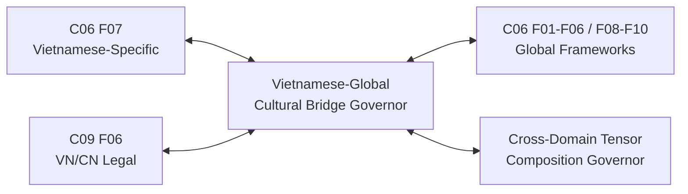
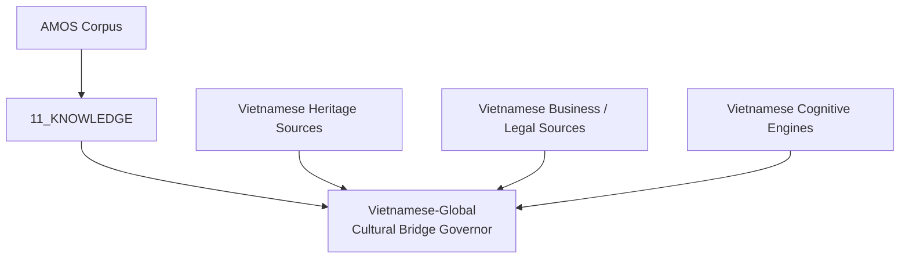
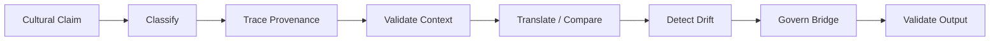
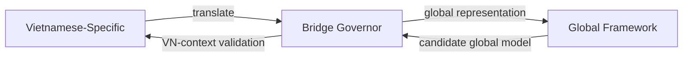
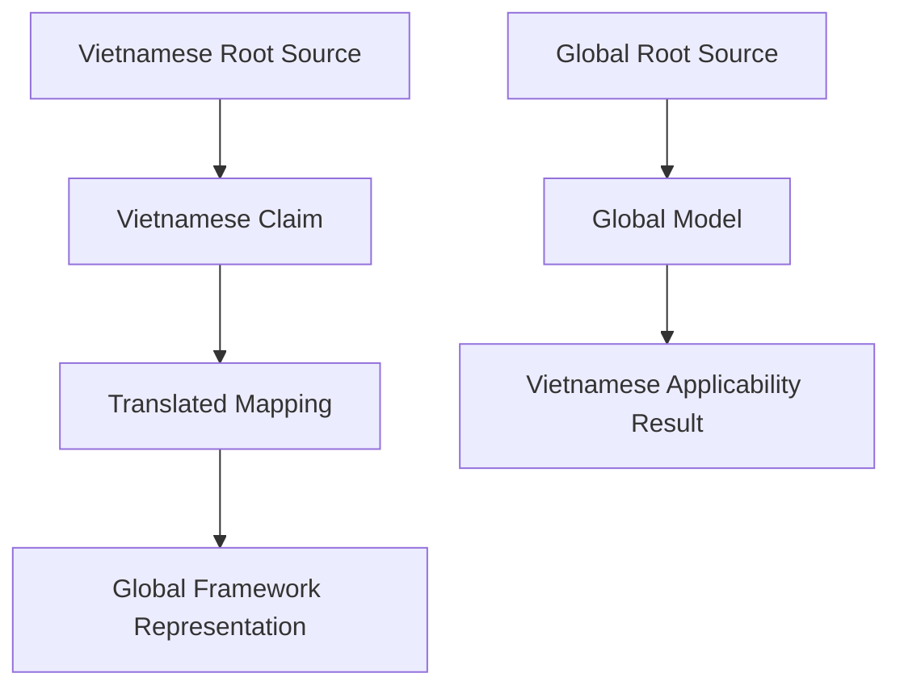

# AMOS Vietnamese Global Cultural Bridge Governor

> **Source note**: The Drive source confirms the core artifact, its 10 capabilities, 10 validation gates, 1:1:1 artifact binding, bridge topology, and enriched Vietnamese heritage/business/legal source groups.  I preserve your newer supplied frontmatter additions (`knowledge`, `vault`, `canon/knowledge`, expanded rela...


# AMOS Vietnamese-Global Cultural Bridge Governor

> [!abstract] RSCF Node
> **RSCF-NODE** · `skill` · `cross-domain` · C06 Vietnamese-Specific ↔ Global Frameworks
>
> **Origin architect / steward:** Trang Phan
> **Parent skill:** `amos-c06-society-culture-master`
> **Epistemic class:** `SOURCE_CLAIM`
> **Claim ceiling:** `0.90`
> **Declared status:** `PRODUCTION_READY`
>
> `PRODUCTION_READY` and “all 10 QA gates pass” are preserved as corpus/source assertions. This artifact does not itself include the executed QA receipts needed to independently verify that operational claim.

---

# 0. Canonical Status Receipt

`AMOS VIETNAMESE GLOBAL CULTURAL BRIDGE GOVERNOR` is a source-defined AMOS cross-domain bridge skill governing translation, comparison, validation, provenance preservation, drift detection, and controlled transfer between Vietnamese-specific models and broader global frameworks.

The source establishes the bridge as:

```text
Vietnamese-Specific
(C06 F07, C09 F06)

        ⇅

translate / validate / govern

        ⇅

Global Frameworks
(C06 F01-F06, F08-F10)
````

The bridge is explicitly **bidirectional**.

Its declared objective is not to erase Vietnamese specificity in favor of global abstraction. It is to permit comparison and translation while preserving context, provenance, and epistemic boundaries.

Canonical source boundary:

```text
VIETNAMESE-SPECIFIC != UNIVERSAL

GLOBAL MODEL != VALID FOR VIETNAM BY DEFAULT

TRANSLATION != EQUIVALENCE

COMPARABILITY != IDENTITY

SIMILARITY != CAUSATION

CULTURAL ANALOGY != HISTORICAL PROOF

SOURCE CLAIM != VERIFIED FACT

MODEL != OBSERVATION

CLAIM CEILING != CALIBRATED EMPIRICAL PROBABILITY

PRODUCTION_READY != INDEPENDENTLY VERIFIED RUNTIME

BRIDGE_PERMITTED != CLAIM VERIFIED

BRIDGE_CONDITIONAL != BRIDGE_PERMITTED

PROVENANCE PRESENT != PROVENANCE INDEPENDENT

MULTIPLE SOURCES != MULTIPLE INDEPENDENT ROOTS

CULTURAL SPECIFICITY != CULTURAL ESSENTIALISM

GLOBALIZATION != NORMALIZATION

CONTEXTUALIZATION != EXCEPTION FROM EVIDENCE

UNKNOWN/GAP != PASS
```

---

# 1. Identity

## 1.1 Source Identity

```yaml
identity:
  name: "AMOS Vietnamese-Global Cultural Bridge Governor"
  node_type: skill
  artifact_type: bridge
  domain: cross-domain

  origin_architect: Trang Phan
  steward: Trang Phan

  parent_skill: amos-c06-society-culture-master

  epistemic_class: SOURCE_CLAIM
  claim_ceiling: 0.90

  declared_status:
    value: PRODUCTION_READY
    evidence_class: SOURCE_CLAIM
```

---

## 1.2 Domain Position

The source defines the operating domain as:

```text
cross-domain
(C06 Vietnamese-Specific to Global Models)
```

with additional legal bridging through:

```text
C09 F06 VN/CN Legal
```

The visible domain therefore spans at least:

```text
C06 Society / Culture
        +
C09 Legal specialization
        +
Cross-domain translation governance
```

This does not establish that the governor may override either C06 or C09 domain canon.

---

# 2. Problem Statement

The `_00_Cosmo brain` exploration identified the following gap:

> “Vietnamese-Specific and Global Models: Vietnamese-specific cultural, legal, and business models lack bridges to global frameworks.”

The governor is designed as a response to that source-defined structural gap.

Normalized problem:

```yaml
problem:
  vietnamese_models:
    present: true

  global_models:
    present: true

  translation_bridge:
    deficiency: IDENTIFIED

  risks:
    - vietnamese_specific_claim_universalized
    - global_model_applied_without_vietnam_validation
    - cultural_specificity_lost_in_translation
    - provenance_erased_during_mapping
    - cultural_drift_introduced
    - legal_context_misapplied
```

---

# 3. Governing Objective

The bridge seeks to preserve three things simultaneously:

$$
\boxed{
BridgeIntegrity
=
Specificity
\land
Comparability
\land
Provenance
}
$$

This equation is a **DERIVED structural normalization** of the supplied design, not a source-defined empirical equation.

A valid bridge should therefore avoid two symmetric failure modes:

```text
VIETNAMESE MODEL
      │
      ├── over-generalize ──► FALSE UNIVERSALIZATION
      │
      └── isolate totally ───► NO GLOBAL COMPARABILITY
```

The target state is:

```text
CONTEXT PRESERVED
      +
TRANSLATION POSSIBLE
      +
VALIDATION EXPLICIT
```

---

# 4. Bidirectional Bridge

## 4.1 Vietnamese → Global

Purpose:

- translate Vietnamese-specific concepts into globally comparable framework terms;
- preserve Vietnamese context;
- preserve source provenance;
- avoid claiming exact equivalence where only partial correspondence exists.

Source capability:

```text
vgc_bridge.translate_vietnamese_to_global
```

---

## 4.2 Global → Vietnamese

Purpose:

- test whether a global model actually applies to Vietnamese conditions;
- identify scope mismatch;
- condition or reject transfer where evidence is insufficient.

Source capability:

```text
vgc_bridge.validate_global_for_vietnamese
```

---

## 4.3 Bidirectional Rule

The two directions are not symmetric by assumption.

Formally:

$$
VN \rightarrow Global
$$

does not imply:

$$
Global \rightarrow VN
$$

with the same mapping strength.

Each direction requires its own provenance, scope, assumptions, and validation.

---

# 5. Bridge State Machine

The source explicitly defines three governance outcomes:

```text
BRIDGE_PERMITTED
BRIDGE_BLOCKED
BRIDGE_CONDITIONAL
```

A normalized bridge state model is:

```text
                   ┌─────────────────┐
                   │ BRIDGE REQUEST  │
                   └────────┬────────┘
                            │
                            ▼
                 ┌────────────────────┐
                 │ CONTEXT + SCOPE    │
                 │ + PROVENANCE CHECK │
                 └──────────┬─────────┘
                            │
                ┌───────────┼───────────┐
                ▼           ▼           ▼
          sufficient     partial      invalid /
          evidence       support      unsafe
                │           │           │
                ▼           ▼           ▼
          PERMITTED    CONDITIONAL    BLOCKED
```

Only the three output states are source-grounded. The intermediate state machine is a derived implementation normalization.

---

# 6. Capability Registry

The artifact defines **10 capabilities**.

|  # | Capability                                  | Canonical Role                        |
| -: | ------------------------------------------- | ------------------------------------- |
|  1 | `vgc_bridge.translate_vietnamese_to_global` | VN → global translation               |
|  2 | `vgc_bridge.validate_global_for_vietnamese` | global → VN applicability validation  |
|  3 | `vgc_bridge.govern_bridge`                  | bridge-state governance               |
|  4 | `vgc_bridge.detect_cultural_drift`          | semantic/cultural translation drift   |
|  5 | `vgc_bridge.compare_cultural_systems`       | structured comparison                 |
|  6 | `vgc_bridge.trace_cultural_provenance`      | bidirectional provenance tracing      |
|  7 | `vgc_bridge.assess_cultural_claim`          | epistemic/universalization assessment |
|  8 | `vgc_bridge.manage_lifecycle`               | bridge lifecycle orchestration        |
|  9 | `vgc_bridge.detect_drift`                   | evidence/provenance freshness drift   |
| 10 | `vgc_bridge.validate_outputs`               | final domain/epistemic validation     |

---

# 7. Capability 1 — Translate Vietnamese to Global

```text
vgc_bridge.translate_vietnamese_to_global
```

Source purpose:

> Translate VN claims to global framework terms.

A conservative derived input contract is:

```yaml
input:
  vietnamese_claim: REQUIRED
  source_context: REQUIRED
  provenance: REQUIRED
  target_global_framework: REQUIRED
  scope: REQUIRED
```

Candidate output:

```yaml
output:
  source_claim: PRESERVED
  translated_representation: REQUIRED
  correspondence_strength: UNKNOWN_UNLESS_VALIDATED
  preserved_context: REQUIRED
  provenance: PRESERVED
  caveats: REQUIRED_WHERE_MATERIAL
```

Do not infer exact equivalence merely because a translation was produced.

---

# 8. Translation Classes

A safe derived translation taxonomy is:

```text
EXACT_CORRESPONDENCE
PARTIAL_CORRESPONDENCE
FUNCTIONAL_ANALOGUE
STRUCTURAL_ANALOGUE
CONTEXT_DEPENDENT_MAPPING
NO_SAFE_MAPPING
UNKNOWN
```

These labels are **PROPOSED**, not source-defined capability outputs.

Their purpose is to prevent:

```text
looks similar
    ⇒
same concept
```

---

# 9. Capability 2 — Validate Global for Vietnamese

```text
vgc_bridge.validate_global_for_vietnamese
```

This capability encodes a crucial asymmetry:

```text
GLOBAL MODEL EXISTS
        !=
VALID IN VIETNAMESE CONTEXT
```

The source explicitly requires global models to be validated for Vietnamese context.

Candidate evaluation envelope:

```yaml
validation:
  population_or_system: vietnamese_context
  time: REQUIRED
  legal_regime: REQUIRED_WHERE_RELEVANT
  cultural_regime: REQUIRED_WHERE_RELEVANT
  business_environment: REQUIRED_WHERE_RELEVANT
  measurement_method: REQUIRED_WHERE_RELEVANT
  provenance: REQUIRED
```

---

# 10. Capability 3 — Govern Bridge

```text
vgc_bridge.govern_bridge
```

Source outputs:

```text
BRIDGE_PERMITTED
BRIDGE_BLOCKED
BRIDGE_CONDITIONAL
```

A conservative governance predicate is:

$$
BridgePermitted
\Rightarrow
ContextPreserved
\land
ProvenancePresent
\land
NoCriticalUniversalizationError
$$

This exact conjunction is **DERIVED**, not source-verbatim.

---

# 11. Capability 4 — Detect Cultural Drift

```text
vgc_bridge.detect_cultural_drift
```

Cultural drift concerns distortion introduced between the source cultural model and its translated representation.

Possible drift dimensions include:

```yaml
cultural_drift_dimensions:
  - semantic_loss
  - historical_context_loss
  - ritual_context_loss
  - legal_context_loss
  - institutional_context_loss
  - normative_reframing
  - false_equivalence
  - false_universalization
```

These dimensions are derived decomposition.

---

# 12. Cultural Drift Firewall

A translation fails cultural integrity when the translated output becomes materially stronger, broader, or different than the source.

Conceptually:

$$
Meaning(Source)
\not\approx
Meaning(Translation)
\Rightarrow
Drift.
$$

No numerical cultural-drift metric is supplied in the source.

Therefore:

```yaml
cultural_drift:
  metric: NOT_ESTABLISHED
  threshold: NOT_ESTABLISHED
```

---

# 13. Capability 5 — Compare Cultural Systems

```text
vgc_bridge.compare_cultural_systems
```

Comparison should preserve typed distinctions.

A safe comparison schema:

```yaml
comparison:
  system_A:
    identity: REQUIRED
    scope: REQUIRED
    provenance: REQUIRED

  system_B:
    identity: REQUIRED
    scope: REQUIRED
    provenance: REQUIRED

  compare:
    - structure
    - function
    - institutions
    - norms
    - historical_context
    - legal_context
    - business_context

  prohibit:
    - automatic_equivalence
    - automatic_superiority_claim
    - causal_claim_from_similarity_only
```

The detailed fields are derived scaffolding.

---

# 14. Structural Similarity Firewall

```text
STRUCTURAL SIMILARITY
        !=
COMMON ORIGIN

COMMON PATTERN
        !=
CAUSAL TRANSMISSION

CHRONOLOGICAL SEQUENCE
        !=
CAUSATION

CULTURAL ANALOGUE
        !=
IDENTICAL CULTURAL MEANING
```

This is especially important when comparing heritage, symbolism, institutions, or ritual structures.

---

# 15. Capability 6 — Trace Cultural Provenance

```text
vgc_bridge.trace_cultural_provenance
```

The source explicitly requires provenance tracing in both directions.

Therefore provenance is not optional bridge metadata.

Conceptual topology:

```text
Vietnamese Source Root
      │
      ├── claim
      │    │
      │    └── translation
      │          │
      │          └── global mapping
      │
      └── provenance preserved
```

and:

```text
Global Source Root
      │
      ├── global model
      │    │
      │    └── VN applicability test
      │          │
      │          └── Vietnamese contextualization
      │
      └── provenance preserved
```

---

# 16. Provenance Independence

Traceability does not prove independence.

Therefore:

```text
SOURCE A
 ├── descendant B
 ├── descendant C
 └── descendant D

B + C + D
!=
3 independent roots
```

A bridge may preserve several citations yet still depend on one ancestral source.

---

# 17. Capability 7 — Assess Cultural Claim

```text
vgc_bridge.assess_cultural_claim
```

Source purpose:

> Assess claim for epistemic class and universalization risk.

A suitable derived claim capsule is:

```yaml
cultural_claim:
  text: REQUIRED
  cultural_scope: REQUIRED
  epistemic_class: REQUIRED
  source_provenance: REQUIRED
  universalization_risk: REQUIRED
  competing_explanations: OPTIONAL_BUT_REQUIRED_WHEN_MATERIAL
  falsifiers: REQUIRED_FOR_CONSEQUENTIAL_CLAIMS
  confidence_ceiling: REQUIRED
```

---

# 18. Universalization Risk

A Vietnamese-specific claim can remain valid within its intended scope without being universal.

Thus:

$$
Valid_{Vietnam}(C)
\not\Rightarrow
Valid_{Global}(C)
$$

Likewise:

$$
Valid_{GlobalDataset}(C)
\not\Rightarrow
Valid_{Vietnam}(C).
$$

Cross-context transfer requires evidence.

---

# 19. Capability 8 — Manage Lifecycle

```text
vgc_bridge.manage_lifecycle
```

The source lists:

```text
classify
validate
trace
assess
detect
```

A normalized lifecycle is:

```text
INGEST
   ↓
CLASSIFY
   ↓
BIND CONTEXT
   ↓
TRACE PROVENANCE
   ↓
VALIDATE
   ↓
ASSESS UNIVERSALIZATION RISK
   ↓
DETECT DRIFT
   ↓
GOVERN BRIDGE
   ↓
VALIDATE OUTPUT
```

Only the source verbs are canonical; the ordering is a derived workflow.

---

# 20. Capability 9 — Detect Drift

```text
vgc_bridge.detect_drift
```

This is distinct from:

```text
vgc_bridge.detect_cultural_drift
```

The source specifies this second drift function as:

> Detect drift in evidence chains and provenance freshness.

Therefore:

```text
CULTURAL DRIFT
!=
EVIDENCE / PROVENANCE DRIFT
```

---

# 21. Evidence-Chain Drift

Candidate evidence drift conditions:

```yaml
evidence_drift:
  - source_updated
  - source_revoked
  - downstream_summary_no_longer_matches_source
  - ancestry_lost
  - scope_changed
  - regime_changed
  - freshness_expired
```

These are derived operational checks.

---

# 22. Capability 10 — Validate Outputs

```text
vgc_bridge.validate_outputs
```

Source purpose:

> Validate outputs against domain constraints and epistemic class.

Output validation therefore occurs after translation/comparison, not only before.

Candidate final checks:

```text
DOMAIN FIT
   +
CONTEXT FIT
   +
EPISTEMIC CLASS
   +
PROVENANCE
   +
UNIVERSALIZATION BOUNDARY
   +
CULTURAL SPECIFICITY
```

No executed validator implementation is shown in this artifact.

---

# 23. Validation Gate Registry

The source defines ten QA gates.

| Gate | Source Rule                                                                            |
| ---- | -------------------------------------------------------------------------------------- |
| G1   | No contradictions across VN-global bridge                                              |
| G2   | VN claims CONDITIONAL on context; global claims MODEL unless validated                 |
| G3   | Provenance recorded for every cultural claim                                           |
| G4   | No VN claim universalized without evidence; no global claim applied without validation |
| G5   | Cultural ritual energy equations (`gia hệ`) tagged as MODEL                            |
| G6   | Failure mode handled                                                                   |
| G7   | Cultural specificity preserved during translation                                      |
| G8   | Universalization firewall                                                              |
| G9   | Global models validated for VN context                                                 |
| G10  | Bidirectional provenance traceable                                                     |

---

# 24. Gate G1 — Contradiction Integrity

```text
G1:
No contradictions across VN-global bridge
```

This should not be interpreted as:

```text
all conflicting claims must be forced into one conclusion.
```

A stronger integrity-preserving interpretation is:

```text
unresolved contradiction
        ⇒
visible COMPETING state
```

rather than silent merge.

---

# 25. Gate G2 — Epistemic Typing

Source:

```text
VN claims CONDITIONAL on context;
global claims MODEL unless validated
```

Canonical consequence:

```yaml
vn_claim_default:
  scope: CONTEXT_DEPENDENT

global_claim_transfer:
  default: MODEL
  vietnamese_validity: REQUIRES_VALIDATION
```

This is one of the most important anti-overgeneralization constraints.

---

# 26. Gate G3 — Provenance

```text
Every cultural claim requires provenance.
```

Therefore a claim with missing provenance cannot simply inherit confidence from surrounding text.

Conceptually:

$$
MissingProvenance
\Rightarrow
BridgeConfidenceLimited.
$$

The exact ceiling adjustment is not source-defined.

---

# 27. Gate G4 — Symmetric Anti-Universalization

The gate blocks both:

```text
VN → GLOBAL
without evidence
```

and:

```text
GLOBAL → VN
without validation.
```

This makes the firewall bidirectional.

---

# 28. Gate G5 — Gia Hệ Model Boundary

The source explicitly states:

> Cultural ritual energy equations (gia hệ) tagged as MODEL.

Therefore:

```text
GIA HỆ EQUATION
!=
ESTABLISHED PHYSICAL ENERGY LAW
```

and:

```text
CULTURAL MODEL
!=
BIOLOGICAL / PHYSICAL MEASUREMENT
```

unless independently validated through an appropriate empirical methodology.

---

# 29. Gate G6 — Failure Mode

Source:

```text
Failure mode handled
```

The exact failure mode list is not supplied.

Therefore:

```yaml
failure_handling:
  required: true
  source_defined_specific_modes: NOT_PROVIDED
```

Do not invent successful coverage beyond what the source declares.

---

# 30. Gate G7 — Cultural Specificity

Translation must preserve Vietnamese specificity.

This prohibits translation that removes material differences merely to fit a global framework.

Example structural firewall:

```text
Specific Vietnamese concept
        ↓
global abstraction

must preserve:
- contextual qualifiers
- cultural meaning
- historical scope
- institutional setting
```

---

# 31. Gate G8 — Universalization Firewall

Source:

> no VN-specific universalized without cross-cultural evidence.

Thus:

$$
VietnamSpecific(C)
\land
NoCrossCulturalEvidence
\Rightarrow
NoUniversalization(C).
$$

This is a direct formalization of the supplied gate.

---

# 32. Gate G9 — Global-to-Vietnam Validation

A model described as global is not automatically transportable into Vietnam.

Required principle:

```text
GLOBAL LABEL
!=
VIETNAMESE APPLICABILITY RECEIPT
```

---

# 33. Gate G10 — Bidirectional Provenance

Both the Vietnamese source and the global target/source should remain traceable.

A bridge that records only the translated output while losing the original source violates the intended topology.

---

# 34. QA Status Boundary

The artifact declares:

```text
PRODUCTION_READY
(all 10 QA gates pass)
```

This is source-grounded as a declaration.

However, the artifact does not contain:

```text
G1 receipt
G2 receipt
...
G10 receipt
```

Therefore:

```yaml
qa_status:
  declared: PASSED_ALL_10_GATES
  class: SOURCE_CLAIM
  executed_receipts_in_this_artifact: NOT_PRESENT
```

---

# 35. Claim Ceiling

Source:

```text
claim_ceiling: 0.9
```

This is a declared maximum claim/confidence ceiling inside the source model.

It must not be silently interpreted as:

```text
90% scientifically calibrated probability.
```

Canonical boundary:

$$
ClaimCeiling_{source}=0.90
$$

but:

$$
Calibration_{empirical}=NOT\ ESTABLISHED.
$$

---

# 36. Bridge Confidence

A safe derived rule consistent with AMOS integrity is:

$$
Confidence(Output)
\leq
\min(
0.90,
Confidence(load\text{-}bearing\ premises)
).
$$

This formula is **DERIVED** from the supplied 0.90 ceiling plus AMOS confidence-ceiling discipline; it is not source-verbatim.

---

# 37. Artifact Binding

The source specifies a `1:1:1 binding`.

## Skill

```text
.devin/skills/amos-vietnamese-global-cultural-bridge-governor/SKILL.md
```

## Agent

```text
.devin/agents/amos-vietnamese-global-cultural-bridge-governor-agent.json
```

## Workflow

```text
.devin/workflows/amos-vietnamese-global-cultural-bridge-governor-workflow.md
```

## Vault Reference

```text
.devin/skills/.../references/vault_domain_knowledge.md
```

---

# 38. 1:1:1 Integrity

Conceptually:

```text
SKILL
  │
  ├── 1 Agent
  │
  └── 1 Workflow
        │
        └── Vault reference
```

The source uses the phrase `1:1:1 binding`, but the detailed identity/version validation mechanism is not supplied.

---

# 39. Artifact Presence Boundary

The listed paths prove that the source **references** those artifacts.

This note alone does not prove:

- each path currently exists;
- versions match;
- hashes match;
- agent and workflow are synchronized;
- deployment is current.

Those require repository/runtime inspection.

---

# 40. RSCF Relations

Source relations:

```text
PARENT_OF:
amos-c06-society-culture-master

COMPOSES_WITH:
amos-cross-domain-tensor-composition-governor

BRIDGES:
C06 Vietnamese-Specific
C06 Global Frameworks
C09 F06 VN/CN Legal

INDEXED_BY:
11_KNOWLEDGE_MOC
```

---

# 41. Parent Relation Contradiction

The frontmatter says:

```yaml
parent_skill: amos-c06-society-culture-master
```

This naturally suggests:

```text
THIS SKILL
   CHILD_OF
amos-c06-society-culture-master
```

Yet the RSCF relation states:

```text
THIS SKILL
   PARENT_OF
amos-c06-society-culture-master
```

These two directions cannot safely be treated as equivalent.

Canonical preservation:

```yaml
parent_relation:
  frontmatter:
    relation: CHILD_OF_IMPLIED
    target: amos-c06-society-culture-master

  rscf_relation:
    relation: PARENT_OF
    target: amos-c06-society-culture-master

  resolution:
    class: COMPETING
    status: UNKNOWN/GAP
```

No silent repair.

---

# 42. Tensor Composition Relation

Source:

```text
COMPOSES_WITH:
amos-cross-domain-tensor-composition-governor
```

This establishes a named composition relation.

It does **not** specify the exact tensor axes, compatibility mapping, or runtime call order.

---

# 43. Cross-Domain Tensor Firewall

Any cross-domain composition should preserve:

```text
SAME AXIS NAME
!=
SAME SEMANTIC MEANING
```

and:

```text
C06 CULTURAL SCOPE
!=
C09 LEGAL SCOPE
```

unless a compatibility contract exists.

---

# 44. Bridge Domain Graph



---

# 45. Vietnamese Heritage Source Group

The source records an enriched Vietnamese heritage group under:

```text
Cosmo brain: vietnamese/
```

with a declared total of:

```text
96 files
```

The source lists the following representative artifacts.

---

# 46. TRANG ∅ FRAMEWORK – HERITAGE ∅

Source description:

> Comprehensive heritage mapping.

Canonical status in this bridge:

```yaml
heritage_source:
  name: "TRANG ∅ FRAMEWORK – HERITAGE ∅"
  role: heritage_mapping
  evidence_class: SOURCE_REFERENCE
```

Its substantive claims are not reproduced or independently validated in this artifact.

---

# 47. HERITAGE INTELLIGENCE V7 0

Source description:

> Full heritage intelligence architecture.

Bridge role:

```text
heritage model / decision-intelligence context
```

The term `full` is source language, not independent completeness verification.

---

# 48. HERITAGE ∅ – GIẢI MÃ HOA VĂN TRỐNG ĐỒNG

Source description:

> Dong Son drum pattern decoding.

This artifact should be treated as a source/model reference unless individual historical/archaeological claims are independently validated.

Firewall:

```text
INTERPRETATION
!=
ARCHAEOLOGICAL CONSENSUS

PATTERN READING
!=
VERIFIED HISTORICAL INTENT
```

---

# 49. Ứng dụng Khung Độ Phức Tạp

Source description:

> Complexity framework for 3 symbolic systems: Dong Son, Co Loa, Trong Dong.

Bridge-safe typing:

```yaml
claim_class: MODEL
cross_domain_use:
  allowed_as: comparative_structure
  not_automatically_allowed_as:
    - causal_history
    - universal_symbolic_law
```

---

# 50. ẢNH HƯỞNG GIA HỆ

Source description:

> Gia hệ as cross-10 regulatory mechanism.

Because the validation rules explicitly single out gia hệ ritual energy equations as `MODEL`, any equation or energetic language associated with this framework must remain model-typed unless independently measured.

---

# 51. Vietnamese Business / Legal Sources

The source lists:

```text
11 Tiêu chí mô hình kinh doanh
BÁO CÁO THẨM ĐỊNH PHÁP LÝ
BẢN ĐỀ XUẤT ĐẦU TƯ
```

These represent business/legal source materials in the enriched vault.

Their inclusion does not imply:

- legal advice;
- current legal validity;
- regulatory approval;
- investment suitability;
- economic performance.

---

# 52. 11 Tiêu chí mô hình kinh doanh

Source description:

> 11 business model criteria.

Bridge role:

```text
Vietnamese business-model representation
        ↓
cross-framework comparison
```

Exact criteria are not supplied in this governor artifact.

---

# 53. BÁO CÁO THẨM ĐỊNH PHÁP LÝ

Source description:

> Legal audit report.

Legal firewall:

```text
VAULT LEGAL REPORT
!=
CURRENT LEGAL ADVICE

SOURCE DOCUMENT
!=
CURRENT STATUTE

PAST AUDIT
!=
CURRENT COMPLIANCE
```

Any consequential legal application requires jurisdiction, date, governing law, and current-source validation.

---

# 54. BẢN ĐỀ XUẤT ĐẦU TƯ

Source description:

> Investment proposal.

Financial firewall:

```text
PROPOSAL
!=
APPROVAL

INVESTMENT MODEL
!=
INVESTMENT RECOMMENDATION

FORECAST
!=
REALIZED RETURN
```

---

# 55. Vietnamese Cognitive Engines

The source lists two engines.

## AMOS_Society_Culture_Engine

Source role:

```text
Institutions
Norms
Demographics
Cultural evolution
```

## AMOS_Vn_Legal_Engine

Source role:

> Vietnam-specialised legal reasoning, defaults to Vietnamese language and Vietnam law while preserving global legal safety constraints.

These are source-defined capability descriptions, not independent runtime tests.

---

# 56. C06 Society / Culture Routing

A derived C06 routing profile:

```yaml
C06:
  vietnamese_specific:
    role: local cultural context

  global_frameworks:
    role: comparative model family

  bridge_governor:
    role:
      - translate
      - compare
      - validate
      - preserve_specificity
      - prevent_universalization
```

---

# 57. C09 Legal Routing

The bridge includes:

```text
C09 F06 VN/CN Legal
```

This creates an additional scope firewall.

Vietnamese cultural models must not silently substitute for Vietnamese law.

Likewise:

```text
CULTURAL NORM
!=
LEGAL RULE
```

and:

```text
BUSINESS PRACTICE
!=
LEGAL AUTHORITY.
```

---

# 58. Translation Contract

A full derived translation contract:

```yaml
TRANSLATION_CONTRACT:

  source:
    claim_id: REQUIRED
    language: REQUIRED
    cultural_context: REQUIRED
    provenance: REQUIRED
    epistemic_class: REQUIRED
    scope: REQUIRED

  target:
    framework: REQUIRED
    target_terms: REQUIRED

  mapping:
    mapping_class:
      - EXACT
      - PARTIAL
      - ANALOGICAL
      - CONTEXT_DEPENDENT
      - NONE
      - UNKNOWN

    preserve:
      - source_meaning
      - qualifiers
      - provenance
      - cultural_specificity
      - epistemic_class

  prohibit:
    - silent_universalization
    - semantic_strengthening
    - false_equivalence
    - provenance_loss
```

All fields beyond source capabilities/gates are derived implementation scaffolding.

---

# 59. Global Applicability Contract

```yaml
GLOBAL_TO_VN_VALIDATION:

  global_model:
    identity: REQUIRED
    provenance: REQUIRED
    original_scope: REQUIRED

  vietnam_context:
    domain: REQUIRED
    time: REQUIRED
    population_or_system: REQUIRED
    legal_regime: REQUIRED_IF_MATERIAL
    institutional_context: REQUIRED_IF_MATERIAL
    cultural_context: REQUIRED_IF_MATERIAL

  outcome:
    - BRIDGE_PERMITTED
    - BRIDGE_CONDITIONAL
    - BRIDGE_BLOCKED
```

---

# 60. Cultural Claim Tensor

A useful derived tensor representation:

```text
T_VGC =
T[
  claim,
  origin_context,
  target_context,
  epistemic_class,
  provenance,
  scope,
  cultural_specificity,
  mapping_class,
  universalization_risk,
  drift_state,
  bridge_state,
  freshness
]
```

This is a **DERIVED AMOS normalization**, not a source-defined tensor signature.

---

# 61. Claim Assessment Matrix

| Claim Type                           | Default Bridge Treatment                            |
| ------------------------------------ | --------------------------------------------------- |
| Vietnamese local observation         | Context-bound                                       |
| Vietnamese historical interpretation | SOURCE_CLAIM / MODEL unless independently validated |
| Vietnamese cultural model            | MODEL / CONDITIONAL                                 |
| Global framework                     | MODEL for VN transfer until validated               |
| Legal proposition                    | Requires current jurisdiction-specific validation   |
| Business proposition                 | Requires domain/time/context validation             |
| Ritual-energy equation               | MODEL                                               |
| Cross-cultural causal claim          | Requires causal evidence, not analogy               |

This table is derived from the source gates and AMOS epistemic boundaries.

---

# 62. Cultural Universalization Matrix

```text
VN-SPECIFIC CLAIM
      │
      ├── no cross-cultural evidence
      │       ↓
      │   CONTEXT-BOUND
      │
      └── cross-cultural evidence
              ↓
         TEST GENERALITY
              ↓
      ┌───────┴────────┐
      ▼                ▼
  supported        insufficient
      │                │
      ▼                ▼
 broader scope      CONDITIONAL
```

---

# 63. Global Transfer Matrix

```text
GLOBAL MODEL
      │
      ▼
VIETNAMESE APPLICABILITY TEST
      │
 ┌────┼─────────┐
 ▼    ▼         ▼
PASS PARTIAL   FAIL
 │    │         │
 ▼    ▼         ▼
PERM  COND    BLOCK
```

---

# 64. Bridge Decision Receipt

A derived decision receipt:

```yaml
BRIDGE_DECISION_RECEIPT:

  request_id: REQUIRED

  direction:
    - VN_TO_GLOBAL
    - GLOBAL_TO_VN

  source_claim:
    id: REQUIRED
    provenance: REQUIRED
    epistemic_class: REQUIRED

  source_context:
    scope: REQUIRED
    regime: REQUIRED_WHERE_MATERIAL
    freshness: REQUIRED_WHERE_MATERIAL

  target_context:
    framework: REQUIRED
    scope: REQUIRED

  checks:
    contradiction: REQUIRED
    provenance: REQUIRED
    cultural_specificity: REQUIRED
    universalization: REQUIRED
    drift: REQUIRED
    contextual_validity: REQUIRED

  decision:
    - BRIDGE_PERMITTED
    - BRIDGE_CONDITIONAL
    - BRIDGE_BLOCKED

  conditions: []
  unresolved_gaps: []
```

---

# 65. Failure Modes

## FM-01 — Vietnamese Universalization

A Vietnam-specific pattern is presented as universally human without cross-cultural evidence.

Expected:

```text
BLOCK or CONDITION
```

---

## FM-02 — Global Model Imposition

A global model is treated as valid in Vietnam merely because it is globally popular or widely cited.

Expected:

```text
VALIDATE FIRST
```

---

## FM-03 — Cultural Flattening

Distinct Vietnamese concepts are translated into generic terms that erase context.

Expected:

```text
CULTURAL DRIFT
```

---

## FM-04 — False Equivalence

Two systems share structural features and are declared identical.

Expected:

```text
REJECT EQUIVALENCE
```

unless a stronger semantic contract exists.

---

## FM-05 — Provenance Collapse

Translation preserves conclusion but loses original Vietnamese source ancestry.

Expected:

```text
G3/G10 FAIL
```

---

## FM-06 — Echo Provenance

Several downstream summaries are treated as independent support.

Expected:

```text
CORRELATION RISK
```

---

## FM-07 — Legal Context Leakage

A cultural observation is converted into a legal claim.

Expected:

```text
C09 LEGAL VALIDATION REQUIRED
```

---

## FM-08 — Ritual Model Reification

A gia hệ ritual-energy model is presented as established physical science.

Expected:

```text
G5 FAIL
```

---

## FM-09 — Translation Strengthening

Source says:

```text
may
```

translation says:

```text
always.
```

Expected:

```text
DRIFT / BLOCK
```

---

## FM-10 — Stale Global Model

A once-applicable global model is transferred despite a changed Vietnamese regime or context.

Expected:

```text
FRESHNESS REVALIDATION
```

---

# 66. Negative Tests

```yaml
NEGATIVE_TESTS:

  - input: VN_SPECIFIC_WITHOUT_PROVENANCE
    expected: BLOCK_OR_GAP

  - input: VN_SPECIFIC_TO_UNIVERSAL_WITHOUT_CROSS_CULTURAL_EVIDENCE
    expected: BLOCK

  - input: GLOBAL_MODEL_WITHOUT_VN_CONTEXT_VALIDATION
    expected: CONDITIONAL_OR_BLOCK

  - input: GIA_HE_ENERGY_AS_PHYSICAL_FACT
    expected: RECLASSIFY_AS_MODEL_OR_REJECT

  - input: TRANSLATION_LOSES_CULTURAL_CONTEXT
    expected: CULTURAL_DRIFT_FAIL

  - input: PROVENANCE_ONLY_ONE_DIRECTION
    expected: G10_FAIL

  - input: CONFLICTING_CLAIMS_SILENTLY_MERGED
    expected: CONTRADICTION_FAIL

  - input: STALE_EVIDENCE_CHAIN
    expected: REVALIDATE

  - input: CULTURAL_NORM_USED_AS_LEGAL_RULE
    expected: LEGAL_SCOPE_FAIL

  - input: DIFFERENT_DESCENDANTS_COUNTED_AS_INDEPENDENT_ROOTS
    expected: PROVENANCE_INDEPENDENCE_FAIL
```

---

# 67. Positive Tests

```yaml
POSITIVE_TESTS:

  - case:
      source: context_bound_vietnamese_claim
      provenance: complete
      global_mapping: explicitly_partial
      cultural_specificity: preserved
    expected: BRIDGE_PERMITTED_OR_CONDITIONAL

  - case:
      global_model: clearly_scoped
      vietnam_validation: present
      provenance: complete
      assumptions: compatible
    expected: BRIDGE_PERMITTED

  - case:
      cross_cultural_claim:
        vietnam_evidence: present
        independent_non_vietnam_evidence: present
        scopes: compatible
    expected: GENERALIZATION_MAY_BE_CONSIDERED
```

---

# 68. Drift Taxonomy

```yaml
DRIFT_TAXONOMY:

  cultural:
    - semantic_drift
    - contextual_drift
    - ritual_drift
    - historical_drift
    - normative_drift

  epistemic:
    - class_inflation
    - confidence_inflation
    - conditional_to_universal
    - model_to_fact

  provenance:
    - ancestry_loss
    - source_substitution
    - independence_misclassification

  temporal:
    - stale_source
    - stale_regime
    - outdated_legal_context

  domain:
    - culture_to_law
    - culture_to_science
    - business_to_policy
    - analogy_to_causation
```

Derived taxonomy.

---

# 69. Cultural Specificity Contract

The bridge must preserve enough local structure that the Vietnamese claim remains recognizable as the same contextual claim after translation.

Derived contract:

```yaml
CULTURAL_SPECIFICITY:

  preserve:
    - local_terms_when_non_equivalent
    - historical_context
    - institutional_context
    - cultural_scope
    - provenance
    - qualifiers

  do_not:
    - erase_local_meaning
    - replace_with_false_global_equivalent
    - translate_model_into_fact
    - translate_practice_into_universal_norm
```

---

# 70. Bilingual Semantics

Translation across Vietnamese and global/English frameworks should distinguish:

```text
LEXICAL TRANSLATION
SEMANTIC TRANSLATION
CONCEPTUAL MAPPING
INSTITUTIONAL MAPPING
LEGAL MAPPING
```

They are not interchangeable.

A Vietnamese term may require retention in Vietnamese if no equivalent target concept exists.

---

# 71. Vietnamese Terminology Preservation

Derived recommendation:

```text
If exact equivalence is absent:

retain:
  original Vietnamese term

add:
  explanatory gloss

mark:
  mapping = PARTIAL / CONTEXT_DEPENDENT
```

This prevents cultural information loss.

---

# 72. Historical Claims

Historical/cultural material in the enriched heritage sources should remain typed by evidence class.

```text
SOURCE INTERPRETATION
!=
VERIFIED HISTORY

HERITAGE MODEL
!=
ARCHAEOLOGICAL PROOF

TRADITION
!=
UNIVERSAL LAW
```

---

# 73. Business Claims

Vietnamese business artifacts may provide:

- local criteria;
- market assumptions;
- legal environment;
- investment structure.

But:

```text
LOCAL BUSINESS MODEL
!=
GLOBAL BUSINESS LAW

PAST BUSINESS CONDITIONS
!=
CURRENT MARKET CONDITIONS
```

Freshness matters.

---

# 74. Legal Claims

Legal bridge operations carry stronger validation requirements.

Before transferring any legal claim:

```yaml
legal_scope:
  jurisdiction: REQUIRED
  date: REQUIRED
  source_authority: REQUIRED
  currentness: REQUIRED
  legal_domain: REQUIRED
```

This is derived governance, consistent with scope discipline.

---

# 75. Comparative Cultural Reasoning

Comparison should answer separately:

```text
What is similar?

What is different?

At what scale?

Under what historical conditions?

Under what institutional conditions?

What evidence supports the mapping?

Does similarity indicate common origin?

Does similarity indicate causation?
```

The last two cannot be assumed.

---

# 76. Claim Classes

Source-defined classes explicitly invoked include:

```text
SOURCE_CLAIM
CONDITIONAL
MODEL
```

The bridge may also interact with wider AMOS classes, but they should not be silently inserted as source-native unless canonical schema confirms them.

---

# 77. Bridge Proof Capsule

For consequential bridge conclusions:

```yaml
BRIDGE_PROOF_CAPSULE:

  claim:
    text: REQUIRED
    class: REQUIRED

  direction:
    value: REQUIRED

  premises:
    - source_context
    - target_context
    - semantic_mapping

  provenance:
    source_roots: REQUIRED
    ancestry: REQUIRED_WHERE_KNOWN

  applicability:
    cultural_scope: REQUIRED
    legal_scope: REQUIRED_WHERE_RELEVANT
    time: REQUIRED_WHERE_RELEVANT

  competing_explanations:
    required: WHEN_MATERIAL

  falsifiers:
    required: WHEN_MATERIAL

  bridge_state:
    - BRIDGE_PERMITTED
    - BRIDGE_CONDITIONAL
    - BRIDGE_BLOCKED

  confidence_ceiling:
    max: 0.90
```

Derived normalization.

---

# 78. RSCF Contract

```yaml
RSCF:

  node_id: amos_vietnamese_global_cultural_bridge_governor

  node_type: skill

  claim_class: SOURCE_CLAIM

  state: SOURCE_CLAIM

  H:
    identity: "AMOS Vietnamese-Global Cultural Bridge Governor"

    role:
      >
        Bidirectional Vietnamese-specific ↔ global framework
        translation, comparison, validation, provenance,
        drift detection, and universalization governance.

  M:
    capabilities:
      - translate_vietnamese_to_global
      - validate_global_for_vietnamese
      - govern_bridge
      - detect_cultural_drift
      - compare_cultural_systems
      - trace_cultural_provenance
      - assess_cultural_claim
      - manage_lifecycle
      - detect_drift
      - validate_outputs

    gates:
      - G1_contradiction
      - G2_epistemic_typing
      - G3_provenance
      - G4_bidirectional_validation
      - G5_ritual_energy_model_boundary
      - G6_failure_handling
      - G7_cultural_specificity
      - G8_universalization_firewall
      - G9_global_to_vn_validation
      - G10_bidirectional_provenance

  L:
    load_on_demand:
      - source_claim
      - vietnamese_context
      - target_global_framework
      - evidence_lineage
      - legal_context
      - heritage_source
      - business_source
      - drift_receipts
      - validation_receipts

  confidence_ceiling:
    source_declared: 0.90

  raw_source_policy:
    value: DO_NOT_LOAD_UNLESS_REQUIRED
```

---

# 79. H/M/L Retrieval

```text
H — Bridge identity
    Vietnamese ↔ Global
    context + provenance + governance

M — Required subsystem
    translation
    validation
    comparison
    claim assessment
    drift
    provenance

L — Detail only if outcome-changing
    original Vietnamese source
    global framework source
    legal text
    historical evidence
    business records
    validation receipts
```

---

# 80. Bridge Fast Path

A lightweight bridge may proceed only when:

```text
scope is clear
+
mapping is low-risk
+
provenance is intact
+
no legal/causal/generalization leap exists
+
no cultural conflict exists
```

Escalate when:

```text
legal consequences
historical causal claims
cultural universalization
ritual/scientific claims
high-stakes business decisions
conflicting evidence
stale provenance
ambiguous translations
```

Derived operational policy.

---

# 81. Adversarial Validation

For a consequential translation, challenge the first mapping with an alternate path.

Ask:

```text
Did translation erase a Vietnamese qualifier?

Did a global term introduce assumptions absent in the source?

Are multiple citations descendants of one source?

Did a MODEL become a FACT?

Did context shift?

Did legal/cultural scopes become conflated?

Is there a stronger competing translation?
```

If yes:

```text
DOWNGRADE
CONDITION
PRESERVE COMPETING
or BLOCK
```

---

# 82. Competing Translations

Some Vietnamese concepts may support multiple global mappings.

A safe state is:

```yaml
translation:
  candidates:
    - mapping_A
    - mapping_B

  status: COMPETING

  discriminating_evidence:
    required: true
```

Do not force a single English/global equivalent merely for fluency.

---

# 83. Scope Envelope

Every bridge result should inherit an applicability envelope.

```yaml
scope_envelope:
  origin_culture: REQUIRED
  target_context: REQUIRED
  domain: REQUIRED
  time: REQUIRED_WHERE_MATERIAL
  legal_regime: REQUIRED_WHERE_MATERIAL
  institutional_regime: REQUIRED_WHERE_MATERIAL
  evidence_method: REQUIRED_WHERE_MATERIAL
```

---

# 84. Causal Firewall

The bridge may compare but must not infer causation from:

```text
shared symbolism
similar ritual
parallel social organization
linguistic resemblance
chronological sequence
structural correspondence
```

Causal inference requires appropriately typed evidence.

---

# 85. Heritage Causal Firewall

Especially for:

```text
Dong Son
Co Loa
Trống Đồng
Gia hệ
Heritage ∅
```

the following distinctions should remain explicit:

```text
pattern interpretation
vs
historical mechanism

structural correspondence
vs
cultural transmission

heritage model
vs
archaeological observation
```

---

# 86. Cross-Domain Firewall

The governor spans culture, law, business, and heritage.

Therefore:

```text
CULTURAL EVIDENCE
!=
LEGAL AUTHORITY

LEGAL DOCUMENT
!=
CULTURAL CONSENSUS

BUSINESS PROPOSAL
!=
ECONOMIC FACT

HERITAGE INTERPRETATION
!=
PHYSICAL LAW
```

---

# 87. Status Proof Capsule

```yaml
PROOF_CAPSULE:

  claim:
    "The source declares this governor PRODUCTION_READY with all 10 QA gates passed."

  class:
    SOURCE_CLAIM

  evidence:
    - artifact status field
    - Identity section
    - Validation Gates section

  scope:
    AMOS_corpus

  gaps:
    - executed QA receipts not embedded here
    - runtime logs not embedded here
    - artifact hashes not embedded here

  confidence_ceiling:
    source_declared: 0.90
```

---

# 88. Capability Proof Capsule

```yaml
PROOF_CAPSULE:

  claim:
    "The artifact defines ten named vgc_bridge capabilities."

  class:
    SOURCE_GROUNDED

  evidence:
    - explicit Capabilities (10) registry

  falsifiers:
    - later canonical skill specification supersedes registry

  confidence_ceiling:
    0.90
```

---

# 89. Bridge Proof Capsule

```yaml
PROOF_CAPSULE:

  claim:
    >
      The governor is designed for bidirectional translation
      between Vietnamese-specific and global frameworks while
      preserving Vietnamese cultural specificity.

  class:
    SOURCE_CLAIM

  evidence:
    - The Bridge section
    - G7
    - G8
    - G9
    - G10

  scope:
    C06 Vietnamese ↔ Global bridge

  confidence_ceiling:
    0.90
```

---

# 90. Relation Proof Capsule

```yaml
PROOF_CAPSULE:

  claim:
    >
      The exact hierarchy relation between this governor and
      amos-c06-society-culture-master is internally inconsistent
      in the supplied metadata.

  class:
    DERIVED

  evidence:
    - "parent_skill: amos-c06-society-culture-master"
    - "PARENT_OF: amos-c06-society-culture-master"

  status:
    COMPETING

  resolution:
    UNKNOWN/GAP
```

---

# 91. Source Topology



---

# 92. Capability Pipeline



Derived workflow ordering.

---

# 93. Bidirectional Governance



---

# 94. Provenance Graph



---

# 95. Epistemic Transition Rule

Translation must conserve claim class unless independent evidence justifies promotion.

Conceptually:

$$
Class(TranslatedClaim)
\leq
Class(SourceClaim)
$$

unless independently revalidated.

This is a derived integrity rule consistent with the governor's source gates.

---

# 96. No Semantic Promotion by Translation

```text
SOURCE_CLAIM
    │ translation
    ▼
SOURCE_CLAIM

not:

SOURCE_CLAIM
    │ translation
    ▼
VERIFIED
```

Similarly:

```text
MODEL
   │ translation
   ▼
MODEL
```

unless new validation occurs.

---

# 97. Cultural Comparison Receipt

```yaml
CULTURAL_COMPARISON_RECEIPT:

  systems:
    A: REQUIRED
    B: REQUIRED

  provenance:
    A: REQUIRED
    B: REQUIRED

  dimensions:
    similarities: []
    differences: []

  causal_claim:
    present: false_by_default

  mapping:
    class: REQUIRED

  scope:
    declared: REQUIRED

  unresolved:
    contradictions: []
    gaps: []
```

Derived.

---

# 98. Drift Receipt

```yaml
DRIFT_RECEIPT:

  claim_id: REQUIRED

  source_version: REQUIRED_WHERE_AVAILABLE
  target_version: REQUIRED_WHERE_AVAILABLE

  cultural_drift:
    state:
      - NONE_DETECTED
      - DETECTED
      - UNKNOWN

  evidence_drift:
    state:
      - NONE_DETECTED
      - DETECTED
      - UNKNOWN

  provenance_freshness:
    state:
      - CURRENT
      - STALE
      - UNKNOWN

  action:
    - CONTINUE
    - REVALIDATE
    - HOLD
    - BLOCK
```

Derived.

---

# 99. Universalization Receipt

```yaml
UNIVERSALIZATION_RECEIPT:

  claim: REQUIRED

  original_scope:
    value: REQUIRED

  requested_scope:
    value: REQUIRED

  cross_cultural_evidence:
    present: REQUIRED

  independent_roots:
    count: UNKNOWN_UNLESS_TRACED

  result:
    - SCOPE_EXTENSION_SUPPORTED
    - CONDITIONAL
    - REJECT_UNIVERSALIZATION
    - UNKNOWN
```

Derived.

---

# 100. Bridge Governance Invariants

```text
I1. Preserve Vietnamese specificity.

I2. Preserve bidirectional provenance.

I3. Do not universalize VN claims without cross-cultural evidence.

I4. Do not apply global claims to Vietnam without validation.

I5. Keep cultural ritual-energy equations model-typed.

I6. Preserve contradictions rather than hiding them.

I7. Translation may not raise epistemic class by itself.

I8. Cultural similarity may not establish causation.

I9. Legal transfer requires legal scope validation.

I10. UNKNOWN/GAP cannot be treated as BRIDGE_PERMITTED.
```

I1–I5 directly reflect source gates; I6–I10 are derived integrity extensions.

---

# 101. Production-Readiness Gap

The source status is stronger than the evidence embedded in this note.

Missing verification artifacts include:

```text
QA_GATE_G1_RECEIPT
QA_GATE_G2_RECEIPT
QA_GATE_G3_RECEIPT
QA_GATE_G4_RECEIPT
QA_GATE_G5_RECEIPT
QA_GATE_G6_RECEIPT
QA_GATE_G7_RECEIPT
QA_GATE_G8_RECEIPT
QA_GATE_G9_RECEIPT
QA_GATE_G10_RECEIPT

SKILL_HASH
AGENT_HASH
WORKFLOW_HASH
VAULT_REFERENCE_HASH

RUNTIME_TEST_RECEIPT
```

Therefore the correct status distinction is:

```yaml
status:
  source_declared: PRODUCTION_READY
  independently_verified_here: false
```

---

# 102. Critical Gaps

```yaml
GAPS:

  CRITICAL:
    - PARENT_RELATION_DIRECTION_CONFLICT
    - QA_RECEIPTS_NOT_EMBEDDED
    - EXACT_RUNTIME_BINDING_NOT_VERIFIED

  DECISION_RELEVANT:
    - BRIDGE_STATE_DECISION_ALGORITHM
    - CULTURAL_DRIFT_METRIC
    - EVIDENCE_DRIFT_METRIC
    - PROVENANCE_INDEPENDENCE_ALGORITHM
    - GLOBAL_TO_VN_APPLICABILITY_TEST_SCHEMA
    - TRANSLATION_EQUIVALENCE_CLASSES
    - LEGAL_CONTEXT_BINDING
    - ARTIFACT_VERSION_HASH_BINDING

  EXPLANATORY:
    - C06_F01_F10_EXACT_REGISTRY
    - C09_F06_EXACT_REGISTRY
    - CROSS_DOMAIN_TENSOR_AXIS_MAP

  COSMETIC:
    - LINK_NAMING_NORMALIZATION
```

---

# 103. Promotion / Revalidation Checklist

- [ ] resolve `parent_skill` vs `PARENT_OF`
- [ ] attach QA receipt for G1
- [ ] attach QA receipt for G2
- [ ] attach QA receipt for G3
- [ ] attach QA receipt for G4
- [ ] attach QA receipt for G5
- [ ] attach QA receipt for G6
- [ ] attach QA receipt for G7
- [ ] attach QA receipt for G8
- [ ] attach QA receipt for G9
- [ ] attach QA receipt for G10
- [ ] bind skill version/hash
- [ ] bind agent version/hash
- [ ] bind workflow version/hash
- [ ] verify 1:1:1 artifact consistency
- [ ] define translation mapping classes
- [ ] define cultural drift test
- [ ] define provenance freshness test
- [ ] define cross-cultural evidence threshold
- [ ] define global→VN applicability contract
- [ ] validate C09 legal routing
- [ ] register unresolved claims as `UNKNOWN/GAP`

---

# 104. Anti-Fabrication Contract

This artifact MUST NOT be used by itself to claim:

1. Vietnamese culture is homogeneous.
2. All Vietnamese people share one cultural model.
3. A Vietnamese cultural pattern is universal.
4. A global model necessarily applies to Vietnam.
5. Similarity between Vietnamese and global systems establishes common origin.
6. Cultural correspondence establishes causation.
7. Dong Son symbolic interpretation is archaeological fact.
8. Trống Đồng decoding establishes historical intent.
9. Co Loa structural interpretation establishes causal history.
10. Heritage Intelligence models are empirical laws.
11. Gia hệ “energy” is established physical energy.
12. Ritual equations are physics equations.
13. A cultural model is a biological measurement.
14. Vietnamese business models predict financial returns.
15. An investment proposal is investment advice.
16. A legal report remains current indefinitely.
17. Cultural practice constitutes legal authority.
18. `AMOS_Vn_Legal_Engine` is a substitute for qualified current legal review.
19. Multiple citations automatically provide independent confirmation.
20. Multiple descendants of one heritage source increase independent confidence.
21. Translation establishes semantic identity.
22. English terminology is necessarily more universal than Vietnamese terminology.
23. Vietnamese-specific terminology should always be translated.
24. Cultural specificity licenses unsupported exceptionalism.
25. Global popularity proves applicability.
26. `claim_ceiling: 0.9` is calibrated 90% empirical certainty.
27. `PRODUCTION_READY` proves current deployment.
28. “all 10 QA gates pass” constitutes an independently verified test report without receipts.
29. Referenced skill/agent/workflow files are current without inspection.
30. `parent_skill` and `PARENT_OF` can be treated as consistent without resolution.

---

# 105. Anti-Regression Contract

Any future revision must preserve or improve:

```yaml
ANTI_REGRESSION:

  preserve:
    - VIETNAMESE_SPECIFICITY
    - BIDIRECTIONAL_BRIDGE
    - UNIVERSALIZATION_FIREWALL
    - GLOBAL_TO_VN_VALIDATION
    - CULTURAL_PROVENANCE
    - BIDIRECTIONAL_PROVENANCE
    - CULTURAL_DRIFT_DETECTION
    - EVIDENCE_DRIFT_DETECTION
    - MODEL_TYPING_FOR_GIA_HE_ENERGY_EQUATIONS
    - EXPLICIT_FAILURE_HANDLING
    - SOURCE_CLAIM_EPISTEMIC_CLASS
    - CLAIM_CEILING_0_90
    - TEN_CAPABILITIES
    - TEN_VALIDATION_GATES

  prohibit:
    - SILENT_UNIVERSALIZATION
    - SILENT_SCOPE_EXPANSION
    - SILENT_PROVENANCE_ERASURE
    - SILENT_CLAIM_CLASS_PROMOTION
    - SILENT_CULTURAL_FLATTENING
    - SILENT_LEGAL_GENERALIZATION
    - SILENT_PARENT_RELATION_REPAIR
```

---

# 106. Invalidation Conditions

Revalidate this artifact if:

```yaml
INVALIDATION_CONDITIONS:

  - PARENT_SKILL_CANON_UPDATED
  - C06_REGISTRY_UPDATED
  - C09_F06_REGISTRY_UPDATED
  - CROSS_DOMAIN_TENSOR_GOVERNOR_UPDATED
  - SKILL_IMPLEMENTATION_UPDATED
  - AGENT_IMPLEMENTATION_UPDATED
  - WORKFLOW_UPDATED
  - VAULT_REFERENCE_UPDATED
  - QA_RECEIPTS_UPDATED
  - VIETNAMESE_LEGAL_REGIME_CHANGED
  - PROVENANCE_SOURCE_REVOKED
  - CULTURAL_SOURCE_REINTERPRETED
  - GLOBAL_FRAMEWORK_VERSION_CHANGED
```

---

# 107. Canonical RSCF Node

```yaml
RSCF-NODE:

  node_id: amos_vietnamese_global_cultural_bridge_governor

  node_type: skill

  type: bridge

  source: 11_KNOWLEDGE

  domain: cross-domain

  origin_architect: Trang Phan
  steward: Trang Phan

  epistemic_class: SOURCE_CLAIM

  claim_ceiling: 0.90

  status:
    source_declared: PRODUCTION_READY
    independently_verified: NOT_ESTABLISHED_IN_THIS_ARTIFACT

  RSCF-RELATIONS:

    - relation: PARENT_SKILL
      target: amos-c06-society-culture-master
      source: frontmatter
      semantic_direction: CHILD_OF_IMPLIED

    - relation: PARENT_OF
      target: amos-c06-society-culture-master
      source: source_RSCF_RELATIONS
      status: COMPETING_WITH_PARENT_SKILL

    - relation: COMPOSES_WITH
      target: amos-cross-domain-tensor-composition-governor

    - relation: BRIDGES
      target: C06_VIETNAMESE_SPECIFIC

    - relation: BRIDGES
      target: C06_GLOBAL_FRAMEWORKS

    - relation: BRIDGES
      target: C09_F06_VN_CN_LEGAL

    - relation: INDEXED_BY
      target: 11_KNOWLEDGE_MOC
```

---

# 108. Compact Canonical Bridge Law

The artifact can be compressed into the following source-faithful model:

$$
\boxed{
Bridge(VN,Global)
=
Translate
+
Validate
+
Govern
+
Trace
+
DetectDrift
}
$$

subject to:

$$
\boxed{
VN_{specific}
\not\Rightarrow
Universal
}
$$

$$
\boxed{
GlobalModel
\not\Rightarrow
Valid_{VN}
}
$$

$$
\boxed{
Translation
\not\Rightarrow
Equivalence
}
$$

$$
\boxed{
CulturalSimilarity
\not\Rightarrow
Causation
}
$$

$$
\boxed{
ClaimClass_{output}
\leq
ClaimClass_{load-bearing\ evidence}
}
$$

and source ceiling:

$$
\boxed{
C_{claim}\leq0.90
}
$$

where the final inequality is the source-defined claim ceiling, not a calibrated scientific probability.

---

# 109. Final Canonical Conclusion

`AMOS Vietnamese-Global Cultural Bridge Governor` is a source-defined AMOS cross-domain skill whose role is to govern **bidirectional translation and validation between Vietnamese-specific cultural/legal/business models and broader global frameworks**.

Its source architecture is built around five core integrity obligations:

```text
1. PRESERVE VIETNAMESE CULTURAL SPECIFICITY

2. VALIDATE GLOBAL MODELS BEFORE APPLYING THEM TO VIETNAM

3. PREVENT VIETNAMESE-SPECIFIC CLAIMS FROM BEING
   UNIVERSALIZED WITHOUT CROSS-CULTURAL EVIDENCE

4. PRESERVE BIDIRECTIONAL PROVENANCE

5. DETECT BOTH CULTURAL DRIFT AND
   EVIDENCE / PROVENANCE DRIFT
```

The source provides:

```text
10 capabilities
10 validation gates
3 bridge governance states
1:1:1 Skill / Agent / Workflow binding
heritage source group
business/legal source group
Vietnamese cognitive-engine bindings
```

The safest epistemic classification remains:

```yaml
source_presence: VERIFIED
framework_structure: SOURCE_GROUNDED
capability_registry: SOURCE_GROUNDED
validation_gate_registry: SOURCE_GROUNDED

production_ready_status:
  class: SOURCE_CLAIM

qa_pass_status:
  class: SOURCE_CLAIM

runtime_execution:
  independent_verification: NOT_ESTABLISHED_HERE

claim_ceiling:
  source_value: 0.90
  empirical_calibration: NOT_ESTABLISHED
```

A critical unresolved schema issue remains:

```text
parent_skill: amos-c06-society-culture-master

versus

PARENT_OF: amos-c06-society-culture-master
```

Therefore the hierarchy edge must remain:

```text
COMPETING / UNKNOWN-GAP
```

until the skill lineage canon or implementation resolves directionality.

The artifact's strongest integrity rule is ultimately symmetric:

$$
\boxed{
VietnameseSpecific
\not\Rightarrow
Universal
}
$$

and:

$$
\boxed{
Global
\not\Rightarrow
VietnamApplicable
}
$$

The governor exists to make the bridge possible **without collapsing the distinction between the two**.

---

# Related

- [[00_HOME]]
- [[KNOWLEDGE_MOC]]
- [[AMOS_CROSS_DOMAIN_TENSOR_COMPOSITION_GOVERNOR]]
- AMOS_SOCIETY_CULTURE_ENGINE
- [[AMOS_VN_LEGAL_ENGINE]]
- [[HERITAGE_INTELLIGENCE]]
- [[TRANG_ZERO_FRAMEWORK]]
- [[25_COGNITIVE_MATRIX_MOC]]

---

# MOC

[[KNOWLEDGE_MOC]]

---

# Source Tags

#rscf/node #knowledge #vault #canon-group/cross-domain #topic/vietnamese-global #topic/cultural-bridge #canon/knowledge

---

# Full Derived / Vault Tags

#amos #amos_os #amos_corpus #amos_knowledge #11_knowledge #cross_domain #bridge #bridge_governor #cultural_bridge #cultural_governance #society_culture #c06 #c09 #vietnam #vietnamese #vietnamese_specific #vietnamese_global #vietnamese_global_bridge #global_frameworks #cross_cultural #cross_cultural_translation #cultural_translation #localization #contextualization #contextual_validation #global_comparison #cultural_specificity #cultural_context #source_claim #epistemic_class #epistemic_governance #claim_ceiling #confidence_ceiling #conditional_claim #model_claim #universalization_risk #universalization_firewall #context_firewall #scope_firewall #regime_firewall #provenance #provenance_trace #bidirectional_provenance #source_independence #freshness #drift_detection #cultural_drift #evidence_drift #bridge_permitted #bridge_blocked #bridge_conditional #bridge_validation #bridge_lifecycle #bridge_policy #translation_governance #qa #validation_gate #contradiction_check #output_validation #failure_mode #fail_closed #cultural_specificity_gate #global_model_validation #rscf #rscf_skill #rscf_relations #tensor_composition #cross_domain_tensor #cognitive_matrix #domain_engine #society_culture_engine #vn_legal_engine #vietnamese_heritage #heritage_intelligence #dong_son #trong_dong #co_loa #gia_he #vietnamese_business #vietnamese_legal #vietnamese_law #vietnamese_culture #anti_universalization #anti_cultural_flattening #anti_context_leakage #anti_fabrication #anti_regression #proof_capsule #competing_hypotheses #gap_visible #canon/cross-domain #canon/culture #canon/vietnamese #canon/provenance #canon/bridge #canon/rscf

---

**END — `AMOS_VIETNAMESE_GLOBAL_CULTURAL_BRIDGE_GOVERNOR.md`**

---

**MOC:** [[KERNEL_MOC]] · [[00_HOME]]

