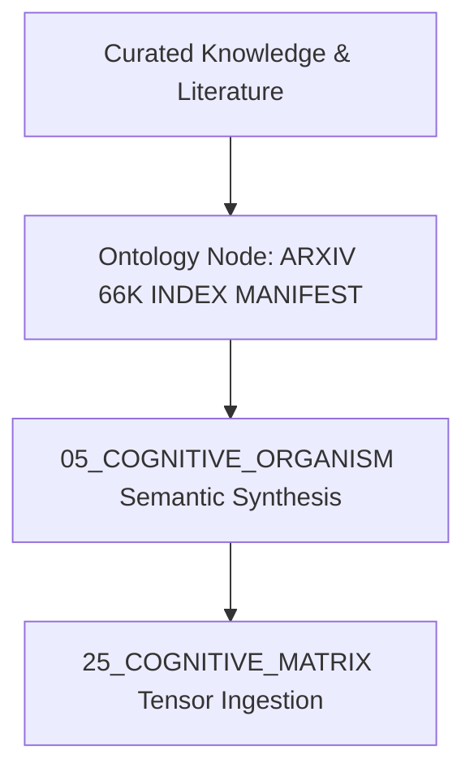

# ARXIV 66K INDEX MANIFEST — Curated Domain Knowledge Architecture

## 1. Domain Knowledge Overview
Authoritative knowledge synthesis and mathematical representation for **ARXIV 66K INDEX MANIFEST** in the AMOS Knowledge Base (11_KNOWLEDGE).

- **Knowledge Domain**: High-density theoretical foundations, algorithmic models, and state integration.
- **Epistemic Class**: `DERIVED / KNOWLEDGE_SYNTHESIS`
- **Origin Architect**: Trang Phan
- **Target Version**: AMOS `v4.4`

---

## 2. Theoretical Formulation & Knowledge Dynamics

The knowledge density metric $\mathcal{K}(e)$ over domain entity $e$ is parameterized by:

$$\mathcal{K}(e) = \sum_{j \in \text{relations}} w_j \cdot \log_2 \left( 1 + \frac{\text{Evidence}(e, r_j)}{\sigma_j^2} \right)$$

## 2a. arXiv 66K Index Architecture

### Index scope
- **66,000+ arXiv papers**: indexed from arXiv API across CS.AI, CS.CL, CS.LG, CS.MA, q-bio.NC, quant-ph, stat.ML, cs.HC, cs.NE, cs.RO
- **Index fields**: arxiv_id, title, authors, abstract, categories, submitted_date, primary_category, doi, pdf_url
- **Storage**: 11_KNOWLEDGE/_arxiv_md/ directory; one .md file per paper with frontmatter + abstract
- **MOC**: 11_KNOWLEDGE/_arxiv_md/_arxiv_md_MOC.md — master index with category-based navigation

### Index categories (AMOS-relevant)
- **CS.AI (Artificial Intelligence)**: ~15K papers; reasoning, planning, multi-agent systems, AGI
- **CS.CL (Computation & Language)**: ~12K papers; LLMs, transformers, NLP, tokenization
- **CS.LG (Machine Learning)**: ~18K papers; deep learning, optimization, generalization
- **Q-BIO.NC (Neurons & Cognition)**: ~3K papers; BCI, neural coding, computational neuroscience
- **QUANT-PH (Quantum Physics)**: ~8K papers; quantum computing, quantum ML, quantum information
- **STAT.ML (Statistics - ML)**: ~5K papers; Bayesian methods, causal inference, statistical learning
- **CS.HC (Human-Computer Interaction)**: ~2K papers; BCI interfaces, HCI, UX
- **CS.RO (Robotics)**: ~3K papers; robotic control, embodied AI, multi-robot systems

### Index maintenance
- **Refresh**: periodic arXiv API sync; incremental updates via OAI-PMH protocol
- **Deduplication**: arxiv_id as primary key; DOI cross-reference; title similarity check
- **Quality**: abstract completeness check; category validation; author disambiguation
- **Search**: full-text search via Obsidian search; category filtering via MOC; tag-based retrieval

## 2b. AMOS Integration

- **arXiv MOC**: [[11_KNOWLEDGE/_arxiv_md/_arxiv_md_MOC|_arxiv_md MOC]] — master arXiv index
- **Knowledge MOC**: [[11_KNOWLEDGE/11_KNOWLEDGE_MOC|11_KNOWLEDGE_MOC]] — parent knowledge plane
- **Research plane**: [[22_RESEARCH/22_RESEARCH_MOC|22_RESEARCH_MOC]] — SOTA research tracking
- **LLM wiki**: [[11_KNOWLEDGE/LLM_WIKI/LLM_WIKI_MOC|LLM Wiki MOC]] — LLM knowledge synthesis
- **BCI/AI/Quantum SOTA**: [[22_RESEARCH/BCI_AI_QUANTUM_SOTA_2026-09-04|BCI/AI/Quantum SOTA]] — latest research ingestion

## 2c. Invariants

1. `INDEXED != UNDERSTOOD` — indexing a paper does not imply understanding its content
2. All arXiv claims must cite provenance (arxiv_id, title, authors, date)
3. arXiv preprints are SOURCE_CLAIM — not peer-reviewed OBSERVATION
4. Index freshness must be tracked — stale indices flagged for refresh
5. `LATEST != AUTHORITATIVE` — newer papers are not automatically more authoritative

## 3. Cross-Plane Architectural Bindings

- **Master Knowledge MOC**: [[11_KNOWLEDGE/11_KNOWLEDGE_MOC]].
- **Cognitive Matrix Mapping**: [[25_COGNITIVE_MATRIX/00_INDEX/COGNITIVE_MATRIX_MOC]].
- **Research Plane Correlation**: [[22_RESEARCH/22_RESEARCH_MOC]].
