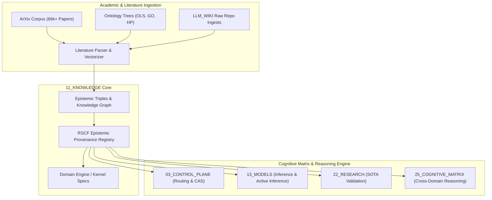

# 11 Knowledge — README

> **Origin Architect / Steward:** Trang Phan
> **AMOS_CORE Target:** v4.4
> **Status:** ACTIVE
> **Plane Index:** Plane 11 of 26

## Role

The Knowledge Plane owns all governed reusable claims, domain knowledge, evidence synthesis, and epistemic infrastructure within AMOS OS. It is the unified epistemic substrate that bridges local Obsidian graph structures with external scientific literature, ontology hierarchies, multi-modal knowledge embeddings, and the Trang Framework's recursive ontology dynamics.

**Knowledge is what is KNOWN** — distinct from what IS (state, owned by `04_RUNTIME` and `10_MEMORY`) and what HAPPENED (history, owned by `10_MEMORY`).

## Core Principle

```
Knowledge is governed, not merely collected.
Every claim carries an epistemic_class, provenance, and RSCF state.
Knowledge promotes through evidence; it does not self-certify.
```

## Directory Structure

```
11_KNOWLEDGE/
├── 00_INDEX/              ← Knowledge indices, maps, and navigation registries
├── 02_CLAIMS/             ← Claim registries (Canon, Framework, Heritage, UBI)
├── 03_RSCF/               ← RSCF epistemic state indices by domain
├── 05_FRAMEWORKS/         ← AMOS frameworks (UBI, NeuroSyncAI, Trang, Heritage, QLS)
├── 06_DOMAIN_KNOWLEDGE/   ← Domain-specific knowledge artifacts (Heritage, UBI)
├── AMOS_L/                ← AMOS_L language definitions (AST, grammar, semantics)
├── AMOS_LANGUAGE/         ← AMOS language breakthrough specifications
├── AMOS_L_COMPILER/       ← Reference interpreter and compiler skeletons
├── LLM_WIKI/              ← LLM wiki with raw ingested repos and curated wiki
│   ├── raw/               ← Raw ingested SOTA repo READMEs and specifications
│   └── wiki/              ← Curated wiki entries, indexes, and operations logs
├── engine/                ← Domain engine specifications (198+ engine files)
├── kernel/                ← Domain kernel specifications (110+ kernel files)
├── raw/                   ← Raw framework transcripts
├── stubs/                 ← Brain inventory, modes, and automation profiles
├── trang/                 ← Trang Framework files (codex, equations, lineage)
└── _arxiv_md/             ← ArXiv 66k+ paper indexing substrate
```

## Ingestion & Synthesis Pipeline

The Knowledge Plane ingests external literature and internal reasoning artifacts through a staged pipeline:



- `_arxiv_md/`: Authoritative entrypoint and indexing substrate for ArXiv preprints, mathematical proofs, quantum computing architectures, and BCI paradigms (see [[11_KNOWLEDGE/_arxiv_md/_arxiv_md_MOC|_arxiv_md_MOC]]).
- `LLM_WIKI/`: Curated and raw SOTA repository knowledge from Addy Osmani, Anthropic, AIOS, AgentFactory, and others (see [[11_KNOWLEDGE/LLM_WIKI/LLM_WIKI_MOC|LLM_WIKI_MOC]]).
- `engine/` / `kernel/`: Domain-specific reasoning engines and kernels that operationalize knowledge for C01–C12 domains.

## Key Artifacts

### Domain Knowledge (C01–C12)

The twelve canonical domain master knowledge files form the backbone of AMOS domain expertise:

- [[11_KNOWLEDGE/AMOS_C01_META_LOGIC_MASTER_KNOWLEDGE|C01 Meta-Logic]] — formal logic, meta-reasoning, distinction calculus
- [[11_KNOWLEDGE/AMOS_C02_MATH_COMPUTE_MASTER_KNOWLEDGE|C02 Math-Compute]] — mathematical foundations, computation theory
- [[11_KNOWLEDGE/AMOS_C03_PHYSICS_COSMOS_MASTER_KNOWLEDGE|C03 Physics-Cosmos]] — physics, cosmology, quantum dynamics
- [[11_KNOWLEDGE/AMOS_C04_BIO_NEURO_MASTER_KNOWLEDGE|C04 Bio-Neuro]] — biology, neuroscience, BCI state-of-art
- [[11_KNOWLEDGE/AMOS_C05_MIND_BEHAVIOR_MASTER_KNOWLEDGE|C05 Mind-Behavior]] — cognitive science, psychology
- [[11_KNOWLEDGE/AMOS_C06_SOCIETY_CULTURE_MASTER_KNOWLEDGE|C06 Society-Culture]] — sociology, cultural studies
- [[11_KNOWLEDGE/AMOS_C07_ECON_FINANCE_MASTER_KNOWLEDGE|C07 Econ-Finance]] — economics, financial systems
- [[11_KNOWLEDGE/AMOS_C08_STRATEGY_GAME_MASTER_KNOWLEDGE|C08 Strategy-Game]] — game theory, strategic decision-making
- [[11_KNOWLEDGE/AMOS_C09_ORG_LAW_POLICY_MASTER_KNOWLEDGE|C09 Org-Law-Policy]] — organizational, legal, policy
- [[11_KNOWLEDGE/AMOS_C10_TECH_ENGINEERING_MASTER_KNOWLEDGE|C10 Tech-Engineering]] — engineering, technology
- [[11_KNOWLEDGE/AMOS_C11_DESIGN_LANGUAGE_MASTER_KNOWLEDGE|C11 Design-Language]] — design, linguistics
- [[11_KNOWLEDGE/AMOS_C12_EARTH_ECOLOGY_MASTER_KNOWLEDGE|C12 Earth-Ecology]] — earth science, ecology

### Frameworks (05_FRAMEWORKS)

Over 90 framework files including UBI, NeuroSyncAI, Trang Grand System, Heritage, QLS/QCLA, and structural integrity frameworks. See [[11_KNOWLEDGE/05_FRAMEWORKS/05_FRAMEWORKS_MOC|05_FRAMEWORKS_MOC]].

### Trang Framework Files

Trang Framework's recursive ontology dynamics, grand system codex, meta-laws, prediction engine (TPE), and seven cycles (TSS). Located in `trang/`. See [[11_KNOWLEDGE/TRANG_FRAMEWORK_RECURSIVE_ONTOLOGY_DYNAMICS|TRANG_FRAMEWORK_RECURSIVE_ONTOLOGY_DYNAMICS]].

### Engine / Kernel Specifications

- `engine/` — 198+ domain engine specifications covering coding, cognition, behavior, finance, governance, legal, medical, and technical domains.
- `kernel/` — 110+ domain kernel specifications that define the canonical contracts for each engine.

## MOC Structure

The Knowledge MOC ([[11_KNOWLEDGE/11_KNOWLEDGE_MOC|11_KNOWLEDGE_MOC]]) indexes 655 nodes across all subdirectories, governed by [[00_ROOT/00_ROOT_MOC|00_ROOT_MOC]].

## Cross-Plane Relationships

- **Canon:** [[01_CANON/01_CANON_MOC|01_CANON_MOC]] — Canon defines what knowledge IS; Knowledge contains the knowledge itself. Knowledge promotes to Canon with governance approval.
- **Kernel:** [[02_KERNEL/02_KERNEL_MOC|02_KERNEL_MOC]] — Kernel validates knowledge claims against epistemic invariants. Knowledge provides evidence for kernel-level causal reasoning.
- **Research:** [[22_RESEARCH/22_RESEARCH_README|22_RESEARCH_README]] — Research produces SOTA evidence that feeds into Knowledge. Knowledge provides the substrate for research validation.
- **Memory:** [[10_MEMORY/10_MEMORY_MOC|10_MEMORY_MOC]] — Memory records what happened; Knowledge records what is known. Knowledge is derived from memory through evidence-weighted promotion.
- **Domains:** [[21_DOMAINS/21_DOMAINS_README|21_DOMAINS_README]] — Domains organize knowledge by subject matter; Knowledge provides the epistemic infrastructure.
- **Cognitive Matrix:** [[25_COGNITIVE_MATRIX/25_COGNITIVE_MATRIX_README|25_COGNITIVE_MATRIX_README]] — Cognitive Matrix consumes knowledge for cross-domain reasoning.

## Canonical Laws Governing

- **L1 (Axiomatic Grounding):** All knowledge claims must carry an explicit `epistemic_class` (`SOURCE_CLAIM`, `OBSERVATION`, `DERIVED`, `MODEL`, `DECISION`, `UNKNOWN/GAP`).
- **L2 (Provenance Preservation):** Ingested knowledge must reference DOI, ArXiv ID, or cryptographic hash.
- **L3 (Graph Integrity):** Every node maintains bidirectional cross-references with zero dangling links.
- **M07 (Canon ≠ Implementation):** Knowledge specifications are not runtime implementations.
- **CAPABILITY ≠ AUTHORITY:** Knowledge capability does not grant execution authority.

## Entry Points

- **Master MOC:** [[11_KNOWLEDGE/11_KNOWLEDGE_MOC|11_KNOWLEDGE_MOC]] — 655-node navigation index
- **Knowledge Contract:** [[11_KNOWLEDGE/KNOWLEDGE_CONTRACT|KNOWLEDGE_CONTRACT]] — invariant governance and RSCF boundaries
- **ArXiv Index:** [[11_KNOWLEDGE/_arxiv_md/_arxiv_md_MOC|_arxiv_md_MOC]] — 66k+ paper substrate
- **LLM Wiki:** [[11_KNOWLEDGE/LLM_WIKI/LLM_WIKI_MOC|LLM_WIKI_MOC]] — SOTA repo wiki
- **Claims MOC:** [[11_KNOWLEDGE/02_CLAIMS/02_CLAIMS_MOC|02_CLAIMS_MOC]] — claim registry navigation
- **RSCF MOC:** [[11_KNOWLEDGE/03_RSCF/03_RSCF_MOC|03_RSCF_MOC]] — epistemic state indices

## Implementation Status

- **Structural completeness:** 655 indexed nodes across all subdirectories, 0 orphans
- **Epistemic classification:** All nodes carry RSCF state and epistemic class
- **ArXiv ingestion:** 66,000+ papers indexed in `_arxiv_md/` substrate
- **LLM Wiki:** 47+ raw SOTA repo READMEs ingested, curated wiki entries maintained
- **Domain knowledge:** C01–C12 master knowledge files complete
- **Executable closure:** `UNKNOWN/GAP` — structural presence does not establish runtime implementation

## AMOS MECE Alignment

The Knowledge Plane is Plane 11 of 26 in the AMOS OS architecture. It is mutually exclusive from Memory (`10_MEMORY`, which records history) and Domains (`21_DOMAINS`, which organizes subject-matter routing). It is collectively exhaustive with all other planes in covering the epistemic substrate of AMOS OS. The Knowledge Plane's MECE boundary is defined by its contract: it owns governed reusable claims and epistemic infrastructure, not runtime state, agent definitions, or operational execution.

______________________________________________________________________

**Parent:** [[00_ROOT/00_HOME|00_HOME]] · [[00_ROOT/00_ROOT_MOC|00_ROOT_MOC]]
