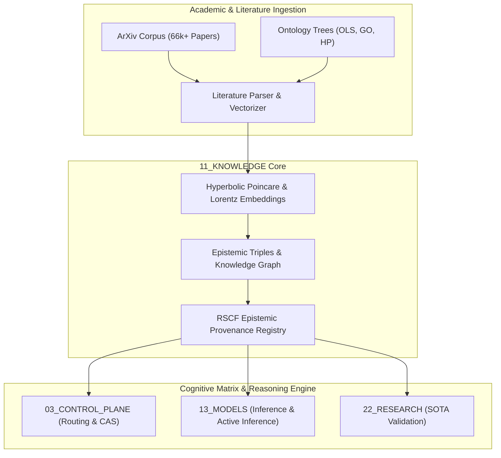

# Knowledge Plane (11_KNOWLEDGE)

> **Origin Architect / Steward:** Trang Phan
> **AMOS_CORE Target:** v4.4
> **Status:** ACTIVE_SPECIFICATION
> **Plane Index:** Plane 11 of 26

## 1. Overview & Architectural Role

The **Knowledge Plane (`11_KNOWLEDGE`)** serves as the unified epistemic substrate, graph indexing layer, and multi-source academic/scientific ingestion foundation for AMOS OS. It bridges local Obsidian graph structures with massive external scientific literature repositories (including the 66,000+ indexed papers in `_arxiv_md`), ontology lookup hierarchies (GO, DOID, HP), chemical databases (ChEMBL, PubChem), and multi-modal knowledge embeddings.

## 2. Directory Structure & Substrates

- `_arxiv_md/`: Authoritative entrypoint and indexing substrate for ArXiv preprints, mathematical proofs, quantum computing architectures, and BCI paradigms (see [[11_KNOWLEDGE/_arxiv_md/_arxiv_md_MOC|_arxiv_md_MOC]]).
- `01_CANONICAL_INDEX/`: Master concept indices and semantic cross-references.
- `02_ONTOLOGY_MAPPINGS/`: Bi-directional maps linking biological, physical, and cognitive ontologies.
- `KNOWLEDGE_KNOWLEDGE_CONTRACT.md`: Invariant governance and RSCF state boundaries for all knowledge nodes.

## 3. Epistemic Invariants & Contract Boundaries

1. **Axiomatic Grounding**: All asserted claims must carry an explicit `epistemic_class` (`SOURCE_CLAIM`, `OBSERVATION`, `DERIVED`, `MODEL`, `DECISION`, `UNKNOWN/GAP`).
2. **Provenance Preservation**: Knowledge items ingested from external literature must reference DOI, ArXiv ID, or cryptographic hash.
3. **Graph Integrity**: Every node must maintain bidirectional cross-references with zero dangling links or unverified transitive closures.

## 4. Key References & Navigation

- Master Invariant Contract: [[11_KNOWLEDGE/KNOWLEDGE_KNOWLEDGE_CONTRACT|Knowledge Invariant Contract]]
- ArXiv Knowledge Index: [[11_KNOWLEDGE/_arxiv_md/_arxiv_md_MOC|_arxiv_md_MOC]]
- Cognitive Vault Resolver: [[03_CONTROL_PLANE/COGNITIVE_VAULT_RESOLVER|Cognitive Vault Resolver]]
- Root Navigation: [[00_ROOT/00_ROOT_MOC|00_ROOT_MOC]]
