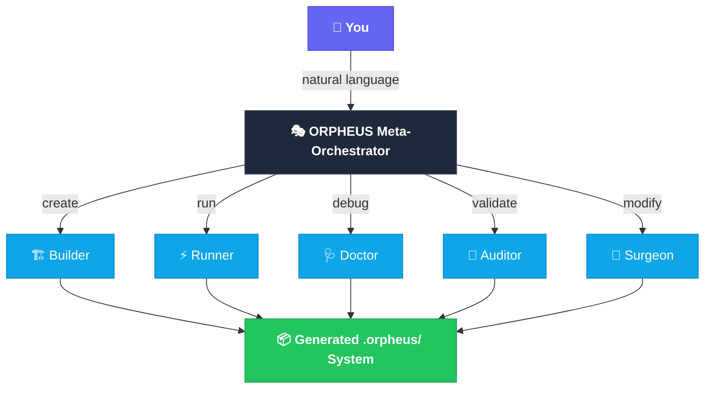
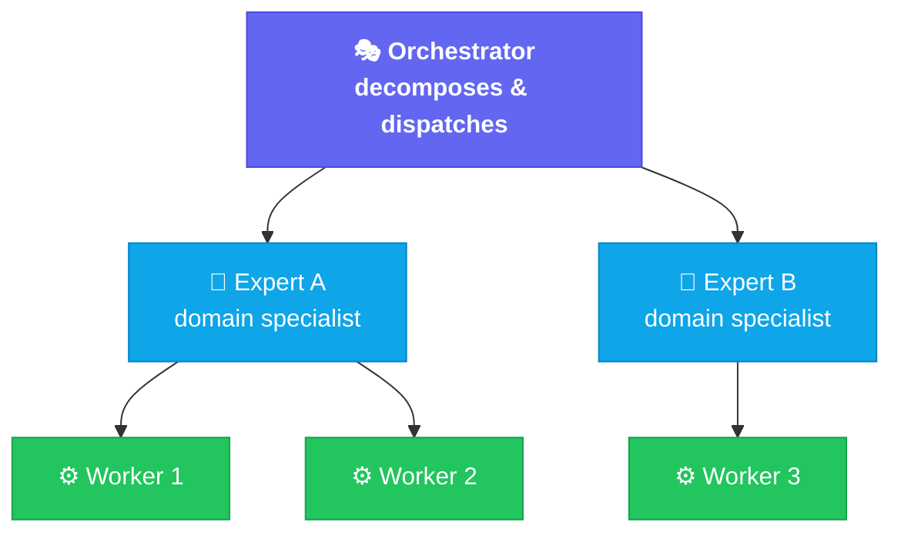

# ORPHEUS README — Raw Capture

Source: `https://github.com/nuryslyrt/ORPHEUS`


<table>
<tr>
<td width="300" align="center">

</td>
<td>
<h1>ORPHEUS</h1>
<b>Orchestrated Runtime Protocol for Hierarchical Execution Unified Skills</b>
<br/><br/>
<i>Build multi-skill AI systems in seconds. No code. No infrastructure. Just describe what you want.</i>
<br/><br/>
<a href="#installation">Install</a> &nbsp;|&nbsp;
<a href="#quick-start">Quick Start</a> &nbsp;|&nbsp;
<a href="https://thinkingtokens.ai/2026/04/orpheus-framework/">Blog Post</a> &nbsp;|&nbsp;
<a href="PRINCIPLES.md">Principles</a> &nbsp;|&nbsp;
<a href="USER-GUIDE.md">User Guide</a>         
</td>
</tr>
</table>

---

```
You:     "Build me a content pipeline that researches topics, writes articles,
          reviews for accuracy, and publishes to my blog"

ORPHEUS:  ✓ Analyzed → 4 experts, 5 workers, 4-stage sequential pipeline
          ✓ Generated → orchestrator, contracts, registry, scripts
          ✓ Validated → DAG clean, contracts compatible
          ✓ Ready in 30 seconds. Run it whenever you want.
```

---

## The Problem

You want to automate a multi-step workflow with AI. So you reach for a multi-agent framework. Now you need:

- N separate LLM instances, each with its own context
- Inter-agent communication (HTTP, gRPC, message queues)
- State management (databases, checkpoints)
- Deployment infrastructure (Docker, services, orchestrators)
- Python/TypeScript glue code to wire it all together
- Monitoring and observability tools

All this to coordinate a few LLM calls.

## The ORPHEUS Approach

**What if most "agents" are just a prompt + a tool list + a routing rule?**

Your coding agent already has LLM reasoning, tool access, web search, code execution, file I/O, and subagent spawning. ORPHEUS structures these existing capabilities into composable **skills** — no new infrastructure required.

| | Multi-Agent | ORPHEUS |
|:---|:---|:---|
| Runtime | N LLM instances | 1 coding agent |
| Communication | HTTP/gRPC/queues | Filesystem |
| Deployment | N services | 1 folder |
| Configuration | Python/YAML code | Natural language |
| New capability | Deploy a service | Write a markdown file |
| Observability | External tools | Built-in decision logs |
| Dependencies | pip/npm/docker | **None** |

## How It Works

### Describe → Generate → Run → Evolve

```
┌──────────────────────────────────────────────────────────────────────┐
│                                                                      │
│  Step 1: DESCRIBE                                                    │
│  "Build a system that researches a topic, writes an article,         │
│   reviews it for accuracy, and publishes to my blog"                 │
│                                                                      │
│  Step 2: GENERATE                                                    │
│  ORPHEUS creates .orpheus/ with orchestrator, 4 experts,             │
│  5 workers, contracts, scripts — validated and ready                 │
│                                                                      │
│  Step 3: RUN                                                         │
│  "Research quantum computing and publish"                            │
│  → Research + scanning in parallel → write → review → publish        │
│                                                                      │
│  Step 4: EVOLVE                                                      │
│  "Why did the review step fail?"     → Doctor fixes it               │
│  "Add a fact-checker before writing" → Surgeon restructures          │
│  "Is my system healthy?"             → Auditor validates             │
│                                                                      │
└──────────────────────────────────────────────────────────────────────┘
```

The entire lifecycle — create, run, diagnose, validate, modify — through natural language. Same interface, same conversation.

## Architecture



Every generated system follows the same pattern:



- **Orchestrator** decomposes requests into jobs, dispatches to experts, aggregates results
- **Experts** own job types, decide strategy, delegate to workers when needed
- **Workers** execute atomic tasks — reusable across any expert
- **Contracts** define typed I/O between skills for safe composition

## The Meta-System

ORPHEUS manages itself using its own patterns — 4 experts sharing 7 reusable workers:

| Expert | What It Does | When You'd Use It |
|:-------|:-------------|:------------------|
| **🏗️ Builder** | Creates new skill systems from natural language | *"Build me a system that..."* |
| **🩺 Doctor** | Diagnoses failures, traces root cause, applies behavioral fixes | *"Why did the research step fail?"* |
| **🏥 Auditor** | Runs 7 health checks, produces score and recommendations | *"Validate my system"* |
| **🔧 Surgeon** | Structural modifications with cascading effect analysis | *"Add a fact-checker between research and writing"* |

## Installation

**Prerequisites:** [Claude Code](https://docs.anthropic.com/en/docs/claude-code) CLI

```bash
git clone https://github.com/user/ORPHEUS.git
cp -r ORPHEUS/skill/ ~/.claude/skills/orpheus/
chmod +x ~/.claude/skills/orpheus/scripts/*
```

That's it. No pip, no npm, no docker. ORPHEUS is now available in every Claude Code session.

## Quick Start

**1. Create a project folder and open Claude Code:**

```bash
mkdir my-first-pipeline && cd my-first-pipeline
```

**2. Build a system:**

```
Build me an ORPHEUS system that takes a URL, scrapes the content,
summarizes the key points, and saves a markdown report.
```

**3. Run it:**

```
Run the pipeline against https://example.com
```

**4. See what happened:**

```
Validate my system
```

Three prompts. Zero code. Working pipeline.

## Usage Patterns

**Project-local** — each system lives in its project directory:
```bash
cd ~/my-project             # has .orpheus/
"Run the pipeline"          # ORPHEUS detects and executes
```

**Collections** — keep multiple systems as siblings:
```
~/projects/
├── pentest-system/.orpheus/        # cd here → pentest
├── content-pipeline/.orpheus/      # cd here → content
└── code-review/.orpheus/           # cd here → review
```

**Standalone** — install as a named skill for global access:
```
"Install this system as a standalone skill"
# Now triggers by name from any directory
```

## What Gets Generated

```
.orpheus/
├── system.yaml                # Configuration (strategy, retries, logging)
├── registry.yaml              # Skill inventory
├── orchestrator/SKILL.md      # Orchestration logic + routing rules
├── experts/{name}/            # Domain specialists
│   ├── SKILL.md               #   protocol, quality gate, logging
│   └── contract.yaml          #   typed I/O schema
├── workers/{name}/            # Atomic task executors
│   ├── SKILL.md               #   task protocol, output format
│   └── contract.yaml          #   typed I/O schema
├── scripts/                   # Self-contained runtime
└── logs/                      # Decision trails + execution history
```

Systems are **fully self-contained** — runtime scripts are bundled in. No dependency on the global ORPHEUS install.

## Decision Transparency

ORPHEUS doesn't just log what happened. It logs **why**.

```yaml
decision:
  question: "Should this job be handled directly or delegated to workers?"
  options_considered:
    - "direct execution"
    - "delegate to 2 parallel workers"
  chosen: "delegate to 2 parallel workers"
  reasoning: "Topic is broad, requiring searches across multiple
    sub-domains. Parallel workers cover more ground in less time."
  confidence: 0.88
```

The Doctor reads these trails to diagnose issues — tracing not just the failure, but the reasoning that caused it.

## Error Chain Preservation

Errors are never flattened. The full chain from root cause to symptom:

```yaml
error:
  level: orchestrator
  message: "Job 'vuln-analysis' failed after 2 retries"
  original_error:
    level: expert
    message: "CVE lookup failed — worker returned empty results"
    original_error:
      level: worker
      message: "WebSearch returned 0 results for 'CVE Apache 2.4.41'"
```

Every level preserves the original. The Doctor — and you — always see the root cause.

## Design Decisions

| Decision | Why |
|:---------|:----|
| **Skills, not agents** | Most orchestration doesn't need separate LLM instances. Skills are lighter and composable. |
| **Coding agent is the runtime** | Zero infrastructure. No packages, no services, no deployment. |
| **Filesystem as state bus** | Files persist across subagent boundaries. Natural audit trail. |
| **Inline execution** | Runner operates in 3 nesting levels, preserving conversation context. |
| **Self-contained systems** | Generated systems carry their own scripts. Portable and independent. |
| **Error chains** | Full root-cause traceability across all nesting levels. |
| **Decision logging** | Every decision records alternatives and reasoning. Enables the Doctor. |
| **Context packaging** | User constraints forwarded to subagents. No "lost context" problem. |
| **Composition over configuration** | Simple skills compose into complex systems. No DSL to learn. |

## Documentation

**[PRINCIPLES.md](PRINCIPLES.md):** The 10 core principles — the philosophical foundation 

**[USER-GUIDE.md](USER-GUIDE.md):** A detailed user guide explains how you can talk to ORPHEUS for creating better Orpheus systems.

**[skill/references/PROVABLE_ASSURANCE.md](skill/references/PROVABLE_ASSURANCE.md):** Provable Assurance for ORPHEUS systems — the framing behind the Auditor's claim matrix and evidence package output, with a concrete evaluation method for measuring whether the capability adds value. Based on the whitepaper *[Provable Assurance for Agentic Systems](https://github.com/schwartz1375/ArtificialDiaries/blob/main/PDFs/provable_assurance_agentic_systems_whitepaper.pdf)* (Schwartz, 2026).


## License

**[AGPL v3](LICENSE)**

ORPHEUS is free software. Use, modify, and distribute under the GNU Affero General Public License v3. Network service deployments must share modifications under the same license.

For commercial licensing (use without AGPL obligations), contact the author.
