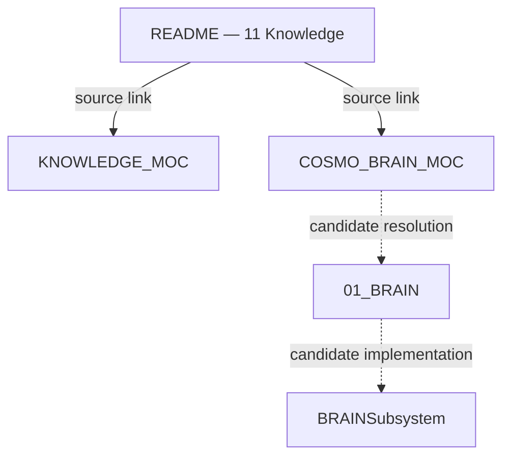
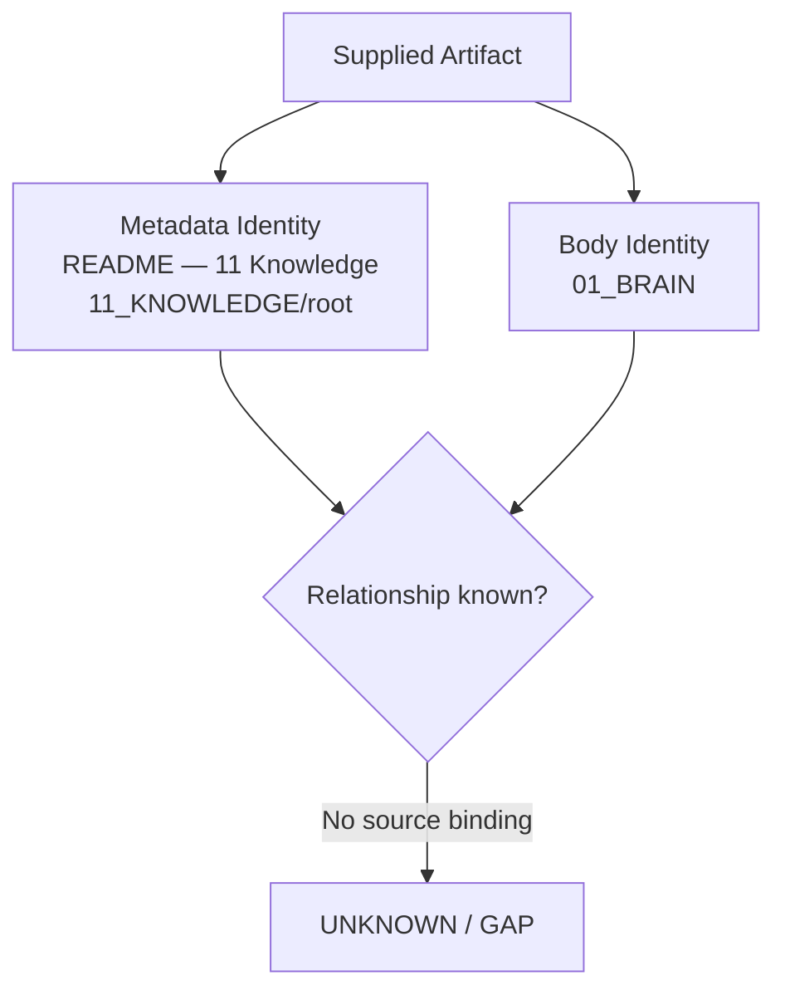
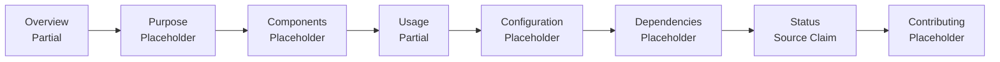
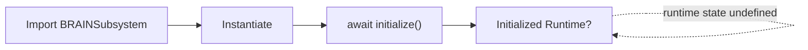

---
tags:
- knowledge
- readme.md
- readme
- cosmo-brain-moc
- knowledge-moc
- kernel-moc
- 00-home
---

# 01_BRAIN

## Overview

The 01_BRAIN subsystem is a core component of the AMOS system.

## Purpose

This subsystem handles...

## Components

- Component 1: Description
- Component 2: Description

## Usage

```python
from 01_BRAIN.main import BRAINSubsystem

subsystem = BRAINSubsystem()

await subsystem.initialize()
---

> [!note] Source preface
>
> ---
> title: README — 11 Knowledge
> tags:
> - moc
> - index
> - canon/knowledge
> type: document
> source: 11_KNOWLEDGE/root
> rscf:
>   state: SOURCE_CLAIM
>   claim_class: SOURCE_CLAIM
>   provenance: AMOS_corpus
>   scope: AMOS_knowledge
> ---
>
> # README
>
> > **Source note**: Below is a **source-preserving, full Obsidian-ready canonical expansion with tagging**. The supplied frontmatter and source text remain the source layer; inferred structure, proposed tags, corrected executable examples, and vault enhancements are explicitly separated as **DERIVED / PROPOSED**.
>
> A de...
>
>
> # README — 11 Knowledge
>
> > [!abstract] Source Boundary
> > This note is a source-grounded expansion of the supplied `README — 11 Knowledge` artifact.
> >
> > The source metadata places the artifact in:
> >
> > `11_KNOWLEDGE/root`
> >
> > while the body begins:
> >
> > `# 01_BRAIN`
> >
> > and describes an `01_BRAIN` subsystem.
> >
> > This discrepancy is preserved as an **UNRESOLVED SOURCE STRUCTURE GAP** rather than silently corrected.
> >
> > The body also contains placeholder-style descriptions such as:
> >
> > - `This subsystem handles...`
> > - `Component 1: Description`
> > - `Configuration options...`
> > - `Other AMOS subsystems`
> > - `Required libraries`
> >
> > Therefore the source establishes the presence and intended documentation structure of the subsystem description, but it does **not** provide enough detail to reconstruct the missing implementation canon.
>
> ---
>
> # 0. Canonical Source Receipt
>
> ## 0.1 Source Metadata
>
> | Field | Source Value | Class |
> |---|---|---|
> | `title` | `README — 11 Knowledge` | SOURCE_GROUNDED |
> | `tags` | `moc`, `index`, `canon/knowledge` | SOURCE_GROUNDED |
> | `type` | `document` | SOURCE_GROUNDED |
> | `source` | `11_KNOWLEDGE/root` | SOURCE_GROUNDED |
> | `rscf.state` | `SOURCE_CLAIM` | SOURCE_GROUNDED |
> | `rscf.claim_class` | `SOURCE_CLAIM` | SOURCE_GROUNDED |
> | `rscf.provenance` | `AMOS_corpus` | SOURCE_GROUNDED |
> | `rscf.scope` | `AMOS_knowledge` | SOURCE_GROUNDED |
> | Body heading | `01_BRAIN` | SOURCE_GROUNDED |
> | Linked MOC | `` | SOURCE_GROUNDED |
> | Linked MOC | `` | SOURCE_GROUNDED |
>
> ---
>
> # 1. Source Identity
>
> The supplied metadata identifies the artifact as:
>
> ```yaml
> title: README — 11 Knowledge
> source: "11_KNOWLEDGE/root"
> type: document
> ````
>
> The supplied body identifies its primary subject as:
>
> ```text
> 01_BRAIN
> ```
>
> Therefore the current source receipt contains two structural identities:
>
> $$
> ArtifactLocation = 11\_KNOWLEDGE/root
> $$
>
> and:
>
> $$
> BodySubject = 01\_BRAIN
> $$
>
> No supplied statement explains the relationship.
>
> Canonical classification:
>
> ```yaml
> artifact_identity:
>   metadata_identity:
>     title: "README — 11 Knowledge"
>     location: "11_KNOWLEDGE/root"
>
>   body_identity:
>     primary_heading: "01_BRAIN"
>
>   relationship:
>     state: UNKNOWN
>     class: GAP
> ```
>
> ---
>
> # 2. Identity Mismatch
>
> The mismatch must not be silently normalized into either of these assumptions:
>
> ```text
> README — 11 Knowledge == README — 01_BRAIN
> ```
>
> or:
>
> ```text
> 11_KNOWLEDGE == 01_BRAIN
> ```
>
> Neither identity is established.
>
> The source may represent several possibilities.
>
> ### H1 — README Content Drift
>
> The metadata correctly identifies an `11_KNOWLEDGE` README, but the body was copied from an `01_BRAIN` template.
>
> ### H2 — Embedded Subsystem Documentation
>
> The `11_KNOWLEDGE` README intentionally documents `01_BRAIN` as a component or knowledge object.
>
> ### H3 — Template Artifact
>
> The body is a generic subsystem README template whose placeholders were not yet replaced.
>
> ### H4 — Path Drift
>
> The body is correct, but the source/path metadata is stale or incorrectly assigned.
>
> ### H5 — Generated Scaffold
>
> The artifact was generated from a standard AMOS subsystem documentation scaffold and has not yet undergone semantic completion.
>
> All remain:
>
> `COMPETING / UNRESOLVED`
>
> until discriminating source evidence exists.
>
> ---
>
> # 3. Source Body
>
> The canonical supplied body is structurally:


## Configuration

Configuration options...

## Dependencies

* Internal: Other AMOS subsystems
* External: Required libraries

## Status

✅ Operational

## Contributing

Follow AMOS development guidelines...

````

Source links:

```markdown
**Links:**  |
````

---

# 4. Epistemic Classification

The frontmatter explicitly declares:

```yaml
rscf:
  state: SOURCE_CLAIM
  claim_class: SOURCE_CLAIM
  provenance: AMOS_corpus
  scope: AMOS_knowledge
```

Therefore the safest artifact-level epistemic classification is:

$$
README_{11K}
\in
SOURCE\_CLAIM.
$$

This means statements in the document are corpus claims unless independently validated elsewhere.

In particular:

```text
✅ Operational
```

is a **SOURCE_CLAIM about operational status**, not independent runtime evidence.

---

# 5. Canonical Purpose Boundary

The artifact visibly performs at least three documentation roles:

1. README-style subsystem description.
2. Index/MOC participation through its tags and links.
3. AMOS knowledge-corpus source claim.

This can be represented as:

$$
ArtifactRole
=
README
+
IndexParticipation
+
KnowledgeCorpusNode.
$$

Classification:

`DERIVED_FROM_SOURCE_STRUCTURE`.

It does not establish that these are the only roles.

---

# 6. 01_BRAIN Overview

## Source Claim

> The 01_BRAIN subsystem is a core component of the AMOS system.

Canonical claim representation:

```yaml
claim:
  subject: "01_BRAIN subsystem"
  predicate: "is a core component of"
  object: "AMOS system"

class: SOURCE_CLAIM
provenance: AMOS_corpus
scope: AMOS_knowledge
```

The source does not define what **core component** means operationally.

---

# 7. Core Component Semantics

The phrase:

```text
core component
```

could mean:

* architecturally central;
* required dependency;
* canonical subsystem;
* frequently used component;
* foundational conceptual module;
* runtime-critical component.

The source does not discriminate among these meanings.

Therefore:

```yaml
core_component:
  source_term: true
  exact_semantics: UNKNOWN
```

---

# 8. AMOS System Identity

The source explicitly refers to:

```text
the AMOS system
```

but does not define its exact system boundary in this artifact.

Do not infer from this README alone:

* exact AMOS version;
* runtime topology;
* subsystem count;
* deployment environment;
* executable architecture;
* dependency graph.

Those require external canon.

---

# 9. Purpose Section

## Source

```text
This subsystem handles...
```

This is visibly incomplete.

Therefore:

```yaml
purpose:
  presence: SOURCE_GROUNDED
  semantic_content: INCOMPLETE
  exact_responsibilities: UNKNOWN
```

The ellipsis must not be filled with invented responsibilities.

---

# 10. Purpose Gap

The missing purpose is a **DECISION-RELEVANT GAP** if this README is used to determine:

* subsystem ownership;
* API responsibility;
* architectural boundaries;
* routing;
* dependency direction;
* implementation tasks.

Minimum missing information:

```text
What exactly does 01_BRAIN handle?
```

---

# 11. Components Section

The source gives:

```text
Component 1: Description
Component 2: Description
```

These are placeholders.

They do not establish actual component names.

Canonical representation:

```yaml
components:
  declared_slots:
    - slot: 1
      name: UNKNOWN
      description: UNKNOWN

    - slot: 2
      name: UNKNOWN
      description: UNKNOWN

  completeness: UNKNOWN
```

---

# 12. Component Count Firewall

The presence of two placeholder bullets does **not** prove that `01_BRAIN` has exactly two components.

Therefore:

$$
VisiblePlaceholderRows=2
$$

but:

$$
ActualComponentCount=UNKNOWN.
$$

Do not infer:

$$
ActualComponentCount=2.
$$

---

# 13. Usage Section

The source provides:

```python
from 01_BRAIN.main import BRAINSubsystem

subsystem = BRAINSubsystem()

await subsystem.initialize()
```

This expresses an intended usage pattern:

$$
Import
\rightarrow
Instantiate
\rightarrow
Initialize.
$$

That sequence is source-grounded at the documentation level.

---

# 14. Python Syntax Boundary

The supplied import statement is:

```python
from 01_BRAIN.main import BRAINSubsystem
```

Under ordinary Python syntax, a dotted import path is composed of identifiers, and a normal identifier cannot begin with a decimal digit.

Therefore the literal statement should **not** be silently represented as independently validated executable Python.

Canonical status:

```yaml
usage_example:
  source_presence: VERIFIED_FROM_SUPPLIED_SOURCE
  intended_language: Python
  literal_runtime_validity: NOT_ESTABLISHED
  import_path_issue: PRESENT
```

---

# 15. Do Not Silently Repair Import Path

Potential alternatives might include forms such as:

```text
brain
amos.brain
brain_01
amos_01_brain
```

or dynamic import mechanisms.

None is supplied.

Therefore the canonical artifact must preserve:

```python
from 01_BRAIN.main import BRAINSubsystem
```

as the source claim while marking executable resolution as a gap.

---

# 16. BRAINSubsystem

The source names:

```text
BRAINSubsystem
```

This establishes a source-level class/interface name.

It does **not** independently establish:

* class implementation;
* inheritance;
* constructor signature;
* source file;
* package existence;
* runtime availability;
* initialization contract;
* shutdown contract.

---

# 17. Constructor

Source:

```python
subsystem = BRAINSubsystem()
```

This suggests a zero-explicit-argument constructor in the documentation example.

But it does not prove the runtime constructor actually accepts no arguments.

Therefore:

```yaml
BRAINSubsystem_constructor:
  documentation_example:
    explicit_arguments: 0

  runtime_signature:
    status: UNKNOWN
```

---

# 18. Async Initialization

Source:

```python
await subsystem.initialize()
```

This indicates that the documentation intends `initialize()` to be awaitable.

Safe structural representation:

$$
BRAINSubsystem
\xrightarrow{initialize()}
InitializedState
$$

with asynchronous invocation semantics implied by `await`.

Actual implementation remains unverified.

---

# 19. Initialization State Machine

A minimal derived model is:

```text
UNINSTANTIATED
      │
      ▼
INSTANTIATED
      │
      │ await initialize()
      ▼
INITIALIZED?
```

The final state is marked with `?` because the source does not define:

* success return value;
* failure behavior;
* retries;
* timeout;
* partial initialization;
* rollback;
* idempotence.

---

# 20. Initialization Gaps

Missing contract:

```yaml
initialize:
  async: SUGGESTED_BY_SOURCE_USAGE
  parameters: UNKNOWN
  return_type: UNKNOWN
  success_condition: UNKNOWN
  failure_modes: UNKNOWN
  retry_policy: UNKNOWN
  timeout: UNKNOWN
  rollback: UNKNOWN
  idempotent: UNKNOWN
  dependencies_initialized_first: UNKNOWN
```

---

# 21. Configuration

Source:

```text
Configuration options...
```

This establishes a configuration section but no actual options.

Therefore:

```yaml
configuration:
  supported: SOURCE_SUGGESTED
  options: UNKNOWN
  schema: UNKNOWN
  defaults: UNKNOWN
  validation: UNKNOWN
  environment_overrides: UNKNOWN
  secrets_policy: UNKNOWN
```

---

# 22. Configuration Must Not Be Invented

Do not fabricate fields such as:

```yaml
brain:
  enabled: true
  max_workers: 8
  memory_limit: ...
  reasoning_depth: ...
```

unless supplied by an authoritative configuration artifact.

---

# 23. Dependencies

The source declares two dependency categories:

```text
Internal: Other AMOS subsystems
External: Required libraries
```

This establishes:

$$
Dependencies
=
Internal
\cup
External.
$$

But exact dependency identities are absent.

---

# 24. Internal Dependencies

Source:

```text
Other AMOS subsystems
```

This is non-specific.

Canonical state:

```yaml
internal_dependencies:
  category: "Other AMOS subsystems"
  exact_dependencies: UNKNOWN
```

Do not infer particular subsystems from general AMOS architecture without an explicit dependency binding.

---

# 25. External Dependencies

Source:

```text
Required libraries
```

Again:

```yaml
external_dependencies:
  category: "Required libraries"
  exact_libraries: UNKNOWN
  versions: UNKNOWN
  licenses: UNKNOWN
```

---

# 26. Dependency Direction

The source does not specify whether other AMOS subsystems:

* depend on `01_BRAIN`;
* are depended upon by `01_BRAIN`;
* communicate bidirectionally;
* are optional;
* are dynamically loaded.

Therefore dependency direction is:

`UNKNOWN`.

---

# 27. Dependency Graph

Only this abstract topology is licensed:

```text
             ┌────────────────────┐
             │     01_BRAIN       │
             └─────────┬──────────┘
                       │
             dependency categories
              ┌────────┴────────┐
              ▼                 ▼
       Internal AMOS       External
        subsystems         libraries
```

Exact edges remain unresolved.

---

# 28. Status

Source:

```text
✅ Operational
```

This is an explicit corpus statement.

Canonical epistemic classification:

```yaml
status_claim:
  value: OPERATIONAL
  class: SOURCE_CLAIM
  provenance: AMOS_corpus
  independent_runtime_verification: NOT_PROVIDED
```

---

# 29. Operational ≠ Independently Verified

The artifact does not provide:

* test output;
* health check;
* deployment receipt;
* process status;
* runtime logs;
* benchmark;
* CI result;
* version;
* environment;
* timestamp of operational verification.

Therefore:

$$
SourceSaysOperational
\neq
IndependentRuntimeVerification.
$$

---

# 30. Operational Freshness

No date is supplied for the operational-status statement.

Therefore:

```yaml
operational_status:
  claim: true
  timestamp: UNKNOWN
  freshness: UNKNOWN
  environment: UNKNOWN
```

The status cannot safely be generalized to the present runtime without additional evidence.

---

# 31. Contributing

Source:

```text
Follow AMOS development guidelines...
```

This establishes the existence or intended existence of AMOS development guidelines.

It does not identify the guideline artifact.

Therefore:

```yaml
contributing:
  policy_reference: "AMOS development guidelines"
  exact_artifact: UNKNOWN
```

---

# 32. Contribution Governance Gap

Missing details include:

* coding standards;
* branch policy;
* review requirements;
* test requirements;
* documentation requirements;
* provenance requirements;
* release procedure;
* authority/approval requirements.

Do not invent them here.

---

# 33. Links

Source:

```markdown


```

These are explicit graph links.

Canonical relations are only:

```yaml
links:
  - target: ""
    relation: LINKED_FROM_SOURCE

  - target: ""
    relation: LINKED_FROM_SOURCE
```

The source does not specify stronger edge types.

---

# 34. [[COSMO_BRAIN_MOC]]

The link:

```text

```

provides a candidate route for resolving `01_BRAIN` semantics.

Potential information that may exist there includes:

* brain subsystem taxonomy;
* components;
* architecture;
* relationships.

But those contents are not present in the current source.

Therefore:

`DO_NOT_INVENT`.

---

# 35. [[KNOWLEDGE_MOC]]

The link:

```text

```

is structurally consistent with the artifact's:

```text
source: 11_KNOWLEDGE/root
```

and:

```text
tag: canon/knowledge
```

This provides stronger evidence that the artifact participates in the AMOS knowledge-vault graph.

It still does not resolve why the body is headed `01_BRAIN`.

---

# 36. MOC Role

The source tags include:

```yaml
- moc
- index
```

Thus the artifact is tagged as participating in map-of-content/index behavior.

However:

```yaml
type: document
```

not:

```yaml
type: moc
```

Therefore:

$$
TaggedAsMOC
\neq
TypedAsMOC.
$$

This distinction should be preserved.

---

# 37. Document vs Index

The source simultaneously indicates:

```yaml
type: document
tags:
  - moc
  - index
```

This is not inherently contradictory.

A document may function as an index.

Safe interpretation:

```yaml
artifact_type:
  canonical: document

index_role:
  indicated_by_tags: true

moc_role:
  indicated_by_tags: true
```

---

# 38. Canon/Knowledge Tag

The source tag:

```text
canon/knowledge
```

places the note in a canonical-knowledge tagging namespace.

This does not automatically elevate every body statement to empirically verified truth.

The RSCF classification remains:

```text
SOURCE_CLAIM.
```

Therefore:

$$
CanonTag
\neq
EmpiricalVerification.
$$

---

# 39. Knowledge Canon Boundary

A safe distinction is:

```text
Canonical within corpus
        ≠
verified outside corpus
```

Thus a canonical AMOS model may be authoritative for AMOS architecture while remaining a model/source claim regarding external reality or runtime state.

---

# 40. RSCF Receipt

The supplied RSCF block is:

```yaml
rscf:
  state: SOURCE_CLAIM
  claim_class: SOURCE_CLAIM
  provenance: AMOS_corpus
  scope: AMOS_knowledge
```

This gives four explicit dimensions:

$$
RSCF_{README}
=
(
State,
ClaimClass,
Provenance,
Scope
).
$$

No additional RSCF fields should be silently added to the source layer.

---

# 41. RSCF State

```text
SOURCE_CLAIM
```

indicates that the artifact is received as source-declared information.

It does not independently establish:

```text
VERIFIED
```

or:

```text
EXECUTABLE
```

or:

```text
EMPIRICALLY_VALIDATED.
```

---

# 42. RSCF Claim Class

The claim class is also:

```text
SOURCE_CLAIM.
```

Therefore source-level assertions should inherit this epistemic ceiling unless separately validated.

---

# 43. RSCF Provenance

Source:

```text
AMOS_corpus
```

This establishes corpus provenance at the artifact level.

It does not specify:

* exact original authoring event;
* commit;
* hash;
* version;
* parent document;
* generation pipeline.

Those remain provenance gaps.

---

# 44. RSCF Scope

Source:

```text
AMOS_knowledge
```

Therefore conclusions should remain scoped to AMOS knowledge unless independently generalized.

Formally:

$$
Valid_{AMOS\_knowledge}(C)
\not\Rightarrow
Valid_{ExternalDomain}(C).
$$

---

# 45. H/M/L Structural Representation

A conservative derived H/M/L view is:

```yaml
H:
  domain: "AMOS Knowledge"
  artifact: "README — 11 Knowledge"

M:
  subject: "01_BRAIN"
  sections:
    - Overview
    - Purpose
    - Components
    - Usage
    - Configuration
    - Dependencies
    - Status
    - Contributing

L:
  explicit_details:
    - BRAINSubsystem
    - initialize()
    - Internal dependencies
    - External dependencies
    - Operational source status
    - COSMO_BRAIN_MOC link
    - KNOWLEDGE_MOC link
```

This is a **DERIVED retrieval structure**, not source frontmatter.

---

# 46. RSCF/HML Retrieval Capsule

```yaml
RSCF_RETRIEVAL:

  H:
    load:
      - artifact identity
      - epistemic class
      - source path
      - subject mismatch

  M:
    load:
      - overview
      - purpose
      - components
      - usage
      - configuration
      - dependencies
      - status
      - contributing

  L:
    load_when_required:
      - BRAINSubsystem implementation
      - initialize contract
      - component definitions
      - configuration schema
      - dependency graph
      - runtime verification
      - development guidelines

  RAW_EVIDENCE:
    policy: DO_NOT_LOAD_UNLESS_REQUIRED
```

---

# 47. Structural Completeness Matrix

| Section       | Present? | Semantically Complete? |
| ------------- | :------: | :--------------------: |
| Overview      |     ✓    |         Partial        |
| Purpose       |     ✓    |           No           |
| Components    |     ✓    |           No           |
| Usage         |     ✓    |         Partial        |
| Configuration |     ✓    |           No           |
| Dependencies  |     ✓    |           No           |
| Status        |     ✓    |         Partial        |
| Contributing  |     ✓    |           No           |
| Links         |     ✓    |         Partial        |

The README is therefore structurally scaffolded but semantically incomplete.

---

# 48. Scaffold Signature

The pattern:

```text
This subsystem handles...
Component 1: Description
Component 2: Description
Configuration options...
Required libraries
Follow AMOS development guidelines...
```

strongly resembles placeholder/scaffold content.

Classification:

`DERIVED_HIGH_CONFIDENCE`.

But whether the artifact was actually produced by a generator is not established.

---

# 49. Competing Artifact Hypotheses

```yaml
COMPETING_HYPOTHESES:

  H1:
    hypothesis: "11_KNOWLEDGE README with accidental 01_BRAIN body"
    status: COMPETING

  H2:
    hypothesis: "11_KNOWLEDGE README intentionally documenting 01_BRAIN"
    status: COMPETING

  H3:
    hypothesis: "generic subsystem scaffold"
    status: COMPETING

  H4:
    hypothesis: "01_BRAIN README with incorrect source metadata"
    status: COMPETING

  H5:
    hypothesis: "generated documentation artifact awaiting completion"
    status: COMPETING
```

No supplied evidence discriminates decisively among them.

---

# 50. Cheapest Discriminating Evidence

The highest-information next artifacts would be:

1. the directory listing or MOC for `11_KNOWLEDGE`;
2. ``;
3. ``;
4. the canonical `01_BRAIN` README/path;
5. the implementation containing `BRAINSubsystem`;
6. the repository/module layout.

The first evidence that establishes intended artifact identity could collapse several competing hypotheses at once.

---

# 51. Proof Capsule — Artifact Location

```yaml
PROOF_CAPSULE:

  claim:
    "The supplied artifact declares source 11_KNOWLEDGE/root."

  class:
    VERIFIED_FROM_SUPPLIED_SOURCE

  evidence:
    - source frontmatter

  scope:
    supplied artifact metadata

  competing_explanations:
    - metadata may be stale
    - body may be misplaced

  falsifiers:
    - authoritative metadata supersedes current source

  confidence_ceiling:
    SOURCE_GROUNDED
```

---

# 52. Proof Capsule — Body Subject

```yaml
PROOF_CAPSULE:

  claim:
    "The supplied artifact body identifies 01_BRAIN as its primary heading."

  class:
    VERIFIED_FROM_SUPPLIED_SOURCE

  evidence:
    - "# 01_BRAIN"

  scope:
    supplied body

  falsifiers:
    - authoritative corrected source replaces body

  confidence_ceiling:
    SOURCE_GROUNDED
```

---

# 53. Proof Capsule — Core Component

```yaml
PROOF_CAPSULE:

  claim:
    >
      The source describes the 01_BRAIN subsystem
      as a core component of the AMOS system.

  class:
    SOURCE_CLAIM

  evidence:
    - supplied Overview sentence

  scope:
    AMOS_knowledge

  competing_explanations:
    - "core" semantics are undefined

  falsifiers:
    - authoritative architecture supersedes claim

  confidence_ceiling:
    SOURCE_CLAIM
```

---

# 54. Proof Capsule — Operational

```yaml
PROOF_CAPSULE:

  claim:
    "The source marks the subsystem as Operational."

  class:
    SOURCE_CLAIM

  evidence:
    - "✅ Operational"

  scope:
    source document

  temporal_validity:
    UNKNOWN

  runtime_environment:
    UNKNOWN

  independent_verification:
    ABSENT

  confidence_ceiling:
    SOURCE_CLAIM
```

---

# 55. Proof Capsule — Usage

```yaml
PROOF_CAPSULE:

  claim:
    >
      The source documents an intended usage sequence
      of constructing BRAINSubsystem and awaiting initialize().

  class:
    SOURCE_CLAIM

  evidence:
    - supplied Python code block

  dependencies:
    - import path resolution
    - class implementation
    - async runtime context

  falsifiers:
    - authoritative API differs

  confidence_ceiling:
    SOURCE_GROUNDED_DOCUMENTATION
```

---

# 56. Adversarial Validation — Operational Claim

Strongest source-supported conclusion:

> The README labels `01_BRAIN` operational.

Challenge:

No runtime receipt, test, deployment state, environment, version, or timestamp is supplied.

Result:

```text
SOURCE_CLAIM
```

not:

```text
INDEPENDENTLY VERIFIED RUNTIME FACT.
```

---

# 57. Adversarial Validation — Executable Example

Strongest source-supported conclusion:

> The README intends Python-like initialization through `BRAINSubsystem`.

Challenge:

The literal module segment `01_BRAIN` begins with a digit and is not a normal Python identifier.

Result:

```yaml
documentation_intent: SUPPORTED
literal_example_executability: NOT_ESTABLISHED
```

---

# 58. Adversarial Validation — Two Components

Strongest superficial conclusion:

> `01_BRAIN` contains two components.

Challenge:

Both component names are literal placeholders.

Result:

`REJECTED`.

Only two placeholder rows are visible.

---

# 59. Adversarial Validation — README Identity

Potential conclusion:

> This is definitively the `01_BRAIN` README.

Challenge:

Frontmatter says:

```text
README — 11 Knowledge
source: 11_KNOWLEDGE/root
```

Result:

`COMPETING / GAP`.

---

# 60. Adversarial Validation — Knowledge README

Potential conclusion:

> This is definitively the complete `11_KNOWLEDGE` README.

Challenge:

Body exclusively describes `01_BRAIN` and contains generic placeholders.

Result:

`NOT ESTABLISHED`.

---

# 61. Causal Firewall

Nothing in this README establishes causal claims about cognition, brain function, intelligence, or external biological systems.

The name:

```text
BRAIN
```

must not be interpreted as evidence that the subsystem:

* models biological brains;
* implements neuroscience;
* reproduces human cognition;
* causes cognitive outcomes;
* is neurologically validated.

`BRAIN` is a source-defined subsystem label unless further canon establishes additional semantics.

---

# 62. Scope Firewall

Canonical applicability envelope:

```yaml
scope_envelope:
  corpus: AMOS_corpus
  knowledge_scope: AMOS_knowledge
  artifact_location: 11_KNOWLEDGE/root
  body_subject: 01_BRAIN

external_generalization:
  allowed_from_this_source_alone: false
```

---

# 63. Runtime Firewall

Documentation statements do not prove deployment.

Therefore:

$$
README
\neq
RuntimeReceipt.
$$

$$
UsageExample
\neq
ExecutableTest.
$$

$$
OperationalLabel
\neq
HealthCheck.
$$

$$
ClassName
\neq
ClassImplementation.
$$

---

# 64. Provenance Firewall

The only explicit provenance is:

```text
AMOS_corpus.
```

Do not invent:

* commit hash;
* Git branch;
* author timestamp;
* build ID;
* release version;
* artifact checksum.

---

# 65. Freshness Firewall

No `updated`, `created`, `version`, or runtime verification timestamp is supplied.

Therefore:

```yaml
freshness:
  document: UNKNOWN
  operational_claim: UNKNOWN
  usage_example: UNKNOWN
  dependencies: UNKNOWN
```

---

# 66. Dependency Firewall

The generic statement:

```text
Internal: Other AMOS subsystems
```

does not license a complete AMOS dependency graph.

Similarly:

```text
External: Required libraries
```

does not license package guesses.

---

# 67. Configuration Firewall

The presence of a Configuration heading does not prove any specific configuration mechanism.

Unknown possibilities include:

* YAML;
* JSON;
* environment variables;
* Python objects;
* database configuration;
* runtime service discovery;
* no implemented configuration yet.

Preserve as:

`UNKNOWN`.

---

# 68. Governance Boundary

The source contains no explicit governance tensor or authorization policy for the subsystem.

Therefore do not infer:

* who may initialize it;
* who may configure it;
* who may mutate it;
* who may deploy it;
* what approvals are required.

These are governance gaps.

---

# 69. Failure Semantics

No failure behavior is supplied for:

```python
await subsystem.initialize()
```

Unknown:

```yaml
failure_semantics:
  exception_types: UNKNOWN
  partial_initialization: UNKNOWN
  cleanup: UNKNOWN
  rollback: UNKNOWN
  retry: UNKNOWN
  fail_closed: UNKNOWN
  fail_open: UNKNOWN
```

---

# 70. Lifecycle Semantics

Only initialization appears.

No source methods are supplied for:

```text
start
run
pause
stop
shutdown
reset
health
status
reload
```

Do not invent them.

---

# 71. State Semantics

`Operational` is a status label, but no state machine is provided.

Possible states such as:

```text
CREATED
INITIALIZING
READY
DEGRADED
FAILED
STOPPED
```

would be proposed implementation states, not source canon.

---

# 72. Interface Boundary

The visible API surface consists only of:

```text
BRAINSubsystem()
initialize()
```

This is not necessarily the complete API.

Canonical distinction:

$$
VisibleAPI
\subseteq?
ActualAPI.
$$

The subset relationship itself is plausible but not formally proven because actual API is unknown.

---

# 73. Completeness Classification

```yaml
completeness:

  metadata:
    level: PARTIAL

  overview:
    level: PARTIAL

  purpose:
    level: PLACEHOLDER

  components:
    level: PLACEHOLDER

  usage:
    level: PARTIAL

  configuration:
    level: PLACEHOLDER

  dependencies:
    level: PLACEHOLDER

  status:
    level: SOURCE_DECLARED

  contributing:
    level: PLACEHOLDER

  links:
    level: PRESENT
```

---

# 74. Gap Registry

```yaml
GAPS:

  CRITICAL:
    - ARTIFACT_IDENTITY_11_KNOWLEDGE_VS_01_BRAIN
    - ACTUAL_01_BRAIN_PURPOSE
    - ACTUAL_COMPONENT_DEFINITIONS

  DECISION_RELEVANT:
    - VALID_IMPORT_PATH
    - BRAIN_SUBSYSTEM_IMPLEMENTATION
    - INITIALIZE_CONTRACT
    - CONFIGURATION_SCHEMA
    - INTERNAL_DEPENDENCIES
    - EXTERNAL_DEPENDENCIES
    - RUNTIME_STATUS_EVIDENCE
    - VERSION
    - FRESHNESS
    - FAILURE_BEHAVIOR
    - DEVELOPMENT_GUIDELINES_REFERENCE

  EXPLANATORY:
    - WHY_01_BRAIN_IS_IN_11_KNOWLEDGE_README
    - EXACT_MOC_RELATIONSHIP
    - SUBSYSTEM_NAMING_CONVENTION

  COSMETIC:
    - README_FORMATTING_NORMALIZATION
```

---

# 75. Gap Priority

The most important gap is:

$$
Identity(Artifact).
$$

Until resolved, deeper expansion risks enriching the wrong conceptual object.

Second:

$$
Purpose(01\_BRAIN).
$$

Third:

$$
Components(01\_BRAIN).
$$

These three gaps dominate most downstream architecture questions.

---

# 76. Dependency Closure

A minimal dependency path for further resolution is:

```text
README — 11 Knowledge
        │
        ├──►
        │
        └──►
                    │
                    ▼
             01_BRAIN canon
                    │
                    ▼
          BRAINSubsystem implementation
```

This is a derived retrieval order based on explicit links and unresolved questions.

---

# 77. Canonical Navigation Model



Solid edges are source-defined links.

Dashed edges are derived candidate resolution paths.

---

# 78. Artifact Identity Graph



---

# 79. Documentation Completeness Graph



---

# 80. Intended Usage Graph



The final runtime state is not source-defined.

---

# 81. Knowledge Graph Representation

```yaml
knowledge_graph:

  node:
    title: "README — 11 Knowledge"
    type: document
    source: "11_KNOWLEDGE/root"

  source_tags:
    - moc
    - index
    - canon/knowledge

  epistemic:
    state: SOURCE_CLAIM
    claim_class: SOURCE_CLAIM
    provenance: AMOS_corpus
    scope: AMOS_knowledge

  body_subject:
    name: "01_BRAIN"
    relationship_to_artifact: UNKNOWN

  explicit_links:
    - ""
    - ""
```

---

# 82. Source-Only Machine Representation

```yaml
README_11_KNOWLEDGE:

  metadata:
    title: "README — 11 Knowledge"
    tags:
      - moc
      - index
      - canon/knowledge
    type: document
    source: 11_KNOWLEDGE/root

  rscf:
    state: SOURCE_CLAIM
    claim_class: SOURCE_CLAIM
    provenance: AMOS_corpus
    scope: AMOS_knowledge

  body:

    heading:
      value: "01_BRAIN"

    overview:
      statement:
        "The 01_BRAIN subsystem is a core component of the AMOS system."

    purpose:
      value: "This subsystem handles..."

    components:
      - "Component 1: Description"
      - "Component 2: Description"

    usage:
      language: python
      source_code: |
        from 01_BRAIN.main import BRAINSubsystem

        subsystem = BRAINSubsystem()

        await subsystem.initialize()

    configuration:
      value: "Configuration options..."

    dependencies:
      internal: "Other AMOS subsystems"
      external: "Required libraries"

    status:
      value: "Operational"

    contributing:
      value: "Follow AMOS development guidelines..."

  links:
    - ""
    - ""
```

---

# 83. Derived Validation Representation

```yaml
DERIVED_VALIDATION:

  artifact_identity:
    status: CONFLICTING_SIGNALS

    metadata:
      domain: 11_KNOWLEDGE

    body:
      domain: 01_BRAIN

    resolution: UNKNOWN

  placeholders:
    purpose: true
    components: true
    configuration: true
    dependencies: true
    contributing: true

  usage:
    intended_python: true
    import_syntax_requires_validation: true
    runtime_verified: false

  operational:
    source_claim: true
    independently_verified: false
    freshness: UNKNOWN
```

---

# 84. Anti-Fabrication Contract

Do not claim from this artifact alone that:

1. `01_BRAIN` is the same thing as `11_KNOWLEDGE`;
2. this is definitely the canonical `01_BRAIN` README;
3. this is definitely the complete `11_KNOWLEDGE` README;
4. `01_BRAIN` has exactly two components;
5. Component 1 has a known identity;
6. Component 2 has a known identity;
7. the subsystem purpose is known;
8. the subsystem performs neuroscience;
9. the subsystem reproduces human cognition;
10. the subsystem implements the full AMOS brain architecture;
11. `BRAINSubsystem` has been independently verified;
12. the literal import statement has been executed successfully;
13. `01_BRAIN` is a valid ordinary Python package identifier;
14. the constructor has no runtime parameters;
15. `initialize()` has a known return type;
16. initialization is idempotent;
17. initialization is fail-closed;
18. initialization supports rollback;
19. configuration options are known;
20. configuration format is known;
21. internal dependencies are known;
22. external libraries are known;
23. library versions are known;
24. licenses are known;
25. operational status is current;
26. operational status applies to every environment;
27. the subsystem passed tests;
28. the subsystem is deployed;
29. the subsystem has production traffic;
30. the subsystem has a known uptime;
31. the AMOS development guidelines are identified;
32. the linked MOCs define particular relationships not supplied here;
33. `moc` tag means `type: moc`;
34. `canon/knowledge` means empirical verification;
35. corpus membership proves runtime implementation.

---

# 85. Anti-Regression Contract

Any normalization should preserve:

```yaml
ANTI_REGRESSION:

  MUST_PRESERVE:
    - TITLE_README_11_KNOWLEDGE
    - SOURCE_11_KNOWLEDGE_ROOT
    - BODY_HEADING_01_BRAIN
    - SOURCE_TAG_MOC
    - SOURCE_TAG_INDEX
    - SOURCE_TAG_CANON_KNOWLEDGE
    - SOURCE_CLAIM_STATE
    - SOURCE_CLAIM_CLASS
    - AMOS_CORPUS_PROVENANCE
    - AMOS_KNOWLEDGE_SCOPE
    - CORE_COMPONENT_SOURCE_STATEMENT
    - PLACEHOLDER_PURPOSE
    - PLACEHOLDER_COMPONENTS
    - ORIGINAL_USAGE_EXAMPLE
    - PLACEHOLDER_CONFIGURATION
    - GENERIC_DEPENDENCY_CATEGORIES
    - OPERATIONAL_SOURCE_STATUS
    - CONTRIBUTING_PLACEHOLDER
    - COSMO_BRAIN_MOC_LINK
    - KNOWLEDGE_MOC_LINK

  MUST_NOT_SILENTLY:
    - RENAME_ARTIFACT_TO_01_BRAIN
    - RENAME_BODY_TO_11_KNOWLEDGE
    - REPAIR_IMPORT_PATH
    - INVENT_COMPONENTS
    - INVENT_PURPOSE
    - INVENT_DEPENDENCIES
    - INVENT_CONFIGURATION
    - UPGRADE_OPERATIONAL_TO_VERIFIED
```

---

# 86. Invalidation Conditions

This analysis should be revalidated if any of the following becomes available:

```yaml
INVALIDATION_CONDITIONS:

  - AUTHORITATIVE_11_KNOWLEDGE_README
  - AUTHORITATIVE_01_BRAIN_README
  - KNOWLEDGE_MOC_CONTENT
  - COSMO_BRAIN_MOC_CONTENT
  - BRAIN_SUBSYSTEM_SOURCE_CODE
  - PACKAGE_LAYOUT
  - CONFIGURATION_SCHEMA
  - DEPENDENCY_MANIFEST
  - RUNTIME_HEALTH_RECEIPT
  - AMOS_DEVELOPMENT_GUIDELINES
  - VERSIONED_PROVENANCE_RECORD
```

---

# 87. Canonical Integrity Compression

The safest compact interpretation is:

$$
README_{11K}
=
\langle
Metadata_{11K},
Body_{01BRAIN},
RSCF_{SOURCE\_CLAIM},
Links
\rangle
$$

where:

$$
Metadata_{11K}
=
\{
title,
tags,
type,
source
\}
$$

and:

$$
Body_{01BRAIN}
=
\{
overview,
purpose?,
components?,
usage,
configuration?,
dependencies?,
status,
contributing?
\}.
$$

The question marks indicate semantically incomplete placeholder sections.

---

# 88. Source Claim Model

The principal explicit subsystem claim is:

$$
C_1:
01\_BRAIN
\rightarrow
CoreComponent(AMOS).
$$

Class:

$$
SOURCE\_CLAIM.
$$

The status claim is:

$$
C_2:
Status(01\_BRAIN)=Operational.
$$

Class:

$$
SOURCE\_CLAIM.
$$

Neither is independently runtime-verified by this artifact.

---

# 89. Intended API Model

The source usage suggests:

$$
B=BRAINSubsystem()
$$

followed by:

$$
await\ B.initialize().
$$

This licenses the documentation-level model:

$$
Construct(B)
\rightarrow
Initialize(B).
$$

It does not license deeper lifecycle semantics.

---

# 90. Knowledge-Vault Position

Source-grounded graph:

```text
AMOS_corpus
    │
    ▼
AMOS_knowledge
    │
    ▼
11_KNOWLEDGE/root
    │
    ▼
README — 11 Knowledge
    │
    ├──►
    │
    └──►
```

The body then introduces:

```text
01_BRAIN
```

whose exact relationship to the path remains unresolved.

---

# 91. Proposed Obsidian Aliases

> [!warning]
> These aliases are **PROPOSED**, not present in the supplied frontmatter.

```yaml
aliases:
  - "README 11 Knowledge"
  - "11 Knowledge README"
  - "AMOS Knowledge README"
```

Do **not** add:

```yaml
- "01_BRAIN README"
```

as a canonical alias until the metadata/body mismatch is resolved.

---

# 92. Proposed Vault Tags

The following tags are **DERIVED / PROPOSED** for retrieval and should remain separate from the original source tags:

```text
#amos
#amos_os
#amos_corpus
#amos_knowledge
#knowledge
#knowledge_base
#knowledge_vault
#knowledge_index
#readme
#documentation
#moc
#index
#canon/knowledge
#11_knowledge
#01_brain
#brain_subsystem
#brain_architecture
#subsystem
#subsystem_documentation
#source_claim
#rscf
#rscf/source_claim
#provenance
#provenance/amos_corpus
#scope
#scope/amos_knowledge
#artifact_identity
#artifact_identity_gap
#metadata_body_mismatch
#structural_gap
#placeholder_content
#incomplete_documentation
#configuration
#dependencies
#internal_dependencies
#external_dependencies
#runtime
#runtime_status
#operational
#operational_source_claim
#runtime_unverified
#python
#python_import
#async
#initialization
#brain_subsystem_api
#cosmo_brain
#cosmo_brain_moc
#knowledge_moc
#epistemic_boundary
#scope_firewall
#runtime_firewall
#provenance_firewall
#freshness
#freshness_unknown
#competing_hypotheses
#anti_fabrication
#anti_regression
#proof_capsule
#gap_registry
#canon/documentation
#canon/knowledge/readme
#canon/knowledge/index
```

---

# 93. Recommended Tag Layers

For a cleaner Obsidian vault, tags can be divided into five layers.

## Source Tags

```text
#moc
#index
#canon/knowledge
```

## System Tags

```text
#amos
#amos_os
#amos_corpus
#amos_knowledge
#11_knowledge
```

## Subject Tags

```text
#01_brain
#brain_subsystem
#subsystem
#cosmo_brain
```

## Epistemic Tags

```text
#source_claim
#rscf/source_claim
#runtime_unverified
#freshness_unknown
#artifact_identity_gap
```

## Documentation Tags

```text
#readme
#documentation
#placeholder_content
#incomplete_documentation
#configuration
#dependencies
```

---

# 94. Proposed Obsidian Properties

> [!warning]
> DERIVED vault augmentation.

```yaml
artifact_identity_state: UNRESOLVED
body_subject: 01_BRAIN
body_completeness: PARTIAL_SCAFFOLD
runtime_status_class: SOURCE_CLAIM
runtime_verification: NOT_PROVIDED
freshness: UNKNOWN
purpose_definition: INCOMPLETE
component_definition: INCOMPLETE
configuration_definition: INCOMPLETE
dependency_definition: INCOMPLETE
```

These properties should not be confused with source metadata.

---

# 95. Proposed Enriched Frontmatter

> [!danger] Derived Frontmatter
> The following is an optional **PROPOSED VAULT AUGMENTATION**.
> It is intentionally separated from the normalized source frontmatter above.

```yaml
---
title: README — 11 Knowledge
aliases:
  - "README 11 Knowledge"
  - "11 Knowledge README"
  - "AMOS Knowledge README"

tags:
  # SOURCE TAGS
  - moc
  - index
  - canon/knowledge

  # DERIVED / PROPOSED TAGS
  - amos
  - amos_os
  - amos_corpus
  - amos_knowledge
  - knowledge
  - knowledge_base
  - knowledge_vault
  - knowledge_index
  - readme
  - documentation
  - 11_knowledge
  - 01_brain
  - brain_subsystem
  - subsystem
  - subsystem_documentation
  - source_claim
  - rscf
  - provenance
  - artifact_identity_gap
  - metadata_body_mismatch
  - placeholder_content
  - incomplete_documentation
  - configuration
  - dependencies
  - runtime_status
  - operational_source_claim
  - runtime_unverified
  - python
  - async
  - initialization
  - cosmo_brain_moc
  - knowledge_moc
  - epistemic_boundary
  - scope_firewall
  - runtime_firewall
  - provenance_firewall
  - freshness_unknown
  - competing_hypotheses
  - anti_fabrication
  - anti_regression
  - proof_capsule
  - gap_registry
  - canon/documentation

type: document
source: 11_KNOWLEDGE/root

rscf:
  state: SOURCE_CLAIM
  claim_class: SOURCE_CLAIM
  provenance: AMOS_corpus
  scope: AMOS_knowledge

# DERIVED / PROPOSED VAULT PROPERTIES
body_subject: "01_BRAIN"
artifact_identity_state: "UNRESOLVED"
body_completeness: "PARTIAL_SCAFFOLD"

runtime:
  source_status: "Operational"
  epistemic_class: "SOURCE_CLAIM"
  independently_verified: false
  freshness: "UNKNOWN"

documentation_state:
  overview: "PARTIAL"
  purpose: "PLACEHOLDER"
  components: "PLACEHOLDER"
  usage: "PARTIAL"
  configuration: "PLACEHOLDER"
  dependencies: "PLACEHOLDER"
  status: "SOURCE_DECLARED"
  contributing: "PLACEHOLDER"

explicit_links:
  - ""
  - ""
---
```

---

# 96. Dataview — Find 11 Knowledge Notes

```dataview
TABLE
  type AS "Type",
  source AS "Source"
FROM #canon/knowledge
WHERE contains(source, "11_KNOWLEDGE")
SORT file.name ASC
```

---

# 97. Dataview — Find Source Claims

```dataview
TABLE
  rscf.state AS "RSCF State",
  rscf.provenance AS "Provenance",
  rscf.scope AS "Scope"
FROM #source_claim
SORT file.name ASC
```

---

# 98. Dataview — Find Brain-Related Knowledge

```dataview
LIST
FROM #01_brain OR #brain_subsystem OR #cosmo_brain
SORT file.name ASC
```

---

# 99. Dataview — Find Incomplete Documentation

If the derived tag is adopted:

```dataview
TABLE
  body_subject AS "Subject",
  artifact_identity_state AS "Identity",
  body_completeness AS "Completeness"
FROM #incomplete_documentation
SORT file.name ASC
```

---

# 100. Dataview — Runtime-Unverified Claims

```dataview
TABLE
  runtime.source_status AS "Source Status",
  runtime.independently_verified AS "Verified",
  runtime.freshness AS "Freshness"
FROM #runtime_unverified
SORT file.name ASC
```

---

# 101. Search Anchors

Recommended textual anchors for vault retrieval:

```text
README — 11 Knowledge
11_KNOWLEDGE
01_BRAIN
BRAINSubsystem
initialize
Operational
AMOS development guidelines
COSMO_BRAIN_MOC
KNOWLEDGE_MOC
AMOS_corpus
AMOS_knowledge
SOURCE_CLAIM
```

---

# 102. Proposed RSCF Node

The source did not provide a separate `RSCF-NODE` block.

Therefore the following is **PROPOSED**, not source canon:

```yaml
RSCF-NODE:

  node_id: readme_11_knowledge
  node_type: note
  path: 11_KNOWLEDGE/README.md

  source_state: SOURCE_CLAIM

  provenance: AMOS_corpus
  scope: AMOS_knowledge

  subject:
    value: 01_BRAIN
    binding_to_node_identity: UNRESOLVED

  RSCF-RELATIONS:
    - LINKED_TO: ""
    - LINKED_TO: ""
```

The exact filename/path beyond `11_KNOWLEDGE/root` is not supplied, so `11_KNOWLEDGE/README.md` remains a proposed path only.

---

# 103. Proposed Relations

Source-grounded:

```yaml
SOURCE_RELATIONS:

  - relation: LINKED
    target: ""

  - relation: LINKED
    target: ""
```

Possible derived relations requiring validation:

```yaml
PROPOSED_RELATIONS:

  - relation: INDEXED_BY
    target: ""
    status: PROPOSED

  - relation: RELATED_TO
    target: ""
    status: PROPOSED

  - relation: DESCRIBES
    target: "01_BRAIN"
    status: PROPOSED_FROM_BODY
```

---

# 104. Canonical README Reconstruction

The strongest source-preserving normalized README remains:

## 01_BRAIN

### Overview

The `01_BRAIN` subsystem is described by the source as a **core component of the AMOS system**.

**Epistemic class:** `SOURCE_CLAIM`

### Purpose

The source contains only:

> `This subsystem handles...`

The exact purpose is therefore **not supplied**.

**Status:** `UNKNOWN / GAP`

### Components

The source contains placeholder component entries:

* `Component 1: Description`
* `Component 2: Description`

These do not establish actual component identities or the total number of components.

**Status:** `INCOMPLETE SOURCE SCAFFOLD`

### Usage

Source example:

```python
from 01_BRAIN.main import BRAINSubsystem

subsystem = BRAINSubsystem()

await subsystem.initialize()
```

This establishes an intended documentation pattern of:

```text
Import → Instantiate → Await Initialization
```

but the literal import path requires implementation validation before being treated as executable Python.

### Configuration

The source contains only:

> `Configuration options...`

Exact configuration options are **not supplied**.

### Dependencies

The source distinguishes:

* Internal — `Other AMOS subsystems`
* External — `Required libraries`

Exact dependencies are **not supplied**.

### Status

> ✅ Operational

This is preserved as an AMOS corpus `SOURCE_CLAIM`.

Independent runtime verification and freshness are not supplied.

### Contributing

The source says:

> `Follow AMOS development guidelines...`

The exact development-guidelines artifact is not supplied.

### Links

* [[COSMO_BRAIN_MOC]]
* [[KNOWLEDGE_MOC]]

---

# 105. Canonical Boundary Equations

$$
\boxed{
MetadataSubject=11\_KNOWLEDGE
}
$$

$$
\boxed{
BodySubject=01\_BRAIN
}
$$

but:

$$
\boxed{
Relationship(11\_KNOWLEDGE,01\_BRAIN)=UNKNOWN
}
$$

---

$$
\boxed{
SourceStatus=Operational
}
$$

but:

$$
\boxed{
SourceStatus
\neq
IndependentRuntimeVerification
}
$$

---

$$
\boxed{
VisibleComponentPlaceholders=2
}
$$

but:

$$
\boxed{
ActualComponentCount=UNKNOWN
}
$$

---

$$
\boxed{
UsageIntent=
Construct(BRAINSubsystem)
\rightarrow
Await(Initialize)
}
$$

but:

$$
\boxed{
LiteralExampleExecutable=NOT\ ESTABLISHED
}
$$

---

# 106. Final Proof Capsule

```yaml
FINAL_PROOF_CAPSULE:

  claim:
    >
      The supplied README is metadata-scoped to
      11_KNOWLEDGE/root but contains an incomplete
      scaffold describing the 01_BRAIN subsystem.

  class:
    DERIVED

  load_bearing_premises:
    - title is "README — 11 Knowledge"
    - source is "11_KNOWLEDGE/root"
    - primary body heading is "01_BRAIN"
    - several sections contain explicit placeholders

  evidence:
    provenance: AMOS_corpus
    source: supplied artifact

  scope:
    AMOS_knowledge

  competing_explanations:
    - copied README template
    - intentionally embedded brain documentation
    - stale metadata
    - stale body
    - generated scaffold

  falsifiers:
    - authoritative README establishes intended identity
    - MOC establishes explicit 11_KNOWLEDGE ↔ 01_BRAIN relationship

  confidence_ceiling:
    SOURCE_GROUNDED_DERIVATION
```

---

# 107. Final Canonical Conclusion

`README — 11 Knowledge` is source-grounded as an AMOS knowledge-corpus document with:

```yaml
state: SOURCE_CLAIM
claim_class: SOURCE_CLAIM
provenance: AMOS_corpus
scope: AMOS_knowledge
```

Its body describes `01_BRAIN` as a core AMOS subsystem and provides a scaffold containing Overview, Purpose, Components, Usage, Configuration, Dependencies, Status, and Contributing sections.

However, most operational detail is absent:

```text
Purpose         → placeholder
Components      → placeholders
Configuration   → placeholder
Dependencies    → generic categories
Contributing    → placeholder
Runtime status  → source claim only
```

The most important unresolved structural issue is:

$$
\boxed{
README_{11\_KNOWLEDGE}
\quad\text{vs}\quad
Body_{01\_BRAIN}
}
$$

The supplied source does not explain that relationship.

Therefore the canonical state should remain:

```yaml
artifact_identity: UNRESOLVED
body_subject: 01_BRAIN
body_completeness: PARTIAL_SCAFFOLD
runtime_status: SOURCE_CLAIM_OPERATIONAL
runtime_verification: NOT_PROVIDED
```

The artifact should **not** be expanded by inventing missing brain components, configuration, dependencies, lifecycle methods, or runtime evidence.

The smallest high-information next retrieval targets are:

```text

        ↓

        ↓
canonical 01_BRAIN artifact
        ↓
BRAINSubsystem implementation
```

Those sources can determine whether the current body is intentional, misplaced, templated, or incomplete.

---

# Navigation

**Knowledge:** [[KNOWLEDGE_MOC]]
**Brain:** [[COSMO_BRAIN_MOC]]

---

# Source Tags

#moc #index #canon/knowledge

# Derived / Proposed Full Tags

#amos #amos_os #amos_corpus #amos_knowledge #knowledge #knowledge_base #knowledge_vault #knowledge_index #readme #documentation #11_knowledge #01_brain #brain_subsystem #brain_architecture #subsystem #subsystem_documentation #source_claim #rscf #rscf/source_claim #provenance #provenance/amos_corpus #scope #scope/amos_knowledge #artifact_identity #artifact_identity_gap #metadata_body_mismatch #structural_gap #placeholder_content #incomplete_documentation #configuration #dependencies #internal_dependencies #external_dependencies #runtime #runtime_status #operational #operational_source_claim #runtime_unverified #python #python_import #async #initialization #brain_subsystem_api #cosmo_brain #cosmo_brain_moc #knowledge_moc #epistemic_boundary #scope_firewall #runtime_firewall #provenance_firewall #freshness #freshness_unknown #competing_hypotheses #anti_fabrication #anti_regression #proof_capsule #gap_registry #canon/documentation #canon/knowledge/readme #canon/knowledge/index

---

**END — `README — 11 Knowledge`**

---

**MOC:** [[KERNEL_MOC]] · [[00_HOME]]
