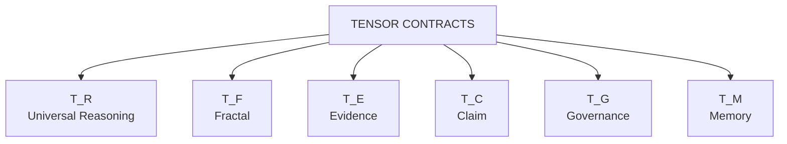
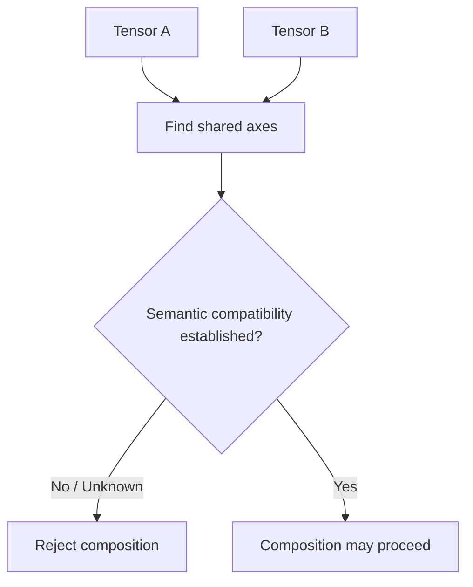
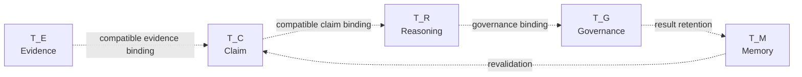
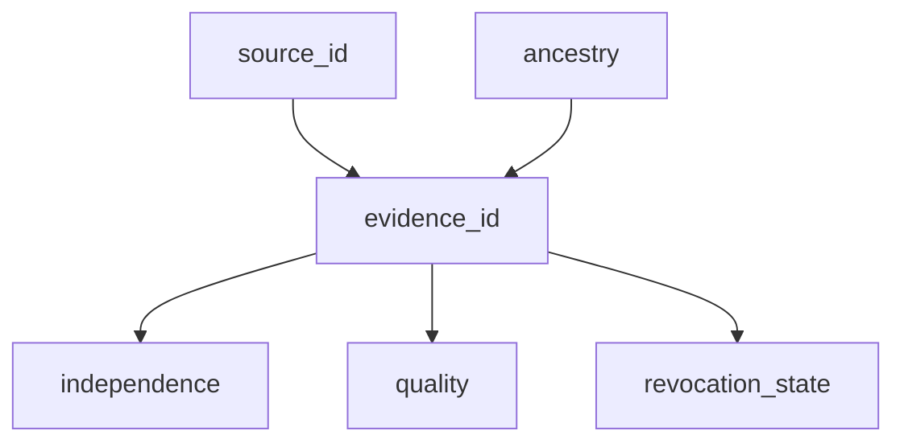
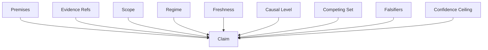
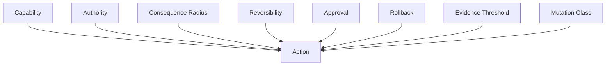
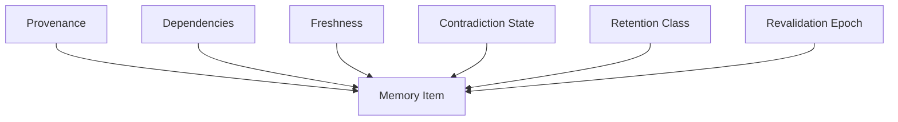

# TENSOR CONTRACTS

> **Note**: Below is a source-preserving full vault expansion. I keep the supplied tensor signatures canonical; added tags, equations, contracts, tests, and machine representations are explicitly **derived augmen...

# Typed Tensor Contracts

> [!abstract] Canonical Purpose
> `TENSOR_CONTRACTS.md` defines typed multidimensional contracts for reasoning, fractal structure, evidence, claims, governance, and memory within the supplied AMOS knowledge corpus.
>
> Its decisive invariant is:
>
> **Tensor composition is prohibited until shared axes are semantically compatible. Same-name axes do not prove same meaning.**
>
> This is an AMOS-model contract. The word **tensor** is preserved from the source and does not, by itself, imply a conventional numerical tensor in multilinear algebra or a specific machine-learning tensor implementation.

---

# 0. Source Receipt

## Canonical Source Metadata

| Field | Source Value |
|---|---|
| Title | `TENSOR CONTRACTS` |
| Type | `document` |
| Source | `11_KNOWLEDGE/root` |
| RSCF State | `SOURCE_CLAIM` |
| Frontmatter Claim Class | `SOURCE_CLAIM` |
| Provenance | `AMOS_corpus` |
| Scope | `AMOS_knowledge` |
| Node ID | `tensor_contracts` |
| Node Type | `note` |
| Path | `11_KNOWLEDGE/TENSOR_CONTRACTS.md` |
| RSCF Node Claim Class | `AMOS_MODEL` |
| MOC | `` |

The source contains two different claim-class declarations:

```yaml
frontmatter:
  rscf:
    claim_class: SOURCE_CLAIM

rscf_node:
  claim_class: AMOS_MODEL

These are not silently collapsed.

A safe interpretation is:

* the **source receipt/state** is `SOURCE_CLAIM`;
* the **RSCF node's declared semantic class** is `AMOS_MODEL`.

Whether this dual typing is intentional requires broader schema canon if exact precedence matters.

---

# 1. Source-Defined Tensor Family

The source defines six typed structures:

$$
\boxed{
\mathcal{T}
=
\{
T_R,T_F,T_E,T_C,T_G,T_M
\}
}
$$

where:

* \(T_R\) = Universal Reasoning Tensor
* \(T_F\) = Fractal Tensor
* \(T_E\) = Evidence Tensor
* \(T_C\) = Claim Tensor
* \(T_G\) = Governance Tensor
* \(T_M\) = Memory Tensor

This family notation is a **DERIVED structural compression** of the six source definitions.

---

# 2. Universal Reasoning Tensor

## Source Contract

```text
T_R = T[
  claim,
  evidence_class,
  domain,
  HML_scale,
  time,
  regime,
  observer,
  provenance,
  confidence,
  consequence,
  governance
]
```

Canonical normalized notation:

$$
\boxed{
T_R
=
T[
claim,
evidence\_class,
domain,
HML\_scale,
time,
regime,
observer,
provenance,
confidence,
consequence,
governance
]
}
$$

It contains **11 explicitly declared axes**.

---

# 3. Universal Reasoning Tensor — Axis Contract

|  # | Axis             | Source Presence | Conservative Semantic Role               |
| -: | ---------------- | --------------- | ---------------------------------------- |
|  1 | `claim`          | explicit        | proposition/content being reasoned about |
|  2 | `evidence_class` | explicit        | evidence typing/classification           |
|  3 | `domain`         | explicit        | applicability/knowledge domain           |
|  4 | `HML_scale`      | explicit        | H/M/L scale coordinate                   |
|  5 | `time`           | explicit        | temporal coordinate                      |
|  6 | `regime`         | explicit        | operating/epistemic regime               |
|  7 | `observer`       | explicit        | observer/context coordinate              |
|  8 | `provenance`     | explicit        | source/lineage coordinate                |
|  9 | `confidence`     | explicit        | confidence coordinate                    |
| 10 | `consequence`    | explicit        | consequence/stakes coordinate            |
| 11 | `governance`     | explicit        | governance coordinate                    |

The source names these axes but does not provide full type definitions, enumerations, serialization formats, or validation functions for them.

Therefore axis names are canonical; detailed schemas remain external dependencies.

---

# 4. Reasoning Tensor Structural Role

A conservative structural reading is:

$$
ReasoningObject
\mapsto
(
Claim,
Evidence,
Domain,
Scale,
Time,
Regime,
Observer,
Provenance,
Confidence,
Consequence,
Governance
).
$$

This means a reasoning object is not represented solely by proposition text.

Its interpretation is contextualized by multiple typed coordinates.

Classification:

`DERIVED_FROM_SOURCE_STRUCTURE`.

---

# 5. Claim Is Not Context-Free

Within \(T_R\), the `claim` coordinate coexists with:

$$
domain,\ time,\ regime,\ observer,\ provenance.
$$

Therefore a source-consistent inference is:

> A claim's reasoning context is not exhausted by its textual proposition.

This does not mean the source defines an exact function connecting every axis.

---

# 6. HML Scale

The source explicitly names:

```text
HML_scale
```

inside both:

$$
T_R
$$

and:

$$
T_F.
$$

This establishes a shared **axis name**.

However, the compatibility invariant explicitly warns:

> Same-name axes do not prove same meaning.

Therefore:

$$
T_R.HML\_scale
\overset{?}{\equiv}
T_F.HML\_scale
$$

must be semantically validated before tensor composition.

The shared label alone is insufficient.

---

# 7. Fractal Tensor

## Source Contract

```text
T_F = T[
  object,
  HML_scale,
  recursion_depth,
  pattern_class,
  boundary,
  entropy_proxy,
  lacunarity_proxy,
  mutation_state,
  selection_state,
  time,
  regime,
  provenance
]
```

Canonical notation:

$$
\boxed{
T_F
=
T[
object,
HML\_scale,
recursion\_depth,
pattern\_class,
boundary,
entropy\_proxy,
lacunarity\_proxy,
mutation\_state,
selection\_state,
time,
regime,
provenance
]
}
$$

The source declares **12 axes**.

---

# 8. Fractal Tensor — Axis Contract

|  # | Axis               | Conservative Role                     |
| -: | ------------------ | ------------------------------------- |
|  1 | `object`           | represented object                    |
|  2 | `HML_scale`        | hierarchical/fractal scale coordinate |
|  3 | `recursion_depth`  | recursive depth coordinate            |
|  4 | `pattern_class`    | structural pattern classification     |
|  5 | `boundary`         | applicability/object boundary         |
|  6 | `entropy_proxy`    | source-named entropy proxy            |
|  7 | `lacunarity_proxy` | source-named lacunarity proxy         |
|  8 | `mutation_state`   | mutation state                        |
|  9 | `selection_state`  | selection state                       |
| 10 | `time`             | temporal coordinate                   |
| 11 | `regime`           | regime coordinate                     |
| 12 | `provenance`       | provenance coordinate                 |

---

# 9. Proxy Firewall

The source deliberately uses:

```text
entropy_proxy
lacunarity_proxy
```

rather than simply:

```text
entropy
lacunarity
```

This distinction should be preserved.

Therefore:

$$
entropy\_proxy
\neq
necessarily\ thermodynamic\ entropy
$$

and:

$$
lacunarity\_proxy
\neq
necessarily\ a\ specific\ canonical\ lacunarity\ estimator.
$$

No formula for either proxy is supplied.

---

# 10. Recursion Depth

`recursion_depth` is explicitly present in \(T_F\).

The source does not define:

* minimum depth;
* maximum depth;
* integer requirement;
* stopping criterion;
* depth reset;
* depth semantics across H/M/L;
* whether recursion depth is absolute or local.

Therefore:

```yaml
recursion_depth:
  source_axis: true
  type: UNKNOWN
  bounds: UNKNOWN
  stopping_rule: UNKNOWN
```

---

# 11. Fractal Boundary

The explicit `boundary` axis prevents a safe interpretation of the fractal tensor as unconstrained recursion.

A structural reading is:

$$
FractalState
=
f(
Object,
Scale,
Depth,
Pattern,
Boundary,
...
).
$$

The exact boundary representation remains unspecified.

---

# 12. Mutation and Selection

The fractal tensor includes both:

$$
mutation\_state
$$

and:

$$
selection\_state.
$$

Their coexistence structurally distinguishes:

* variation/change state;
* selection/filtering state.

The source does not define the allowed values or transition equations.

Therefore no evolutionary mechanism should be invented from these names alone.

---

# 13. Evidence Tensor

## Source Contract

```text
T_E = T[
  evidence_id,
  source_id,
  source_type,
  ancestry,
  timestamp,
  version,
  scope,
  regime,
  measurement,
  quality,
  independence,
  revocation_state
]
```

Canonical notation:

$$
\boxed{
T_E
=
T[
evidence\_id,
source\_id,
source\_type,
ancestry,
timestamp,
version,
scope,
regime,
measurement,
quality,
independence,
revocation\_state
]
}
$$

The source declares **12 axes**.

---

# 14. Evidence Tensor — Axis Contract

|  # | Axis               | Conservative Role                             |
| -: | ------------------ | --------------------------------------------- |
|  1 | `evidence_id`      | evidence identity                             |
|  2 | `source_id`        | source identity                               |
|  3 | `source_type`      | source classification                         |
|  4 | `ancestry`         | provenance ancestry/lineage                   |
|  5 | `timestamp`        | temporal origin/record coordinate             |
|  6 | `version`          | version coordinate                            |
|  7 | `scope`            | applicability scope                           |
|  8 | `regime`           | validity/operating regime                     |
|  9 | `measurement`      | measurement/observation payload or descriptor |
| 10 | `quality`          | evidence-quality coordinate                   |
| 11 | `independence`     | provenance/evidential independence coordinate |
| 12 | `revocation_state` | evidence validity/revocation state            |

---

# 15. Evidence Identity Is Distinct from Source Identity

The source separately declares:

```text
evidence_id
source_id
```

Therefore:

$$
EvidenceIdentity
\neq
SourceIdentity
$$

at the schema level.

One source may potentially produce multiple evidence items, although multiplicity rules are not explicitly defined here.

---

# 16. Ancestry Is First-Class

The explicit:

```text
ancestry
```

axis means evidence provenance is not reduced to a flat `source_id`.

This structurally supports lineage-aware reasoning.

A conservative topology is:

```text
source ancestor
      │
      ├── evidence A
      ├── evidence B
      └── derived evidence C
```

Items sharing ancestry cannot automatically be assumed independent.

That last statement is consistent with the presence of both `ancestry` and `independence`, but exact independence rules require additional canon.

---

# 17. Independence Is Explicitly Typed

The source gives `independence` its own evidence axis.

Therefore independence should not be inferred merely from:

* different filenames;
* different URLs;
* repeated statements;
* different textual wording;
* multiple descendants;
* popularity.

The exact admissibility test for independence is not supplied in this artifact.

---

# 18. Revocation Is First-Class

Evidence includes:

```text
revocation_state
```

Therefore the schema anticipates that evidence validity can change after initial ingestion.

This yields the structural possibility:

$$
EvidenceAccepted_t
\not\Rightarrow
EvidenceAccepted_{t+1}.
$$

No revocation-state enumeration is supplied.

---

# 19. Evidence Versioning

The coexistence of:

```text
timestamp
version
revocation_state
```

supports a temporally and version-aware evidence contract.

However:

$$
timestamp
\neq
version
$$

by schema identity.

A newer timestamp does not automatically imply a newer semantic version unless defined elsewhere.

---

# 20. Claim Tensor

## Source Contract

```text
T_C = T[
  claim_id,
  text,
  class,
  premises,
  evidence_refs,
  scope,
  regime,
  freshness,
  causal_level,
  competing_set,
  falsifiers,
  confidence_ceiling
]
```

Canonical notation:

$$
\boxed{
T_C
=
T[
claim\_id,
text,
class,
premises,
evidence\_refs,
scope,
regime,
freshness,
causal\_level,
competing\_set,
falsifiers,
confidence\_ceiling
]
}
$$

The source declares **12 axes**.

---

# 21. Claim Tensor — Axis Contract

|  # | Axis                 | Conservative Role                     |
| -: | -------------------- | ------------------------------------- |
|  1 | `claim_id`           | claim identity                        |
|  2 | `text`               | claim expression                      |
|  3 | `class`              | claim classification                  |
|  4 | `premises`           | load-bearing premises                 |
|  5 | `evidence_refs`      | evidence references                   |
|  6 | `scope`              | applicability envelope                |
|  7 | `regime`             | validity regime                       |
|  8 | `freshness`          | temporal validity/freshness           |
|  9 | `causal_level`       | causal typing level                   |
| 10 | `competing_set`      | competing claims/hypotheses           |
| 11 | `falsifiers`         | invalidation/falsification conditions |
| 12 | `confidence_ceiling` | maximum permitted confidence          |

---

# 22. Claim Text Is Not the Claim Contract

The source distinguishes:

```text
claim_id
text
class
premises
evidence_refs
...
```

Therefore claim text alone does not encode the full claim object.

A conservative representation is:

$$
Claim
=
(
Identity,
Text,
Class,
Premises,
Evidence,
Scope,
Regime,
Freshness,
CausalLevel,
Competition,
Falsifiers,
ConfidenceCeiling
).
$$

---

# 23. Premises Are First-Class

Because `premises` is explicit, a claim may carry dependency structure.

Conceptually:

$$
P_1,P_2,\ldots,P_n
\rightarrow
C.
$$

The source does not specify whether premises are IDs, nested claims, expressions, hashes, or another representation.

---

# 24. Evidence References Are Not Evidence

The claim tensor stores:

```text
evidence_refs
```

while the evidence tensor stores evidence objects.

Therefore:

$$
EvidenceReference
\neq
EvidenceObject.
$$

A likely architecture is:

$$
T_C.evidence\_refs
\rightarrow
T_E.evidence\_id,
$$

but the exact foreign-key contract is **DERIVED**, not explicitly stated.

---

# 25. Scope Is First-Class

The claim tensor explicitly contains:

```text
scope
```

Therefore a claim is not safely generalized outside its declared applicability envelope.

Structurally:

$$
Valid(C,S_1)
\not\Rightarrow
Valid(C,S_2)
$$

when:

$$
S_1\neq S_2
$$

unless compatibility/generalization is separately established.

---

# 26. Regime Is First-Class

`regime` occurs in:

* \(T_R\)
* \(T_F\)
* \(T_E\)
* \(T_C\)

This repeated axis is important.

But under the compatibility invariant:

$$
SameName(regime)
\not\Rightarrow
SameSemantics(regime).
$$

Each composition must establish semantic compatibility.

---

# 27. Freshness

Claims explicitly carry:

```text
freshness
```

Evidence carries:

```text
timestamp
version
revocation_state.
```

This creates a potential dependency:

$$
EvidenceTemporalState
\rightarrow
ClaimFreshness.
$$

But the source does not define the exact freshness function.

Therefore this is a **DERIVED dependency candidate**.

---

# 28. Causal Level

The claim tensor includes:

```text
causal_level
```

This prevents safe flattening of all claims into the same causal class.

A claim might concern association, mechanism, causal effect, or another level depending on the wider AMOS causal schema.

The allowed `causal_level` enumeration is not supplied here.

---

# 29. Competing Set

The explicit:

```text
competing_set
```

axis establishes native representation for competing claims or hypotheses.

Thus the tensor model does not require forced convergence to a single proposition.

Structurally:

$$
C_i
\in
CompetingSet(C_1,\ldots,C_n).
$$

The source does not define winner-selection rules.

---

# 30. Falsifiers

The claim tensor explicitly stores:

```text
falsifiers
```

Therefore invalidation conditions are part of the claim contract rather than merely external commentary.

A conservative form is:

$$
Falsifier_j=True
\Rightarrow
Reevaluate(C).
$$

Whether falsification always forces total rejection is not specified.

---

# 31. Confidence Ceiling

The claim tensor contains:

```text
confidence_ceiling
```

This is structurally distinct from the `confidence` axis in \(T_R\).

Therefore:

$$
T_R.confidence
\neq
T_C.confidence\_ceiling
$$

even though they are related conceptually.

A natural constraint is:

$$
confidence
\leq
confidence\_ceiling,
$$

but this inequality is a **DERIVED contract candidate** unless explicitly defined elsewhere.

---

# 32. Governance Tensor

## Source Contract

```text
T_G = T[
  action,
  capability,
  authority,
  consequence_radius,
  reversibility,
  approval,
  rollback,
  evidence_threshold,
  mutation_class
]
```

Canonical notation:

$$
\boxed{
T_G
=
T[
action,
capability,
authority,
consequence\_radius,
reversibility,
approval,
rollback,
evidence\_threshold,
mutation\_class
]
}
$$

The source declares **9 axes**.

---

# 33. Governance Tensor — Axis Contract

|  # | Axis                 | Conservative Role                |
| -: | -------------------- | -------------------------------- |
|  1 | `action`             | proposed/executed action         |
|  2 | `capability`         | capability required or exercised |
|  3 | `authority`          | authorization coordinate         |
|  4 | `consequence_radius` | scope/radius of consequences     |
|  5 | `reversibility`      | ability to reverse/repair        |
|  6 | `approval`           | approval state                   |
|  7 | `rollback`           | rollback contract/state          |
|  8 | `evidence_threshold` | evidence requirement             |
|  9 | `mutation_class`     | mutation/change classification   |

---

# 34. Capability Is Not Authority

The tensor explicitly separates:

```text
capability
authority
```

Therefore:

$$
CanPerform(Action)
\not\Rightarrow
Authorized(Action).
$$

This is one of the strongest structural governance consequences of the schema.

Classification:

`DERIVED_FROM_AXIS_SEPARATION`.

---

# 35. Approval Is Distinct from Authority

Likewise:

```text
authority
approval
```

are separate axes.

Therefore authority and approval must not be silently collapsed.

A system may possess an authority classification while a particular action still has an unresolved approval state.

The exact governance semantics remain external.

---

# 36. Consequence Radius

The explicit:

```text
consequence_radius
```

axis makes impact scope a first-class governance property.

The source does not specify units.

It may represent categorical, graph-based, quantitative, or other scope semantics.

Do not invent a numeric radius.

---

# 37. Reversibility

`reversibility` is explicitly represented.

Thus action evaluation can distinguish actions based on recoverability.

However, no values such as:

```text
REVERSIBLE
PARTIALLY_REVERSIBLE
IRREVERSIBLE
```

are supplied here.

Those would be proposed enums unless sourced elsewhere.

---

# 38. Rollback

The tensor separately includes:

```text
rollback
```

Therefore:

$$
reversibility
\neq
rollback.
$$

A reversible action may still require a specific rollback mechanism.

Likewise, the existence of a rollback field does not prove a valid rollback procedure has been defined.

---

# 39. Evidence Threshold

Governance contains:

```text
evidence_threshold
```

while reasoning/evidence tensors separately model evidence state.

This creates a structural governance gate:

$$
EvidenceState
\overset{compatibility}{\longrightarrow}
EvidenceThreshold
\overset{?}{\longrightarrow}
ActionAuthorization.
$$

The exact threshold comparison function is not supplied.

---

# 40. Mutation Class

`mutation_class` is explicit in governance.

`mutation_state` is explicit in the fractal tensor.

These are **not the same axis**.

Therefore:

$$
T_G.mutation\_class
\neq
T_F.mutation\_state
$$

unless a mapping contract establishes compatibility.

---

# 41. Memory Tensor

## Source Contract

```text
T_M = T[
  item_id,
  content_class,
  state,
  provenance,
  dependencies,
  freshness,
  contradiction_state,
  retention_class,
  revalidation_epoch
]
```

Canonical notation:

$$
\boxed{
T_M
=
T[
item\_id,
content\_class,
state,
provenance,
dependencies,
freshness,
contradiction\_state,
retention\_class,
revalidation\_epoch
]
}
$$

The source declares **9 axes**.

---

# 42. Memory Tensor — Axis Contract

|  # | Axis                  | Conservative Role       |
| -: | --------------------- | ----------------------- |
|  1 | `item_id`             | memory-item identity    |
|  2 | `content_class`       | content classification  |
|  3 | `state`               | memory state            |
|  4 | `provenance`          | source/lineage          |
|  5 | `dependencies`        | dependency structure    |
|  6 | `freshness`           | temporal validity       |
|  7 | `contradiction_state` | contradiction status    |
|  8 | `retention_class`     | retention policy/class  |
|  9 | `revalidation_epoch`  | revalidation coordinate |

---

# 43. Memory Is Provenance-Aware

Because memory explicitly contains:

```text
provenance
```

the schema does not treat stored content as provenance-free.

Thus:

$$
Stored(x)
\not\Rightarrow
ProvenanceIrrelevant(x).
$$

---

# 44. Memory Dependencies

The `dependencies` axis allows memory objects to retain structural dependencies.

This supports selective invalidation conceptually:

```text
Premise A ──► Memory B ──► Memory C
Premise D ──► Memory E
```

If A becomes invalid, B and C may require revalidation while E may remain unaffected.

The exact invalidation algorithm is not defined in this source.

---

# 45. Contradiction State

The explicit:

```text
contradiction_state
```

axis means contradiction can be retained as state rather than necessarily erased by overwriting one memory item.

This structurally supports unresolved contradictions.

No contradiction-state enum is supplied.

---

# 46. Retention Class

`retention_class` is separate from:

```text
state
freshness
revalidation_epoch.
```

Therefore retention should not be inferred solely from freshness.

A stale item could theoretically remain retained for lineage or audit reasons, although the actual retention rules are not supplied here.

---

# 47. Revalidation Epoch

The memory tensor explicitly stores:

```text
revalidation_epoch.
```

This establishes a revalidation coordinate distinct from generic freshness.

Thus:

$$
Freshness
\neq
RevalidationEpoch.
$$

Their relationship requires additional contract definition.

---

# 48. Canonical Tensor Inventory

| Tensor  | Name                       | Axes |
| ------- | -------------------------- | ---: |
| \(T_R\) | Universal Reasoning Tensor |   11 |
| \(T_F\) | Fractal Tensor             |   12 |
| \(T_E\) | Evidence Tensor            |   12 |
| \(T_C\) | Claim Tensor               |   12 |
| \(T_G\) | Governance Tensor          |    9 |
| \(T_M\) | Memory Tensor              |    9 |

Total declared axis slots:

$$
11+12+12+12+9+9=65.
$$

Therefore the source contains **65 axis occurrences** across six tensor contracts.

This does not mean there are 65 unique semantic axes because several names recur.

---

# 49. Shared Axis Names

The source contains several repeated labels.

### `HML_scale`

Occurs in:

$$
T_R,\ T_F.
$$

### `time`

Occurs in:

$$
T_R,\ T_F.
$$

### `regime`

Occurs in:

$$
T_R,\ T_F,\ T_E,\ T_C.
$$

### `provenance`

Occurs in:

$$
T_R,\ T_F,\ T_M.
$$

### `scope`

Occurs in:

$$
T_E,\ T_C.
$$

### `freshness`

Occurs in:

$$
T_C,\ T_M.
$$

These repetitions create candidate join surfaces, not automatic joins.

---

# 50. Central Compatibility Invariant

The source explicitly states:

> **Tensor composition is prohibited until shared axes are semantically compatible.**

Canonical form:

$$
\boxed{
Compose(T_i,T_j)
\Rightarrow
CompatibleSharedAxes(T_i,T_j)
}
$$

More strictly:

$$
\boxed{
\neg CompatibleSharedAxes(T_i,T_j)
\Rightarrow
\neg Compose(T_i,T_j)
}
$$

This is a derived logical formalization of the source invariant.

---

# 51. Same-Name Invariant

The second source statement is:

> **Same-name axes do not prove same meaning.**

Canonical logical form:

$$
\boxed{
Name(a)=Name(b)
\not\Rightarrow
Semantics(a)=Semantics(b)
}
$$

This is the central anti-aliasing rule of the artifact.

---

# 52. Semantic Compatibility Before Composition

For tensors:

$$
T_A
$$

and:

$$
T_B,
$$

let:

$$
Shared(T_A,T_B)
$$

be their shared axis labels.

Composition requires validating each shared axis:

$$
\forall x\in Shared(T_A,T_B):
Compatible(
Semantics_A(x),
Semantics_B(x)
).
$$

Only then may composition proceed.

This is a **DERIVED formal contract** faithful to the source invariant.

---

# 53. Name Equality Is Insufficient

Invalid inference:

```text
T_A.regime
T_B.regime

same label
⇒ automatically same coordinate system
```

The source explicitly prohibits this assumption.

Correct structure:

```text
same label
    ↓
candidate correspondence
    ↓
semantic compatibility check
    ↓
compatible? ── no ──► reject composition
    │
   yes
    ↓
composition may proceed
```

---

# 54. Compatibility Is Not Identity

Even if two axes are semantically compatible, they need not be identical.

For example, one axis might use:

```text
NORMAL / CRISIS
```

and another:

```text
0 / 1
```

with an explicit mapping.

They could be composable under a mapping without being representationally identical.

The source does not define such a mapping; this example illustrates the distinction only.

---

# 55. Candidate Compatibility Contract

A conservative derived contract is:

```yaml
axis_compatibility:
  requires:
    - semantic_definition_compatible
    - scope_compatible
    - regime_compatible_where_relevant
    - unit_compatible_where_relevant
    - representation_mapping_defined_if_different
  same_name_only:
    sufficient: false
```

These criteria are derived implementation guidance, not source-verbatim fields.

---

# 56. Composition Fail-Closed Rule

Because composition is **prohibited** until compatibility is established, the natural default state is:

$$
CompatibilityUnknown
\Rightarrow
CompositionDenied.
$$

This is a strong source-grounded consequence.

The source does not say:

> compose unless incompatibility is proven.

It says composition is prohibited **until** compatibility exists.

Therefore the compatibility gate is fail-closed.

---

# 57. Compatibility State Model

A useful derived state model is:

```text
UNASSESSED
    │
    ▼
CHECKING
 ┌──┴───────────┐
 ▼              ▼
COMPATIBLE    INCOMPATIBLE
 │              │
 ▼              ▼
ALLOW         REJECT
COMPOSITION   COMPOSITION
```

An optional `UNKNOWN` state can remain non-composable.

---

# 58. No Implicit Axis Coercion

The compatibility invariant implies that silent coercion is unsafe.

Do not automatically convert:

* `time` to `timestamp`;
* `provenance` to `source_id`;
* `freshness` to `timestamp`;
* `confidence` to `confidence_ceiling`;
* `mutation_state` to `mutation_class`;
* `scope` to `domain`;
* `observer` to `source_id`.

Each requires an explicit semantic mapping.

---

# 59. Reasoning ↔ Claim Candidate Composition

\(T_R\) contains:

```text
claim
confidence
regime
provenance
```

while \(T_C\) contains:

```text
claim_id
text
regime
confidence_ceiling
...
```

Potential relationships exist, but only `regime` is an exact shared label.

Even there, semantic compatibility must be established.

Therefore:

$$
T_R\Join T_C
$$

is not automatically legal.

---

# 60. Claim ↔ Evidence Candidate Composition

\(T_C\) contains:

```text
evidence_refs
scope
regime
```

and \(T_E\) contains:

```text
evidence_id
scope
regime
...
```

A likely candidate relation is:

$$
T_C.evidence\_refs
\rightarrow
T_E.evidence\_id.
$$

But because the source does not explicitly state the foreign-key relation, classify it:

`DERIVED_HIGH_PLAUSIBILITY`.

Shared `scope` and `regime` still require semantic compatibility.

---

# 61. Claim ↔ Memory Candidate Composition

Shared label:

```text
freshness
```

and conceptually related:

```text
claim_id
item_id
premises
dependencies
```

But these are not automatically equivalent.

In particular:

$$
T_C.premises
\neq
T_M.dependencies
$$

unless an explicit mapping exists.

---

# 62. Evidence ↔ Memory Candidate Composition

Evidence has:

```text
source_id
ancestry
timestamp
version
revocation_state
```

Memory has:

```text
provenance
freshness
revalidation_epoch
```

These structures are strongly related conceptually, but there are no same-name joins except none directly for those listed.

Composition therefore requires explicit bindings.

---

# 63. Reasoning ↔ Governance Candidate Composition

\(T_R\) contains:

```text
consequence
governance
```

while \(T_G\) contains:

```text
consequence_radius
authority
approval
evidence_threshold
...
```

Do not equate:

$$
consequence
=
consequence\_radius
$$

or:

$$
governance
=
T_G
$$

without a contract.

The names indicate structural proximity, not identity.

---

# 64. Fractal ↔ Governance Candidate Composition

Potentially related axes:

```text
T_F.mutation_state
T_G.mutation_class
```

They are not same-name and not source-bound.

A safe state is:

`CANDIDATE_MAPPING / UNRESOLVED`.

---

# 65. Universal Reasoning Tensor as Integration Surface

Because \(T_R\) references broad reasoning dimensions, it may function as an integration surface across specialized tensors.

However, the source does not explicitly call it a parent tensor, master tensor, or supertensor.

Therefore:

```yaml
T_R_role:
  universal_reasoning_tensor: SOURCE_GROUNDED
  master_parent_of_all_tensors: NOT_ESTABLISHED
  integration_surface: DERIVED_PLAUSIBLE
```

---

# 66. Tensor ≠ Numerical Array

Critical terminology firewall:

The source uses expressions such as:

```text
T[claim, evidence_class, domain, ...]
```

This establishes a typed multidimensional contract.

It does not supply:

* tensor rank in the multilinear-algebra sense;
* numeric shape;
* numeric dtype;
* vector space;
* basis;
* tensor product operation;
* contraction operator;
* gradient semantics;
* GPU representation.

Therefore:

$$
AMOSTypedTensor
\neq
necessarily
NumericalTensor.
$$

---

# 67. Tensor ≠ Machine-Learning Tensor

Nothing in the source establishes direct identity with:

* PyTorch tensors;
* TensorFlow tensors;
* NumPy ndarrays;
* JAX arrays;
* embedding matrices.

Any implementation mapping would require a separate executable contract.

---

# 68. Tensor Composition ≠ Tensor Product

The source says:

**Tensor composition**.

It does not define composition as the mathematical tensor product:

$$
T_A\otimes T_B.
$$

Therefore:

$$
Compose(T_A,T_B)
\neq
necessarily
T_A\otimes T_B.
$$

Do not substitute conventional tensor algebra without source support.

---

# 69. Typed Record Interpretation

At the visible source level, each tensor can conservatively be treated as a typed coordinate contract:

$$
T_X
=
T[a_1,a_2,\ldots,a_n].
$$

This resembles a schema/record structure more directly than a numeric multidimensional array.

Classification:

`MODEL INTERPRETATION`.

---

# 70. Axis Identity Contract

A robust derived axis identity can be represented as:

```yaml
axis:
  name: regime
  semantic_id: UNKNOWN
  type: UNKNOWN
  unit: UNKNOWN
  scope: UNKNOWN
  allowed_values: UNKNOWN
  version: UNKNOWN
```

Two axes with `name: regime` should not compose until the semantic contract matches or an explicit mapping exists.

---

# 71. Strong Semantic Axis Identity

A derived stronger identity key could be:

$$
AxisIdentity
=
(
Name,
SemanticDefinition,
Type,
Unit,
Scope,
Regime,
Version
).
$$

This is not source-verbatim.

It is an implementation-safe augmentation of the source compatibility invariant.

---

# 72. Compatibility Proof Capsule

For any proposed tensor composition:

```yaml
COMPATIBILITY_PROOF:

  tensor_A: REQUIRED
  tensor_B: REQUIRED

  shared_axes: REQUIRED

  per_axis:
    semantic_definition: REQUIRED
    representation: REQUIRED_IF_MATERIAL
    unit: REQUIRED_IF_MATERIAL
    scope: REQUIRED_IF_MATERIAL
    regime: REQUIRED_IF_MATERIAL

  incompatible_axes:
    must_be_empty: true

  unresolved_axes:
    composition_allowed: false

  result:
    - COMPATIBLE
    - INCOMPATIBLE
    - UNKNOWN
```

This is derived implementation guidance.

---

# 73. Evidence-to-Claim Proof Path

A conservative candidate reasoning path is:

```text
T_E
Evidence Tensor
   │
   │ evidence_refs candidate binding
   ▼
T_C
Claim Tensor
   │
   │ claim/context candidate binding
   ▼
T_R
Reasoning Tensor
```

Every edge remains subject to semantic compatibility.

---

# 74. Claim-to-Governance Path

A candidate architecture is:

```text
Evidence
   ↓
Claim
   ↓
Reasoning
   ↓
Governance
   ↓
Action
```

This is a derived architecture, not a source-declared execution sequence.

The source only establishes the component tensor contracts.

---

# 75. Memory Feedback Path

The presence of:

* evidence provenance;
* claim premises;
* memory dependencies;
* revalidation epochs;

supports a possible feedback topology:

```text
Evidence
   ↓
Claim
   ↓
Reasoning
   ↓
Decision / Governance
   ↓
Memory
   │
   └── revalidation ──► Evidence / Claim reevaluation
```

Again, this topology is derived.

---

# 76. Provenance Topology

Provenance-related coordinates occur in multiple tensors:

```text
T_R.provenance
T_F.provenance
T_E.source_id
T_E.ancestry
T_M.provenance
```

The source therefore makes provenance structurally significant across several knowledge functions.

But:

$$
T_R.provenance
\neq
T_F.provenance
\neq
T_M.provenance
$$

by name alone, despite shared labels.

---

# 77. Evidence Independence and Ancestry

The evidence tensor's simultaneous presence of:

```text
ancestry
independence
```

allows the contract to represent a distinction between:

* source multiplicity;
* lineage multiplicity;
* genuine independence.

A candidate invariant is:

$$
SharedAncestry
\Rightarrow
IndependenceRequiresValidation.
$$

This is **DERIVED**, not a supplied equation.

---

# 78. Sybil-Hardening Relevance

Because evidence identity, source identity, ancestry, and independence are separately typed, the structure can support provenance-topology checks against false multiplicity.

However, the artifact itself does not define a Sybil-detection algorithm.

Therefore:

```yaml
sybil_hardening:
  structurally_supported: true
  explicit_algorithm_in_source: false
```

---

# 79. Claim Confidence Architecture

Two source fields are especially important:

```text
T_R.confidence
T_C.confidence_ceiling
```

They represent different concepts.

A safe derived rule is:

$$
EffectiveConfidence(C)
\leq
ConfidenceCeiling(C).
$$

But the exact calculation of effective confidence is not supplied.

---

# 80. Confidence Does Not Equal Evidence Count

Nothing in the tensor contracts states:

$$
confidence
=
f(number\_of\_sources)
$$

or:

$$
confidence
=
source\_count.
$$

Because ancestry and independence are explicitly modeled, raw source count is especially insufficient as a default confidence metric.

---

# 81. Claim Competition Architecture

A claim can carry:

```text
competing_set
```

Therefore the knowledge representation can preserve:

```text
Claim A
Claim B
Claim C
```

without forcing:

```text
A wins
```

when discriminating evidence is absent.

The exact competition-resolution policy is external.

---

# 82. Falsification and Memory

Claims have:

```text
falsifiers
```

while memory has:

```text
dependencies
contradiction_state
revalidation_epoch.
```

This supports a candidate local invalidation path:

```text
Falsifier observed
      ↓
Claim reevaluation
      ↓
Dependent memory identified
      ↓
Contradiction / freshness state updated
      ↓
Targeted revalidation
```

Classification:

`DERIVED ARCHITECTURE`.

---

# 83. Local Invalidation Principle

The schema's explicit dependencies make targeted invalidation representable.

It does not require global deletion of all memory when one premise changes.

However, the source does not explicitly state the algorithm:

$$
Invalidate(descendants\ only).
$$

That rule belongs to broader AMOS reasoning canon unless independently supplied.

---

# 84. Governance Evidence Gate

Because \(T_G\) explicitly contains:

```text
evidence_threshold
```

a governance action can be modeled as requiring an evidential condition.

A derived predicate is:

$$
Eligible(Action)
\Rightarrow
EvidenceSatisfiesThreshold(Action).
$$

The source does not define threshold levels.

---

# 85. Governance Reversibility Gate

Similarly, `reversibility` and `rollback` are both first-class.

A high-consequence action may therefore carry different governance semantics from a reversible low-consequence action.

The exact policy is not supplied by this artifact.

---

# 86. Governance Authorization Contract

The following stronger rule is **not source-verbatim**, but is a safe candidate implementation:

$$
Execute(A)
\Rightarrow
Capability(A)
\land
Authority(A)
\land
Approval(A)
\land
EvidenceThresholdSatisfied(A).
$$

Do not canonize this conjunction as source law unless a governance artifact explicitly defines it.

---

# 87. Memory Freshness vs Claim Freshness

Both \(T_C\) and \(T_M\) use:

```text
freshness
```

But the compatibility invariant applies.

Therefore:

$$
T_C.freshness
\overset{?}{\equiv}
T_M.freshness.
$$

Possible semantic distinction:

* claim freshness = validity horizon of a proposition;
* memory freshness = revalidation state of stored content.

This distinction is a **candidate interpretation**, not source definition.

---

# 88. Time vs Timestamp vs Freshness vs Revalidation Epoch

The tensor family contains four temporal concepts:

```text
time
timestamp
freshness
revalidation_epoch
```

They must not be collapsed.

Canonical distinction at the schema level:

$$
time
\neq
timestamp
\neq
freshness
\neq
revalidation\_epoch.
$$

Their precise transformations remain undefined.

---

# 89. Domain vs Scope

The source includes:

```text
T_R.domain
T_E.scope
T_C.scope
```

Do not infer:

$$
domain=scope.
$$

A domain may be a knowledge category while scope may be an applicability envelope.

That interpretation is plausible but not formally defined here.

---

# 90. Observer Axis

Only \(T_R\) explicitly includes:

```text
observer.
```

No other supplied tensor has an `observer` axis.

Therefore observer context is currently a reasoning-specific dimension in the visible tensor family.

Do not propagate it automatically into evidence or claim tensors.

---

# 91. Consequence Axis vs Consequence Radius

The source distinguishes:

```text
T_R.consequence
T_G.consequence_radius
```

These labels are related but not identical.

Potential mapping:

$$
Consequence
\rightarrow
ConsequenceRadius
$$

remains unresolved.

---

# 92. Evidence Class vs Source Type

The source distinguishes:

```text
T_R.evidence_class
T_E.source_type.
```

Therefore:

$$
evidence\_class
\neq
source\_type.
$$

Evidence classification and source classification may be separate dimensions.

---

# 93. Claim Class vs Content Class

The source includes:

```text
T_C.class
T_M.content_class.
```

They are not automatically equivalent.

A memory item may contain a claim, evidence, model, decision, or another content class depending on wider canon.

The allowed values are not supplied here.

---

# 94. State Is Typed by Tensor Context

The family contains:

```text
T_F.mutation_state
T_F.selection_state
T_E.revocation_state
T_M.state
T_M.contradiction_state.
```

All are state-like fields, but none should be merged merely because they contain the word `state`.

---

# 95. Contract Validation — Tensor Presence

A tensor instance is not necessarily valid merely because it supplies the right number of fields.

Structural validity may require:

1. required axes present;
2. axis semantics known;
3. values compatible with axis types;
4. provenance retained where required;
5. composition checks passed when joining tensors.

Only the composition compatibility requirement is explicit in the source; the rest are derived validation principles.

---

# 96. Missing-Axis Policy

The source does not define whether tensor axes are:

* mandatory;
* nullable;
* optional;
* defaultable;
* unknown-permitted.

Therefore no universal missing-axis rule should be invented.

A safe implementation can distinguish:

```text
MISSING
UNKNOWN
NOT_APPLICABLE
UNRESOLVED
```

but these values are proposed unless wider canon defines them.

---

# 97. Unknown Is Not Zero

For numeric or ordinal implementations:

$$
UNKNOWN
\neq
0.
$$

This matters especially for:

* confidence;
* quality;
* recursion depth;
* consequence radius;
* evidence threshold.

The source does not authorize zero as a missing-value encoding.

---

# 98. Unknown Is Not False

Likewise:

$$
UNKNOWN
\neq
FALSE.
$$

For example:

```text
independence = UNKNOWN
```

must not automatically become:

```text
independence = TRUE
```

or:

```text
independence = FALSE.
```

This is a safe derived integrity rule.

---

# 99. Compatibility Unknown Is Non-Composable

The source's prohibition gives:

$$
Compatibility=UNKNOWN
\Rightarrow
DoNotCompose.
$$

This is stronger than ordinary optimistic schema matching.

---

# 100. Compatibility Test — Same Name, Unknown Meaning

Input:

```yaml
tensor_A:
  regime: NORMAL

tensor_B:
  regime: BASELINE
```

Without a semantic mapping:

```yaml
result:
  compatibility: UNKNOWN
  composition: PROHIBITED
```

This is a derived boundary test.

---

# 101. Compatibility Test — Same Name, Conflicting Units

Hypothetical:

```yaml
tensor_A:
  time:
    unit: seconds

tensor_B:
  time:
    unit: epochs
```

Same label does not establish compatibility.

If no conversion exists:

```yaml
result:
  composition: PROHIBITED
```

The units are illustrative, not source-defined.

---

# 102. Compatibility Test — Different Names, Compatible Meaning

Different names may still be compatible under an explicit binding.

For example, hypothetically:

```text
timestamp ↔ event_time
```

could compose if a canonical mapping proves equivalence.

Thus:

$$
DifferentName
\not\Rightarrow
Incompatible.
$$

The source explicitly states only the converse caution about same-name axes; this extension is logical but derived.

---

# 103. Compatibility Is Typed, Not Lexical

Therefore a robust composition engine should test semantic contracts rather than string equality.

Conceptually:

$$
Compatible(a,b)
=
SemanticCompatibility(a,b),
$$

not merely:

$$
Name(a)=Name(b).
$$

---

# 104. Tensor Registry — Source-Grounded

```yaml
tensor_registry:

  T_R:
    name: UNIVERSAL_REASONING_TENSOR
    axes:
      - claim
      - evidence_class
      - domain
      - HML_scale
      - time
      - regime
      - observer
      - provenance
      - confidence
      - consequence
      - governance

  T_F:
    name: FRACTAL_TENSOR
    axes:
      - object
      - HML_scale
      - recursion_depth
      - pattern_class
      - boundary
      - entropy_proxy
      - lacunarity_proxy
      - mutation_state
      - selection_state
      - time
      - regime
      - provenance

  T_E:
    name: [[EVIDENCE_TENSOR]]
    axes:
      - evidence_id
      - source_id
      - source_type
      - ancestry
      - timestamp
      - version
      - scope
      - regime
      - measurement
      - quality
      - independence
      - revocation_state

  T_C:
    name: [[CLAIM_TENSOR]]
    axes:
      - claim_id
      - text
      - class
      - premises
      - evidence_refs
      - scope
      - regime
      - freshness
      - causal_level
      - competing_set
      - falsifiers
      - confidence_ceiling

  T_G:
    name: GOVERNANCE_TENSOR
    axes:
      - action
      - capability
      - authority
      - consequence_radius
      - reversibility
      - approval
      - rollback
      - evidence_threshold
      - mutation_class

  T_M:
    name: MEMORY_TENSOR
    axes:
      - item_id
      - content_class
      - state
      - provenance
      - dependencies
      - freshness
      - contradiction_state
      - retention_class
      - revalidation_epoch
```

---

# 105. Compatibility Invariant — Machine Form

```yaml
tensor_composition_contract:

  default:
    composition: DENY

  precondition:
    shared_axes_semantically_compatible: REQUIRED

  same_axis_name:
    proves_semantic_identity: false

  unresolved_semantics:
    composition: DENY

  incompatible_semantics:
    composition: DENY

  compatible_semantics:
    composition: MAY_PROCEED
```

This is a machine-readable normalization of the explicit source invariant.

---

# 106. Candidate Axis Registry

The following is a **derived augmentation**, not source metadata:

```yaml
axis_registry:

  claim:
    tensors: [T_R]

  evidence_class:
    tensors: [T_R]

  domain:
    tensors: [T_R]

  HML_scale:
    tensors: [T_R, T_F]
    compatibility: MUST_VALIDATE

  time:
    tensors: [T_R, T_F]
    compatibility: MUST_VALIDATE

  regime:
    tensors: [T_R, T_F, T_E, T_C]
    compatibility: MUST_VALIDATE

  observer:
    tensors: [T_R]

  provenance:
    tensors: [T_R, T_F, T_M]
    compatibility: MUST_VALIDATE

  confidence:
    tensors: [T_R]

  consequence:
    tensors: [T_R]

  governance:
    tensors: [T_R]

  object:
    tensors: [T_F]

  recursion_depth:
    tensors: [T_F]

  pattern_class:
    tensors: [T_F]

  boundary:
    tensors: [T_F]

  entropy_proxy:
    tensors: [T_F]

  lacunarity_proxy:
    tensors: [T_F]

  mutation_state:
    tensors: [T_F]

  selection_state:
    tensors: [T_F]

  evidence_id:
    tensors: [T_E]

  source_id:
    tensors: [T_E]

  source_type:
    tensors: [T_E]

  ancestry:
    tensors: [T_E]

  timestamp:
    tensors: [T_E]

  version:
    tensors: [T_E]

  scope:
    tensors: [T_E, T_C]
    compatibility: MUST_VALIDATE

  measurement:
    tensors: [T_E]

  quality:
    tensors: [T_E]

  independence:
    tensors: [T_E]

  revocation_state:
    tensors: [T_E]

  claim_id:
    tensors: [T_C]

  text:
    tensors: [T_C]

  class:
    tensors: [T_C]

  premises:
    tensors: [T_C]

  evidence_refs:
    tensors: [T_C]

  freshness:
    tensors: [T_C, T_M]
    compatibility: MUST_VALIDATE

  causal_level:
    tensors: [T_C]

  competing_set:
    tensors: [T_C]

  falsifiers:
    tensors: [T_C]

  confidence_ceiling:
    tensors: [T_C]

  action:
    tensors: [T_G]

  capability:
    tensors: [T_G]

  authority:
    tensors: [T_G]

  consequence_radius:
    tensors: [T_G]

  reversibility:
    tensors: [T_G]

  approval:
    tensors: [T_G]

  rollback:
    tensors: [T_G]

  evidence_threshold:
    tensors: [T_G]

  mutation_class:
    tensors: [T_G]

  item_id:
    tensors: [T_M]

  content_class:
    tensors: [T_M]

  state:
    tensors: [T_M]

  dependencies:
    tensors: [T_M]

  contradiction_state:
    tensors: [T_M]

  retention_class:
    tensors: [T_M]

  revalidation_epoch:
    tensors: [T_M]
```

---

# 107. Shared-Axis Matrix

| Axis         | \(T_R\) | \(T_F\) | \(T_E\) | \(T_C\) | \(T_G\) | \(T_M\) |
| ------------ | :-----: | :-----: | :-----: | :-----: | :-----: | :-----: |
| `HML_scale`  |    ✓    |    ✓    |    —    |    —    |    —    |    —    |
| `time`       |    ✓    |    ✓    |    —    |    —    |    —    |    —    |
| `regime`     |    ✓    |    ✓    |    ✓    |    ✓    |    —    |    —    |
| `provenance` |    ✓    |    ✓    |    —    |    —    |    —    |    ✓    |
| `scope`      |    —    |    —    |    ✓    |    ✓    |    —    |    —    |
| `freshness`  |    —    |    —    |    —    |    ✓    |    —    |    ✓    |

Every checkmark intersection is a **candidate compatibility surface**, not proof of semantic identity.

---

# 108. Tensor-Pair Shared-Axis Map

### \(T_R \leftrightarrow T_F\)

Shared names:

```text
HML_scale
time
regime
provenance
```

### \(T_R \leftrightarrow T_E\)

Shared names:

```text
regime
```

### \(T_R \leftrightarrow T_C\)

Shared names:

```text
regime
```

### \(T_R \leftrightarrow T_M\)

Shared names:

```text
provenance
```

### \(T_F \leftrightarrow T_E\)

Shared names:

```text
regime
```

### \(T_F \leftrightarrow T_C\)

Shared names:

```text
regime
```

### \(T_F \leftrightarrow T_M\)

Shared names:

```text
provenance
```

### \(T_E \leftrightarrow T_C\)

Shared names:

```text
scope
regime
```

### \(T_C \leftrightarrow T_M\)

Shared names:

```text
freshness
```

No automatic composition follows from any of these.

---

# 109. Highest-Connectivity Shared Axis

`regime` occurs in four tensors:

$$
T_R,T_F,T_E,T_C.
$$

Therefore it is the most widely repeated exact axis name in the supplied family.

This makes `regime` a high-value compatibility definition to resolve in broader canon.

---

# 110. Provenance Connectivity

`provenance` occurs in three tensors:

$$
T_R,T_F,T_M.
$$

Evidence instead has:

```text
source_id
ancestry
```

rather than an exact `provenance` field.

Therefore evidence-to-provenance mapping remains structurally related but not same-name.

---

# 111. Scope Connectivity

`scope` is shared by:

$$
T_E,T_C.
$$

This is a potentially important evidence-to-claim compatibility surface.

A claim supported by evidence outside the claim's applicability scope may require explicit validation or rejection.

The exact scope-containment operator is not supplied.

---

# 112. Candidate Scope Rule

A safe derived candidate is:

$$
Scope(Evidence)
\supseteq
Scope(Claim)
$$

or another explicitly compatible relation before evidence is generalized to the claim.

But this exact subset/superset rule is not source-defined.

Preserve it as proposed implementation logic only.

---

# 113. Regime Mismatch

Suppose evidence is valid in:

$$
Regime_A
$$

while the claim applies in:

$$
Regime_B.
$$

Same `regime` field name does not solve the mismatch.

A cross-regime transfer requires a compatibility proof.

Therefore:

$$
RegimeMismatch
\Rightarrow
NoSilentComposition.
$$

---

# 114. Temporal Mismatch

Similarly, \(T_R.time\), \(T_F.time\), \(T_E.timestamp\), \(T_C.freshness\), and \(T_M.revalidation\_epoch\) are distinct.

Do not infer temporal compatibility merely because all relate to time.

---

# 115. Version Awareness

Only \(T_E\) explicitly includes:

```text
version.
```

Therefore version is source-grounded as an evidence dimension.

The source does not explicitly add version to claim or memory tensors.

Do not silently inject it into those canonical signatures.

---

# 116. Evidence Revocation Propagation

A plausible derived dependency is:

$$
T_E.revocation\_state
\rightarrow
T_C.evidence\_refs
\rightarrow
ClaimRevalidation.
$$

But the source does not define automatic propagation.

Thus:

`DERIVED / REQUIRES IMPLEMENTATION CONTRACT`.

---

# 117. Claim Falsifier Propagation

Similarly:

$$
Falsifier(C)=TRUE
$$

could trigger:

$$
T_M.revalidation\_epoch
$$

for dependent memory.

This is structurally supported but not explicitly specified.

---

# 118. Memory Contradiction Preservation

Because `contradiction_state` is explicit, a conservative design should preserve contradictions rather than silently overwrite them.

Possible conceptual state:

```yaml
contradiction_state:
  status: OPEN
  competing_items:
    - item_A
    - item_B
```

The exact representation is proposed, not source-defined.

---

# 119. Fractal Tensor and RSCF

The source frontmatter is itself RSCF-typed and the fractal tensor contains:

```text
HML_scale
recursion_depth
pattern_class
boundary.
```

This creates strong structural correspondence with recursive H/M/L knowledge organization.

However, the artifact does not explicitly state:

$$
T_F = RSCF.
$$

Therefore:

$$
T_F
\neq
RSCF
$$

unless another source binds them.

---

# 120. RSCF Structural Relationship

A safer model is:

```text
RSCF node
   │
   ├── may carry / reference tensor contracts
   │
   └── may use H/M/L structure
             │
             ▼
        Fractal Tensor
```

Classification:

`DERIVED CORRESPONDENCE`.

---

# 121. Source Claim vs AMOS Model

The artifact contains:

```yaml
rscf:
  state: SOURCE_CLAIM
  claim_class: SOURCE_CLAIM
```

and later:

```yaml
claim_class: AMOS_MODEL
```

These may represent different schema layers.

Do not rewrite either away.

Canonical preservation:

```yaml
epistemic_dual_receipt:
  source_state: SOURCE_CLAIM
  source_frontmatter_claim_class: SOURCE_CLAIM
  rscf_node_claim_class: AMOS_MODEL
  precedence: UNRESOLVED
```

---

# 122. Related Artifact Graph

The source explicitly lists:

*
* `06-Knowledge-Base-MOC`
* `AMOS_Simulation_Kernel_v0_Math_Foundations`
* `system_scan_agent`
* `automation_profiles`
*
*

These are source-defined graph connections.

Their exact semantic relation to each tensor is not specified.

---

# 123. RSCF Relations — Source

```yaml
RSCF_RELATIONS:
  - INDEXED_BY: "[[00_HOME]]"
  - INDEXED_BY: "[[AMOS_RSCF_NODES]]"
```

Do not transform `INDEXED_BY` into stronger relationships such as:

```text
DEFINED_BY
IMPLEMENTS
DEPENDS_ON
```

without evidence.

---

# 124. MOC Binding

The source explicitly gives:

```text
MOC: [[KNOWLEDGE_MOC]]
```

Thus:

```yaml
knowledge_moc:
  artifact: "[[KNOWLEDGE_MOC]]"
  relation: SOURCE_DEFINED_MOC_BINDING
```

---

# 125. Canonical RSCF Node

```yaml
RSCF_NODE:
  node_id: tensor_contracts
  node_type: note
  path: 11_KNOWLEDGE/TENSOR_CONTRACTS.md

  relations:
    - relation: INDEXED_BY
      target: "[[00_HOME]]"

    - relation: INDEXED_BY
      target: "[[AMOS_RSCF_NODES]]"

  claim_class: AMOS_MODEL

  moc:
    target: "[[KNOWLEDGE_MOC]]"
```

---

# 126. Proof Capsule — Tensor Family

```yaml
PROOF_CAPSULE:

  claim:
    >
      TENSOR_CONTRACTS defines six typed tensor contracts:
      reasoning, fractal, evidence, claim, governance, and memory.

  class:
    VERIFIED_FROM_SUPPLIED_SOURCE

  premises:
    - six tensor signatures are explicitly present

  evidence:
    - T_R
    - T_F
    - T_E
    - T_C
    - T_G
    - T_M

  scope:
    AMOS_knowledge

  regime:
    SOURCE_ARTIFACT_VERSIONS_AVAILABLE_IN_CURRENT_CONTEXT

  falsifiers:
    - authoritative source removes or redefines tensor family

  confidence_ceiling:
    SOURCE_GROUNDED
```

---

# 127. Proof Capsule — Compatibility

```yaml
PROOF_CAPSULE:

  claim:
    >
      Tensor composition is prohibited until shared axes
      are semantically compatible.

  class:
    VERIFIED_FROM_SUPPLIED_SOURCE

  evidence:
    - explicit Compatibility invariant

  dependency:
    - meaning of "semantically compatible" requires wider schema for implementation

  falsifiers:
    - authoritative contract supersedes this invariant

  confidence_ceiling:
    SOURCE_GROUNDED
```

---

# 128. Proof Capsule — Same-Name Rule

```yaml
PROOF_CAPSULE:

  claim:
    >
      Same-name tensor axes do not prove same meaning.

  class:
    VERIFIED_FROM_SUPPLIED_SOURCE

  evidence:
    - explicit source sentence

  consequence:
    >
      Lexical equality alone cannot authorize tensor composition.

  confidence_ceiling:
    SOURCE_GROUNDED
```

---

# 129. Adversarial Validation — Tensor Meaning

### Hypothesis A

The source defines conventional mathematical tensors.

### Challenge

No vector spaces, tensor products, dimensions, basis, shape, numeric dtype, or contraction rules are supplied.

### Result

`NOT ESTABLISHED`.

---

### Hypothesis B

The source defines typed multidimensional knowledge contracts.

### Evidence

Each `T[...]` contains named semantic axes and the central invariant concerns semantic compatibility.

### Result

`STRONGLY SUPPORTED MODEL INTERPRETATION`.

---

# 130. Adversarial Validation — Shared Names

### Hypothesis

`regime` means the same thing everywhere because its name is identical.

### Challenge

The source explicitly says same-name axes do not prove same meaning.

### Result

`REJECTED`.

---

# 131. Adversarial Validation — Evidence Independence

### Hypothesis

Different `evidence_id` values imply independent evidence.

### Challenge

The evidence tensor separately contains:

```text
source_id
ancestry
independence.
```

### Result

`REJECTED AS UNSUPPORTED`.

Distinct evidence identity is insufficient to establish independence.

---

# 132. Adversarial Validation — Claim Confidence

### Hypothesis

`confidence` and `confidence_ceiling` are identical.

### Challenge

They are separate axes in different tensor contracts.

### Result

`REJECTED`.

A relationship is plausible, but identity is not source-established.

---

# 133. Adversarial Validation — Mutation

### Hypothesis

`mutation_state` and `mutation_class` are identical.

### Challenge

They occur in different tensor contracts with different names.

### Result

`UNRESOLVED / DO NOT EQUATE`.

---

# 134. Adversarial Validation — Provenance

### Hypothesis

Every field named `provenance` has identical semantics.

### Challenge

The source's compatibility invariant explicitly prohibits this inference.

### Result

`UNRESOLVED UNTIL SEMANTIC COMPATIBILITY PROVEN`.

---

# 135. Critical Gaps

```yaml
GAPS:

  CRITICAL:
    - AXIS_SEMANTIC_TYPE_REGISTRY
    - SEMANTIC_COMPATIBILITY_TEST
    - COMPOSITION_OPERATOR_DEFINITION

  DECISION_RELEVANT:
    - AXIS_NULLABILITY
    - AXIS_ENUMERATIONS
    - AXIS_VERSIONING
    - REGIME_SEMANTICS
    - PROVENANCE_SEMANTICS
    - SCOPE_SEMANTICS
    - FRESHNESS_SEMANTICS
    - CONFIDENCE_SEMANTICS
    - CONFIDENCE_CEILING_RULE
    - EVIDENCE_INDEPENDENCE_RULE
    - REVOCATION_PROPAGATION
    - GOVERNANCE_EVIDENCE_THRESHOLD
    - MEMORY_REVALIDATION_RULE

  EXPLANATORY:
    - NUMERICAL_TENSOR_MAPPING
    - STORAGE_FORMAT
    - DATABASE_SCHEMA
    - SERIALIZATION
    - INDEXING_STRATEGY

  COSMETIC:
    - RELATED_LINK_STYLE_NORMALIZATION
```

---

# 136. Minimum Missing Information for Executable Composition

To turn the compatibility invariant into a deterministic executable contract, the smallest missing specification is approximately:

```yaml
axis_semantics:
  semantic_id: REQUIRED
  value_type: REQUIRED
  allowed_values: REQUIRED_OR_OPEN
  unit: OPTIONAL_WHERE_IRRELEVANT
  scope: REQUIRED_WHERE_MATERIAL
  version: REQUIRED_WHERE_VERSIONED

compatibility:
  exact_match_rule: REQUIRED
  mapping_rule: REQUIRED
  conflict_rule: REQUIRED
  unknown_rule: DENY_BY_SOURCE_INVARIANT
```

This is proposed implementation scaffolding, not supplied canon.

---

# 137. Sensitivity Analysis

The most load-bearing rule in the entire artifact is not any individual tensor signature.

It is:

$$
\boxed{
Composition
\Rightarrow
SemanticCompatibility.
}
$$

If this invariant is removed, same-name axes could be silently conflated and the integrity properties of all six tensor contracts weaken.

Therefore compatibility semantics are the highest-value missing implementation dependency.

---

# 138. Failure Modes

## FM-01 — Lexical Axis Collision

```text
same name
≠
same semantics
```

Risk: invalid composition.

Guard: semantic compatibility validation.

---

## FM-02 — Provenance Flattening

Risk:

```text
source_id only
```

is treated as complete provenance.

Evidence tensor contradicts this simplification by also representing ancestry and independence.

---

## FM-03 — Confidence Inflation

Risk:

multiple correlated evidence descendants are treated as independent.

Relevant fields:

```text
ancestry
independence
confidence
confidence_ceiling
```

Exact confidence algorithm remains unresolved.

---

## FM-04 — Scope Leakage

Evidence/claim from one scope is silently generalized into another.

Relevant axes:

```text
scope
domain
regime
```

---

## FM-05 — Temporal Leakage

Stale evidence or memory is reused without revalidation.

Relevant axes:

```text
timestamp
version
freshness
revalidation_epoch
revocation_state
```

---

## FM-06 — Causal Overreach

A claim's `causal_level` is ignored and an association is treated as causal.

The source provides the axis but not the causal-level taxonomy.

---

## FM-07 — Governance Overreach

Capability is treated as authority.

The tensor explicitly separates them.

---

## FM-08 — Irreversible Mutation Without Governance

Mutation-related state/class is used without considering:

```text
authority
consequence_radius
reversibility
approval
rollback
evidence_threshold.
```

The exact enforcement rule remains external.

---

## FM-09 — Contradiction Erasure

Memory contradiction state is overwritten rather than retained.

The explicit `contradiction_state` axis makes contradiction preservation representable.

---

## FM-10 — Tensor/Array Conflation

Typed knowledge tensors are implemented as ordinary numeric arrays without preserving semantic axis contracts.

This would risk losing the artifact's decisive compatibility invariant.

---

# 139. Boundary Tests

### BT-01 — Same-name regime

```text
T_E.regime
T_C.regime
```

No semantic registry available.

Expected:

```text
COMPOSITION = DENIED
```

---

### BT-02 — Provenance labels match

```text
T_R.provenance
T_M.provenance
```

Names match, meanings unverified.

Expected:

```text
COMPATIBILITY = UNKNOWN
COMPOSITION = DENIED
```

---

### BT-03 — Claim/evidence scope verified compatible

If an external semantic contract proves:

```text
T_E.scope ≡ T_C.scope
```

then the shared scope axis passes that compatibility test.

Other shared axes must still be checked.

---

### BT-04 — One incompatible shared axis

If:

```text
scope = compatible
regime = incompatible
```

then:

```text
COMPOSITION = DENIED
```

because all load-bearing shared axes have not passed.

---

### BT-05 — Unknown independence

```text
independence = UNKNOWN
```

Expected:

```text
DO NOT TREAT AS INDEPENDENT
```

---

### BT-06 — Revoked evidence

```text
revocation_state = REVOKED
```

The source proves that a revocation state exists, but does not specify exact propagation.

Expected canonical behavior:

```text
PROPAGATION_POLICY = GAP
```

not invented automatic deletion.

---

# 140. Epistemic Firewall

The tensor contracts distinguish representation from verification.

A value being stored in:

```text
T_C.text
```

does not make it true.

A source being stored in:

```text
T_E.source_id
```

does not make it independent.

A number being stored in:

```text
T_R.confidence
```

does not prove calibration.

An action being stored in:

```text
T_G.action
```

does not make it authorized.

A memory item being stored in:

```text
T_M
```

does not make it fresh.

A pattern being stored in:

```text
T_F.pattern_class
```

does not prove causation.

---

# 141. Canonical Integrity Invariants

$$
\boxed{
StoredClaim
\neq
VerifiedClaim
}
$$

$$
\boxed{
EvidenceIdentity
\neq
SourceIdentity
}
$$

$$
\boxed{
DistinctEvidenceIDs
\neq
IndependentEvidence
}
$$

$$
\boxed{
SameAxisName
\neq
SameAxisMeaning
}
$$

$$
\boxed{
Capability
\neq
Authority
}
$$

$$
\boxed{
Authority
\neq
Approval
}
$$

$$
\boxed{
Reversibility
\neq
Rollback
}
$$

$$
\boxed{
Confidence
\neq
ConfidenceCeiling
}
$$

$$
\boxed{
Freshness
\neq
Timestamp
}
$$

$$
\boxed{
Freshness
\neq
RevalidationEpoch
}
$$

$$
\boxed{
MutationState
\neq
MutationClass
}
$$

$$
\boxed{
TensorComposition
\neq
AutomaticFieldMerge
}
$$

---

# 142. Anti-Fabrication Contract

Do **not** assert from this artifact alone that:

1. these tensors are conventional multilinear-algebra tensors;
2. they are PyTorch tensors;
3. they are TensorFlow tensors;
4. they are numerical arrays;
5. tensor composition means tensor product;
6. tensor composition means matrix multiplication;
7. tensor composition means database join;
8. every axis is mandatory;
9. every axis is nullable;
10. every axis has a numeric type;
11. every tensor has a fixed machine shape;
12. `HML_scale` has identical semantics in \(T_R\) and \(T_F\);
13. `regime` has identical semantics across four tensors;
14. `provenance` has identical semantics across all tensors using the label;
15. `scope` is automatically identical between evidence and claim;
16. `freshness` is automatically identical between claim and memory;
17. evidence references are formally foreign keys to `evidence_id`;
18. different evidence IDs prove independence;
19. different source IDs prove independence;
20. different documents prove independence;
21. ancestry automatically determines independence;
22. confidence is numerically calibrated;
23. confidence equals confidence ceiling;
24. confidence is based on source count;
25. `causal_level` has a known enumeration;
26. competing claims must converge;
27. falsification always deletes a claim;
28. revoked evidence automatically deletes every dependent claim;
29. capability implies authority;
30. authority implies approval;
31. approval implies safe execution;
32. reversibility implies rollback exists;
33. rollback is guaranteed to succeed;
34. consequence radius is numeric;
35. evidence threshold has a known scale;
36. mutation state equals mutation class;
37. memory state has a known enum;
38. contradiction state has a known enum;
39. stale memory must be deleted;
40. revalidation epoch equals timestamp;
41. entropy proxy is thermodynamic entropy;
42. lacunarity proxy uses a specific mathematical estimator;
43. fractal pattern implies physical fractality;
44. recursive similarity establishes causation;
45. `T_R` is the parent class of all tensors;
46. the six tensors form an executable runtime;
47. source schema proves a particular database implementation;
48. source schema proves empirical validity.

---

# 143. Anti-Regression Contract

Any future modification should preserve at minimum:

```yaml
ANTI_REGRESSION:

  preserve:
    - SIX_SOURCE_TENSOR_SIGNATURES
    - ORIGINAL_AXIS_ORDER
    - ORIGINAL_AXIS_NAMES
    - COMPATIBILITY_INVARIANT
    - SAME_NAME_NOT_SAME_MEANING_RULE
    - SOURCE_CLAIM_FRONTMATTER
    - AMOS_MODEL_RSCF_NODE_CLASS
    - AMOS_CORPUS_PROVENANCE
    - AMOS_KNOWLEDGE_SCOPE
    - SOURCE_RSCF_RELATIONS
    - KNOWLEDGE_MOC_BINDING

  prohibit_without_migration:
    - SILENT_AXIS_RENAMING
    - SILENT_AXIS_MERGING
    - SILENT_SEMANTIC_COERCION
    - SILENT_REMOVAL_OF_PROVENANCE
    - SILENT_REMOVAL_OF_ANCESTRY
    - SILENT_REMOVAL_OF_INDEPENDENCE
    - SILENT_REMOVAL_OF_FALSIFIERS
    - SILENT_REMOVAL_OF_COMPETING_SET
    - SILENT_REMOVAL_OF_CONFIDENCE_CEILING
    - SILENT_REMOVAL_OF_REVOCATION_STATE
    - SILENT_REMOVAL_OF_ROLLBACK
    - SILENT_REMOVAL_OF_REVALIDATION_EPOCH
```

---

# 144. Invalidation Conditions

This expansion should be revalidated if:

```yaml
INVALIDATION_CONDITIONS:

  - TENSOR_CONTRACTS_SOURCE_UPDATED
  - TENSOR_AXIS_DEFINITION_REGISTRY_FOUND
  - TENSOR_COMPOSITION_OPERATOR_DEFINED
  - HML_SCALE_SCHEMA_DEFINED
  - REGIME_SCHEMA_DEFINED
  - PROVENANCE_SCHEMA_DEFINED
  - SCOPE_SCHEMA_DEFINED
  - FRESHNESS_SCHEMA_DEFINED
  - CONFIDENCE_SCHEMA_DEFINED
  - CAUSAL_LEVEL_SCHEMA_DEFINED
  - INDEPENDENCE_ALGORITHM_DEFINED
  - GOVERNANCE_SCHEMA_DEFINED
  - MEMORY_STATE_SCHEMA_DEFINED
  - RSCF_CLAIM_CLASS_PRECEDENCE_DEFINED
```

---

# 145. Fractal Retrieval Model

```yaml
FRACTAL_RETRIEVAL:

  BOOTSTRAP:
    load:
      - six tensor identities
      - tensor signatures
      - compatibility invariant
      - same-name warning

  H:
    load:
      - TENSOR_CONTRACT_SYSTEM
      - KNOWLEDGE_INTEGRITY_CONTRACT

  M:
    load_on_demand:
      - REASONING_TENSOR
      - FRACTAL_TENSOR
      - [[EVIDENCE_TENSOR]]
      - [[CLAIM_TENSOR]]
      - GOVERNANCE_TENSOR
      - MEMORY_TENSOR

  L:
    load_only_if_required:
      - axis semantic definitions
      - compatibility mappings
      - enums
      - units
      - serialization
      - runtime enforcement
      - provenance ancestry
      - evidence independence
      - governance thresholds

  RAW_SOURCE:
    DO_NOT_LOAD_UNLESS_REQUIRED
```

---

# 146. RSCF H/M/L Representation

```yaml
RSCF:

  H:
    node:
      TENSOR_CONTRACTS

    purpose:
      >
        Establish typed knowledge contracts and prohibit
        unsafe composition of semantically incompatible axes.

  M:

    tensors:
      - T_R
      - T_F
      - T_E
      - T_C
      - T_G
      - T_M

    invariant:
      SEMANTIC_COMPATIBILITY_BEFORE_COMPOSITION

  L:

    axes:
      count_occurrences: 65

    shared_axis_names:
      - HML_scale
      - time
      - regime
      - provenance
      - scope
      - freshness

    unresolved:
      - semantic type registry
      - compatibility operator
      - exact composition semantics
```

---

# 147. Mermaid — Tensor Family



---

# 148. Mermaid — Compatibility Gate



---

# 149. Mermaid — Evidence / Claim / Reasoning Candidate Topology



Dashed edges are **derived candidate relations**, not source-declared execution edges.

---

# 150. Mermaid — Evidence Provenance Topology



This diagram represents the coexisting source fields, not a source-defined computational order.

---

# 151. Mermaid — Claim Proof Capsule



---

# 152. Mermaid — Governance Contract



The diagram shows dimensions associated with action; it does not assert that every field is a conjunctive execution prerequisite.

---

# 153. Mermaid — Memory Revalidation



---

# 154. Derived Full Tag Augmentation

The original source tags are preserved unchanged in frontmatter.

The following are recommended **derived indexing tags**, not source metadata:

```text
#tensor_contracts
#typed_tensor
#typed_contracts
#knowledge_tensor
#reasoning_tensor
#fractal_tensor
#evidence_tensor
#claim_tensor
#governance_tensor
#memory_tensor
#tensor_composition
#semantic_compatibility
#axis_compatibility
#axis_semantics
#schema_integrity
#knowledge_integrity
#evidence
#evidence_provenance
#evidence_ancestry
#evidence_independence
#evidence_revocation
#claim
#claim_premises
#claim_scope
#claim_regime
#claim_freshness
#causal_level
#competing_hypotheses
#falsifiers
#confidence
#confidence_ceiling
#governance
#authority
#capability
#approval
#consequence_radius
#reversibility
#rollback
#evidence_threshold
#mutation_class
#memory
#memory_provenance
#memory_dependencies
#contradiction_state
#retention_class
#revalidation_epoch
#fractal
#hml
#hml_scale
#recursion_depth
#pattern_class
#boundary
#entropy_proxy
#lacunarity_proxy
#mutation_state
#selection_state
#provenance
#provenance_topology
#scope
#regime
#freshness
#rscf
#rscf_node
#knowledge_moc
#source_claim
#amos_model
#amos_corpus
#amos_knowledge
#epistemic_boundary
#causal_firewall
#scope_firewall
#regime_firewall
#anti_fabrication
#anti_regression
#proof_capsule
#fail_closed
#semantic_aliasing
#semantic_collision
#typed_composition
#canon/knowledge
#canon/tensor
#canon/evidence
#canon/claims
#canon/governance
#canon/memory
#canon/provenance
#canon/rscf
```

---

# 155. Optional Enriched Frontmatter

> [!warning]
> The block below is a **DERIVED VAULT AUGMENTATION**. It should replace the minimal source frontmatter only if the vault permits enrichment. It must not be mistaken for source-verbatim metadata.

```yaml
---
title: TENSOR CONTRACTS
aliases:
  - "Typed Tensor Contracts"
  - "AMOS Tensor Contracts"
  - "Knowledge Tensor Contracts"

tags:
  # Source tags
  - tensor
  - knowledge
  - vault
  - canon/knowledge

  # Derived indexing tags
  - tensor_contracts
  - typed_tensor
  - typed_contracts
  - knowledge_tensor
  - reasoning_tensor
  - fractal_tensor
  - evidence_tensor
  - claim_tensor
  - governance_tensor
  - memory_tensor
  - tensor_composition
  - semantic_compatibility
  - axis_compatibility
  - axis_semantics
  - schema_integrity
  - knowledge_integrity
  - evidence
  - evidence_provenance
  - evidence_ancestry
  - evidence_independence
  - evidence_revocation
  - claim
  - claim_premises
  - claim_scope
  - claim_regime
  - claim_freshness
  - causal_level
  - competing_hypotheses
  - falsifiers
  - confidence
  - confidence_ceiling
  - governance
  - authority
  - capability
  - approval
  - consequence_radius
  - reversibility
  - rollback
  - evidence_threshold
  - mutation_class
  - memory
  - memory_provenance
  - memory_dependencies
  - contradiction_state
  - retention_class
  - revalidation_epoch
  - fractal
  - hml
  - hml_scale
  - recursion_depth
  - pattern_class
  - boundary
  - entropy_proxy
  - lacunarity_proxy
  - mutation_state
  - selection_state
  - provenance
  - provenance_topology
  - scope
  - regime
  - freshness
  - rscf
  - rscf_node
  - knowledge_moc
  - source_claim
  - amos_model
  - amos_corpus
  - amos_knowledge
  - epistemic_boundary
  - causal_firewall
  - scope_firewall
  - regime_firewall
  - anti_fabrication
  - anti_regression
  - proof_capsule
  - fail_closed
  - semantic_aliasing
  - semantic_collision
  - typed_composition
  - canon/tensor
  - canon/evidence
  - canon/claims
  - canon/governance
  - canon/memory
  - canon/provenance
  - canon/rscf

type: document
source: 11_KNOWLEDGE/root

artifact: "TENSOR_CONTRACTS.md"
node_id: tensor_contracts
node_type: note
path: "11_KNOWLEDGE/TENSOR_CONTRACTS.md"

system: "AMOS OS"
knowledge_plane: "11_KNOWLEDGE"

rscf:
  state: SOURCE_CLAIM
  claim_class: SOURCE_CLAIM
  provenance: AMOS_corpus
  scope: AMOS_knowledge

rscf_node:
  claim_class: AMOS_MODEL

epistemic_boundary:
  tensor_signatures: SOURCE_GROUNDED
  compatibility_invariant: SOURCE_GROUNDED
  same_name_warning: SOURCE_GROUNDED
  axis_semantics: PARTIALLY_DEFINED
  composition_algorithm: NOT_DEFINED
  executable_runtime: NOT_ESTABLISHED

framework_binding:
  home:
    artifact: "[[00_HOME]]"

  rscf_nodes:
    artifact: "[[AMOS_RSCF_NODES]]"

  knowledge_moc:
    artifact: "[[KNOWLEDGE_MOC]]"

related:
  - "[[00_HOME]]"
  - "06-Knowledge-Base-MOC"
  - "AMOS_Simulation_Kernel_v0_Math_Foundations"
  - "system_scan_agent"
  - "automation_profiles"
  - "[[AMOS_RSCF_NODES]]"
  - "[[KNOWLEDGE_MOC]]"
---
```

---

# 156. Canonical Compact Contract

The entire source can be compressed without losing its decisive semantics as:

$$
\boxed{
T_R =
T[
claim,
evidence\_class,
domain,
HML\_scale,
time,
regime,
observer,
provenance,
confidence,
consequence,
governance
]
}
$$

$$
\boxed{
T_F =
T[
object,
HML\_scale,
recursion\_depth,
pattern\_class,
boundary,
entropy\_proxy,
lacunarity\_proxy,
mutation\_state,
selection\_state,
time,
regime,
provenance
]
}
$$

$$
\boxed{
T_E =
T[
evidence\_id,
source\_id,
source\_type,
ancestry,
timestamp,
version,
scope,
regime,
measurement,
quality,
independence,
revocation\_state
]
}
$$

$$
\boxed{
T_C =
T[
claim\_id,
text,
class,
premises,
evidence\_refs,
scope,
regime,
freshness,
causal\_level,
competing\_set,
falsifiers,
confidence\_ceiling
]
}
$$

$$
\boxed{
T_G =
T[
action,
capability,
authority,
consequence\_radius,
reversibility,
approval,
rollback,
evidence\_threshold,
mutation\_class
]
}
$$

$$
\boxed{
T_M =
T[
item\_id,
content\_class,
state,
provenance,
dependencies,
freshness,
contradiction\_state,
retention\_class,
revalidation\_epoch
]
}
$$

with the governing invariant:

$$
\boxed{
\neg SemanticCompatibility(SharedAxes)
\Rightarrow
\neg TensorComposition
}
$$

and:

$$
\boxed{
SameName(a,b)
\not\Rightarrow
SameMeaning(a,b)
}
$$

---

# 157. Final Canonical Conclusion

`TENSOR_CONTRACTS.md` defines a six-part typed knowledge-contract family spanning reasoning, fractal structure, evidence, claims, governance, and memory.

Its deepest source-grounded integrity constraint is not lexical consistency but **semantic compatibility**:

$$
\boxed{
SharedAxisName
\neq
SharedAxisSemantics
}
$$

and therefore:

$$
\boxed{
CompatibilityUnknown
\Rightarrow
CompositionProhibited.
}
$$

This gives the artifact a fail-closed composition boundary.

The tensor family also makes several integrity-relevant dimensions first-class:

```text
Evidence:
identity + source + ancestry + independence + revocation

Claims:
premises + evidence + scope + regime + freshness
+ causal level + competition + falsifiers + confidence ceiling

Governance:
capability + authority + consequence + reversibility
+ approval + rollback + evidence threshold

Memory:
provenance + dependencies + freshness
+ contradiction state + retention + revalidation
```

The strongest safe interpretation is therefore:

> **AMOS `TENSOR_CONTRACTS` is a source-defined typed knowledge-contract model in which reasoning objects retain multidimensional epistemic, provenance, scope, temporal, causal, governance, and memory context, while cross-tensor composition is explicitly blocked until shared axes are shown to be semantically compatible.**

It does **not** establish that these contracts are conventional numerical tensors, that shared labels are interchangeable, or that the visible schemas alone constitute an independently verified executable runtime.

---

# Related

*
* 06-Knowledge-Base-MOC
* AMOS_Simulation_Kernel_v0_Math_Foundations
* system_scan_agent
* automation_profiles
*
*

---

# RSCF-NODE

```yaml
node_id: tensor_contracts
node_type: note
path: 11_KNOWLEDGE/TENSOR_CONTRACTS.md

RSCF_RELATIONS:
  - INDEXED_BY: "[[00_HOME]]"
  - INDEXED_BY: "[[AMOS_RSCF_NODES]]"

claim_class: AMOS_MODEL
```

**MOC:** [[KNOWLEDGE_MOC]]

---

# Final Tags

#tensor #knowledge #vault #canon/knowledge #tensor_contracts #typed_tensor #typed_contracts #knowledge_tensor #reasoning_tensor #fractal_tensor #evidence_tensor #claim_tensor #governance_tensor #memory_tensor #tensor_composition #semantic_compatibility #axis_compatibility #axis_semantics #schema_integrity #knowledge_integrity #evidence #evidence_provenance #evidence_ancestry #evidence_independence #evidence_revocation #claim #claim_premises #claim_scope #claim_regime #claim_freshness #causal_level #competing_hypotheses #falsifiers #confidence #confidence_ceiling #governance #authority #capability #approval #consequence_radius #reversibility #rollback #evidence_threshold #mutation_class #memory #memory_provenance #memory_dependencies #contradiction_state #retention_class #revalidation_epoch #fractal #hml #hml_scale #recursion_depth #pattern_class #boundary #entropy_proxy #lacunarity_proxy #mutation_state #selection_state #provenance #provenance_topology #scope #regime #freshness #rscf #rscf_node #knowledge_moc #source_claim #amos_model #amos_corpus #amos_knowledge #epistemic_boundary #causal_firewall #scope_firewall #regime_firewall #anti_fabrication #anti_regression #proof_capsule #fail_closed #semantic_aliasing #semantic_collision #typed_composition #canon/tensor #canon/evidence #canon/claims #canon/governance #canon/memory #canon/provenance #canon/rscf

---

**END OF `TENSOR_CONTRACTS.md`**
```
