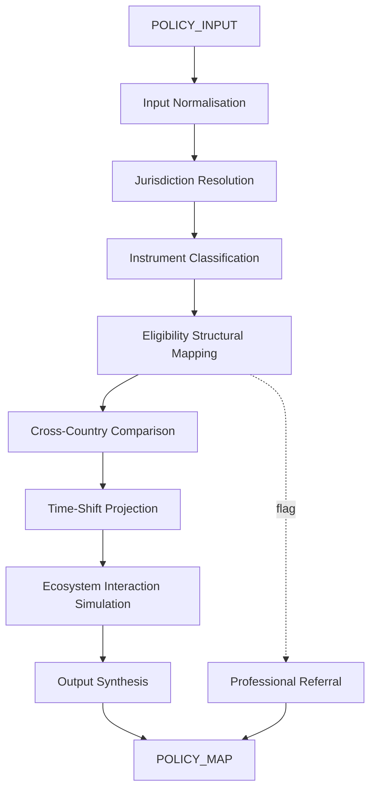

# AMOS AUSTRALIA LAW INCENTIVES FUNDING GRANTS ENGINE V0 UNIPOWER4

> **Origin Architect / Steward:** Trang Phan
> **Epistemic Class:** `AMOS_MODEL`
> **Conclusion Class:** `DERIVED`
> **Status:** `ACTIVE_SPECIFICATION`
> **Governing Plane:** `11_KNOWLEDGE/engine`

---

## 1. Architectural Scope

The **Australia Law Incentives Funding Grants Engine** (vInfinity, UniPower4) is a deterministic structural engine for mapping Australian law, incentives, funding, and grants across all levels of government and sectors. It includes four advanced layers: procedural modelling, cross-country comparison, time-shift projection, and ecosystem interaction simulation.

This engine exists to provide a **structural-only** mapping of the Australian policy/funding landscape. It operates on mechanisms, constraints, and patterns -- never on advice, guarantees, or eligibility determinations.

**Epistemic Boundary:**
```
MODEL != OBSERVATION
DOCUMENTED != IMPLEMENTED
CAPABILITY != AUTHORITY
STRUCTURAL_MAPPING != LEGAL_ADVICE
```

**Pipeline Layers:**
1. **Input Normalisation** -- Convert every query into a structured `POLICY_INPUT` tensor
2. **Jurisdiction Resolution** -- Map to federal, state, territory, and local government layers
3. **Instrument Classification** -- Identify statute, regulation, program, grant, incentive, or tax concession
4. **Eligibility Structural Mapping** -- Map eligibility criteria as constraint sets (not determinations)
5. **Cross-Country Comparison** -- Compare against equivalent instruments in peer jurisdictions
6. **Time-Shift Projection** -- Project how instruments may evolve under policy cycles
7. **Ecosystem Interaction** -- Simulate interactions between instruments, sectors, and actors
8. **Output Synthesis** -- Produce structured pathway descriptions with professional-referral flags

**Inputs:** `POLICY_INPUT{sector, entity_type, jurisdiction, objective, time_horizon, risk_appetite}`
**Outputs:** `POLICY_MAP{instruments[], eligibility_structure[], pathway_graph[], professional_referral_flags[], comparison_matrix[]}`

**Quality Axes:** Structural completeness, jurisdictional accuracy, temporal validity, cross-reference density, professional-referral coverage

---

## 2. Governing Invariants

| ID | Invariant | Description |
|----|-----------|-------------|
| INV-AUS-001 | Structural-Only Boundary | Engine outputs pathways and structures, never eligibility determinations or binding opinions |
| INV-AUS-002 | Jurisdictional Completeness | All three government levels (federal, state/territory, local) must be checked before declaring a mapping complete |
| INV-AUS-003 | Temporal Validity Flag | Every instrument reference must carry a validity timestamp and a staleness risk indicator |
| INV-AUS-004 | Professional Referral | Any output touching tax, legal, or financial decisions must include a professional-referral flag |
| INV-AUS-005 | No Advisory Language | Engine must never use language implying advice, guarantee, or eligibility confirmation |
| INV-AUS-006 | Cross-Reference Density | Each mapped instrument must link to its governing statute and at least one secondary source |
| INV-AUS-007 | Ecosystem Closure | Ecosystem interaction simulation must terminate with a bounded set of interaction effects |

---

## 3. Mathematical Formulation

**Admissibility of a policy mapping:**

$$\text{Admissible}(m) = \bigwedge_{i} \text{Valid}_{\text{temporal}}(m_i) \wedge \bigwedge_{j} \text{Covered}_{\text{jurisdiction}}(m_j) \wedge \text{ProfessionalReferralFlagged}(m)$$

**Cross-country comparison similarity:**

$$S(A, B) = \frac{|\text{Instruments}(A) \cap \text{StructuralEquiv}(B)|}{|\text{Instruments}(A) \cup \text{StructuralEquiv}(B)|}$$

**Time-shift projection confidence:**

$$C_{\text{project}}(t) = C_0 \cdot e^{-\lambda \cdot \Delta t} \cdot (1 - P_{\text{policy\_change}}(\Delta t))$$

where $\lambda$ is the staleness decay rate and $P_{\text{policy\_change}}$ is the estimated probability of policy modification over horizon $\Delta t$.

---

## 4. Architecture



---

## 5. MECE Mapping to AMOS Full Brain OS

| Engine Component | AMOS Plane | Role |
|------------------|------------|------|
| Input Normalisation | `03_CONTROL_PLANE` | Query intake and routing |
| Jurisdiction Resolution | `11_KNOWLEDGE` | Knowledge retrieval |
| Instrument Classification | `16_SCHEMAS` | Schema matching |
| Eligibility Structural Mapping | `12_STATE` | Constraint evaluation |
| Cross-Country Comparison | `22_RESEARCH` | Comparative analysis |
| Time-Shift Projection | `13_MODELS` | Predictive modelling |
| Ecosystem Interaction | `06_INTELLIGENCE` | Simulation layer |
| Output Synthesis | `04_RUNTIME` | Output generation |
| Professional Referral | `03_CONTROL_PLANE` | Safety gate |

---

## 6. Safety Invariants & Firewalls

| ID | Firewall | Enforcement |
|----|----------|-------------|
| INV-AUS-FW-001 | No Legal Advice | Engine output must contain structural disclaimer; violation blocks output |
| INV-AUS-FW-002 | No Tax Advice | Tax-related outputs must carry professional-referral flag |
| INV-AUS-FW-003 | No Financial Advice | Financial incentive outputs must carry professional-referral flag |
| INV-AUS-FW-004 | Temporal Staleness | Instruments older than threshold must be flagged as potentially stale |
| INV-AUS-FW-005 | No Government Agency Impersonation | Engine must never represent itself as a government agency or grants administrator |

---

## 7. Navigation & Bindings

- **Parent MOC:** [[11_KNOWLEDGE/engine/ENGINE_MOC|ENGINE_MOC]]
- **Knowledge MOC:** [[11_KNOWLEDGE/KNOWLEDGE_MOC|KNOWLEDGE_MOC]]
- **Sibling Engine:** [[11_KNOWLEDGE/engine/AMOS_CHINESE_LEGAL_ENGINE_V0_UNIPOWER4|AMOS_CHINESE_LEGAL_ENGINE_V0_UNIPOWER4]]
- **Sibling Engine:** [[11_KNOWLEDGE/engine/AMOS_BIZFIN_ENGINE_V0_SECTOR_PACKS7|AMOS_BIZFIN_ENGINE_V0_SECTOR_PACKS7]]
- **Sibling Engine:** [[11_KNOWLEDGE/engine/AMOS_GOV_ENGINE_V0_SECTOR_PACKS7|AMOS_GOV_ENGINE_V0_SECTOR_PACKS7]]
- **Trang Framework:** [[11_KNOWLEDGE/TRANG_FRAMEWORK_RECURSIVE_ONTOLOGY_DYNAMICS|TRANG_FRAMEWORK_RECURSIVE_ONTOLOGY_DYNAMICS]]
- **Core Laws:** [[01_CANON/01_CORE_LAWS/AMOS_CORE_LAWS|01_CORE_LAWS]]
- **Kernel Plane:** [[02_KERNEL/02_KERNEL_MOC|02_KERNEL_MOC]]

---

## 8. Known Gaps & Falsifiers

| ID | Gap | Impact | Action |
|----|-----|--------|--------|
| GAP-AUS-001 | Live statute text not embedded | Mapping relies on external verification | Flag all instrument references as structurally mapped, not textually verified |
| GAP-AUS-002 | State/territory regulation currency | Regulations change frequently | Temporal validity flag required on every state-level reference |
| GAP-AUS-003 | Local government grants coverage | Local grants are highly variable | Mark local-level mappings as partial coverage |
| GAP-AUS-004 | Cross-country comparison depth | Comparisons are structural, not substantive | Limit comparison claims to structural equivalence |

---

**Related:** [[00_ROOT/00_HOME|00_HOME]] | [[11_KNOWLEDGE/KNOWLEDGE_MOC|KNOWLEDGE_MOC]] | [[11_KNOWLEDGE/engine/AMOS_CHINESE_LEGAL_ENGINE_V0_UNIPOWER4|AMOS_CHINESE_LEGAL_ENGINE_V0_UNIPOWER4]] | [[11_KNOWLEDGE/engine/AMOS_GOV_ENGINE_V0_SECTOR_PACKS7|AMOS_GOV_ENGINE_V0_SECTOR_PACKS7]]

______________________________________________________________________

**MOC:** [[11_KNOWLEDGE/engine/ENGINE_MOC|ENGINE_MOC]]
