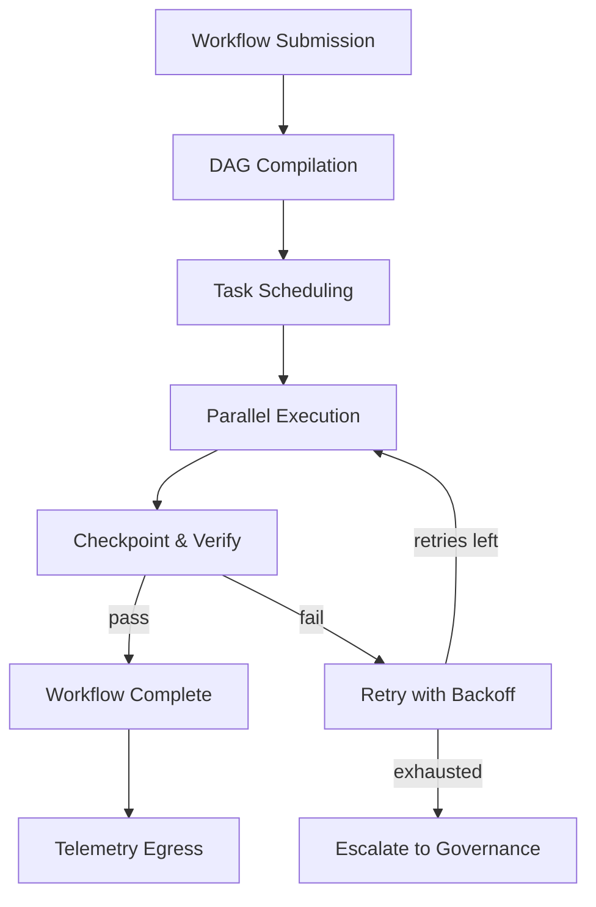

# AMOS Automation Engine Layer Specification

**Origin Architect / Steward:** Trang Phan  
**AMOS_CORE Target:** `v4.4`  
**Epistemic Class:** `AMOS_MODEL`  
**Conclusion Class:** `DERIVED`

> Bridge note — resolves the `amos-automation-engine-layer` link from the Cosmo Brain MOC / daily notes to the real skill in the vault.  
> **Skill location:** `.devin/skills/amos-automation-engine-layer`  
> **Source model:** `Automation_Engine_Model`

---

## 1. Purpose & Scope

The AMOS Automation Engine Layer orchestrates workflow execution, task scheduling, pipeline coordination, and multi-agent task delegation. It serves as the operational backbone that translates governance-approved decisions into executable pipelines with checkpointed rollback and full provenance tracking.

**Scope boundaries:**
- **In scope:** Workflow DAG execution, task scheduling, pipeline orchestration, multi-agent task delegation, checkpoint/restart, retry with backoff, parallel fan-out/fan-in.
- **Out of scope:** Governance decision-making (delegated to [[11_KNOWLEDGE/engine/AMOS_ORG_GOVERNANCE_ENGINE_LAYER|Org Governance Engine]]), code generation (delegated to [[11_KNOWLEDGE/engine/AMOS_CODING_ENGINE_LAYER|Coding Engine]]).

---

## 2. Architecture

The automation engine implements a DAG-based workflow executor with 5 execution stages. Each workflow is compiled into a directed acyclic graph of typed tasks, with dependency resolution, resource allocation, and checkpoint persistence at every node.

### Execution Model

Each task in the DAG carries:
- **Task ID:** BLAKE3 hash of task spec + parent checkpoint hash.
- **Input tensor:** Typed Arrow IPC payload.
- **Output tensor:** Typed Arrow IPC payload with forward-apply and reverse-rollback deltas.
- **Capability token:** Signed epoch lease from [[03_CONTROL_PLANE/03_CONTROL_PLANE_MOC|Control Plane]].
- **Mutation class:** M0–M5 classification.
- **Retry budget:** Maximum 3 retries with exponential backoff ($\tau_n = \tau_0 \cdot 2^n$).

---

## 3. Layer Components

### 3.1 Workflow Compiler

Compiles declarative workflow specifications into executable DAGs:
- **Dependency resolution:** Topological sort with cycle detection.
- **Resource estimation:** CPU, memory, token budget per task.
- **Parallelism analysis:** Identifies independent task clusters for fan-out.
- **Checkpoint planning:** Determines optimal checkpoint placement to minimize rollback cost.

### 3.2 Task Scheduler

Schedules tasks based on:
- **Priority queue:** Ordered by mutation class severity (M0 highest, M5 lowest).
- **Resource constraints:** Respects CPU/memory/token budget limits.
- **Dependency readiness:** Tasks execute only when all upstream dependencies are satisfied.
- **Capability token freshness:** Tasks with expired tokens are re-authorized before execution.

### 3.3 Parallel Execution Engine

Executes tasks with:
- **Fan-out:** Independent tasks dispatched to parallel agent workers.
- **Fan-in:** Results collected, merged, and validated at join points.
- **Isolation:** Each task executes in a sandboxed context with no capability leakage.
- **Timeout enforcement:** Hard timeout per task with graceful cancellation.

### 3.4 Checkpoint & Recovery Manager

Persists workflow state at every task boundary:
- **Checkpoint format:** `{task_id, input_hash, output_hash, state_delta, epoch, capability_token}`
- **Rollback:** Restores workflow to any checkpoint via reverse-delta application.
- **Crash recovery:** On restart, resumes from last valid checkpoint.
- **Audit trail:** Every checkpoint is logged to [[17_OBSERVABILITY/17_OBSERVABILITY_MOC|Observability]] with BLAKE3 receipt.

### 3.5 Multi-Agent Delegation Controller

Delegates tasks to specialist agents:
- **Agent selection:** Matches task requirements to agent capabilities using [[11_KNOWLEDGE/engine/AMOS_COGNITION_ENGINE_LAYER|Cognition Engine]] semantic matching.
- **Delegation witness:** Temporal, revocable, attenuation-bound per enforcement trust contract (v43).
- **Result verification:** Agent outputs are validated against task output schema before acceptance.
- **Failure handling:** Agent failures trigger retry or escalation based on mutation class.

---

## 4. Invariants

$$\begin{aligned}
\text{AUTO-INV-01} &: \quad \text{DAG acyclicity: } \forall \text{ workflow } W, \; W \text{ is a DAG (no cycles)} \\
\text{AUTO-INV-02} &: \quad \text{Checkpoint integrity: } \text{BLAKE3}(\text{checkpoint}_i) \text{ is verifiable at any future time} \\
\text{AUTO-INV-03} &: \quad \text{Rollback completeness: } \text{Rollback}(C_i) \circ \text{Apply}(C_i) = \mathbb{I} \\
\text{AUTO-INV-04} &: \quad \text{Capability token freshness: } \forall \text{ executing task}, \; \text{ValidateToken}(\tau) = \text{TRUE} \\
\text{AUTO-INV-05} &: \quad \text{Retry budget: } \text{retries} \le 3; \; \text{exhausted retries} \implies \text{escalation} \\
\text{AUTO-INV-06} &: \quad \text{Zero capability leakage: worker agents cannot escalate permissions}
\end{aligned}$$

---

## 5. MECE Mapping

Within the [[00_ROOT/FULL_BRAIN_OS_MECE_ARCHITECTURE|Full Brain OS MECE Architecture]]:

- **Functional ownership:** AMOS RUNTIME (typed reasoning/execution state + provenance + replay + audit)
- **Physical storage:** `11_KNOWLEDGE/engine/`
- **Authority precedence:** Bound by [[03_CONTROL_PLANE/03_CONTROL_PLANE_MOC|Control Plane]] capability tokens
- **Runtime call order:** Invoked by [[04_RUNTIME/04_RUNTIME_MOC|Runtime]] for workflow execution
- **Evidence/validation status:** `AMOS_MODEL` / `DERIVED` — structurally specified, not independently verified as deployed runtime

**MECE partition against sibling engines:**

| Engine | Domain | Overlap with Automation |
|:---|:---|:---|
| Coding Engine | Code lifecycle | Executes CI/CD pipelines |
| Org Governance Engine | Decision routing | Receives governance-approved workflows |
| Documentation Engine | Doc generation | Executes doc generation pipelines |
| Risk Compliance Engine | Compliance checking | Executes compliance audit workflows |

---

## 6. Navigation & Bindings

**Parent MOC:** [[11_KNOWLEDGE/engine/ENGINE_MOC|ENGINE_MOC]]  
**Knowledge MOC:** [[11_KNOWLEDGE/KNOWLEDGE_MOC|KNOWLEDGE_MOC]]  
**Kernel MOC:** [[11_KNOWLEDGE/kernel/KERNEL_MOC|KERNEL_MOC]]  
**Root:** [[00_ROOT/00_HOME|00_HOME]]

**Upstream dependencies:**
- [[03_CONTROL_PLANE/03_CONTROL_PLANE_MOC|Control Plane]] — capability tokens
- [[11_KNOWLEDGE/engine/AMOS_ORG_GOVERNANCE_ENGINE_LAYER|Org Governance Engine]] — approved workflows
- [[16_SCHEMAS/16_SCHEMAS_MOC|Schemas]] — task I/O schemas

**Downstream consumers:**
- [[04_RUNTIME/04_RUNTIME_MOC|Runtime]] — task execution
- [[17_OBSERVABILITY/17_OBSERVABILITY_MOC|Observability]] — telemetry egress
- [[11_KNOWLEDGE/engine/AMOS_CODING_ENGINE_LAYER|Coding Engine]] — CI/CD pipeline execution

**Peer engines:**
- [[11_KNOWLEDGE/engine/AMOS_CODING_ENGINE_LAYER|Coding Engine]]
- [[11_KNOWLEDGE/engine/AMOS_ORG_GOVERNANCE_ENGINE_LAYER|Org Governance Engine]]
- [[11_KNOWLEDGE/engine/AMOS_DOCUMENTATION_ENGINE_LAYER|Documentation Engine]]

**Related skills:**
- `.devin/skills/amos-automation-engine-layer`
- `.devin/skills/amos-evolution-loop`
- `.devin/skills/amos-rollback-recovery`

**Full Brain OS Architecture:** [[00_ROOT/FULL_BRAIN_OS_MECE_ARCHITECTURE|FULL_BRAIN_OS_MECE_ARCHITECTURE]]

---

> **Epistemic boundary:** This specification is an `AMOS_MODEL` / `DERIVED` artifact. `DOCUMENTED != IMPLEMENTED`. `MODEL != DEPLOYED_RUNTIME`.
