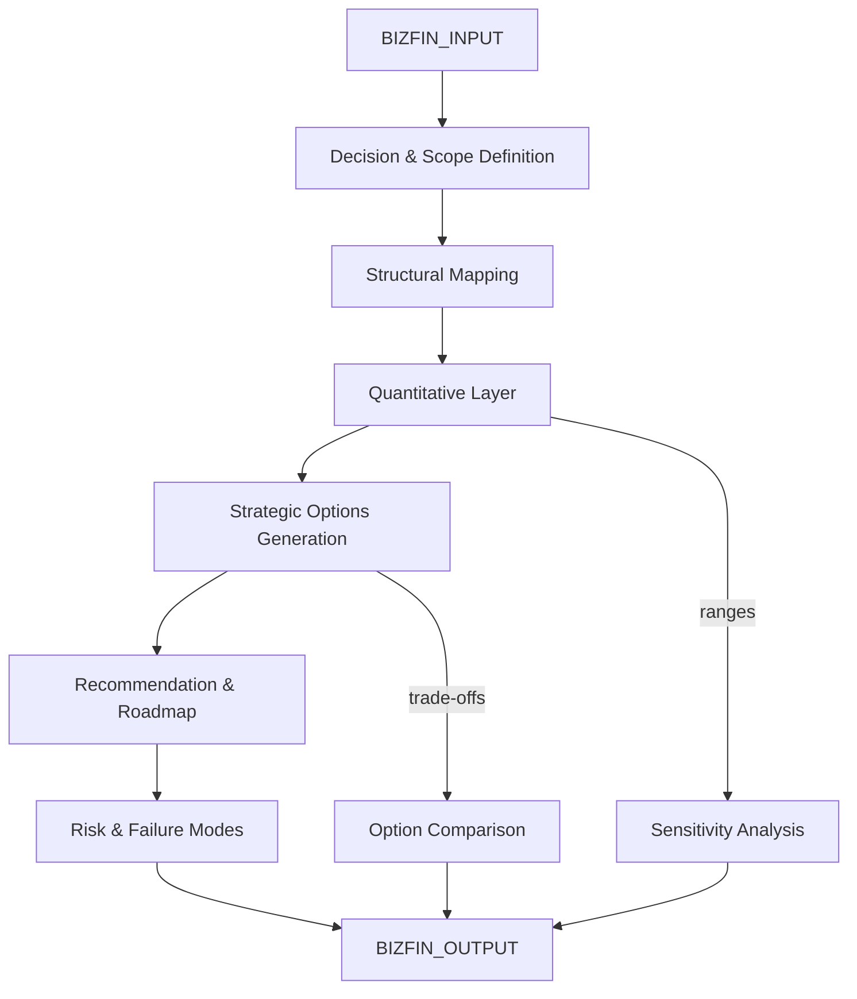

# AMOS BIZFIN ENGINE V0 SECTOR PACKS7

> **Origin Architect / Steward:** Trang Phan
> **Epistemic Class:** `AMOS_MODEL`
> **Conclusion Class:** `DERIVED`
> **Status:** `ACTIVE_SPECIFICATION`
> **Governing Plane:** `11_KNOWLEDGE/engine`

---

## 1. Architectural Scope

The **AMOS Business-Finance-Strategy SUPER Engine** (v0, Sector Packs7) is a unified engine for business models, finance, markets, forecasting, trade, and strategy. It unifies four sub-engines: Business & Finance Engine, Market & Forecasting Engine, Strategy & Consulting Engine, and Trade & Economic Development Engine.

This engine exists to provide **decision-under-constraints** reasoning for business and financial questions. It separates structure (business model, market structure) from parameters (numbers that can change) and never hides assumptions.

**Epistemic Boundary:**
```
MODEL != OBSERVATION
DOCUMENTED != IMPLEMENTED
CAPABILITY != AUTHORITY
STRUCTURAL_ANALYSIS != INVESTMENT_ADVICE
```

**Pipeline Stages:**
1. **Decision & Scope Definition** -- Identify who must decide what, by when, with what constraints
2. **Structural Mapping** -- Map value proposition, value chain, revenue model, cost structure, key assets, dependencies
3. **Quantitative Layer** -- Build unit economics, TAM/SAM/SOM, scenario analysis (base/upside/downside)
4. **Strategic Options** -- Identify strategic levers and generate 2-3 coherent options with trade-offs
5. **Recommendation & Roadmap** -- Recommend a path with sequenced action plan, milestones, and KPIs
6. **Risk & Failure Modes** -- Identify market, execution, financial, regulatory, geopolitical risks

**Inputs:** `BIZFIN_INPUT{decision, scope_level, constraints, capital, time_horizon, risk_appetite, regulation}`
**Outputs:** `BIZFIN_OUTPUT{structural_map, unit_economics, scenarios[], strategic_options[], roadmap, risk_register[]}`

**Quality Axes:** Structural completeness, assumption transparency, sensitivity coverage, scenario coherence, risk coverage, roadmap actionability, KPI measurability.

---

## 2. Governing Invariants

| ID | Invariant | Description |
|----|-----------|-------------|
| INV-BF-001 | Decision-Under-Constraints | All questions are treated as decisions under constraints; no unconstrained optimisation |
| INV-BF-002 | Structure-Parameter Separation | Business structure must be separated from numerical parameters that can change |
| INV-BF-003 | Explicit Assumptions | All assumptions must be stated explicitly; no hidden assumptions |
| INV-BF-004 | Scenario Triangulation | Quantitative analysis must include base, upside, and downside scenarios |
| INV-BF-005 | Risk Coverage | Risk register must cover market, execution, financial, regulatory, and geopolitical dimensions |
| INV-BF-006 | No Investment Advice | Engine outputs structural analysis, not investment recommendations |
| INV-BF-007 | Range Transparency | When data is incomplete, ranges must be used with sensitivity drivers explained |

---

## 3. Mathematical Formulation

**Unit economics:**

$$\text{UE} = \text{ARPU} - \text{CAC} - \text{VariableCost} - \text{Allocation}_{\text{fixed}}$$

**TAM/SAM/SOM:**

$$\text{TAM} = \text{TotalMarket} \cdot \text{AvgPrice}$$
$$\text{SAM} = \text{TAM} \cdot \text{ReachableFraction}$$
$$\text{SOM} = \text{SAM} \cdot \text{CaptureRate}(t)$$

**Scenario expected value:**

$$E[V] = \sum_{s \in \{base, upside, downside\}} P(s) \cdot V_s$$

**Strategic option trade-off:**

$$T(o_i, o_j) = \sum_{k} w_k \cdot |Q_k(o_i) - Q_k(o_j)|$$

where $Q_k$ is the quality score on dimension $k$ and $w_k$ is the decision-maker's weight.

---

## 4. Architecture



---

## 5. MECE Mapping to AMOS Full Brain OS

| Engine Component | AMOS Plane | Role |
|------------------|------------|------|
| Decision & Scope Definition | `03_CONTROL_PLANE` | Decision routing and authority |
| Structural Mapping | `11_KNOWLEDGE` | Knowledge retrieval and mapping |
| Quantitative Layer | `13_MODELS` | Financial modelling |
| Strategic Options | `06_INTELLIGENCE` | Strategic reasoning |
| Recommendation & Roadmap | `04_RUNTIME` | Action plan generation |
| Risk & Failure Modes | `17_OBSERVABILITY` | Risk monitoring |
| Sensitivity Analysis | `22_RESEARCH` | Research and analysis |
| Option Comparison | `12_STATE` | State evaluation |

---

## 6. Safety Invariants & Firewalls

| ID | Firewall | Enforcement |
|----|----------|-------------|
| INV-BF-FW-001 | No Investment Advice | Outputs must contain structural-analysis disclaimer |
| INV-BF-FW-002 | Assumption Disclosure | All assumptions must be explicitly listed; hidden assumptions block output |
| INV-BF-FW-003 | Scenario Completeness | Must include downside scenario; optimism-only outputs are blocked |
| INV-BF-FW-004 | Range Requirement | Incomplete data must produce ranges, not point estimates |
| INV-BF-FW-005 | Risk Register Mandatory | Output without risk register is blocked |

---

## 7. Navigation & Bindings

- **Parent MOC:** [[11_KNOWLEDGE/engine/ENGINE_MOC|ENGINE_MOC]]
- **Knowledge MOC:** [[11_KNOWLEDGE/KNOWLEDGE_MOC|KNOWLEDGE_MOC]]
- **Sibling Engine:** [[11_KNOWLEDGE/engine/AMOS_GOV_ENGINE_V0_SECTOR_PACKS7|AMOS_GOV_ENGINE_V0_SECTOR_PACKS7]]
- **Sibling Engine:** [[11_KNOWLEDGE/engine/AMOS_HUMAN_ENGINE_V0_SECTOR_PACKS7|AMOS_HUMAN_ENGINE_V0_SECTOR_PACKS7]]
- **Sibling Engine:** [[11_KNOWLEDGE/engine/AMOS_SCIENCE_ENGINE_V0_SECTOR_PACKS7|AMOS_SCIENCE_ENGINE_V0_SECTOR_PACKS7]]
- **Business Model Kernel:** [[11_KNOWLEDGE/kernel/AMOS_BUSINESS_MODEL_KERNEL|AMOS_BUSINESS_MODEL_KERNEL]]
- **Revenue Architecture Kernel:** [[11_KNOWLEDGE/kernel/AMOS_REVENUE_ARCHITECTURE_KERNEL|AMOS_REVENUE_ARCHITECTURE_KERNEL]]
- **Trang Framework:** [[11_KNOWLEDGE/TRANG_FRAMEWORK_RECURSIVE_ONTOLOGY_DYNAMICS|TRANG_FRAMEWORK_RECURSIVE_ONTOLOGY_DYNAMICS]]
- **Core Laws:** [[01_CANON/01_CORE_LAWS/AMOS_CORE_LAWS|01_CORE_LAWS]]

---

## 8. Known Gaps & Falsifiers

| ID | Gap | Impact | Action |
|----|-----|--------|--------|
| GAP-BF-001 | Market data not live | TAM/SAM/SOM are structural estimates | Flag all market sizing as model-based |
| GAP-BF-002 | Regulatory parameter currency | Tax rates, incentives change | Temporal validity flag on all regulatory parameters |
| GAP-BF-003 | Trade dynamics complexity | Global value chain mapping is structural | Mark trade analysis as structural, not predictive |
| GAP-BF-004 | Sensitivity coverage | Not all variables can be sensitivity-tested | Prioritise top-3 sensitivity drivers |

---

**Related:** [[00_ROOT/00_HOME|00_HOME]] | [[11_KNOWLEDGE/KNOWLEDGE_MOC|KNOWLEDGE_MOC]] | [[11_KNOWLEDGE/kernel/AMOS_BUSINESS_MODEL_KERNEL|AMOS_BUSINESS_MODEL_KERNEL]] | [[11_KNOWLEDGE/kernel/AMOS_REVENUE_ARCHITECTURE_KERNEL|AMOS_REVENUE_ARCHITECTURE_KERNEL]]

______________________________________________________________________

**MOC:** [[11_KNOWLEDGE/engine/ENGINE_MOC|ENGINE_MOC]]

______________________________________________________________________

**Trang Framework:** [[11_KNOWLEDGE/TRANG_FRAMEWORK_RECURSIVE_ONTOLOGY_DYNAMICS|TRANG_FRAMEWORK_RECURSIVE_ONTOLOGY_DYNAMICS]]
