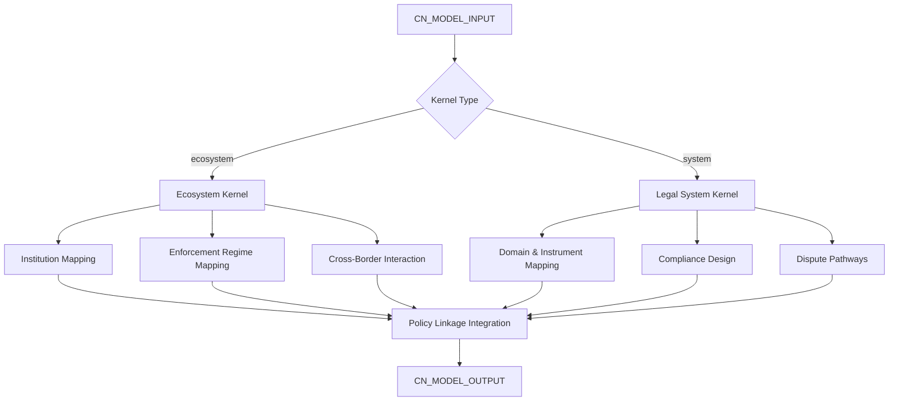

# AMOS China Engines Model

> **Origin Architect / Steward:** Trang Phan
> **Epistemic Class:** `AMOS_MODEL`
> **Conclusion Class:** `DERIVED`
> **Status:** `ACTIVE_SPECIFICATION`
> **Governing Plane:** `11_KNOWLEDGE/engine`

---

## 1. Architectural Scope

This model documents the unified structural kernels operating within the `amos-china-engine-layer` for the Chinese jurisdiction. It provides a composite view of two kernel engines: the Chinese Legal Ecosystem Kernel Engine and the Chinese Legal System Kernel Engine.

This model exists to provide a **jurisdiction-specific structural framework** for reasoning about Chinese legal, regulatory, and policy systems within the AMOS OS. It connects with Policy Geostrategy, Risk Compliance, BizFin, and Operations kernels.

**Epistemic Boundary:**
```
MODEL != OBSERVATION
DOCUMENTED != IMPLEMENTED
CAPABILITY != AUTHORITY
STRUCTURAL_MODEL != LEGAL_ADVICE
CONCEPTUAL_ONLY != LIVE_STATUTE
```

### 1.1 Chinese Legal Ecosystem Kernel Engine (vInfinity SUPER)

**Purpose**: Deterministic kernel and engine for structurally modeling the Chinese legal-regulatory ecosystem: institutions, laws, enforcement, regulatory regimes, cross-border interactions, and policy linkages.

**Integration**: Connects with Policy Geostrategy, Risk Compliance, BizFin, and Operations kernels.

**Axes Evaluated**: Jurisdiction level, institution type, legal domain, proceeding type, enforcement mode, transparency, time horizon, risk profile, cross-border dimension, sector criticality, digitalisation level, and policy priority.

### 1.2 Chinese Legal System Kernel Engine (vInfinity SUPER)

**Purpose**: Deterministic kernel for structurally modeling Chinese law and regulations across all domains (civil, commercial, administrative, criminal, tax, IP, data, labour, environment, finance).

**Key Constraint**: Conceptual only. It does not provide legal advice, and it does not contain live statutes, cases, or regulatory texts.

**Routing Modes:**
- `cn_law_mapping`: High-level mapping of domains and instruments
- `cn_law_compliance_design`: Design of internal compliance structures
- `cn_law_risk_evaluation`: Evaluation of legal and regulatory risk
- `cn_law_dispute_pathways`: Mapping of possible dispute resolution pathways
- `cn_law_reform_options`: Scenario and reform options at the policy level

**Inputs:** `CN_MODEL_INPUT{kernel_type, domain, jurisdiction_level, cross_border, sector}`
**Outputs:** `CN_MODEL_OUTPUT{ecosystem_map, legal_system_map, compliance_structure, risk_profile, policy_linkages[]}`

**Quality Axes:** Domain coverage, institution mapping accuracy, enforcement mode classification, cross-border dimension, policy linkage density, temporal validity.

---

## 2. Governing Invariants

| ID | Invariant | Description |
|----|-----------|-------------|
| INV-CN-MD-001 | Conceptual-Only Boundary | Both kernel engines are conceptual; no live statute text, no legal advice |
| INV-CN-MD-002 | Ecosystem-System Separation | The ecosystem kernel maps institutions and interactions; the system kernel maps law and instruments |
| INV-CN-MD-003 | Cross-Kernel Integration | Ecosystem and system kernels must integrate via policy linkage edges |
| INV-CN-MD-004 | Axis Completeness | All 12 evaluation axes must be addressable; partial coverage must be flagged |
| INV-CN-MD-005 | Routing Mode Enforcement | Each routing mode must produce outputs matching its declared schema |
| INV-CN-MD-006 | No Binding Opinion | Neither kernel may produce eligibility determinations or binding legal opinions |
| INV-CN-MD-007 | Cross-Border Mandatory Flag | Cross-border matters must be flagged for specialist review |

---

## 3. Mathematical Formulation

**Ecosystem institution interaction:**

$$I_{\text{eco}}(a, b) = \text{PolicyLink}(a, b) \cdot \text{EnforcementOverlap}(a, b) \cdot \text{TemporalCoactive}(a, b)$$

**System instrument authority:**

$$A_{\text{sys}}(i) = \frac{1}{1 + \text{Rank}(i)} \cdot \text{Validity}(i, t) \cdot \text{EnforcementActive}(i)$$

**Composite risk profile:**

$$R_{\text{composite}} = \alpha \cdot R_{\text{eco}} + \beta \cdot R_{\text{sys}} + \gamma \cdot R_{\text{cross-border}}$$

**Policy linkage density:**

$$D_{\text{link}} = \frac{|\text{Edges}(G_{\text{policy}})|}{|\text{Nodes}(G_{\text{policy}})| \cdot (|\text{Nodes}(G_{\text{policy}})| - 1)}$$

---

## 4. Architecture



---

## 5. MECE Mapping to AMOS Full Brain OS

| Engine Component | AMOS Plane | Role |
|------------------|------------|------|
| Ecosystem Kernel | `11_KNOWLEDGE` | Jurisdictional knowledge |
| Legal System Kernel | `11_KNOWLEDGE` | Legal domain knowledge |
| Institution Mapping | `12_STATE` | State entity representation |
| Enforcement Regime | `03_CONTROL_PLANE` | Control mode mapping |
| Compliance Design | `13_MODELS` | Compliance modelling |
| Risk Profile | `06_INTELLIGENCE` | Risk assessment |
| Policy Linkages | `12_STATE` | Cross-entity state edges |
| Cross-Border Flag | `03_CONTROL_PLANE` | Safety gate |

---

## 6. Safety Invariants & Firewalls

| ID | Firewall | Enforcement |
|----|----------|-------------|
| INV-CN-MD-FW-001 | No Legal Advice | Both kernels must carry conceptual-only disclaimer |
| INV-CN-MD-FW-002 | No Live Statute | Statute text must not be presented as current or authoritative |
| INV-CN-MD-FW-003 | Cross-Border Flag | Cross-border matters must be flagged |
| INV-CN-MD-FW-004 | Routing Mode Schema | Outputs must match routing mode schema; mismatch blocks output |
| INV-CN-MD-FW-005 | No Government Impersonation | Neither kernel may represent itself as a Chinese government entity |

---

## 7. Navigation & Bindings

- **Parent MOC:** [[11_KNOWLEDGE/engine/ENGINE_MOC|ENGINE_MOC]]
- **Home:** [[00_ROOT/00_HOME|00_HOME]]
- **Knowledge MOC:** [[11_KNOWLEDGE/KNOWLEDGE_MOC|KNOWLEDGE_MOC]]
- **Chinese Legal Engine:** [[11_KNOWLEDGE/engine/AMOS_CHINESE_LEGAL_ENGINE_V0_UNIPOWER4|AMOS_CHINESE_LEGAL_ENGINE_V0_UNIPOWER4]]
- **Governance Engine:** [[11_KNOWLEDGE/engine/AMOS_GOV_ENGINE_V0_SECTOR_PACKS7|AMOS_GOV_ENGINE_V0_SECTOR_PACKS7]]
- **BizFin Engine:** [[11_KNOWLEDGE/engine/AMOS_BIZFIN_ENGINE_V0_SECTOR_PACKS7|AMOS_BIZFIN_ENGINE_V0_SECTOR_PACKS7]]
- **Trang Framework:** [[11_KNOWLEDGE/TRANG_FRAMEWORK_RECURSIVE_ONTOLOGY_DYNAMICS|TRANG_FRAMEWORK_RECURSIVE_ONTOLOGY_DYNAMICS]]
- **Core Laws:** [[01_CANON/01_CORE_LAWS/AMOS_CORE_LAWS|01_CORE_LAWS]]

---

## 8. Known Gaps & Falsifiers

| ID | Gap | Impact | Action |
|----|-----|--------|--------|
| GAP-CN-MD-001 | No live statute database | Instrument references are structural | Flag as conceptual mapping |
| GAP-CN-MD-002 | Ecosystem-system integration depth | Policy linkage edges may be incomplete | Flag linkage density as partial |
| GAP-CN-MD-003 | Enforcement regime currency | Enforcement practices evolve | Temporal validity flag required |
| GAP-CN-MD-004 | Cross-border complexity | Extraterritorial reach is complex | Flag for specialist review |

---

**Related:** [[00_ROOT/00_HOME|00_HOME]] | [[11_KNOWLEDGE/KNOWLEDGE_MOC|KNOWLEDGE_MOC]] | [[11_KNOWLEDGE/engine/AMOS_CHINESE_LEGAL_ENGINE_V0_UNIPOWER4|AMOS_CHINESE_LEGAL_ENGINE_V0_UNIPOWER4]] | [[11_KNOWLEDGE/engine/AMOS_GOV_ENGINE_V0_SECTOR_PACKS7|AMOS_GOV_ENGINE_V0_SECTOR_PACKS7]]

______________________________________________________________________

**MOC:** [[11_KNOWLEDGE/engine/ENGINE_MOC|ENGINE_MOC]]

______________________________________________________________________

**Trang Framework:** [[11_KNOWLEDGE/TRANG_FRAMEWORK_RECURSIVE_ONTOLOGY_DYNAMICS|TRANG_FRAMEWORK_RECURSIVE_ONTOLOGY_DYNAMICS]]
