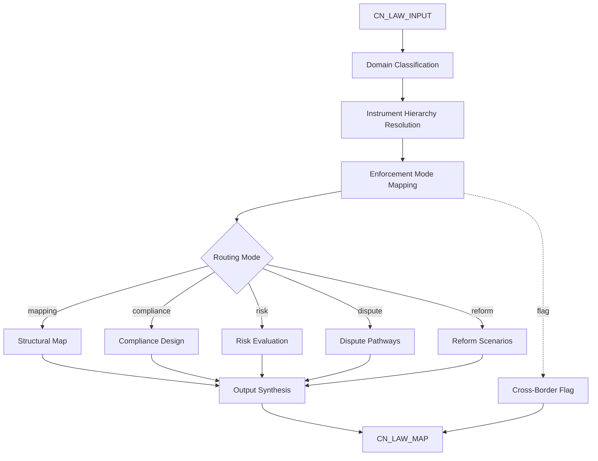

# AMOS CHINESE LEGAL ENGINE V0 UNIPOWER4

> **Origin Architect / Steward:** Trang Phan
> **Epistemic Class:** `AMOS_MODEL`
> **Conclusion Class:** `DERIVED`
> **Status:** `ACTIVE_SPECIFICATION`
> **Governing Plane:** `11_KNOWLEDGE/engine`

---

## 1. Architectural Scope

The **AMOS Chinese Legal Engine** (vInfinity SUPER, UniPower4) is a deterministic kernel+engine composite for structurally modeling Chinese law and regulations across all domains: civil, commercial, administrative, criminal, tax, IP, data, labour, environment, and finance. It is conceptual only and does not provide legal advice.

This engine exists to provide a **structural map** of the Chinese legal-regulatory ecosystem, including institutions, instruments, enforcement modes, and cross-border interactions. It operates on the hierarchy of legal instruments from the PRC Constitution down to departmental rules and normative documents.

**Epistemic Boundary:**
```
MODEL != OBSERVATION
DOCUMENTED != IMPLEMENTED
CAPABILITY != AUTHORITY
STRUCTURAL_MAP != LEGAL_ADVICE
CONCEPTUAL_ONLY != LIVE_STATUTE
```

**Legal Domains Covered:**
constitutional, civil/contract, company/corporate, securities, banking/finance, competition/antitrust, consumer protection, IP, data/cybersecurity, labour/employment, social security, environment/resource, taxation, administrative law, criminal law, procedural law (civil/administrative/criminal), foreign investment/trade, maritime/transport, family/inheritance.

**Instrument Hierarchy:**
Constitution > National Statute > NPCSC Interpretation > State Council Regulation > Supreme Court Interpretation > Local Regulation > Departmental Rule > Normative Document > Treaty/International Agreement > Judicial Guiding Case.

**Routing Modes:**
- `cn_law_mapping` -- High-level mapping of domains and instruments
- `cn_law_compliance_design` -- Design of internal compliance structures
- `cn_law_risk_evaluation` -- Evaluation of legal and regulatory risk
- `cn_law_dispute_pathways` -- Mapping of dispute resolution pathways
- `cn_law_reform_options` -- Scenario and reform options at the policy level

**Inputs:** `CN_LAW_INPUT{domain, instrument_type, jurisdiction_level, entity_type, cross_border, time_horizon}`
**Outputs:** `CN_LAW_MAP{instrument_hierarchy[], compliance_structure[], risk_profile[], dispute_pathways[], reform_scenarios[]}`

**Quality Axes:** Domain coverage, instrument hierarchy accuracy, enforcement mode mapping, cross-border dimension, transparency assessment, temporal validity, sector criticality, digitalisation level, policy priority alignment.

---

## 2. Governing Invariants

| ID | Invariant | Description |
|----|-----------|-------------|
| INV-CN-001 | Conceptual-Only Boundary | Engine provides structural modeling only; never legal advice, never live statute text |
| INV-CN-002 | Instrument Hierarchy Preservation | Legal instruments must be ordered by the constitutional hierarchy; no inversion |
| INV-CN-003 | Domain Completeness Check | All 21 legal domains must be addressable; partial coverage must be flagged |
| INV-CN-004 | Cross-Border Flagging | Any matter involving foreign investment, trade, or extraterritorial reach must be flagged |
| INV-CN-005 | Enforcement Mode Mapping | Each instrument must carry an enforcement mode classification |
| INV-CN-006 | Temporal Validity | All references must carry validity timestamps; Chinese law changes rapidly |
| INV-CN-007 | No Binding Opinion | Engine must never produce eligibility determinations or binding legal opinions |

---

## 3. Mathematical Formulation

**Instrument authority weight in hierarchy:**

$$W(i) = \frac{1}{1 + \text{Rank}(i)} \cdot \text{Validity}(i, t)$$

where $\text{Rank}(i)$ is the position in the constitutional hierarchy (0 = Constitution) and $\text{Validity}(i, t)$ is a temporal validity function.

**Compliance structural completeness:**

$$C_{\text{compliance}} = \frac{|\text{Covered}(D)|}{|D|} \cdot \frac{\sum_{i} W(i) \cdot \text{EnforcementActive}(i)}{\sum_{i} W(i)}$$

where $D$ is the set of applicable legal domains.

**Risk profile aggregation:**

$$R = \sum_{d \in D} \alpha_d \cdot r_d \cdot (1 + \text{CrossBorder}(d)) \cdot (1 + \text{SectorCriticality}(d))$$

---

## 4. Architecture



---

## 5. MECE Mapping to AMOS Full Brain OS

| Engine Component | AMOS Plane | Role |
|------------------|------------|------|
| Domain Classification | `11_KNOWLEDGE` | Knowledge retrieval and routing |
| Instrument Hierarchy Resolution | `16_SCHEMAS` | Schema hierarchy matching |
| Enforcement Mode Mapping | `12_STATE` | State constraint evaluation |
| Compliance Design | `03_CONTROL_PLANE` | Control structure generation |
| Risk Evaluation | `06_INTELLIGENCE` | Risk assessment layer |
| Dispute Pathways | `13_MODELS` | Pathway modelling |
| Reform Scenarios | `22_RESEARCH` | Policy research |
| Cross-Border Flagging | `03_CONTROL_PLANE` | Safety gate |
| Output Synthesis | `04_RUNTIME` | Output generation |

---

## 6. Safety Invariants & Firewalls

| ID | Firewall | Enforcement |
|----|----------|-------------|
| INV-CN-FW-001 | No Legal Advice | Output must contain structural disclaimer; violation blocks output |
| INV-CN-FW-002 | No Live Statute | Engine must not present statute text as current or authoritative |
| INV-CN-FW-003 | Cross-Border Mandatory Flag | Foreign investment/trade matters must be flagged for specialist review |
| INV-CN-FW-004 | Data/Cybersecurity Sensitivity | Data and cybersecurity domain outputs must carry heightened risk flag |
| INV-CN-FW-005 | No Government Impersonation | Engine must never represent itself as a Chinese government agency |

---

## 7. Navigation & Bindings

- **Parent MOC:** [[11_KNOWLEDGE/engine/ENGINE_MOC|ENGINE_MOC]]
- **Knowledge MOC:** [[11_KNOWLEDGE/KNOWLEDGE_MOC|KNOWLEDGE_MOC]]
- **Sibling Engine:** [[11_KNOWLEDGE/engine/AMOS_AUSTRALIA_LAW_INCENTIVES_FUNDING_GRANTS_ENGINE_V0_UNIPOWER4|AMOS_AUSTRALIA_LAW_INCENTIVES_FUNDING_GRANTS_ENGINE_V0_UNIPOWER4]]
- **China Engines Model:** [[11_KNOWLEDGE/engine/AMOS_CHINA_ENGINES_MODEL|AMOS_CHINA_ENGINES_MODEL]]
- **Governance Engine:** [[11_KNOWLEDGE/engine/AMOS_GOV_ENGINE_V0_SECTOR_PACKS7|AMOS_GOV_ENGINE_V0_SECTOR_PACKS7]]
- **Trang Framework:** [[11_KNOWLEDGE/TRANG_FRAMEWORK_RECURSIVE_ONTOLOGY_DYNAMICS|TRANG_FRAMEWORK_RECURSIVE_ONTOLOGY_DYNAMICS]]
- **Core Laws:** [[01_CANON/01_CORE_LAWS/AMOS_CORE_LAWS|01_CORE_LAWS]]
- **Kernel Plane:** [[02_KERNEL/02_KERNEL_MOC|02_KERNEL_MOC]]

---

## 8. Known Gaps & Falsifiers

| ID | Gap | Impact | Action |
|----|-----|--------|--------|
| GAP-CN-001 | No live statute database | Instrument references are structural, not textual | Flag all references as conceptual mapping |
| GAP-CN-002 | Judicial interpretation currency | Supreme Court interpretations update frequently | Temporal validity flag required |
| GAP-CN-003 | Local regulation coverage | Provincial and municipal regulations are highly variable | Mark local-level mappings as partial |
| GAP-CN-004 | Cross-border enforcement depth | Extraterritorial enforcement is complex and evolving | Flag for specialist cross-border review |
| GAP-CN-005 | Data/cybersecurity rapid evolution | PIPL, DSL, CSL and implementing rules change rapidly | Heightened temporal staleness threshold for data domain |

---

**Related:** [[00_ROOT/00_HOME|00_HOME]] | [[11_KNOWLEDGE/KNOWLEDGE_MOC|KNOWLEDGE_MOC]] | [[11_KNOWLEDGE/engine/AMOS_CHINA_ENGINES_MODEL|AMOS_CHINA_ENGINES_MODEL]] | [[11_KNOWLEDGE/engine/AMOS_GOV_ENGINE_V0_SECTOR_PACKS7|AMOS_GOV_ENGINE_V0_SECTOR_PACKS7]]

______________________________________________________________________

**MOC:** [[11_KNOWLEDGE/engine/ENGINE_MOC|ENGINE_MOC]]
