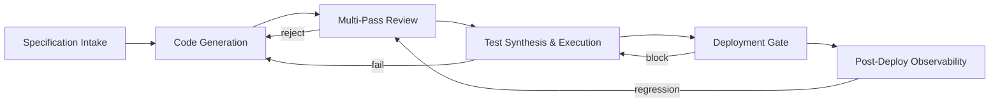

# AMOS Coding Engine Layer Specification

**Origin Architect / Steward:** Trang Phan
**AMOS_CORE Target:** `v4.4`
**Epistemic Class:** `AMOS_MODEL`
**Conclusion Class:** `DERIVED`

> Bridge note — resolves the `amos-coding-engine-layer` link from the Cosmo Brain MOC / daily notes to the real skill in the vault.
> **Skill location:** `.devin/skills/amos-coding-engine-layer`
> **Source model:** `Coding_Engine_Model`

---

## 1. Purpose & Scope

The AMOS Coding Engine Layer governs the full software engineering lifecycle: code generation, automated review, test synthesis, deployment orchestration, and post-deployment observability integration. It bridges cognitive intent to executable artifacts while preserving AMOS epistemic invariants.

**Scope boundaries:**
- **In scope:** Code generation from specifications, multi-pass review, test case synthesis, CI/CD pipeline orchestration, deployment gating, rollback coordination.
- **Out of scope:** Numerical solver implementation (delegated to [[11_KNOWLEDGE/engine/AMOS_NUMERICAL_METHODS_ENGINE_LAYER|Numerical Methods Engine]]), documentation generation (delegated to [[11_KNOWLEDGE/engine/AMOS_DOCUMENTATION_ENGINE_LAYER|Documentation Engine]]).

---

## 2. Architecture

The coding engine implements a 4-phase pipeline with feedback loops. Each phase produces a typed artifact that feeds the next, with rollback checkpoints at every phase boundary.

### Phase Detail

| Phase | Input | Output | Validation Stages | Mutation Class |
|:---|:---|:---|:---|:---|
| Specification Intake | RSCF-tagged spec | `SpecTensor` | 4 | M1 |
| Code Generation | `SpecTensor` | `CodeArtifact` | 6 | M3 |
| Multi-Pass Review | `CodeArtifact` | `ReviewReport` | 7 | M2 |
| Test Synthesis | `CodeArtifact` + `ReviewReport` | `TestSuite` | 6 | M3 |
| Deployment Gate | `TestSuite` (passing) | `DeployDelta` | 8 | M4 |
| Post-Deploy Observability | `DeployDelta` | `TelemetryEnvelope` | 5 | M5 |

---

## 3. Layer Components

### 3.1 Code Generation Sub-Engine

Generates code from formal specifications using:
- **Template binding:** Maps `SpecTensor` fields to code templates with type-safe substitution.
- **Constraint propagation:** Ensures generated code satisfies [[11_KNOWLEDGE/engine/ENGINEERING_STANDARDS_LIBRARY|Engineering Standards]].
- **Style enforcement:** Applies coding conventions from the standards library (naming, formatting, architecture patterns).
- **Multi-language targeting:** Supports Python, TypeScript, Rust, Go output channels.

### 3.2 Multi-Pass Review Sub-Engine

Executes a 5-pass review cycle:
1. **Syntax pass:** AST validation, parse correctness.
2. **Type safety pass:** Type inference, interface contract checking.
3. **Security pass:** Vulnerability scanning, injection detection, capability leakage audit.
4. **Performance pass:** Complexity analysis, memory footprint estimation.
5. **Epistemic pass:** Verifies `DOCUMENTED != IMPLEMENTED` boundary; checks that comments match code behavior.

### 3.3 Test Synthesis Sub-Engine

Generates test suites with:
- **Unit tests:** Per-function boundary condition coverage.
- **Integration tests:** Cross-module contract validation.
- **Property-based tests:** Randomized input generation with shrinking.
- **Regression tests:** Linked to [[11_KNOWLEDGE/engine/AMOS_AUTOMATION_ENGINE_LAYER|Automation Engine]] for CI execution.

### 3.4 Deployment Gate Sub-Engine

Coordinates with [[03_CONTROL_PLANE/03_CONTROL_PLANE_MOC|Control Plane]] for:
- **Capability token verification:** `ValidateToken(τ_s) = TRUE` before deploy.
- **Rollback provisioning:** Every `DeployDelta` carries a reverse-rollback delta.
- **Epoch lease acquisition:** Monotonically increasing epoch counter signed by control plane.

### 3.5 Post-Deploy Observability Sub-Engine

Emits OpenTelemetry v1.34 compatible trace spans with W3C `traceparent` context propagation to [[17_OBSERVABILITY/17_OBSERVABILITY_MOC|Observability]] plane.

---

## 4. Invariants

$$\begin{aligned}
\text{CODE-INV-01} &: \quad \forall \text{deploy } d, \quad \text{Rollback}(d) \circ \text{Apply}(d) = \mathbb{I} \quad \text{(Reversible deploys)} \\
\text{CODE-INV-02} &: \quad \text{Deploy}(d) \implies \text{ValidateToken}(\tau_d) = \text{TRUE} \\
\text{CODE-INV-03} &: \quad \text{Review reject} \implies \text{no code generation output reaches deployment} \\
\text{CODE-INV-04} &: \quad \text{Test pass rate} = 100\% \text{ required for deployment gate} \\
\text{CODE-INV-05} &: \quad \text{Every deployed artifact carries a BLAKE3 receipt: } \mathcal{R} = \text{BLAKE3}(\text{ArtifactID} \parallel \text{Epoch} \parallel \text{StateHash})
\end{aligned}$$

---

## 5. MECE Mapping

Within the [[00_ROOT/FULL_BRAIN_OS_MECE_ARCHITECTURE|Full Brain OS MECE Architecture]]:

- **Functional ownership:** AMOS RUNTIME (typed reasoning/execution state + provenance + audit)
- **Physical storage:** `11_KNOWLEDGE/engine/`
- **Authority precedence:** Bound by [[03_CONTROL_PLANE/03_CONTROL_PLANE_MOC|Control Plane]] deployment authority
- **Runtime call order:** Invoked by [[04_RUNTIME/04_RUNTIME_MOC|Runtime]] for code artifact production
- **Evidence/validation status:** `AMOS_MODEL` / `DERIVED` — structurally specified, not independently verified as deployed runtime

**MECE partition against sibling engines:**

| Engine | Domain | Overlap with Coding |
|:---|:---|:---|
| Automation Engine | Pipeline execution | Executes CI/CD for test phase |
| Documentation Engine | Doc generation | Generates API docs from code |
| Engineering Standards | Conventions | Provides review criteria |
| Numerical Methods | Solvers | Provides computational kernels |

---

## 6. Navigation & Bindings

**Parent MOC:** [[11_KNOWLEDGE/engine/ENGINE_MOC|ENGINE_MOC]]
**Knowledge MOC:** [[11_KNOWLEDGE/KNOWLEDGE_MOC|KNOWLEDGE_MOC]]
**Kernel MOC:** [[11_KNOWLEDGE/kernel/KERNEL_MOC|KERNEL_MOC]]
**Root:** [[00_ROOT/00_HOME|00_HOME]]

**Upstream dependencies:**
- [[11_KNOWLEDGE/engine/ENGINEERING_STANDARDS_LIBRARY|Engineering Standards Library]]
- [[01_CANON/01_CORE_LAWS/AMOS_CORE_LAWS|AMOS Core Laws]]
- [[16_SCHEMAS/16_SCHEMAS_MOC|Schemas]] — typed tensor schemas

**Downstream consumers:**
- [[04_RUNTIME/04_RUNTIME_MOC|Runtime]] — artifact execution
- [[17_OBSERVABILITY/17_OBSERVABILITY_MOC|Observability]] — telemetry egress
- [[19_TESTS/TESTS_TEST_CONTRACT|Test Contract]] — test validation

**Peer engines:**
- [[11_KNOWLEDGE/engine/AMOS_AUTOMATION_ENGINE_LAYER|Automation Engine]] — CI/CD pipeline
- [[11_KNOWLEDGE/engine/AMOS_DOCUMENTATION_ENGINE_LAYER|Documentation Engine]] — API docs
- [[11_KNOWLEDGE/engine/AMOS_NUMERICAL_METHODS_ENGINE_LAYER|Numerical Methods Engine]] — solver code

**Related skills:**
- `.devin/skills/amos-coding-engine-layer`
- `.devin/skills/amos-validation-pipeline`
- `.devin/skills/amos-rollback-recovery`

**Full Brain OS Architecture:** [[00_ROOT/FULL_BRAIN_OS_MECE_ARCHITECTURE|FULL_BRAIN_OS_MECE_ARCHITECTURE]]

---

> **Epistemic boundary:** This specification is an `AMOS_MODEL` / `DERIVED` artifact. `DOCUMENTED != IMPLEMENTED`. `MODEL != DEPLOYED_RUNTIME`.
