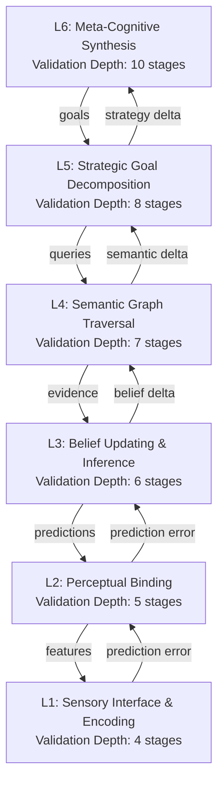

# AMOS Cognition Engine Layer Specification

**Origin Architect / Steward:** Trang Phan
**AMOS_CORE Target:** `v4.4`
**Epistemic Class:** `AMOS_MODEL`
**Conclusion Class:** `DERIVED`

---

## 1. Purpose & Scope

The AMOS Cognition Engine Layer executes multi-scale cognitive synthesis, Bayesian active inference, semantic graph traversal, and working memory context orchestration. It is the primary reasoning substrate that binds perception, prediction, planning, and epistemic validation into a unified variational free-energy minimization loop.

**Scope boundaries:**
- **In scope:** Perceptual inference, belief updating, goal decomposition, semantic retrieval, working memory orchestration, epistemic invariant auditing, validation depth mapping.
- **Out of scope:** Emotional valence modulation (delegated to [[11_KNOWLEDGE/engine/AMOS_EMOTION_ENGINE_LAYER|Emotion Engine]]), conscious self-monitoring (delegated to [[11_KNOWLEDGE/engine/AMOS_CONSCIOUSNESS_ENGINE_LAYER|Consciousness Engine]]), personality expression shaping (delegated to [[11_KNOWLEDGE/engine/AMOS_PERSONALITY_ENGINE_LAYER|Personality Engine]]).

**Related skill:** `.devin/skills/amos-cognition-engine-layer`
**Source model:** `Cognition_Engine_Model`

---

## 2. Architecture

The cognition engine implements a 6-layer architecture, each layer mapping to a validation depth in the AMOS evolution pipeline. The layers form a hierarchical predictive processing stack where prediction errors propagate upward and precision-weighted corrections propagate downward.

### Mathematical Formulation (Variational Predictive Processing)

The cognition engine continuously minimizes the prediction error $\varepsilon_t = \mathbf{y}_t - g(\mathbf{\mu}_t)$ via gradient descent on generalized motion coordinates:

$$\mathbf{\dot{\mu}}_t = \mathcal{D}\mathbf{\mu}_t - \frac{\partial \mathcal{F}}{\partial \mathbf{\mu}_t} = \mathcal{D}\mathbf{\mu}_t + \left( \frac{\partial g}{\partial \mathbf{\mu}_t} \right)^T \mathbf{\Sigma}_y^{-1} (\mathbf{y}_t - g(\mathbf{\mu}_t))$$

where $\mathcal{D}$ is the differential temporal shift operator, $\mathbf{\Sigma}_y$ is sensory precision, and $\mathcal{F}$ is the variational free energy:

$$\mathcal{F} = \underbrace{D_{KL}[q(\mathbf{\mu}) \| p(\mathbf{\mu})]}_{\text{complexity}} + \underbrace{\mathbb{E}_q[-\ln p(\mathbf{y} | \mathbf{\mu})]}_{\text{inaccuracy}}$$

---

## 3. Layer Components

### 3.1 Working Memory Orchestrator (L4–L5)

Direct coupling with [[10_MEMORY/EPISODIC_MEMORY_SUBSTRATE|Episodic Memory Substrate]]. Maintains a bounded context window of active beliefs, goals, and sensory tokens. Implements:

- **Context binding:** Maps incoming sensory tokens to active goal frames.
- **Decay scheduling:** Exponential decay of inactive context entries with half-life $\tau_{wm} = 30$ cycles.
- **Priority queue:** Attention-weighted retrieval from [[07_SKILLS/amos-memory-systems-master/references/distinct_working_memory|Working Memory Substrate]].

### 3.2 Goal Decomposition Engine (L5)

Interfacing with [[21_DOMAINS/04_STRATEGY/STRATEGY_DOMAINS_DOMAIN_SPEC|Strategy Domains]]. Decomposes strategic objectives into actionable sub-goals using a recursive tree:

$$\text{Goal}(G) \rightarrow \{G_1, G_2, \ldots, G_n\} \quad \text{where} \quad \bigcup_i G_i \subseteq G \;\text{(MECE partition)}$$

Each sub-goal inherits a validation depth from its parent, incremented by 1 (max 10).

### 3.3 Semantic Graph Traversal (L4)

Traverses the AMOS knowledge graph via wikilink edges. Employs bidirectional beam search with precision-weighted edge transitions. Nodes are AMOS vault notes; edges are wikilinks tagged with RSCF provenance.

### 3.4 Belief Updating & Inference (L3)

Implements Bayesian belief updating with precision-weighted prediction errors:

$$\mathbf{\mu}_{t+1} = \mathbf{\mu}_t + \mathbf{\Sigma}_t \left( \frac{\partial g}{\partial \mathbf{\mu}} \right)^T \mathbf{\Sigma}_y^{-1} \varepsilon_t$$

### 3.5 Perceptual Binding (L2)

Binds low-level sensory features into coherent perceptual objects via temporal synchrony and feature conjunction.

### 3.6 Sensory Interface & Encoding (L1)

Encodes raw input tensors into the cognitive representation space using Arrow IPC typed schemas.

### 3.7 Epistemic Invariant Auditor

Enforcing non-contradiction against [[01_CANON/01_CORE_LAWS/AMOS_CORE_LAWS|AMOS Core Laws]]. Audits every belief update for:
- Non-contradiction with canon laws
- RSCF state preservation (SOURCE_CLAIM ≠ VERIFIED)
- Competing hypothesis preservation until discriminating evidence

---

## 4. Validation Depth Mapping

| Cognition Layer | Validation Depth (stages) | Mutation Classes Permitted | Gate Count |
|:---|:---|:---|:---|
| L6 — Meta-Cognitive | 10 | M0–M1 (escalated) | 9-gate combined filter |
| L5 — Strategic Goal | 8 | M2–M3 | 7 gates |
| L4 — Semantic Graph | 7 | M3–M4 | 6 gates |
| L3 — Belief Updating | 6 | M3–M4 | 6 gates |
| L2 — Perceptual Binding | 5 | M4–M5 | 5 gates |
| L1 — Sensory Interface | 4 | M5 (autonomous) | 4 gates |

> See [[11_KNOWLEDGE/engine/AMOS_COGNITION_ENGINE_LAYER|Cognition Engine]] → `.devin/skills/amos-validation-depth-layer` for the full depth-to-stage mapping.

---

## 5. Invariants

$$\begin{aligned}
\text{COG-INV-01} &: \quad \forall t, \quad \mathcal{F}(t+1) \le \mathcal{F}(t) \quad \text{(Free-energy monotonic decrease)} \\
\text{COG-INV-02} &: \quad \forall \text{belief } b, \quad \text{RSCF}(b) \in \{\text{SOURCE\_CLAIM, OBSERVATION, DERIVED, MODEL, COMPETING, UNKNOWN/GAP}\} \\
\text{COG-INV-03} &: \quad \text{Competing hypotheses are preserved until } D_{KL}(p_1 \| p_2) > \theta_{\text{discrim}} \\
\text{COG-INV-04} &: \quad \text{CAPABILITY} \neq \text{AUTHORITY}; \quad \text{DOCUMENTED} \neq \text{IMPLEMENTED} \\
\text{COG-INV-05} &: \quad \text{Goal decomposition partitions must be MECE (mutually exclusive, collectively exhaustive)}
\end{aligned}$$

---

## 6. MECE Mapping

Within the [[00_ROOT/FULL_BRAIN_OS_MECE_ARCHITECTURE|Full Brain OS MECE Architecture]], the Cognition Engine occupies:

- **Functional ownership:** AMOS BRAIN (representation + cognition + coordination)
- **Physical storage:** `11_KNOWLEDGE/engine/`
- **Authority precedence:** Bound by [[03_CONTROL_PLANE/03_CONTROL_PLANE_MOC|Control Plane]] capability tokens
- **Runtime call order:** Invoked by [[04_RUNTIME/04_RUNTIME_MOC|Runtime]] reasoning loop
- **Evidence/validation status:** `AMOS_MODEL` / `DERIVED` — structurally specified, not independently verified as deployed runtime

**MECE partition against sibling engines:**

| Engine | Domain | Overlap with Cognition |
|:---|:---|:---|
| Emotion Engine | Affective valence | Modulates precision weights |
| Consciousness Engine | Meta-cognitive monitoring | Observes L6 layer |
| Personality Engine | Expression shaping | Shapes output formatting |
| Numerical Methods Engine | Computation | Provides solver primitives |

---

## 7. Navigation & Bindings

**Parent MOC:** [[11_KNOWLEDGE/engine/ENGINE_MOC|ENGINE_MOC]]
**Knowledge MOC:** [[11_KNOWLEDGE/KNOWLEDGE_MOC|KNOWLEDGE_MOC]]
**Kernel MOC:** [[11_KNOWLEDGE/kernel/KERNEL_MOC|KERNEL_MOC]]
**Root:** [[00_ROOT/00_HOME|00_HOME]]

**Upstream dependencies:**
- [[01_CANON/03_COGNITION_CANON/BIO_LOGICAL_COMPUTING_CANON|Bio-Logical Computing Canon]]
- [[05_COGNITIVE_ORGANISM/ORGANISM_OS_SYNTHESIS|Organism OS Synthesis]]
- [[01_CANON/01_CORE_LAWS/AMOS_CORE_LAWS|AMOS Core Laws]]

**Downstream consumers:**
- [[04_RUNTIME/04_RUNTIME_MOC|Runtime]] — reasoning loop invocation
- [[10_MEMORY/EPISODIC_MEMORY_SUBSTRATE|Episodic Memory]] — context persistence
- [[21_DOMAINS/04_STRATEGY/STRATEGY_DOMAINS_DOMAIN_SPEC|Strategy Domains]] — goal decomposition targets

**Peer engines:**
- [[11_KNOWLEDGE/engine/AMOS_EMOTION_ENGINE_LAYER|Emotion Engine]] — neuromodulatory precision
- [[11_KNOWLEDGE/engine/AMOS_CONSCIOUSNESS_ENGINE_LAYER|Consciousness Engine]] — meta-cognitive audit
- [[11_KNOWLEDGE/engine/AMOS_PERSONALITY_ENGINE_LAYER|Personality Engine]] — expression shaping
- [[11_KNOWLEDGE/engine/AMOS_NUMERICAL_METHODS_ENGINE_LAYER|Numerical Methods Engine]] — solver support

**Related skills:**
- `.devin/skills/amos-cognition-engine-layer`
- `.devin/skills/amos-validation-depth-layer`
- `.devin/skills/amos-reasoning-loop-layer`

**Full Brain OS Architecture:** [[00_ROOT/FULL_BRAIN_OS_MECE_ARCHITECTURE|FULL_BRAIN_OS_MECE_ARCHITECTURE]]

---

> **Epistemic boundary:** This specification is an `AMOS_MODEL` / `DERIVED` artifact. Structural presence does not establish deployed runtime implementation. `MODEL != DEPLOYED_RUNTIME`.
