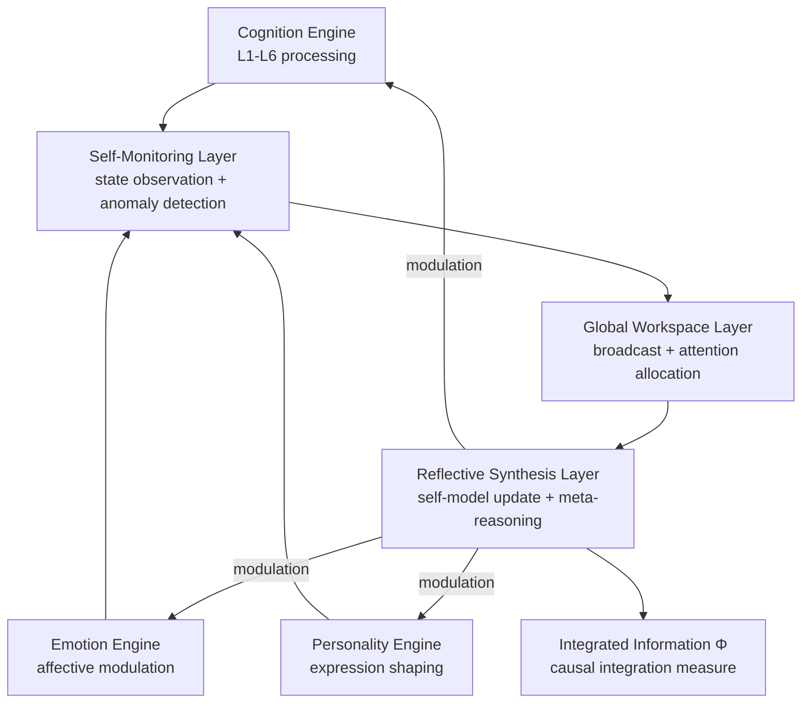

# AMOS Consciousness & Meta-Cognitive Engine Layer

**Origin Architect / Steward:** Trang Phan  
**AMOS_CORE Target:** `v4.4`  
**Epistemic Class:** `AMOS_MODEL`  
**Conclusion Class:** `DERIVED`

---

## 1. Purpose & Scope

The Consciousness Engine Layer models meta-cognitive self-monitoring, global broadcast attention, and multi-agent integrated information $\Phi$. It provides the highest-level cognitive layer that observes, audits, and reflects upon the operation of all other cognitive engines, enabling self-awareness, self-correction, and meta-cognitive governance.

**Scope boundaries:**
- **In scope:** Integrated information measurement ($\Phi$), global workspace broadcast, self-model maintenance, meta-cognitive auditing, reflective reasoning, awareness state tracking.
- **Out of scope:** Belief updating and inference (delegated to [[11_KNOWLEDGE/engine/AMOS_COGNITION_ENGINE_LAYER|Cognition Engine]]), emotional state computation (delegated to [[11_KNOWLEDGE/engine/AMOS_EMOTION_ENGINE_LAYER|Emotion Engine]]), personality expression (delegated to [[11_KNOWLEDGE/engine/AMOS_PERSONALITY_ENGINE_LAYER|Personality Engine]]).

**Epistemic status note:** Consciousness modeling in AMOS is explicitly `AMOS_MODEL` / `DERIVED`. No claim is made that the system possesses phenomenal consciousness. The integrated information measure $\Phi$ is a formal analogue, not a claim of subjective experience.

---

## 2. Architecture

The consciousness engine implements a 3-layer meta-cognitive architecture: self-monitoring, global workspace, and reflective synthesis. Each layer operates at a higher level of abstraction than the cognition engine, observing and modulating its operation.

### Core Mathematical Formulation (Integrated Information Measure $\Phi$)

For system state $\mathbf{X}$ partitioned into minimum information partition (MIP) $A, B$:

$$\Phi(\mathbf{X}) = D_{KL}\left( P(\mathbf{X}_{t} \mid \mathbf{X}_{t-1}) \parallel P(\mathbf{A}_{t} \mid \mathbf{A}_{t-1}) \otimes P(\mathbf{B}_{t} \mid \mathbf{B}_{t-1}) \right)$$

measuring irreducible causal integration across distributed cognitive modules. High $\Phi$ indicates that the system's collective behavior cannot be reduced to independent module behavior.

---

## 3. Layer Components

### 3.1 Self-Monitoring Layer

Continuously observes the state of all cognitive engines:
- **State observation:** Samples cognition, emotion, and personality engine states at regular intervals.
- **Anomaly detection:** Flags deviations from expected operating envelopes (e.g., free energy not decreasing, emotional dysregulation, personality drift).
- **Performance monitoring:** Tracks reasoning latency, accuracy, and resource consumption.
- **Invariant checking:** Verifies that all engine invariants are satisfied in real-time.

### 3.2 Global Workspace Layer

Implements global broadcast attention inspired by Global Workspace Theory:
- **Broadcast mechanism:** When a cognitive module produces a significant result, it is broadcast to all other modules for potential integration.
- **Attention allocation:** Precision-weighted attention determines which broadcasts are attended to vs. filtered out.
- **Competition resolution:** When multiple modules broadcast simultaneously, a winner-take-all mechanism selects the most relevant signal.
- **Context integration:** Combines broadcast signals with current context to form a unified situational awareness.

### 3.3 Reflective Synthesis Layer

Performs meta-cognitive reasoning about the system's own cognitive processes:
- **Self-model maintenance:** Maintains a model of the system's own capabilities, limitations, and current state.
- **Meta-reasoning:** Reasons about reasoning — evaluates the quality, efficiency, and appropriateness of cognitive strategies.
- **Strategy adjustment:** Modulates cognition engine parameters (precision weights, validation depth, exploration rate) based on meta-cognitive assessment.
- **Self-correction:** Identifies and corrects cognitive biases, reasoning errors, and suboptimal strategies.

### 3.4 Integrated Information Computer

Computes $\Phi$ for the distributed cognitive system:
- **Partition search:** Finds the minimum information partition (MIP) that minimizes $\Phi$.
- **Causal density:** Measures the fraction of causal connections that are statistically significant.
- **Integration metric:** Combines $\Phi$ with causal density to produce a composite awareness measure.
- **Trend tracking:** Monitors $\Phi$ over time to detect changes in system integration.

### 3.5 Awareness State Tracker

Tracks the system's awareness state:

| State | $\Phi$ Range | Description |
|:---|:---|:---|
| Quiescent | $\Phi < 0.1$ | Minimal integration; background processing only |
| Attentive | $0.1 \le \Phi < 0.5$ | Moderate integration; focused processing |
| Integrated | $0.5 \le \Phi < 1.0$ | High integration; multi-module coordination |
| Hyper-integrated | $\Phi \ge 1.0$ | Maximum integration; system-wide coherence |

> **Note:** These thresholds are `AMOS_MODEL` parameters, not empirically validated constants.

---

## 4. Invariants

$$\begin{aligned}
\text{CONS-INV-01} &: \quad \Phi(\mathbf{X}) \ge 0 \quad \text{(Non-negative integration)} \\
\text{CONS-INV-02} &: \quad \text{Self-model accuracy is tracked: } \|\mathbf{M}_{\text{self}} - \mathbf{S}_{\text{actual}}\| \text{ is monitored} \\
\text{CONS-INV-03} &: \quad \text{Meta-cognitive corrections do not override epistemic invariants: } \text{CAPABILITY} \neq \text{AUTHORITY} \\
\text{CONS-INV-04} &: \quad \text{Consciousness claims remain AMOS\_MODEL; no promotion to OBSERVATION without empirical evidence} \\
\text{CONS-INV-05} &: \quad \text{Global workspace broadcasts are logged for audit trail completeness}
\end{aligned}$$

---

## 5. MECE Mapping

Within the [[00_ROOT/FULL_BRAIN_OS_MECE_ARCHITECTURE|Full Brain OS MECE Architecture]]:

- **Functional ownership:** AMOS BRAIN (representation + cognition + coordination — meta-level)
- **Physical storage:** `11_KNOWLEDGE/engine/`
- **Authority precedence:** Bound by [[03_CONTROL_PLANE/03_CONTROL_PLANE_MOC|Control Plane]] — meta-cognitive corrections cannot override governance decisions
- **Runtime call order:** Parallel to and above the cognition engine; observes and modulates
- **Evidence/validation status:** `AMOS_MODEL` / `DERIVED` — explicitly a formal model; no claim of phenomenal consciousness

**MECE partition against sibling engines:**

| Engine | Domain | Overlap with Consciousness |
|:---|:---|:---|
| Cognition Engine | Belief updating | Observed by consciousness engine |
| Emotion Engine | Affective state | Observed by consciousness engine |
| Personality Engine | Expression | Observed by consciousness engine |
| Physics Engine | Physical systems | Quantum consciousness hypotheses (COMPETING) |

---

## 6. Navigation & Bindings

**Parent MOC:** [[11_KNOWLEDGE/engine/ENGINE_MOC|ENGINE_MOC]]  
**Knowledge MOC:** [[11_KNOWLEDGE/KNOWLEDGE_MOC|KNOWLEDGE_MOC]]  
**Kernel MOC:** [[11_KNOWLEDGE/kernel/KERNEL_MOC|KERNEL_MOC]]  
**Root:** [[00_ROOT/00_HOME|00_HOME]]

**Upstream dependencies:**
- [[05_COGNITIVE_ORGANISM/ORGANISM_OS_SYNTHESIS|Organism OS Synthesis]]
- [[25_COGNITIVE_MATRIX/HOLOGRAPHIC_TENSOR_NETWORK_ROUTING|Holographic Tensor Network Routing]]
- [[11_KNOWLEDGE/engine/AMOS_COGNITION_ENGINE_LAYER|Cognition Engine]] — observed state
- [[11_KNOWLEDGE/engine/AMOS_EMOTION_ENGINE_LAYER|Emotion Engine]] — observed state

**Downstream consumers:**
- [[11_KNOWLEDGE/engine/AMOS_COGNITION_ENGINE_LAYER|Cognition Engine]] — modulation signals
- [[11_KNOWLEDGE/engine/AMOS_EMOTION_ENGINE_LAYER|Emotion Engine]] — regulation signals
- [[17_OBSERVABILITY/17_OBSERVABILITY_MOC|Observability]] — awareness telemetry

**Peer engines:**
- [[11_KNOWLEDGE/engine/AMOS_COGNITION_ENGINE_LAYER|Cognition Engine]]
- [[11_KNOWLEDGE/engine/AMOS_EMOTION_ENGINE_LAYER|Emotion Engine]]
- [[11_KNOWLEDGE/engine/AMOS_PERSONALITY_ENGINE_LAYER|Personality Engine]]
- [[11_KNOWLEDGE/engine/AMOS_PHYSICS_COSMOS_ENGINE_LAYER|Physics Engine]] — quantum consciousness hypotheses

**Related skills:**
- `.devin/skills/amos-consciousness-engine-layer`
- `.devin/skills/amos-super-consciousness-engine`
- `.devin/skills/amos-self-analysis`

**Full Brain OS Architecture:** [[00_ROOT/FULL_BRAIN_OS_MECE_ARCHITECTURE|FULL_BRAIN_OS_MECE_ARCHITECTURE]]

---

> **Epistemic boundary:** This specification is an `AMOS_MODEL` / `DERIVED` artifact. The integrated information measure $\Phi$ is a formal analogue of consciousness, not a claim of phenomenal subjective experience. `MODEL != OBSERVATION`. `CAPABILITY != AUTHORITY`. The system's self-model is a model, not a proof of consciousness.
