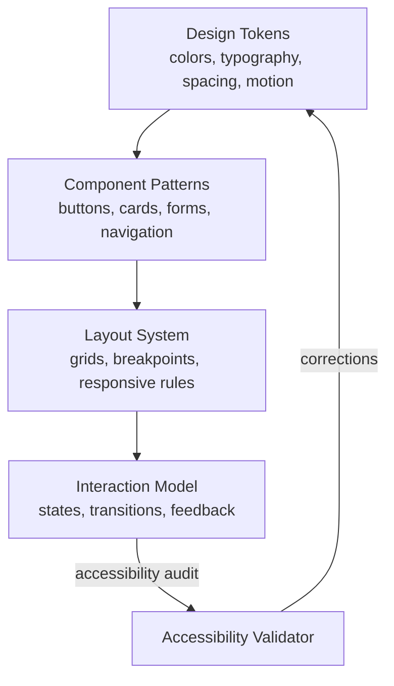

# AMOS Design Language Engine Layer Specification

**Origin Architect / Steward:** Trang Phan  
**AMOS_CORE Target:** `v4.4`  
**Epistemic Class:** `AMOS_MODEL`  
**Conclusion Class:** `DERIVED`

> Bridge note — resolves the `amos-design-language-engine-layer` link from the Cosmo Brain MOC / daily notes to the real skill in the vault.  
> **Skill location:** `.devin/skills/amos-design-language-engine-layer`  
> **Source model:** `Design_Language_Model`

---

## 1. Purpose & Scope

The AMOS Design Language Engine Layer defines the visual communication system, UI/UX pattern library, and design token registry that govern all user-facing interfaces. It translates personality-shaped cognitive outputs into consistent, accessible, and aesthetically coherent visual expressions.

**Scope boundaries:**
- **In scope:** Design token management, UI component patterns, accessibility standards, visual hierarchy rules, color system, typography system, layout grids, interaction patterns.
- **Out of scope:** Personality trait modeling (delegated to [[11_KNOWLEDGE/engine/AMOS_PERSONALITY_ENGINE_LAYER|Personality Engine]]), cognitive content generation (delegated to [[11_KNOWLEDGE/engine/AMOS_COGNITION_ENGINE_LAYER|Cognition Engine]]).

---

## 2. Architecture

The design language engine implements a 4-layer system: design tokens, component patterns, layout system, and interaction model. Each layer builds on the one below, creating a composable hierarchy from atomic values to full-screen experiences.

---

## 3. Layer Components

### 3.1 Design Token Registry

Atomic design values stored as typed key-value pairs:

| Token Category | Examples | Type |
|:---|:---|:---|
| Color | `color.primary.500`, `color.surface.dark` | `RGB \| HSL` |
| Typography | `font.size.md`, `font.weight.bold`, `font.lineHeight.relaxed` | `px \| rem \| ratio` |
| Spacing | `space.4`, `space.padding.lg`, `space.margin.xl` | `px \| rem` |
| Motion | `motion.duration.fast`, `motion.easing.standard` | `ms \| cubic-bezier` |
| Elevation | `elevation.z1`, `elevation.z3` | `shadow definition` |
| Border | `border.radius.md`, `border.width.thin` | `px \| rem` |

Tokens are version-controlled and changes require ARB-02 approval per [[23_OPERATING_MODEL/03_GOVERNANCE_FORUMS/GOVERNANCE_FORUMS|Governance Forums]].

### 3.2 Component Pattern Library

Reusable UI component patterns with typed prop schemas:

- **Buttons:** Primary, secondary, ghost, destructive; sizes sm/md/lg; states default/hover/active/disabled/loading.
- **Cards:** Content card, media card, action card; with optional header/footer slots.
- **Forms:** Text input, select, checkbox, radio, slider; with validation states and error messaging.
- **Navigation:** Top bar, side bar, breadcrumbs, tabs; with active/hover/disabled states.
- **Feedback:** Toast, alert, modal, progress indicator; with severity levels info/warning/error/success.

Each component is defined with:
- **Prop schema:** Typed interface (Protocol Buffers v3 or TypeScript interface).
- **Accessibility contract:** ARIA roles, keyboard navigation, focus management.
- **Visual states:** All interactive states explicitly designed.
- **Composition rules:** How components combine without visual conflict.

### 3.3 Layout System

Defines page-level layout rules:
- **Grid:** 12-column responsive grid with breakpoints at 640px, 768px, 1024px, 1280px, 1536px.
- **Spacing scale:** Base unit 4px; scale: 0, 4, 8, 12, 16, 24, 32, 48, 64, 96.
- **Container widths:** max-width: 1280px (desktop), 100% (mobile).
- **Z-index layers:** background (0), content (10), sticky (20), overlay (30), modal (40), toast (50).

### 3.4 Interaction Model

Defines interaction patterns and motion design:
- **State transitions:** All interactive elements have defined enter/exit/hover/active/focus transitions.
- **Motion duration:** instant (0ms), fast (150ms), standard (250ms), slow (400ms).
- **Easing functions:** `standard` (ease-in-out), `decelerated` (ease-out), `accelerated` (ease-in), `spring` (cubic-bezier(0.34, 1.56, 0.64, 1)).
- **Feedback latency:** Visual feedback within 100ms of user action; loading state within 1000ms.

### 3.5 Accessibility Validator

Enforces WCAG 2.1 AA compliance:
- **Color contrast:** Minimum 4.5:1 for normal text, 3:1 for large text.
- **Keyboard navigation:** All interactive elements reachable via Tab key.
- **Screen reader:** ARIA labels on all icon-only buttons; semantic HTML structure.
- **Focus management:** Visible focus indicators; logical focus order.
- **Reduced motion:** Respects `prefers-reduced-motion` media query.

---

## 4. Invariants

$$\begin{aligned}
\text{DESIGN-INV-01} &: \quad \text{All UI values reference design tokens; no hardcoded values} \\
\text{DESIGN-INV-02} &: \quad \text{WCAG 2.1 AA compliance is non-compensatory: accessibility failure blocks release} \\
\text{DESIGN-INV-03} &: \quad \text{Color contrast: } \text{ratio}(\text{fg}, \text{bg}) \ge 4.5 \text{ for normal text} \\
\text{DESIGN-INV-04} &: \quad \text{All interactive elements have defined states: default, hover, active, focus, disabled} \\
\text{DESIGN-INV-05} &: \quad \text{Design token changes require ARB-02 approval and version increment}
\end{aligned}$$

---

## 5. MECE Mapping

Within the [[00_ROOT/FULL_BRAIN_OS_MECE_ARCHITECTURE|Full Brain OS MECE Architecture]]:

- **Functional ownership:** AMOS BRAIN (representation + world/system modeling)
- **Physical storage:** `11_KNOWLEDGE/engine/`
- **Authority precedence:** Design token changes require ARB-02 approval per [[23_OPERATING_MODEL/03_GOVERNANCE_FORUMS/GOVERNANCE_FORUMS|Governance Forums]]
- **Runtime call order:** Post-processing after personality engine shapes expression
- **Evidence/validation status:** `AMOS_MODEL` / `DERIVED` — structurally specified, not independently verified as deployed runtime

**MECE partition against sibling engines:**

| Engine | Domain | Overlap with Design Language |
|:---|:---|:---|
| Personality Engine | Expression tone | Provides verbal expression; design provides visual |
| Coding Engine | Code generation | Generates component implementations |
| Documentation Engine | Doc generation | Uses design tokens for doc rendering |
| Human Interaction Engine | External interaction | Consumes UI components |

---

## 6. Navigation & Bindings

**Parent MOC:** [[11_KNOWLEDGE/engine/ENGINE_MOC|ENGINE_MOC]]  
**Knowledge MOC:** [[11_KNOWLEDGE/KNOWLEDGE_MOC|KNOWLEDGE_MOC]]  
**Kernel MOC:** [[11_KNOWLEDGE/kernel/KERNEL_MOC|KERNEL_MOC]]  
**Root:** [[00_ROOT/00_HOME|00_HOME]]

**Upstream dependencies:**
- [[11_KNOWLEDGE/engine/AMOS_PERSONALITY_ENGINE_LAYER|Personality Engine]] — expression tone
- [[11_KNOWLEDGE/engine/ENGINEERING_STANDARDS_LIBRARY|Engineering Standards]] — quality criteria
- [[23_OPERATING_MODEL/03_GOVERNANCE_FORUMS/GOVERNANCE_FORUMS|Governance Forums]] — ARB-02 approval

**Downstream consumers:**
- [[11_KNOWLEDGE/engine/3_SPICIES_INTERACTION_ENGINE_HIE_UIFACE|HIE/UIFace]] — UI rendering
- [[11_KNOWLEDGE/engine/AMOS_CODING_ENGINE_LAYER|Coding Engine]] — component code generation
- [[11_KNOWLEDGE/engine/AMOS_DOCUMENTATION_ENGINE_LAYER|Documentation Engine]] — doc styling

**Peer engines:**
- [[11_KNOWLEDGE/engine/AMOS_PERSONALITY_ENGINE_LAYER|Personality Engine]]
- [[11_KNOWLEDGE/engine/AMOS_CODING_ENGINE_LAYER|Coding Engine]]
- [[11_KNOWLEDGE/engine/3_SPICIES_INTERACTION_ENGINE_HIE_UIFACE|HIE/UIFace]]

**Related skills:**
- `.devin/skills/amos-design-language-engine-layer`
- `.devin/skills/amos-design-engine-vinfinity-max`
- `.devin/skills/amos-tech-engine-vinfinity`

**Full Brain OS Architecture:** [[00_ROOT/FULL_BRAIN_OS_MECE_ARCHITECTURE|FULL_BRAIN_OS_MECE_ARCHITECTURE]]

---

> **Epistemic boundary:** This specification is an `AMOS_MODEL` / `DERIVED` artifact. `DOCUMENTED != IMPLEMENTED`. Design system presence does not establish rendered implementation.
