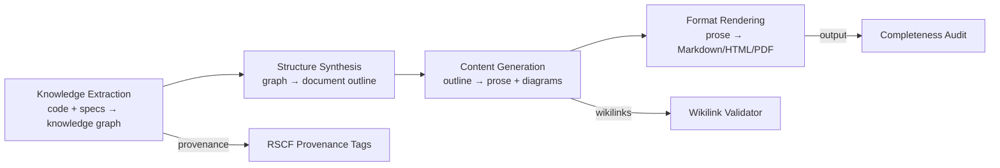

# AMOS Documentation Engine Layer Specification

**Origin Architect / Steward:** Trang Phan
**AMOS_CORE Target:** `v4.4`
**Epistemic Class:** `AMOS_MODEL`
**Conclusion Class:** `DERIVED`

> Bridge note — resolves the `amos-documentation-engine-layer` link from the Cosmo Brain MOC / daily notes to the real skill in the vault.
> **Skill location:** `.devin/skills/amos-documentation-engine-layer`
> **Source model:** `Documentation_Engine_Model`

---

## 1. Purpose & Scope

The AMOS Documentation Engine Layer automates documentation generation, knowledge extraction from code and specifications, and multi-format document rendering. It transforms structured AMOS artifacts into human-readable documentation while preserving RSCF provenance, wikilink integrity, and epistemic class tagging.

**Scope boundaries:**
- **In scope:** API documentation generation, architectural specification rendering, knowledge graph extraction, MOC generation, cross-reference validation, multi-format output (Markdown, HTML, PDF, JSON schema docs).
- **Out of scope:** Code generation (delegated to [[11_KNOWLEDGE/engine/AMOS_CODING_ENGINE_LAYER|Coding Engine]]), visual design (delegated to [[11_KNOWLEDGE/engine/AMOS_DESIGN_LANGUAGE_ENGINE_LAYER|Design Language Engine]]).

---

## 2. Architecture

The documentation engine implements a 4-stage pipeline: knowledge extraction, structure synthesis, content generation, and format rendering. Each stage produces typed artifacts with full provenance tracking.

---

## 3. Layer Components

### 3.1 Knowledge Extraction Sub-Engine

Extracts structured knowledge from source artifacts:
- **Code analysis:** AST parsing to extract function signatures, type definitions, module structure, and dependency graphs.
- **Specification parsing:** Parses RSCF-tagged specification documents to extract requirements, constraints, and invariants.
- **Provenance extraction:** Extracts RSCF state, claim class, and provenance chain from every source artifact.
- **Cross-reference mapping:** Builds a wikilink graph of all `[[00_ROOT/00_ROOT_MOC|display]]` references in the vault.

### 3.2 Structure Synthesis Sub-Engine

Synthesizes document outlines from extracted knowledge:
- **Outline generation:** Creates hierarchical document outlines following the AMOS standard section structure (Purpose & Scope, Architecture, Layer Components, Invariants, MECE Mapping, Navigation & Bindings).
- **MOC generation:** Automatically generates Map of Content files for new knowledge domains.
- **Section ordering:** Determines optimal section ordering based on dependency analysis.
- **Completeness planning:** Identifies sections that require content generation vs. sections that can be extracted directly.

### 3.3 Content Generation Sub-Engine

Generates prose, diagrams, and structured content:
- **Prose generation:** Natural language descriptions of technical concepts, architectures, and procedures.
- **Diagram generation:** Mermaid diagrams for architecture, flowcharts, sequence diagrams, and class diagrams.
- **Table generation:** Structured comparison tables, property tables, and mapping tables.
- **Mathematical rendering:** LaTeX-formatted equations and proofs.
- **Wikilink insertion:** Automatically inserts `[[00_ROOT/00_ROOT_MOC|display]]` wikilinks to related AMOS artifacts.

### 3.4 Format Rendering Sub-Engine

Renders generated content into multiple output formats:
- **Markdown:** Obsidian-compatible Markdown with frontmatter, wikilinks, and mermaid code fences.
- **HTML:** Static HTML with navigation, search, and syntax highlighting.
- **PDF:** Print-ready PDF with table of contents and index.
- **JSON Schema:** Machine-readable schema documentation for API references.

### 3.5 Wikilink Validator

Validates all wikilinks in generated documentation:
- **Existence check:** Verifies that every `[[00_ROOT/00_ROOT_MOC|display]]` target exists in the vault.
- **Bidirectional check:** Identifies orphan notes with no incoming wikilinks.
- **MECE check:** Verifies that documentation structure maintains MECE partitioning.
- **Repair suggestions:** Suggests wikilink corrections for broken references.

### 3.6 Completeness Auditor

Audits generated documentation for completeness:
- **Section coverage:** Verifies all required sections are present and non-empty.
- **Frontmatter validation:** Checks that all required frontmatter fields are present and valid.
- **RSCF tagging:** Verifies that every claim is tagged with appropriate RSCF state.
- **Epistemic class check:** Ensures `AMOS_MODEL` / `DERIVED` artifacts are not presented as `SOURCE_CLAIM` or `OBSERVATION`.

---

## 4. Invariants

$$\begin{aligned}
\text{DOC-INV-01} &: \quad \text{All generated documentation carries RSCF provenance tags} \\
\text{DOC-INV-02} &: \quad \text{All wikilinks are validated: } \forall \text{ link } l, \; \text{target}(l) \text{ exists in vault} \\
\text{DOC-INV-03} &: \quad \text{Generated content does not promote AMOS\_MODEL to SOURCE\_CLAIM or OBSERVATION} \\
\text{DOC-INV-04} &: \quad \text{Documentation is updated within 24 hours of code/spec change} \\
\text{DOC-INV-05} &: \quad \text{Every generated document includes Navigation & Bindings section with parent MOC link}
\end{aligned}$$

---

## 5. MECE Mapping

Within the [[00_ROOT/FULL_BRAIN_OS_MECE_ARCHITECTURE|Full Brain OS MECE Architecture]]:

- **Functional ownership:** AMOS RUNTIME (provenance + audit + knowledge management)
- **Physical storage:** `11_KNOWLEDGE/engine/`
- **Authority precedence:** Bound by [[03_CONTROL_PLANE/03_CONTROL_PLANE_MOC|Control Plane]] — documentation changes to canon require governance approval
- **Runtime call order:** Post-processing after coding engine and specification changes
- **Evidence/validation status:** `AMOS_MODEL` / `DERIVED` — structurally specified, not independently verified as deployed runtime

**MECE partition against sibling engines:**

| Engine | Domain | Overlap with Documentation |
|:---|:---|:---|
| Coding Engine | Code generation | Provides code for API doc extraction |
| Design Language Engine | Visual design | Provides design tokens for doc rendering |
| Automation Engine | Pipeline execution | Executes doc generation workflows |
| Cognition Engine | Reasoning | Provides semantic analysis for extraction |

---

## 6. Navigation & Bindings

**Parent MOC:** [[11_KNOWLEDGE/engine/ENGINE_MOC|ENGINE_MOC]]
**Knowledge MOC:** [[11_KNOWLEDGE/KNOWLEDGE_MOC|KNOWLEDGE_MOC]]
**Kernel MOC:** [[11_KNOWLEDGE/kernel/KERNEL_MOC|KERNEL_MOC]]
**Root:** [[00_ROOT/00_HOME|00_HOME]]

**Upstream dependencies:**
- [[11_KNOWLEDGE/engine/AMOS_CODING_ENGINE_LAYER|Coding Engine]] — code artifacts for extraction
- [[11_KNOWLEDGE/engine/AMOS_COGNITION_ENGINE_LAYER|Cognition Engine]] — semantic analysis
- [[11_KNOWLEDGE/engine/AMOS_DESIGN_LANGUAGE_ENGINE_LAYER|Design Language Engine]] — rendering tokens

**Downstream consumers:**
- [[11_KNOWLEDGE/KNOWLEDGE_MOC|Knowledge MOC]] — generated documentation
- [[11_KNOWLEDGE/engine/ENGINE_MOC|ENGINE_MOC]] — MOC updates
- [[17_OBSERVABILITY/17_OBSERVABILITY_MOC|Observability]] — doc completeness telemetry

**Peer engines:**
- [[11_KNOWLEDGE/engine/AMOS_CODING_ENGINE_LAYER|Coding Engine]]
- [[11_KNOWLEDGE/engine/AMOS_DESIGN_LANGUAGE_ENGINE_LAYER|Design Language Engine]]
- [[11_KNOWLEDGE/engine/AMOS_AUTOMATION_ENGINE_LAYER|Automation Engine]]

**Related skills:**
- `.devin/skills/amos-documentation-engine-layer`
- `.devin/skills/amos-academic-writing-engine-vinfinity`
- `.devin/skills/amos-corp-doc-engine-vinfinity`

**Full Brain OS Architecture:** [[00_ROOT/FULL_BRAIN_OS_MECE_ARCHITECTURE|FULL_BRAIN_OS_MECE_ARCHITECTURE]]

---

> **Epistemic boundary:** This specification is an `AMOS_MODEL` / `DERIVED` artifact. Generated documentation preserves source RSCF states. `DOCUMENTED != IMPLEMENTED`. `MODEL != OBSERVATION`.
