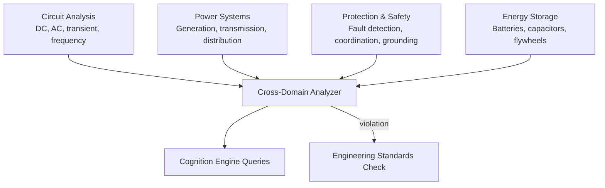

# AMOS Electrical & Power Systems Engine Layer Specification

**Origin Architect / Steward:** Trang Phan  
**AMOS_CORE Target:** `v4.4`  
**Epistemic Class:** `AMOS_MODEL`  
**Conclusion Class:** `DERIVED`

> Bridge note — resolves the `amos-electrical-power-engine-layer` link from the Cosmo Brain MOC / daily notes to the real skill in the vault.  
> **Skill location:** `.devin/skills/amos-electrical-power-engine-layer`  
> **Source model:** `Electrical_Power_Model`

---

## 1. Purpose & Scope

The AMOS Electrical & Power Systems Engine Layer provides structured reasoning about electrical circuits, power distribution, energy systems, and electromagnetic compatibility. It encodes circuit analysis methods, power system stability criteria, and electrical safety standards as queryable knowledge for the AMOS cognitive processes.

**Scope boundaries:**
- **In scope:** Circuit analysis (DC/AC), power flow computation, fault analysis, protection coordination, power quality assessment, energy storage modeling, grid stability analysis, electromagnetic compatibility.
- **Out of scope:** Fundamental electromagnetic theory (shared with [[11_KNOWLEDGE/engine/AMOS_PHYSICS_COSMOS_ENGINE_LAYER|Physics Engine]]), numerical solver implementation (delegated to [[11_KNOWLEDGE/engine/AMOS_NUMERICAL_METHODS_ENGINE_LAYER|Numerical Methods Engine]]).

---

## 2. Architecture

The electrical power engine implements a 4-domain knowledge structure: circuit analysis, power systems, protection & safety, and energy storage. Each domain provides formal models that the cognition engine can query during engineering reasoning.

---

## 3. Layer Components

### 3.1 Circuit Analysis Domain

Encodes fundamental circuit analysis methods:

- **DC analysis:** Ohm's law ($V = IR$), Kirchhoff's voltage law (KVL), Kirchhoff's current law (KCL), nodal analysis, mesh analysis, Thévenin/Norton equivalents.
- **AC analysis:** Phasor representation, impedance ($Z = R + jX$), admittance, complex power ($S = P + jQ$), power factor correction.
- **Transient analysis:** RC/RL/RLC time constants, first/second-order response, Laplace transform methods.
- **Frequency analysis:** Bode plots, transfer functions, resonance, bandwidth, filter design.

### 3.2 Power Systems Domain

Encodes power grid analysis methods:

- **Power flow:** Newton-Raphson and fast-decoupled power flow solvers; bus classification (PQ, PV, slack).
- **Stability analysis:** Small-signal stability, transient stability, voltage stability margins.
- **Economic dispatch:** Generation cost minimization with constraints; optimal power flow (OPF).
- **Grid integration:** Renewable integration (solar, wind), distributed generation, microgrid islanding.

### 3.3 Protection & Safety Domain

Encodes electrical protection and safety standards:

- **Fault analysis:** Three-phase fault, line-to-ground fault, line-to-line fault calculations; fault current estimation.
- **Protection coordination:** Relay coordination curves, fuse coordination, circuit breaker sizing, zone protection.
- **Grounding:** Grounding system design, step/touch potential, ground fault circuit interruption.
- **Safety standards:** NEC, IEC 60364, IEEE 80 (grounding), electrical safety boundaries.

### 3.4 Energy Storage Domain

Encodes energy storage system models:

- **Battery models:** State of charge (SOC), state of health (SOH), internal resistance, capacity fade, calendar vs. cycle aging.
- **Battery chemistry:** Li-ion (NMC, LFP), lead-acid, flow batteries; voltage curves, temperature dependence.
- **Ultracapacitors:** RC equivalent circuit, energy density vs. power density tradeoffs.
- **Flywheels:** Kinetic energy storage $E = \frac{1}{2}I\omega^2$, mechanical-to-electrical conversion.

### 3.5 Cross-Domain Analyzer

Validates multi-domain electrical reasoning:
- **Power balance:** Generation = Load + Losses (at every bus, every time step).
- **Voltage constraints:** Bus voltages within $[0.95, 1.05]$ pu under normal conditions.
- **Thermal limits:** Line/transformer loading below rated thermal capacity.
- **Protection coordination:** No protection device operates outside its coordination zone.

---

## 4. Invariants

$$\begin{aligned}
\text{ELEC-INV-01} &: \quad \text{KCL: } \sum I_{\text{node}} = 0 \quad \text{(charge conservation)} \\
\text{ELEC-INV-02} &: \quad \text{KVL: } \sum V_{\text{loop}} = 0 \quad \text{(energy conservation)} \\
\text{ELEC-INV-03} &: \quad \text{Power balance: } P_{\text{gen}} = P_{\text{load}} + P_{\text{loss}} \quad \text{(at every bus)} \\
\text{ELEC-INV-04} &: \quad \text{Voltage limits: } 0.95 \le V_{\text{pu}} \le 1.05 \quad \text{(normal operation)} \\
\text{ELEC-INV-05} &: \quad \text{Protection devices must coordinate: no misoperation outside designed zones}
\end{aligned}$$

---

## 5. MECE Mapping

Within the [[00_ROOT/FULL_BRAIN_OS_MECE_ARCHITECTURE|Full Brain OS MECE Architecture]]:

- **Functional ownership:** AMOS BRAIN (world/system modeling — electrical domain)
- **Physical storage:** `11_KNOWLEDGE/engine/`
- **Authority precedence:** Bound by [[03_CONTROL_PLANE/03_CONTROL_PLANE_MOC|Control Plane]] and [[11_KNOWLEDGE/engine/ENGINEERING_STANDARDS_LIBRARY|Engineering Standards]]
- **Runtime call order:** Queried by [[11_KNOWLEDGE/engine/AMOS_COGNITION_ENGINE_LAYER|Cognition Engine]] during electrical engineering reasoning
- **Evidence/validation status:** `AMOS_MODEL` / `DERIVED` — structurally specified; established electrical laws are `SOURCE_CLAIM`, system models are `AMOS_MODEL`

**MECE partition against sibling engines:**

| Engine | Domain | Overlap with Electrical |
|:---|:---|:---|
| Physics Engine | EM theory | Shares Maxwell's equations |
| Numerical Methods | Computation | Solves power flow equations |
| Engineering Standards | Safety standards | Provides electrical safety criteria |
| Cognition Engine | Reasoning | Queries electrical domain knowledge |

---

## 6. Navigation & Bindings

**Parent MOC:** [[11_KNOWLEDGE/engine/ENGINE_MOC|ENGINE_MOC]]  
**Knowledge MOC:** [[11_KNOWLEDGE/KNOWLEDGE_MOC|KNOWLEDGE_MOC]]  
**Kernel MOC:** [[11_KNOWLEDGE/kernel/KERNEL_MOC|KERNEL_MOC]]  
**Root:** [[00_ROOT/00_HOME|00_HOME]]

**Upstream dependencies:**
- [[11_KNOWLEDGE/engine/AMOS_PHYSICS_COSMOS_ENGINE_LAYER|Physics Engine]] — EM fundamentals
- [[11_KNOWLEDGE/engine/AMOS_NUMERICAL_METHODS_ENGINE_LAYER|Numerical Methods Engine]] — solver support
- [[11_KNOWLEDGE/engine/ENGINEERING_STANDARDS_LIBRARY|Engineering Standards]] — safety standards

**Downstream consumers:**
- [[11_KNOWLEDGE/engine/AMOS_COGNITION_ENGINE_LAYER|Cognition Engine]] — electrical reasoning queries
- [[11_KNOWLEDGE/engine/AMOS_CODING_ENGINE_LAYER|Coding Engine]] — electrical system code generation
- [[11_KNOWLEDGE/engine/ENGINEERING_STANDARDS_LIBRARY|Engineering Standards]] — compliance verification

**Peer engines:**
- [[11_KNOWLEDGE/engine/AMOS_PHYSICS_COSMOS_ENGINE_LAYER|Physics Engine]]
- [[11_KNOWLEDGE/engine/AMOS_NUMERICAL_METHODS_ENGINE_LAYER|Numerical Methods Engine]]
- [[11_KNOWLEDGE/engine/ENGINEERING_STANDARDS_LIBRARY|Engineering Standards]]

**Related skills:**
- `.devin/skills/amos-electrical-power-engine-layer`
- `.devin/skills/amos-tech-engine-vinfinity`
- `.devin/skills/amos-canonical-systems-layer`

**Full Brain OS Architecture:** [[00_ROOT/FULL_BRAIN_OS_MECE_ARCHITECTURE|FULL_BRAIN_OS_MECE_ARCHITECTURE]]

---

> **Epistemic boundary:** Established electrical laws (Ohm, Kirchhoff, Maxwell) are `SOURCE_CLAIM`. Power system models and stability analyses are `AMOS_MODEL` / `DERIVED`. `MODEL != OBSERVATION`.
