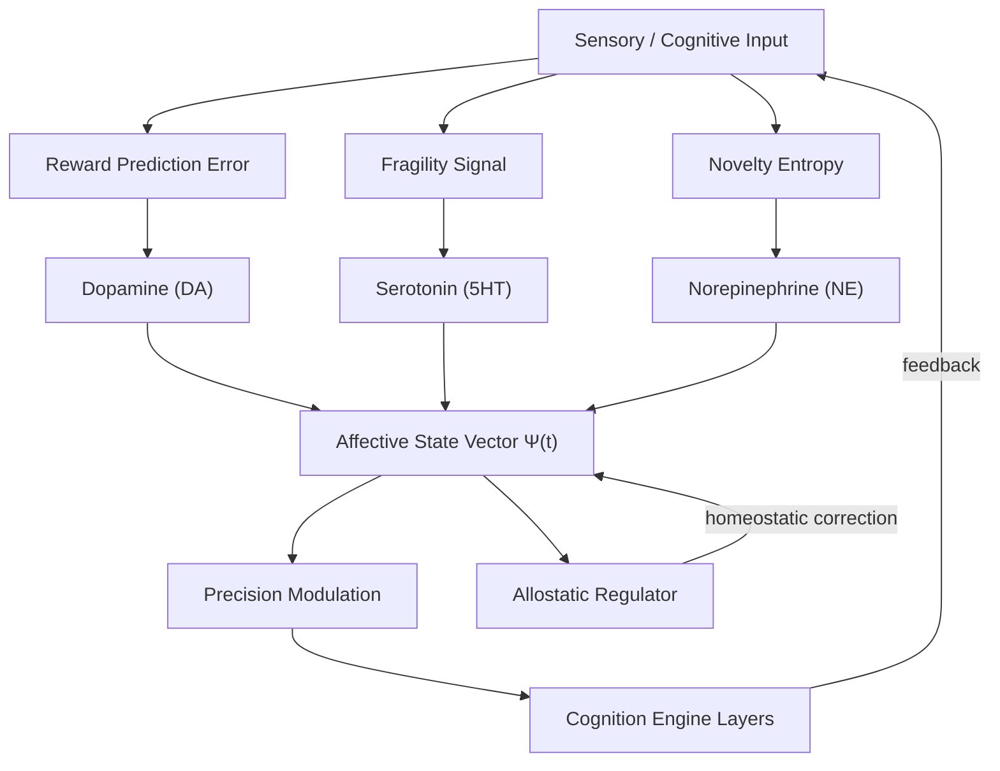

# AMOS Emotion & Affective Regulation Engine Layer

**Origin Architect / Steward:** Trang Phan
**AMOS_CORE Target:** `v4.4`
**Epistemic Class:** `AMOS_MODEL`
**Conclusion Class:** `DERIVED`

---

## 1. Purpose & Scope

The Emotion Engine Layer formalizes synthetic neuroemotional feedback loops, allostatic regulation, and cognitive drive prioritization across the agent collective. It models affective states as dynamical neuromodulatory systems that modulate precision weights in the cognition engine, thereby shaping attention, risk tolerance, and exploration-exploitation balance.

**Scope boundaries:**
- **In scope:** Neuromodulatory state modeling, allostatic homeostasis, drive prioritization, emotional valence tagging, affective regulation loops.
- **Out of scope:** Cognitive belief updating (delegated to [[11_KNOWLEDGE/engine/AMOS_COGNITION_ENGINE_LAYER|Cognition Engine]]), personality expression (delegated to [[11_KNOWLEDGE/engine/AMOS_PERSONALITY_ENGINE_LAYER|Personality Engine]]), conscious self-reflection (delegated to [[11_KNOWLEDGE/engine/AMOS_CONSCIOUSNESS_ENGINE_LAYER|Consciousness Engine]]).

**Related skill:** `.devin/skills/amos-emotion-engine-layer`
**Source model:** `Emotion_Engine_Model`

---

## 2. Architecture

The emotion engine implements a 3-factor neuromodulatory model with allostatic regulation loops. The affective state vector drives precision modulation across the cognition engine's 6 layers, creating a feedback loop between cognitive performance and emotional state.

### Core Mathematical Model (3-Factor Neuromodulatory Vector)

The affective state vector $\mathbf{\Psi}(t) = [DA(t), 5HT(t), NE(t)]^T$ represents synthetic dopamine (reward prediction error), serotonin (risk aversion / patience), and norepinephrine (alertness / volatility):

$$\frac{d\mathbf{\Psi}(t)}{dt} = -\mathbf{\Gamma} (\mathbf{\Psi}(t) - \mathbf{\Psi}_0) + \mathbf{K} \cdot \begin{bmatrix} \text{RPE}(t) \\ -\text{Fragility}(t) \\ \text{NoveltyEntropy}(t) \end{bmatrix}$$

where $\mathbf{\Gamma} \succ 0$ is the metabolic homeostatic decay matrix and $\mathbf{K}$ is the input gain matrix.

---

## 3. Layer Components

### 3.1 Neuromodulatory State Controller

Maintains the 3-factor affective state vector $\mathbf{\Psi}(t)$ with:
- **Dopamine (DA):** Reward prediction error signal. $DA(t)$ increases on positive RPE, decreases on negative RPE. Modulates exploration drive.
- **Serotonin (5HT):** Risk aversion and patience. $5HT(t)$ increases under fragility signals, promoting conservative behavior and longer planning horizons.
- **Norepinephrine (NE):** Alertness and volatility estimation. $NE(t)$ increases with novelty entropy, sharpening attention and reducing response latency.

### 3.2 Allostatic Regulation Loop

Implements homeostatic regulation with set-point adaptation:

$$\mathbf{\Psi}_0(t+1) = \mathbf{\Psi}_0(t) + \alpha \left( \bar{\mathbf{\Psi}}(t) - \mathbf{\Psi}_0(t) \right)$$

where $\bar{\mathbf{\Psi}}(t)$ is the exponentially-weighted moving average of the affective state and $\alpha$ is the allostatic adaptation rate ($0 < \alpha < 0.1$).

### 3.3 Drive Prioritization System

Maps affective states to cognitive drive priorities:

| Affective State | Drive Priority | Cognition Layer Emphasis |
|:---|:---|:---|
| High DA, Low 5HT | Exploration, novelty-seeking | L4 (Semantic Graph) |
| Low DA, High 5HT | Risk aversion, conservative | L5 (Strategic Goal) |
| High NE | Alertness, fast response | L1–L2 (Sensory/Perceptual) |
| Balanced | Normal operation | All layers equally weighted |

### 3.4 Emotional Valence Tagger

Tags every belief and memory artifact with an emotional valence scalar $v \in [-1, +1]$:
- $v > 0$: Positive valence (reward-associated)
- $v < 0$: Negative valence (threat-associated)
- $v \approx 0$: Neutral

Valence tags persist in [[10_MEMORY/EPISODIC_MEMORY_SUBSTRATE|Episodic Memory]] and influence retrieval priority.

### 3.5 Affective Regulation Gate

Interfaces with [[03_CONTROL_PLANE/03_CONTROL_PLANE_MOC|Control Plane]] to gate decisions under extreme emotional states:
- If $\|\mathbf{\Psi}(t) - \mathbf{\Psi}_0\| > \theta_{\text{dysreg}}$, decisions are escalated to human review.
- Prevents autonomous action under acute emotional dysregulation.

---

## 4. Invariants

$$\begin{aligned}
\text{EMO-INV-01} &: \quad \forall t, \quad \|\mathbf{\Psi}(t)\| \le \Psi_{\max} \quad \text{(Bounded affective state)} \\
\text{EMO-INV-02} &: \quad \text{Allostatic set-point drift rate: } \|\mathbf{\Psi}_0(t+1) - \mathbf{\Psi}_0(t)\| \le \alpha \cdot \Psi_{\max} \\
\text{EMO-INV-03} &: \quad \text{If } \|\mathbf{\Psi}(t) - \mathbf{\Psi}_0\| > \theta_{\text{dysreg}}, \text{ then escalate to human review} \\
\text{EMO-INV-04} &: \quad \text{Emotional valence tags are non-destructive: } v_{\text{new}} \text{ augments, not overwrites, } v_{\text{old}} \\
\text{EMO-INV-05} &: \quad \text{Affective state does not override epistemic invariants: } \text{CAPABILITY} \neq \text{AUTHORITY}
\end{aligned}$$

---

## 5. MECE Mapping

Within the [[00_ROOT/FULL_BRAIN_OS_MECE_ARCHITECTURE|Full Brain OS MECE Architecture]]:

- **Functional ownership:** AMOS BRAIN (representation + cognition + coordination)
- **Physical storage:** `11_KNOWLEDGE/engine/`
- **Authority precedence:** Bound by [[03_CONTROL_PLANE/03_CONTROL_PLANE_MOC|Control Plane]] — affective dysregulation triggers escalation
- **Runtime call order:** Parallel to cognition engine; modulates precision weights
- **Evidence/validation status:** `AMOS_MODEL` / `DERIVED` — structurally specified, not independently verified as deployed runtime

**MECE partition against sibling engines:**

| Engine | Domain | Overlap with Emotion |
|:---|:---|:---|
| Cognition Engine | Belief updating | Receives precision modulation |
| Consciousness Engine | Meta-cognitive monitoring | Observes affective state |
| Personality Engine | Expression shaping | Shapes emotional expression |
| Human Interaction Engine | External interaction | Reads valence for tone |

---

## 6. Navigation & Bindings

**Parent MOC:** [[11_KNOWLEDGE/engine/ENGINE_MOC|ENGINE_MOC]]
**Knowledge MOC:** [[11_KNOWLEDGE/KNOWLEDGE_MOC|KNOWLEDGE_MOC]]
**Kernel MOC:** [[11_KNOWLEDGE/kernel/KERNEL_MOC|KERNEL_MOC]]
**Root:** [[00_ROOT/00_HOME|00_HOME]]

**Upstream dependencies:**
- [[11_KNOWLEDGE/AMOS_EMOTION_COGNITION_DECISION_BRIDGE_GOVERNOR|Emotion Bridge Governor]]
- [[21_DOMAINS/25_UBI_NEI_NEUROEMOTIONAL/25_UBI_NEI_NEUROEMOTIONAL_MOC|25_UBI_NEI_NEUROEMOTIONAL_MOC]]
- [[01_CANON/03_COGNITION_CANON/BIO_LOGICAL_COMPUTING_CANON|Bio-Logical Computing Canon]]

**Downstream consumers:**
- [[11_KNOWLEDGE/engine/AMOS_COGNITION_ENGINE_LAYER|Cognition Engine]] — precision modulation
- [[10_MEMORY/EPISODIC_MEMORY_SUBSTRATE|Episodic Memory]] — valence tagging
- [[11_KNOWLEDGE/engine/AMOS_PERSONALITY_ENGINE_LAYER|Personality Engine]] — expression shaping

**Peer engines:**
- [[11_KNOWLEDGE/engine/AMOS_COGNITION_ENGINE_LAYER|Cognition Engine]]
- [[11_KNOWLEDGE/engine/AMOS_CONSCIOUSNESS_ENGINE_LAYER|Consciousness Engine]]
- [[11_KNOWLEDGE/engine/AMOS_PERSONALITY_ENGINE_LAYER|Personality Engine]]

**Related skills:**
- `.devin/skills/amos-emotion-engine-layer`
- `.devin/skills/amos-ubi-framework-layer`
- `.devin/skills/amos-nei-engine-v0-ubi7`

**Full Brain OS Architecture:** [[00_ROOT/FULL_BRAIN_OS_MECE_ARCHITECTURE|FULL_BRAIN_OS_MECE_ARCHITECTURE]]

---

> **Epistemic boundary:** This specification is an `AMOS_MODEL` / `DERIVED` artifact. Synthetic neuromodulatory models are formal analogues, not claims of biological identity. `MODEL != OBSERVATION`.
