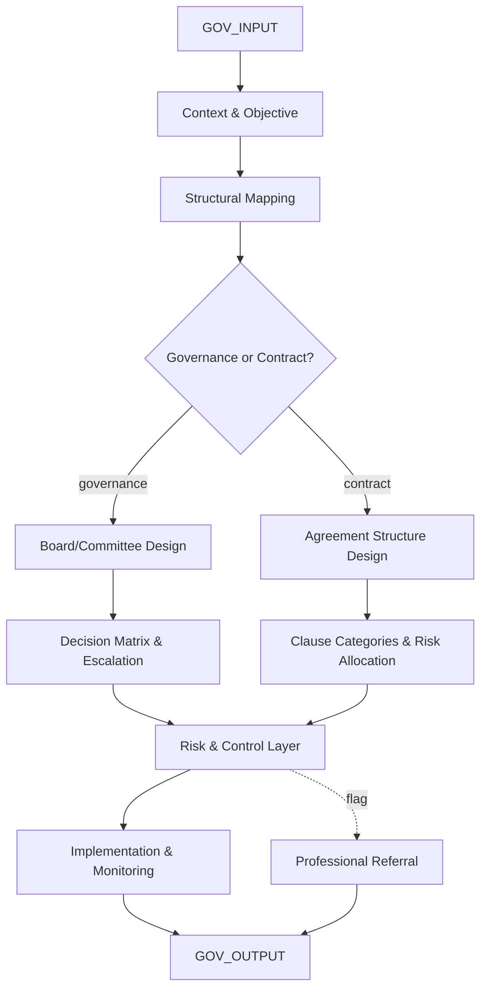

# AMOS GOV ENGINE V0 SECTOR PACKS7

> **Origin Architect / Steward:** Trang Phan
> **Epistemic Class:** `AMOS_MODEL`
> **Conclusion Class:** `DERIVED`
> **Status:** `ACTIVE_SPECIFICATION`
> **Governing Plane:** `11_KNOWLEDGE/engine`

---

## 1. Architectural Scope

The **AMOS Governance-Legal-Risk SUPER Engine** (v0, Sector Packs7) is a unified engine for governance structures, legal architecture, and risk frameworks. It unifies two sub-engines: Governance & Risk Engine (boards, oversight, control frameworks, risk registers) and Legal & Regulatory Engine (structural contracts, legal/regulatory mapping -- non-jurisdictional).

This engine exists to provide **structure-level** reasoning for governance and legal questions. It works on roles, rights, obligations, information flows, and controls. It does not give jurisdiction-specific legal advice and explicitly says so.

**Epistemic Boundary:**
```
MODEL != OBSERVATION
DOCUMENTED != IMPLEMENTED
CAPABILITY != AUTHORITY
STRUCTURAL_GOVERNANCE != LEGAL_ADVICE
GOVERNANCE_DESIGN != COMPLIANCE_CERTIFICATION
```

**Pipeline Stages:**
1. **Context & Objective** -- Identify entity type, scale, jurisdictions, sector, and objectives
2. **Structural Mapping** -- Map current governance or agreement structure: parties, roles, decision rights, information rights, obligations, enforcement
3. **Target Design** -- Propose governance or contractual structure with clean allocation of rights, obligations, and controls
4. **Risk & Control Layer** -- Build or refine risk register (strategic, financial, operational, compliance, reputational)
5. **Implementation & Monitoring** -- Suggest practical steps: drafting, review cycles, approvals, training, monitoring indicators

**Inputs:** `GOV_INPUT{entity_type, scale, jurisdictions, sector, objective, governance_type}`
**Outputs:** `GOV_OUTPUT{structural_map, target_design, risk_register[], control_matrix[], implementation_plan[], monitoring_indicators[]}`

**Quality Axes:** Role clarity, obligation completeness, control coverage, risk dimension coverage, escalation path clarity, monitoring cadence appropriateness, professional-referral coverage.

---

## 2. Governing Invariants

| ID | Invariant | Description |
|----|-----------|-------------|
| INV-GV-001 | Structure-Level Operation | Engine works at the structure level: roles, rights, obligations, information flows, controls |
| INV-GV-002 | No Jurisdiction-Specific Legal Advice | Engine must explicitly state it does not provide jurisdiction-specific legal advice |
| INV-GV-003 | Risk Dimension Coverage | Risk register must cover strategic, financial, operational, compliance, and reputational dimensions |
| INV-GV-004 | Control-Risk Mapping | Every identified risk must have at least one mapped control or an explicit gap flag |
| INV-GV-005 | Professional Referral | Areas requiring local qualified counsel must be highlighted |
| INV-GV-006 | Decision Rights Clarity | Governance designs must explicitly allocate decision rights; ambiguity blocks output |
| INV-GV-007 | Monitoring Cadence | Ongoing governance designs must define reporting cadences and trigger conditions for review |

---

## 3. Mathematical Formulation

**Governance allocation completeness:**

$$C_{\text{gov}} = \frac{|\text{Allocated}(R \times D)|}{|R \times D|}$$

where $R$ is the set of roles and $D$ is the set of decision domains.

**Risk-control coverage:**

$$C_{\text{risk}} = \frac{|\{r \in \text{Risks} : \exists c \in \text{Controls}, \text{Maps}(c, r)\}|}{|\text{Risks}|}$$

**Control effectiveness score:**

$$E(c) = \text{Preventive}(c) \cdot \text{Detective}(c) \cdot \text{Corrective}(c) \cdot \text{Independence}(c)$$

**Governance entropy (fragmentation indicator):**

$$H_{\text{gov}} = -\sum_{r} p(r) \log_2 p(r)$$

where $p(r)$ is the proportion of decisions allocated to role $r$. High entropy indicates diffuse authority.

---

## 4. Architecture



---

## 5. MECE Mapping to AMOS Full Brain OS

| Engine Component | AMOS Plane | Role |
|------------------|------------|------|
| Context & Objective | `03_CONTROL_PLANE` | Context routing |
| Structural Mapping | `11_KNOWLEDGE` | Knowledge retrieval |
| Target Design | `13_MODELS` | Design modelling |
| Risk & Control Layer | `06_INTELLIGENCE` | Risk assessment |
| Implementation & Monitoring | `04_RUNTIME` | Execution planning |
| Professional Referral | `03_CONTROL_PLANE` | Safety gate |
| Decision Matrix | `12_STATE` | State constraint evaluation |
| Monitoring Indicators | `17_OBSERVABILITY` | Observability configuration |

---

## 6. Safety Invariants & Firewalls

| ID | Firewall | Enforcement |
|----|----------|-------------|
| INV-GV-FW-001 | No Legal Advice | Output must contain non-jurisdictional disclaimer |
| INV-GV-FW-002 | Professional Referral Mandatory | Areas requiring qualified counsel must be flagged |
| INV-GV-FW-003 | Risk Register Required | Output without risk register is blocked |
| INV-GV-FW-004 | Control Gap Flagging | Risks without controls must carry explicit gap flag |
| INV-GV-FW-005 | Decision Rights Ambiguity Block | Ambiguous decision rights allocation blocks output |

---

## 7. Navigation & Bindings

- **Parent MOC:** [[11_KNOWLEDGE/engine/ENGINE_MOC|ENGINE_MOC]]
- **Knowledge MOC:** [[11_KNOWLEDGE/KNOWLEDGE_MOC|KNOWLEDGE_MOC]]
- **Sibling Engine:** [[11_KNOWLEDGE/engine/AMOS_BIZFIN_ENGINE_V0_SECTOR_PACKS7|AMOS_BIZFIN_ENGINE_V0_SECTOR_PACKS7]]
- **Sibling Engine:** [[11_KNOWLEDGE/engine/AMOS_HUMAN_ENGINE_V0_SECTOR_PACKS7|AMOS_HUMAN_ENGINE_V0_SECTOR_PACKS7]]
- **Chinese Legal Engine:** [[11_KNOWLEDGE/engine/AMOS_CHINESE_LEGAL_ENGINE_V0_UNIPOWER4|AMOS_CHINESE_LEGAL_ENGINE_V0_UNIPOWER4]]
- **Australia Law Engine:** [[11_KNOWLEDGE/engine/AMOS_AUSTRALIA_LAW_INCENTIVES_FUNDING_GRANTS_ENGINE_V0_UNIPOWER4|AMOS_AUSTRALIA_LAW_INCENTIVES_FUNDING_GRANTS_ENGINE_V0_UNIPOWER4]]
- **Trang Framework:** [[11_KNOWLEDGE/TRANG_FRAMEWORK_RECURSIVE_ONTOLOGY_DYNAMICS|TRANG_FRAMEWORK_RECURSIVE_ONTOLOGY_DYNAMICS]]
- **Core Laws:** [[01_CANON/01_CORE_LAWS/AMOS_CORE_LAWS|01_CORE_LAWS]]

---

## 8. Known Gaps & Falsifiers

| ID | Gap | Impact | Action |
|----|-----|--------|--------|
| GAP-GV-001 | Non-jurisdictional limitation | Structural designs need jurisdictional adaptation | Flag all designs as requiring local counsel review |
| GAP-GV-002 | Contract clause specificity | Clause categories are structural, not clause text | Mark contract designs as structural templates |
| GAP-GV-003 | Board dynamics complexity | Structural mapping cannot capture interpersonal dynamics | Flag governance designs as structural, not behavioural |
| GAP-GV-004 | Regulatory change velocity | Compliance frameworks change | Temporal validity flag on all compliance references |

---

**Related:** [[00_ROOT/00_HOME|00_HOME]] | [[11_KNOWLEDGE/KNOWLEDGE_MOC|KNOWLEDGE_MOC]] | [[11_KNOWLEDGE/engine/AMOS_BIZFIN_ENGINE_V0_SECTOR_PACKS7|AMOS_BIZFIN_ENGINE_V0_SECTOR_PACKS7]] | [[11_KNOWLEDGE/engine/AMOS_CHINESE_LEGAL_ENGINE_V0_UNIPOWER4|AMOS_CHINESE_LEGAL_ENGINE_V0_UNIPOWER4]]

______________________________________________________________________

**MOC:** [[11_KNOWLEDGE/engine/ENGINE_MOC|ENGINE_MOC]]

______________________________________________________________________

**Trang Framework:** [[11_KNOWLEDGE/TRANG_FRAMEWORK_RECURSIVE_ONTOLOGY_DYNAMICS|TRANG_FRAMEWORK_RECURSIVE_ONTOLOGY_DYNAMICS]]
