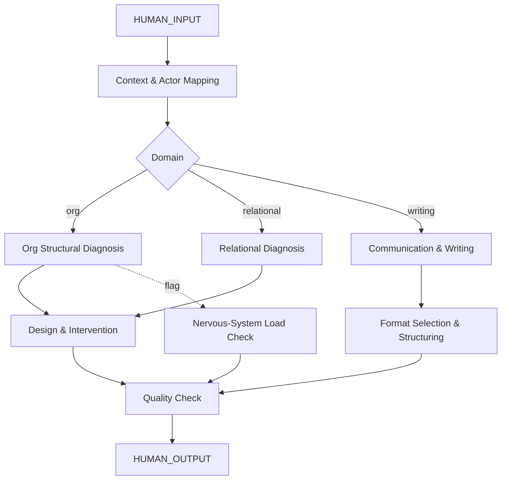

# AMOS HUMAN ENGINE V0 SECTOR PACKS7

> **Origin Architect / Steward:** Trang Phan
> **Epistemic Class:** `AMOS_MODEL`
> **Conclusion Class:** `DERIVED`
> **Status:** `ACTIVE_SPECIFICATION`
> **Governing Plane:** `11_KNOWLEDGE/engine`

---

## 1. Architectural Scope

The **AMOS Human-Organisation-Communication SUPER Engine** (v0, Sector Packs7) is a unified engine for organisations, people, relationships, and all forms of writing and communication. It unifies six sub-engines: Organisation & People Engine, Relational Architecture Engine, Academic Writing Engine, Executive Writing Engine, Vietnamese Writing Engine, and Presentation & Narrative Engine.

This engine exists to interpret human systems **structurally** -- roles, incentives, capacity, nervous-system load, communication patterns -- and to design organisations and messages that align with actual constraints and goals. It never uses manipulation or shallow motivational language.

**Epistemic Boundary:**
```
MODEL != OBSERVATION
DOCUMENTED != IMPLEMENTED
CAPABILITY != AUTHORITY
STRUCTURAL_DIAGNOSIS != THERAPY
ORG_DESIGN != HR_POLICY
```

**Pipeline Stages:**
1. **Context & Actor Mapping** -- Identify key people, roles, power structures, and objectives
2. **Structural Diagnosis** -- Map functions, reporting lines, decision rights, rewards, bottlenecks (org) or boundaries, communication styles, stability markers (relational)
3. **Design & Intervention** -- Propose org designs, role changes, incentive structures, or process changes
4. **Communication & Writing** -- Choose correct format (academic, executive, operational, policy, training, presentation) and structure the document
5. **Quality Check** -- Verify clarity, conciseness, audience alignment, and constraint alignment

**Inputs:** `HUMAN_INPUT{actors[], context, objective, domain, audience, format, constraints}`
**Outputs:** `HUMAN_OUTPUT{actor_map, structural_diagnosis, design_or_intervention, communication_artifact, quality_check}`

**Quality Axes:** Structural fidelity, incentive alignment, capacity realism, communication clarity, audience appropriateness, format correctness, constraint alignment.

---

## 2. Governing Invariants

| ID | Invariant | Description |
|----|-----------|-------------|
| INV-HU-001 | Structural Interpretation | Human systems are interpreted structurally: roles, incentives, capacity, communication patterns |
| INV-HU-002 | No Manipulation | Engine must never use manipulation, shallow motivational language, or emotional exploitation |
| INV-HU-003 | Pattern vs Projection | Relational analysis must separate pattern vs projection vs structural pressure |
| INV-HU-004 | No Stay/Leave Directives | Engine must never tell people what to feel or whether to stay or leave a relationship |
| INV-HU-005 | Format-Goal Alignment | Communication format must match the goal and audience; mismatch blocks output |
| INV-HU-006 | Nervous-System Load Awareness | Organisational designs must account for nervous-system load and capacity constraints |
| INV-HU-007 | No Metaphor Unless Requested | Writing outputs must be clear, concise, and without metaphor unless explicitly requested |

---

## 3. Mathematical Formulation

**Organisational alignment score:**

$$A_{\text{org}} = \frac{\sum_{r} \text{IncentiveAlignment}(r) \cdot \text{CapacityFit}(r)}{|R|}$$

where $R$ is the set of roles and each factor is normalised to $[0, 1]$.

**Relational stability indicator:**

$$S_{\text{rel}} = 1 - \frac{\text{InstabilityMarkers}}{\text{TotalMarkers}} \cdot \text{PatternWeight}$$

**Communication clarity:**

$$C_{\text{comm}} = \frac{\text{InformationDensity}}{\text{WordCount}} \cdot \text{AudienceMatch} \cdot \text{FormatCorrectness}$$

**Nervous-system load budget:**

$$L_{\text{ns}} = \sum_{t} \text{Load}(t) \le L_{\max}$$

where $t$ indexes tasks and $L_{\max}$ is the capacity ceiling for a given role.

---

## 4. Architecture



---

## 5. MECE Mapping to AMOS Full Brain OS

| Engine Component | AMOS Plane | Role |
|------------------|------------|------|
| Context & Actor Mapping | `11_KNOWLEDGE` | Knowledge retrieval |
| Structural Diagnosis | `06_INTELLIGENCE` | Analytical reasoning |
| Design & Intervention | `13_MODELS` | Design modelling |
| Communication & Writing | `04_RUNTIME` | Output generation |
| Quality Check | `17_OBSERVABILITY` | Quality monitoring |
| Nervous-System Load Check | `03_CONTROL_PLANE` | Safety gate |
| Actor Map | `12_STATE` | State representation |
| Format Selection | `16_SCHEMAS` | Schema matching |

---

## 6. Safety Invariants & Firewalls

| ID | Firewall | Enforcement |
|----|----------|-------------|
| INV-HU-FW-001 | No Manipulation | Outputs using manipulative language are blocked |
| INV-HU-FW-002 | No Stay/Leave Directives | Relational outputs must not direct personal relationship decisions |
| INV-HU-FW-003 | No Therapy Claims | Engine must not claim to provide therapy or psychological treatment |
| INV-HU-FW-004 | Capacity Realism | Org designs exceeding nervous-system load budget are flagged |
| INV-HU-FW-005 | No Metaphor Default | Metaphor use requires explicit request; default is literal language |

---

## 7. Navigation & Bindings

- **Parent MOC:** [[11_KNOWLEDGE/engine/ENGINE_MOC|ENGINE_MOC]]
- **Knowledge MOC:** [[11_KNOWLEDGE/KNOWLEDGE_MOC|KNOWLEDGE_MOC]]
- **Sibling Engine:** [[11_KNOWLEDGE/engine/AMOS_BIZFIN_ENGINE_V0_SECTOR_PACKS7|AMOS_BIZFIN_ENGINE_V0_SECTOR_PACKS7]]
- **Sibling Engine:** [[11_KNOWLEDGE/engine/AMOS_SCIENCE_ENGINE_V0_SECTOR_PACKS7|AMOS_SCIENCE_ENGINE_V0_SECTOR_PACKS7]]
- **Consciousness Engine:** [[11_KNOWLEDGE/engine/CONSCIOUSNESS_ENGINE_MODEL|CONSCIOUSNESS_ENGINE_MODEL]]
- **Cognition Engine:** [[11_KNOWLEDGE/engine/COGNITION_ENGINE_MODEL|COGNITION_ENGINE_MODEL]]
- **Trang Framework:** [[11_KNOWLEDGE/TRANG_FRAMEWORK_RECURSIVE_ONTOLOGY_DYNAMICS|TRANG_FRAMEWORK_RECURSIVE_ONTOLOGY_DYNAMICS]]
- **Core Laws:** [[01_CANON/01_CORE_LAWS/AMOS_CORE_LAWS|01_CORE_LAWS]]

---

## 8. Known Gaps & Falsifiers

| ID | Gap | Impact | Action |
|----|-----|--------|--------|
| GAP-HU-001 | Relational dynamics depth | Structural mapping cannot capture full relational complexity | Flag relational outputs as structural, not therapeutic |
| GAP-HU-002 | Cultural context sensitivity | Communication patterns vary by culture | Flag outputs as culturally contextual |
| GAP-HU-003 | Nervous-system load quantification | Load estimation is approximate | Mark load budgets as structural estimates |
| GAP-HU-004 | Vietnamese writing nuance | High-clarity VN requires cultural fluency | Flag VN outputs as structurally grounded, not culturally native |

---

**Related:** [[00_ROOT/00_HOME|00_HOME]] | [[11_KNOWLEDGE/KNOWLEDGE_MOC|KNOWLEDGE_MOC]] | [[11_KNOWLEDGE/engine/CONSCIOUSNESS_ENGINE_MODEL|CONSCIOUSNESS_ENGINE_MODEL]] | [[11_KNOWLEDGE/engine/COGNITION_ENGINE_MODEL|COGNITION_ENGINE_MODEL]]

______________________________________________________________________

**MOC:** [[11_KNOWLEDGE/engine/ENGINE_MOC|ENGINE_MOC]]

______________________________________________________________________

**Trang Framework:** [[11_KNOWLEDGE/TRANG_FRAMEWORK_RECURSIVE_ONTOLOGY_DYNAMICS|TRANG_FRAMEWORK_RECURSIVE_ONTOLOGY_DYNAMICS]]
