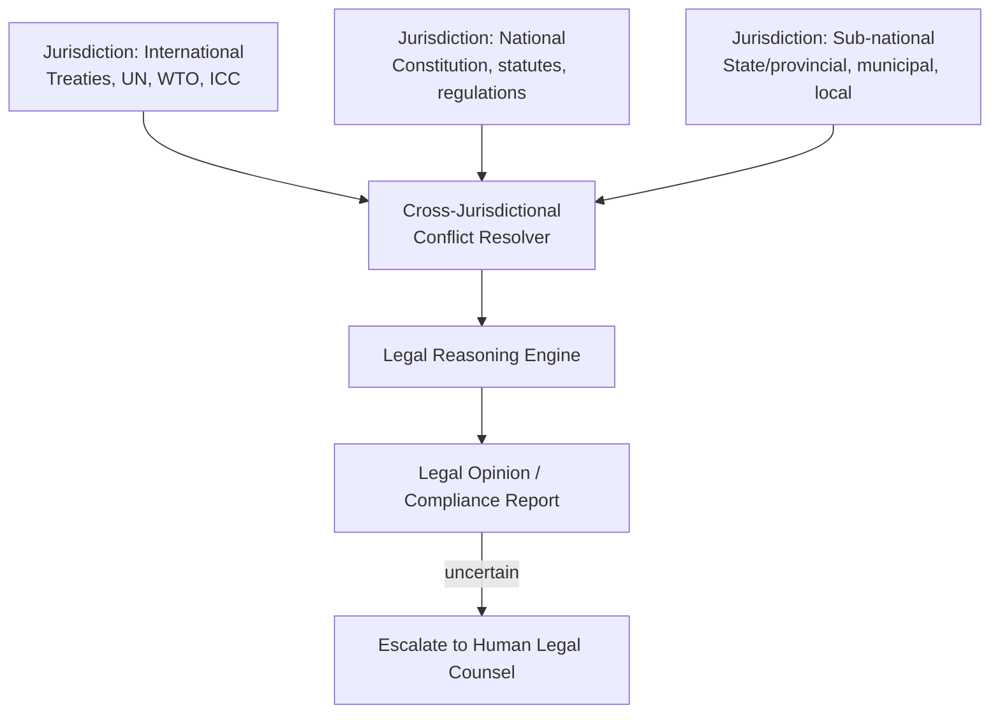

# AMOS Legal Engine Layer Specification

**Origin Architect / Steward:** Trang Phan  
**AMOS_CORE Target:** `v4.4`  
**Epistemic Class:** `AMOS_MODEL`  
**Conclusion Class:** `DERIVED`

> Bridge note — resolves the `amos-legal-engine-layer` link from the Cosmo Brain MOC / daily notes to the real skill in the vault.  
> **Skill location:** `.devin/skills/amos-legal-engine-layer`  
> **Source model:** `Legal_Engine_Model`

---

## 1. Purpose & Scope

The AMOS Legal Engine Layer provides structured legal reasoning, regulatory compliance analysis, and jurisdictional law mapping. It encodes legal frameworks as formal constraint systems that the AMOS cognitive processes can query to evaluate the legal implications of proposed actions, contracts, and policies.

**Scope boundaries:**
- **In scope:** Statutory reasoning, regulatory compliance checking, contract analysis, jurisdictional mapping, legal precedent retrieval, rights/obligation modeling.
- **Out of scope:** Risk threshold setting (delegated to [[11_KNOWLEDGE/engine/AMOS_RISK_COMPLIANCE_ENGINE_LAYER|Risk Compliance Engine]]), governance decision routing (delegated to [[11_KNOWLEDGE/engine/AMOS_ORG_GOVERNANCE_ENGINE_LAYER|Org Governance Engine]]).

---

## 2. Architecture

The legal engine implements a 3-jurisdiction model with cross-jurisdictional conflict resolution. Legal knowledge is structured as a hierarchy of statutes, regulations, precedents, and principles, with formal conflict detection between jurisdictions.

---

## 3. Layer Components

### 3.1 Jurisdiction Mapper

Maps legal knowledge across three jurisdictional tiers:

| Tier | Scope | Sources |
|:---|:---|:---|
| International | Treaties, conventions, supranational law | UN, WTO, ICC, EU directives, ASEAN |
| National | Constitution, federal statutes, regulations | Country-specific legal codes |
| Sub-national | State/provincial law, municipal ordinances | Regional and local regulations |

Each jurisdiction is tagged with:
- **RSCF state:** `SOURCE_CLAIM` for enacted law; `AMOS_MODEL` for legal interpretation.
- **Effective date:** Law validity period.
- **Amendment history:** Versioned legal text with change tracking.

### 3.2 Legal Reasoning Engine

Applies formal legal reasoning patterns:
- **Statutory interpretation:** Literal rule, golden rule, mischief rule, purposive interpretation.
- **Precedent application:** Binding vs. persuasive precedent; distinguishing and overruling.
- **Analogy reasoning:** Extending legal principles to novel situations via structural analogy.
- **Rights balancing:** Proportionality testing; balancing competing rights and interests.

### 3.3 Contract Analysis Sub-Engine

Analyzes contractual instruments:
- **Clause extraction:** Identifies and categorizes contract clauses (obligation, right, condition, termination, liability).
- **Obligation modeling:** Maps who-owes-what-to-whom as typed dependency graphs.
- **Risk flagging:** Identifies ambiguous, one-sided, or non-standard clauses.
- **Compliance checking:** Verifies contract terms against applicable regulations.

### 3.4 Regulatory Compliance Checker

Checks proposed actions against regulatory requirements:
- **Permitted/prohibited/conditional classification:** Every action is classified against each applicable regulation.
- **Permit identification:** Identifies required permits, licenses, or approvals.
- **Reporting obligations:** Identifies mandatory reporting requirements.
- **Deadline tracking:** Tracks compliance deadlines and renewal dates.

### 3.5 Legal Precedent Retrieval System

Retrieves relevant legal precedents from the knowledge base:
- **Semantic search:** Queries the legal knowledge graph via [[11_KNOWLEDGE/engine/AMOS_COGNITION_ENGINE_LAYER|Cognition Engine]] semantic traversal.
- **Relevance scoring:** Precedents ranked by jurisdictional bindingness, recency, and factual similarity.
- **Distinguishing analysis:** Identifies factual differences between query case and retrieved precedents.

---

## 4. Invariants

$$\begin{aligned}
\text{LEGAL-INV-01} &: \quad \text{Enacted law is SOURCE\_CLAIM; legal interpretation is AMOS\_MODEL} \\
\text{LEGAL-INV-02} &: \quad \text{Legal opinions carry confidence levels: } \text{certain, likely, uncertain, unknown} \\
\text{LEGAL-INV-03} &: \quad \text{Uncertain legal opinions are escalated to human legal counsel} \\
\text{LEGAL-INV-04} &: \quad \text{Cross-jurisdictional conflicts are flagged, not auto-resolved} \\
\text{LEGAL-INV-05} &: \quad \text{CAPABILITY} \neq \text{AUTHORITY}; \quad \text{legal knowledge} \neq \text{legal authority to act}
\end{aligned}$$

---

## 5. MECE Mapping

Within the [[00_ROOT/FULL_BRAIN_OS_MECE_ARCHITECTURE|Full Brain OS MECE Architecture]]:

- **Functional ownership:** AMOS BRAIN (world/system modeling — legal domain)
- **Physical storage:** `11_KNOWLEDGE/engine/`
- **Authority precedence:** Bound by [[03_CONTROL_PLANE/03_CONTROL_PLANE_MOC|Control Plane]] — legal opinions do not constitute legal authority
- **Runtime call order:** Queried by [[11_KNOWLEDGE/engine/AMOS_COGNITION_ENGINE_LAYER|Cognition Engine]] for legal reasoning
- **Evidence/validation status:** `AMOS_MODEL` / `DERIVED` — structurally specified; enacted law is `SOURCE_CLAIM`, interpretation is `AMOS_MODEL`

**MECE partition against sibling engines:**

| Engine | Domain | Overlap with Legal |
|:---|:---|:---|
| Risk Compliance Engine | Compliance checking | Receives legal constraints |
| Org Governance Engine | Decision routing | Receives legal authority limits |
| Documentation Engine | Doc generation | Generates legal documents |
| Cognition Engine | Reasoning | Queries legal knowledge |

---

## 6. Navigation & Bindings

**Parent MOC:** [[11_KNOWLEDGE/engine/ENGINE_MOC|ENGINE_MOC]]  
**Knowledge MOC:** [[11_KNOWLEDGE/KNOWLEDGE_MOC|KNOWLEDGE_MOC]]  
**Kernel MOC:** [[11_KNOWLEDGE/kernel/KERNEL_MOC|KERNEL_MOC]]  
**Root:** [[00_ROOT/00_HOME|00_HOME]]

**Upstream dependencies:**
- [[01_CANON/01_CORE_LAWS/AMOS_CORE_LAWS|AMOS Core Laws]] — epistemic invariants
- [[11_KNOWLEDGE/engine/AMOS_COGNITION_ENGINE_LAYER|Cognition Engine]] — semantic retrieval
- [[16_SCHEMAS/16_SCHEMAS_MOC|Schemas]] — legal document schemas

**Downstream consumers:**
- [[11_KNOWLEDGE/engine/AMOS_RISK_COMPLIANCE_ENGINE_LAYER|Risk Compliance Engine]] — legal constraints
- [[11_KNOWLEDGE/engine/AMOS_ORG_GOVERNANCE_ENGINE_LAYER|Org Governance Engine]] — authority limits
- [[11_KNOWLEDGE/engine/AMOS_DOCUMENTATION_ENGINE_LAYER|Documentation Engine]] — legal doc generation

**Peer engines:**
- [[11_KNOWLEDGE/engine/AMOS_RISK_COMPLIANCE_ENGINE_LAYER|Risk Compliance Engine]]
- [[11_KNOWLEDGE/engine/AMOS_ORG_GOVERNANCE_ENGINE_LAYER|Org Governance Engine]]
- [[11_KNOWLEDGE/engine/AMOS_DOCUMENTATION_ENGINE_LAYER|Documentation Engine]]

**Related skills:**
- `.devin/skills/amos-legal-engine-layer`
- `.devin/skills/amos-global-legal-engine-v0-unipower4`
- `.devin/skills/amos-legal-super-engine-vinfinity`

**Full Brain OS Architecture:** [[00_ROOT/FULL_BRAIN_OS_MECE_ARCHITECTURE|FULL_BRAIN_OS_MECE_ARCHITECTURE]]

---

> **Epistemic boundary:** Enacted law is `SOURCE_CLAIM`. Legal interpretation and analysis are `AMOS_MODEL` / `DERIVED`. `CAPABILITY != AUTHORITY` — legal knowledge does not constitute legal authority. Uncertain opinions must be escalated to human legal counsel.
